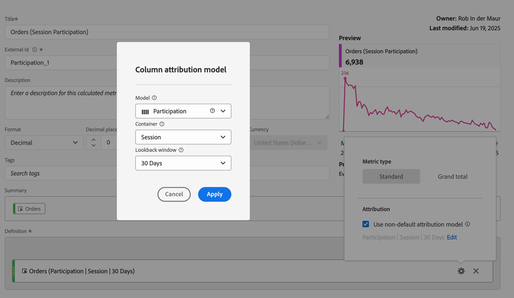
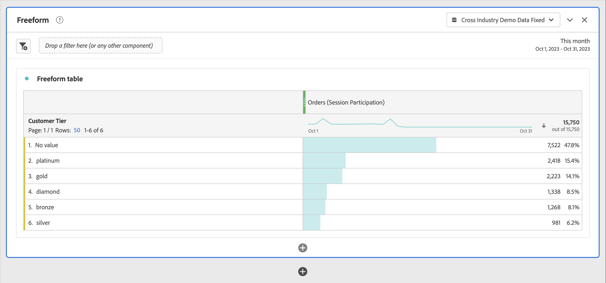

# Metriche di partecipazione.

Le metriche di partecipazione vengono utilizzate per quantificare il modo in cui i singoli valori di una dimensione (come Visualizzazioni di pagina) contribuiscono o partecipano a sessioni che contengono una metrica specifica (come Ordini).

>[!NOTE]
>
>Gli amministratori possono creare metriche con modelli di attribuzione non predefiniti, ad esempio Partecipazione, come parte di una [visualizzazione dati](https://experienceleague.adobe.com/it/docs/analytics-platform/using/cja-dataviews/data-views). Per ulteriori dettagli, consulta [Impostazioni del componente di attribuzione](../../../data-views/component-settings/attribution.md).

I passaggi seguenti mostrano come qualsiasi utente con l&#39;autorizzazione [Crea metrica calcolata](/help/technotes//access-control.md#user-level-access) può creare una metrica di partecipazione.

1. [Creare una metrica calcolata](cm-workflow.md) e nel [Generatore di metriche calcolate](cm-build-metrics.md), denominare la metrica `Participation` o una metrica simile.
1. Trascinare una metrica contenente un evento di successo, ad esempio [!DNL Orders], nell&#39;area [!UICONTROL **[!UICONTROL Definizione]**].
1. Selezionare  per la metrica.
1. Nel popup visualizzato, selezionare **[!UICONTROL Utilizza un modello di attribuzione non predefinito]** per definire il [modello di attribuzione](/help/components/calc-metrics/cm-workflow/m-metric-type-alloc.md) dell&#39;evento a **[!UICONTROL Partecipazione]** e selezionare **[!UICONTROL Sessione]** per [!UICONTROL Contenitore]. Seleziona **[!UICONTROL Applica]** per confermare.

   

   **(Partizione|Sessione)** è stato aggiunto al nome del componente della metrica.

1. Seleziona [!UICONTROL **Salva**] per salvare la metrica.
1. Utilizza la metrica calcolata nel rapporto. Ad esempio, utilizza la metrica [!DNL Orders (Session Participation)] calcolata in un rapporto per mostrare quale livello cliente ha contribuito (o partecipato) alle sessioni che contenevano un ordine.

   
