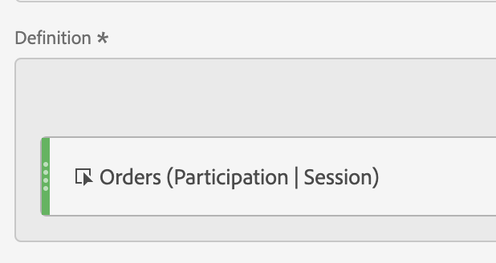

# Creare una metrica “Partecipazione”

Le informazioni seguenti spiegano come creare una metrica che mostra quali pagine hanno contribuito (o partecipato) a sessioni contenenti un ordine.

Questo tipo di informazioni potrebbe essere utile per qualsiasi proprietario di contenuto.

>[!NOTE]
>
>Le metriche con altri modelli di attribuzione, ad esempio Partecipazione, possono essere create dagli amministratori come parte di un [visualizzazione dati](https://experienceleague.adobe.com/docs/analytics-platform/using/cja-dataviews/data-views.html?lang=it). L’esempio seguente mostra come possono essere create da qualsiasi utente con accesso al generatore di metriche calcolate in Workspace.

1. Inizia a creare una metrica, come descritto in [Creare metriche](/help/components/calc-metrics/cm-workflow/cm-build-metrics.md).
1. Nel generatore di metriche calcolate, denomina la metrica &quot;Partecipazione&quot; o qualcosa di simile.
1. Trascina l’evento di successo &quot;Ordini&quot; nell’area di lavoro Definizione.
1. Modificare il [modello di attribuzione](/help/components/calc-metrics/cm-workflow/m-metric-type-alloc.md) di tale evento a **[!UICONTROL Participation]** sotto **[!UICONTROL Settings]** ingranaggio. Seleziona **[!UICONTROL Session]** lookback. La definizione deve essere simile alla seguente:

   

1. Seleziona [!UICONTROL **Salva**] per salvare la metrica.
1. Utilizzare la metrica calcolata in una **[!UICONTROL Pages]** rapporto.

   

1. (Facoltativo) Condividi la metrica con altri utenti dell’organizzazione, come descritto in [Condividere le metriche calcolate](/help/components/calc-metrics/cm-workflow/cm-sharing.md).
