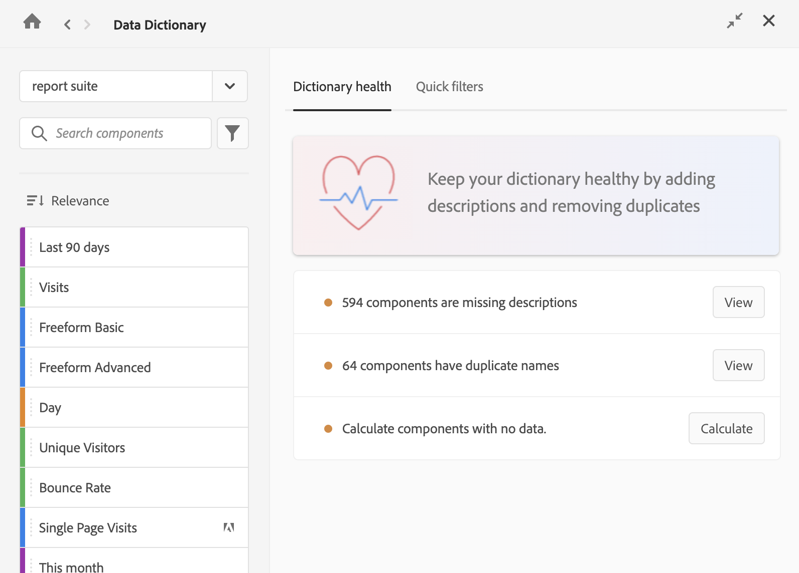

# Modifica voci componente

Gli amministratori di Customer Journey Analytics possono modificare le voci dei componenti nel dizionario dati per una determinata visualizzazione dati. Tutte le modifiche apportate sono visibili a tutti gli utenti della visualizzazione dati.

Per modificare un componente nel dizionario dei dati:

1. Vai al progetto Analysis Workspace che contiene il componente da modificare.

1. Seleziona l&#39;icona **Dizionario dati** nel pannello dei pulsanti di Analysis Workspace. I modi alternativi per accedere al dizionario dati sono descritti in “Accedere al dizionario dei dati” in [Panoramica del dizionario dei dati](/help/components/data-dictionary/data-dictionary-overview.md).

   Viene visualizzata la finestra Dizionario dei dati.

   

1. Verifica che nel menu a discesa sia selezionata la visualizzazione dati corretta. Per impostazione predefinita, viene visualizzata la visualizzazione dati in cui si è già connessi.

1. (Facoltativo) Nel campo di ricerca, inizia a digitare il nome del componente che desideri modificare.

   Il tipo di componente può essere identificato sia dal colore che dall’icona.

   * **Le dimensioni**  sono arancioni

   * **I segmenti**  è blu

   * **Gli intervalli di date**  sono viola

   * **Le metriche**  sono verdi

   * **Icona Adobe**  indica un modello di metrica calcolata o un modello di segmento

   * **Icona Calcolatore**  indica una metrica calcolata creata da un amministratore Analytics nell&#39;organizzazione

1. (Facoltativo) Seleziona l’icona **Filtro**  e quindi una delle seguenti opzioni per filtrare l’elenco dei componenti:

   | Opzione | Funzione |
   |---------|----------|
   | **[!UICONTROL Approvato]** | Mostra solo i componenti contrassegnati come approvati da un amministratore. |
   | **[!UICONTROL Preferiti]** | Mostra solo i componenti inclusi nell’elenco dei Preferiti. Per informazioni sull’aggiunta di componenti all’elenco dei preferiti, consulta [Panoramica dei componenti](/help/components/overview.md). |
   | **[!UICONTROL Dimensioni]** | Mostra solo i componenti che sono Dimensioni. Questa opzione è disponibile anche nella scheda **[!UICONTROL Segmenti rapidi]** quando si accede per la prima volta al dizionario dati. |
   | **[!UICONTROL Metriche]** | Mostra solo i componenti che sono Metriche. Questa opzione è disponibile anche nella scheda **[!UICONTROL Segmenti rapidi]** quando si accede per la prima volta al dizionario dati. |
   | **[!UICONTROL Segmenti]** | Mostra solo i componenti che sono Segmenti. Questa opzione è disponibile anche nella scheda **[!UICONTROL Segmenti rapidi]** quando si accede per la prima volta al dizionario dati. |
   | **[!UICONTROL Intervalli di date]** | Mostra solo i componenti che sono Intervalli di date. Questa opzione è disponibile anche nella scheda **[!UICONTROL Segmenti rapidi]** quando si accede per la prima volta al dizionario dati. |
   | **[!UICONTROL Mostra tutti]** | Mostra tutti i componenti. Questa opzione è disponibile solo per gli amministratori. |
   | **[!UICONTROL Non approvato]** | Mostra solo i componenti non ancora contrassegnati come approvati da un amministratore. In qualità di amministratore, questo è utile per identificare i componenti che richiedono la revisione e l’approvazione. Questa opzione è disponibile solo per gli amministratori. |
   | **[!UICONTROL Descrizione mancante]** | Mostra solo i componenti che non dispongono ancora di una descrizione nel campo apposito. Questa opzione è disponibile solo per gli amministratori. |
   | **[!UICONTROL Mostra duplicati]** | Mostra solo i componenti con lo stesso nome o la stessa descrizione di un altro componente nella visualizzazione dati selezionata. Sono inclusi i componenti creati e quelli forniti da Adobe. I nomi o le descrizioni devono avere corrispondenze esatte per poter essere visualizzati come duplicati. Questa opzione è disponibile solo per gli amministratori. |
   | **[!UICONTROL Nessun dato recente]** | Mostra solo i componenti che non hanno raccolto dati negli ultimi 90 giorni. Questa opzione è disponibile solo per gli amministratori. |
   | **[!UICONTROL Creato da Adobe]** <!-- I don't see this option--> | Mostra solo i componenti creati da Adobe. Ad esempio, **[!UICONTROL Adobe Target]**. I componenti creati da un amministratore o da un altro utente dell’organizzazione non vengono visualizzati. |

   {style="table-layout:auto"}

1. (Facoltativo) Seleziona l&#39;icona **Ordina** , quindi seleziona una delle seguenti opzioni di segmento per ordinare l&#39;elenco dei componenti:

   | Opzione | Funzione |
   |---------|----------|
   | [!UICONTROL **Consigliato**] | Ordina i componenti a partire da quelli consigliati. I componenti utilizzati più di frequente e più di recente da te o da altri nella tua organizzazione vengono visualizzati più in alto nell’elenco. |
   | [!UICONTROL **Alfabetico**] | Ordina alfabeticamente i componenti. |
   | [!UICONTROL **Per categorie**] | Ordina i componenti in base al tipo (dimensione, metrica, segmento, intervallo di date). |

   {style="table-layout:auto"}

1. Dall’elenco dei componenti, seleziona il componente da modificare.

1. Seleziona l’icona **Modifica**  accanto al nome del componente.

1. Modifica una delle seguenti informazioni sul componente:

   | Opzione | Funzione |
   |---------|----------|
   | **[!UICONTROL Approvato]** | 
Indica che il componente è stato rivisto e approvato dall’amministratore.

Gli amministratori visualizzano un&#39;opzione per **[!UICONTROL annullare l&#39;approvazione]**. Selezionando questa opzione, il componente viene contrassegnato come &quot;Non approvato&quot; per gli utenti.
 |
   | **[!UICONTROL Non approvato]** | 
Indica che il componente non è ancora stato rivisto e approvato dall’amministratore.

Gli amministratori visualizzano l’opzione **[!UICONTROL Approva]**. Selezionando questa opzione, il componente viene visualizzato dagli utenti come “Approvato”.
 |
   | **[!UICONTROL Descrizione]** | Descrive la funzione prevista del componente. (Queste informazioni vengono aggiunte dall’amministratore di Analytics, come descritto in [Aggiungi descrizioni dei componenti](/help/components/add-component-descriptions.md).) |
   | **[!UICONTROL Utilizzato di frequente con]** | 
Mostra i componenti più comunemente utilizzati insieme a quello che stai visualizzando.

Tra i 5 tipi di componenti principali, ne sono mostrati fino a 5: Metrica, Metrica calcolata, Dimensione, Segmento e Intervallo di date.

Questo elenco è basato sui dati degli ultimi 90 giorni. Vengono mostrati solo i componenti a cui hai accesso alla visualizzazione.

Gli amministratori possono curare i componenti che gli utenti possono visualizzare in questa sezione, selezionandoli nei campi a discesa **[!UICONTROL Includi sempre]** ed **[!UICONTROL Escludi sempre]**. Prima di curare i componenti visualizzati dagli utenti, applica il segmento **Mostra tutto** per assicurarti di visualizzare eventuali componenti non condivisi con te che potrebbero essere stati aggiunti da un altro amministratore.<!-- Soon we will make it so any fields that an admin doesn't have access to will be greyed out, and then they can enable the Show all segment to make it editable. -->
 |
   | **[!UICONTROL Simile a]** | 
Mostra i componenti con nomi simili al componente che stai visualizzando.

Tra i 5 tipi di componenti principali, ne sono mostrati fino a 5: Metrica, Metrica calcolata, Dimensione, Segmento e Intervallo di date.

Vengono mostrati solo i componenti a cui hai accesso alla visualizzazione.

Tutti i componenti duplicati nella visualizzazione dati verranno visualizzati qui. Gli amministratori di Analytics devono identificare e rimuovere tutti i componenti duplicati, come descritto in [Monitorare l’integrità del dizionario dati](/help/components/data-dictionary/monitor-data-dictionary-health.md).

Gli amministratori possono curare i componenti che gli utenti possono visualizzare in questa sezione, selezionandoli nei campi a discesa **[!UICONTROL Includi sempre]** e **[!UICONTROL Escludi sempre]**. Prima di curare i componenti visualizzati dagli utenti, applica il segmento **Mostra tutto** per assicurarti di visualizzare eventuali componenti non condivisi con te che potrebbero essere stati aggiunti da un altro amministratore.<!-- Soon we will make it so any fields that an admin doesn't have access to will be greyed out, and then they can enable the Show all segment to make it editable. -->

**NOTA:** attualmente, la sezione **Simile a** include solo i componenti che hai creato e non quelli forniti da Adobe. I componenti forniti da Adobe verranno aggiunti in una versione futura.
 |
   | **[!UICONTROL Compatibilità del prodotto]** | Indica dove può essere utilizzata questa metrica calcolata in Customer Journey Analytics. 
I valori possibili sono:
<ul><li>**[!UICONTROL Ovunque in Customer Journey Analytics]**: la metrica calcolata può essere utilizzata in tutto Customer Journey Analytics, inclusi Analysis Workspace, Report Builder e così via.</li><li>**[!UICONTROL Ovunque in Customer Journey Analytics (esclusa la sperimentazione)]**: la metrica calcolata può essere utilizzata in tutto Customer Journey Analytics, eccetto nel pannello Sperimentazione.</li> 
Per informazioni sui criteri che determinano se una metrica calcolata può essere utilizzata con la sperimentazione, vedere [Utilizzare le metriche calcolate nel pannello Sperimentazione](/help/analysis-workspace/c-panels/experimentation.md#use-calculated-metrics-in-the-experimentation-panel) in [Pannello Sperimentazione](/help/analysis-workspace/c-panels/experimentation.md).
</ul> |
   | **[!UICONTROL Tag]** | Mostra tutti i tag applicati al componente. Gli utenti con accesso amministratore possono aggiungere tag durante la modifica del componente. |
   | **[!UICONTROL Tipo di componente]** | Elenca il tipo di componente, che si tratti di Dimensione, Metrica, Segmento o Intervallo di date. |
   | **[!UICONTROL Creato da]** | Mostra il nome dell’utente che ha creato il componente. |
   | **[!UICONTROL Anteprima]** | Mostra un’anteprima dell’aspetto del componente in Analysis Workspace. |
   | **[!UICONTROL Data ultima modifica]** | Mostra il giorno dell’ultima modifica apportata al componente. Questa sezione viene visualizzata quando si visualizzano segmenti, metriche, metriche calcolate e intervalli di date. |

   {style="table-layout:auto"}

1. Fai clic sull’icona **Salva**  per salvare le modifiche.
