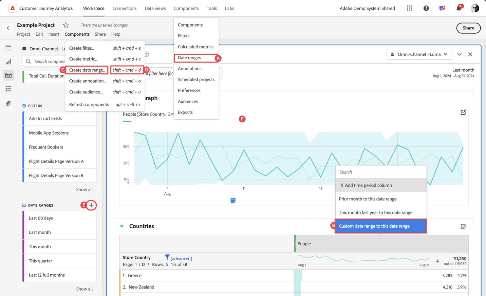
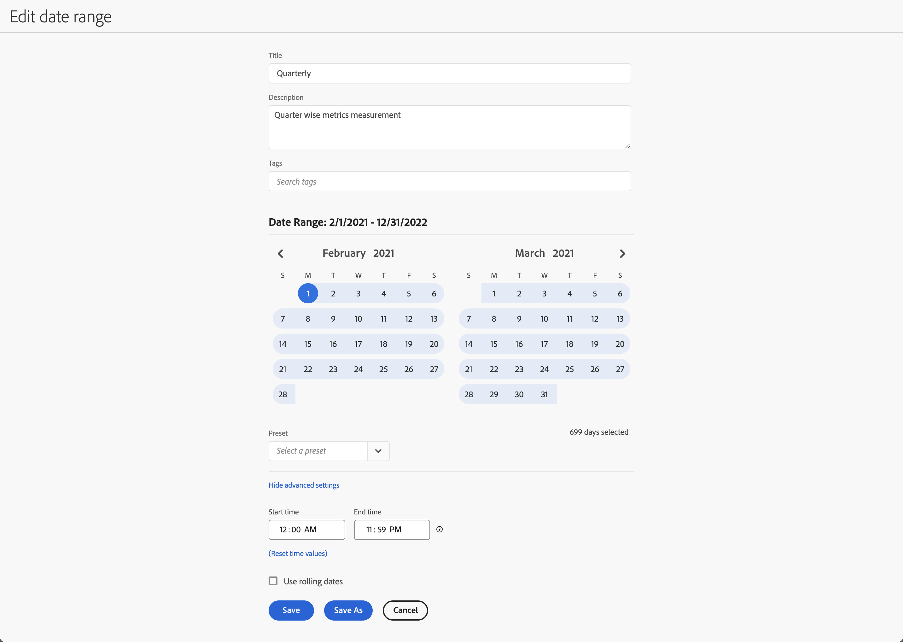

# Creare intervalli di date


Chiunque può creare un intervallo di date personalizzato. Puoi creare un intervallo di date nei seguenti modi:



* **A** - Nell&#39;interfaccia principale, selezionare **[!UICONTROL Componenti]** e **[!UICONTROL Intervallo date]**. Seleziona  **[!UICONTROL Add]** dal gestore [[!UICONTROL Intervallo date]](/help/components/date-ranges/manage.md).
* **B** - In un progetto Workspace, dal menu di scelta rapida di una visualizzazione, seleziona **[!UICONTROL Intervallo date personalizzato fino a questo intervallo]**.
* **C** - In un progetto Workspace, seleziona **[!UICONTROL Componenti]** dal menu, quindi seleziona **[!UICONTROL Crea intervallo date]**
* **D** - In un progetto Workspace, utilizza il collegamento **[!UICONTROL ctrl+maiusc+d]** (Windows) o **[!UICONTROL maiusc+comando+d]** (macOS).
* **E**: in un progetto Workspace, dal pannello Componenti a sinistra, seleziona  in  **Intervalli di date**.
* **F** - In una visualizzazione supportata, come una visualizzazione a linee, dal menu di scelta rapida di un punto dati, selezionare **[!UICONTROL Annota selezione]**.

Per definire l&#39;annotazione, utilizzare il generatore di intervalli [[!UICONTROL Date]](#annotation-builder).

<!--
Should we really mention API here. If so, we can do it all over the place in the docs...
| **Use the [Customer Journey Analytics Annotations API](https://developer.adobe.com/cja-apis/docs/endpoints/annotations/)** | The Customer Journey Analytics Annotations APIs allow you to create, update, or retrieve annotations programmatically through Adobe Developer. These APIs use the same data and methods that Adobe uses inside the product UI. |
-->


## Generatore di intervalli di date {#date-range-builder}

<!-- markdownlint-disable MD034 -->

>[!CONTEXTUALHELP]
>id="components_dateranges_endtime"
>title="Ora di fine"
>abstract="Gli orari di fine includono sempre 59 secondi."

<!-- markdownlint-enable MD034 -->


La finestra di dialogo **[!UICONTROL Nuovo intervallo di date]** o **[!UICONTROL Modifica intervallo di date]** viene utilizzata per creare nuovi intervalli di date o per modificare quelli esistenti.




1. Specifica un **[!UICONTROL Titolo]** per l&#39;intervallo di date. **[!UICONTROL Trimestrale]**.
1. Facoltativamente, specificare una **[!UICONTROL Descrizione]**.
1. Organizza il segmento creando o applicando uno o più **[!UICONTROL Tag]**. Inizia a digitare per trovare i tag esistenti che puoi selezionare. Oppure premi **[!UICONTROL INVIO]** per aggiungere un nuovo tag. Seleziona  per rimuovere un tag. |
1. Seleziona un **[!UICONTROL Intervallo date]** selezionando prima la data di inizio e quindi la data di fine.
In alternativa, è possibile selezionare un **[!UICONTROL predefinito]** dal menu a discesa [!UICONTROL *Seleziona un predefinito*].

1. Facoltativamente, selezionare **[!UICONTROL Mostra impostazioni avanzate]** per:

   * Specificare **[!UICONTROL Ora inizio]** e **[!UICONTROL Ora fine]** diverse dalle impostazioni predefinite `12:00 AM` (`0:00`) e `11:59 PM` (`23:59`). Gli orari di fine includono sempre 59 secondi. Per un intervallo di date che si estende su più giorni, l’ora di inizio si applica al primo giorno dell’intervallo di date e l’ora di fine si applica all’ultimo giorno dell’intervallo di date. Utilizzare **[!UICONTROL (valori di tempo di ripristino)]** per ripristinare i valori predefiniti per l&#39;ora di inizio e di fine.
   * **[!UICONTROL Utilizza date continue]**. Se abilitati, gli intervalli di date predefiniti come **[!UICONTROL Ultimi 7 giorni interi]** vengono aggiornati dinamicamente in base all&#39;avanzamento della data e dell&#39;ora corrente. Se disattivate, tali predefiniti non vengono aggiornati una volta applicati.

     Puoi selezionare il testo tra parentesi (ad esempio **[!UICONTROL inizio fisso - trimestre continuo]**) per estendere il pannello e specificare i dettagli per **[!UICONTROL Inizio]** e **[!UICONTROL Fine]**.

     

      1. Seleziona **[!UICONTROL Inizio di]**, **[!UICONTROL Fine di]** o **[!UICONTROL Giorno fisso]**.
      1. Dopo aver selezionato **[!UICONTROL Inizio di]** o **[!UICONTROL Fine di]**, puoi creare un&#39;espressione completa. Ad esempio: **[!UICONTROL Fine di]** **[!UICONTROL trimestre corrente]** **[!UICONTROL meno]** `20` **[!UICONTROL giorni]**. Seleziona il valore appropriato per ogni singola parte dell’espressione.
         * Seleziona un valore corrente. Ad esempio, **[!UICONTROL trimestre corrente]**.
         * Seleziona un valore per il calcolo aggiuntivo. Ad esempio, **[!UICONTROL meno]**.
         * Dopo aver specificato un calcolo aggiuntivo, specifica un valore. Ad esempio: `20`.
         * Dopo aver specificato un calcolo aggiuntivo, seleziona il periodo di tempo da utilizzare per il calcolo. Ad esempio, **[!UICONTROL giorni]**.

     Selezionare **[!UICONTROL Nascondi dettagli]** per nascondere i dettagli per il calcolo delle date continue.

1. Seleziona:
   * **[!UICONTROL Salva]** per salvare l&#39;intervallo di date.
   * **[!UICONTROL Salva con nome]** per salvare una copia dell&#39;intervallo di date.
   * **[!UICONTROL Annulla]** per annullare eventuali modifiche apportate all&#39;intervallo di date o per annullare la creazione di un nuovo intervallo di date.


<!--


You can create a date range using either of the following two methods:

* Directly in a workspace project by clicking the '`+`' button next to the list of date range components on the left
* Within the date range manager

To create a date range in the date range manager:

1. Log in to [analytics.adobe.com](https://analytics.adobe.com) using your AdobeID credentials.
1. Navigate to [!UICONTROL Components] > [!UICONTROL Date Ranges].
1. Click the [!UICONTROL Add] button to open the modal window that creates a date range.

## Create a date range modal window

The modal window has four fields you can edit:

* **Date range**: The date range you want for this component.
* **Title**: The name you want for this component. The title is used in workspace projects.
* **Description**: The description you want for this component. The description is seen when clicking the  icon.
* **Tags**: Use tags to organize your date ranges. A date range can belong to multiple tags.

## Selecting a date range

When clicking the date range in the modal window, you have several options:

* **Calendar**: Select the start and end date.
* **Use rolling dates**: Check this box if you want the date range to change as time goes on. Do not check this box if you want your date range to remain static.
* **Select preset**: Use this drop-down selection if you want a custom date range based on a range that Adobe offers by default. When you select a preset, you can further customize the date range to suit your needs. It does not affect the preset that Adobe offers.

## Rolling date ranges

If you want a rolling date range, you can customize when it rolls. You can control when the start and end dates roll independently of each other.

* **When the date starts**: Choose if the date starts at the beginning of a time period, at the end of a time period, or use a fixed day.
* **The time period to use**: Choose how often the date range rolls. You can have it roll every day, every week, every month, every quarter, or every year.
* **Offset**: Choose the offset of the date range. You can add or subtract days, weeks, months, quarters, or years.

## Rolling date examples

Some date ranges can be useful in certain reports.

Year-to-date:

```text
Start: Start of current year
End: End of current day
```

Last Thursday to this Thursday:

```text
Start: Start of current week minus 3 days
End: Start of current week plus 4 days
```

Fiscal year (for example, if a fiscal year starts in December)

```text
Start: Start of current year minus 1 month
End: End of current year minus 1 month
```


-->
