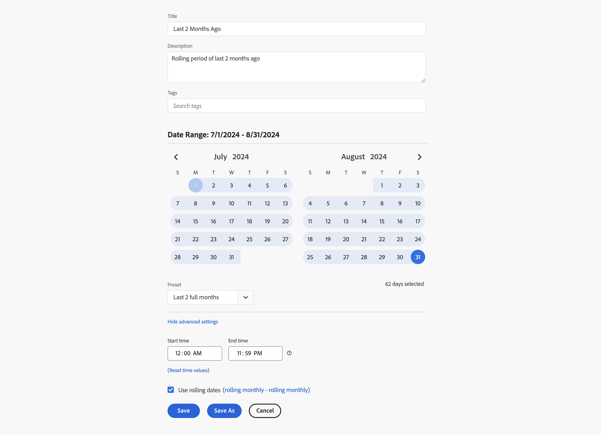

# Esempi di intervalli di date personalizzati

Questo articolo mostra ulteriori esempi di intervalli di date personalizzati.

## Ultimi due mesi fa

+++ Dettagli

Desideri definire un intervallo di date personalizzato che definisce due mesi fa. Utilizzate uno dei predefiniti.

+++

## In sequenza fino alla fine della settimana scorsa

+++ Dettagli

Definire un intervallo di date che definisca il periodo compreso tra il giorno corrente una settimana fa e la fine della stessa settimana precedente. Ad esempio, se oggi è mercoledì 11 settembre 2024. Desideri un intervallo di date da mercoledì 4 settembre 2024 a sabato 7 settembre 2024.

+++ 

<!--
## Example: Use a 7-day rolling date range

You can create a date range that specifies a 7-day rolling window that ends one week ago:

Use *`rolling daily`*.

* The Start settings would be *`current day minus 6 days`*.

* The End settings would be *`current day minus 7 days`*.

This date range can be a component that you drag onto any freeform table.
-->