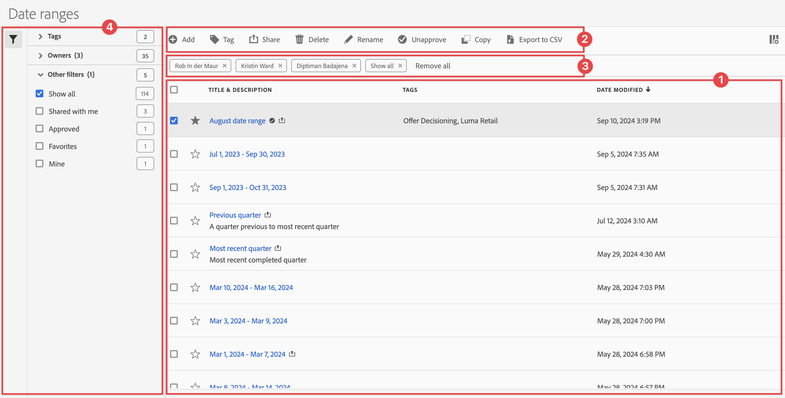

# Gestire gli intervalli di date

È possibile condividere, filtrare, assegnare tag, approvare, copiare, condividere ed eliminare intervalli di date e contrassegnarli come preferiti da un&#39;interfaccia di gestione centrale di [!UICONTROL Intervalli di date]. Per gestire gli intervalli di date:

* Seleziona **[!UICONTROL Componenti]** nell&#39;interfaccia principale, quindi seleziona **[!UICONTROL Intervalli di date]**.

## Gestione intervalli di date

Il gestore degli intervalli di date dispone dei seguenti elementi dell’interfaccia:

### Elenco intervalli di date

Nell&#39;elenco degli intervalli di date ➊ vengono visualizzati tutti gli intervalli di date. L’elenco dispone delle seguenti colonne:

| Colonna | Descrizione |
| --- | --- |
|  | Seleziona questa opzione per favorire  o per non favorire  un intervallo di date. |
| **[!UICONTROL Titolo e descrizione]** | Per modificare il titolo e la descrizione, seleziona il collegamento del titolo, che apre il generatore di intervalli di date [1}.](/help/components/date-ranges/create.md#date-range-builder) |
| **[!UICONTROL Proprietario]** | Proprietario dell’intervallo di date. |
| **[!UICONTROL Tag]** | I tag per questo intervallo di date. |
| **[!UICONTROL Condiviso con]** | Gli individui o i gruppi con cui hai condiviso l’intervallo di date. Seleziona per aprire la finestra di dialogo **[!UICONTROL Condividi intervallo di date]**. |
| **[!UICONTROL Data di modifica]** | Visualizza la data e l’ora dell’ultima modifica apportata all’intervallo di date. |

{style="table-layout:auto"}

Utilizza  per specificare quali colonne vuoi visualizzare.

### Barra delle azioni

È possibile eseguire azioni sugli intervalli di date utilizzando la barra delle azioni ➋. La barra delle azioni contiene le azioni seguenti:

| Icona | Azione | Descrizione |
|:---:|---|---|
|  | **[!UICONTROL Aggiungi]** | Aggiungi un altro intervallo di date utilizzando il generatore di intervalli di date [1}.](create.md#date-range-builder) |
|  | [!UICONTROL *Ricerca per titolo*] | Se nell’elenco non è selezionato alcun intervallo di date, cerca gli intervalli di date utilizzando questo campo di ricerca. |
|  | **[!UICONTROL Tag]** | Assegna tag agli intervalli di date selezionati. Nella finestra di dialogo **[!UICONTROL Intervallo date tag]**, seleziona o deseleziona i tag per gli intervalli date selezionati. Seleziona **[!UICONTROL Salva]** per salvare i tag per gli intervalli di date selezionati. |
|  | **[!UICONTROL Condividi]** | Condividi gli intervalli di date selezionati. Nella finestra di dialogo **[!UICONTROL Intervallo date di condivisione]**, è possibile  *Cercare singoli utenti o gruppi* oppure selezionare **[!UICONTROL Organizzazione]** o **[!UICONTROL Gruppi]**. Seleziona **[!UICONTROL Salva]** per salvare i dettagli di condivisione per gli intervalli di date selezionati. |
|  | **[!UICONTROL Elimina]** | Elimina gli intervalli di date selezionati. Viene richiesta una conferma. |
|  | **[!UICONTROL Rinomina]** | Rinomina un singolo intervallo di date selezionato. Se questa opzione è selezionata, puoi rinominare l’intervallo di date in linea. |
|  | **[!UICONTROL Approva]** | Approva gli intervalli di date selezionati. |
|  | **[!UICONTROL Copia]** | Copia gli intervalli di date selezionati. Vengono creati nuovi intervalli di date con lo stesso nome e suffisso (Copia) |
|  | **[!UICONTROL Esporta in CSV]** | Esporta gli intervalli di date selezionati in un file `Date ranges List.csv`. |

### Barra dei filtri attivi

La barra dei filtri ➌ mostra i filtri attivi (se presenti). Puoi rimuovere rapidamente un filtro utilizzando . Se sono specificati più filtri, utilizzare **[!UICONTROL Rimuovi tutti]** per rimuovere tutti i filtri.

### Pannello dei filtri

Puoi filtrare gli intervalli di date utilizzando il **[!UICONTROL Filtro]** pannello sinistro ➍. Nel pannello dei filtri viene visualizzato il tipo di filtro e il numero di intervalli di date che rispettano il filtro. Seleziona  per attivare o disattivare la visualizzazione del pannello dei filtri.

Per filtrare l’elenco dei filtri:

1. Seleziona  per aprire il pannello dei Filtri. Se hai bisogno di più spazio per l’elenco dei Filtri, puoi selezionare di nuovo  per chiudere il pannello.
1. Puoi filtrare gli intervalli di date utilizzando una qualsiasi delle [sezioni filtro](#filter-sections) disponibili.

   >[!INFO]
   >
   >*Elementi* si riferiscono agli elementi dell&#39;intervallo di date visualizzati nell&#39;[Elenco intervalli di date](#date-ranges-list).
   > 

#### Sezioni filtro

{{tagfiltersection}}
{{ownerfiltersection}}
{{otherfiltersfiltersection}}

L&#39;[elenco di intervalli di date](#date-ranges-list) viene aggiornato automaticamente in base alla configurazione del filtro. Puoi visualizzare i filtri configurati nella [barra dei filtri attivi](#active-filter-bar).

## Modificare gli intervalli di date

È possibile modificare un intervallo di date in due modi:

* In un progetto Workspace, utilizza l’icona [Informazioni componenti](/help/components/use-components-in-workspace.md#component-info).

* Nell&#39;elenco [[!UICONTROL Intervalli di date]](#date-ranges-list), selezionare il titolo dell&#39;intervallo di date.

Utilizza il generatore di intervalli di date [1} per modificare l&#39;intervallo di date.](/help/components/date-ranges/create.md#date-range-builder)

Utilizza il gestore degli intervalli di date per condividere, rinominare o eliminare intervalli di date. Per raggiungere il gestore delle date:

1. Accedi a [analytics.adobe.com](https://analytics.adobe.com) utilizzando le credenziali Adobe ID.
1. Passa a [!UICONTROL Componenti] > [!UICONTROL Intervalli di date].

<!--

## Interface

The date range manager includes the following options:

* **Add**: Create a new date range. See [create a date range](create.md) for more information.
* **Search by title**: Search for a date range by title. Results are filtered based on text entered here.
* **Filter**: Filter date ranges using the left column. You can filter by custom tag, owner, created by you, your favorites, approved, or shared with you. You can also search for desired filters.
* **Favorite**: Click the  icon next to a date range to add it to your favorites.
* **Customize columns**: Click the  icon to show or hide columns in the date range manager.

Click the checkbox next to one or more date ranges for more options.

* **Tag**: Apply a tag to all selected date ranges. Tags help you organize date ranges, and let you filter them using the left column.
* **Share**: Share a date range to other Experience Cloud users. If you are a product administrator, you can also share to the entire organization or groups. Date ranges that are shared to other users in your organization include a  icon next to the title.
* **Delete**: Permanently delete the selected date range(s).
* **Rename**: If a single date range is selected, you can change its title.
* **Approve**: If you are a product admin, you can add a stamp of approval to a date range. Approved date ranges inform users in your organization that they are 'official', differentiating them from date ranges created by other users in your organization. Approved date ranges include a  icon next to the title.
* **Unapprove**: If you are a product admin and select a date range that is already approved, you can unapprove it.
* **Copy**: Create a copy of the selected date range(s). Copying date ranges appends `(Copy)` to the end of the title of the newly copied date range(s).
* **Export to CSV**: Exports all selected date ranges into a CSV file. Columns in the resulting CSV file include all visible columns in the date range manager.
-->