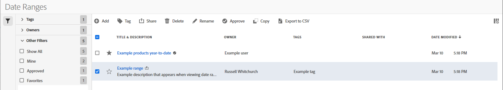

# Gestire gli intervalli di date

Utilizza il gestore degli intervalli di date per condividere, rinominare o eliminare intervalli di date. Per raggiungere il gestore delle date:

1. Accedi a [analytics.adobe.com](https://analytics.adobe.com) utilizzando le credenziali Adobe ID.
1. Passa a [!UICONTROL Components] > [!UICONTROL Date Ranges].

## Interfaccia

Il gestore degli intervalli di date include le seguenti opzioni:

* **Aggiungi**: crea un nuovo intervallo di date. Consulta [create a date range](create.md) (Creare un intervallo di date) per ulteriori informazioni.
* **Search by title** (Ricerca per titolo): cerca un intervallo di date in base al titolo. I risultati vengono filtrati in base al testo inserito qui.
* **Filtra**: filtra gli intervalli di date utilizzando la colonna sinistra. Puoi filtrare in base a: tag personalizzato, proprietario, creati da te, i tuoi preferiti, approvati o condivisi con te. Puoi anche cercare i filtri che desideri.
* **Preferito**: fai clic sull’icona  accanto a un intervallo di date per aggiungerlo ai preferiti.
* **Personalizza colonne**: fai clic sull’icona  per mostrare o nascondere le colonne nel gestore degli intervalli di date.

Per altre opzioni, fai clic sulla casella di controllo accanto a uno o più intervalli di date.

* **Tag**: applica un tag a tutti gli intervalli di date selezionati. I tag consentono di organizzare gli intervalli di date e di filtrarli utilizzando la colonna sinistra.
* **Condividi**: condividi un intervallo di date con altri utenti di Experience Cloud. Se sei un amministratore di prodotto, puoi anche condividere con l’intera organizzazione o con i gruppi. Gli intervalli di date condivisi con altri utenti dell’organizzazione includono un’icona  accanto al titolo.
* **Elimina**: elimina definitivamente gli intervalli di date selezionati.
* **Rinomina**: se è selezionato un singolo intervallo di date, puoi modificarne il titolo.
* **Approva**: se sei un amministratore di prodotto, puoi aggiungere un timbro di approvazione a un intervallo di date. Gli intervalli di date approvati informano gli utenti della tua organizzazione che sono intervalli “ufficiali”, distinguendoli dagli intervalli di date creati da altri utenti dell’organizzazione. Gli intervalli di date approvati includono un’icona  accanto al titolo.
* **Unapprove** (Annulla approvazione): se sei un amministratore di prodotto e selezioni un intervallo di date già approvato, puoi annullarne l’approvazione.
* **Copia**: crea una copia degli intervalli di date selezionati. Copiando gli intervalli di date, `(Copy)` viene aggiunto alla fine del titolo dell’intervallo di date appena copiato.
* **Esporta in CSV**: esporta tutti gli intervalli di date selezionati in un file CSV. Le colonne nel file CSV ottenuto includono tutte le colonne visibili nel gestore degli intervalli di date.
