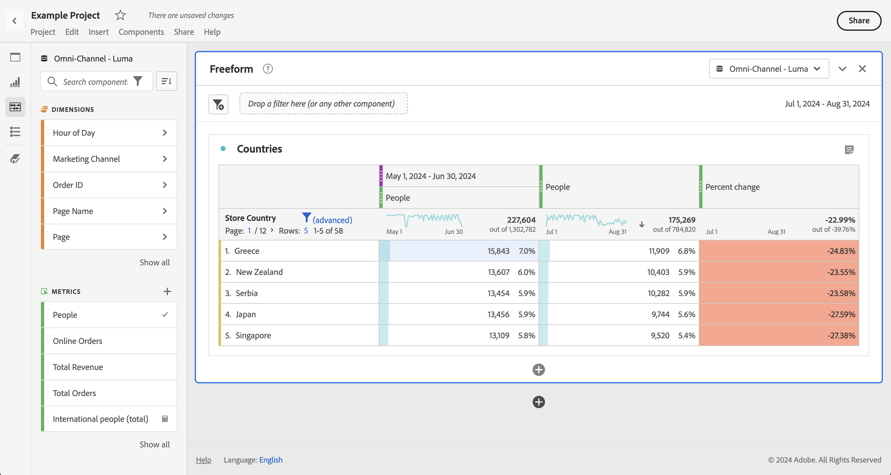

# Confronto delle date

Il confronto delle date in Analysis Workspace consente di prendere una qualsiasi colonna contenente un intervallo di date e di creare un confronto tra date comune, ad esempio: anno su anno, trimestre su trimestre, mese su mese e così via.

## Confronto tra periodi temporali

L’analisi richiede contesto e un periodo di tempo precedente spesso fornisce tali informazioni. Ad esempio, la domanda *Quanto stai facendo meglio o peggio ora rispetto a questo periodo dell&#39;anno scorso?* è fondamentale per comprendere la propria attività. Il confronto delle date include automaticamente una colonna *differenza* che mostra la variazione percentuale rispetto a un periodo di tempo specificato.

1. Crea una [tabella a forma libera](/help/analysis-workspace/visualizations/freeform-table/freeform-table.md), con tutte le dimensioni e le metriche che desideri confrontare in un periodo di tempo.
1. Per determinare l’intervallo di tempo di confronto e se si tratta di un confronto in tempo continuo o fisso, imposta il periodo di tempo sul pannello o sulla colonna.

   Per creare un confronto continuo dei tempi, imposta l&#39;intervallo di date del pannello o della colonna su un intervallo continuo, ad esempio **[!UICONTROL Ultimi 7 giorni]**, **[!UICONTROL Ultimi 30 giorni]** e così via.

   Per creare un confronto a tempo fisso, imposta il pannello o l’intervallo di date della colonna su un intervallo di date personalizzato.

1. Aprire il menu di scelta rapida per una riga di tabella e selezionare **[!UICONTROL Confronta periodi di tempo]**.

   

   >[!NOTE]
   >
   >Questa opzione del menu di scelta rapida è disabilitata per le righe di metrica, di intervallo di date e di dimensione temporale.

1. A seconda di come è stato impostato l’intervallo di date della tabella, sono disponibili le seguenti opzioni per il confronto:

   | Opzione | Descrizione |
   |---|---|
   | **[!UICONTROL Precedente *x* settimane/mesi/trimestri/anni a questo intervallo di date]** | Confronta con l’intervallo di date selezionato immediatamente prima di questo intervallo di date. |
   | **[!UICONTROL Lo scorso anno, queste x settimane / mesi / trimestri / anni vanno fino a questo intervallo di date]** | Confronta con lo stesso intervallo di date di un anno fa. |
   | **[!UICONTROL Intervallo date personalizzato per questo intervallo di date]** | Consente di definire un intervallo di date personalizzato. |

   >[!NOTE]
   >
   >Quando selezioni un numero di giorni personalizzato, ad esempio 7 ottobre - 20 ottobre (un intervallo di 14 giorni) avrai a disposizione solo 2 opzioni: **[!UICONTROL 14 giorni precedenti a questo intervallo di date]** e **[!UICONTROL Intervallo di date personalizzato fino a questo intervallo]**.

1. Il confronto risultante sarà simile al seguente:

   

   Le righe della colonna Variazione percentuale vengono visualizzate in rosso per i valori negativi e in verde per i valori positivi.

## Aggiungere una colonna Periodo di tempo per il confronto

Ora puoi aggiungere un periodo di tempo a ogni colonna di una tabella. Questo consente di aggiungere un periodo di tempo diverso da quello impostato per il calendario.

1. Fare clic con il pulsante destro del mouse su una colonna della tabella e selezionare **[!UICONTROL Aggiungi colonna periodo di tempo]**.

   

1. A seconda di come è stato impostato l’intervallo di date della tabella, sono disponibili le seguenti opzioni per il confronto:

   | Opzione | Descrizione |
   |---|---|
   | **[!UICONTROL Precedente *x* settimane/mesi/trimestri/anni a questo intervallo di date]** | Aggiungi una colonna con la settimana/mese/ecc. immediatamente prima di questo intervallo di date. |
   | **[!UICONTROL Queste *x* settimane / mesi / trimestri / anni dello scorso anno a questo intervallo di date]** | Aggiungi lo stesso intervallo di date un anno fa. |
   | **[!UICONTROL Intervallo date personalizzato per questo intervallo di date]** | Consentono di creare un intervallo di date personalizzato. |

   >[!NOTE]
   >
   >Quando selezioni un numero di giorni personalizzato, ad esempio 7 ottobre - 20 ottobre (un intervallo di 14 giorni) avrai a disposizione solo 2 opzioni: **[!UICONTROL 14 giorni precedenti a questo intervallo di date]** e **[!UICONTROL Intervallo di date personalizzato fino a questo intervallo]**.

1. Il periodo di tempo viene inserito sopra la colonna selezionata:

   

1. Puoi aggiungere tutte le colonne di tempo desiderate, nonché combinare e abbinare diversi intervalli di date:

1. Inoltre, è possibile ordinare in base a ciascuna colonna, cambiando l&#39;ordine dei giorni a seconda della colonna in cui si esegue l&#39;ordinamento.

## Allineare le date della colonna affinché inizino sulla stessa riga

Puoi allineare le date di ogni colonna affinché inizino tutte sulla stessa riga.

Ad esempio, effettui un confronto giorno dopo giorno per l’ultima settimana (che termina il 5 ottobre 2024) e la settimana precedente. Per impostazione predefinita, la colonna sinistra inizia con il 22 settembre e la colonna destra inizia con il 29 settembre.

È possibile abilitare **[!UICONTROL Allineare le date di ogni colonna affinché inizino tutte sulla stessa riga]** nelle [Impostazioni](/help/analysis-workspace/visualizations/freeform-table/freeform-table.md#settings-1) affinché la visualizzazione a forma libera allinei le date delle colonne affinché inizino sulla stessa riga.

Quando utilizzi questa opzione, tieni presente quanto segue:

* Per impostazione predefinita, il sistema attiva questa impostazione per tutti i nuovi progetti.

* Questa impostazione si applica all&#39;intera tabella. Ad esempio, se modifichi questa impostazione per un raggruppamento all’interno della tabella, l’impostazione viene applicata all’intera tabella.

* Quando questa impostazione è abilitata, nell’angolo superiore destro di tutte le celle di colonna vengono visualizzate etichette di data di piccole dimensioni per annotare la cella con la data (e l’ora, se pertinente) appropriata.
