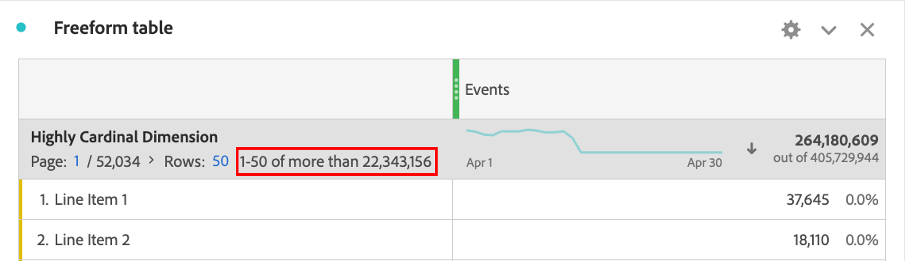

# Dimension con cardinalità molto elevata

Il Customer Journey Analytics (CJA) non pone limiti al numero di valori univoci o di elementi dimensionali che possono essere segnalati all’interno di una singola dimensione. Tuttavia, in alcune circostanze, le dimensioni con un numero estremamente elevato di elementi unici - noti anche come dimensioni ad alta cardinalità - possono influenzare ciò che può essere segnalato.

## Limitazioni

A seconda del numero di eventi in una specifica connessione CJA, in combinazione con dimensioni ad alta cardinalità possono verificarsi le due limitazioni seguenti:

### 1. I conteggi delle righe potrebbero non essere precisamente riportati

I conteggi delle righe su dimensioni di cardinalità elevate potrebbero non essere riportati con precisione. In questo caso, le tabelle a forma libera forniscono un’indicazione come mostrato di seguito:

### 2. Le metriche calcolate possono restituire stime

Se utilizzate con dimensioni altamente cardinali, alcune funzioni della metrica calcolata possono restituire stime, tra cui: Massimo colonna, Minimo colonna, Conteggio righe, Media, Mediana, Percentile, Quartile, Deviazione standard, Varianza, Funzioni di regressione e Funzioni T e Z.

Inoltre, l’ordinamento di una colonna di tabella utilizzando una metrica calcolata può essere basato su una stima e non sempre riflette l’ordinamento esatto. Viene visualizzato un messaggio di avviso che segnala l’eventuale utilizzo di stime.

Tieni presente che anche se le metriche calcolate possono a volte restituire stime, i totali delle colonne sono sempre precisi e non si basano mai su stime. Allo stesso modo, quando si utilizzano metriche standard, le stime non vengono mai utilizzate per ordinare una colonna e riflettono sempre ordini di ordinamento esatti.

## Dove vengono considerati tutti i valori di dimensione

Anche se esistono limitazioni ad alcune metriche calcolate e ai conteggi delle righe di dimensione, tieni presente che le seguenti funzionalità considerano sempre tutti i valori univoci in qualsiasi dimensione. Essi li considerano indipendentemente dal fatto che una dimensione sia altamente cardinale o meno:

* Attribuzione metrica e allocazione dimensione
* Ricerche di elementi di riga applicate a una tabella a forma libera
* Filtri che utilizzano dimensioni o elementi dimensionali
* Funzione approssimativa del conteggio distinta all’interno delle metriche calcolate
* Logica di inclusione/esclusione applicata a qualsiasi metrica o dimensione all’interno di una visualizzazione dati
* Set di dati di ricerca aggiunti a una connessione

## Best practice per l’utilizzo di dimensioni cardinali elevate

Per eliminare gli avvisi o le stime che possono verificarsi quando si utilizzano dimensioni con elevata cardinalità, si consiglia di limitare il numero di righe considerate nel rapporto, utilizzando uno dei seguenti metodi:

* Aggiungi un filtro alla colonna o al pannello interessato.
* Applica una ricerca alla tabella a forma libera.
* Applica un raggruppamento alle righe di interesse o utilizza la dimensione altamente cardinale come dimensione di raggruppamento.
* Aggiungi criteri di inclusione/esclusione alla configurazione Visualizzazione dati della dimensione per limitare il numero di valori univoci presenti nella dimensione.

L’utilizzo di queste tecniche può spesso eliminare qualsiasi stima o avviso indesiderabile che si verifica quando si utilizzano dimensioni cardinali elevate.
