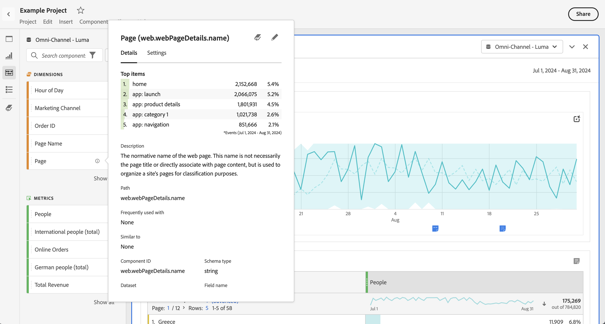
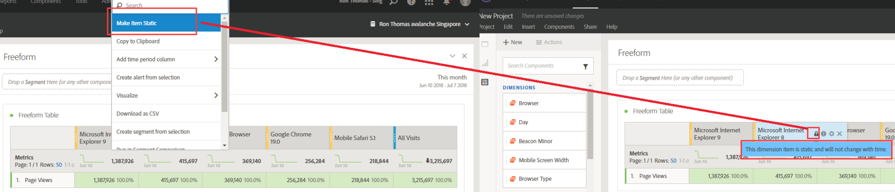
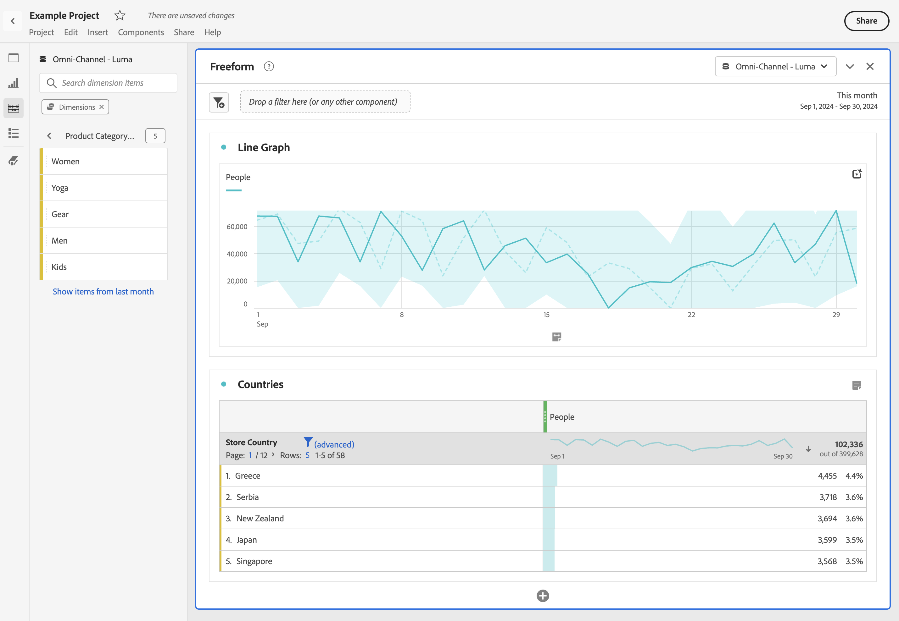

# Anteprima dimensioni

È possibile utilizzare le [informazioni sul componente](/help/components/use-components-in-workspace.md#component-info) per un componente per visualizzare gli elementi principali di una dimensione.

<!--
Now, by default, we show dynamic values instead of static ones, with the option to turn them into static values. Other things to note:

* As your data updates, the dynamic dimension columns will update to show the current 5/15 dimension items.
* A dynamic dimension column that is copied or moved will become static.
* When hovering a static dimension column you will see a lock icon, indicating that the dimension is static.

-->

## Mostra elementi dimensionali

Quando selezioni  per una dimensione nel pannello dei componenti, viene visualizzato un elenco dei relativi elementi dimensionali. L’elenco degli elementi dimensione mostra in genere gli elementi principali degli ultimi 30 giorni. Quando sono disponibili più elementi, al di fuori dell’intervallo di date selezionato per il pannello, seleziona il collegamento per mostrare più elementi. Ad esempio, **[!UICONTROL Mostra elementi del mese scorso]**.

