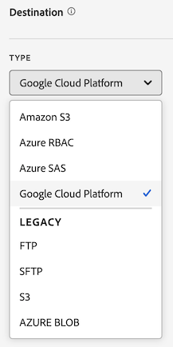

# Creare un feed di dati

Durante la creazione di un feed di dati, fornisci ad Adobe:

* Informazioni sulla destinazione in cui si desidera inviare i file di dati non elaborati

* Dati da includere in ciascun file

* La frequenza con cui il feed di dati deve essere inviato (incluso il ritardo di elaborazione per acquisire gli hit in arrivo)

Prima di creare un feed di dati, è importante avere una conoscenza di base dei feed di dati e assicurarsi di soddisfare tutti i prerequisiti. Per ulteriori informazioni, consulta [Panoramica sui feed di dati](data-feed-overview.md).

## Creare e configurare un feed di dati {#create-and-configure-data-feed}

<!-- markdownlint-disable MD034 -->

>[!CONTEXTUALHELP]
>id="cja_datafeed_export_file"
>title="Manifesto"
>abstract="Scegli se includere un file manifesto con ogni consegna di feed di dati. I file manifesto contengono informazioni per ciascun file incluso nel feed di dati. Quando invii i dati di un feed di dati in un singolo pacchetto, puoi scegliere di includere un file finale (.fin), ma è consigliabile utilizzare i file manifest. "

<!-- markdownlint-enable MD034 -->

<!-- markdownlint-disable MD034 -->

>[!CONTEXTUALHELP]
>id="cja_datafeed_notify"
>title="Notifica completamento"
>abstract="Specifica uno o più indirizzi e-mail a cui inviare una notifica dopo l’invio del feed di dati. È necessario separare più indirizzi e-mail con una virgola."

<!-- markdownlint-enable MD034 -->

<!-- markdownlint-disable MD034 -->

>[!CONTEXTUALHELP]
>id="cja_datafeed_lookback_date_range"
>title="Intervallo date di lookback"
>abstract="Controlla l’aspetto indietro di Customer Journey Analytics durante l’elaborazione della consegna del feed dati. Questa impostazione non modifica la finestra di frequenza (ora o giorno). Tuttavia, l’intervallo di date del lookback può influenzare i dati consegnati. La qualificazione del segmento, il calcolo della sessione, alcune trasformazioni di campo derivate e la persistenza delle dimensioni sono tutti influenzati dall’intervallo di date del lookback."

<!-- markdownlint-enable MD034 -->

1. Accedi a [experiencecloud.adobe.com](https://experiencecloud.adobe.com) utilizzando le credenziali Adobe ID.

1. Seleziona [!UICONTROL **Customer Journey Analytics**] dal selettore di app  in alto a destra nell’interfaccia.

1. Nella barra di navigazione superiore, passa a [!UICONTROL **Amministratore**] > [!UICONTROL **Feed dati**].

1. Selezionare [!UICONTROL **Crea feed dati**].

   Viene visualizzata una pagina con le seguenti schede: [!UICONTROL **Dettagli**], [!UICONTROL **Struttura dati**] e [!UICONTROL **Consegna**].

   

1. Nella sezione [!UICONTROL **Dettagli**], completa i campi seguenti:

   | Campo | Funzione |
   |---------|----------|
   | [!UICONTROL **Nome**] | Nome del feed dati. I nomi devono essere univoci all’interno della visualizzazione dati selezionata e possono contenere fino a 255 caratteri. <!--[Learn more](/help/export/analytics-data-feed/df-faq.md#must-feed-names-be-unique)--> |
   | [!UICONTROL **Tag**] | Applica eventuali tag al feed dati per facilitarne la classificazione. <!--You can filter on tags as described in [Filter and search the list of data feeds](/help/export/analytics-data-feed/df-manage-feeds.md#filter-and-search-the-list-of-data-feeds) in [Manage data feeds](/help/export/analytics-data-feed/df-manage-feeds.md).--> |
   | [!UICONTROL **Descrizione**] | Specifica una descrizione per il feed dati. La descrizione aggiunta è visibile quando si modifica il feed dati. |
   | [!UICONTROL **Visualizzazione dati**] | Selezionare la visualizzazione dati contenente i dati che si desidera esportare. |

1. Nella sezione [!UICONTROL **Data structure**], assicurati che nel campo **[!UICONTROL Data view]** sia selezionata la visualizzazione dati corretta. 
Quando selezioni una visualizzazione dati, tieni presente quanto segue:
 <ul><li>Se vengono creati più feed di dati per la stessa visualizzazione dati, ogni feed di dati deve avere definizioni di colonne diverse.</li><li>L’elenco delle colonne disponibili dipende dalla società di accesso a cui appartiene la visualizzazione dati selezionata. Se modifichi la visualizzazione dati, l’elenco delle colonne disponibili può cambiare. </li></ul>

1. Aggiungi colonne alla configurazione del feed dati. Nella sezione della barra dei componenti a sinistra, individua le colonne da includere, quindi trascinale nell’area di lavoro per creare la struttura dati. Per selezionare più colonne, tieni premuto **[!UICONTROL Maiusc]** oppure tieni premuto **[!UICONTROL Comando]** (su macOS) o **[!UICONTROL Ctrl]** (su Windows).

   Utilizza le seguenti informazioni per comprendere le dimensioni sempre incluse, le dimensioni che non possono essere incluse e le metriche che devono essere sostituite:

   +++ Dimensioni sempre incluse nei feed di dati

   Le seguenti dimensioni sono incluse per impostazione predefinita in ogni feed di dati e non possono essere rimosse:

   | Nome dimensione | Note | Feed di dati | Altre attività di reporting |
   |---|---|---|---|
   | Marca temporale | Timestamp del periodo dell’evento. Granularità al microsecondo. Rappresentata in UTC. | Obbligatorio | Non disponibile |
   | ID riga | Identificatore di riga univoco | Obbligatorio | Non disponibile |
   | ID sessione | Identificatore univoco per ogni sessione | Obbligatorio | Non disponibile |
   | ID persona | Identificatore della persona per la visualizzazione dati e la connessione | Obbligatorio | Standard opzionale |
   | ID account [!BADGE B2B edition]{type=Informative url="https://experienceleague.adobe.com/it/docs/analytics-platform/using/cja-overview/cja-b2b/cja-b2b-edition" newtab=true tooltip="Customer Journey Analytics B2B Edition"} | ID account quando si utilizza il contenitore Account | Obbligatorio | Standard opzionale |

   +++

   +++ Dimensioni che non possono essere incluse nei feed dati

   Le dimensioni standard di Customer Journey Analytics non possono essere incluse nei feed di dati. Nella tabella seguente sono elencate queste dimensioni:

   | Nome dimensione | Note | Feed di dati |
   |---|---|---|
   | 5 minuti | Intervalli di cinque minuti quando si sono verificati gli eventi (arrotondati per difetto) | Non disponibile |
   | 15 minuti | Intervalli di quindici minuti quando si sono verificati gli eventi (arrotondati per difetto) | Non disponibile |
   | 30 minuti | Intervalli di trenta minuti quando si sono verificati gli eventi (arrotondati per difetto) | Non disponibile |
   | Giorno | Giorno in cui si è verificato un evento | Non disponibile |
   | Giorno della settimana | Giorno della settimana in cui si è verificato un evento | Non disponibile |
   | Giorno del mese | Giorno del mese in cui si è verificato un evento | Non disponibile |
   | Profondità evento | Valore numerico sequenziale (1, 2, 3, ecc.) assegnato a ogni interazione di evento all’interno di una sessione | Non disponibile |
   | Ora | Ora in cui si è verificato un evento (arrotondata per difetto) | Non disponibile |
   | Ora del giorno | Ora del giorno in cui si è verificato un evento (arrotondata per difetto) | Non disponibile |
   | Minuto | Minuto di un evento (arrotondato per difetto) | Non disponibile |
   | Minuto dell’ora | Minuto dell’ora in cui si è verificato un evento (arrotondato per difetto) | Non disponibile |
   | Mese | Mese in cui si è verificato un evento | Non disponibile |
   | Mese dell’anno | Mese dell’anno in cui si è verificato un evento | Non disponibile |
   | Trimestre | Si è verificato un evento nel trimestre | Non disponibile |
   | Trimestre dell’anno | Trimestre dell’anno in cui si è verificato un evento | Non disponibile |
   | Second | Si è verificato un secondo evento (arrotondato per difetto) | Non disponibile |
   | Settimana | Settimana in cui si è verificato un evento | Non disponibile |
   | Settimana dell’anno | Settimana dell’anno in cui si è verificato un evento | Non disponibile |
   | Anno | Anno in cui si è verificato un evento | Non disponibile |

   +++

   +++ Metriche che devono essere sostituite nei feed dati

   Le metriche di Customer Journey Analytics seguenti devono essere sostituite:

   | Nome della metrica | Note | Feed di dati |
   |---|---|---|
   | Account [!BADGE B2B Edition]{type=Informative url="https://experienceleague.adobe.com/it/docs/analytics-platform/using/cja-overview/cja-b2b/cja-b2b-edition" newtab=true tooltip="Customer Journey Analytics B2B Edition"} | In base all’ID account specificato nella connessione | Non disponibile. Utilizza il conteggio distinto dall’ID account. |
   | Acquisto del gruppo [!BADGE B2B edition]{type=Informative url="https://experienceleague.adobe.com/it/docs/analytics-platform/using/cja-overview/cja-b2b/cja-b2b-edition" newtab=true tooltip="Customer Journey Analytics B2B Edition"} | Comprare gruppi in base all’ID gruppo di acquisto nella connessione | Non disponibile. Utilizza il conteggio distinto dall’ID del gruppo di acquisto. |
   | Eventi | Numero di righe da tutti i set di dati evento in una connessione | Non disponibile. Utilizza il conteggio distinto dall’ID riga. |
   | Account globali [!BADGE B2B Edition]{type=Informative url="https://experienceleague.adobe.com/it/docs/analytics-platform/using/cja-overview/cja-b2b/cja-b2b-edition" newtab=true tooltip="Customer Journey Analytics B2B Edition"} | In base all’ID account globale nella connessione | Non disponibile. Utilizza il conteggio distinto dall’ID account globale. |
   | Opportunità [!BADGE B2B Edition]{type=Informative url="https://experienceleague.adobe.com/it/docs/analytics-platform/using/cja-overview/cja-b2b/cja-b2b-edition" newtab=true tooltip="Customer Journey Analytics B2B Edition"} | Opportunità basate sull’ID opportunità nella connessione | Non disponibile. Utilizza il conteggio distinto dall’ID opportunità. |
   | Persone | In base all’ID persona specificato in una connessione | Non disponibile. Utilizza il conteggio distinto dall’ID persona. |
   | Conversazioni | Numero di conversazioni | Non disponibile. Utilizza il conteggio distinto dall’ID conversazione. |
   | Fine della sessione | Numero di eventi che sono stati l’ultimo evento di una sessione | Non disponibile |
   | Inizio della sessione | Numero di eventi che sono stati il primo evento di una sessione | Non disponibile |
   | Sessioni | In base alle impostazioni di sessione della visualizzazione dati | Non disponibile. Utilizza il conteggio distinto dall’ID sessione. |
   | Tempo trascorso (secondi) | Somma il tempo tra due diversi valori di dimensione | Non disponibile |

   +++

   +++ Componenti standard opzionali

   | Nome componente | Tipo | Note | Feed di dati |
   |---|---|---|---|
   | AM/PM | Dimensione suddivisa in base al tempo | Mattina o pomeriggio | Non disponibile |
   | ID batch | Dimensione | Identificatore per un batch di Experience Platform | Disponibile |
   | ID set di dati | Dimensione | Identificatore per un set di dati di Experience Platform | Disponibile |
   | Giorno del mese | Dimensione suddivisa in base al tempo | 1-31 | Non disponibile |
   | Giorno della settimana | Dimensione suddivisa in base al tempo | Da lunedì a domenica | Non disponibile |
   | Giorno dell’anno | Dimensione suddivisa in base al tempo | 1-366 | Non disponibile |
   | Ora del giorno | Dimensione suddivisa in base al tempo | 0-23 | Non disponibile |
   | Mese dell’anno | Dimensione suddivisa in base al tempo | Gennaio-Dicembre | Non disponibile |
   | Prime sessioni | Metrica | Prima sessione definita da una persona all’interno dell’intervallo di reporting | Non disponibile |
   | Sessioni di ritorno | Metrica | Sessioni che non sono state la prima sessione di una persona | Non disponibile |
   | Spazio dei nomi ID persona | Dimensione | Tipo di ID costituito dall’ID persona (ad esempio, e-mail o ID cookie) | Disponibile |
   | ID account globale [!BADGE B2B edition]{type=Informative url="https://experienceleague.adobe.com/it/docs/analytics-platform/using/cja-overview/cja-b2b/cja-b2b-edition" newtab=true tooltip="Customer Journey Analytics B2B Edition"} | Dimensione | ID account globale quando si utilizza il contenitore Account globale | Disponibile |
   | ID opportunità [!BADGE B2B edition]{type=Informative url="https://experienceleague.adobe.com/it/docs/analytics-platform/using/cja-overview/cja-b2b/cja-b2b-edition" newtab=true tooltip="Customer Journey Analytics B2B Edition"} | Dimensione | ID opportunità quando si utilizza il contenitore Opportunità | Disponibile |
   | ID gruppo acquisti [!BADGE B2B edition]{type=Informative url="https://experienceleague.adobe.com/it/docs/analytics-platform/using/cja-overview/cja-b2b/cja-b2b-edition" newtab=true tooltip="Customer Journey Analytics B2B Edition"} | Dimensione | ID gruppo di acquisto quando si utilizza il contenitore Gruppo di acquisto | Disponibile |
   | Trimestre dell’anno | Dimensione suddivisa in base al tempo | Q1, Q2, Q3, Q4 | Non disponibile |
   | Ripeti sessione | Metrica | Sessioni che non sono state le prime sessioni di una persona | Non disponibile |
   | Tipo di sessione | Dimensione | Due valori: Primo tentativo o Restituzione | Non disponibile |
   | Tempo trascorso per evento | Dimensione | Intervalli metrica Tempo trascorso nei bucket di eventi | Non disponibile |
   | Tempo trascorso per sessione | Dimensione | Intervalli metrica Tempo trascorso nei bucket di sessione | Non disponibile |
   | Tempo trascorso per persona | Dimensione | Intervalli metrica Tempo trascorso in intervalli di persone | Non disponibile |
   | Fine settimana/Giorno feriale | Dimensione suddivisa in base al tempo | Fine settimana o giorno feriale | Non disponibile |

   +++

1. Nella sezione [!UICONTROL **Consegna**], specifica le seguenti informazioni:

   | Campo | Funzione |
   |---------|----------|
   | [!UICONTROL **Tipo di feed**] | Seleziona il tipo di feed da creare:<ul><li>[!UICONTROL **Feed live**]: esporta dati correnti e futuri.</li><li>[!UICONTROL **Feed di backfill**]: esporta dati storici tra due date precedenti.</li></ul> |
   | [!UICONTROL **Data di inizio**] | Specifica la data di inizio del feed di dati. Per iniziare immediatamente a elaborare i feed di dati per i dati storici, assicurati che sia selezionato [!UICONTROL **Feed di backfill**], quindi imposta questa data su una data nel passato in cui vengono raccolti i dati. La data di inizio è basata sul fuso orario della visualizzazione dati. |
   | [!UICONTROL **Data di fine**] | Specifica la data in cui desideri che termini il feed dati. La data di fine si basa sul fuso orario della visualizzazione dati. |
   | [!UICONTROL **Frequenza**] | Seleziona la frequenza con cui inviare il feed di dati. Gli eventi con marche temporali che rientrano nella finestra di frequenza sono inclusi nella consegna del feed di dati. I campi [!UICONTROL **Intervallo date di lookback**] e [!UICONTROL **Ritardo elaborazione**] possono anche influenzare gli eventi inclusi nei dati per la frequenza di consegna scelta.
Per i feed live, seleziona questa opzione per includere dati relativi a un’ora o a un giorno. I feed di backfill devono essere giornalieri.
<ul><li>**Giornaliero**: i feed contengono dati relativi a un intero giorno, dalla mezzanotte alla mezzanotte nel fuso orario della visualizzazione dati. Utilizza questa opzione per i feed di backfill o per i feed live.</li><li>**Oraria**: i feed contengono dati relativi a una sola ora. Utilizza questa opzione per i feed live.</li></ul> |
   | [!UICONTROL **Intervallo date lookback**] | Controlla l’aspetto indietro di Customer Journey Analytics durante l’elaborazione della consegna del feed dati. 
Questa impostazione non altera la finestra di frequenza (ora o giorno), che definisce l’intervallo di tempo degli eventi da includere nell’output del feed di dati. Tuttavia, l’intervallo di date di lookback può influenzare i dati consegnati nei seguenti modi: 
<ul><li>**Qualificazione del segmento**: quando un segmento viene applicato alla definizione del feed dati, tutti gli eventi all&#39;interno dell&#39;intervallo di date di lookback determinano se una persona è idonea. L’impostazione del contenitore del segmento determina l’ambito. (I contenitori possibili sono: Persona, Sessione o Evento. Il B2B ha i seguenti contenitori aggiuntivi: account globale, account, opportunità, gruppo di acquisto.)  
Ad esempio, se viene utilizzato un contenitore Persona e la persona risulta idonea durante l’intervallo di date del lookback, vengono qualificati anche tutti gli eventi di quella persona durante l’intervallo di frequenza.
</li><li>**Calcolo sessione**: i limiti della sessione vengono calcolati utilizzando i dati all&#39;interno dell&#39;intervallo di date del lookback.</li><li>**Trasformazioni campo derivato**: tutte le funzioni campo derivato che fanno riferimento a contenitori utilizzano l&#39;intervallo di date del lookback nelle esportazioni di feed di dati.</li><li>**Persistenza Dimension**: se scegli di impostare la persistenza su una singola dimensione, scegli anche una scadenza per determinare per quanto tempo un elemento dimensione persiste oltre l&#39;evento su cui è impostato. 
L’intervallo di date di lookback influisce sulla persistenza delle dimensioni quando la scadenza viene impostata su una delle seguenti opzioni nella visualizzazione dati:
<ul><li>Per ogni dimensione nella definizione del feed dati che utilizza [!UICONTROL **Finestra di reporting**] come scadenza, l&#39;intervallo di date del lookback diventa il nuovo intervallo di reporting.</li><li>Per ogni dimensione nella definizione del feed dati che utilizza [!UICONTROL **Ora personalizzata**] come scadenza e se l&#39;ora personalizzata selezionata si estende oltre l&#39;intervallo di date del lookback, l&#39;ora personalizzata viene ignorata e l&#39;intervallo di date del lookback viene utilizzato per la scadenza della dimensione.
Per ulteriori informazioni sull&#39;impostazione della persistenza sulle dimensioni all&#39;interno della visualizzazione dati, vedere [Impostazioni dei componenti di persistenza](/help/data-views/component-settings/persistence.md).
</li></ul> |
   | [!UICONTROL **Ritardo elaborazione**] | Scegli la quantità di tempo di attesa prima di elaborare un file di feed dati. Eventuali hit in ritardo che arrivano durante il ritardo di elaborazione sono inclusi nel feed di dati. 
Un ritardo può essere utile per dare alle implementazioni mobili l’opportunità ai dispositivi offline di connettersi e inviare dati. Può essere utilizzato anche per adattarsi ai processi lato server della tua organizzazione nella gestione dei file elaborati in precedenza. 

È possibile ritardare un feed di 2, 3, 4 o 8 ore.
Per poter essere incluse, le sessioni devono iniziare dopo il cut-off del ritardo di elaborazione; le sessioni che iniziano prima del cut-off e terminano entro il ritardo di elaborazione non sono incluse.
 |

1. Nella sezione [!UICONTROL **Destinazione**] configura la destinazione in cui desideri inviare i dati.

   >[!NOTE]
   >
   >Quando configuri la destinazione di rapporto, tieni presente quanto segue:
   >
   ><!--* Adobe recommends using a cloud account for your report destination. [Legacy FTP and SFTP accounts](/help/components/locations/configure-import-accounts.md) are available, but are not recommended.-->
   >* Tutti gli account cloud configurati in precedenza sono disponibili per l’utilizzo con i feed di dati. Puoi configurare gli account cloud da Gestione posizioni in [Componenti > Esportazioni > Account posizione](/help/components/exports/cloud-export-accounts.md).
   >
   >* Gli account cloud sono associati al tuo account utente Customer Journey Analytics. Gli altri utenti non possono utilizzare o visualizzare gli account cloud configurati, a meno che non vengano resi disponibili a tutti gli utenti dell’organizzazione.
   >
   >* È possibile modificare qualsiasi percorso creato dal gestore Percorsi in [Componenti > Esportazioni > Percorsi](/help/components/exports/cloud-export-locations.md).

   Completa i campi seguenti:

   | Campo | Funzione |
   |---------|----------|
   | [!UICONTROL **Account**] | Esegui una delle operazioni seguenti:<ul><li>**Utilizza un account esistente:** Seleziona il menu a discesa accanto al campo **[!UICONTROL Account]**. In alternativa, inizia a digitare il nome dell’account, quindi selezionalo dal menu a discesa. 
Gli account sono disponibili solo se sono stati configurati o se sono condivisi con un&#39;organizzazione di cui fai parte.
</li><li>**Crea un nuovo account:** Seleziona **[!UICONTROL Aggiungi nuovo]** sotto il campo **[!UICONTROL Account]**. Per informazioni su come configurare l&#39;account, vedere [Configurare gli account di esportazione cloud](/help/components/exports/cloud-export-accounts.md).</li></ul> |
   | [!UICONTROL **Posizione**] | Esegui una delle operazioni seguenti:<ul><li>**Usa una posizione esistente:** Seleziona il menu a discesa accanto al campo **[!UICONTROL Posizione]**. In alternativa, inizia a digitare il nome della posizione, quindi selezionalo dal menu a discesa.</li><li>**Crea un nuovo percorso:** Seleziona **[!UICONTROL Aggiungi nuovo]** sotto il campo **[!UICONTROL Percorso]**. Per informazioni su come configurare il percorso, vedere [Configurare i percorsi di esportazione cloud](/help/components/exports/cloud-export-locations.md).</li></ul> |
   | [!UICONTROL **Notifica quando completato**] | Specifica uno o più indirizzi e-mail a cui inviare una notifica dopo che il feed di dati è stato inviato correttamente o non è stato inviato. È necessario separare più indirizzi e-mail con una virgola. |
   | [!UICONTROL **Abilita manifesto**] | Scegli se includere un file manifesto con ogni consegna di feed di dati. Il file manifesto contiene informazioni per ciascun file incluso nel feed di dati. |

1. Seleziona **[!UICONTROL Salva]**.

<!-- why would you want to do this? -->

<!--
I don't think we need anything after this, but saving here just in case:

1. In the [!UICONTROL **Feed Information**] section, complete the following fields:
   
   | Field | Function |
   |---------|----------|
   | [!UICONTROL **Name**] | The name of the data feed. Must be unique within the selected report suite, and can be up to 255 characters in length. [Learn more](/help/export/analytics-data-feed/df-faq.md#must-feed-names-be-unique) |
   | [!UICONTROL **Report suite**] | The report suite that the data feed is based on. If multiple data feeds are created for the same report suite, they must have different column definitions. Only source report suites support data feeds; virtual report suites are not supported. |
   | [!UICONTROL **Email when complete**] | The email address to be notified when a feed finishes processing. The email address must be properly formatted. |
   | [!UICONTROL **Feed interval**] | Select **Daily** for backfill or historical data. Daily feeds contain a full day's worth of data, from midnight to midnight in the report suite's time zone. Select **Hourly** for continuing data (Daily is also available for continuing feeds if you prefer). Hourly feeds contain a single hour's worth of data. |
   | [!UICONTROL **Delay processing**] | Wait a given amount of time before processing a data feed file. A delay can be useful to give mobile implementations an opportunity for offline devices to come online and send data. It can also be used to accommodate your organization's server-side processes in managing previously processed files. In most cases, no delay is needed. A feed can be delayed by up to 120 minutes. |
   | [!UICONTROL **Start & end dates**] | The start date indicates the date when you want the data feed to begin. To immediately begin processing data feeds for historical data, set this date to any date in the past when data is being collected. The start and end dates are based on the report suite's time zone. |
   | [!UICONTROL **Continuous feed**] | This checkbox removes the end date, allowing a feed to run indefinitely. When a feed finishes processing historical data, a feed waits for data to finish collecting for a given hour or day. Once the current hour or day concludes, processing begins after the specified delay. |
   
1. In the [!UICONTROL **Destination**] section, in the [!UICONTROL **Type**] drop-down menu, select the destination where you want the data to be sent. 

   >[!NOTE]
   >
   >Consider the following when configuring a report destination:
   >
   >* We recommend using a cloud account for your report destination. [Legacy FTP and SFTP accounts](#legacy-destinations) are available, but are not recommended.
   >* Any cloud accounts that you previously configured are available to use for Data Feeds. You can configure cloud accounts in any of the following ways:
   >
   >   * When configuring cloud accounts for [Data Warehouse](/help/export/data-warehouse/create-request/dw-request-report-destinations.md) 
   >   
   >   * When [importing Adobe Analytics classification data](/help/components/locations/locations-manager.md) (Any locations that are configured for importing classification data cannot be used.)
   >   
   >   * From the Locations manager, in [Components > Locations](/help/components/locations/configure-import-accounts.md) 
   >
   >* Cloud accounts are associated with your Adobe Analytics user account. Other users cannot use or view cloud accounts that you configure.
   >
   >* You can edit any locations that you create from the Locations manager in [Components > Locations](/help/components/locations/configure-import-accounts.md)

   

   Use any of the following destination types when creating a data feed. For configuration instructions, expand the destination type. (Additional [legacy destinations](#legacy-destinations) are also available, but are not recommended.)

   +++Amazon S3

   You can send feeds directly to Amazon S3 buckets. This destination type requires only your Amazon S3 account and the location (bucket). 

   Adobe Analytics uses cross-account authentication to upload files from Adobe Analytics to the specified location in your Amazon S3 instance.

   When using Amazon S3 with Data Feeds, only SSE-S3 encryption is supported.

   To configure an Amazon S3 bucket as the destination for a data feed:

   1. Begin creating a data feed as described in [Create and configure a data feed](#create-and-configure-a-data-feed).
   
   1. In the [!UICONTROL **Destination**] section, in the [!UICONTROL **Type**] drop-down menu, select [!UICONTROL **Amazon S3**].

      

   1. Select [!UICONTROL **Select location**].

      The Amazon S3 Export Locations page is displayed.

   1. (Conditional) If an Amazon S3 account (and a location on that account) has already been configured in Adobe Analytics, you can use it as your data feed destination: 

      >[!NOTE]
      >
      >Accounts are available to you only if you configured them or if they were shared with an organization you are a part of.
   
      1. Select the account from the [!UICONTROL **Select account**] drop-down menu.

         Any cloud accounts that were configured in any of the following areas of Adobe Analytics are available to use:
      
         * When importing Adobe Analytics classification data, as described in [Schema](/help/components/classifications/sets/manage/schema.md).
      
           However, any locations that are configured for importing classification data cannot be used. Instead, add a new destination as described below.

         * When configuring accounts and locations in the Locations area, as described in [Configure cloud import and export accounts](/help/components/locations/configure-import-accounts.md) and [Configure cloud import and export locations](/help/components/locations/configure-import-locations.md).
   
      1. Select the location from the [!UICONTROL **Select location**] drop-down menu.

      1. Select [!UICONTROL **Save**] > [!UICONTROL **Save**].

      The destination is now configured to send data to the Amazon S3 location that you specified.
   
   1. (Conditional) If you have not previously added an Amazon S3 account:

      1. Select [!UICONTROL **Add account**], then specify the following information:
   
         |Field | Function |
         |---------|----------|
         | [!UICONTROL **Account name**] | A name for the account. This can be any name you choose. |
         | [!UICONTROL **Account description**] | A description for the account. |
         | [!UICONTROL **Role ARN**] | You must provide a Role ARN (Amazon Resource Name) that Adobe can use to gain access to the Amazon S3 account. To do this, you create an IAM permission policy for the source account, attach the policy to a user, and then create a role for the destination account. For specific information, see [this AWS documentation](https://aws.amazon.com/premiumsupport/knowledge-center/cross-account-access-iam/). |
         | [!UICONTROL **User ARN**] | The User ARN (Amazon Resource Name) is provided by Adobe. You must attach this user to the policy you created. |

         {style="table-layout:auto"}

      1. Select [!UICONTROL **Add location**], then specify the following information:
   
         |Field | Function |
         |---------|----------|
         | [!UICONTROL **Name**] | A name for the account.  |
         | [!UICONTROL **Description**] | A description for the account. |
         | [!UICONTROL **Bucket**] | The bucket within your Amazon S3 account where you want Adobe Analytics data to be sent. 
Ensure that the User ARN that was provided by Adobe has the `S3:PutObject` permission in order to upload files to this bucket. This permission allows the User ARN to upload initial files and overwrite files for subsequent uploads.

Bucket names must meet specific naming rules. For example, they must be between 3 to 63 characters long, can consist only of lowercase letters, numbers, dots (.), and hyphens (-), and must begin and end with a letter or number. [A complete list of naming rules are available in the AWS documentation](https://docs.aws.amazon.com/AmazonS3/latest/userguide/bucketnamingrules.html). 
 |
         | [!UICONTROL **Prefix**] | The folder within the bucket where you want to put the data. Specify a folder name, then add a backslash after the name to create the folder. For example, `folder_name/` |

         {style="table-layout:auto"}

      1. Select [!UICONTROL **Create**] > [!UICONTROL **Save**].

         The destination is now configured to send data to the Amazon S3 location that you specified.

      1. (Conditional) If you need to manage the destination (account and location) that you just created, it is available in the [Locations manager](/help/components/locations/locations-manager.md).
   
   +++

   +++Azure RBAC

   You can send feeds directly to an Azure container by using RBAC authentication. This destination type requires an Application ID, Tenant ID, and Secret. 

   To configure an Azure RBAC account as the destination for a data feed:

   1. If you haven't already, create an Azure application that Adobe Analytics can use for authentication, then grant access permissions in access control (IAM). 
   
      For information, refer to the [Microsoft Azure documentation about how to create an Azure Active Directory application](https://learn.microsoft.com/en-us/azure/active-directory/develop/howto-create-service-principal-portal). 
   
   1. In the Adobe Analytics admin console, in the [!UICONTROL **Destination**] section, in the [!UICONTROL **Type**] drop-down menu, select [!UICONTROL **Azure RBAC**].

      

   1. Select [!UICONTROL **Select location**].

      The Azure RBAC Export Locations page is displayed.

   1. (Conditional) If an Azure RBAC account (and a location on that account) has already been configured in Adobe Analytics, you can use it as your data feed destination: 

      >[!NOTE]
      >
      >Accounts are available to you only if you configured them or if they were shared with an organization you are a part of.
   
      1. Select the account from the [!UICONTROL **Select account**] drop-down menu.

      Any cloud accounts that you configured in any of the following areas of Adobe Analytics are available to use:
      
         * When importing Adobe Analytics classification data, as described in [Schema](/help/components/classifications/sets/manage/schema.md).
      
           However, any locations that are configured for importing classification data cannot be used. Instead, add a new destination as described below.

         * When configuring accounts and locations in the Locations area, as described in [Configure cloud import and export accounts](/help/components/locations/configure-import-accounts.md) and [Configure cloud import and export locations](/help/components/locations/configure-import-locations.md).

      1. Select the location from the [!UICONTROL **Select location**] drop-down menu.

      1. Select [!UICONTROL **Save**] > [!UICONTROL **Save**].

         The destination is now configured to send data to the Azure RBAC location that you specified.

   1. (Conditional) If you have not previously added an Azure RBAC account:

      1. Select [!UICONTROL **Add account**], then specify the following information:
   
         |Field | Function |
         |---------|----------|
         | [!UICONTROL **Account name**] | A name for the Azure RBAC account. This name displays in the [!UICONTROL **Select account**] drop-down field and can be any name you choose. |
         | [!UICONTROL **Account description**] | A description for the Azure RBAC account. This description displays in the [!UICONTROL **Select account**] drop-down field and can be any name you choose.  |
         | [!UICONTROL **Application ID**] | Copy this ID from the Azure application that you created. In Microsoft Azure, this information is located on the **Overview** tab within your application. For more information, see the [Microsoft Azure documentation about how to register an application with the Microsoft identity platform](https://learn.microsoft.com/en-us/azure/active-directory/develop/quickstart-register-app). |
         | [!UICONTROL **Tenant ID**] | Copy this ID from the Azure application that you created. In Microsoft Azure, this information is located on the **Overview** tab within your application. For more information, see the [Microsoft Azure documentation about how to register an application with the Microsoft identity platform](https://learn.microsoft.com/en-us/azure/active-directory/develop/quickstart-register-app). |
         | [!UICONTROL **Secret**] | Copy the secret from the Azure application that you created. In Microsoft Azure, this information is located on the **Certificates & secrets** tab within your application. For more information, see the [Microsoft Azure documentation about how to register an application with the Microsoft identity platform](https://learn.microsoft.com/en-us/azure/active-directory/develop/quickstart-register-app). |

         {style="table-layout:auto"}

      1. Select [!UICONTROL **Add location**], then specify the following information: 
   
         |Field | Function |
         |---------|----------|
         | [!UICONTROL **Name**] | A name for the location. This name displays in the [!UICONTROL **Select location**] drop-down field and can be any name you choose. |
         | [!UICONTROL **Description**] | A description for the location. This description displays in the [!UICONTROL **Select location**] drop-down field and can be any name you choose. |
         | [!UICONTROL **Account**] | The Azure storage account. |
         | [!UICONTROL **Container**] | The container within the account you specified where you want Adobe Analytics data to be sent. Ensure that you grant permissions to upload files to the Azure application that you created earlier. |
         | [!UICONTROL **Prefix**] | The folder within the container where you want to put the data. Specify a folder name, then add a backslash after the name to create the folder. For example, `folder_name/`
Make sure the Application ID that you specified when configuring the Azure RBAC account has been granted the `Storage Blob Data Contributor` role in order to access the container (folder).
 
For more information, see [Azure built-in roles](https://learn.microsoft.com/en-us/azure/role-based-access-control/built-in-roles).
 |

         {style="table-layout:auto"}

      1. Select [!UICONTROL **Create**] > [!UICONTROL **Save**].

         The destination is now configured to send data to the Azure RBAC location that you specified.

      1. (Conditional) If you need to manage the destination (account and location) that you just created, it is available in the [Locations manager](/help/components/locations/locations-manager.md).
   
   +++

   +++Azure SAS

   You can send feeds directly to an Azure container by using SAS authentication. This destination type requires an Application ID, Tenant ID, Key vault URI, Key vault secret name, and secret. 

   To configure Azure SAS as the destination for a data feed:

   1. If you haven't already, create an Azure application that Adobe Analytics can use for authentication. 
   
      For information, refer to the [Microsoft Azure documentation about how to create an Azure Active Directory application](https://learn.microsoft.com/en-us/azure/active-directory/develop/howto-create-service-principal-portal). 
   
   1. In the Adobe Analytics admin console, in the [!UICONTROL **Destination**] section, select [!UICONTROL **Azure SAS**].

      

   1. Select [!UICONTROL **Select location**].

      The Azure SAS Export Locations page is displayed.

   1. (Conditional) If an Azure SAS account (and a location on that account) has already been configured in Adobe Analytics, you can use it as your data feed destination: 

      >[!NOTE]
      >
      >Accounts are available to you only if you configured them or if they were shared with an organization you are a part of.
   
      1. Select the account from the [!UICONTROL **Select account**] drop-down menu.

         Any cloud accounts that you configured in any of the following areas of Adobe Analytics are available to use:
      
         * When importing Adobe Analytics classification data, as described in [Schema](/help/components/classifications/sets/manage/schema.md).
      
           However, any locations that are configured for importing classification data cannot be used. Instead, add a new destination as described below.

         * When configuring accounts and locations in the Locations area, as described in [Configure cloud import and export accounts](/help/components/locations/configure-import-accounts.md) and [Configure cloud import and export locations](/help/components/locations/configure-import-locations.md).

      1. Select the location from the [!UICONTROL **Select location**] drop-down menu.

      1. Select [!UICONTROL **Save**] > [!UICONTROL **Save**].

         The destination is now configured to send data to the Azure SAS location that you specified.
   
   1. (Conditional) If you have not previously added an Azure SAS account:

      1. Select [!UICONTROL **Add account**], then specify the following information:
   
         |Field | Function |
         |---------|----------|
         | [!UICONTROL **Account name**] | A name for the Azure SAS account. This name displays in the [!UICONTROL **Select account**] drop-down field and can be any name you choose. |
         | [!UICONTROL **Account description**] | A description for the Azure SAS account. This description displays in the [!UICONTROL **Select account**] drop-down field and can be any name you choose. |
         | [!UICONTROL **Application ID**] | Copy this ID from the Azure application that you created. In Microsoft Azure, this information is located on the **Overview** tab within your application. For more information, see the [Microsoft Azure documentation about how to register an application with the Microsoft identity platform](https://learn.microsoft.com/en-us/azure/active-directory/develop/quickstart-register-app). |
         | [!UICONTROL **Tenant ID**] | Copy this ID from the Azure application that you created. In Microsoft Azure, this information is located on the **Overview** tab within your application. For more information, see the [Microsoft Azure documentation about how to register an application with the Microsoft identity platform](https://learn.microsoft.com/en-us/azure/active-directory/develop/quickstart-register-app). |
         | [!UICONTROL **Key vault URI**] | 
The path to the SAS URI in Azure Key Vault. To configure Azure SAS, you need to store an SAS URI as a secret using Azure Key Vault. For information, see the [Microsoft Azure documentation about how to set and retrieve a secret from Azure Key Vault](https://learn.microsoft.com/en-us/azure/key-vault/secrets/quick-create-portal?source=recommendations).

After the key vault URI is created:<ul><li>Add an access policy on the Key Vault in order to grant permission to the Azure application that you created.
For information, see the [Microsoft Azure documentation about how to assign a Key Vault access policy](https://learn.microsoft.com/en-us/azure/key-vault/general/assign-access-policy?tabs=azure-portal).

Or

If you want to grant an access role directly without creating an access policy, see the [Microsoft Azure documentation about how to assign Azure roles using Azure portal](https://learn.microsoft.com/en-us/azure/role-based-access-control/role-assignments-portal). This adds the role assignment for the application ID to access the key vault URI. 
</li><li>Make sure the Application ID has been granted the `Key Vault Certificate User` built-in role in order to access the key vault URI. 
For more information, see [Azure built-in roles](https://learn.microsoft.com/en-us/azure/role-based-access-control/built-in-roles).
</li></ul> |
         | [!UICONTROL **Key vault secret name**] | The secret name you created when adding the secret to Azure Key Vault. In Microsoft Azure, this information is located in the Key Vault you created, on the **Key Vault** settings pages. For information, see the [Microsoft Azure documentation about how to set and retrieve a secret from Azure Key Vault](https://learn.microsoft.com/en-us/azure/key-vault/secrets/quick-create-portal?source=recommendations). |
         | [!UICONTROL **Secret**] | Copy the secret from the Azure application that you created. In Microsoft Azure, this information is located on the **Certificates & secrets** tab within your application. For more information, see the [Microsoft Azure documentation about how to register an application with the Microsoft identity platform](https://learn.microsoft.com/en-us/azure/active-directory/develop/quickstart-register-app). |

         {style="table-layout:auto"}

      1. Select [!UICONTROL **Add location**], then specify the following information: 
   
         |Field | Function |
         |---------|----------|
         | [!UICONTROL **Name**] | A name for the location. This name displays in the [!UICONTROL **Select location**] drop-down field and can be any name you choose. |
         | [!UICONTROL **Description**] | A description for the location. This description displays in the [!UICONTROL **Select location**] drop-down field and can be any name you choose. |
         | [!UICONTROL **Container**] | The container within the account you specified where you want Adobe Analytics data to be sent. |
         | [!UICONTROL **Prefix**] | The folder within the container where you want to put the data. Specify a folder name, then add a backslash after the name to create the folder. For example, `folder_name/`
Make sure that the SAS URI store that you specified in the Key Vault secret name field when configuring the Azure SAS account has the `Write` permission. This allows the SAS URI to create files in your Azure container. 
If you want the SAS URI to also overwrite files, make sure that the SAS URI store has the `Delete` permission.

For more information, see [Blob storage resources](https://learn.microsoft.com/en-us/azure/storage/blobs/storage-blobs-introduction#blob-storage-resources) in the Azure Blob Storage documentation.
 |

         {style="table-layout:auto"}

      1. Select [!UICONTROL **Create**] > [!UICONTROL **Save**].

         The destination is now configured to send data to the Azure SAS location that you specified.

      1. (Conditional) If you need to manage the destination (account and location) that you just created, it is available in the [Locations manager](/help/components/locations/locations-manager.md).
   
   +++

   +++Google Cloud Platform

   You can send feeds directly to Google Cloud Platform (GCP) buckets. This destination type requires only your GCP account name and the location (bucket) name. 
   
   Adobe Analytics uses cross-account authentication to upload files from Adobe Analytics to the specified location in your GCP instance.

   To configure a GCP bucket as the destination for a data feed:

   1. In the Adobe Analytics admin console, in the [!UICONTROL **Destination**] section, select [!UICONTROL **Google Cloud Platform**].

      

   1. Select [!UICONTROL **Select location**].

      The GCP Export Locations page is displayed.

   1. (Conditional) If a Google Cloud Platform account (and a location on that account) has already been configured in Adobe Analytics, you can use it as your data feed destination: 

      >[!NOTE]
      >
      >Accounts are available to you only if you configured them or if they were shared with an organization you are a part of.
   
      1. Select the account from the [!UICONTROL **Select account**] drop-down menu.

         Any cloud accounts that you configured in any of the following areas of Adobe Analytics are available to use:
      
         * When importing Adobe Analytics classification data, as described in [Schema](/help/components/classifications/sets/manage/schema.md).
      
           However, any locations that are configured for importing classification data cannot be used. Instead, add a new destination as described below.

         * When configuring accounts and locations in the Locations area, as described in [Configure cloud import and export accounts](/help/components/locations/configure-import-accounts.md) and [Configure cloud import and export locations](/help/components/locations/configure-import-locations.md).

      1. Select the location from the [!UICONTROL **Select location**] drop-down menu.

      1. Select [!UICONTROL **Save**] > [!UICONTROL **Save**].

         The destination is now configured to send data to the Google Cloud Platform location that you specified.
   
   1. (Conditional) If you have not previously added a GCP account:

      1. Select [!UICONTROL **Add account**], then specify the following information:
   
         |Field | Function |
         |---------|----------|
         | [!UICONTROL **Account name**] | A name for the account. This can be any name you choose. |
         | [!UICONTROL **Account description**] | A description for the account. |
         | [!UICONTROL **Project ID**] | Your Google Cloud project ID. See the [Google Cloud documentation about getting a project ID](https://cloud.google.com/resource-manager/docs/creating-managing-projects#identifying_projects). |

         {style="table-layout:auto"}

      1. Select [!UICONTROL **Add location**], then specify the following information:
   
         |Field | Function |
         |---------|----------|
         | [!UICONTROL **Principal**] | The Principal is provided by Adobe. You must grant permission to receive feeds to this principal. |
         | [!UICONTROL **Name**] | A name for the account.  |
         | [!UICONTROL **Description**] | A description for the account. |
         | [!UICONTROL **Bucket**] | The bucket within your GCP account where you want Adobe Analytics data to be sent. 
Ensure that you have granted either of the following permissions to the Principal provided by Adobe: (For information about granting permissions, see [Add a principal to a bucket-level policy](https://cloud.google.com/storage/docs/access-control/using-iam-permissions#bucket-add) in the Google Cloud documentation.)<ul><li>`roles/storage.objectCreator`: Use this permission if you  want to limit the Principal to only create files in your GCP account.  **Important:** If you use this permission with scheduled reporting, you must use a unique file name for each new scheduled export. Otherwise, the report generation will fail because the Principal does not have access to overwrite existing files.</li><li>(Recommended) `roles/storage.objectUser`: Use this permission if you want the Principal to have access to view, list, update, and delete files in your GCP account. This permission allows the Principal to overwrite existing files for subsequent uploads, without the need to auto-generate unique file names for each new scheduled export.</li></ul>
If your organization is using [Organization policy constraints](https://cloud.google.com/storage/docs/org-policy-constraints) to allow only the Google Cloud Platform account in your allow list, you need the following Adobe-owned Google Cloud Platform organization ID: <ul><li>`DISPLAY_NAME`: `adobe.com`</li><li>`ID`: `178012854243`</li><li>`DIRECTORY_CUSTOMER_ID`: `C02jo8puj`</li></ul> 
 |
         | [!UICONTROL **Prefix**] | The folder within the bucket where you want to put the data. Specify a folder name, then add a backslash after the name to create the folder. For example, `folder_name/` |

         {style="table-layout:auto"}

      1. Select [!UICONTROL **Create**] > [!UICONTROL **Save**].

         The destination is now configured to send data to the GCP location that you specified.

      1. (Conditional) If you need to manage the destination (account and location) that you just created, it is available in the [Locations manager](/help/components/locations/locations-manager.md).
   
   +++

1. In the  [!UICONTROL **Data Column Definitions**] section, select the latest [!UICONTROL **All Adobe Columns**] template in the drop-down menu, then complete the following fields:
   
   |Field | Function |
   |---------|----------|
   | [!UICONTROL **Remove escaped characters**] | When collecting data, some characters (such as newlines) can cause issues. Check this box if you would like these characters removed from feed files. |
   | [!UICONTROL **Compression format**] | The type of compression used. **Gzip** outputs files in `.tar.gz` format. **Zip** outputs files in `.zip` format. |
   | [!UICONTROL **Packaging type**] | Select [!UICONTROL **Multiple files**] for most data feeds. This option paginates your data into uncompressed 2GB chunks. (If the [!UICONTROL **Multiple files**] option is selected and uncompressed data for the reporting window is less than 2GB, one file is sent.) Selecting **Single file** outputs the `hit_data.tsv` file in a single, potentially massive file. |
   | [!UICONTROL **Manifest**] | Determines whether Adobe should deliver a [manifest file](c-df-contents/datafeeds-contents.md#feed-manifest) to the destination when no data is collected for a feed interval. If you select **Manifest File**, you receive a manifest file similar to the following when no data is collected:
`text`

`Datafeed-Manifest-Version: 1.0`

`Lookup-Files: 0`

`Data-Files: 0`

 `Total-Records: 0`
 |
   | [!UICONTROL **Column templates**] | When creating many data feeds, Adobe recommends creating a column template. Selecting a column template automatically includes the specified columns in the template. Adobe also provides several templates by default. |
   | [!UICONTROL **Available columns**] | All available data columns in Adobe Analytics. Click [!UICONTROL Add all] to include all columns in a data feed. |
   | [!UICONTROL **Included columns**] | The columns to include in a data feed. Click [!UICONTROL Remove all] to remove all columns from a data feed. |
   | [!UICONTROL **Download CSV**] | Downloads a CSV file containing all included columns. |

1. Select [!UICONTROL **Save**] in the top-right.

    Historical data processing begins immediately. When data finishes processing for a day, the file is sent to the destination that you configured.

    For information about how to access the data feed and to get a better understanding of its contents, see [Data feed contents - overview](/help/export/analytics-data-feed/c-df-contents/datafeeds-contents.md).

## Legacy destinations

>[!IMPORTANT]
>
>The destinations described in this section are legacy, and are not recommended. Instead, use one of the following destinations when creating a data feed: Amazon S3, Google Cloud Platform, Azure RBAC, or Azure SAS. See [Create and configure a data feed](#create-and-configure-a-data-feed) for detailed information about each of these recommended destinations. 

The following information provides configuration information for each of the legacy destinations:

### FTP

Data feed data can be delivered to an Adobe or customer-hosted FTP location. Requires an FTP host, username, and password. Use the path field to place feed files in a folder. Folders must already exist; feeds throw an error if the specified path does not exist.

Use the following information when completing the available fields:

* [!UICONTROL **Host**]: Enter the desired FTP destination URL. For example, `ftp://ftp.omniture.com`.
* [!UICONTROL **Path**]: Can be left blank
* [!UICONTROL **Username**]: Enter the username to log in to the FTP site.
* [!UICONTROL **Password and confirm password**]: Enter the password to log in to the FTP site.

### SFTP

SFTP support for data feeds is available. Requires an SFTP host, username, and the destination site to contain a valid RSA or DSA public key. You can download the appropriate public key when creating the feed.

### S3

You can send feeds directly to Amazon S3 buckets. This destination type requires a Bucket name, an Access Key ID, and a Secret Key. See [Amazon S3 bucket naming requirements](https://docs.aws.amazon.com/awscloudtrail/latest/userguide/cloudtrail-s3-bucket-naming-requirements.html) within the Amazon S3 docs for more information.

The user you provide for uploading data feeds must have the following [permissions](https://docs.aws.amazon.com/AmazonS3/latest/API/API_Operations_Amazon_Simple_Storage_Service.html):

* s3:GetObject
* s3:PutObject
* s3:PutObjectAcl

  >[!NOTE]
  >
  >For each upload to an Amazon S3 bucket, [!DNL Analytics] adds the bucket owner to the BucketOwnerFullControl ACL, regardless of whether the bucket has a policy that requires it. For more information, see "[What is the BucketOwnerFullControl setting for Amazon S3 data feeds?](df-faq.md#BucketOwnerFullControl)"

The following 16 standard AWS regions are supported (using the appropriate signature algorithm where necessary):

* us-east-2
* us-east-1
* us-west-1
* us-west-2
* ap-south-1
* ap-northeast-2
* ap-southeast-1
* ap-southeast-2
* ap-northeast-1
* ca-central-1
* eu-central-1
* eu-west-1
* eu-west-2
* eu-west-3
* eu-north-1
* sa-east-1

>[!NOTE]
>
>The cn-north-1 region is not supported.

### Azure Blob

Data feeds support Azure Blob destinations. Requires a container, account, and a key. Amazon automatically encrypts the data at rest. When you download the data, it gets decrypted automatically. See [Create a storage account](https://docs.microsoft.com/en-us/azure/storage/common/storage-quickstart-create-account?tabs=azure-portal#view-and-copy-storage-access-keys) within the Microsoft Azure docs for more information.

>[!NOTE]
>
>You must implement your own process to manage disk space on the feed destination. Adobe does not delete any data from the server.

-->
