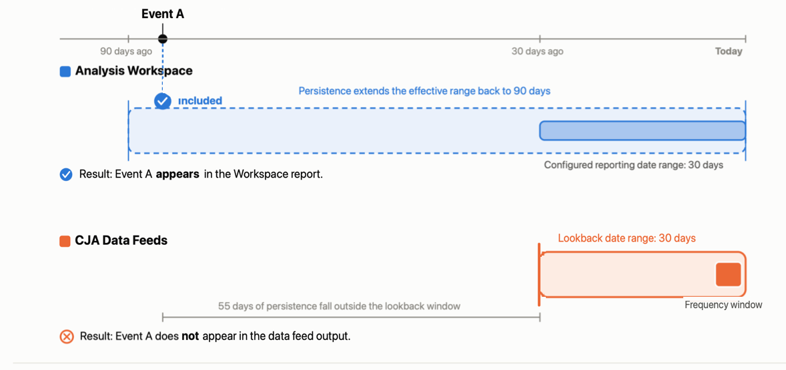

# Comprendere le discrepanze di dati tra i feed di dati e Analysis Workspace

{{release-limited-testing}}

I dati in un’esportazione di feed dati non sempre corrispondono esattamente ai dati visualizzati in Analysis Workspace. Le informazioni su questa pagina spiegano alcuni dei motivi principali.

## Intervallo di date di lookback (Feed di dati) rispetto all’intervallo di date di reporting (Analysis Workspace)

L’intervallo di date di lookback nei feed di dati determina il periodo di tempo trascorso dall’inizio della ricerca degli eventi idonei per la consegna di un feed di dati. Per informazioni dettagliate sull&#39;intervallo di date del lookback, inclusi esempi, vedere [Comprendere l&#39;intervallo di date del lookback](/help/components/exports/cja-data-feeds/create-feed.md#understand-the-lookback-date-range).

In questo senso, l’intervallo di date del lookback è simile all’intervallo di date del reporting in Analysis Workspace. Tuttavia, esistono differenze fondamentali.

| Differenze chiave | Intervallo di date del rapporto (Analysis Workspace) | Intervallo date di lookback (Feed dati) |
|---------|---------|----------|
| **Limite dati**  Se i dati sono inclusi in un report o feed | Flessibile
Gli eventi che non rientrano nell’intervallo di date del rapporto possono comunque essere inclusi in un rapporto Workspace se sono influenzati da uno dei seguenti fattori:
<ul><li>**Persistenza Dimension**: può persistere oltre l&#39;intervallo di date del rapporto quando si utilizza la sessione, l&#39;ora personalizzata o la metrica [scadenza](/help/data-views/component-settings/persistence.md#expiration-settings). Uguale all&#39;intervallo di date del rapporto quando si utilizza l&#39;intervallo di rapporti Persona [scadenza](/help/data-views/component-settings/persistence.md#expiration-settings). I dati sono aggregati.</li><li>**Qualificazione del segmento**: per impostazione predefinita, i segmenti possono estendersi oltre l&#39;intervallo di date del rapporto.
Gli utenti possono scegliere di limitare il segmento all&#39;intervallo di date del reporting quando creano il segmento.<!--add link to new docs-->
</li><li>**Calcolo sessione**: le sessioni possono estendersi oltre l&#39;intervallo di date del rapporto. </li><li>**Trasformazioni di campi derivate**</li></ul> | Fisso
Gli eventi che non rientrano nell’intervallo di date di lookback non vengono mai inclusi in un feed di dati, indipendentemente dal fatto che siano influenzati dai seguenti fattori:

<ul><li>**Persistenza Dimension**: impossibile mantenere la persistenza oltre l&#39;intervallo di date del lookback, indipendentemente dalle [impostazioni di scadenza](/help/data-views/component-settings/persistence.md#expiration-settings). Dati non aggregati.</li><li>**Qualificazione del segmento**: sempre limitata all&#39;intervallo di date del lookback.</li><li>**Calcolo sessione**: sempre limitato all&#39;intervallo di date del lookback.</li><li>**Trasformazioni campo derivato**: tutte le funzioni campo derivato che fanno riferimento a contenitori utilizzano l&#39;intervallo di date del lookback nelle esportazioni di feed di dati.</li></ul>
Per ulteriori informazioni sulla configurazione dell&#39;intervallo di date del lookback, vedere [Creare un feed di dati](/help/components/exports/cja-data-feeds/create-feed.md#create-and-configure-a-data-feed).
 |
| **Intervallo di reporting**  Intervallo di tempo per il reporting | Lo stesso dell’intervallo di reporting (l’intervallo di tempo su cui desideri generare il rapporto). | Diverso dall’intervallo di tempo per il quale desideri generare un rapporto. 
L’intervallo di tempo su cui eseguire il rapporto è la finestra Frequenza, che può essere una singola ora o un singolo giorno.
 |

>[!BEGINSHADEBOX]

**Esempio**

L’esempio seguente illustra come le differenze tra l’intervallo di date del reporting e l’intervallo di date del lookback possono causare discrepanze di dati tra i rapporti di Workspace e le consegne di feed di dati.

L’evento A si è verificato 85 giorni fa e si trova su una dimensione con un’impostazione di persistenza di 90 giorni (ad esempio, una finestra di attribuzione con clic sulla campagna). L’evento è incluso nel rapporto di Analysis Workspace e non nella consegna del feed di dati.

>[!ENDSHADEBOX]

## Stitching delle riproduzioni

Ogni volta che viene eseguita una ripetizione di unione, i dati di identità storici vengono aggiornati retroattivamente.

I feed di dati e Analysis Workspace trattano le ripetizioni di unione in modo diverso, come segue:

* **Feed dati**: riflette l&#39;identità unita solo al momento dell&#39;esportazione. I risultati della ripetizione non vengono applicati retroattivamente ai file esportati.

* **Analysis Workspace**: visualizza i dati uniti più recenti, aggiornati retroattivamente ogni volta che viene eseguita una ripetizione. I dati storici cambiano dopo ogni ripetizione, pertanto Workspace riflette sempre la risoluzione dell’identità più recente.

## Eventi in arrivo

In un feed di dati, gli eventi possono arrivare dopo la chiusura della finestra di esportazione del feed di dati.

I feed di dati e Analysis Workspace funzionano in modo diverso rispetto agli eventi passati, come segue:

* **Feed di dati**: esporta i dati entro un intervallo di tempo fisso in base al momento in cui vengono ricevuti gli eventi.

  Gli eventi che arrivano dopo la chiusura della finestra potrebbero non essere inclusi nell’esportazione. Questo è influenzato dall&#39;[intervallo di date di lookback](#lookback-date-range-data-feeds-vs-reporting-date-range-analysis-workspace) scelto.

* **Analysis Workspace**: elabora i dati al momento del rapporto, in modo che gli eventi vengano inclusi nei rapporti indipendentemente da quando sono stati ricevuti.

## Batch di dati

A volte i dati vengono inviati in un batch che si estende su un periodo di tempo prolungato.

I feed di dati e Analysis Workspace funzionano in modo diverso per quanto riguarda i dati in batch, come segue:

* **Feed dati**: distribuisce i dati in batch per ogni giorno o ora in base ai timestamp originali. Ad esempio, un batch contenente 30 giorni di dati viene distribuito su 30 giorni di esportazioni, quindi solo una piccola sezione viene visualizzata in una singola esportazione.

* **Analysis Workspace**: visualizza tutti i dati in un batch non appena sono completamente elaborati, indipendentemente dall&#39;intervallo di tempo incluso nel batch.

