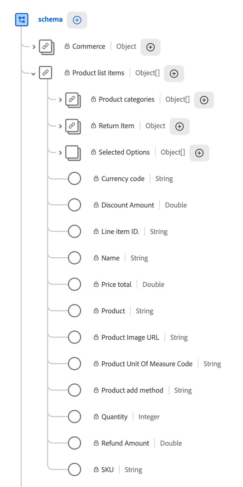

# Eventi secondari nei feed dati

{{release-limited-testing}}

[Eventi secondari](/help/components/segments/sub-event.md) in Customer Journey Analytics ti consentono di analizzare i dati dell&#39;evento a un livello più granulare del livello dell&#39;evento.

Utilizza le seguenti informazioni per comprendere come utilizzare i sottoeventi nei feed dati di Customer Journey Analytics.

## Comprendere i sottoeventi

### Eventi secondari nello schema XDM

Nello schema XDM, ogni elemento di un array (un array di stringhe o un array di oggetti) è un sottoevento.

Per visualizzare un evento con eventi secondari nello schema XDM in Adobe Experience Platform, seleziona [!UICONTROL **Schemi**], quindi espandi un evento che contiene eventi secondari.

Nell&#39;esempio seguente, `Product list items` è una matrice di oggetti contenente vari eventi secondari.



### Esempio di evento secondario: prodotti in un evento di acquisto

Un cliente acquista due prodotti in un unico ordine: un trapano senza fili e due pacchi batteria per trapano. L&#39;implementazione invia un singolo evento di acquisto che include entrambi i prodotti nell&#39;array di oggetti `productListItems`:

```json
{
  "eventType": "commerce.purchases",
  "timestamp": "2026-09-16T14:32:07.512Z",
  "commerce": {
    "purchases": { "value": 1 }
  },
  "productListItems": [
    { "SKU": "CD-2000", "name": "Cordless Drill", "quantity": 1, "priceTotal": 129.99 },
    { "SKU": "BP-2000", "name": "Drill Battery Pack", "quantity": 2, "priceTotal": 39.98 }
  ]
}
```

Questo evento contiene due eventi secondari, uno per ogni oggetto nell&#39;array `productListItems`. La tabella seguente mostra quali campi appartengono all’evento e quali appartengono ai suoi sottoeventi.

| Livello | Campi | Descrizione dei campi |
| --- | --- | --- |
| **Evento** | `eventType`, `timestamp`, `commerce.purchases.value` | L’acquisto nel suo insieme. Ogni campo ha un valore per l’evento. La metrica **Ordini** conta `1` per questo evento, indipendentemente dal numero di prodotti in essa contenuti. |
| **Evento secondario** | `SKU`, `name`, `quantity`, `priceTotal` in ogni oggetto `productListItems` | Un singolo prodotto nell’acquisto. Ogni campo ha un valore per prodotto. Ad esempio, `quantity` è `1` per il trapano senza fili e `2` per il pacchetto batteria del trapano. |

{style="table-layout:auto"}

>[!NOTE]
>
>I sottoeventi includono solo i dati inviati con l’evento. Customer Journey Analytics non ricostruisce il contenuto del carrello in base a eventi precedenti, ad esempio aggiunte al carrello o estrazioni. Affinché i prodotti vengano visualizzati come eventi secondari di un evento di acquisto, l&#39;implementazione deve includerli in `productListItems` per tale evento di acquisto.

## Aggiungere dati di eventi secondari a un feed di dati

Quando tenti di aggiungere una colonna che è un evento secondario durante la creazione di un feed di dati, viene visualizzata una finestra di dialogo in cui ti viene richiesto di aggiungere uno qualsiasi degli eventi secondari del peer. Nell’output del feed dati, tutti questi eventi vengono visualizzati in una singola colonna.

## Visualizzare i dati di eventi secondari nell’output del feed dati

### Differenze tra eventi secondari tra Analysis Workspace e feed di dati

In Customer Journey Analytics, i sottoeventi sono rappresentati in modo diverso tra Analysis Workspace e i feed di dati.

| Posizione | Modalità di rappresentazione dei sottoeventi |
| --- | --- |
| **Analysis Workspace (in Customer Journey Analytics)** | Selezionabile come singolo componente, separato da qualsiasi gerarchia visibile. |
| **Feed dati (in Customer Journey Analytics)** | Rappresentata come un gruppo, con la gerarchia intatta. |

### Differenze tra eventi secondari di Adobe Analytics e Customer Journey Analytics

I dati dei sottoeventi (come più dettagli di prodotto in un singolo evento di acquisto) vengono visualizzati in modo diverso nei feed dati di Customer Journey Analytics rispetto ai feed dati di Adobe Analytics. La tabella seguente confronta il modo in cui ogni prodotto rappresenta i dati dei sottoeventi.

| Prodotto | Visualizzazione dei dati di eventi secondari nei feed di dati | Esempio: elenco prodotti |
| --- | --- | --- |
| **Adobe Analytics** | Viene ridotta a una stringa delimitata in una singola colonna. | Un elenco di prodotti contiene più prodotti raggruppati in una singola stringa:<p>`Power Tools;Cordless Drill;1;129.99,Power Tools;Drill Battery Pack;2;39.98` <!--screenshot of what this looks like: product lists, list vars. --></p> |
| **Customer Journey Analytics** | I sottoeventi mantengono la gerarchia definita nello schema XDM. Raggruppati nella stessa colonna, mostrano la gerarchia relazionale all’evento principale e ai sottoeventi di pari livello. | Un elenco di prodotti mantiene la gerarchia definita nello schema XDM come array:<p>`[{"category":"Power Tools","product":"Cordless Drill","quantity":1,"revenue":129.99},{"category":"Power Tools","product":"Drill Battery Pack","quantity":2,"revenue":39.98}]` <!--screenshot of what this looks like: product lists, list vars. --></p> |

{style="table-layout:auto"}

### Differenze rispetto ad Adobe Analytics

### Differenze di output tra i feed dati di Adobe Analytics e Customer Journey Analytics

I dati dei sottoeventi (come più dettagli di prodotto in un singolo evento di acquisto) vengono visualizzati in modo diverso nei feed dati di Customer Journey Analytics rispetto ai feed dati di Adobe Analytics. La tabella seguente confronta il modo in cui ogni prodotto rappresenta i dati dei sottoeventi.

| Prodotto | Visualizzazione dei dati di eventi secondari nei feed di dati | Esempio: elenco prodotti |
| --- | --- | --- |
| **Adobe Analytics** | Viene ridotta a una stringa delimitata in una singola colonna. | Un elenco di prodotti contiene più prodotti raggruppati in una singola stringa:<p>`Power Tools;Cordless Drill;1;129.99,Power Tools;Drill Battery Pack;2;39.98` <!--screenshot of what this looks like: product lists, list vars. --></p> |
| **Customer Journey Analytics** | I sottoeventi mantengono la gerarchia definita nello schema XDM. Raggruppati nella stessa colonna, mostrano la gerarchia relazionale all’evento principale e ai sottoeventi di pari livello. | Un elenco di prodotti mantiene la gerarchia definita nello schema XDM come array:<p>`[{"category":"Power Tools","product":"Cordless Drill","quantity":1,"revenue":129.99},{"category":"Power Tools","product":"Drill Battery Pack","quantity":2,"revenue":39.98}]` <!--screenshot of what this looks like: product lists, list vars. --></p> |

{style="table-layout:auto"}

## Differenze tra gli eventi secondari nell’output di Analysis Workspace e dei feed di dati

In Customer Journey Analytics, i sottoeventi sono rappresentati in modo diverso tra Analysis Workspace e i feed di dati.

| Posizione | Modalità di rappresentazione dei sottoeventi |
| --- | --- |
| **Analysis Workspace** | Selezionabile come singolo componente, separato da qualsiasi gerarchia visibile. |
| **Feed dati** | Rappresentata come un gruppo, con la gerarchia intatta. |


## Visualizzare i dati di eventi secondari nell’output del feed dati

I dati dei sottoeventi (come più dettagli di prodotto in un singolo evento di acquisto) vengono visualizzati in modo diverso nei feed dati di Customer Journey Analytics rispetto ai feed dati di Adobe Analytics. La tabella seguente confronta il modo in cui ogni prodotto rappresenta i dati dei sottoeventi.

| Prodotto | Visualizzazione dei dati di eventi secondari nei feed di dati | Esempio: elenco prodotti |
| --- | --- | --- |
| **Adobe Analytics** | Viene ridotta a una stringa delimitata in una singola colonna. | Un elenco di prodotti contiene più prodotti raggruppati in una singola stringa:<p>`Power Tools;Cordless Drill;1;129.99,Power Tools;Drill Battery Pack;2;39.98` <!--screenshot of what this looks like: product lists, list vars. --></p> |
| **Customer Journey Analytics** | I sottoeventi mantengono la gerarchia definita nello schema XDM. Raggruppati nella stessa colonna, mostrano la gerarchia relazionale all’evento principale e ai sottoeventi di pari livello. | Un elenco di prodotti mantiene la gerarchia definita nello schema XDM come array:<p>`[{"category":"Power Tools","product":"Cordless Drill","quantity":1,"revenue":129.99},{"category":"Power Tools","product":"Drill Battery Pack","quantity":2,"revenue":39.98}]` <!--screenshot of what this looks like: product lists, list vars. --></p> |

{style="table-layout:auto"}

## Eseguire query sui dati degli eventi secondari nell’output del feed dati

Poiché i dati dell&#39;evento secondario [ vengono visualizzati in modo diverso nei feed dati di Customer Journey Analytics](#view-sub-event-data-in-data-feed-output), le query utilizzate per tale evento sono diverse da quelle utilizzate per i feed dati di Adobe Analytics.

Gli esempi seguenti mostrano come trovare gli eventi che includono un prodotto specifico. Negli esempi viene utilizzata la sintassi BigQuery di Google. Altri data warehouse, come Snowflake e Databricks, supportano lo stesso approccio con differenze di sintassi minori.

+++ Eseguire query sui dati dei prodotti nei feed di dati di Customer Journey Analytics

Nei feed di dati di Customer Journey Analytics, gli stessi due prodotti vengono visualizzati come un array di oggetti nella colonna `product_list_items`. Non è richiesta alcuna analisi del delimitatore:

```json
{
  "row_id": "01K3F2M9-...-4821",
  "timestamp_utc": "2026-09-16T14:32:07.512000Z",
  "product_list_items": [
    { "category": "Power Tools", "product": "Cordless Drill", "quantity": 1, "revenue": 129.99,
      "events": {"event1": 1}, "merchandising": {"eVar10": "DrillBundle"} },
    { "category": "Power Tools", "product": "Drill Battery Pack", "quantity": 2, "revenue": 39.98,
      "events": {"event1": 1}, "merchandising": {"eVar10": "DrillBundle"} }
  ]
}
```

La modalità di scrittura della query dipende dal fatto che si desideri una riga per evento o una riga per prodotto corrispondente.

**Restituire una riga per evento**

Per filtrare gli eventi senza modificare il numero di righe, utilizzare `UNNEST` all&#39;interno di una sottoquery `EXISTS`:

```sql
SELECT row_id, timestamp_utc, product_list_items
FROM `project.dataset.cja_data_feed` AS f
WHERE EXISTS (
  SELECT 1
  FROM UNNEST(f.product_list_items) AS item
  WHERE item.product = 'Cordless Drill'
);
```

Questa query restituisce una riga per ogni evento corrispondente, con l&#39;array `product_list_items` completo intatto, indipendentemente dal numero di prodotti nell&#39;array corrispondenti.

**Restituire una riga per prodotto corrispondente**

Per restituire una riga per ogni prodotto corrispondente, spostare `UNNEST` nella clausola `FROM` esterna:

```sql
SELECT f.row_id, f.timestamp_utc, item.product, item.quantity, item.revenue
FROM `project.dataset.cja_data_feed` AS f,
     UNNEST(f.product_list_items) AS item
WHERE item.product = 'Cordless Drill';
```

Un evento con più di un prodotto corrispondente viene visualizzato come più righe e le colonne dell&#39;evento, ad esempio `row_id`, vengono ripetute su ogni riga. Utilizzare questo approccio solo quando sono necessari dettagli a livello di prodotto. Per contare gli eventi nei risultati, utilizzare `COUNT(DISTINCT row_id)` invece di contare le righe.

Questo approccio si applica a qualsiasi campo array nello schema XDM, non solo ai prodotti.

+++

+++ Eseguire query sui dati dei prodotti nei feed di dati di Adobe Analytics

Nei feed dati di Adobe Analytics, un evento con due prodotti acquistati insieme viene visualizzato come una singola stringa delimitata nella colonna `product_list`:

```text
Power Tools;Cordless Drill;1;129.99;event1=1;eVar10=DrillBundle,Power Tools;Drill Battery Pack;2;39.98;event1=1;eVar10=DrillBundle
```

Per trovare gli eventi che includono un trapano senza fili, analizzare questa stringa con un&#39;espressione regolare:

```sql
SELECT hitid_high, hitid_low, post_evar10
FROM aa_hit_data
WHERE REGEXP_CONTAINS(product_list, r'(^|,)[^;]*;Cordless Drill;')
```

+++


