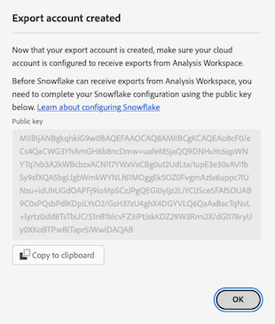

# Configurare account di esportazione cloud

{{release-limited-testing}}

Prima di esportare i rapporti sul Customer Journey Analytics in una destinazione cloud come descritto in [Esportare i rapporti di Customer Journey Analytics nel cloud](/help/analysis-workspace/export/export-cloud.md), devi aggiungere e configurare la destinazione in cui desideri inviare i dati.

Questo processo consiste nell’aggiungere e configurare l’account (ad esempio Amazon S3, Google Cloud Platform e così via) come descritto in questo articolo, quindi aggiungere e configurare la posizione all’interno dell’account (ad esempio una cartella all’interno dell’account) come descritto in [Configurare i percorsi di esportazione cloud](/help/components/exports/cloud-export-locations.md).

Per informazioni su come gestire gli account esistenti, incluse la visualizzazione, la modifica e l&#39;eliminazione degli account, vedere [Gestire percorsi e account di esportazione cloud](/help/components/exports/manage-export-locations.md).

## Inizio creazione account esportazione cloud

1. In Customer Journey Analytics, seleziona [!UICONTROL **Componenti**] > [!UICONTROL **Esportazioni**].
1. Il giorno [!UICONTROL Exports] , seleziona la [!UICONTROL **Account ubicazione**] scheda.
1. Seleziona [!UICONTROL **Aggiungi account**].

   

   Viene visualizzata la finestra di dialogo Aggiungi account.

1. In [!UICONTROL **Nome account località**] , specificare un nome per il conto località. Questo nome viene visualizzato durante la creazione di una posizione.

1. In [!UICONTROL **Descrizione del conto di ubicazione**] fornire una breve descrizione del conto per distinguerlo da altri conti dello stesso tipo.

1. In [!UICONTROL **Tipo di account**] , seleziona il tipo di account cloud in cui stai effettuando l’esportazione. I tipi di account disponibili sono Amazon S3 Role ARN, Google Cloud Platform, Azure SAS, Azure RBAC, Snowflake e AEP Data Landing Zone.

1. Continua con la sezione seguente che corrisponde a [!UICONTROL **Tipo di account**] hai selezionato.

   * [Area di destinazione dati AEP](#adobe-experience-platform)

   * [ARN per ruolo Amazon S3](#amazon-s3-role-arn)

   * [Piattaforma Google Cloud](#google-cloud-platform)

   * [SAS di Azure](#azure-sas)

   * [RBAC di Azure](#azure-rbac)

   * [Snowflake](#snowflake)

### Area di destinazione dati AEP

>[!IMPORTANT]
>
>Quando esporti i rapporti sul Customer Journey Analytics nella Adobe Experience Platform Data Landing Zone, accertati di scaricare i dati entro 7 giorni, quindi eliminarli dalla AEP Data Landing Zone. Dopo 7 giorni, i dati vengono eliminati automaticamente dalla zona di destinazione dati di AEP.

1. [Inizio creazione account esportazione cloud](#begin-creating-a-cloud-export-account), come descritto in precedenza.

1. Seleziona [!UICONTROL **Salva**].

   Il [!UICONTROL **Account di esportazione creato**] viene visualizzata una finestra di dialogo.

   

1. Copia il contenuto del [!UICONTROL **URI SAS**] negli Appunti. Utilizza questo URI SAS per accedere ai dati esportati da Analysis Workspace dalla zona di destinazione AEP.

1. Seleziona [!UICONTROL **OK**].

1. Continua con [Configurare i percorsi di esportazione cloud](/help/components/exports/cloud-export-locations.md).

### ARN per ruolo Amazon S3

1. [Inizio creazione account esportazione cloud](#begin-creating-a-cloud-export-account), come descritto in precedenza.

1. In [!UICONTROL **Proprietà account**] sezione del [!UICONTROL **Aggiungi account**] , specificare le informazioni seguenti:

   | Campo | Funzione |
   |---------|----------|
   | [!UICONTROL **ARN per ruolo**] | È necessario fornire un ARN per il ruolo (Amazon Resource Name) che l’Adobe può utilizzare per accedere all’account Amazon S3. A tale scopo, creare un criterio di autorizzazione IAM per l&#39;account di origine, associare il criterio a un utente e quindi creare un ruolo per l&#39;account di destinazione. Per informazioni specifiche, consulta [questa documentazione di AWS](https://aws.amazon.com/premiumsupport/knowledge-center/cross-account-access-iam/). |

   {style="table-layout:auto"}

1. Seleziona [!UICONTROL **Salva**].

   Il [!UICONTROL **Account di esportazione creato**] viene visualizzata una finestra di dialogo.

   

1. Copia il contenuto del [!UICONTROL **ARN utente**] negli Appunti. L’ARN utente (Amazon Resource Name) è fornito da Adobe. È necessario collegare questo utente al criterio creato in ARN per il ruolo Amazon S3.

1. Seleziona [!UICONTROL **OK**].

1. Continua con [Configurare i percorsi di esportazione cloud](/help/components/exports/cloud-export-locations.md).

### Piattaforma Google Cloud

1. [Inizio creazione account esportazione cloud](#begin-creating-a-cloud-export-account), come descritto in precedenza.

1. In [!UICONTROL **Proprietà account**] sezione del [!UICONTROL **Aggiungi account**] , specificare le informazioni seguenti:

   | Campo | Funzione |
   |---------|----------|
   | [!UICONTROL **ID Progetto**] | ID progetto Google Cloud copiato dall’account Google Cloud. Consulta la [Documentazione di Google Cloud sull’ottenimento di un ID progetto](https://cloud.google.com/resource-manager/docs/creating-managing-projects#identifying_projects). |

   {style="table-layout:auto"}

1. Seleziona [!UICONTROL **Salva**].

   Il [!UICONTROL **Account di esportazione creato**] viene visualizzata una finestra di dialogo.

   

1. Copia il contenuto del [!UICONTROL **Entità**] negli Appunti, quindi assicurati di concedere all’Entità l’autorizzazione per caricare i file in questo bucket in Google Cloud Platform. <!-- add link to Google Cloud docs on how to do this -->

1. Seleziona [!UICONTROL **OK**].

1. Continua con [Configurare i percorsi di esportazione cloud](/help/components/exports/cloud-export-locations.md).

### SAS di Azure

1. [Inizio creazione account esportazione cloud](#begin-creating-a-cloud-export-account), come descritto in precedenza.

1. In [!UICONTROL **Proprietà account**] sezione del [!UICONTROL **Aggiungi account**] , specificare le informazioni seguenti:

   | Campo | Funzione |
   |---------|----------|
   | [!UICONTROL **ID applicazione**] | Copia questo ID dall’applicazione Azure creata. In Microsoft Azure, queste informazioni si trovano nel **Panoramica** nell&#39;applicazione. Per ulteriori informazioni, vedere [Documentazione di Microsoft Azure su come registrare un’applicazione con la piattaforma Microsoft Identity](https://learn.microsoft.com/en-us/azure/active-directory/develop/quickstart-register-app). |
   | [!UICONTROL **ID tenant**] | Copia questo ID dall’applicazione Azure creata. In Microsoft Azure, queste informazioni si trovano nel **Panoramica** nell&#39;applicazione. Per ulteriori informazioni, vedere [Documentazione di Microsoft Azure su come registrare un’applicazione con la piattaforma Microsoft Identity](https://learn.microsoft.com/en-us/azure/active-directory/develop/quickstart-register-app). |
   | [!UICONTROL **URI insieme di credenziali delle chiavi**] | <p>Percorso del token SAS nell&#39;insieme di credenziali delle chiavi di Azure.  Per configurare Azure SAS, è necessario memorizzare un token SAS come segreto utilizzando Azure Key Vault. Per informazioni, vedere [Documentazione di Microsoft Azure su come impostare e recuperare un segreto dall&#39;insieme di credenziali delle chiavi di Azure](https://learn.microsoft.com/en-us/azure/key-vault/secrets/quick-create-portal?source=recommendations).</p><p>Dopo la creazione dell’URI dell’insieme di credenziali delle chiavi, aggiungi un criterio di accesso nell’insieme di credenziali delle chiavi per concedere l’autorizzazione all’applicazione Azure creata. Per informazioni, vedere [Documentazione di Microsoft Azure su come assegnare un criterio di accesso all’insieme di credenziali delle chiavi](https://learn.microsoft.com/en-us/azure/key-vault/general/assign-access-policy?tabs=azure-portal).</p> |
   | [!UICONTROL **Nome segreto archivio chiavi**] | Nome segreto creato quando si aggiunge il segreto all&#39;insieme di credenziali delle chiavi di Azure. In Microsoft Azure, queste informazioni si trovano nell&#39;insieme di credenziali delle chiavi creato, nel **Key Vault** pagine delle impostazioni. Per informazioni, vedere [Documentazione di Microsoft Azure su come impostare e recuperare un segreto dall&#39;insieme di credenziali delle chiavi di Azure](https://learn.microsoft.com/en-us/azure/key-vault/secrets/quick-create-portal?source=recommendations). |
   | [!UICONTROL **Segreto account località**] <!-- nothing for us to have them do on the second screen. Just need to permission the container if they haven't --> | Copia il segreto dall’applicazione Azure creata. In Microsoft Azure, queste informazioni si trovano nel **Certificati e segreti** nell&#39;applicazione. Per ulteriori informazioni, vedere [Documentazione di Microsoft Azure su come registrare un’applicazione con la piattaforma Microsoft Identity](https://learn.microsoft.com/en-us/azure/active-directory/develop/quickstart-register-app). <!-- need to grant permission to the bucket. Jun will send info on where that is documented) --> |

   {style="table-layout:auto"}

1. Seleziona [!UICONTROL **Salva**].

   Il [!UICONTROL **Account di esportazione creato**] viene visualizzata una finestra di dialogo.

   

1. Se non lo hai già fatto, assicurati di concedere le autorizzazioni per il bucket in Azure SAS. <!-- add link to Google Cloud docs on how to do this -->

1. Seleziona [!UICONTROL **OK**].

1. Continua con [Configurare i percorsi di esportazione cloud](/help/components/exports/cloud-export-locations.md).

### RBAC di Azure

1. [Inizio creazione account esportazione cloud](#begin-creating-a-cloud-export-account), come descritto in precedenza.

1. In [!UICONTROL **Proprietà account**] sezione del [!UICONTROL **Aggiungi account**] , specificare le informazioni seguenti:

   | Campo | Funzione |
   |---------|----------|
   | [!UICONTROL **ID applicazione**] | Copia questo ID dall’applicazione Azure creata. In Microsoft Azure, queste informazioni si trovano nel **Panoramica** nell&#39;applicazione. Per ulteriori informazioni, vedere [Documentazione di Microsoft Azure su come registrare un’applicazione con la piattaforma Microsoft Identity](https://learn.microsoft.com/en-us/azure/active-directory/develop/quickstart-register-app). |
   | [!UICONTROL **ID tenant**] | Copia questo ID dall’applicazione Azure creata. In Microsoft Azure, queste informazioni si trovano nel **Panoramica** nell&#39;applicazione. Per ulteriori informazioni, vedere [Documentazione di Microsoft Azure su come registrare un’applicazione con la piattaforma Microsoft Identity](https://learn.microsoft.com/en-us/azure/active-directory/develop/quickstart-register-app). |
   | [!UICONTROL **Segreto account località**] | Copia il segreto dall’applicazione Azure creata. In Microsoft Azure, queste informazioni si trovano nel **Certificati e segreti** nell&#39;applicazione. Per ulteriori informazioni, vedere [Documentazione di Microsoft Azure su come registrare un’applicazione con la piattaforma Microsoft Identity](https://learn.microsoft.com/en-us/azure/active-directory/develop/quickstart-register-app). |

   {style="table-layout:auto"}

1. Seleziona [!UICONTROL **Salva**].

   Il [!UICONTROL **Account di esportazione creato**] viene visualizzata una finestra di dialogo.

   

1. Se non lo hai già fatto, assicurati di concedere le autorizzazioni per il bucket in Azure RBAC. <!-- add link to Google Cloud docs on how to do this -->

1. Seleziona [!UICONTROL **OK**].

1. Continua con [Configurare i percorsi di esportazione cloud](/help/components/exports/cloud-export-locations.md).

### Snowflake

1. [Inizio creazione account esportazione cloud](#begin-creating-a-cloud-export-account), come descritto in precedenza.

1. In [!UICONTROL **Proprietà account**] sezione del [!UICONTROL **Aggiungi account**] , specificare le informazioni seguenti:

   | Campo | Funzione |
   |---------|----------|
   | [!UICONTROL **Identificatore account**] | Identifica in modo univoco un account di Snowflake all’interno dell’organizzazione e in tutta la rete globale di piattaforme cloud supportate dal Snowflake e aree geografiche cloud. <p>Devi ottenere l’identificatore dell’account di Snowflake, quindi incollare le informazioni qui.</p><p>Per informazioni su come ottenere queste informazioni, vedere [Pagina Identificatori account nella documentazione del Snowflake](https://docs.snowflake.com/en/user-guide/admin-account-identifier).</p> |
   | [!UICONTROL **Utente**] | Nome di accesso dell&#39;utente che verrà utilizzato per la connessione. È consigliabile creare un nuovo utente da utilizzare specificamente, ad Adobe. Specificare qui il nome, quindi creare un utente in un Snowflake con lo stesso nome. È possibile creare un utente in un Snowflake utilizzando `CREATE USER` comando.  <p>Per ulteriori informazioni, vedere [Comandi utente, ruolo e privilegio](https://docs.snowflake.com/en/sql-reference/commands-user-role).</p> |
   | [!UICONTROL **Ruolo**] | Ruolo che verrà assegnato all&#39;utente. È consigliabile creare un nuovo ruolo che verrà utilizzato specificamente, ad Adobe. Specifica qui il ruolo, quindi crea un ruolo nel Snowflake con lo stesso nome e concedi il ruolo all&#39;utente. È possibile creare un ruolo nel Snowflake utilizzando `CREATE ROLE` comando. <p>Per ulteriori informazioni, vedere [Comandi utente, ruolo e privilegio](https://docs.snowflake.com/en/sql-reference/commands-user-role).</p> |

   {style="table-layout:auto"}

1. Seleziona [!UICONTROL **Salva**].

   Il [!UICONTROL **Account di esportazione creato**] viene visualizzata una finestra di dialogo.

   

1. Copia il contenuto del [!UICONTROL **Chiave pubblica**] negli Appunti. La chiave pubblica è fornita da Adobe.

   Utilizza la chiave pubblica nel Snowflake per connetterti al tuo account di Snowflake. È necessario associare l&#39;utente creato a questa chiave pubblica.

   In Snowflake, ad esempio, specificare il comando seguente:

   ```
   CREATE USER <your_adobe_user> RSA_PUBLIC_KEY = '<your_public_key>';
   ```

   Per ulteriori informazioni, vedere [Pagina di autenticazione coppia di chiavi e rotazione della coppia di chiavi nella documentazione del Snowflake](https://docs.snowflake.com/en/user-guide/key-pair-auth).

1. Seleziona [!UICONTROL **OK**].

1. Continua con [Configurare i percorsi di esportazione cloud](/help/components/exports/cloud-export-locations.md).
