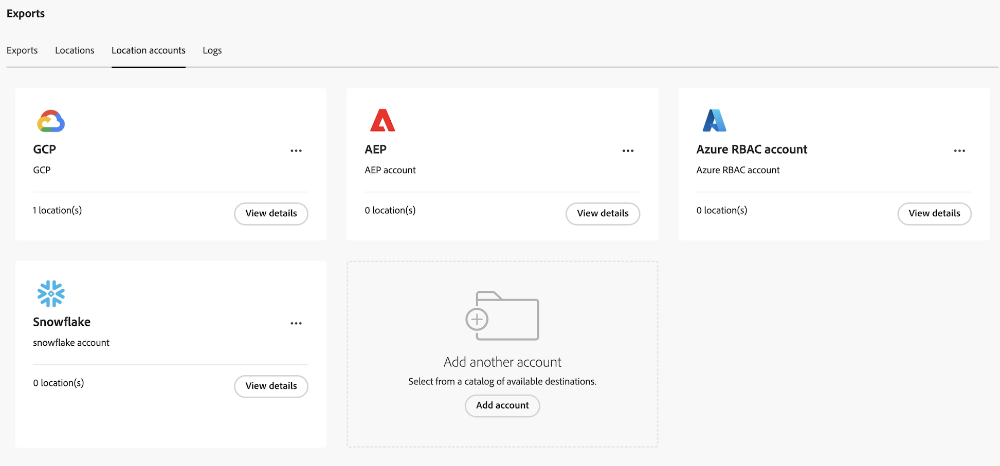

# Configurare account di esportazione cloud

{{select-package}}

Prima di esportare i dati di Customer Journey Analytics in una destinazione cloud come descritto in [Esporta dati di Customer Journey Analytics nel cloud](/help/analysis-workspace/export/export-cloud.md), devi aggiungere e configurare il percorso in cui desideri inviare i dati.

Questo processo consiste nell’aggiungere e configurare l’account (ad esempio Amazon S3, Google Cloud Platform e così via) come descritto in questo articolo, quindi aggiungere e configurare la posizione all’interno dell’account (ad esempio una cartella all’interno dell’account) come descritto in [Configurare i percorsi di esportazione cloud](/help/components/exports/cloud-export-locations.md).

Per informazioni su come gestire gli account esistenti, incluse la visualizzazione, la modifica e l&#39;eliminazione degli account, vedere [Gestire percorsi e account di esportazione cloud](/help/components/exports/manage-export-locations.md).

Devi configurare il Customer Journey Analytics con le informazioni necessarie per accedere al tuo account di destinazione cloud.

Per configurare un account di esportazione cloud:

1. In Customer Journey Analytics, seleziona [!UICONTROL **Componenti**] > [!UICONTROL **Esportazioni**].
1. Il giorno [!UICONTROL Exports] , seleziona la [!UICONTROL **Account ubicazione**] scheda.
1. Seleziona [!UICONTROL **Aggiungi account**].

   

   Viene visualizzata la finestra di dialogo Aggiungi account.
1. Specifica le seguenti informazioni: |Campo | Funzione | ---------- --------- | [!UICONTROL **Nome account località**] | Nome del conto di ubicazione. Questo nome viene visualizzato durante la creazione di una posizione | | [!UICONTROL **Descrizione del conto di ubicazione**] | Fornisci una breve descrizione del conto per distinguerlo da altri conti dello stesso tipo. | | [!UICONTROL **Tipo di account**] | Seleziona il tipo di account cloud su cui stai effettuando l’esportazione. I tipi di account disponibili sono Amazon S3 Role ARN, Google Cloud Platform, Azure SAS, Azure RBAC, Snowflake e Adobe Experience Platform. |
1. In [!UICONTROL **Proprietà account**] , specificare informazioni specifiche per il tipo di account selezionato.

   Per le istruzioni di configurazione, espandi la sezione seguente che corrisponde a [!UICONTROL **Tipo di account**] che hai selezionato.

   +++ARN per ruolo Amazon S3

   Specifica le seguenti informazioni per configurare un account ARN per il ruolo Amazon S3:

   | Campo | Funzione |
   |---------|----------|
   | [!UICONTROL **ARN per ruolo**] | È necessario fornire un ARN per il ruolo (Amazon Resource Name) che l’Adobe può utilizzare per accedere all’account Amazon S3. A tale scopo, creare un criterio di autorizzazione IAM per l&#39;account di origine, associare il criterio a un utente e quindi creare un ruolo per l&#39;account di destinazione. Per informazioni specifiche, consulta [questa documentazione di AWS](https://aws.amazon.com/premiumsupport/knowledge-center/cross-account-access-iam/). |
   | [!UICONTROL **ARN utente**] | L’ARN utente (Amazon Resource Name) è fornito da Adobe. È necessario collegare questo utente al criterio creato. |

   {style="table-layout:auto"}

+++

   +++Piattaforma Google Cloud

   Specifica le seguenti informazioni per configurare un account di Google Cloud Platform:

   | Campo | Funzione |
   |---------|----------|
   | [!UICONTROL **ID Progetto**] | ID progetto Google Cloud copiato dall’account Google Cloud. Consulta la [Documentazione di Google Cloud sull’ottenimento di un ID progetto](https://cloud.google.com/resource-manager/docs/creating-managing-projects#identifying_projects). |
   | [!UICONTROL **Entità**] | L’entità è fornita dall’Adobe. Fai clic su [!UICONTROL **Copia**] accanto al simbolo [!UICONTROL **Entità**] per copiare il contenuto del campo, quindi assicurati di concedere all’entità l’autorizzazione per caricare i file in questo bucket in Google Cloud Platform. <!-- add link to Google Cloud docs on how to do this --> |

   {style="table-layout:auto"}

+++

   +++SAS di Azure

   Specificare le informazioni seguenti per configurare un account SAS di Azure:

   | Campo | Funzione |
   |---------|----------|
   | [!UICONTROL **ID applicazione**] | Copia questo ID dall’applicazione Azure creata. In Microsoft Azure, queste informazioni si trovano nel **Panoramica** nell&#39;applicazione. Per ulteriori informazioni, vedere [Documentazione di Microsoft Azure su come registrare un’applicazione con la piattaforma Microsoft Identity](https://learn.microsoft.com/en-us/azure/active-directory/develop/quickstart-register-app). |
   | [!UICONTROL **ID tenant**] | Copia questo ID dall’applicazione Azure creata. In Microsoft Azure, queste informazioni si trovano nel **Panoramica** nell&#39;applicazione. Per ulteriori informazioni, vedere [Documentazione di Microsoft Azure su come registrare un’applicazione con la piattaforma Microsoft Identity](https://learn.microsoft.com/en-us/azure/active-directory/develop/quickstart-register-app). |
   | [!UICONTROL **URI insieme di credenziali delle chiavi**] | 
Percorso del token SAS nell&#39;insieme di credenziali delle chiavi di Azure.  Per configurare Azure SAS, è necessario memorizzare un token SAS come segreto utilizzando Azure Key Vault. Per informazioni, vedere [Documentazione di Microsoft Azure su come impostare e recuperare un segreto dall&#39;insieme di credenziali delle chiavi di Azure](https://learn.microsoft.com/en-us/azure/key-vault/secrets/quick-create-portal?source=recommendations).

Dopo la creazione dell’URI dell’insieme di credenziali delle chiavi, aggiungi un criterio di accesso nell’insieme di credenziali delle chiavi per concedere l’autorizzazione all’applicazione Azure creata. Per informazioni, vedere [Documentazione di Microsoft Azure su come assegnare un criterio di accesso all’insieme di credenziali delle chiavi](https://learn.microsoft.com/en-us/azure/key-vault/general/assign-access-policy?tabs=azure-portal).
 |
   | [!UICONTROL **Nome segreto archivio chiavi**] | Nome segreto creato quando si aggiunge il segreto all&#39;insieme di credenziali delle chiavi di Azure. In Microsoft Azure, queste informazioni si trovano nell&#39;insieme di credenziali delle chiavi creato, nel **Key Vault** pagine delle impostazioni. Per informazioni, vedere [Documentazione di Microsoft Azure su come impostare e recuperare un segreto dall&#39;insieme di credenziali delle chiavi di Azure](https://learn.microsoft.com/en-us/azure/key-vault/secrets/quick-create-portal?source=recommendations). |
   | [!UICONTROL **Segreto account località**] | Copia il segreto dall’applicazione Azure creata. In Microsoft Azure, queste informazioni si trovano nel **Certificati e segreti** nell&#39;applicazione. Per ulteriori informazioni, vedere [Documentazione di Microsoft Azure su come registrare un’applicazione con la piattaforma Microsoft Identity](https://learn.microsoft.com/en-us/azure/active-directory/develop/quickstart-register-app). <!-- need to grant permission to the bucket. Jun will send info on where that is documented) --> |

   {style="table-layout:auto"}

+++

   +++RBAC di Azure

   Specificare le informazioni seguenti per configurare un account RBAC di Azure:

   | Campo | Funzione |
   |---------|----------|
   | [!UICONTROL **ID applicazione**] | Copia questo ID dall’applicazione Azure creata. In Microsoft Azure, queste informazioni si trovano nel **Panoramica** nell&#39;applicazione. Per ulteriori informazioni, vedere [Documentazione di Microsoft Azure su come registrare un’applicazione con la piattaforma Microsoft Identity](https://learn.microsoft.com/en-us/azure/active-directory/develop/quickstart-register-app). |
   | [!UICONTROL **ID tenant**] | Copia questo ID dall’applicazione Azure creata. In Microsoft Azure, queste informazioni si trovano nel **Panoramica** nell&#39;applicazione. Per ulteriori informazioni, vedere [Documentazione di Microsoft Azure su come registrare un’applicazione con la piattaforma Microsoft Identity](https://learn.microsoft.com/en-us/azure/active-directory/develop/quickstart-register-app). |
   | [!UICONTROL **Segreto account località**] | Copia il segreto dall’applicazione Azure creata. In Microsoft Azure, queste informazioni si trovano nel **Certificati e segreti** nell&#39;applicazione. Per ulteriori informazioni, vedere [Documentazione di Microsoft Azure su come registrare un’applicazione con la piattaforma Microsoft Identity](https://learn.microsoft.com/en-us/azure/active-directory/develop/quickstart-register-app). |

   {style="table-layout:auto"}

+++

   +++Snowflake

   Specificare le informazioni seguenti per configurare un account di Snowflake:

   | Campo | Funzione |
   |---------|----------|
   | [!UICONTROL **Identificatore account**] | Identifica in modo univoco un account di Snowflake all’interno dell’organizzazione e in tutta la rete globale di piattaforme cloud supportate dal Snowflake e aree geografiche cloud. 
Per ulteriori informazioni, vedere [Pagina Identificatori account nella documentazione del Snowflake](https://docs.snowflake.com/en/user-guide/admin-account-identifier).
 |
   | [!UICONTROL **Utente**] | Specifica il nome di accesso dell&#39;utente per la connessione. Questo è un utente che verrà utilizzato specificamente per Adobe. È possibile creare l&#39;utente in Snowflake dopo aver specificato il nome utente qui. 
Per ulteriori informazioni, vedere [Pagina di riferimento dei parametri di connessione del driver JDBC nella documentazione del Snowflake](https://docs.snowflake.com/en/developer-guide/jdbc/jdbc-parameters).
 |
   | [!UICONTROL **Ruolo**] | Ruolo di controllo di accesso predefinito da utilizzare nella sessione di Snowflake avviata dal driver. È consigliabile creare un ruolo specifico, ad Adobe con accesso in lettura e scrittura.
Per ulteriori informazioni, vedere [Pagina di riferimento dei parametri di connessione del driver JDBC nella documentazione del Snowflake](https://docs.snowflake.com/en/developer-guide/jdbc/jdbc-parameters).
 |
   | [!UICONTROL **Chiave pubblica**] | La chiave pubblica è fornita da Adobe. Seleziona l’icona Copia accanto a [!UICONTROL **Chiave pubblica**] per copiare il contenuto del campo, quindi utilizzare la chiave pubblica nell&#39;account di Snowflake. Per ulteriori informazioni, vedere [Pagina di autenticazione coppia di chiavi e rotazione della coppia di chiavi nella documentazione del Snowflake](https://docs.snowflake.com/en/user-guide/key-pair-auth). |

+++

   +++Adobe Experience Platform

   Tutti i clienti Adobe Experience Platform possono esportare i dati in AEP Landing Zone.

   Specifica le seguenti informazioni per configurare un account Adobe Experience Platform.

   | Campo | Funzione |
   |---------|----------|
   | [!UICONTROL **ID organizzazione IMS**] | L’ID dell’organizzazione IMS è fornito da Adobe. Fai clic sull’icona Copia accanto a [!UICONTROL **ID organizzazione IMS**] per copiare il contenuto del campo, quindi utilizza l’ID nell’account Adobe Experience Platform. |

+++

1. Seleziona [!UICONTROL **Salva**].

1. Continua con [Configurare i percorsi di esportazione cloud](/help/components/exports/cloud-export-locations.md).

