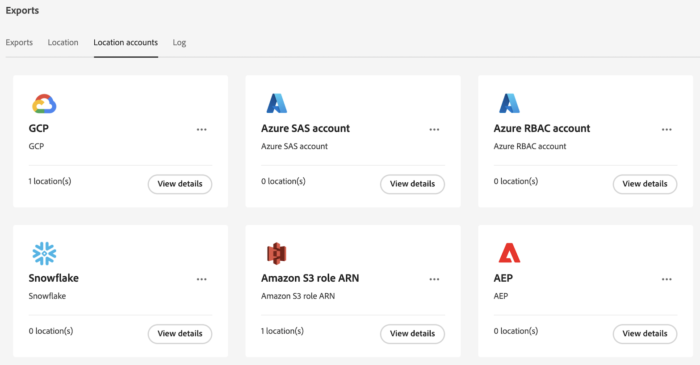

# Gestire percorsi e account di esportazione cloud

Puoi visualizzare, modificare ed eliminare i percorsi di esportazione cloud.

Per informazioni su come creare una nuova posizione, consulta [Configurare i percorsi di esportazione cloud](/help/components/exports/cloud-export-locations.md).

## Filtrare e cercare i percorsi

Per trovare le informazioni necessarie, puoi filtrare l’elenco delle posizioni o cercare una posizione.

### Filtra l’elenco delle posizioni

1. In Customer Journey Analytics, seleziona [!UICONTROL **Componenti**] > [!UICONTROL **Esportazioni**].

1. Seleziona la [!UICONTROL **Posizione**] scheda.

1. Seleziona la **Filtro** icona.

   <!-- add screenshot -->

   Puoi filtrare in base ai seguenti criteri:

   | Filtro | Descrizione |
   |---------|----------|
   | [!UICONTROL **Tipo di posizione**]<!--should this be changed to Account type?--> | Tipo di conto a cui è associata l&#39;ubicazione. Possono essere disponibili i seguenti tipi di account: <ul><li>[!UICONTROL **Area di destinazione dati Adobe Experience Platform**]</li><li>[!UICONTROL **ARN per ruolo Amazon S3**]</li><li>[!UICONTROL **Piattaforma Google Cloud**]</li><li>[!UICONTROL **SAS di Azure**]</li><li>[!UICONTROL **RBAC di Azure**]</li><li>[!UICONTROL **Snowflake**]</li></ul> |
   | [!UICONTROL **Account**] | Il nome dell’account a cui è associata la posizione. |
   | [!UICONTROL **Creato da**] | L’indirizzo e-mail dell’utente che ha creato la posizione. |

   {style="table-layout:auto"}

### Cerca posizioni

1. In Customer Journey Analytics, seleziona [!UICONTROL **Componenti**] > [!UICONTROL **Esportazioni**].

1. Seleziona la [!UICONTROL **Posizione**] scheda.

1. Nella scheda di ricerca, iniziare a digitare le informazioni associate alla posizione che si sta cercando. Puoi cercare dati da qualsiasi colonna disponibile nella tabella.

## Modifica posizioni

1. In Customer Journey Analytics, seleziona [!UICONTROL **Componenti**] > [!UICONTROL **Esportazioni**].

1. Seleziona la [!UICONTROL **Posizione**] , quindi selezionare la posizione da modificare.

   <!-- add screenshot? -->

1. Seleziona [!UICONTROL **Modifica**].

1. Apporta le modifiche desiderate, quindi seleziona [!UICONTROL **Salva**].

## Elimina posizioni

Se si elimina una posizione, vengono eliminate anche tutte le esportazioni che la utilizzano.

Prima di eliminare una posizione, verifica se è utilizzata da qualsiasi esportazione selezionando l’icona delle informazioni accanto al nome della posizione.

Per eliminare una posizione:

1. In Customer Journey Analytics, seleziona [!UICONTROL **Componenti**] > [!UICONTROL **Esportazioni**].

1. Seleziona la [!UICONTROL **Posizione**] , quindi selezionare una o più posizioni da eliminare.

   <!-- add screenshot? -->

1. Seleziona [!UICONTROL **Elimina**], quindi seleziona [!UICONTROL **Elimina**] nella finestra di dialogo di conferma.

## Modifica account

1. In Customer Journey Analytics, seleziona [!UICONTROL **Componenti**] > [!UICONTROL **Esportazioni**].

1. Seleziona la [!UICONTROL **Account ubicazione**] scheda.

   

1. Seleziona [!UICONTROL **Visualizza dettagli**] sull&#39;account che si desidera modificare.

1. Apporta le modifiche desiderate, quindi seleziona [!UICONTROL **Salva**].

## Elimina account

1. In Customer Journey Analytics, seleziona [!UICONTROL **Componenti**] > [!UICONTROL **Esportazioni**].

1. Seleziona la [!UICONTROL **Account ubicazione**] scheda.

   

1. Seleziona l’icona a tre punti sull’account da modificare, quindi seleziona [!UICONTROL **Elimina account**].

1. Seleziona [!UICONTROL **Elimina**] nella finestra di dialogo di conferma.
