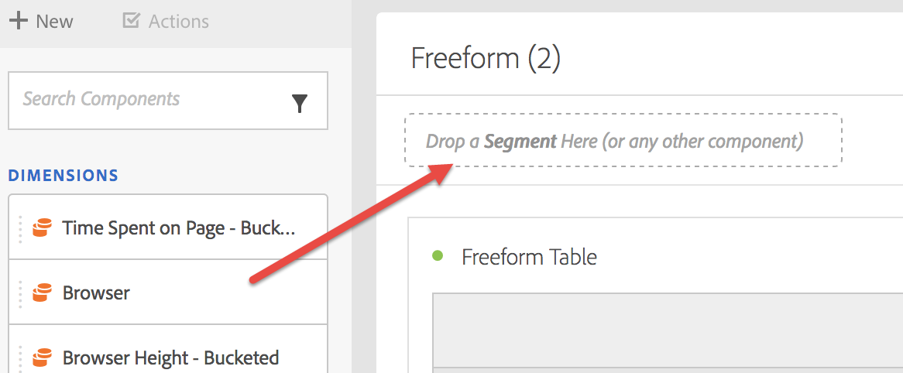

# Creare filtri

Il Generatore di filtri fornisce un area di lavoro per trascinare e rilasciare metriche, dimensioni, filtri ed eventi per filtrare i visitatori in base alla logica gerarchica del contenitore, alle regole e agli operatori. Questo strumento di sviluppo integrato ti consente di generare e salvare filtri semplici o complessi che identificano gli attributi e le azioni dei visitatori in visite e hit pagina.

Potete creare filtri istantanei rilasciando qualsiasi tipo di componente (dimensione, elemento dimensione, evento, metrica, segmento, modello di segmento, intervallo di date) nella zona di rilascio del filtro nella parte superiore di un pannello.

I tipi di componente vengono automaticamente convertiti in filtri. Alternatively, you can click the &quot;+&quot; sign in the **[!UICONTROL Add Filter]** drop box.

Nota bene:

* You **cannot** drop the following component types into the filter zone: calculated metrics and dimensions/metrics from which you cannot build filters.
* Per eventi e dimensioni intere,  Analysis Workspace crea dei filtri hit &quot;exists&quot; (esiste). Esempi: “Hit dove esiste eVar1” oppure “Hit dove esiste event1”.
* Se nella zona di rilascio del filtro viene rilasciata &quot;unspecified&quot; o &quot;none&quot;, viene automaticamente convertita in un filtro &quot;inesistente&quot; in modo da essere trattata correttamente.

>[!NOTE] I filtri creati in questo modo sono interni al progetto.

Potete scegliere di rendere pubblici (globali) questi filtri attenendovi alla procedura seguente:

1. Passa il mouse sul filtro nella zona di rilascio e fai clic sull’icona &quot;i&quot;.
1. Nel pannello informazioni visualizzato, fai clic su **[!UICONTROL Make public]** (Rendi pubbliche).

   

## Altri metodi per applicare i filtri

Esistono diversi altri metodi per applicare i filtri a un progetto:

| Azione | Descrizione |
|--- |--- |
| Crea filtro dalla selezione | Creare un filtro in linea. Selezionate le righe, fate clic con il pulsante destro del mouse sulla selezione, quindi create un filtro in linea. Questo filtro si applica solo al progetto aperto e non viene salvato come filtro CJA. 1. Seleziona le righe.  2. Fai clic con il pulsante destro del mouse sulla selezione.  3. Click *Create filter from selection*. |
| Componenti > Nuovo filtro | Visualizza il generatore di filtri. See [Filter Builder](https://docs.adobe.com/content/help/it-IT/analytics/components/segmentation/segmentation-workflow/seg-build.html) for more information about filtering. |
| Share (Condividi) > Share Project (Condividi progetto) or Share (Condividi) > Curate Project Data (Cura dati progetto) | In [Curate and Share](https://docs.adobe.com/content/help/it-IT/analytics/analyze/analysis-workspace/curate-share/curate.html#concept_4A9726927E7C44AFA260E2BB2721AFC6), learn how filters that you apply to the project are available in shared analysis for the recipient. |
| Usa filtri come dimensioni | Video: [Uso dei segmenti come dimensioni in Analysis Workspace](https://www.youtube.com/watch?v=WmSdReKTWto&amp;list=PL2tCx83mn7GuNnQdYGOtlyCu0V5mEZ8sS&amp;index=39) |
