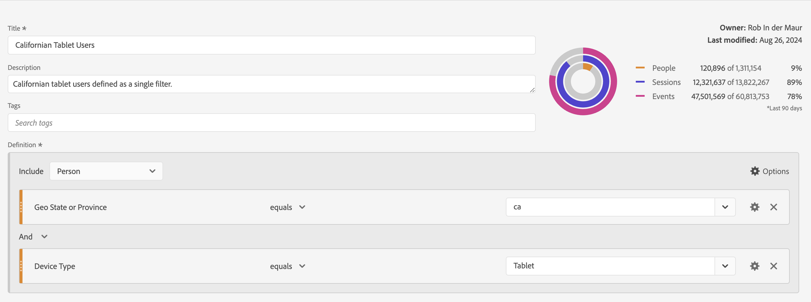

# Generare segmenti {#build-segments}

<!-- markdownlint-disable MD034 -->

>[!CONTEXTUALHELP]
>id="components_filters_createaudience"
>title="Creare un pubblico"
>abstract="I tipi di pubblico possono essere creati da un segmento e condivisi con Adobe Experience Platform per l’attivazione."

>[!CONTEXTUALHELP]
>id="components_filters_datapreview"
>title="Anteprima dati"
>abstract="Confronta i dati di questo segmento con i dati della visualizzazione dati. La percentuale di anteprima è basata sul numero totale della visualizzazione dati a partire dagli **ultimi 90 giorni**.  Se l’anteprima non viene caricata, è possibile che la connessione sia ancora in retrocompilazione."

La finestra di dialogo **[!UICONTROL Segment builder]** viene utilizzata per creare nuovi segmenti o modificare quelli esistenti. La finestra di dialogo si chiama **[!UICONTROL New segment]** o **[!UICONTROL Edit segment]** per i segmenti creati o gestiti dal gestore [[!UICONTROL Segment]](/help/components/filters/manage-filters.md).

>[!BEGINTABS]

>[!TAB Generatore di segmenti]

>[!TAB Crea o modifica segmento]

>[!ENDTABS]

1. Specifica i dettagli seguenti ( indica i dati obbligatori):

   | Elemento | Descrizione |
   | --- | --- |
   | **[!UICONTROL Data view]** | Puoi selezionare la visualizzazione dati per il segmento.  Il segmento definito è disponibile come segmento nella scheda [Impostazioni](/help/data-views/create-dataview.md#settings-filters) di una visualizzazione dati. |
   | **[!UICONTROL Project-only segment]** | Una casella di informazioni per spiegare che il segmento è visibile solo nel progetto in cui viene creato e che non verrà aggiunto all’elenco dei componenti. Consenti a **[!UICONTROL Make this segment available to all your projects and add it to your component list]** di modificare tale impostazione. Questa casella di informazioni è visibile solo quando si crea un [segmento rapido](quick-filters.md) e si trasforma le informazioni del segmento rapido in un segmento normale utilizzando **[!UICONTROL Open builder]** dall&#39;interfaccia [!UICONTROL Quick segment]. |
   | **[!UICONTROL Title]**  | Denomina il segmento, ad esempio `Last month mobile customers`. |
   | **[!UICONTROL Description]** | Fornire una descrizione per il segmento, ad esempio `Segment to define the mobile customers for the last month`. |
   | **[!UICONTROL Tags]** | Organizza il segmento creando o applicando uno o più tag. Inizia a digitare per trovare i tag esistenti che puoi selezionare. Oppure premi **[!UICONTROL ENTER]** per aggiungere un nuovo tag. Seleziona  per rimuovere un tag. |
   | **[!UICONTROL Definition]**  | Definisci il segmento utilizzando il [Generatore di definizioni](#definition-builder). |

   {style="table-layout:auto"}

1. Per verificare se la definizione del segmento è corretta, utilizza l’anteprima costantemente aggiornata dei risultati del segmento in alto a destra.
1. Per creare un pubblico dal segmento e condividerlo con Experience Platform, seleziona **[!UICONTROL Create audience from segment]**. Per ulteriori informazioni, consulta [Creare e pubblicare tipi di pubblico](/help/components/audiences/publish.md).
1. Seleziona:
   * **[!UICONTROL Save]** per salvare il segmento.
   * **[!UICONTROL Save As]** per salvare una copia del segmento.
   * **[!UICONTROL Delete]** per eliminare il segmento.
   * **[!UICONTROL Cancel]** per annullare eventuali modifiche apportate al segmento o per annullare la creazione di un nuovo segmento.

## Generatore di definizioni

Utilizza il Generatore di definizioni per creare la definizione del segmento. In questa creazione vengono utilizzati componenti, contenitori, operatori e logica.

Puoi configurare il tipo e l’ambito della definizione:

1. Per specificare il tipo di definizione, indica se desideri creare una definizione di inclusione o esclusione. Selezionare  **[!UICONTROL Options]** e dal menu a discesa **[!UICONTROL Include]** o **[!UICONTROL Exclude]**.
1. Per specificare l&#39;ambito della definizione, selezionare dal menu a discesa **[!UICONTROL Include]** o **[!UICONTROL Exclude]** se si desidera che l&#39;ambito della definizione sia **[!UICONTROL Event]**, **[!UICONTROL Session]**, **[!UICONTROL Person]**, **[!UICONTROL Global Account]** [!BADGE B2B edition]{type=Informative url="https://experienceleague.adobe.com/it/docs/analytics-platform/using/cja-overview/cja-b2b/cja-b2b-edition" newtab=true tooltip="Customer Journey Analytics B2B Edition"}, **[!UICONTROL Account]** [!BADGE B2B edition]{type=Informative url="https://experienceleague.adobe.com/it/docs/analytics-platform/using/cja-overview/cja-b2b/cja-b2b-edition" newtab=true tooltip="Customer Journey Analytics B2B Edition"}, **[!UICONTROL Opportunity]** [!BADGE B2B edition]{type=Informative url="https://experienceleague.adobe.com/it/docs/analytics-platform/using/cja-overview/cja-b2b/cja-b2b-edition" newtab=true tooltip="Customer Journey Analytics B2B Edition"} o **[!UICONTROL Buying Group]** [!BADGE B2B edition]{type=Informative url="https://experienceleague.adobe.com/it/docs/analytics-platform/using/cja-overview/cja-b2b/cja-b2b-edition" newtab=true tooltip="Customer Journey Analytics B2B Edition"}

È sempre possibile modificare queste impostazioni in un secondo momento.

### Componenti

Una parte fondamentale della costruzione della definizione del segmento è l’utilizzo di dimensioni, metriche, segmenti esistenti e intervalli di date. Tutti questi componenti sono disponibili dal pannello dei componenti nel Generatore di segmenti.

{width=100%}

Per aggiungere un componente:

1. Trascina un componente dal pannello dei componenti su **[!UICONTROL Drag and drop Metric(s), Segment(s), and/or Dimensions here]**. Puoi usare  nella barra dei componenti per cercare componenti specifici.
1. Specifica i dettagli del componente. Ad esempio, seleziona un valore da **[!UICONTROL Select value]**. Oppure inserisci un valore. Cosa e come specificare uno o più valori dipende dal componente e dall’operatore.
1. Facoltativamente, modifica l’operatore predefinito. Ad esempio, da **[!UICONTROL equals]** a **[!UICONTROL equals any of]**. Consulta [Operatori](operators.md) per una panoramica dettagliata degli operatori disponibili.

Per modificare un componente:

* Seleziona un nuovo operatore per il componente dal menu a discesa operatore.
* Se è il caso, seleziona o specifica un valore diverso per l’operatore.
* Se il tipo di componente è una dimensione, puoi definire il modello di attribuzione. Per ulteriori informazioni, consulta [Modello di attribuzione](#attribution-models).

Per eliminare un componente:

* Seleziona  in un componente.

### Contenitori

Puoi raggruppare più componenti in uno o più contenitori e definire la logica all’interno e tra contenitori. I contenitori consentono di creare definizioni complesse per il segmento.

{Width=100%}

* Per aggiungere un contenitore, seleziona **[!UICONTROL Add container]** da  **[!UICONTROL Options]**.
* Per aggiungere un componente esistente al contenitore, trascinalo nel contenitore.
* Per aggiungere un altro componente al contenitore, trascinalo dal pannello dei componenti al contenitore. Utilizza la linea di inserimento blu come guida.
* Per aggiungere un altro componente all’esterno del contenitore, trascinalo dal pannello dei componenti all’esterno del contenitore, ma all’interno del contenitore di definizione principale. Utilizza la linea di inserimento blu come guida.
* Per modificare la logica tra i componenti di un contenitore, tra contenitori o tra un contenitore e un componente, seleziona **[!UICONTROL And]**, **[!UICONTROL Or]**, **[!UICONTROL Then]** appropriati. Quando selezioni Then, il segmento viene trasformato in un segmento sequenziale. Per ulteriori informazioni, vedere [Creare un segmento sequenziale](seg-sequential-build.md).
* Per cambiare il livello del contenitore, seleziona  **[!UICONTROL Global Account]** [!BADGE B2B Edition]{type=Informative url="https://experienceleague.adobe.com/it/docs/analytics-platform/using/cja-overview/cja-b2b/cja-b2b-edition" newtab=true tooltip="Customer Journey Analytics B2B Edition"},  **[!UICONTROL Account]** [!BADGE B2B Edition]{type=Informative url="https://experienceleague.adobe.com/it/docs/analytics-platform/using/cja-overview/cja-b2b/cja-b2b-edition" newtab=true tooltip="Customer Journey Analytics B2B Edition"},  **[!UICONTROL Opportunity]** [!BADGE B2B Edition]{type=Informative url="https://experienceleague.adobe.com/it/docs/analytics-platform/using/cja-overview/cja-b2b/cja-b2b-edition" newtab=true tooltip="Customer Journey Analytics B2B Edition"},  **[!UICONTROL Buying Group]** [!BADGE B2B Edition]{type=Informative url="https://experienceleague.adobe.com/it/docs/analytics-platform/using/cja-overview/cja-b2b/cja-b2b-edition" newtab=true tooltip="Customer Journey Analytics B2B Edition"},  **[!UICONTROL Event]**,  **[!UICONTROL Session]** o  **[!UICONTROL Person]**.

È possibile utilizzare  in un contenitore per le azioni seguenti:

| Azione contenitore | Descrizione |
|---|---|
| **[!UICONTROL Add container]** | Aggiungi un contenitore nidificato al contenitore. |
| **[!UICONTROL Exclude]** | Escludi il risultato dal contenitore nella definizione del segmento. Una barra a sinistra rossa sottile identifica un contenitore di esclusione. |
| **[!UICONTROL Include]** | Includi il risultato del contenitore nella definizione del segmento. “Includi” è l’impostazione predefinita. Una sottile barra grigia a sinistra identifica un contenitore di inclusione. |
| **[!UICONTROL Name container]** | Rinomina il contenitore dalla relativa descrizione predefinita. Digita un nome nel campo di testo. Se non fornisci alcun input, viene utilizzata la descrizione predefinita. |
| **[!UICONTROL Delete container]** | Elimina il contenitore dalla definizione. |

## Intervalli di date

Puoi creare segmenti che contengono intervalli di date continui. In questo modo, potrai rispondere a domande su campagne o eventi in corso. Ad esempio, puoi creare un segmento che include *tutti coloro che hanno effettuato un acquisto online negli ultimi 60 giorni*.

>[!BEGINSHADEBOX]

Per un video dimostrativo, guarda  [Intervalli di date continui nei segmenti](https://video.tv.adobe.com/v/25403/?quality=12&learn=on){target="_blank"}.

>[!ENDSHADEBOX]

## Sovrapponi segmenti {#stack}

Puoi creare un segmento utilizzando i segmenti. Quando utilizzi i segmenti in un segmento, puoi ottimizzare il segmento e ridurne la complessità.

Immagina di voler segmentare sulla combinazione di tipo di dispositivo (2) e stati degli Stati Uniti (50). Puoi creare 100 segmenti, ciascuno per la combinazione unica di tipo di dispositivo (telefono cellulare rispetto a tablet) e stato degli Stati Uniti. Per ottenere gli utenti del tablet in California, puoi utilizzare uno dei 100 segmenti:

Oppure potresti definire 52 segmenti: 50 segmenti per gli Stati Uniti, uno per il cellulare e uno per il tablet. Quindi impilare i segmenti per ottenere gli stessi risultati. Per ottenere gli utenti del tablet della California, puoi impilare due segmenti:

## Attribution {#attribution}

>[!CONTEXTUALHELP]
>id="components_filters_attribution_repeating"
>title="Ripetizione"
>abstract="Include le istanze e i valori persistenti per la dimensione."

>[!CONTEXTUALHELP]
>id="components_filters_attribution_instance"
>title="Istanza"
>abstract="Include le istanze per la dimensione."

>[!CONTEXTUALHELP]
>id="components_filters_attribution_nonrepeatinginstance"
>title="Istanza non ripetuta"
>abstract="Include istanze univoche (non ripetute) per la dimensione."

Quando utilizzi una dimensione nel Generatore di segmenti, puoi specificare il modello di attribuzione per tale dimensione. Il modello di attribuzione selezionato determina se i dati sono idonei per la condizione specificata per il componente dimensione.

Seleziona  all’interno del componente dimensione e seleziona uno dei modelli di attribuzione dalla finestra a comparsa:

| Modelli | Descrizione |
|---|---|
| **[!UICONTROL Repeating model (default)]** | Includi l’istanza e i valori persistenti per la dimensione per determinare la qualifica. |
| **[!UICONTROL Instance]** | Includi solo i valori di istanza per la dimensione per determinare la qualifica. |
| **[!UICONTROL Non-repeating instance]** | Includi valori univoci di istanza (non ripetuti) per la dimensione per determinare la qualifica. |

### Esempio

Come parte della definizione di un segmento hai specificato la seguente condizione: Nome pagina è uguale a Donne. Simile all’esempio precedente. Ripeti questa definizione del segmento utilizzando gli altri due modelli di attribuzione. Pertanto, hai tre segmenti ciascuno con il proprio modello di attribuzione:

* Pagina Donne - Attribuzione - Ripetuta (per impostazione predefinita)
* Pagina Donne - Attribuzione - Istanza
* Pagina Donne - Attribuzione - Istanza non ripetuta

La tabella seguente spiega, per ogni modello di attribuzione, quali eventi in arrivo sono qualificati  per tale condizione.

| Pagina Donne - Attribuzione -  *modello di attribuzione* | Evento 1: Il Nome pagina è uguale a Donne | Evento 2: Il Nome pagina è uguale a Uomini | Evento 3: Il Nome pagina è uguale a Donne | Evento 4: Il Nome pagina è uguale a Donne (persistente) | Evento 5: Il Nome pagina è uguale a Pagamento | Evento 6: Il Nome pagina è uguale a Donne | Evento 7: Il Nome pagina è uguale a Pagina Home |
|---|:---:|:---:|:---:|:---:|:---:|:---:|:--:|
| Ripetizione (per impostazione predefinita) |  |  |  |  |  |  |  |
| Istanza |  |  |  |  |  |  |  |
| Istanza non ripetuta |  |  |  |  |  |  |  |

Un esempio di rapporto sugli eventi che utilizzano i tre segmenti è simile al seguente:

<!-- markdownlint-enable MD034 -->