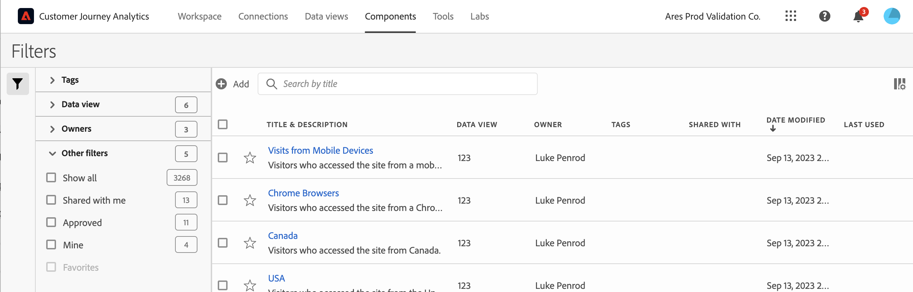

# Gestione filtri

Il gestore Filtri offre diversi modi per curare i filtri, ad esempio condividere, assegnare tag, approvare, copiare, eliminare e contrassegnare come preferiti.

Il Gestore filtri mostra tutti i filtri di tua proprietà e che sono stati condivisi con te. Gli utenti a livello di amministratore possono visualizzare tutti i filtri dell’organizzazione. Questa panoramica presenta l’interfaccia utente e le funzionalità del gestore Filtri.

## Accedere al Gestore filtri

1. In Customer Journey Analytics, seleziona la **[!UICONTROL Components]** , quindi seleziona **[!UICONTROL Filters]**.

## Azioni disponibili in Gestione filtri

In Gestione filtri puoi effettuare le seguenti operazioni:

* [Filtrare l’elenco dei filtri](/help/components/filters/filters-filter.md)

* [Contrassegnare i filtri come preferiti](/help/components/filters/filters-favorite.md)

* [Approvare i filtri](/help/components/filters/filters-approve.md)

* [Assegnare tag ai filtri](/help/components/filters/filters-tag.md)

* [Condividere i filtri](/help/components/filters/filters-share.md)

* Esporta un filtro in un file CSV.

* [Copia filtri](/help/components/filters/filters-copy.md)

* Elimina filtri

## Configurare le colonne

Puoi configurare le informazioni visualizzate per ciascun filtro in Gestione filtri configurando le colonne visualizzate.

Per configurare le colonne visibili in Gestione filtri:

1. In Customer Journey Analytics, seleziona la **[!UICONTROL Components]** , quindi seleziona **[!UICONTROL Filers]**.

1. In Gestione filtri, seleziona la **Personalizza colonne** icona , quindi seleziona le colonne da visualizzare in Gestione filtri.

   Sono disponibili le seguenti colonne:

   | Titolo colonna | Descrizione |
   |---|---|
   | Titolo e descrizione | Questi valori vengono forniti nel Generatore di filtri. Per modificare il titolo e la descrizione, seleziona il collegamento del titolo per aprire il Generatore di filtri. |
   | Preferiti | Visualizza icone a forma di stella accanto a ciascun filtro, che consentono di contrassegnare i filtri come preferiti. Per ulteriori informazioni, consulta [Contrassegnare i filtri come preferiti](/help/components/filters/filters-favorite.md). |
   | Visualizzazione dati | Questa colonna indica in quale visualizzazione dati il filtro è stato salvato l’ultima volta. |
   | Proprietario | Indica il proprietario del filtro. Come non amministratore, puoi visualizzare solo i filtri che possiedi o quelli che sono stati condivisi con te. |
   | Tag (non selezionato nel selettore colonna, di conseguenza la colonna non viene visualizzata) | I tag applicati al filtro, da te stesso o da altri utenti che lo hanno condiviso con te. |
   | Condiviso con | Elenca singoli utenti o gruppi (solo amministratore) o tutti coloro (solo amministratore) con cui hai condiviso il filtro. 
Quando un filtro viene condiviso da te o con te, accanto al nome del filtro viene visualizzata un’icona di condivisione.
 |
   | Data di modifica | Mostra la data dell’ultima modifica apportata al filtro. |
   | Utilizzato in | Mostra quanti componenti il filtro è attualmente utilizzato in. 
Ad esempio, se il filtro viene utilizzato in 40 progetti e 2 avvisi, il valore di questa colonna viene visualizzato come [!UICONTROL **42 componenti**].
 
Seleziona il valore in questa colonna per visualizzare il raggruppamento della posizione in cui viene utilizzato il filtro (ad esempio, [!UICONTROL **Progetti (40)**], [!UICONTROL **Avvisi (2)**]).

I filtri possono essere utilizzati in uno qualsiasi dei seguenti tipi di componenti:
 <ul><li>Metriche calcolate</li><li>Progetti</li><li>Progetti programmati</li></ul>
Queste informazioni possono essere utili per determinare se un componente è utile per gli utenti dell’organizzazione, dove viene utilizzato e se deve essere eliminato o modificato.

Quando visualizzi questa colonna, tieni presente quanto segue:
<ul><li>Queste informazioni non includono l’utilizzo da API, Report Builder o Data Warehouse.</li><li>Il [!UICONTROL **Utilizzato in**] non viene visualizzata per impostazione predefinita. [Configurare le colonne](#configure-columns) per visualizzarlo.</li><li>Se non sono presenti dati in questa colonna per un determinato componente, ma è presente un [!UICONTROL **Ultimo utilizzo**] data, il componente potrebbe essere stato utilizzato in un’analisi senza essere stato salvato.</li></ul>
È possibile utilizzare [Dizionario dati](/help/components/data-dictionary/data-dictionary-overview.md) oltre a queste informazioni, ti aiuteranno a tenere traccia di come i componenti vengono utilizzati nella tua organizzazione e a comprenderne meglio il funzionamento.
 |
   | Ultimo utilizzo | Mostra la data dell’ultimo utilizzo del filtro in uno dei seguenti tipi di componenti: <ul><li>Metriche calcolate</li><li>Progetti</li><li>Progetti programmati</li><li>Filtri</li></ul> 
Queste informazioni possono essere utili per determinare se un componente è utile per gli utenti dell’organizzazione o se deve essere eliminato.

Quando visualizzi questa colonna, tieni presente quanto segue:
<ul><li>Queste informazioni non includono l’utilizzo da API, Report Builder o Data Warehouse.</li><li>Per alcuni componenti, questa colonna potrebbe non contenere dati se il componente è stato utilizzato l’ultima volta prima di settembre 2023.</li></ul>
È possibile utilizzare [Dizionario dati](/help/components/data-dictionary/data-dictionary-overview.md) oltre a queste informazioni, ti aiuteranno a tenere traccia di come i componenti vengono utilizzati nella tua organizzazione e a comprenderne meglio il funzionamento. |

   {style="table-layout:auto"}
