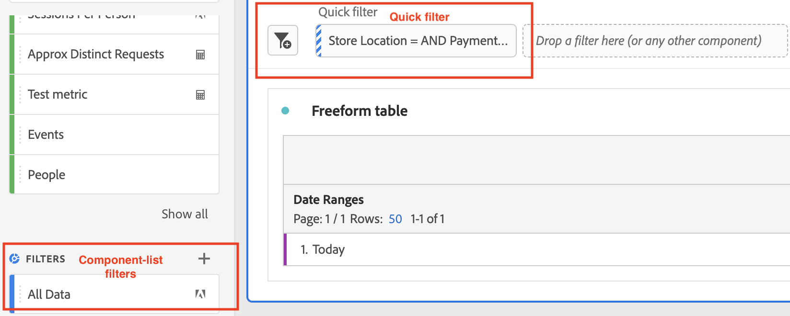
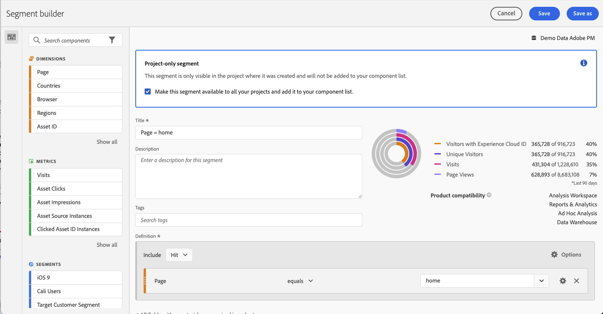

# Filtri rapidi

Puoi creare filtri rapidi all’interno di un progetto per evitare la complessità del [Generatore di filtri](/help/components/filters/create-filters.md). Filtri rapidi

* Applica come [segmenti solo progetto](https://experienceleague.adobe.com/docs/analytics-platform/analysis-workspace/components/filters/quick-filters.html).
* Consenti fino a 3 regole
* Non inserire contenitori nidificati o regole sequenziali.

Per un confronto tra ciò che i filtri rapidi possono fare e i filtri elenco componenti completi, vai [qui](/help/components/filters/filters-overview.md).

## Prerequisiti {#prereqs}

Chiunque può creare un segmento rapido. Tuttavia, devi disporre dell’autorizzazione per la creazione dei segmenti nella sezione [Adobe Admin Console](https://experienceleague.adobe.com/docs/analytics/admin/admin-console/permissions/summary-tables.html?lang=it#analytics-tools) per salvare un segmento rapido o aprirlo nel Generatore di segmenti.

## Creare filtri rapidi {#create}

In una tabella a forma libera, fai clic sull’icona Filtro+ nell’intestazione del pannello:

| Impostazione | Descrizione |
| --- | --- |
| [!UICONTROL Name] | Il nome predefinito di un filtro è una combinazione dei nomi delle regole nel filtro. È possibile rinominare il filtro in un nome più semplice. |
| [!UICONTROL Include/exclude] | Puoi includere o escludere componenti nella definizione del filtro, ma non entrambi. |
| [!UICONTROL Hit/Visit/Visitor] container | I filtri rapidi ne includono uno [contenitore filtro](https://experienceleague.adobe.com/docs/analytics-platform/using/cja-components/cja-filters/filters-overview.html?lang=en#filter-containers) solo che ti consente di includere una dimensione/metrica/intervallo di date nel filtro (o escluderlo da esso). [!UICONTROL Visitor] contiene i dati generali specifici del visitatore per visite e visualizzazioni di pagina. Un contenitore [!UICONTROL Visit] consente di impostare regole per suddividere i dati del visitatore in base alle visite, mentre un contenitore [!UICONTROL Hit] consente di suddividere le informazioni del visitatore in base alle singole visualizzazioni di pagina. Il valore predefinito è [!UICONTROL Hit]. |
| [!UICONTROL Components] (Dimension/metrica/intervallo di date) | Definisci fino a 3 regole aggiungendo componenti (dimensioni, metriche, intervalli di date o valori di dimensione). Ci sono 3 modi per trovare il componente giusto:<ul><li>Inizia a digitare; il generatore di [!UICONTROL Quick Filter] trova automaticamente il componente appropriato.</li><li>Utilizza l’elenco a discesa per trovare il componente.</li><li>Trascina e rilascia i componenti dalla barra a sinistra.</li></ul> |
| [!UICONTROL Operator] | Utilizza il menu a discesa per trovare gli operatori standard e gli operatori [!UICONTROL Distinct Count]. Vedi [Operatori di filtro](operators.md). |
| Segno più (+) | Aggiunge un’altra regola, |
| Qualificatori AND/OR | Puoi aggiungere i qualificatori &quot;AND&quot; o &quot;OR&quot; alle regole, ma non puoi combinare &quot;AND&quot; e &quot;OR&quot; in una singola definizione di filtro. |
| [!UICONTROL Apply] | Applica questo filtro al pannello. Se il filtro non contiene dati, ti verrà chiesto se desideri continuare. |
| [!UICONTROL Open builder] | Apre il Generatore di filtri. Una volta salvato o applicato il filtro nel Generatore di filtri, non viene più considerato un &quot;Filtro rapido&quot;. Diventa parte della libreria di filtri per elenchi di componenti. |
| [!UICONTROL Cancel] | Annulla questo filtro rapido - non applicarlo. |
| [!UICONTROL Date range] | La convalida utilizza l’intervallo di date del pannello per la ricerca dei dati. Tuttavia, qualsiasi intervallo di date applicato in un filtro rapido sostituisce l’intervallo di date del pannello nella parte superiore del pannello. |
| Anteprima (in alto a destra) | Consente di verificare se si dispone di un filtro valido e la sua ampiezza. Rappresenta il raggruppamento del set di dati che si prevede di visualizzare quando si applica questo filtro. Potresti ricevere un avviso che indica che questo filtro non ha dati. In questo caso, puoi procedere o modificare la definizione del filtro. |

Ecco un esempio di filtro che combina dimensioni e metriche:

Il filtro viene visualizzato nella parte superiore. Osserva la sua barra laterale a strisce blu, invece della barra laterale blu per i filtri a livello di componente nella libreria dei filtri a sinistra.

## Modificare i filtri rapidi {#edit}

1. Passa il puntatore del mouse sul filtro rapido e seleziona l’icona a forma di matita .
1. Modifica la definizione del filtro o il nome del filtro.
1. Fai clic su [!UICONTROL Apply].

## Salvare i filtri rapidi {#save}

Puoi scegliere di salvare i filtri rapidi nella [!UICONTROL Quick Filter Builder] o [!UICONTROL Filter Builder].

>[!IMPORTANT]
>Una volta salvato o applicato il filtro, non è più possibile modificarlo nel Generatore di filtri rapidi, solo nel Generatore di filtri regolare.

### Salva nel generatore di filtri rapidi {#save2}

1. Dopo aver applicato il filtro rapido, passa il cursore sopra di esso e seleziona l’icona info (&quot;i&quot;).
1. Fai clic su **[!UICONTROL Make available to all projects and add to your component list]**.
1. (Facoltativo) Rinomina il filtro.
1. Fai clic su **[!UICONTROL Save]**.

La barra laterale del filtro cambia da blu striato a blu più chiaro. Ora viene visualizzato nell’elenco dei componenti nella barra a sinistra.

### Salva nel generatore di filtri {#save3}

1. Passa il puntatore del mouse sul filtro rapido e seleziona l’icona Info (&quot;i&quot;).
1. Select **[!UICONTROL Save filter]**
1. Lascia il nome così com’è o rinomina il filtro.

   Torna a Workspace e osserva come il filtro ora ha una barra laterale blu chiara. Questo indica che non è più possibile modificarlo o aprirlo nel Generatore di filtri rapidi. E salvandolo, diventa parte dell&#39;elenco dei componenti.

   

Dopo aver applicato il filtro, puoi scegliere di aggiungerlo all’elenco dei componenti del filtro e renderlo disponibile per tutti i tuoi progetti.

1. Passa il puntatore del mouse sul filtro salvato e seleziona l’icona a forma di matita .

1. Nella parte superiore del Generatore di filtri, notare questa finestra di dialogo:

   

1. Seleziona la casella di controllo accanto a **[!UICONTROL Make available to all your projects and add to your component list.]**
1. Fai clic su **[!UICONTROL Save]**.
1. Il filtro viene ora visualizzato nell’elenco dei componenti filtro per tutti i progetti.
1. È inoltre possibile [condividere il filtro](/help/components/filters/manage-filters.md) con altre persone della tua organizzazione.

## Cosa sono i filtri per soli progetti? {#project-only}

I filtri per soli progetti sono filtri applicabili solo al progetto corrente in cui sono stati creati. Non sono disponibili in altri progetti e non possono essere condivisi con altri utenti. Sono progettati per un’esplorazione rapida dei dati senza dover creare e salvare un filtro nella barra a sinistra. I filtri per soli progetti possono essere creati nella zona di rilascio del pannello con i filtri rapidi o [filtri ad hoc](/help/components/filters/ad-hoc-filters.md).

Se apri un filtro solo progetto in [!UICONTROL Filter Builder], viene visualizzata una notifica solo per il progetto. Se non selezioni &quot;Rendi questo filtro disponibile.&quot; e fai clic su **[!UICONTROL APPLY]**, il segmento rimane un segmento solo progetto.

>[!NOTE]
>
>Se applichi un filtro rapido dal Generatore di filtri, non può più essere aperto nella [!UICONTROL Quick Filter Builder].

Se selezioni &quot;Rendi questo filtro disponibile.&quot; e fai clic su **[!UICONTROL SAVE]**, il filtro diventa disponibile nell’elenco dei componenti della barra a sinistra e può essere utilizzato in altri progetti. Può essere condiviso anche con altri utenti dal Gestore filtri.

