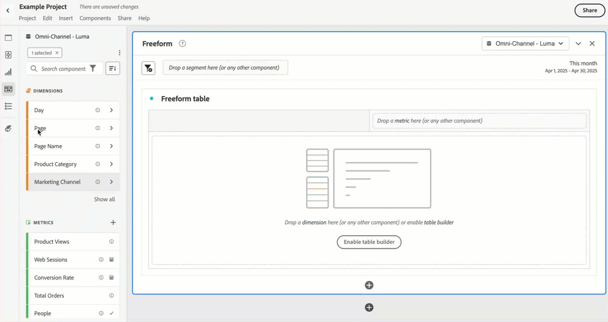

# Panoramica dei componenti

I componenti sono funzioni di Customer Journey Analytics che possono essere utilizzate nelle visualizzazioni (come Tabella a forma libera) o per integrare le funzioni di reporting.

Per gestire i componenti dall’interfaccia principale di Customer Journey Analytics:

1. Seleziona **[!UICONTROL Components]** nella barra superiore.
1. Seleziona **[!UICONTROL Components]** per visualizzare una panoramica dei componenti che puoi gestire oppure seleziona direttamente il componente che desideri gestire dal menu.

Puoi gestire i seguenti componenti:

* [Segmenti](filters/filters-overview.md): crea, gestisci, condividi e applica segmenti di pubblico potenti e incentrati sui tuoi rapporti. I segmenti ti consentono di identificare sottoinsiemi di persone in base a caratteristiche o interazioni.
* [Metriche calcolate:](calc-metrics/calc-metr-overview.md) utilizza metriche e formule come nuovi componenti da utilizzare nella generazione rapporti.
* [Intervalli di date](date-ranges/create.md): personalizza e perfeziona gli intervalli di date che offre Analysis Workspace.
* [Annotazioni](/help/components/annotations/overview.md): comunica alla tua organizzazione informazioni e dettagli contestuali sui dati.
* [Avvisi intelligenti](/help/components/c-intelligent-alerts/intelligent-alerts.md): consentono di ricevere notifiche in base a percentuali di cambiamento o a punti dati specifici.
* [Progetti pianificati](/help/analysis-workspace/export/t-schedule-report.md#scheduled-projects-manager): gestisci i progetti pianificati.
* [Preferenze](/help/analysis-workspace/user-preferences.md): gestisci le preferenze di Analysis Workspace.
* [Tipi di pubblico](/help/components/audiences/audiences-overview.md): crea e pubblica i tipi di pubblico da Customer Journey Analytics a [Real-Time Customer Data Platform](https://experienceleague.adobe.com/it/docs/experience-platform/profile/home) in Experience Platform per la personalizzazione e il targeting.
* [Esportazioni](/help/components/exports/manage-export-locations.md): gestisci l’account e le posizioni di esportazione.

## Componenti di Analysis Workspace

I componenti in Analysis Workspace costituiscono metriche, dimensioni, segmenti e intervalli di date che puoi trascinare su pannelli e visualizzazioni nel progetto Workspace. I componenti creati, come ad esempio una metrica calcolata, vengono aggiunti a questi pannelli o a un intervallo di date personalizzato.

Per accedere al pannello Componenti, seleziona  **[!UICONTROL Components]** nel pannello del pulsante.

Consulta [Creare un progetto](/help/analysis-workspace/home.md) per informazioni su come utilizzare i componenti all’interno di un progetto.

## Gestire i componenti {#actions}

È possibile creare rapidamente un nuovo componente utilizzando il menu **[!UICONTROL Components]** in Analysis Workspace. Per ulteriori dettagli, consulta il [menu Analysis Workspace](/help/analysis-workspace/home.md#menu).

Puoi gestire i componenti (singolarmente o selezionandone più di uno).

1. Seleziona uno o più componenti.

1. Dal menu di scelta rapida o dal pulsante  Azioni componente (nella parte superiore di Componenti), seleziona una delle azioni seguenti.

   >[!TIP]
   >
   >Per selezionare più componenti, tieni premuto **[!UICONTROL Shift]** oppure **[!UICONTROL Command]** (su macOS) o **[!UICONTROL Ctrl]** (su Windows).

   {width=100%}

   | Azione componenti | Descrizione |
   |--- |--- |
   |  [!UICONTROL **Tag**] | Organizzare o gestire i componenti tramite l’applicazione di tag. Puoi eseguire la ricerca nel pannello a sinistra facendo clic sul filtro  o digitando `#`. I tag fungono anche da filtri nei gestori dei componenti. |
   |  [!UICONTROL **Preferiti**] | Aggiunge il componente all’elenco dei preferiti. Come per i tag, puoi cercare i Preferiti nel pannello a sinistra e filtrarli nei gestori dei componenti. |
   |  **[!UICONTROL Un-favorite]** | Rimuovi il componente dall’elenco dei preferiti. |
   |  [!UICONTROL **Approva**] | Contrassegna i componenti come approvati per segnalare agli utenti che sono approvati dall’organizzazione. Come per i tag, puoi cercare e filtrare per Approvato nel pannello a sinistra. Un  identifica i componenti approvati. |
   |  [!UICONTROL **Condividi**] | Condividi i componenti con gli utenti della tua organizzazione. Questa opzione è disponibile solo per i componenti personalizzati, ad esempio segmenti o metriche calcolate. |
   |  [!UICONTROL **Elimina**] | Elimina i componenti non più necessari. Questa opzione è disponibile solo per i componenti personalizzati, ad esempio segmenti o metriche calcolate. |

I componenti personalizzati possono essere gestiti anche tramite i rispettivi gestori di componenti. Ad esempio, consulta [Gestire i segmenti](/help/components/filters/manage-filters.md).

## Gestione dell’elenco dei componenti

Puoi cercare, filtrare e ordinare l’elenco dei componenti nel pannello a sinistra di Analysis Workspace per individuare un particolare componente.

### Ricerca

1. Seleziona **Componenti**  nel pannello a sinistra.

2. Nel campo di ricerca, inizia a digitare il nome del componente da visualizzare nel progetto.

   Un colore e un’icona identificano il tipo di componente. **Le dimensioni**  sono arancioni, **Segmenti**  è blu, **Intervalli di date**  è viola e **Metriche**  è verde. L’icona Adobe  indica un modello di metrica calcolata o un modello di segmento. L’icona della calcolatrice  indica una metrica calcolata creata da un amministratore dell’organizzazione.

3. Seleziona il componente dal menu a discesa.

### Filtro

1. Seleziona l’icona **Componenti**  nel pannello a sinistra.

2. Seleziona **Filtro**  oppure immetti `#` nel campo di ricerca.

3. Per filtrare l’elenco dei componenti, seleziona una delle seguenti opzioni filtro:

   | Icona | Opzione filtro | Descrizione |
   |---------|---|----------|
   |  | **[!UICONTROL Approved]** | Mostra solo i componenti contrassegnati come approvati da un amministratore. |
   |  | **[!UICONTROL Favorites]** | Mostra solo i componenti inclusi nell’elenco dei Preferiti.  Per informazioni sull’aggiunta di componenti all’elenco dei preferiti, consulta [Gestire i componenti](#manage-components). |
   |  | **[!UICONTROL Dimensions]** | Mostra solo i componenti che sono Dimensioni. |
   |  | **[!UICONTROL Metrics]** | Mostra solo i componenti che sono Metriche. |
   |  | **[!UICONTROL Segments]** | Mostra solo i componenti che sono segmenti. |
   |  | **[!UICONTROL Date ranges]** | Mostra solo i componenti che sono Intervalli di date. |
   |  | **[!UICONTROL *Nome tag *]** | Mostra solo i componenti con i tag selezionati specifici. È disponibile un tag dedicato Adobe Template, per le [metriche calcolate predefinite](/help/components/calc-metrics/default-calcmetrics.md) fornite da Adobe. |

   Seleziona  in un filtro per rimuovere il filtro.

4. Facoltativamente, è possibile ordinare l’elenco dei componenti come descritto in [Ordinare l’elenco dei componenti](#sort-the-component-list).

### Ordina

<!-- {{release-limited-testing-section}}-->

1. (Facoltativo) Applica i filtri all’elenco dei componenti, come descritto in [Filtrare l’elenco dei componenti](#filter-the-component-list).

2. Seleziona **Componenti**  nel pannello a sinistra.

3. Seleziona **Ordina** , quindi seleziona una delle seguenti opzioni filtro per ordinare l’elenco dei componenti.

Sono disponibili le seguenti opzioni di ordinamento:

{{components-sort-options}}

## Autorizzazioni di accesso

In Analysis Workspace, gli amministratori possono [curare](/help/analysis-workspace/curate-share/curate.md) i progetti, per fornire agli utenti una selezione di componenti accessibili per le attività di reporting.
