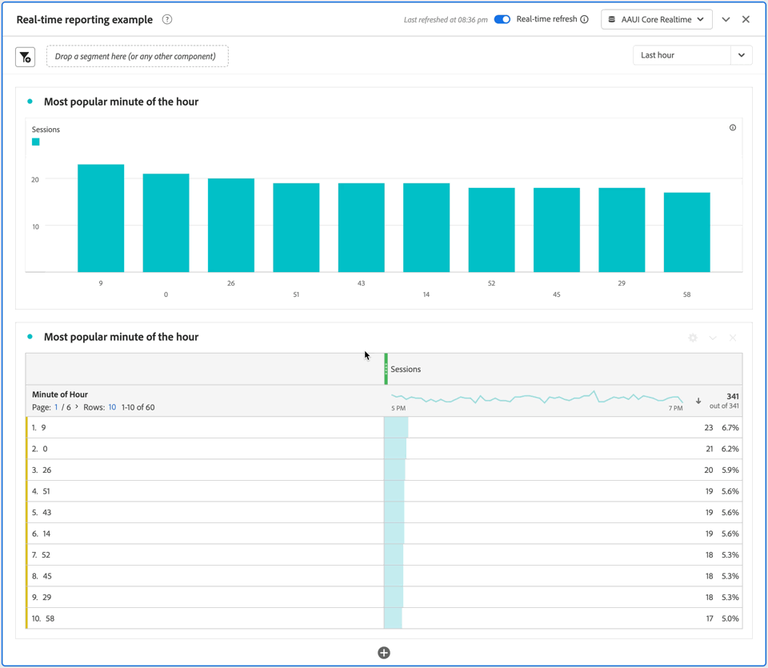

# Utilizzare il reporting in tempo reale {#use-real-time-reporting}

>[!CONTEXTUALHELP]
>id="workspace_panel_realtime_refresh"
>title="Aggiornamento in tempo reale"
>abstract="Abilita questa opzione per aggiornare dati e visualizzazioni nel pannello in tempo reale."

Per utilizzare la generazione rapporti in tempo reale, abilita l&#39;opzione **[!UICONTROL Aggiornamento in tempo reale]** in uno dei seguenti pannelli del progetto Workspace:

* [Pannello vuoto](/help/analysis-workspace/c-panels/blank-panel.md)
* [A forma libera](/help/analysis-workspace/c-panels/freeform-panel.md)
* [Attribuzione](/help/analysis-workspace/c-panels/attribution.md)
* [Elemento successivo o precedente](/help/analysis-workspace/c-panels/next-previous.md)

Viene visualizzato un messaggio con la marca temporale dell’aggiornamento più recente dei dati. Ad esempio: [!UICONTROL  *Ultimo aggiornamento alle 17:02:00*].:55

Dal menu a discesa, seleziona il periodo in tempo reale su cui desideri creare un rapporto. Le opzioni disponibili sono:

* [!UICONTROL Ultimi 15 minuti]
* [!UICONTROL Ultimi 30 minuti]
* [!UICONTROL Ultima ora]
* [!UICONTROL Ultime 8 ore]
* [!UICONTROL Ultime 24 ore]

Tutte le visualizzazioni nel pannello ora vengono aggiornate ogni minuto per un massimo di 30 minuti mentre è attiva la scheda del browser con il pannello con aggiornamento in tempo reale abilitato.

Ad esempio, di seguito trovi un&#39;istantanea di un **[!UICONTROL pannello di reporting in tempo reale]** che aggiorna la visualizzazione a barre **[!UICONTROL Ricavi totali/Ora]** e la tabella a forma libera **[!UICONTROL Ricavi totali/Ora]** con lo spostamento dell&#39;ora da **[!UICONTROL *06:26pm*]** a **[!UICONTROL *06:27 pm *]**.

Dopo 30 minuti o quando la scheda del browser diventa inattiva, l&#39;interruttore **[!UICONTROL Aggiornamento in tempo reale]** viene disattivato automaticamente e gli aggiornamenti in tempo reale vengono interrotti.

Non appena l&#39;opzione di aggiornamento in tempo reale è disattivata, il pannello (e tutte le visualizzazioni in ) tornano a [utilizzare i dati e le funzionalità standard di reporting di Customer Journey Analytics](real-time.md#how-it-works).
