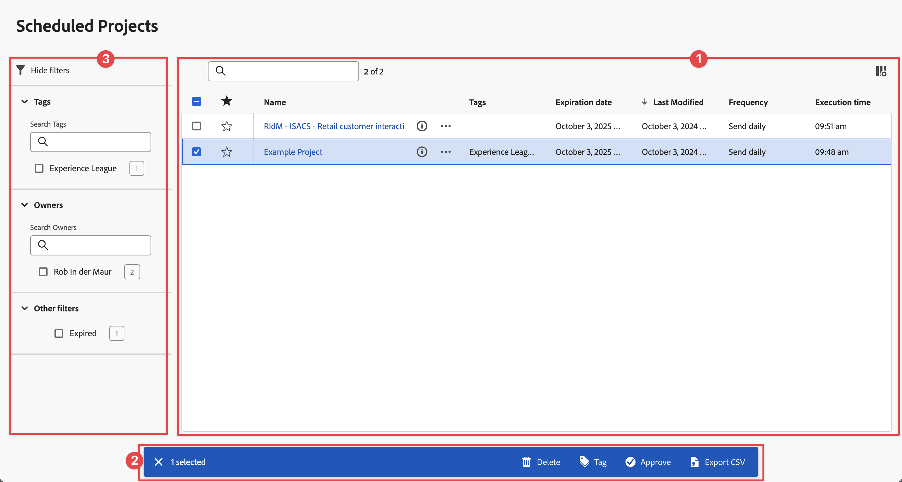
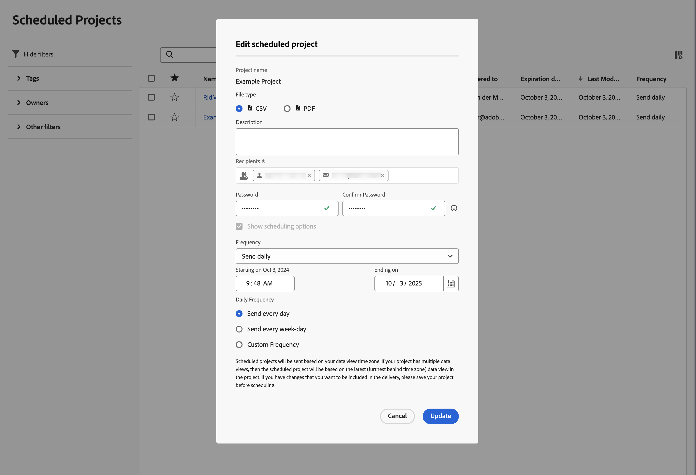

# Progetti pianificati

I progetti Analysis Workspace pianificati possono essere gestiti in Customer Journey Analytics utilizzando **[!UICONTROL Componenti]** > **[!UICONTROL Progetti pianificati]**.

In **[!UICONTROL Progetti pianificati]**, puoi modificare ed eliminare pianificazioni ricorrenti di progetti.  L&#39;[elenco progetti pianificato](#scheduled-project-list) mostra gli elementi creati da un utente specifico. Se l’account utente è disabilitato nell’applicazione, tutte le consegne pianificate si interrompono.

## Elenco progetti programmati

Nell&#39;elenco Progetti pianificati ➊ sono visualizzate le colonne per:

| Colonna | Descrizione |
| --- | --- |
|  | Quando sono selezionati uno o più progetti programmati, nella parte inferiore dell’interfaccia Progetti programmati viene visualizzata una barra blu delle azioni. Per ulteriori dettagli, consulta [Azioni](#actions). |
|  | Seleziona questa opzione per favorire  o per non favorire  un progetto pianificato. |
| **[!UICONTROL ID pianificazione]** | Un ID utilizzato principalmente a scopo di debug. |
| **[!UICONTROL Nome]** | Nome del progetto. Seleziona  per visualizzare ulteriori dettagli sul progetto pianificato. Selezionare  per aprire un menu di scelta rapida. Da questo menu puoi:<ul><li> **[!UICONTROL Elimina]** un progetto pianificato.</li><li> **[!UICONTROL Contrassegna]** un progetto pianificato.</li><li> **[!UICONTROL Approva]** un progetto pianificato.</li><li> **[!UICONTROL Esporta CSV]**: esporta un progetto pianificato in un file CSV.</li></ul> |
| **[!UICONTROL Proprietario]** | La persona che ha creato ed è proprietaria del progetto. |
| **[!UICONTROL Tag]** | (facoltativo) Assegnare tag è un modo efficace per organizzare progetti. Tutti gli utenti possono creare tag e applicarne uno o più a un progetto. Tuttavia, puoi visualizzare solo i tag dei progetti di tua proprietà o che sono stati condivisi con te. |
| **[!UICONTROL Consegnato a]** | Destinatari del progetto pianificato. |
| **[!UICONTROL Data di scadenza]** | Puoi impostare la data di scadenza massima fino a un anno, indipendentemente dalla frequenza di pianificazione. |
| **[!UICONTROL Frequenza]** | Con quale frequenza desideri che questo progetto di pianificazione venga inviato a uno o più destinatari. |
| **[!UICONTROL Tempo di esecuzione]** | A che ora del giorno viene inviato questo progetto programmato. |
| **[!UICONTROL Numero di query]** | Il numero di query su questo progetto. |
| **[!UICONTROL Intervallo di date più lungo]** | L’intervallo di date più lungo definito per il progetto pianificato. Questo valore potrebbe essere rilevante per analizzare i problemi di prestazioni. Per ulteriori informazioni, vedere [Reporting Activity Manager](/help/reporting-activity-manager/reporting-activity-overview.md). |
| **[!UICONTROL Numero di query]** | Numero di query eseguite per il progetto pianificato. Questo valore potrebbe essere rilevante per analizzare i problemi di prestazioni. Per ulteriori informazioni, vedere [Reporting Activity Manager](/help/reporting-activity-manager/reporting-activity-overview.md). |

È possibile utilizzare  per configurare le colonne da visualizzare.

Cerca un progetto pianificato utilizzando . Puoi anche vedere se sono stati applicati filtri dal pannello Filtri. Per rimuovere un filtro, selezionare  per un filtro. Per rimuovere tutti i filtri, selezionare **[!UICONTROL Cancella tutto]**.

Per modificare un progetto pianificato, seleziona il titolo del progetto. Utilizza la finestra di dialogo **[!UICONTROL Modifica progetto pianificato]** per aggiornare i dettagli della pianificazione. Vedi [Invia file ad altri](../analysis-workspace/export/t-schedule-report.md) per ulteriori dettagli.

Seleziona **[!UICONTROL Aggiorna]** per aggiornare la pianificazione.

## Azioni

Di seguito sono riportate le azioni comuni di Gestione progetti programmati: Puoi selezionare le azioni dal menu di scelta rapida o dalla barra blu delle azioni quando selezioni uno o più progetti pianificati.

| Icona | Azione | Descrizione |
|:---:|---|---|
|  | **[!UICONTROL *x *selezionato]** | Seleziona per deselezionare i progetti pianificati selezionati. |
|  | **[!UICONTROL Elimina]** | Elimina i progetti pianificati selezionati per il progetto; i progetti non vengono eliminati.  
Per informazioni sull&#39;eliminazione di un progetto, vedere [Panoramica progetti](/help/analysis-workspace/build-workspace-project/freeform-overview.md).
 |
|  | **[!UICONTROL Tag]** | Assegna tag ai progetti pianificati selezionati. In **[!UICONTROL Assegna tag ai progetti pianificati]** seleziona i tag e seleziona **[!UICONTROL Salva]** per salvare. |
|  | **[!UICONTROL Approva]** | Approva i progetti programmati selezionati. |
|  | **[!UICONTROL Esporta in CSV]** | Esporta i progetti pianificati selezionati in un file denominato `Export Scheduled Projects List.csv`. |

## Filtro

Puoi filtrare i progetti pianificati [Elenco progetti pianificati](#scheduled-project-list) utilizzando il pannello dei filtri ➌. Per mostrare o nascondere il pannello dei filtri, utilizza l’icona .

Il pannello dei filtri è costituito dalle sezioni seguenti.

### Tag

| Tag | Descrizione |
|---|---|
| {width="300"} | La sezione **[!UICONTROL Tag]** consente di filtrare in base ai tag. <ul><li>Puoi utilizzare  **[!UICONTROL Ricerca tag]** per cercare i tag in base ai quali applicare il filtro.</li><li>Puoi selezionare più di un tag. I tag disponibili dipendono dalle selezioni effettuate in altre sezioni nel pannello dei filtri.</li><li>I numeri indicano:<ul><li>7︎⃣: numero di progetti pianificati associati al tag specifico.</li></ul></li></ul> |

### Proprietari

| Proprietario | Descrizione |
|---|---|
| {width="300"} | La sezione **[!UICONTROL Proprietario]** consente di filtrare in base ai proprietari. <ul><li>Puoi utilizzare  *Ricerca proprietari* per cercare i proprietari da utilizzare per filtrare.</li><li>Puoi selezionare più di un proprietario. I proprietari disponibili dipendono dalle selezioni effettuate in altre sezioni nel pannello dei filtri.</li><li>I numeri indicano:<ul><li>4︎⃣: numero di progetti pianificati associati al proprietario specifico.</li></ul></li></ul> |

### Altri filtri

| Altri filtri | Descrizione |
|---|---|
| {width="300"} | La sezione **[!UICONTROL Altri filtri]** consente di filtrare in base ad altri filtri predefiniti.<ul><li>È possibile scegliere una o più delle opzioni seguenti:<ul><li> **[!UICONTROL Scaduto]**: applica il filtro ai progetti pianificati scaduti.</li><li>**[!UICONTROL Non riuscito]**: filtrare i progetti pianificati per i quali la pianificazione non è riuscita.</li></ul>Ciò che puoi selezionare dipende dal tuo ruolo e dalle autorizzazioni.</li><li>Puoi selezionare più di un altro filtro. Gli altri filtri disponibili dipendono dalle selezioni effettuate in altre sezioni nel pannello dei filtri.</li><li>I numeri indicano:<ul><li>4︎⃣: numero di progetti pianificati associati all’altro filtro specifico.</li></ul></li></ul> |
