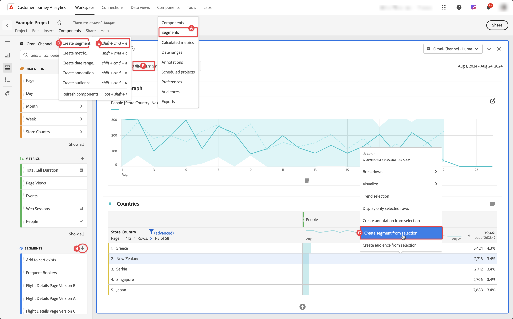

# Creare i segmenti

In Customer Journey Analytics puoi creare diversi tipi di segmenti.  Il tipo selezionato dipende dalla complessità dei segmenti e dall’applicabilità dei segmenti solo al progetto Workspace corrente o a tutti i progetti. Puoi creare segmenti direttamente nell’interfaccia principale di Customer Journey Analytics o quando lavori in un progetto Workspace.

Per impostazione predefinita, solo gli amministratori possono creare segmenti. Le autorizzazioni degli utenti per visualizzare i segmenti sono simili a quelle degli utenti per visualizzare altri componenti (annotazioni, metriche calcolate, ecc.).

Tuttavia, gli amministratori possono assegnare l&#39;autorizzazione **[!UICONTROL Creazione di segmenti]** per **[!UICONTROL Strumenti di reporting]** in **[!UICONTROL Modifica autorizzazioni per CJA Workspace Access]** agli utenti tramite [Admin Console](/help/technotes/access-control.md#user-level-access).

Puoi creare un segmento nei seguenti modi:

* **A**. Nell&#39;interfaccia principale, selezionare **[!UICONTROL Componenti]** e **[!UICONTROL Segmenti]**. Seleziona  [!UICONTROL **[!UICONTROL Aggiungi]**] dal gestore [[!UICONTROL Segmento]](/help/components/segments/seg-manage.md).
* **B**. In un progetto Workspace, dal pannello a sinistra Componenti, seleziona  in  **Segmenti**.
* **C**. In un progetto Workspace, dal menu di scelta rapida in una visualizzazione, seleziona **[!UICONTROL Crea segmento da selezione]**.
* **D**. In un progetto Workspace, seleziona **[!UICONTROL Componenti]** dal menu, quindi seleziona **[!UICONTROL Crea segmento]**.
* **E**. In un progetto Workspace, utilizza il collegamento **[!UICONTROL shift+cmd+e]** (macOS) o **[!UICONTROL shift+ctrl+e]** (Windows).
* **F**. Seleziona  in ***Rilascia qui un segmento (o qualsiasi altro componente)*** nella zona di rilascio. Questa azione crea un segmento solo Progetto.

Per definire il nuovo segmento, si utilizza il [Generatore di segmenti](/help/components/segments/seg-builder.md).

Quando ti trovi in un progetto Workspace, puoi anche creare rapidamente un segmento utilizzando [Segmento rapido](/help/components/segments/seg-quick.md).
