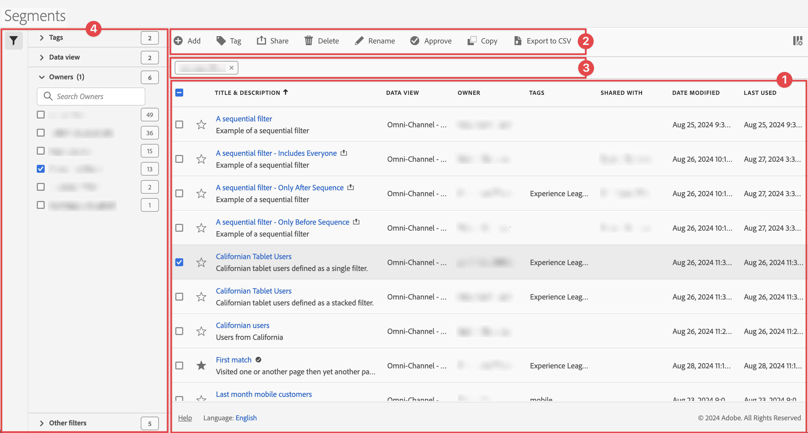

# Gestire i segmenti

Puoi [condividere](seg-share.md), [segmento](seg-filter.md), [tag](seg-tag.md), [approvare](seg-approve.md), rinominare, [copiare](seg-copy.md), eliminare, esportare segmenti e contrassegnarli come [preferiti](seg-favorite.md) da un&#39;interfaccia di gestione [!UICONTROL Segment] centrale. Per gestire i segmenti:

* Seleziona **[!UICONTROL Components]** nell’interfaccia principale, quindi seleziona **[!UICONTROL Segments]**.

>[!NOTE]
>
>I segmenti rapidi creati all&#39;interno di un progetto Workspace specifico non vengono visualizzati nel gestore [!UICONTROL Segment], a meno che il segmento non sia stato reso disponibile per tutti i progetti.
>

## Gestione segmenti

Il Gestore segmenti dispone dei seguenti elementi dell’interfaccia:

### Elenco segmenti

Nell&#39;elenco dei segmenti ➊ vengono visualizzati tutti i segmenti di tua proprietà, quelli con ambito in tutti i tuoi progetti e quelli condivisi con te. L’elenco dispone delle seguenti colonne:

| Colonna | Descrizione |
| --- | --- | 
|  | Seleziona questa opzione per favorire  o per non favorire  un segmento. Vedi [Segmento contrassegnato come preferito](/help/components/segments/seg-favorite.md) |
| **[!UICONTROL Title and description]** | Per modificare il segmento, seleziona il collegamento del titolo, che apre il [Generatore di segmenti](seg-builder.md). Un segmento condiviso è indicato con . |
| **[!UICONTROL Data view]** | Le visualizzazioni dati a cui si applica questo segmento. |
| **[!UICONTROL Owner]** | Il proprietario del segmento. In qualità di utente, puoi visualizzare solo i segmenti di tua proprietà o le annotazioni condivise con te. |
| **[!UICONTROL Tags]** | I tag per questo segmento. |
| **[!UICONTROL Shared with]** | Quanti singoli utenti o gruppi hai condiviso il segmento con. Seleziona per aprire la finestra di dialogo **[!UICONTROL Share Component]**. Consulta [Condividi segmenti](seg-share.md) per ulteriori informazioni. |
| **[!UICONTROL Date modified]** | La data e l’ora dell’ultima modifica apportata al segmento. |
| **[!UICONTROL Used in]** | Mostra dove sono attualmente utilizzati i segmenti e quante volte in ciascuna area. 
Ad esempio, se il segmento viene utilizzato in 40 progetti e 2 avvisi, il valore di questa colonna viene visualizzato come [!UICONTROL **42 componenti**].
 
Seleziona il valore in questa colonna per visualizzare il raggruppamento in cui vengono utilizzati i segmenti (ad esempio, [!UICONTROL **Progetti (40)**], [!UICONTROL **Scorecard per dispositivi mobili (2)**]). Inoltre, puoi visualizzare l’elenco degli elementi in cui vengono utilizzati i segmenti. Ad esempio, per visualizzare l’elenco dei progetti in cui vengono utilizzati, seleziona il collegamento [!UICONTROL **Progetti (40)**].

Ciascuna delle seguenti aree mostra il numero di istanze di segmenti utilizzati in quell’area:
  <ul><li>[!UICONTROL **Progetti**]
Contiene i segmenti creati [nel Generatore di segmenti](/help/components/segments/seg-builder.md#) e disponibili per tutti i progetti.
</li><li>[!UICONTROL **Componenti ad hoc**]
Contiene segmenti creati come [segmenti rapidi](/help/components/segments/seg-quick.md) e disponibili solo all&#39;interno di un singolo progetto.
</li><li>[!UICONTROL **Progetti programmati**]</li><li>[!UICONTROL **Scorecard per dispositivi mobili**]</li><li>[!UICONTROL **Annotazioni**]</li><li>[!UICONTROL **Metriche calcolate**]</li><li>[!UICONTROL **Report Builder**]
Selezionando questa opzione viene scaricato un file CSV con le seguenti colonne di dati:
<ul><li>Nome Report Builder</li><li>Ultimo accesso</li><li>ID utente IMS ultimo accesso</li><li>Nome utente ultimo accesso</li></ul></li></ul>
Queste informazioni possono essere d’aiuto per determinare se un componente è utile agli utenti dell’organizzazione, dove viene utilizzato e se deve essere eliminato o modificato.

Quando visualizzi questa colonna, prendi in considerazione quanto segue:
<ul><li>Questa informazione è disponibile solo per gli amministratori di sistema.</li><li>La colonna [!UICONTROL **Usato in**] non viene visualizzata per impostazione predefinita. Utilizza  per configurare la visualizzazione di questa colonna.</li><li>Queste informazioni non includono l’utilizzo dall’API o da Data Warehouse.</li><li>Se non sono presenti dati in questa colonna per un determinato componente ma il componente ha una data [!UICONTROL **Ultimo utilizzo**], è possibile che il componente sia stato utilizzato in un’analisi senza essere stato salvato.</li><li>Le informazioni sull’utilizzo sono disponibili a partire da settembre 2023.</li></ul>
Puoi utilizzare il [dizionario dei dati](/help/components/data-dictionary/data-dictionary-overview.md) insieme a queste informazioni per tenere traccia di come vengono utilizzati i componenti nell’organizzazione e per comprenderne meglio il funzionamento.
 |
| **[!UICONTROL Last Used]** | Data dell’ultimo utilizzo del segmento. |

Utilizza  per specificare quali colonne vuoi visualizzare.

### Barra delle azioni

È possibile eseguire azioni sui segmenti utilizzando la barra delle azioni ➋. La barra delle azioni contiene le azioni seguenti:

| Azione | Descrizione |
|---|---|
|  **[!UICONTROL Add]** | Aggiungi un altro segmento utilizzando il [Generatore di segmenti](seg-builder.md). |
|  [!UICONTROL *Ricerca per titolo*] | Se nell’elenco non è selezionato alcun segmento, cerca i segmenti utilizzando questo campo di ricerca. |
|  **[!UICONTROL Tag]** | Assegna tag ai segmenti selezionati. Nella finestra di dialogo **[!UICONTROL Tag Segment]**, seleziona o deseleziona i tag per i segmenti selezionati. Selezionare **[!UICONTROL Save]** per salvare i tag per i segmenti selezionati. Per ulteriori informazioni, consulta [Segmenti di tag](/help/components/segments/seg-tag.md). |
|  **[!UICONTROL Share]** | Condividi i segmenti selezionati. Nella finestra di dialogo **[!UICONTROL Share Segment]**, puoi effettuare una  *Ricerca di singoli utenti o gruppi* oppure puoi selezionare **[!UICONTROL Organization]** o **[!UICONTROL Groups]**. Selezionare **[!UICONTROL Save]** per salvare i dettagli di condivisione per i segmenti selezionati. Consulta [Condividi segmenti](seg-share.md) per ulteriori informazioni. |
|  **[!UICONTROL Delete]** | Elimina i segmenti selezionati. Viene richiesta una conferma.  Quando elimini un segmento, tieni presente che: <ul><li>I rapporti e i progetti programmati a cui è applicato questo segmento continuano a funzionare normalmente.</li><li> I rapporti pianificati non vengono aggiornati quando si modifica un segmento con lo stesso nome.</li> </ul> |
|  **[!UICONTROL Rename]** | Rinomina un singolo segmento selezionato. Se questa opzione è selezionata, è possibile rinominare il segmento in linea. |
|  **[!UICONTROL Approve]** | Approva i segmenti selezionati. Per ulteriori informazioni, consulta [Approvare segmenti](seg-approve.md). |
|  **[!UICONTROL Copy]** | Copia il segmento selezionato. I nuovi segmenti vengono creati con lo stesso nome e suffisso `(Copy)`. |
|  **[!UICONTROL Export to CSV]** | Esporta i segmenti in un file `Segments List.csv`. |

### Barra dei filtri attivi

La barra dei filtri ➌ mostra i segmenti attivi applicati dal pannello dei filtri all&#39;elenco dei segmenti (se presenti). Puoi rimuovere rapidamente un filtro utilizzando . Se sono specificati più filtri, è possibile rimuovere tutti utilizzando **[!UICONTROL Remove all]**.

### Pannello dei filtri

Puoi filtrare l&#39;elenco dei segmenti utilizzando il  **[!UICONTROL Filter]** pannello sinistro ➍. Nel pannello dei filtri viene visualizzato il tipo di filtro e il numero di segmenti che rispettano il filtro specifico. Seleziona  per attivare/disattivare la visualizzazione del pannello Filtro.

Vedi [Filtra l&#39;elenco dei segmenti](seg-filter.md) per ulteriori informazioni.
