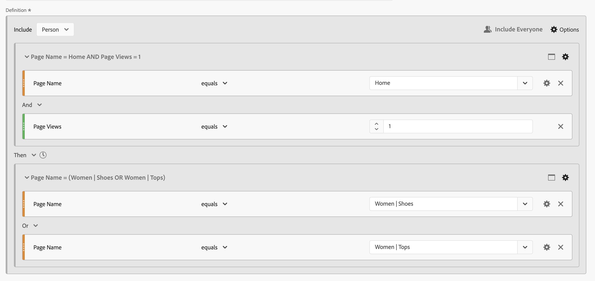
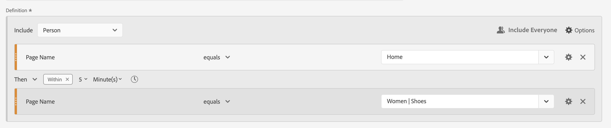

# Segmenti sequenziali

È possibile creare segmenti sequenziali utilizzando l&#39;operatore logico [!UICONTROL Then] tra componenti, contenitori e componenti o contenitori. L&#39;operatore logico [!UICONTROL Then] implica che si verifica una condizione di segmento, seguita da un&#39;altra.

>[!BEGINSHADEBOX]

Consulta  [Segmentazione sequenziale](https://video.tv.adobe.com/v/25405/?quality=12&learn=on){target="_blank"} per un video demo.

{{videoaa}}

>[!ENDSHADEBOX]

Un segmento sequenziale ha alcune [funzionalità di base](#basics) e opzioni aggiuntive che è possibile configurare per aggiungere maggiore complessità al segmento sequenziale:

* [Dopo e entro](#after-and-within) vincoli per la logica Then nella definizione del segmento di sequenza:

* Quali dati [includere](#include) come parte della sequenza complessiva per la definizione del segmento. Oppure per una sequenza definita come parte di un contenitore. Per impostazione predefinita, vengono considerati tutti i dati corrispondenti. Tali dati sono identificati da  [!UICONTROL Include Everyone].

   * Selezionare  **[!UICONTROL Only Before Sequence]** per considerare solo i dati prima della sequenza.
   * Seleziona  **[!UICONTROL Only After Sequence]** per considerare solo i dati dopo la sequenza.

* Quali dati [escludere](#exclude) come parte della definizione del segmento sequenziale.

* Come [raggruppare logicamente](#logic-group) le condizioni nella definizione del segmento sequenziale.

## Nozioni di base

Le nozioni di base per la creazione di un segmento sequenziale non sono diverse dalla creazione di un segmento regolare utilizzando il [Generatore di segmenti](seg-builder.md). È possibile utilizzare il [Generatore di definizioni](seg-builder.md#definition-builder) per creare la definizione del segmento. In questa costruzione vengono utilizzati componenti, contenitori, operatori e logica. Un segmento regolare diventa un segmento sequenziale non appena si seleziona l&#39;operatore **[!UICONTROL Then]** nella definizione principale o in uno qualsiasi dei contenitori utilizzati nel [Generatore di definizioni](seg-builder.md#definition-builder).

### Esempi

Gli esempi seguenti illustrano come utilizzare i segmenti sequenziali in vari casi d’uso.

#### Sequenza semplice

Identifica le persone che hanno visualizzato una pagina e poi un’altra pagina. I dati a livello di evento vengono segmentati utilizzando questa sequenza. Indipendentemente dalle sessioni precedenti, passate o intermedie della persona, o dall’ora o dal numero di visualizzazioni di pagina che si verificano tra le sessioni.

#### Sequenza tra sessioni

Identifica le persone che hanno visualizzato una pagina in una sessione e poi un’altra pagina in un’altra sessione. Per distinguere tra sessioni diverse, utilizza i contenitori per generare la sequenza e definire il livello  **[!UICONTROL Session]** per ogni contenitore.

#### Sequenza a livello misto

Identifica le persone che visualizzano due pagine in un numero indeterminato di sessioni e quindi visualizzano una terza pagina in una sessione separata. Utilizza nuovamente i contenitori per generare la sequenza e definire il livello  **[!UICONTROL Session]** nel contenitore che definisce la sessione separata.

#### Sequenza di aggregazione

Identifica le persone che nella prima sessione hanno visitato una pagina specifica e poi hanno visitato altre pagine. Per distinguere la sequenza di eventi, utilizzare i contenitori per separare la logica a livello di contenitore  **[!UICONTROL Session]**.

#### Nidificare una sequenza

Identifica tutte le sessioni in cui una persona visita una pagina prima di un’altra e poi effettua sessioni di follow-up che coinvolgono altre due pagine. Ad esempio, identifica tutte le sessioni in cui una persona visita prima la pagina principale, poi una pagina di categoria 1 e poi altre sessioni in cui in ogni sessione vengono visitate le pagine di categoria 2 e categoria 3.

## [!UICONTROL After] e [!UICONTROL Within]

È possibile utilizzare  **[!UICONTROL After]** e  **[!UICONTROL Within]** operatore **[!UICONTROL Then]** per definire ulteriori [vincoli di tempo](#time-constraints) o [vincoli per eventi, sessioni o dimensioni](#event-session-and-dimension-constraints).

### Vincoli temporali

Per applicare vincoli di tempo all&#39;operatore **[!UICONTROL Then]**:

1. Seleziona .
1. Selezionare **[!UICONTROL Within]** o **[!UICONTROL After]** dal menu di scelta rapida.
1. Specificare un periodo di tempo (**[!UICONTROL Minute]**, **[!UICONTROL Hour]**, fino a **[!UICONTROL Years]**).
1. Selezionare  **[!UICONTROL *number *]**per aprire un popup che consente di digitare o specificare un numero utilizzando **[!UICONTROL -]**o **[!UICONTROL +]**.

Per rimuovere un vincolo di tempo, utilizzare .

La tabella seguente spiega più dettagliatamente gli operatori dei vincoli di tempo.

| Operatori | Descrizione |
|--- |--- |
| **[!UICONTROL After]** | L&#39;operatore [!UICONTROL After] viene utilizzato per specificare un limite minimo per il periodo di tempo tra due punti di controllo. Quando si impostano i valori After, il limite di tempo inizia quando il segmento viene applicato. Ad esempio, se l&#39;operatore [!UICONTROL After] è impostato su un contenitore per identificare le persone che visitano la pagina A, ma non tornano a visitare la pagina B fino a dopo un giorno, quel giorno inizierà quando il visitatore esce dalla pagina A.  Affinché il visitatore sia incluso nel segmento, devono trascorrere almeno 1440 minuti (un giorno) dopo l’uscita dalla pagina A per visualizzare la pagina B. |
| **[!UICONTROL Within]** | L&#39;operatore [!UICONTROL Within] viene utilizzato per specificare un limite massimo per il periodo di tempo tra due punti di controllo. Ad esempio, se l&#39;operatore [!UICONTROL Within] è impostato su un contenitore per identificare le persone che visitano la pagina A e poi ritornano a visitare la pagina B entro un giorno, quel giorno inizia quando la persona lascia la pagina A. Per essere inclusa nel segmento, la persona ha un tempo massimo di un giorno prima di aprire la pagina B. Affinché la persona sia inclusa nel segmento, l’apertura della pagina B deve avvenire entro un massimo di 1440 minuti (un giorno) dopo l’uscita dalla pagina A per visualizzare la pagina B. |
| **[!UICONTROL After but Within]** | Quando si utilizzano entrambi gli operatori [!UICONTROL After] e [!UICONTROL Within], entrambi gli operatori iniziano e terminano in parallelo, non in sequenza.  Ad esempio, si crea un segmento con il contenitore impostato su: `After = 1 Week(s) and Within = 2 Week(s)`. Le condizioni per identificare i visitatori in questo segmento sono soddisfatte solo tra una e due settimane. Entrambe le condizioni vengono applicate dal momento della prima visualizzazione della pagina. |

#### Esempi

Alcuni esempi di utilizzo dei vincoli di tempo.

##### Operatore [!UICONTROL After]

Identifica le persone che hanno visitato una pagina e poi un’altra solo dopo due settimane. Ad esempio, le persone che hanno visitato la home page, ma le | La pagina delle scarpe solo dopo due settimane.

Se una visualizzazione di pagina per la Home si verifica il 1° giugno 2024, alle 00:01, allora una visualizzazione di pagina per le donne | Le scarpe corrisponderanno finché la visualizzazione della pagina si verifica dopo il 15 giugno 2024 alle 00:01.

##### Operatore [!UICONTROL Within]

Identifica le persone che hanno visitato una pagina e poi un’altra pagina entro cinque minuti. Ad esempio, le persone che hanno visitato la home page e quindi le donne | Scarpe pagina entro 5 minuti.

Se una visualizzazione di pagina per la Home si verifica il 1° giugno 2024, alle 12:01, allora una visualizzazione di pagina per le donne | Le scarpe corrisponderanno, purché la visualizzazione della pagina avvenga prima del 15 giugno 2024 alle 12:16.

##### Operatore [!UICONTROL After] ma [!UICONTROL Within]

Identifica le persone che hanno visitato una pagina e poi un’altra pagina dopo due settimane, ma entro un mese. Ad esempio, le persone che hanno visitato la home page e poi dopo due settimane ed entro un mese le donne | Pagina Scarpe.

Tutte le persone che hanno raggiunto la Home Page il 1° giugno 2024 e che stanno tornando a visitare le Donne | La pagina delle scarpe dopo il 15 giugno 2019 alle 00:01, ma prima del 1 luglio 2019 si qualifica per il segmento.

### [!UICONTROL Event], [!UICONTROL Session] e [!UICONTROL Dimension] vincoli

I vincoli di  **[!UICONTROL After]** e  **[!UICONTROL Within]** consentono di specificare non solo un vincolo di tempo, ma anche un vincolo di evento, sessione o dimensione. Selezionare **[!UICONTROL Event(s)]**, **[!UICONTROL Session(s)]** o **[!UICONTROL Other dimensions]**  **[!UICONTROL *Nome Dimension *]**. Puoi usare il campo [!UICONTROL *Ricerca*] per cercare una dimensione.

#### Esempio

Di seguito è riportato un esempio di segmento sequenziale che cerca le persone che hanno visitato una pagina di categoria di prodotto (Donne) | Scarpe), seguita da una pagina di pagamento (Checkout | Grazie) in una sola pagina.

Le sequenze di esempio seguenti corrispondono o non corrispondono:

| Sequenza |  |
|--- | :---: |
| Pagina `Women \| Shoes` seguita dalla pagina `Checkout \| Thank You` |  |
| Pagina `Women \| Shoes` seguita dalla pagina `Women \| Tops` seguita dalla pagina `Checkout \| Thank You` |  |

## [!UICONTROL Include]

Puoi specificare quali dati includere nel segmento sequenziale o in un contenitore sequenziale che fa parte del segmento sequenziale.

### [!UICONTROL Everyone] {#include_everyone}

Per creare un segmento sequenziale che includa tutti, selezionare l&#39;opzione  **[!UICONTROL Include Everyone]**.

Il segmento sequenziale identifica i dati che corrispondono al pattern specificato nel suo insieme.  Di seguito è riportato un esempio di un segmento di sequenza di base alla ricerca di persone che hanno visitato una pagina di categoria di prodotto (donne | Scarpe), seguita da una pagina di pagamento (Checkout | Grazie). Il segmento è impostato su  **[!UICONTROL Include Everyone]**.

Le sequenze di esempio seguenti corrispondono o non corrispondono:

| | Sequenza |  |
|---:|--- | --- |
| 1 | `Women \| Shoes` quindi `Checkout \| Thank You` nella stessa sessione |  |
| 2 | `Women \| Shoes` quindi `Men \| Shoes` e `Checkout \| Thank You` (in sessioni diverse) |  |
| 3 | `Checkout \| Thank You` quindi `Women \| Shoes` |  |

### [!UICONTROL Only Before Sequence] e [!UICONTROL Only After Sequence]

Le opzioni  **[!UICONTROL Only Before Sequence]** e  **[!UICONTROL Only After Sequence]** segmentano i dati in un sottoinsieme prima o dopo la sequenza specificata.

*  **Only Before Sequence**: include tutti i dati prima di una sequenza e i primi dati della sequenza stessa. Se una sequenza appare più volte come parte dei dati, [!UICONTROL Only Before Sequence] include il primo hit dell&#39;ultima occorrenza della sequenza e tutti gli hit precedenti.
*  **Solo dopo la sequenza**: include tutti gli hit dopo una sequenza e gli ultimi dati della sequenza stessa. Se una sequenza appare più volte come parte dei dati, [!UICONTROL Only After Sequence] include l&#39;ultimo hit della prima occorrenza della sequenza e tutti gli hit successivi.

Si consideri una definizione che specifica una sequenza di un componente con criteri identificati da B, seguita (Then) da un componente con criteri identificati da D. Le tre opzioni consentono di identificare i dati nel modo seguente:

| B Then D | A | B | C | D | E | F |
|---|:---:|:---:|:---:|:---:|:---:|:---:|
| Includi tutti |  |  |  |  |  |  |
| Solo prima della sequenza |  |  |  |  |  |  |
| Solo dopo la sequenza |  |  |  |  |  |  |

{style="table-layout:fixed"}

| B Then D (si verifica più volte) | A | B | C | D | B | C | D | E |
|---|:---:|:---:|:---:|:---:|:---:|:---:|:---:|:---:|
| Includi tutti |  |  |  |  |  |  |  |  |
| Solo prima della sequenza |  |  |  |  |  |  |  |  |
| Solo dopo la sequenza |  |  |  |  |  |  |  |  |

{style="table-layout:fixed"}

#### Esempio

Hai definito tre versioni di un segmento sequenziale per le sezioni del sito. Uno con l&#39;opzione  **[!UICONTROL Include Everyone]**, uno con l&#39;opzione  **[!UICONTROL Only Before Sequence]** e uno con l&#39;opzione  **[!UICONTROL Only After Sequence]**. Hai assegnato ai tre segmenti il nome desiderato.

Quando si esegue il reporting sulle sezioni del sito utilizzando questi tre segmenti, l’output di esempio in una tabella a forma libera è simile al seguente:

## [!UICONTROL Exclude]

Le definizioni dei segmenti includono tutti i dati a meno che tu non escluda espressamente  [!UICONTROL Person],  [!UICONTROL Session] o  [!UICONTROL Event] utilizzando **[!UICONTROL Exclude]**.

[!UICONTROL Exclude] ti consente di ignorare i dati comuni e creare segmenti con maggiore attenzione. Escludi consente inoltre di creare segmenti escludendo gruppi specifici di persone. Ad esempio, per definire un segmento che specifica le persone che hanno effettuato gli ordini e poi escludendo quel gruppo di persone per identificare *i non acquirenti*. Si consiglia di creare regole che utilizzano una definizione ampia anziché tentare di utilizzare [!UICONTROL Exclude] per individuare utenti tipo specifici che corrispondono a valori di inclusione specifici.

Esempio di definizioni di esclusione:

* **Escludi pagine**. Utilizzare una definizione di segmento per eliminare una pagina specifica (ad esempio *Home page*) da un report, creare una regola Evento in cui la pagina sia uguale a `Home Page` e quindi escludere la regola. Questa definizione include automaticamente tutte le pagine ad eccezione della *home page*.
* **Escludi i domini di riferimento**. Utilizza una definizione che includa solo i domini di riferimento da Google.com ed escluda tutti gli altri.
* **Identifica i non acquirenti**. Identifica quando gli ordini sono maggiori di zero e quindi esclude il [!UICONTROL Person].

[!UICONTROL Exclude] può essere utilizzato per identificare una sequenza in cui le persone non fanno parte di sessioni specifiche o eseguono eventi specifici. [!UICONTROL Exclude] può essere incluso anche in un [!UICONTROL Logic Group] (vedi sotto).

Puoi escludere i contenitori, non i componenti.

### Esempi

Di seguito sono riportati alcuni esempi di utilizzo di [!UICONTROL Exclude].

#### [!UICONTROL Exclude] entro

Identifica le persone che hanno visitato una pagina, non hanno visitato un’altra pagina e poi hanno visitato un’altra pagina. Escludi il contenitore utilizzando  [!UICONTROL Exclude]. Un contenitore escluso è identificato da una sottile barra rossa a sinistra.

#### [!UICONTROL Exclude] all&#39;inizio

Identifica le persone che hanno visitato una pagina senza mai passare a un’altra pagina. Ad esempio, le persone che hanno ritirato un acquisto senza mai visitare la home page.

#### [!UICONTROL Exclude] alla fine

Identifica le persone che hanno visitato una pagina ma non altre pagine. Ad esempio, le persone che hanno visitato la pagina principale ma mai le pagine di pagamento.

## [!UICONTROL Logic Group]

>[!NOTE]
>
>Un [!UICONTROL Logic Group] può essere definito solo in un segmento sequenziale, il che significa che l&#39;operatore [!UICONTROL Then] è utilizzato all&#39;interno del contenitore.

Il Gruppo logico consente di raggruppare le condizioni in un singolo punto di controllo del segmento sequenziale. Come parte della sequenza, la logica definita nel contenitore identificato come Gruppo logico viene valutata dopo qualsiasi punto di controllo sequenziale precedente e prima di qualsiasi punto di controllo sequenziale successivo.

Le condizioni all’interno del Gruppo logico stesso possono essere soddisfatte in qualsiasi ordine. Al contrario, i contenitori non sequenziali (evento, sessione, persona) non richiedono che le loro condizioni siano soddisfatte all’interno della sequenza complessiva, generando possibili risultati non intuitivi se utilizzati con un operatore Then.

[!UICONTROL Logic Group] è stato progettato per trattare *diverse condizioni come un gruppo, senza alcun ordine* tra le condizioni raggruppate. In caso contrario, l’ordine delle condizioni all’interno di un Gruppo logico è irrilevante.

Alcune best practice per utilizzare il Gruppo logico sono:

* Per raggruppare punti di controllo sequenziali.
* Semplificare la costruzione di segmenti sequenziali.

### Esempi

Di seguito sono riportati alcuni esempi sull’utilizzo del contenitore Gruppo logico.

#### Qualsiasi ordine

Identifica le persone che hanno visitato una pagina e poi hanno visualizzato ogni pagina da un altro set di pagine in qualsiasi ordine. Ad esempio, le persone che hanno visitato la pagina Home, poi hanno visitato ciascuna delle pagine Men, Women e Kids, indipendentemente dall’ordine.

È possibile creare questo segmento senza [!UICONTROL Logic Group], ma la costruzione sarà complessa e laboriosa. Specifica ogni sequenza di pagine che il visitatore può visualizzare. Per chiarezza, solo il primo contenitore viene aperto  e gli altri contenitori sono chiusi . Puoi derivare il contenuto degli altri contenitori dai titoli.

Puoi utilizzare [!UICONTROL Logic Group] per semplificare la creazione di questo segmento, come illustrato di seguito. Accertati di selezionare  **[!UICONTROL Logic Group]** per il contenitore.

#### Prima corrispondenza

Identifica le persone che hanno visitato una pagina o un’altra pagina e poi hanno visitato un’altra pagina. Ad esempio, le persone che hanno visitato la pagina Donne o Uomini e poi il Checkout | Pagina di ringraziamento.

#### [!UICONTROL Exclude] [!UICONTROL And]

Identifica le persone che hanno visitato una pagina e poi esplicitamente non hanno visitato una serie di altre pagine, ma hanno visitato un’altra pagina. Ad esempio, le persone che hanno visitato la home page non hanno visitato la pagina Uomini o donne, ma la pagina Bambini.

#### [!UICONTROL Exclude] [!UICONTROL Or]

Identifica le persone che hanno visitato una pagina e poi esplicitamente non hanno visitato nessuna pagina di un set di pagine, ma hanno visitato un’altra pagina. Ad esempio, le persone che hanno visitato la home page e non hanno visitato la pagina Uomini e donne, ma hanno visitato la pagina Bambini.

<!--
An example of a complex sequential segment if you want to find the persons that 

| Session One | Session Two | Session Three |
| --- | --- | --- |
| The person went to the main landing page A, excluded the campaign page B, and then viewed the Product page C.| The person again went to the main landing page A, excluded the campaign page B, and went again to the Product page C, and then to a new page D. | The person entered and followed that same path as in the first and second visits, then excluded page F to go directly to a targeted product on page G. |
-->

## Un ultimo esempio

Come ultimo esempio, vuoi identificare le persone che hanno imparato a conoscere una pagina di prodotto specifica, senza che queste persone siano mai state toccate dalla tua campagna Empower Your Move. E nella loro prima visita al tuo negozio online ha visto la Home page ma non ha guardato più lontano alcun fitness (ingranaggio) prodotti della categoria Uomini. Tuttavia, nella sessione successiva direttamente dopo, hanno visitato una pagina di prodotto e effettuato un ordine online senza passare prima dalla home page.

