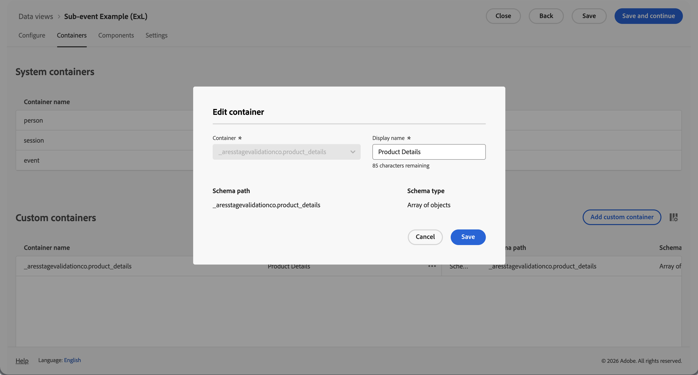
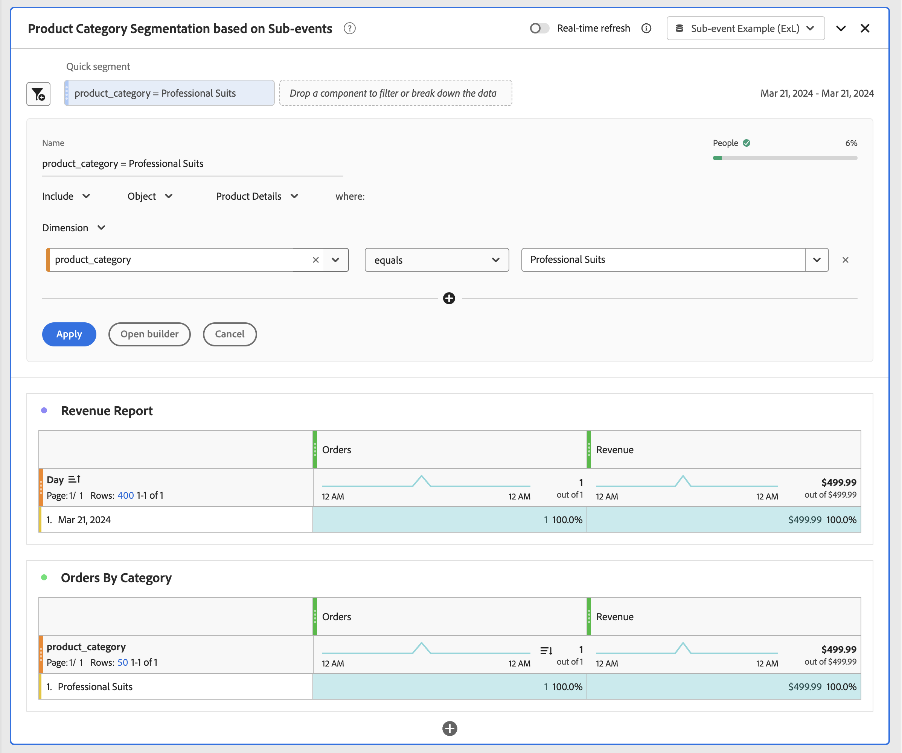
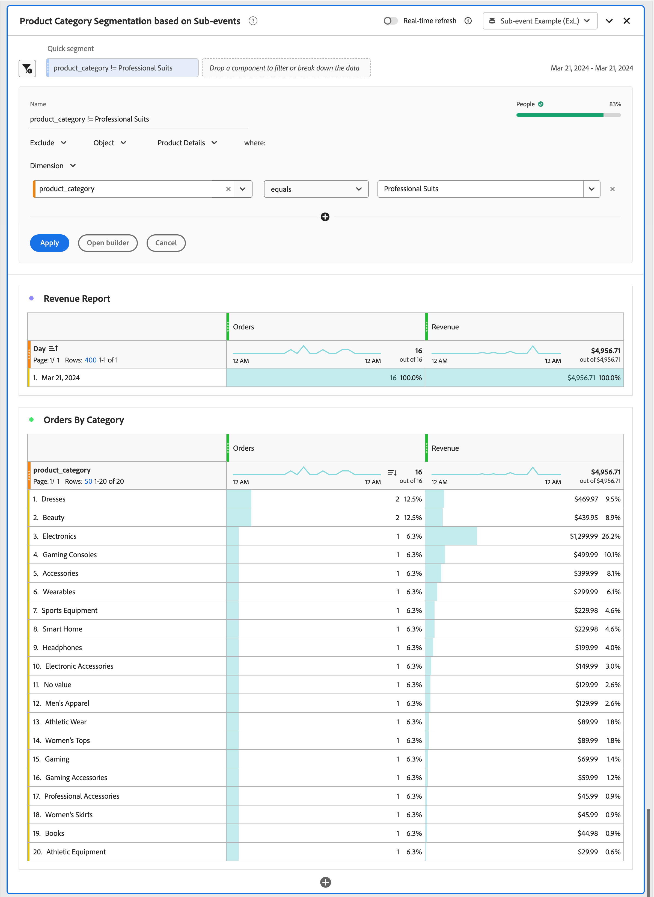

# Analisi dei sottoeventi

{{release-limited-testing}}

L’analisi dei sottoeventi consente di analizzare i dati dell’evento a un livello più granulare rispetto al livello dell’evento. Invece di filtrare eventi interi, puoi segmentare singoli contenitori all’interno di eventi. Ad esempio:

* Segmentazione per una categoria di prodotti specifica senza includere tutti gli altri prodotti acquistati nello stesso ordine.
* Segmentazione su una categoria di risorse specifica all’interno dei dati di analisi dei contenuti.
* Segmentazione su un canale multimediale specifico all’interno dei dati di analisi multimediale.

In Customer Journey Analytics, all’interno di una visualizzazione dati puoi definire i contenitori per i quali desideri utilizzare l’analisi degli eventi secondari. Senza analisi di eventi secondari, la segmentazione su un attributo di elemento contenitore restituisce tutti gli eventi, le sessioni, le persone, gli account (globali) [!BADGE B2B edition]{type=Informative url="https://experienceleague.adobe.com/it/docs/analytics-platform/using/cja-overview/cja-b2b/cja-b2b-edition" newtab=true tooltip="Customer Journey Analytics B2B Edition"}, i gruppi di acquisto [!BADGE B2B edition]{type=Informative url="https://experienceleague.adobe.com/it/docs/analytics-platform/using/cja-overview/cja-b2b/cja-b2b-edition" newtab=true tooltip="Customer Journey Analytics B2B Edition"}, le opportunità [!BADGE B2B edition]{type=Informative url="https://experienceleague.adobe.com/it/docs/analytics-platform/using/cja-overview/cja-b2b/cja-b2b-edition" newtab=true tooltip="Customer Journey Analytics B2B Edition"} o altri [contenitori](/help/data-views/create-dataview.md#containers-1) definiti. Il risultato è un’attribuzione errata e metriche di ricavi gonfiate. L’analisi sub-evento esamina il filtro in singole righe di contenitore all’interno di un evento e risolve questi problemi.

Nell’analisi dei sottoeventi, la logica di esclusione si comporta in modo diverso rispetto all’esclusione standard a livello di evento rispetto al contenitore. Quando si escludono gli attributi di elementi all&#39;interno del contenitore, il segmento restituisce eventi che **contengono elementi** all&#39;interno del contenitore ma non corrispondono ai criteri di esclusione. Il segmento non restituisce eventi senza alcun elemento.

## Esempio

Si desidera misurare i ricavi solo dalla categoria abiti professionali. Senza analisi dei sub-eventi, l&#39;applicazione di un segmento per le cause professionali include i ricavi di ogni prodotto su qualsiasi ordine (evento) che contiene almeno un prodotto con la categoria delle cause professionali. Con l’analisi dei sub-eventi, puoi definire l’ambito del filtro a livello di prodotto e restituire solo i ricavi per i prodotti della categoria tute professionali.

Desideri inoltre misurare i ricavi online da tutte le altre categorie ad eccezione della categoria tute professionali.

>[!BEGINTABS]

>[!TAB Analisi degli eventi]

Nel generatore di segmentazione o come parte di un **[!UICONTROL segmento rapido]**, si specifica di **[!UICONTROL includere]** il **[!UICONTROL Dimension]** **[!UICONTROL product_category]** **[!UICONTROL equals]** **[!UICONTROL Professional Suits]** nel contenitore **[!UICONTROL Events]**.

Di conseguenza, vengono considerati tutti gli ordini contenenti almeno una **[!UICONTROL suite professionali]** **[!UICONTROL categoria_prodotto]** e i ricavi da altri prodotti inclusi in tali ordini sono inclusi nella metrica **[!UICONTROL Ricavi]**.
Quando si crea un report sulle categorie, vengono segnalati tutti gli altri valori per **[!UICONTROL product_category]** che facevano parte di un ordine che includeva un prodotto con le **[!UICONTROL tute professionali]** **[!UICONTROL product_category]**.

>[!TAB Analisi sub-evento]

Hai definito un **[!UICONTROL Dettagli prodotto]** [contenitore personalizzato](/help/data-views/create-dataview.md#containers) nella visualizzazione dati ai fini dell&#39;analisi degli eventi secondari sui prodotti.

Nel generatore di segmentazione o come parte di un **[!UICONTROL segmento rapido]**, si specifica di **[!UICONTROL includere]** il **[!UICONTROL Dimension]** **[!UICONTROL product_category]** **[!UICONTROL equals]** **[!UICONTROL Professional Suits]** nel contenitore **[!UICONTROL Product Details]**.

Di conseguenza, vengono considerati tutti gli ordini contenenti almeno una **[!UICONTROL Vestibilità professionali]** **[!UICONTROL categoria_prodotto]** e solo i ricavi dei prodotti appartenenti alla **[!UICONTROL Vestibilità professionali]** **[!UICONTROL categoria_prodotto]** sono inclusi per la metrica **[!UICONTROL Ricavi]**.
Quando si crea un report sulle categorie, viene segnalato solo il **[!UICONTROL Abiti professionali]** **[!UICONTROL product_category]**.

>[!TAB Analisi sub-evento (esclusione)]

Hai definito un **[!UICONTROL Dettagli prodotto]** [contenitore personalizzato](/help/data-views/create-dataview.md#containers) nella visualizzazione dati ai fini dell&#39;analisi degli eventi secondari sui prodotti.

Nel generatore di segmentazione o come parte di un **[!UICONTROL segmento rapido]**, si specifica di **[!UICONTROL escludere]** il **[!UICONTROL Dimension]** **[!UICONTROL product_category]** **[!UICONTROL equals]** **[!UICONTROL Professional Suits]** nel contenitore **[!UICONTROL Product Details]**.

Per escludere a livello di prodotto, sono inclusi gli eventi che contengono almeno un prodotto, quindi l’esclusione a livello di evento secondario viene applicata all’interno di tale ambito. Questa esclusione è diversa dall’esclusione a livello di evento, che esclude l’intero evento.

>[!ENDTABS]
