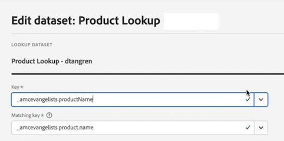

# Creare una connessione

Recentemente è stato lanciato un nuovo flusso di lavoro Connessioni in Customer Journey Analytics (CJA). La nuova esperienza di creazione e modifica delle connessioni porta tutte le impostazioni di configurazione del set di dati e della connessione al centro dello schermo con un flusso di lavoro facilitato. Abbiamo fornito una selezione dei set di dati, una configurazione e un’esperienza di revisione dettagliate con informazioni critiche come tipo di set di dati, dimensioni, schema, ID set di dati, stato del batch, stato di backfill, ID persona e molto altro per ridurre il rischio di configurazione errata della connessione. Ecco una panoramica delle nuove funzionalità:

* Quando si crea la connessione è possibile abilitare una finestra continua di conservazione dei dati.
* È possibile aggiungere e rimuovere i set di dati da una connessione. Quando si rimuove un set di dati, questo viene rimosso dalla connessione e influisce su tutte le visualizzazioni dati associate e sui progetti Analysis Workspace sottostanti.
* Puoi abilitare e richiedere dati di retrocompilazione per set di dati.
* Puoi modificare i set di dati, ad esempio per richiedere un’altra retrocompilazione.
* Puoi importare dati esistenti per set di dati.

>[!VIDEO](https://video.tv.adobe.com/v/343044/?quality=12&learn=on)

## Creare e configurare la connessione {#create-connection}

1. In CJA, fai clic sulla scheda **[!UICONTROL Connections]**.
1. Fai clic su **[!UICONTROL Create new connection]**.

   

1. Configura le impostazioni della connessione.

   | Impostazione | Descrizione |
   | --- | --- |
   | **[!UICONTROL Connection name]** | Assegna un nome univoco alla connessione. |
   | **[!UICONTROL Connection description]** | Descrivi lo scopo della connessione. |
   | **[!UICONTROL Sandbox]** | Scegli una sandbox in Experience Platform che contiene i set di dati per cui desideri creare una connessione.<p>Adobe Experience Platform fornisce [sandboxe](https://experienceleague.adobe.com/docs/experience-platform/sandbox/home.html?lang=it) che permettono di suddividere una singola istanza Platform in ambienti virtuali separati, utili per le attività di sviluppo e aggiornamento delle applicazioni di esperienza digitale. Puoi considerare le sandbox come “silos di dati” che contengono set di dati. Le sandbox vengono utilizzate per controllare l’accesso ai set di dati.<p>Dopo aver selezionato la sandbox, la barra a sinistra mostra tutti i set di dati nella sandbox da cui puoi richiamarli. |
   | **[!UICONTROL Enable rolling data window]** | La casella di controllo, se selezionata, consente di definire un’impostazione di conservazione dei dati CJA come finestra continua in mesi (1 mese, 3 mesi, 6 mesi, ecc.), a livello di connessione.<p>La conservazione dei dati si basa sulle marche temporali dei set di dati dell’evento e si applica solo ai set di dati dell’evento. Non esiste alcuna impostazione di finestra continua per i set di dati di profilo o di ricerca, in quanto non sono disponibili marche temporali applicabili. Tuttavia, se la connessione include un profilo o set di dati di ricerca (oltre a uno o più set di dati evento), tali dati verranno conservati per lo stesso periodo di tempo.<p> Il vantaggio principale consiste nell’archiviare o generare rapporti solo sui dati applicabili e utili, nonché nell’eliminare i dati meno recenti che non sono più utili. Ti aiuta a rispettare i limiti del tuo contratto e riduce il rischio di sovraccosti.<p>Se lasci l’impostazione predefinita (non selezionata), il periodo di conservazione dei dati verrà sostituito dall’impostazione di conservazione dei dati di Adobe Experience Platform. Se disponi di 25 mesi di dati in Experience Platform, CJA riceverà 25 mesi di dati tramite backfill. Se elimini 10 di questi mesi in Platform, CJA mantiene i restanti 15 mesi. |
   | **[!UICONTROL Add datasets]** (vedi di seguito) | Aggiungi i set di dati se nell’elenco dei set di dati non sono presenti set di dati. |
   | **[!UICONTROL Dataset name]** | Seleziona uno o più set di dati da richiamare in Customer Journey Analytics e fai clic su **[!UICONTROL Add]**.<p>Se sono presenti molti set di dati tra cui scegliere, puoi cercare quelli giusti utilizzando la barra di ricerca sopra l’elenco dei set di dati. |
   | **[!UICONTROL Last updated]** | Solo per i set di dati evento, questa impostazione viene impostata automaticamente sul campo marca temporale predefinito dagli schemi basati su eventi in Experience Platform. “N/A” significa che il set di dati non contiene dati. |
   | **[!UICONTROL Schema]** | [Schema](https://experienceleague.adobe.com/docs/experience-platform/xdm/schema/composition.html?lang=it) in base al quale il set di dati è stato creato in Adobe Experience Platform. |
   | **[!UICONTROL Dataset type]** | Per ogni set di dati aggiunto alla connessione, Customer Journey Analytics imposta automaticamente il tipo di set di dati in base ai dati in arrivo. Esistono 3 tipi diversi di set di dati: dati evento, dati profilo e dati di ricerca. Nella tabella seguente puoi trovare una spiegazione dei tipi di set di dati. |
   | **[!UICONTROL Person ID]** | Seleziona un ID persona dall’elenco a discesa delle identità disponibili. Queste identità sono state definite nello schema del set di dati in Experience Platform. Vedi di seguito per informazioni su come utilizzare Identity Map come ID persona.<p>IMPORTANTE: se non è presente alcun ID persona tra cui scegliere, significa che uno o più ID persona non sono stati definiti nello schema. Guarda [questo video](https://www.youtube.com/watch?v=G_ttmGl_LRU) su come definire un’identità in Experience Platform. |
   | **[!UICONTROL Key]** | Solo per i set di dati di ricerca (ad esempio _id). |
   | **[!UICONTROL Matching Key]** | Solo per i set di dati di ricerca (ad esempio _id). |
   | **[!UICONTROL Import new data]** | Imposta su On o Off. |
   | **[!UICONTROL Backfill data]** | Puoi richiedere di eseguire il backfill dei dati in un set di dati in base a marche temporali di evento. Ad esempio, puoi richiedere di eseguire il backfill degli ultimi 7 giorni di dati, configurare l’ID persona corretto e verificare la corretta configurazione della tua connessione. Se tutto sembra a posto, puoi eseguire facilmente il backfill di tutti i dati rimanenti.<p>Inoltre, puoi abilitare l’importazione di nuovi dati per set di dati. Ad esempio, puoi abilitare l’importazione di nuovi dati solo per i dati di ricerca. |
   | **[!UICONTROL Backfill status]** | Indica se vengono elaborati dati di retrocompilazione. |

   {style="table-layout:auto"}

## Aggiungere e configurare i set di dati {#add-dataset}

Con il nuovo flusso di lavoro è possibile aggiungere un set di dati di Experience Platform quando si crea una connessione.

1. Nella finestra di dialogo delle impostazioni della connessione, fai clic su **[!UICONTROL Add datasets]**.
1. Seleziona uno o più set di dati e fai clic su **[!UICONTROL Next]**.

   Almeno un set di dati evento deve far parte della connessione.
1. Ora configura singolarmente ciascun set di dati.

   

   | Impostazione | Descrizione |
   | --- | --- |
   | **[!UICONTROL Person ID]** | Seleziona un ID persona dall’elenco a discesa delle identità disponibili. Queste identità sono state definite nello schema del set di dati in Experience Platform. Vedi di seguito per informazioni su come utilizzare Identity Map come ID persona.<p>Se non è presente alcun ID persona tra cui scegliere, significa che uno o più ID persona non sono stati definiti nello schema. Guarda questo video su come definire un’identità in Experience Platform. |
   | **[!UICONTROL Timestamp]** | Solo per i set di dati evento, questa impostazione viene impostata automaticamente sul campo marca temporale predefinito dagli schemi basati su eventi in Experience Platform. |
   | **[!UICONTROL Data source type]** | I tipi di origini dati includono: dati web, dati da app mobile, dati POS, dati CRM, dati dei sondaggi, dati da call center, dati dei prodotti, dati degli account, dati delle transazioni, dati di feedback dei clienti e altro. |
   | **[!UICONTROL Import new data]** | Seleziona questa opzione se desideri stabilire una connessione continua, in modo che tutti i nuovi batch di dati aggiunti ai set di dati della connessione vengano automaticamente trasmessi a Workspace. Può essere impostato su On o Off. |
   | **[!UICONTROL Dataset backfill]** | Fai clic su **[!UICONTROL Request backfill]** per eseguire la retrocompilazione dei dati storici.<ul><li>È possibile retrocompilare ogni set di dati singolarmente.</li><li>Diamo priorità ai nuovi dati aggiunti a un set di dati nella connessione in modo che questi dati abbiano la latenza più bassa.</li><li>Eventuali dati di retrocompilazione (storici) vengono importati a una velocità più bassa. La latenza dipende dalla quantità di dati storici.</li><li>Il Connettore origine di Adobe Analytics importa fino a 13 mesi di dati, indipendentemente dalle dimensioni.</li></ul> |
   | **[!UICONTROL Backfill status]** | Gli indicatori di stato possibili sono:<ul><li>Success (Operazione riuscita)</li><li>X backfill(s) processing (Elaborazione di X retrocompilazioni)</li><li>Off</li></ul> |
   | **[!UICONTROL Dataset ID]** | Questo ID viene generato automaticamente. |
   | **[!UICONTROL Description]** | Descrizione specificata quando è stato creato il set di dati. |
   | **[!UICONTROL Dataset size]** | Dimensione del set di dati. |
   | **[!UICONTROL Schema]** | Schema in base al quale il set di dati è stato creato in Adobe Experience Platform. |
   | **[!UICONTROL Dataset]** | Nome del set di dati. |
   | **[!UICONTROL Preview]**: `<dataset name>` | Visualizza in anteprima il set di dati con le colonne Data, Mio ID e Identificatore. |
   | **[!UICONTROL Remove]** | Puoi eliminare o rimuovere il set di dati e modificare l’ID persona senza eliminare l’intera connessione. Questo riduce i costi associati all’acquisizione dei dati e il complicato processo di ricreazione dell’intera connessione e delle visualizzazioni dati associate. |

   {style="table-layout:auto"}

## Anteprima della connessione {#preview}

Per visualizzare in anteprima la connessione creata, fai clic su **[!UICONTROL Connection preview]** nella finestra di dialogo delle impostazioni della connessione.


Questa anteprima contiene diverse colonne contenenti la configurazione della connessione. I tipi di colonna visualizzati dipendono dai singoli set di dati.

## Tipi di set di dati {#dataset-types}

Per ogni set di dati aggiunto alla connessione, [!UICONTROL Customer Journey Analytics] imposta automaticamente il tipo in base ai dati in arrivo.

>[!IMPORTANT]
>
>In una connessione è necessario aggiungere almeno un set di dati evento.

Esistono 3 tipi diversi di set di dati: dati [!UICONTROL Event], dati [!UICONTROL Profile] e dati [!UICONTROL Lookup].

| Tipo di set di dati | Descrizione | Marca temporale | Schema | ID persona |
|---|---|---|---|---|
| **[!UICONTROL Event]** | Dati che rappresentano eventi nel tempo (ad esempio visite web, interazioni, transazioni, dati POS, dati dei sondaggi, dati ad impression, ecc.). Questi possono essere ad esempio tipici dati di click-stream, con un ID cliente o un ID cookie e un timestamp. Con i dati evento hai la flessibilità di scegliere quale ID usare come ID persona. | È impostato automaticamente sul campo marca temporale predefinito dagli schemi basati sull’evento in [!UICONTROL Experience Platform]. | Qualsiasi schema predefinito o personalizzato basato su una classe XDM con il comportamento “Serie temporali”. Alcuni esempi includono “XDM Experience Event” o “XDM Decision Event”. | Puoi scegliere l’ID persona da includere. Ogni schema di set di dati definito in Experience Platform può avere un proprio set di una o più identità definite e associate a uno spazio dei nomi identità. Ognuno di questi può essere utilizzato come ID persona. Alcuni esempi includono Cookie ID (ID cookie), Stitched ID (ID di unione), User ID (ID utente), Tracking Code (Codice di tracciamento), ecc. |
| **[!UICONTROL Lookup]** | Questi dati vengono utilizzati per cercare i valori o le chiavi presenti nei dati evento o profilo. Ad esempio, puoi caricare dati ricerca per mappare gli ID numerici presenti nei dati evento sui nomi dei prodotti. Consulta [questo caso d’uso](/help/use-cases/b2b/b2b.md) per un esempio. | N/D | Qualsiasi schema predefinito o personalizzato basato su una classe XDM con comportamento “Record”, ad eccezione della classe “Profilo individuale XDM”. | N/D |
| **[!UICONTROL Profile]** | Dati applicati a visitatori, utenti o clienti nei dati [!UICONTROL Event]. Ad esempio, consente di caricare dati di gestione delle relazioni con i clienti riguardanti i tuoi clienti. | N/D | Qualsiasi schema predefinito o personalizzato basato sulla classe “Profilo individuale XDM”. | Puoi scegliere l’ID persona da includere. Ogni set di dati definito in [!DNL Experience Platform] presenta un proprio set di uno o più ID persona definiti, ad esempio Cookie ID (ID cookie), Stitched ID (ID di unione), User ID (ID utente), Tracking Code (Codice di tracciamento) e così via.<br>**Nota**: se crei una connessione che include set di dati con ID diversi, il reporting lo rifletterà. Per unire in modo efficace i set di dati è necessario utilizzare lo stesso ID persona. |

{style="table-layout:auto"}

## Utilizzo di campi numerici come chiavi e valori di ricerca {#numeric}

Questa funzionalità è utile se si desidera aggiungere un campo numerico come un costo o un margine a un campo chiave basato su stringhe. Consente ai valori numerici di far parte delle ricerche, sia come chiavi che come valori. Nello schema di ricerca, è possibile che i valori numerici siano associati, ad esempio, a nomi di prodotto, costi delle vendite, costi di marketing della campagna o margini. Ecco un esempio di schema di ricerca in Adobe Experience Platform:


L’inserimento di questi valori come metriche o dimensioni nel reporting di CJA è ora supportato. Quando configuri la connessione e richiami i set di dati di ricerca, puoi modificare i set di dati e selezionare [!UICONTROL Key] e [!UICONTROL Matching Key]:



Quando configuri una visualizzazione dati basata su questa connessione, i valori numerici vengono aggiunti come componenti alla visualizzazione dati. Qualsiasi progetto basato su questa visualizzazione dati può quindi generare rapporti su questi valori numerici.

## Utilizzare Identity Map come ID persona {#id-map}

Customer Journey Analytics supporta la possibilità di utilizzare Identity Map per il proprio ID persona. Identity Map è una struttura di dati a mappa che ti consente di caricare coppie chiave -> valore. Le chiavi sono spazi dei nomi dell’identità e il valore è una struttura che contiene il valore dell’identità. Identity Map esiste su ogni riga/evento caricato e viene compilato di conseguenza per ogni riga.

Identity Map è disponibile per qualsiasi set di dati che utilizza uno schema basato sulla classe [ExperienceEvent XDM](https://experienceleague.adobe.com/docs/experience-platform/xdm/home.html?lang=it). Quando selezioni un set di dati da includere in una connessione CJA, puoi selezionare un campo come ID principale o Identity Map:


Se selezioni Identity Map, ottieni due opzioni di configurazione aggiuntive:

| Opzione | Descrizione |
|---|---|
| **[!UICONTROL Use Primary ID Namespace]** | Questo indica a CJA, per riga, di trovare l’identità nella Identity Map contrassegnata con un attributo primary=true e utilizzarla come ID persona per quella riga. Questo significa che si tratta della chiave primaria che verrà utilizzata in Experience Platform per il partizionamento. È anche il candidato principale per l’utilizzo come ID visitatore di CJA (a seconda di come il set di dati è configurato in una connessione CJA). |
| **[!UICONTROL Namespace]** | (Questa opzione è disponibile solo se non si utilizza lo spazio dei nomi ID primario). Gli spazi dei nomi di identità sono un componente di [Adobe Experience Platform Identity Service](https://experienceleague.adobe.com/docs/experience-platform/identity/namespaces.html?lang=it) che fungono da indicatori del contesto a cui si riferisce un’identità. Se specifichi uno spazio dei nomi, CJA cercherà l’Identity Map di ogni riga per questa chiave dello spazio dei nomi e utilizzerà l’identità in tale spazio dei nomi come ID persona per tale riga. Poiché CJA non è in grado di eseguire una scansione completa del set di dati di tutte le righe per determinare quali spazi di nomi sono effettivamente presenti, nel menu a discesa vengono elencati tutti gli spazi di nomi possibili. È necessario sapere quali spazi di nomi sono specificati nei dati, non è possibile rilevare automaticamente questo valore. |

{style="table-layout:auto"}

### Casi edge di Identity Map {#id-map-edge}

Questa tabella mostra le due opzioni di configurazione quando i casi edge sono presenti e come vengono gestiti:

| Opzione | Nessun ID presente in Identity Map | Più ID, nessuno contrassegnato come primario | Più ID contrassegnati come primari | Singolo ID, contrassegnato come primario o meno | Spazio dei nomi non valido con un ID contrassegnato come primario |
|---|---|---|---|---|---|
| **[!UICONTROL Use Primary ID Namespace] selezionato** | La riga viene rilasciata da CJA. | La riga viene rilasciata da CJA, in quanto non è specificato alcun ID primario. | Tutti gli ID contrassegnati come primari, sotto tutti gli spazi dei nomi, vengono estratti in un elenco. Sono quindi ordinati alfabeticamente. Con questo nuovo ordinamento, il primo spazio dei nomi con il primo ID viene utilizzato come ID persona. | Il singolo ID viene utilizzato come ID persona. | Anche se lo spazio dei nomi può non essere valido (non presente in AEP), CJA utilizza l’ID primario nello spazio dei nomi come ID persona. |
| **[!UICONTROL Specific Identity Map namespace] selezionato** | La riga viene rilasciata da CJA. | Tutti gli ID nello spazio dei nomi selezionato vengono estratti in un elenco e il primo viene utilizzato come ID persona. | Tutti gli ID nello spazio dei nomi selezionato vengono estratti in un elenco e il primo viene utilizzato come ID persona. | Tutti gli ID nello spazio dei nomi selezionato vengono estratti in un elenco e il primo viene utilizzato come ID persona. | Tutti gli ID nello spazio dei nomi selezionato vengono estratti in un elenco e il primo viene utilizzato come ID persona. (Al momento della creazione della connessione è possibile selezionare solo uno spazio dei nomi valido, pertanto non è possibile utilizzare uno spazio dei nomi/un ID non valido come ID persona). |

{style="table-layout:auto"}

## Calcolare il numero medio di eventi giornalieri

Questo calcolo deve essere fatto per ogni set di dati della connessione.

1. Vai a [Servizi di query di Adobe Experience Platform](https://experienceleague.adobe.com/docs/experience-platform/query/home.html?lang=it) e crea una nuova query.

   La query si presenta così:

   ```
   Select AVG(A.total_events) from (Select DISTINCT COUNT (*) as total_events, date(TIMESTAMP) from analytics_demo_data GROUP BY 2 Having total_events>0) A;
   ```

   In questo esempio, “analytics_demo_data” è il nome del set di dati.

1. Esegui la query `Show Tables` per mostrare tutti i set di dati esistenti in AEP.
