# Creare o modificare una connessione {#create-or-edit-a-connection}

>[!CONTEXTUALHELP]
>id="cja_connections_recordsadded"
>title="Record aggiunti"
>abstract="Il numero di record (righe) aggiunti a una connessione durante l’intervallo di tempo selezionato per i set di dati selezionati."

>[!CONTEXTUALHELP]
>id="cja_connections_recordsskipped"
>title="Record ignorati"
>abstract="Il numero di record (righe) ignorati durante il trasferimento di dati per una connessione durante l’intervallo di tempo selezionato per i set di dati selezionati."

>[!CONTEXTUALHELP]
>id="cja_connections_recordsdeleted"
>title="Record eliminati"
>abstract="Il numero di record (righe) rimossi da una connessione durante l’intervallo di tempo selezionato per i set di dati selezionati."

>[!CONTEXTUALHELP]
>id="cja_connection_lastadded"
>title="Ultima aggiunta"
>abstract="La marca temporale dell’ultimo batch da qualsiasi set di dati trasferito a una connessione."

>[!CONTEXTUALHELP]
>id="cja_connection_enablerollingdatawindow"
>title="Abilita finestra di dati continua"
>abstract="Definisci la conservazione dei dati come finestra continua in mesi a livello di connessione."

>[!CONTEXTUALHELP]
>id="cja_connection_averagenumberofdailyuses"
>title="Numero medio di utilizzi giornalieri"
>abstract="Seleziona un intervallo per il numero di eventi giornalieri previsti per l’intera connessione."

>[!CONTEXTUALHELP]
>id="connections_recordsadded"
>title="Record aggiunti"
>abstract="Il numero di record (righe) aggiunti a una connessione durante l’intervallo di tempo selezionato per i set di dati selezionati."

>[!CONTEXTUALHELP]
>id="connections_recordsskipped"
>title="Record ignorati"
>abstract="Il numero di record (righe) ignorati durante il trasferimento di dati per una connessione durante l’intervallo di tempo selezionato per i set di dati selezionati."

>[!CONTEXTUALHELP]
>id="connections_recordsdeleted"
>title="Record eliminati"
>abstract="Il numero di record (righe) rimossi da una connessione durante l’intervallo di tempo selezionato per i set di dati selezionati."

>[!CONTEXTUALHELP]
>id="connection_lastadded"
>title="Ultima aggiunta"
>abstract="La marca temporale dell’ultimo batch da qualsiasi set di dati trasferito a una connessione."

>[!CONTEXTUALHELP]
>id="connection_enablerollingdatawindow"
>title="Abilita finestra di dati continua"
>abstract="Definisci la conservazione dei dati come finestra continua in mesi a livello di connessione."

>[!CONTEXTUALHELP]
>id="connection_averagenumberofdailyuses"
>title="Numero medio di utilizzi giornalieri"
>abstract="Seleziona un intervallo per il numero di eventi giornalieri previsti per l’intera connessione."

>[!CONTEXTUALHELP]
>id="connection_change_personid"
>title="Cambiare ID persona"
>abstract="La modifica dell’impostazione di unione delle identità in un set di dati influisce sull’impostazione dell’ID persona una volta applicate le modifiche. Una modifica dell’ID persona elimina tutti i dati esistenti nella connessione. Devi riacquisire i dati dal set di dati in base al nuovo ID persona.<br/><br/>Quando si seleziona **[!UICONTROL Continua]**, è possibile che il reporting venga posticipato fino al completamento del processo di eliminazione."

>[!CONTEXTUALHELP]
>id="connection_change_accountid"
>title="Cambiare ID account"
>abstract="Una modifica dell’ID account elimina tutti i dati esistenti nella connessione e riacquisisce tutti i dati dal set di dati in base al nuovo ID account. Questa azione può avere implicazioni in termini di costi. <br/><br/>Se selezioni **[!UICONTROL Continua]**, è possibile ritardare la creazione di report fino al completamento del processo."

>[!CONTEXTUALHELP]
>id="connection_change_globalaccountid"
>title="Cambiare ID account globale"
>abstract="Una modifica dell’ID account globale elimina tutti i dati esistenti nella connessione e riacquisisce tutti i dati dal set di dati in base al nuovo ID account globale. Questa azione può avere implicazioni in termini di costi. <br/><br/>Se selezioni **[!UICONTROL Continua]**, la creazione di report può essere ritardata fino al completamento del processo."

>[!CONTEXTUALHELP]
>id="connection_change_opportunityid"
>title="Cambiare ID opportunità"
>abstract="Una modifica dell’ID opportunità elimina tutti i dati esistenti nella connessione e riacquisisce tutti i dati dal set di dati in base al nuovo ID opportunità. Questa azione può avere implicazioni in termini di costi. <br/><br/>Se selezioni **[!UICONTROL Continua]**, la creazione di report può essere ritardata fino al completamento del processo."

>[!CONTEXTUALHELP]
>id="connection_change_buyinggroupid"
>title="Cambiare ID gruppo acquisti"
>abstract="Una modifica dell’ID gruppo acquisti elimina tutti i dati esistenti nella connessione e riacquisisce tutti i dati dal set di dati in base al nuovo ID gruppo acquisti. Questa azione può avere implicazioni in termini di costi. <br/><br/>Se selezioni **[!UICONTROL Continua]**, la creazione di report può essere ritardata fino al completamento del processo."

>[!CONTEXTUALHELP]
>id="connection_change_persistentid"
>title="Cambiare ID persistente"
>abstract="Una modifica dell’ID persistente elimina tutti i dati esistenti nella connessione e riacquisisce tutti quelli dal set di dati in base al nuovo ID persistente. Questa azione può avere implicazioni in termini di costi. <br/><br/>Se selezioni **[!UICONTROL Continua]**, la creazione di report può essere ritardata fino al completamento del processo."


<!-- Start of contextual help entries for CJA connection dialogs -->

>[!CONTEXTUALHELP]
>id="connections_useincja_exl_ajo"
>title="Utilizza questa connessione in Customer Journey Analytics"
>abstract="Questa opzione ti consente di sfruttare le funzionalità di reporting avanzate di Customer Journey Analytics con la connessione di Journey Optimizer. Queste funzionalità ti consentono di:<ul><li>Eseguire un’analisi approfondita dei dati di Journey Optimizer all’interno di Customer Journey Analytics.</li><li>Modificare la connessione Journey Optimizer e le visualizzazioni dati associate.</li><li>Analizzare gli eventi del percorso, i percorsi della conversazione e le prestazioni della campagna.</li></ul>**Attivando questa opzione, ciascuna riga di dati all’interno della connessione verranno conteggiate mensilmente nella licenza di Customer Journey Analytics e saranno consultabili nell’interfaccia utente Utilizzo delle connessioni.**<br><br/> Esplora questa opzione solo se hai dimestichezza con l’utilizzo aggiuntivo di righe di dati in Customer Journey Analytics. [Ulteriori informazioni](https://experienceleague.adobe.com/it/docs/analytics-platform/using/integrations/ajo)."

>[!CONTEXTUALHELP]
>id="connections_disableuseincja_exl_ajo"
>title="Rimuovere questa connessione da Customer Journey Analytics"
>abstract="Questa connessione di Journey Optimizer è attualmente utilizzata in Customer Journey Analytics. La connessione ti consente di:<ul><li>Eseguire un’analisi approfondita dei dati di Journey Optimizer all’interno di Customer Journey Analytics.</li><li>Modificare la connessione Journey Optimizer e le visualizzazioni dati associate.</li><li>Analizzare gli eventi del percorso, i percorsi della conversazione e le prestazioni della campagna.</li></ul>**Se rimuovi la connessione, non sarà più possibile effettuare analisi approfondite in Customer Journey Analytics. La connessione ed eventuali visualizzazioni dati associate vengono ripristinate allo stato predefinito e non possono più essere modificate.**<br/><br/>**La fatturazione per questa connessione in Customer Journey Analytics include l’intero mese durante il quale la connessione viene rimossa.**<br/><br/> La connessione rimane abilitata in Journey Optimizer. [Ulteriori informazioni](https://experienceleague.adobe.com/it/docs/analytics-platform/using/integrations/ajo)."

>[!CONTEXTUALHELP]
>id="connections_useincja_exl_brand_concierge"
>title="Utilizza questa connessione in Customer Journey Analytics"
>abstract="Questa opzione ti consente di sfruttare le funzionalità di reporting avanzate di Customer Journey Analytics con la connessione a Brand Concierge. Queste funzionalità consentono di:<ul><li>Eseguire un’analisi approfondita dei dati di Brand Concierge all’interno di Customer Journey Analytics.</li><li>Modificare la connessione di Brand Concierge e le visualizzazioni dati associate.</li><li>Analizzare il coinvolgimento conversazionale, il sentiment e le metriche di conversione.</li></ul>**Attivando questa opzione, tutte le righe di dati della connessione verranno conteggiate mensilmente nella licenza di Customer Journey Analytics e saranno consultabili nell’interfaccia utente Utilizzo delle connessioni.**<br><br/> Esplora questa opzione solo se hai dimestichezza con l’utilizzo aggiuntivo di righe di dati in Customer Journey Analytics. [Ulteriori informazioni](https://experienceleague.adobe.com/it/docs/analytics-platform/using/cja-workspace/templates/use-templates#brand-concierge-templates)."

>[!CONTEXTUALHELP]
>id="connections_disableuseincja_exl_brand_concierge"
>title="Rimuovere questa connessione da Customer Journey Analytics"
>abstract="Questa connessione Brand Concierge è attualmente utilizzata in Customer Journey Analyics.  La connessione ti consente di:<ul><li>Eseguire un’analisi approfondita dei dati di Brand Concierge all’interno di Customer Journey Analytics.</li><li>Modificare la connessione di Brand Concierge e le visualizzazioni dati associate.</li><li>Analizzare il coinvolgimento conversazionale, il sentiment e le metriche di conversione.</li></ul>**Se rimuovi la connessione, non sarà più possibile eseguire analisi approfondite in Customer Journey Analytics. La connessione ed eventuali visualizzazioni dati associate vengono ripristinate allo stato predefinito e non possono più essere modificate.**<br/><br/>**La fatturazione per questa connessione in Customer Journey Analytics include l’intero mese durante il quale la connessione viene rimossa.**<br/><br/> La connessione rimane abilitata in Brand Concierge. [Ulteriori informazioni](https://experienceleague.adobe.com/it/docs/analytics-platform/using/cja-workspace/templates/use-templates#brand-concierge-templates)."

>[!CONTEXTUALHELP]
>id="connections_useincja_exl_product_usage"
>title="Utilizza questa connessione in Customer Journey Analytics"
>abstract="Questa opzione ti consente di sfruttare le funzionalità di reporting avanzate di Customer Journey Analytics con la connessione di utilizzo del prodotto. Queste funzionalità consentono di:<ul><li>Esegui un’analisi approfondita dei dati di di utilizzo del prodotto all’interno di Customer Journey Analytics.</li><li>Modifica la connessione di utilizzo del prodotto e le visualizzazioni dati associate.</li></ul>**Attivando questa opzione, tutte le righe di dati della connessione verranno conteggiate mensilmente nella licenza di Customer Journey Analytics e saranno consultabili nell&#39;interfaccia utente di utilizzo delle connessioni.**<br><br/> Esplora questa opzione solo se hai dimestichezza con l’utilizzo aggiuntivo di righe di dati in Customer Journey Analytics. [Ulteriori informazioni](https://experienceleague.adobe.com/it/docs/analytics-platform/using/tools/product-usage/usage-overview)."

>[!CONTEXTUALHELP]
>id="connections_disableuseincja_exl_product_usage"
>title="Rimuovere questa connessione da Customer Journey Analytics"
>abstract="Questa connessione di utilizzo del prodotto è attualmente utilizzata in Customer Journey Analytics. La connessione ti consente di:<ul><li>Esegui un’analisi approfondita dei dati di di utilizzo del prodotto all’interno di Customer Journey Analytics.</li><li>Modifica la connessione di utilizzo del prodotto e le visualizzazioni dati associate.</li></ul>**Se rimuovi la connessione, non sarà più possibile effettuare analisi approfondite in Customer Journey Analytics. La connessione ed eventuali visualizzazioni dati associate vengono ripristinate allo stato predefinito e non possono più essere modificate.**<br/><br/>**La fatturazione per questa connessione in Customer Journey Analytics include l’intero mese durante il quale la connessione viene rimossa.**<br/><br/> La connessione rimane abilitata per l’utilizzo del prodotto. [Ulteriori informazioni](https://experienceleague.adobe.com/it/docs/analytics-platform/using/tools/product-usage/usage-overview)."

>[!CONTEXTUALHELP]
>id="connections_useincja_legal_section_section"
>title="Implicazioni legali"
>abstract="L’utilizzo di Customer Journey Analytics può comportare costi aggiuntivi in base ai volumi di dati di integrazione. Consulta i [dettagli su fatturazione e utilizzo di Customer Journey Analytics](https://experienceleague.adobe.com/it/docs/analytics-platform/using/cja-connections/manage-connections#connections-usage)"


>[!CONTEXTUALHELP]
>id="connections_useincja_exl_ajo_learn_more"
>title="Ulteriori informazioni"
>abstract="[Ulteriori informazioni](https://experienceleague.adobe.com/it/docs/analytics-platform/using/cja-connections/manage-connections#connections-usage)."

>[!CONTEXTUALHELP]
>id="connections_useincja_exl_brand_concierge_learn_more"
>title="Ulteriori informazioni"
>abstract="[Ulteriori informazioni](https://experienceleague.adobe.com/it/docs/analytics-platform/using/cja-workspace/templates/use-templates#brand-concierge-templates)."

>[!CONTEXTUALHELP]
>id="connections_useincja_exl_product_usage_learn_more"
>title="Ulteriori informazioni"
>abstract="[Ulteriori informazioni](https://experienceleague.adobe.com/it/docs/analytics-platform/using/tools/product-usage/usage-overview)."

<!-- End of contextual help entries for CJA connection dialogs -->


L’esperienza del flusso di lavoro di creazione e modifica delle connessioni porta tutte le impostazioni di configurazione del set di dati e della connessione al centro della schermata con un flusso di lavoro facilitato. Fornisce un’esperienza dettagliata di selezione, configurazione e revisione del set di dati. Ti consente inoltre di specificare informazioni critiche come [tipo di set di dati](#dataset-types), dimensioni, schema, ID set di dati, stato del batch, stato di retrocompilazione, identità e molto altro, per ridurre il rischio di configurazione errata della connessione. Di seguito una panoramica delle nuove funzionalità:

* Quando si crea la connessione è possibile abilitare una finestra continua di conservazione dei dati.
* È possibile aggiungere e rimuovere i set di dati da una connessione. Quando si rimuove un set di dati, questo viene rimosso dalla connessione e influisce su tutte le visualizzazioni dati associate e sui progetti Analysis Workspace sottostanti.
* Puoi abilitare e richiedere dati di retrocompilazione per set di dati.
* Puoi modificare i set di dati, ad esempio per richiedere un’altra retrocompilazione.
* Puoi importare dati esistenti per set di dati.


>[!BEGINSHADEBOX]

Per un video demo, guarda  [Creare e modificare una connessione](https://video.tv.adobe.com/v/343044/?quality=12&learn=on){target="_blank"}.

>[!ENDSHADEBOX]


## Prerequisiti

Il numero massimo di set di dati che puoi aggiungere a una connessione è limitato a 100. Il mix dipende dal pacchetto di Customer Journey Analytics acquistato dalla tua azienda.

In caso di dubbi sul pacchetto di Customer Journey Analytics di cui disponi, contatta l’amministratore.

| Pacchetto **Select** | Pacchetto **Foundation** |
| --- | --- |
| Qualsiasi combinazione di set di dati evento, profilo, ricerca o riepilogo, per un massimo di 100 | Un set di dati evento per connessione |
|  | Fino a 99 set di dati di profilo, di ricerca o di riepilogo per connessione |

{style="table-layout:auto"}

## Creare una connessione {#create-connection}

Per creare una connessione:

1. In Customer Journey Analytics, seleziona **[!UICONTROL Connessioni]**, facoltativamente da **[!UICONTROL Gestione dati]**, nel menu principale.
1. Seleziona **[!UICONTROL Crea nuova connessione]**.

Ora puoi [modificare i dettagli della connessione](#edit-a-connection).

## Modificare una connessione {#edit-connection}

La modalità di modifica della connessione dipende dal pacchetto Customer Journey Analytics di cui disponi della licenza:

* [Customer Journey Analytics](#customer-journey-analytics)
* [Customer Journey Analytics B2B Edition](#customer-journey-analytics-b2b-edition)

### Customer Journey Analytics

Nella schermata **[!UICONTROL Connessioni]** > **[!UICONTROL *Nome della connessione *]**:

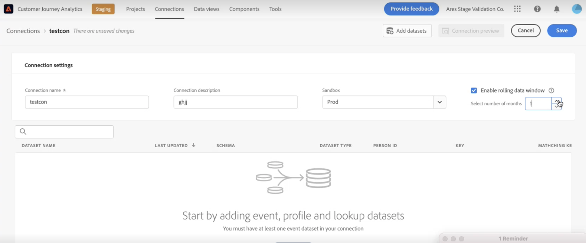

1. Configura le impostazioni della connessione.

   | Impostazione | Descrizione |
   | --- | --- |
   | **[!UICONTROL Nome connessione]** | Assegna un nome univoco alla connessione. |
   | **[!UICONTROL Descrizione connessione]** | Descrivi lo scopo di questa connessione. |
   | **[!UICONTROL Tag]** | Specifica i tag da aggiungere alla connessione in modo da poterli utilizzare per cercare la connessione in un secondo momento. |
   | **[!UICONTROL Abilita finestra di dati continua]** | La casella di controllo, se selezionata, consente di definire un’impostazione di conservazione dei dati di Customer Journey Analytics come finestra continua in mesi (1 mese, 3 mesi, 6 mesi, ecc.), a livello di connessione.<p>La conservazione dei dati si basa sulle marche temporali dei set di dati dell’evento e si applica solo ai set di dati dell’evento. Non esiste alcuna impostazione di finestra continua per i set di dati di profilo o di ricerca, in quanto non sono disponibili marche temporali applicabili. Tuttavia, se la connessione include un profilo o set di dati di ricerca (oltre a uno o più set di dati evento), tali dati verranno conservati per lo stesso periodo di tempo.<p> Il vantaggio principale consiste nell’archiviare o generare rapporti solo sui dati applicabili e utili, nonché nell’eliminare i dati meno recenti che non sono più utili. Ti aiuta a rispettare i limiti del tuo contratto e riduce il rischio di sovraccosti.<p><ul><li>Se lasci l’impostazione predefinita (non selezionata), il periodo di conservazione viene sostituito dall’impostazione di conservazione dei dati di Adobe Experience Platform. Se disponi di un valore di 25 mesi di dati in Experience Platform, Customer Journey Analytics può ottenere 25 mesi di dati tramite retrocompilazione. Eliminando 10 di questi mesi in Experience Platform, Customer Journey Analytics mantiene i restanti 15 mesi.</li><li>Se abiliti una finestra di dati continua, in **[!UICONTROL Seleziona il numero di mesi]** specifica il numero di mesi per i quali abiliti tale finestra. |
   | **[!UICONTROL Sandbox]** | Scegli una sandbox in Experience Platform che contiene i set di dati per cui desideri creare una connessione.<p>Adobe Experience Platform fornisce [sandbox](https://experienceleague.adobe.com/it/docs/experience-platform/sandbox/home) che permettono di suddividere una singola istanza di Platform in ambienti virtuali separati, utili per le attività di sviluppo ed evoluzione delle applicazioni dell’esperienza digitale. Puoi considerare le sandbox come “silos di dati” che contengono set di dati. Le sandbox vengono utilizzate per controllare l’accesso ai set di dati.<p>Dopo aver selezionato la sandbox, la barra a sinistra mostra tutti i set di dati nella sandbox da cui puoi richiamarli. |
   | **[!UICONTROL Aggiungere set di dati]** | Seleziona  **[!UICONTROL Aggiungi set di dati]** per aggiungere set di dati. Se la connessione non dispone ancora di set di dati, puoi selezionare anche **[!UICONTROL Aggiungi set di dati]** nella tabella dei set di dati. |


   Per i set di dati configurati, la tabella dei set di dati presenta le seguenti colonne:

   | Colonna | Descrizione |
   |---|---|
   | **[!UICONTROL Nome del set di dati]** | Seleziona uno o più set di dati da richiamare in Customer Journey Analytics e seleziona **[!UICONTROL Aggiungi]**.<p>Se sono presenti molti set di dati tra cui scegliere, puoi cercare quelli giusti utilizzando la barra di ricerca apposita sopra l’elenco dei set di dati. |
   |  | Seleziona  per aprire un menu di scelta rapida per il set di dati selezionato. In base al tipo di set di dati, puoi selezionare:<ul><li>  **[!UICONTROL Elimina set di dati]** per [eliminare un set di dati](#delete-a-dataset).</li><li> **[!UICONTROL Modifica set di dati]** per [modificare un set di dati](#edit-a-dataset).</li><li> **[!UICONTROL Retrocompilazioni precedenti]** per visualizzare le [retrocompilazioni precedenti del set di dati](#past-backfills). |
   | **[!UICONTROL Ultimo aggiornamento]** | Solo per i set di dati evento, questa impostazione viene impostata automaticamente sul campo marca temporale predefinito dagli schemi basati su eventi in Experience Platform. “N/A” significa che il set di dati non contiene dati. |
   | **[!UICONTROL Numero di record]** | Totale dei record del mese precedente per il set di dati in Experience Platform. |
   | **[!UICONTROL Schema]** | Lo [schema](https://experienceleague.adobe.com/it/docs/experience-platform/xdm/schema/composition) in base al quale è stato creato il set di dati in Adobe Experience Platform. |
   | **[!UICONTROL Tipo di set di dati]** | Per ogni set di dati aggiunto alla connessione, Customer Journey Analytics imposta automaticamente il [tipo di set di dati](#dataset-types) in base ai dati in arrivo. Esistono 3 tipi diversi di set di dati: dati evento, dati profilo e dati di ricerca. Nella tabella seguente puoi trovare una spiegazione dei tipi di set di dati. |
   | **[!UICONTROL Uniti]** | Se un set di dati è [abilitato per l&#39;unione nell&#39;interfaccia utente della connessione](/help/stitching/use-stitching-ui.md), il valore è **[!UICONTROL true]**. In caso contrario, il valore è **[!UICONTROL false]**. I set di dati uniti che sono il risultato della [richiesta di unione](/help/stitching//use-stitching.md) non sono identificati come uniti in questa tabella e per impostazione predefinita hanno un valore di **[!UICONTROL false]**. |
   | **[!UICONTROL Granularità]** | La granularità dei dati nel set di dati; applicabile solo per i set di dati di riepilogo. |
   | **[!UICONTROL Tipo di origine dati]** | Il tipo di origine dati del set di dati. Non applicabile per i set di dati di riepilogo. |
   | **[!UICONTROL ID persona]** | ID persona utilizzato per supportare la generazione di rapporti basati su persone per il set di dati. |
   | **[!UICONTROL Chiave]** | La chiave utilizzata per un set di dati di ricerca. |
   | **[!UICONTROL Chiave corrispondente]** | La chiave corrispondente utilizzata per un set di dati di ricerca. |
   | **[!UICONTROL Importa nuovi dati]** | Stato dell’importazione di nuovi dati per il set di dati: <p>   **[!UICONTROL _x _Attivo]**se il set di dati è configurato per l’importazione di nuovi dati e<p>   **[!UICONTROL _x Disattivato_]** se il set di dati è configurato per non importare nuovi dati. |
   | **[!UICONTROL Retrocompilazione dei dati]** | Stato dei dati di retrocompilazione per il set di dati.<p>   **[!UICONTROL _x _retrocompilazioni non riuscite]**per il numero di retrocompilazioni non riuscite,<p>   **[!UICONTROL _x _retrocompilazioni in elaborazione]**per il numero di retrocompilazioni in elaborazione,<p>   **[!UICONTROL _x _retrocompilazioni completate]**per il numero di retrocompilazioni completate e<p>   **[!UICONTROL _Disattivato_]** se non è configurata alcuna retrocompilazione. |

   Puoi cercare un set di dati specifico utilizzando il campo di .

### Customer Journey Analytics B2B Edition

[!BADGE B2B Edition]{type=Informative url="https://experienceleague.adobe.com/it/docs/analytics-platform/using/cja-overview/cja-b2b/cja-b2b-edition" newtab=true tooltip="Customer Journey Analytics B2B Edition"}

Nella schermata **[!UICONTROL Connessioni]** > **[!UICONTROL *Nome della connessione *]**:

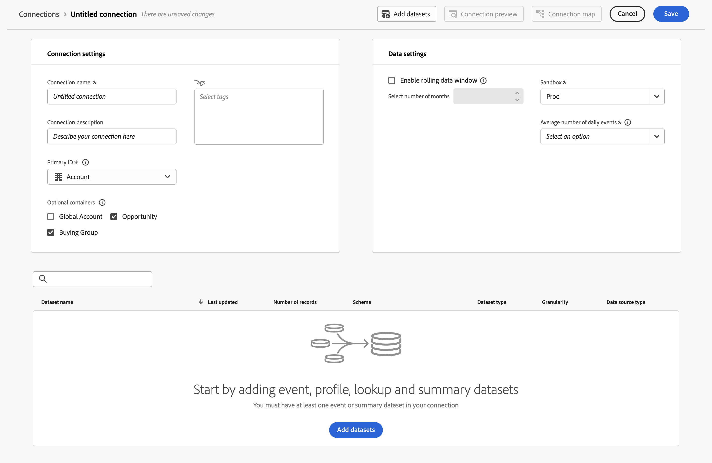

1. Configura le impostazioni della connessione.

   | Impostazione | Descrizione |
   | --- | --- |
   | **[!UICONTROL Nome connessione]** | Assegna un nome univoco alla connessione. |
   | **[!UICONTROL Descrizione connessione]** | Descrivi lo scopo di questa connessione. |
   | **[!UICONTROL Tag]** | Specifica i tag da aggiungere alla connessione in modo da poterli utilizzare per cercare la connessione in un secondo momento. |
   | **[!UICONTROL ID primario]** | Seleziona l’ID primario corretto per la connessione: <ul><li> **[!UICONTROL Persona]** per una connessione basata su persona in genere utilizzata in uno scenario B2C.</li><li>  **[!UICONTROL Account]** per una connessione basata su account in genere utilizzata in uno scenario B2B.</li></ul>Non appena aggiungi uno o più set di dati alla connessione, non potrai più modificare l’ID primario. <br/>La selezione dell&#39;ID primario definisce se la connessione è basata su persona o su account. La base di connessione determina le [impostazioni](#dataset-settings) disponibili per alcuni tipi di set di dati. |
   | **[!UICONTROL Contenitori opzionali]** | Se hai selezionato  **[!UICONTROL Account]** come **[!UICONTROL ID primario]**, seleziona ulteriori contenitori.<ul><li>**[!UICONTROL Account globale]**: abilita la configurazione degli account globali in una connessione.</li><li>**[!UICONTROL Opportunità]**: abilita la configurazione delle opportunità in una connessione.</li><li>**[!UICONTROL Gruppo acquisti]**: abilita la configurazione dei gruppi di acquisto in una connessione.</li><ul> |
   | **[!UICONTROL Sandbox]** | Scegli una sandbox in Experience Platform che contiene i set di dati per cui desideri creare una connessione.<p>Adobe Experience Platform fornisce [sandbox](https://experienceleague.adobe.com/it/docs/experience-platform/sandbox/home) che permettono di suddividere una singola istanza di Platform in ambienti virtuali separati, utili per le attività di sviluppo ed evoluzione delle applicazioni dell’esperienza digitale. Puoi considerare le sandbox come “silos di dati” che contengono set di dati. Le sandbox vengono utilizzate per controllare l’accesso ai set di dati.<p>Dopo aver selezionato la sandbox, la barra a sinistra mostra tutti i set di dati nella sandbox da cui puoi richiamarli. |
   | **[!UICONTROL Abilita finestra di dati continua]** | La casella di controllo, se selezionata, consente di definire un’impostazione di conservazione dei dati di Customer Journey Analytics come finestra continua in mesi (1 mese, 3 mesi, 6 mesi, ecc.), a livello di connessione.<p>La conservazione dei dati si basa sulle marche temporali dei set di dati dell’evento e si applica solo ai set di dati dell’evento. Non esiste alcuna impostazione di finestra continua per i set di dati di profilo o di ricerca, in quanto non sono disponibili marche temporali applicabili. Tuttavia, se la connessione include un profilo o set di dati di ricerca (oltre a uno o più set di dati evento), tali dati verranno conservati per lo stesso periodo di tempo.<p> Il vantaggio principale consiste nell’archiviare o generare rapporti solo sui dati applicabili e utili, nonché nell’eliminare i dati meno recenti che non sono più utili. Ti aiuta a rispettare i limiti del tuo contratto e riduce il rischio di sovraccosti.<p><ul><li>Se lasci l’impostazione predefinita (non selezionata), il periodo di conservazione viene sostituito dall’impostazione di conservazione dei dati di Adobe Experience Platform. Se disponi di un valore di 25 mesi di dati in Experience Platform, Customer Journey Analytics può ottenere 25 mesi di dati tramite retrocompilazione. Eliminando10 di questi mesi in Platform, Customer Journey Analytics mantiene i restanti 15 mesi.</li><li>Se abiliti una finestra di dati continua, in **[!UICONTROL Seleziona il numero di mesi]** specifica il numero di mesi per i quali abiliti tale finestra. |
   | **[!UICONTROL Aggiungere set di dati]** | Seleziona  **[!UICONTROL Aggiungi set di dati]** per [aggiungere set di dati](#add-datasets). Se la connessione non dispone ancora di set di dati, puoi selezionare anche **[!UICONTROL Aggiungi set di dati]** nella tabella dei set di dati. |


   Per i set di dati configurati, la tabella dei set di dati presenta le seguenti colonne:

   | Colonna | Descrizione |
   |---|---|
   | **[!UICONTROL Nome del set di dati]** | Seleziona uno o più set di dati da richiamare in Customer Journey Analytics e seleziona **[!UICONTROL Aggiungi]**.<p>Se sono presenti molti set di dati tra cui scegliere, puoi cercare quelli giusti utilizzando la barra di ricerca apposita sopra l’elenco dei set di dati. |
   |  | Seleziona  per aprire un menu di scelta rapida per il set di dati selezionato. In base al tipo di set di dati, puoi selezionare:<ul><li>  **[!UICONTROL Elimina set di dati]** per [eliminare un set di dati](#delete-a-dataset).</li><li> **[!UICONTROL Modifica set di dati]** per [modificare un set di dati](#edit-a-dataset).</li><li> **[!UICONTROL Retrocompilazioni precedenti]** per visualizzare le [retrocompilazioni precedenti del set di dati](#past-backfills). |
   | **[!UICONTROL Ultimo aggiornamento]** | Solo per i set di dati evento, questa impostazione viene impostata automaticamente sul campo marca temporale predefinito dagli schemi basati su eventi in Experience Platform. “N/A” significa che il set di dati non contiene dati. |
   | **[!UICONTROL Numero di record]** | Totale dei record del mese precedente per il set di dati in Experience Platform. |
   | **[!UICONTROL Schema]** | Lo [schema](https://experienceleague.adobe.com/it/docs/experience-platform/xdm/schema/composition) in base al quale è stato creato il set di dati in Adobe Experience Platform. |
   | **[!UICONTROL Tipo di set di dati]** | Per ogni set di dati aggiunto alla connessione, Customer Journey Analytics imposta automaticamente il [tipo di set di dati](#dataset-types) in base ai dati in arrivo. |
   | **[!UICONTROL Granularità]** | La granularità dei dati nel set di dati; applicabile solo per i set di dati di riepilogo. |
   | **[!UICONTROL Tipo di origine dati]** | Il tipo di origine dati del set di dati. Non applicabile per i set di dati di riepilogo. |
   | **[!UICONTROL ID account]** | (visualizzato solo per le connessioni basate su account) L’ID account utilizzato per supportare il reporting basato su account per il set di dati. |
   | **[!UICONTROL ID account globale]** | (visualizzato solo per le connessioni basate su account) L’ID account globale utilizzato per supportare la generazione di rapporti basati su account per il set di dati. |
   | **[!UICONTROL ID gruppo acquisti]** | (visualizzato solo per le connessioni basate su account) L&#39;ID del gruppo acquisti utilizzato per cercare i dati del gruppo acquisti. |
   | **[!UICONTROL ID opportunità]** | (visualizzato solo per le connessioni basate su account) L’ID opportunità utilizzato per cercare i dati dell’opportunità. |
   | **[!UICONTROL ID persona]** | ID persona utilizzato per supportare la generazione di rapporti basati su persone per il set di dati. |
   | **[!UICONTROL Chiave]** | La chiave utilizzata per un set di dati di ricerca. |
   | **[!UICONTROL Chiave corrispondente]** | La chiave corrispondente utilizzata per un set di dati di ricerca. |
   | **[!UICONTROL Importa nuovi dati]** | Stato dell’importazione di nuovi dati per il set di dati: <p>   **[!UICONTROL _x _Attivo]**se il set di dati è configurato per l’importazione di nuovi dati e<p>   **[!UICONTROL _x Disattivato_]** se il set di dati è configurato per non importare nuovi dati. |
   | **[!UICONTROL Retrocompilazione dei dati]** | Stato dei dati di retrocompilazione per il set di dati.<p>   **[!UICONTROL _x _retrocompilazioni non riuscite]**per il numero di retrocompilazioni non riuscite,<p>   **[!UICONTROL _x _retrocompilazioni in elaborazione]**per il numero di retrocompilazioni in elaborazione,<p>   **[!UICONTROL _x _retrocompilazioni completate]**per il numero di retrocompilazioni completate e<p>   **[!UICONTROL _Disattivato_]** se non è configurata alcuna retrocompilazione. |

   Puoi cercare un set di dati specifico utilizzando il campo di .

## Set di dati {#datasets}

[Aggiungi uno o più set di dati](#add-datasets) o [modifichi i set di dati esistenti](#edit-a-dataset) come parte del flusso di lavoro della connessione.

>[!NOTE]
>
>I valori nei campi Data e Data-ora precedenti all&#39;anno 1900 vengono sostituiti con `null` prima dell&#39;acquisizione della riga, indipendentemente dal tipo di set di dati.<br/>Le righe in un set di dati evento o riepilogo con un valore di marca temporale precedente all’anno 1900 vengono eliminate dall’acquisizione.


{{relational-model-based}}


>[!CONTEXTUALHELP]
>id="cja_connection_primaryid"
>title="ID primario"
>abstract="Seleziona l’ID primario corretto per la connessione: Persona per uno scenario B2C. Account per uno scenario B2B."

>[!CONTEXTUALHELP]
>id="cja_connection_optionalcontainers"
>title="Contenitori opzionali"
>abstract="Seleziona contenitori aggiuntivi.<br/><br/>**[!UICONTROL Account globale ]**: abilita la configurazione degli account globali in una connessione.<br/>**[!UICONTROL Opportunità]**: abilita la configurazione delle opportunità in una connessione.<br/>**[!UICONTROL Gruppo acquisti ]**: abilita la configurazione dei gruppi di acquisto in una connessione."

>[!CONTEXTUALHELP]
>id="cja_connection_accountid"
>title="ID account"
>abstract="Seleziona un ID account (identificatore univoco per un account) dalle identità disponibili definite nello schema del set di dati in Experience Platform."

>[!CONTEXTUALHELP]
>id="cja_connection_accountfield"
>title="Campo account"
>abstract="Seleziona un campo che rappresenta l’ID account (l’identificatore univoco di un account)."

>[!CONTEXTUALHELP]
>id="cja_connection_globalaccountid"
>title="ID account globale"
>abstract="Seleziona un ID account globale (l’identificatore univoco di un account globale) dalle identità disponibili definite nello schema del set di dati in Experience Platform."

>[!CONTEXTUALHELP]
>id="cja_connection_opportunityid"
>title="ID opportunità"
>abstract="Seleziona un ID opportunità (l’identificatore univoco di un’opportunità) dalle identità disponibili definite nello schema del set di dati in Experience Platform."

>[!CONTEXTUALHELP]
>id="cja_connection_buyinggroupid"
>title="ID gruppo di acquisto"
>abstract="Seleziona un ID gruppo acquisti (l’identificatore univoco per un gruppo acquisti) dalle identità disponibili definite nello schema del set di dati in Experience Platform."

>[!CONTEXTUALHELP]
>id="cja_connection_personid"
>title="ID persona"
>abstract="Seleziona un ID persona (l’identificatore univoco di una persona) dalle identità disponibili definite nello schema del set di dati in Experience Platform."

>[!CONTEXTUALHELP]
>id="cja_connection_matchingkey"
>title="Chiave corrispondente"
>abstract="Seleziona un campo da unire in uno dei set di dati dell’evento. Se questo elenco è vuoto, probabilmente non hai aggiunto o configurato un set di dati evento."

>[!CONTEXTUALHELP]
>id="cja_connection_importnewdata"
>title="Importa nuovi dati"
>abstract="Eventuali nuovi batch aggiunti al set di dati di Experience Platform verranno aggiunti automaticamente a questa connessione e resi disponibili per l’analisi."

>[!CONTEXTUALHELP]
>id="cja_connection_datasetbackfill"
>title="Retrocompilazione set di dati"
>abstract="Questa opzione esegue la retrocompilazione dei dati esistenti (storici) da Experience Platform per questo set di dati nella connessione."

>[!CONTEXTUALHELP]
>id="cja_connection_transformdataset"
>title="Trasforma set di dati"
>abstract="Questa opzione trasforma il set di dati in modo che possa essere utilizzato per ricerche basate su persone in scenari B2B. Una volta attivata questa opzione, la trasformazione del set di dati è irreversibile."

>[!CONTEXTUALHELP]
>id="cja_connection_connectionmap"
>title="Mappa della connessione"
>abstract="La Mappa di connessione visualizza le relazioni tra evento, persona, account e set di dati di ricerca rilevanti (come opportunità, membri della campagna e altro)."

>[!CONTEXTUALHELP]
>id="connection_primaryid"
>title="ID primario"
>abstract="Seleziona l’ID primario corretto per la connessione: Persona per uno scenario B2C. Account per uno scenario B2B."

>[!CONTEXTUALHELP]
>id="connection_optionalcontainers"
>title="Contenitori opzionali"
>abstract="Seleziona contenitori aggiuntivi.<br/><br/>**[!UICONTROL Account globale ]**: abilita la configurazione degli account globali in una connessione.<br/>**[!UICONTROL Opportunità]**: abilita la configurazione delle opportunità in una connessione.<br/>**[!UICONTROL Gruppo acquisti ]**: abilita la configurazione dei gruppi di acquisto in una connessione."

>[!CONTEXTUALHELP]
>id="connection_personid"
>title="ID persona"
>abstract="Seleziona un ID persona tra le identità disponibili definite negli schemi di set di dati in Experience Platform."

>[!CONTEXTUALHELP]
>id="connection_accountid"
>title="ID account"
>abstract="Seleziona un ID account (identificatore univoco per un account) dalle identità disponibili definite nello schema del set di dati in Experience Platform."

>[!CONTEXTUALHELP]
>id="connection_accountfield"
>title="Campo account"
>abstract="Seleziona un campo che rappresenta l’ID account (l’identificatore univoco di un account)."

>[!CONTEXTUALHELP]
>id="connection_globalaccountid"
>title="ID account globale"
>abstract="Seleziona un ID account globale (l’identificatore univoco di un account globale) dalle identità disponibili definite nello schema del set di dati in Experience Platform."

>[!CONTEXTUALHELP]
>id="connection_opportunityid"
>title="ID opportunità"
>abstract="Seleziona un ID opportunità (l’identificatore univoco di un’opportunità) dalle identità disponibili definite nello schema del set di dati in Experience Platform."

>[!CONTEXTUALHELP]
>id="connection_buyinggroupid"
>title="ID gruppo di acquisto"
>abstract="Seleziona un ID gruppo acquisti (l’identificatore univoco per un gruppo acquisti) dalle identità disponibili definite nello schema del set di dati in Experience Platform."

>[!CONTEXTUALHELP]
>id="connection_matchingkey"
>title="Chiave corrispondente"
>abstract="Seleziona un campo da unire in uno dei set di dati dell’evento. Se questo elenco è vuoto, probabilmente non hai aggiunto o configurato un set di dati evento."

>[!CONTEXTUALHELP]
>id="connection_matchingkeytype"
>title="Tipo di chiave di corrispondenza"
>abstract="Seleziona la modalità di unione: in base a una corrispondenza per campo o per contenitore.<br/><br/>**[!UICONTROL Corrispondenza per campo ]**: seleziona un campo da unire in uno dei set di dati dell’evento. Se questo elenco è vuoto, probabilmente non hai aggiunto o configurato un set di dati evento.<br/>**[!UICONTROL Corrispondenza per contenitore]**: seleziona un contenitore da utilizzare per l’unione con uno dei set di dati dell’evento."

>[!CONTEXTUALHELP]
>id="connection_importnewdata"
>title="Importa nuovi dati"
>abstract="Eventuali nuovi batch aggiunti al set di dati di Experience Platform verranno aggiunti automaticamente a questa connessione e resi disponibili per l’analisi."

>[!CONTEXTUALHELP]
>id="connection_datasetbackfill"
>title="Retrocompilazione set di dati"
>abstract="Questa opzione esegue la retrocompilazione dei dati esistenti (storici) da Experience Platform per questo set di dati nella connessione."

>[!CONTEXTUALHELP]
>id="connection_transformdataset"
>title="Trasforma set di dati"
>abstract="Questa opzione trasforma il set di dati in modo che possa essere utilizzato per ricerche basate su persone in scenari B2B. Una volta attivata questa opzione, la trasformazione del set di dati è irreversibile."

>[!CONTEXTUALHELP]
>id="connection_connectionmap"
>title="Mappa della connessione"
>abstract="La Mappa di connessione visualizza le relazioni tra evento, persona, account e set di dati di ricerca rilevanti (come opportunità, membri della campagna e altro)."

>[!CONTEXTUALHELP]
>id="connection_stitching_enable"
>title="Abilitare l’unione di identità"
>abstract="Abilita l’unione di identità per elevare questo set di dati evento per l’analisi cross-channel."
>additional-url="https://experienceleague.adobe.com/en/docs/analytics-platform/using/stitching/overview" text="Panoramica sull’unione delle identità"

>[!CONTEXTUALHELP]
>id="connection_stitching_dialog"
>title="Abilitare l’unione di identità"
>abstract="L’abilitazione dell’unione di identità deriva un ID unito da un set di dati o da un grafico delle identità. Questo processo può includere l’unione di dati utente provenienti da sessioni autenticate e non autenticate.<br/><br/>L’utente è responsabile del rispetto delle leggi e delle normative applicabili. Questa conformità include il fatto di ottenere le autorizzazioni necessarie per l’utente finale prima di attivare l’unione su un set di dati."
>additional-url="https://experienceleague.adobe.com/en/docs/analytics-platform/using/stitching/overview" text="Panoramica sull’unione delle identità"

>[!CONTEXTUALHELP]
>id="connection_persistentid"
>title="ID persistente"
>abstract="Seleziona un ID persistente dalle identità disponibili. Un ID persistente è un identificatore disponibile su tutti gli eventi nel set di dati evento."
>additional-url="https://experienceleague.adobe.com/en/docs/analytics-platform/using/stitching/overview" text="Panoramica sull’unione delle identità"

>[!CONTEXTUALHELP]
>id="connection_lookbackwindow"
>title="Intervallo di ripetizione"
>abstract="Selezionate il periodo di tempo appropriato per la finestra di ripetizione da utilizzare nell&#39;unione."
>additional-url="https://experienceleague.adobe.com/en/docs/analytics-platform/using/stitching/overview" text="Panoramica sull’unione delle identità"

>[!CONTEXTUALHELP]
>id="connection_namespace_map"
>title="Mappa di identità dello spazio dei nomi"
>abstract="Seleziona lo spazio dei nomi da utilizzare per scegliere l’identificatore dalla mappa di identità."
>additional-url="https://experienceleague.adobe.com/en/docs/analytics-platform/using/stitching/overview" text="Panoramica sull’unione delle identità"

>[!CONTEXTUALHELP]
>id="connection_namespace_graph"
>title="Grafo delle identità dello spazio dei nomi"
>abstract="Seleziona lo spazio dei nomi da utilizzare per scegliere l’identificatore dalla mappa di identità."
>additional-url="https://experienceleague.adobe.com/en/docs/analytics-platform/using/stitching/overview" text="Panoramica sull’unione delle identità"


### Tipi di set di dati {#dataset-types}

Per ogni set di dati aggiunto alla connessione, [!UICONTROL Customer Journey Analytics] imposta automaticamente il tipo di set di dati in base ai dati in arrivo.

>[!IMPORTANT]
>
>Aggiungi almeno un set di dati di riepilogo o evento (standard oppure di tipo ad hoc o relazionale) alla connessione.

Esistono diversi tipi di set di dati: dati [!UICONTROL Evento], dati [!UICONTROL Profilo], dati [!UICONTROL Ricerca] e dati [!UICONTROL Riepilogo], ciascuno costruito sul corrispondente schema basato su XDM.

| Tipo di set di dati | Descrizione | Marca temporale | Schema | ID persona <br/> ID account [!BADGE B2B Edition]{type=Informative url="https://experienceleague.adobe.com/it/docs/analytics-platform/using/cja-overview/cja-b2b/cja-b2b-edition" newtab=true tooltip="Customer Journey Analytics B2B Edition"} |
|---|---|---|---|---|
| **[!UICONTROL Evento]** | Dati che rappresentano eventi nel tempo. Ad esempio visite web, interazioni, transazioni, dati POS, dati dei sondaggi, dati ad impression, ecc. Questi dati possono essere ad esempio tipici dati di click-stream, con un ID cliente o un ID cookie e una marca temporale. Con i dati evento hai la flessibilità di scegliere quale ID usare come ID persona. | L&#39;impostazione avviene automaticamente sulla marca temporale predefinita dagli schemi basati su evento in [!UICONTROL Experience Platform]. | Qualsiasi schema incorporato o personalizzato basato su una classe XDM con il comportamento *Serie temporali*. Alcuni esempi includono *XDM Experience Event* o *XDM Decision Event*. | Puoi scegliere quale ID persona o ID account [!BADGE B2B Edition]{type=Informative url="https://experienceleague.adobe.com/it/docs/analytics-platform/using/cja-overview/cja-b2b/cja-b2b-edition" newtab=true tooltip="Customer Journey Analytics B2B Edition"} desideri includere. Ciascun schema di set di dati definito in Experience Platform può disporre di un proprio set di una o più identità definite e associate a uno spazio dei nomi identità. Ognuna di queste identità può essere utilizzata come ID persona o ID account [!BADGE B2B Edition]{type=Informative url="https://experienceleague.adobe.com/it/docs/analytics-platform/using/cja-overview/cja-b2b/cja-b2b-edition" newtab=true tooltip="Customer Journey Analytics B2B Edition"}.  Alcuni esempi includono ID cookie, ID di unione, ID utente, Codice di tracciamento, ID account [!BADGE B2B Edition]{type=Informative url="https://experienceleague.adobe.com/it/docs/analytics-platform/using/cja-overview/cja-b2b/cja-b2b-edition" newtab=true tooltip="Customer Journey Analytics B2B Edition"}, e così via. |
| **[!UICONTROL Ricerca]** | Ora puoi aggiungere set di dati come ricerche di campi all’interno di tutti i tipi di set di dati: Profilo, Ricerca ed Evento (l’ultimo è sempre stato supportato). Questa funzionalità aggiuntiva estende la capacità di Customer Journey Analytics di supportare modelli di dati complessi, tra cui B2B. Questi dati vengono utilizzati per cercare i valori o le chiavi presenti nei dati Evento, Profilo o Ricerca. Puoi aggiungere fino a tre livelli di ricerca. I [Campi derivati](/help/data-views/derived-fields/derived-fields.md) non possono essere utilizzati come chiavi corrispondenti per le ricerche all’interno di Connessioni. Ad esempio, puoi caricare dati di ricerca che mappano gli ID numerici nei dati evento ai nomi dei prodotti. Per un esempio, consulta l’[esempio B2B](/help/use-cases/b2b/example.md). | N/D | Qualsiasi schema incorporato o personalizzato basato su una classe XDM con comportamento *Record*, ad eccezione della classe *Profilo individuale XDM*. | N/D |
| **[!UICONTROL Profilo]** | Dati applicati all’account, a persone, utenti, o clienti nei dati  [!UICONTROL Evento]. Ad esempio, consente di caricare dati di gestione delle relazioni con i clienti riguardanti i tuoi clienti. | N/D | Qualsiasi schema incorporato o personalizzato basato sulla classe *Profilo individuale XDM*. | Puoi scegliere quale ID persona o ID account [!BADGE B2B Edition]{type=Informative url="https://experienceleague.adobe.com/it/docs/analytics-platform/using/cja-overview/cja-b2b/cja-b2b-edition" newtab=true tooltip="Customer Journey Analytics B2B Edition"} desideri includere. Per ogni set di dati (esclusi i set di dati di riepilogo) definito in [!DNL Experience Platform], viene definito anche un proprio set di uno o più ID persona o ID account [!BADGE B2B Edition]{type=Informative url="https://experienceleague.adobe.com/it/docs/analytics-platform/using/cja-overview/cja-b2b/cja-b2b-edition" newtab=true tooltip="Customer Journey Analytics B2B Edition"}. Per esempio ID cookie, ID di unione, ID utente, Codice di tracciamento, ID account, e così via.<br>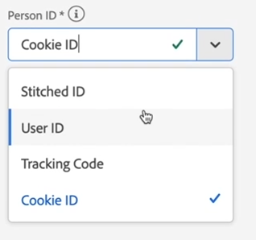**Nota**: se crei una connessione che include set di dati con ID diversi, comparirà anche nei rapporti. Per unire i set di dati, devi utilizzare lo stesso ID persona o ID account [!BADGE B2B Edition]{type=Informative url="https://experienceleague.adobe.com/it/docs/analytics-platform/using/cja-overview/cja-b2b/cja-b2b-edition" newtab=true tooltip="Customer Journey Analytics B2B Edition"}. |
| **Riepilogo** | Dati di serie temporali che non sono associati a un singolo ID persona. I dati di riepilogo rappresentano i dati aggregati a un diverso livello di aggregazione, ad esempio le campagne. Puoi utilizzare questi dati in Customer Journey Analytics per supportare vari casi d’uso. Per ulteriori informazioni, consulta [Dati di riepilogo](/help/data-views/summary-data.md). | Viene impostato automaticamente sul campo marca temporale predefinito dagli schemi delle metriche di riepilogo basati sull’evento in Experience Platform. È supportata solo la granularità oraria o giornaliera. | Qualsiasi schema incorporato o personalizzato basato sulla classe *Metriche di riepilogo XDM*. | N/D |

In alternativa, i tipi di set di dati elencati sopra possono essere basati su uno schema ad hoc o relazionale, anziché su uno schema generico basato su XDM.

| Tipo di set di dati | Descrizione | Marca temporale | Schema | ID persona |
|---|---|---|---|---|
| **[!UICONTROL Ad hoc]** | Dati ad hoc basati su uno [schema ad hoc](https://experienceleague.adobe.com/it/docs/experience-platform/xdm/api/ad-hoc) con campi a cui viene assegnato uno spazio dei nomi per l&#39;utilizzo unicamente da un singolo set di dati. | Dipende dal tipo di set di dati selezionato per il set di dati ad hoc. | Qualsiasi schema ad hoc costruito su una classe basata sul comportamento *ad hoc* | Dipende dal tipo di set di dati selezionato per il set di dati ad hoc. |
| **[!UICONTROL Modello]** | Dati relazionali basati su uno schema relazionale. | Dipende dal tipo di set di dati selezionato per il set di dati relazionale. | Qualsiasi schema relazionale. | Dipende dal tipo di set di dati selezionato per il set di dati relazionale. |


### Aggiungere set di dati

Puoi aggiungere uno o più set di dati di Experience Platform quando crei o modifichi una connessione.


1. In **[!UICONTROL Connessione]** > interfaccia **[!UICONTROL _Nome della connessione_]**, seleziona  **[!UICONTROL Aggiungi set di dati]**.

1. Durante il passaggio ➊ **[!UICONTROL Seleziona set di dati]**, viene visualizzato un elenco dei set di dati di Experience Platform.

   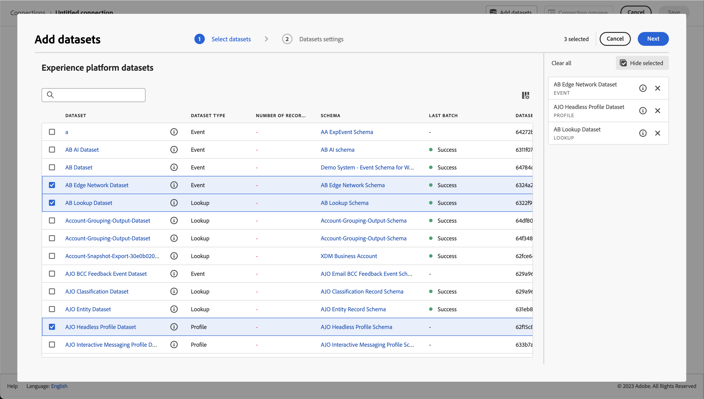

   Per ogni set di dati, l’elenco mostra:

   | Colonna | Descrizione |
   |---|---|
   | **[!UICONTROL Set di dati]** | Nome del se di dati. Seleziona il nome per indirizzarti al set di dati in Experience Platform. Seleziona  per visualizzare un pop-up con ulteriori dettagli per il set di dati. Puoi selezionare **[!UICONTROL Modifica in Platform]** per modificare il set di dati direttamente in Experience Platform. |
   | **[!UICONTROL Tipo di set di dati]** | Il tipo di set di dati: [Evento](#event-dataset), [Profilo](#profile-dataset), [Ricerca](#lookup-dataset), [Riepilogo](#summary-dataset), [Ad hoc](#ad-hoc-dataset) o [Relazionale](#relational-dataset). |
   | **[!UICONTROL Numero di record]** | Totale dei record del mese precedente per il set di dati in Experience Platform. |
   | **[!UICONTROL Schema]** | Lo schema per il set di dati. Seleziona il nome per passare allo schema in Experience Platform. |
   | **[!UICONTROL Ultimo batch]** | Stato dell’ultimo batch acquisito in Experience Platform. Per ulteriori informazioni, consulta [Stati batch](https://experienceleague.adobe.com/it/docs/experience-platform/ingestion/batch/troubleshooting#batch-states). |
   | **[!UICONTROL ID set di dati]** | L’ID del set di dati. |
   | **[!UICONTROL Ultimo aggiornamento]** | La marca temporale dell’ultimo aggiornamento del set di dati. |

   * Per modificare le colonne visualizzate per l’elenco dei set di dati, seleziona  e seleziona le colonne da visualizzare nella finestra di dialogo [!UICONTROL Personalizza tabella].
   * Per cercare un set di dati specifico, utilizza il campo di ricerca .
   * Per attivare o disattivare le visualizzazione dei set di dati selezionati, utilizza  **[!UICONTROL Nascondi selezione]** o **[!UICONTROL Mostra selezione]**.
   * Per rimuovere un set di dati dall’elenco dei set di dati selezionati, utilizza . Per rimuovere tutti i set di dati selezionati, utilizza **[!UICONTROL Cancella tutto]**.
   * Per visualizzare i dettagli di un set di dati, seleziona .


1. Seleziona uno o più set di dati e seleziona **[!UICONTROL Avanti]**.  Deve far parte della connessione almeno un set di dati di riepilogo o evento.

1. Configura le [impostazioni per ciascuno dei set di dati selezionati](#dataset-settings), uno alla volta, nel passaggio ➋ **[!UICONTROL Impostazioni set di dati]** della finestra di dialogo **[!UICONTROL Aggiungi set di dati]**.

   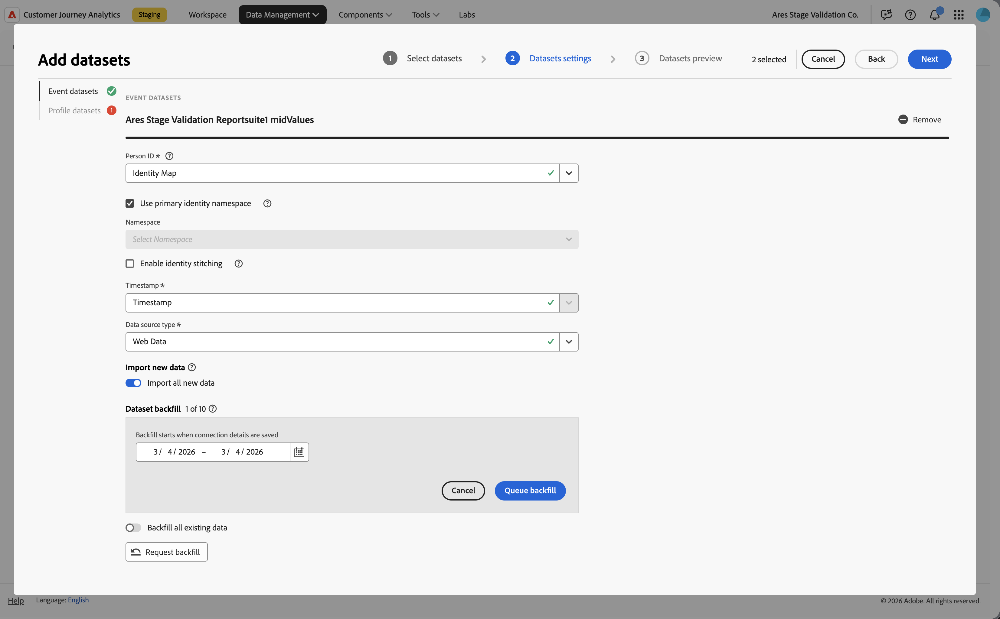

1. Seleziona **[!UICONTROL Aggiungi set di dati]** per aggiungere i set di dati configurati alla connessione. Ricevi una notifica se mancano delle impostazioni obbligatorie nei set di dati che desideri aggiungere.

   In alternativa, puoi selezionare **[!UICONTROL Annulla]** per annullare l&#39;aggiunta di set di dati alla connessione. Oppure seleziona **[!UICONTROL Indietro]** per tornare al passaggio ➊ **[!UICONTROL Seleziona set di dati]**.


### Modificare un set di dati

Per modificare un set di dati già configurato per una connessione, in **[!UICONTROL Connessioni]** > interfaccia **[!UICONTROL _Nome della connessione_]**:

1. Seleziona  per il set di dati elencato nella tabella del set di dati da modificare
1. Seleziona  **[!UICONTROL Modifica set di dati]**.

1. Configura le [impostazioni del set di dati](#dataset-settings) nella finestra di dialogo **[!UICONTROL Modifica set di dati: _Nome del set di dati_]**.

   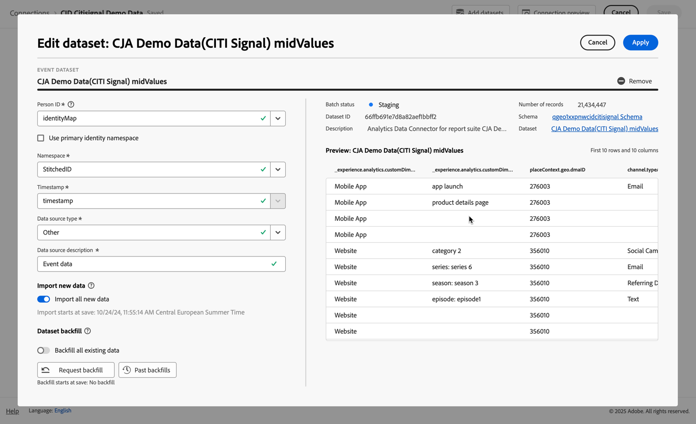

   >[!NOTE]
   >
   >Non puoi modificare il **[!UICONTROL Tipo di set di dati]**, **[!UICONTROL ID persona]**, **[!UICONTROL Spazio dei nomi identità]** e **[!UICONTROL Marca temporale]** per un set di dati [ad hoc](#ad-hoc-dataset) o [relazionale](#relational-dataset) che fa parte di una connessione salvata. Per modificare una di queste impostazioni:
   >
   >1. Elimina il set di dati ad hoc o relazionale esistente dalla connessione.
   >1. Aggiungi alla connessione lo stesso set di dati con impostazioni aggiornate.
   >

1. Seleziona **[!UICONTROL Applica]** per applicare le impostazioni del set di dati. Seleziona **[!UICONTROL Annulla]** per annullare.


### Impostazioni del set di dati

Quando aggiungi set di dati o ne modifichi uno esistente, configura le impostazioni per ogni set di dati. Le impostazioni disponibili dipendono dal [tipo di set di dati](#dataset-types) e, per alcuni tipi di set di dati, dal tipo di connessione (basata su persona o basata su account [!BADGE B2B edition]{type=Informative url="https://experienceleague.adobe.com/it/docs/analytics-platform/using/cja-overview/cja-b2b/cja-b2b-edition" newtab=true tooltip="Customer Journey Analytics B2B Edition"}).

Tutti i set di dati e i tipi di set di dati hanno [dettagli e impostazioni generali](#general-dataset-settings-and-details), ad esempio se importare nuovi dati e richiedere retrocompilazioni.

#### Set di dati evento

Le impostazioni specifiche per un set di dati evento dipendono dal tipo di connessione.

##### Connessione basata su persona

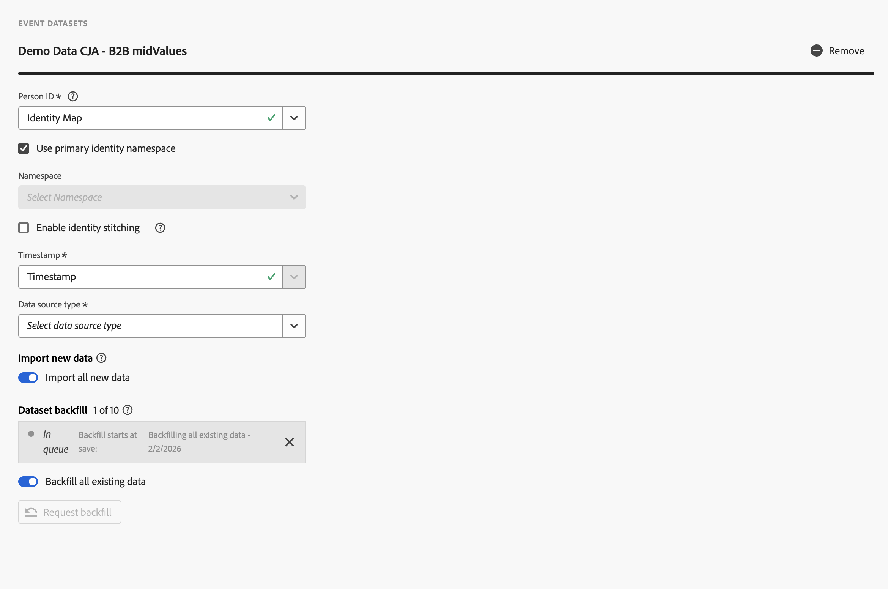

Per un set di dati evento in una connessione basata su persona, puoi specificare:

| Impostazione | Descrizione |
| --- | --- |
| **[!UICONTROL ID persona]** | Seleziona un ID persona dall’elenco a discesa delle identità disponibili. Queste identità sono state definite nello schema del set di dati in Experience Platform. Consulta [Utilizzare Identity Map come ID persona](#use-identity-map-as-a-person-id) per informazioni su come utilizzare Identity Map come ID persona.<p>Se non è presente alcun ID persona tra cui scegliere, significa che nello schema non sono definiti ID persona. Consulta [Definire i campi di identità nell’interfaccia utente](https://experienceleague.adobe.com/it/docs/experience-platform/xdm/ui/fields/identity) per ulteriori informazioni. <p>Il valore per l’ID persona selezionato è considerato sensibile a maiuscole e minuscole. Ad esempio: `abc123` e `ABC123` sono due valori diversi.<p>Se un record non contiene un valore per l’identità selezionata come ID persona per il set di dati evento, il record viene ignorato. |
| **[!UICONTROL Abilita unione identità]** | Selezionare per [abilitare l&#39;unione delle identità](/help/stitching/overview.md) per questo set di dati evento. |
| **[!UICONTROL Marca temporale]** | Questa impostazione viene impostata automaticamente sul campo marca temporale predefinito dagli schemi basati su eventi in Experience Platform. |
| **[!UICONTROL Tipo di origine dati]** | Seleziona un tipo di origine dati. I tipi di origini dati includono: <ul><li>[!UICONTROL Dati web]</li><li>[!UICONTROL Dati da app mobili]</li><li>[!UICONTROL Dati POS]</li><li>[!UICONTROL Dati CRM]</li><li>[!UICONTROL Dati sondaggio]</li><li>[!UICONTROL Dati del call center]</li><li>[!UICONTROL Dati prodotto]</li><li> [!UICONTROL Dati degli account]</li><li> [!UICONTROL Dati transazione]</li><li>[!UICONTROL Dati di feedback cliente]</li><li> [!UICONTROL Altre]</li></ul>Questo campo viene utilizzato per esaminare i tipi di origini dati in uso. |
| **[!UICONTROL Descrizione dell’origine dati]** | Descrizione dell’origine dati dopo aver selezionato Altre come tipo di origine dati. |


##### Connessione basata su account

[!BADGE B2B Edition]{type=Informative url="https://experienceleague.adobe.com/it/docs/analytics-platform/using/cja-overview/cja-b2b/cja-b2b-edition" newtab=true tooltip="Customer Journey Analytics B2B Edition"}

Per un set di dati evento in una connessione basata su account, puoi specificare:

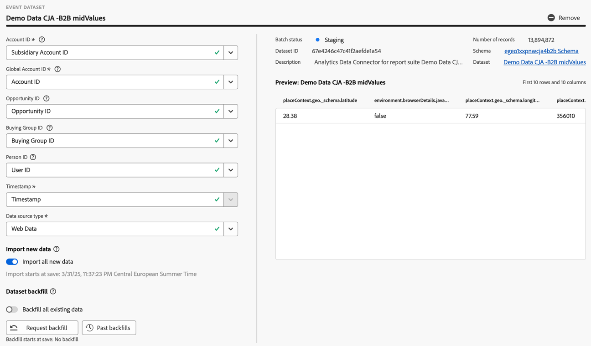

| Impostazione | Descrizione |
| --- | --- |
| **[!UICONTROL ID account globale]** | Seleziona un ID account globale (identificatore univoco per un account) dalle identità disponibili definite nello schema del set di dati in Experience Platform. Applicabile quando hai aggiunto l’account globale come contenitore alla connessione. <p>Se un record non contiene un valore per l’identità selezionata come ID account per il set di dati evento, il record viene ignorato. |
| **[!UICONTROL ID account]** | Seleziona un ID account (identificatore univoco per un account) dalle identità disponibili definite nello schema del set di dati in Experience Platform. Applicabile quando non hai aggiunto l’account globale come contenitore alla connessione. |
| **[!UICONTROL ID opportunità]** | Seleziona un ID opportunità (identificatore univoco per un’opportunità) dalle identità disponibili definite nello schema del set di dati in Experience Platform. |
| **[!UICONTROL ID gruppo acquisti]** | Seleziona un ID gruppo acquisti (identificatore univoco per un gruppo acquisti) dalle identità disponibili definite nello schema del set di dati in Experience Platform. |
| **[!UICONTROL ID persona]** | Seleziona un ID persona dall’elenco a discesa delle identità disponibili. Queste identità sono state definite nello schema del set di dati in Experience Platform. Consulta [Utilizzare Identity Map come ID persona](#id-map) per informazioni su come utilizzare Identity Map come ID persona.<p>Se non è presente alcun ID persona tra cui scegliere, significa che uno o più ID persona non sono stati definiti nello schema. Consulta [Definire i campi di identità nell’interfaccia utente](https://experienceleague.adobe.com/it/docs/experience-platform/xdm/ui/fields/identity) per ulteriori informazioni. <p>Il valore per l’ID persona selezionato è considerato sensibile a maiuscole e minuscole. Ad esempio: `abc123` e `ABC123` sono due valori diversi. |
| **[!UICONTROL Marca temporale]** | Questa impostazione viene impostata automaticamente sul campo marca temporale predefinito dagli schemi basati su eventi in Experience Platform. |
| **[!UICONTROL Tipo di origine dati]** | Seleziona un tipo di origine dati. I tipi di origini dati includono: <ul><li>[!UICONTROL Dati web]</li><li>[!UICONTROL Dati da app mobili]</li><li>[!UICONTROL Dati POS]</li><li>[!UICONTROL Dati CRM]</li><li>[!UICONTROL Dati sondaggio]</li><li>[!UICONTROL Dati del call center]</li><li>[!UICONTROL Dati prodotto]</li><li> [!UICONTROL Dati degli account]</li><li> [!UICONTROL Dati transazione]</li><li>[!UICONTROL Dati di feedback cliente]</li><li> [!UICONTROL Altre]</li></ul>Questo campo viene utilizzato per esaminare i tipi di origini dati in uso. |
| **[!UICONTROL Descrizione dell’origine dati]** | Descrizione dell’origine dati dopo aver selezionato Altre come tipo di origine dati. |

#### Set di dati di profilo

Le impostazioni specifiche di un set di dati profilo dipendono dal tipo di connessione.

##### Connessione basata su persona

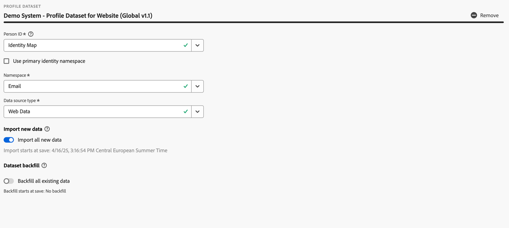

Per un set di dati profilo in una connessione basata su persona, puoi specificare:

| Impostazione | Descrizione |
| --- | --- |
| **[!UICONTROL ID persona]** | Seleziona un ID persona dall’elenco a discesa delle identità disponibili. Queste identità sono state definite nello schema del set di dati in Experience Platform. Consulta [Utilizzare Identity Map come ID persona](#id-map) per informazioni su come utilizzare Identity Map come ID persona.<p>Se non è presente alcun ID persona tra cui scegliere, nello schema non viene definito alcun ID persona. Consulta [Definire i campi di identità nell’interfaccia utente](https://experienceleague.adobe.com/it/docs/experience-platform/xdm/ui/fields/identity) per ulteriori informazioni. <p>Il valore per l’ID persona selezionato è considerato sensibile a maiuscole e minuscole. Ad esempio: `abc123` e `ABC123` sono due valori diversi. <p>Se un record non contiene un valore per l’identità selezionata come ID persona per il set di dati profilo, il record viene ignorato. |
| **[!UICONTROL Tipo di origine dati]** | Seleziona un tipo di origine dati. I tipi di origini dati includono: <ul><li>[!UICONTROL Dati web]</li><li>[!UICONTROL Dati da app mobili]</li><li>[!UICONTROL Dati POS]</li><li>[!UICONTROL Dati CRM]</li><li>[!UICONTROL Dati sondaggio]</li><li>[!UICONTROL Dati del call center]</li><li>[!UICONTROL Dati prodotto]</li><li> [!UICONTROL Dati degli account]</li><li> [!UICONTROL Dati transazione]</li><li>[!UICONTROL Dati di feedback cliente]</li><li> [!UICONTROL Altre]</li></ul>Questo campo viene utilizzato per esaminare i tipi di origini dati in uso. |
| **[!UICONTROL Descrizione dell’origine dati]** | Descrizione dell’origine dati dopo aver selezionato Altre come tipo di origine dati. |

#### Connessione basata su account

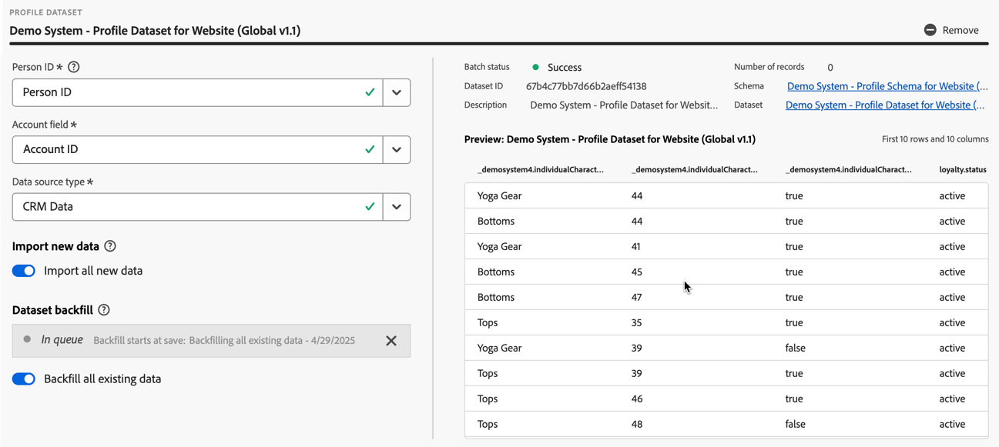

Per un set di dati profilo in una connessione basata su account, puoi specificare:

| Impostazione | Descrizione |
| --- | --- |
| **[!UICONTROL ID persona]** | Seleziona un ID persona dall’elenco a discesa delle identità disponibili. Queste identità sono state definite nello schema del set di dati in Experience Platform. Consulta [Utilizzare Identity Map come ID persona](#id-map) per informazioni su come utilizzare Identity Map come ID persona.<p>Se non è presente alcun ID persona tra cui scegliere, nello schema non viene definito alcun ID persona. Consulta [Definire i campi di identità nell’interfaccia utente](https://experienceleague.adobe.com/it/docs/experience-platform/xdm/ui/fields/identity) per ulteriori informazioni. <p>Il valore per l’ID persona selezionato è considerato sensibile a maiuscole e minuscole. Ad esempio: `abc123` e `ABC123` sono due valori diversi. <p>Se un record non contiene un valore per l’identità selezionata come ID persona per il set di dati profilo, il record viene ignorato. |
| **[!UICONTROL Campo account globale]** | Seleziona un campo account globale per supportare la generazione di rapporti basati su account per il set di dati dal menu a discesa delle identità disponibili. Applicabile quando hai aggiunto l’account globale come contenitore alla connessione. |
| **[!UICONTROL Campo account]** | Seleziona un campo account per supportare la generazione di rapporti basati su account per il set di dati dal menu a discesa delle identità disponibili. Applicabile quando non hai aggiunto l’account globale come contenitore alla connessione. |
| **[!UICONTROL Tipo di origine dati]** | Seleziona un tipo di origine dati. I tipi di origini dati includono: <ul><li>[!UICONTROL Dati web]</li><li>[!UICONTROL Dati da app mobili]</li><li>[!UICONTROL Dati POS]</li><li>[!UICONTROL Dati CRM]</li><li>[!UICONTROL Dati sondaggio]</li><li>[!UICONTROL Dati del call center]</li><li>[!UICONTROL Dati prodotto]</li><li> [!UICONTROL Dati degli account]</li><li> [!UICONTROL Dati transazione]</li><li>[!UICONTROL Dati di feedback cliente]</li><li> [!UICONTROL Altre]</li></ul>Questo campo viene utilizzato per esaminare i tipi di origini dati in uso. |
| **[!UICONTROL Descrizione dell’origine dati]** | Descrizione dell’origine dati dopo aver selezionato Altre come tipo di origine dati. |

#### Set di dati di ricerca

Le impostazioni specifiche per un set di dati ricerca dipendono dal tipo di connessione.

##### Connessione basata su persona

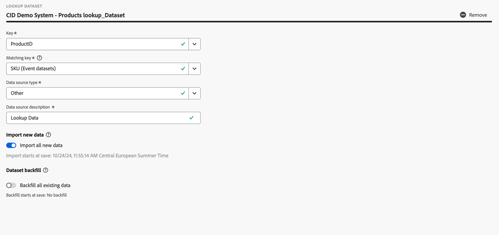

Per un set di dati di ricerca in una connessione basata su persona, puoi specificare:

| Impostazioni | Descrizione |
|---|---|
| **[!UICONTROL Chiave]** | Chiave da utilizzare per un set di dati di ricerca. <p>Se un record non contiene un valore per la chiave selezionata per il set di dati di ricerca, il record viene ignorato. |
| **[!UICONTROL Chiave corrispondente]** | Chiave corrispondente da unire a uno dei set di dati evento. Se questo elenco è vuoto, probabilmente non hai aggiunto o configurato un set di dati evento. |
| **[!UICONTROL Tipo di origine dati]** | Seleziona un tipo di origine dati. I tipi di origini dati includono: <ul><li>[!UICONTROL Dati web]</li><li>[!UICONTROL Dati da app mobili]</li><li>[!UICONTROL Dati POS]</li><li>[!UICONTROL Dati CRM]</li><li>[!UICONTROL Dati sondaggio]</li><li>[!UICONTROL Dati del call center]</li><li>[!UICONTROL Dati prodotto]</li><li> [!UICONTROL Dati degli account]</li><li> [!UICONTROL Dati transazione]</li><li>[!UICONTROL Dati di feedback cliente]</li><li> [!UICONTROL Altre]</li></ul>Questo campo viene utilizzato per esaminare i tipi di origini dati in uso. |
| **[!UICONTROL Descrizione dell’origine dati]** | Descrizione dell’origine dati dopo aver selezionato Altre come tipo di origine dati. |
| **[!UICONTROL Trasforma set di dati]** | Per set di dati di ricerca B2B specifici puoi abilitare la trasformazione di un set di dati per scenari di reporting B2B appropriati basati su persone. Per ulteriori informazioni, consulta [Trasformare i set di dati per le ricerche B2B](transform-datasets-b2b-lookups.md). |


##### Connessione basata su account

[!BADGE B2B Edition]{type=Informative url="https://experienceleague.adobe.com/it/docs/analytics-platform/using/cja-overview/cja-b2b/cja-b2b-edition" newtab=true tooltip="Customer Journey Analytics B2B Edition"}

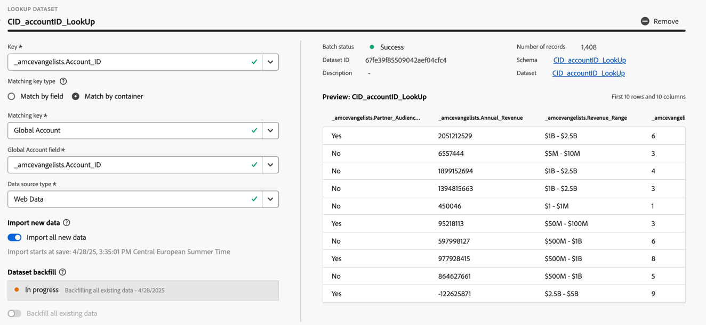

Per un set di dati di ricerca in una connessione basata su account, puoi specificare:

| Impostazioni | Descrizione |
|---|---|
| **[!UICONTROL Chiave]** | Chiave da utilizzare per un set di dati di ricerca. <p>Se un record non contiene un valore per la chiave selezionata per il set di dati di ricerca, il record viene ignorato. |
| **[!UICONTROL Tipo di chiave corrispondente]** | Seleziona la modalità di unione dei set di dati: in base a **[!UICONTROL Corrispondenza per campo]** o **[!UICONTROL Corrispondenza per contenitore]**. Per ulteriori informazioni, consulta [Corrispondenza per contenitore o per campo](/help/getting-started/cja-b2b-concepts-features.md#match-by-container-or-field). |
| **[!UICONTROL Chiave corrispondente]** | Chiave corrispondente da unire a uno dei set di dati evento. Se questo elenco è vuoto, probabilmente non hai ancora aggiunto o configurato un set di dati evento. <br/><br/>In base al tipo di **[!UICONTROL chiave corrispondente]** selezionato, utilizza il valore appropriato:<ul><li>**[!UICONTROL Corrispondenza per campo]**: 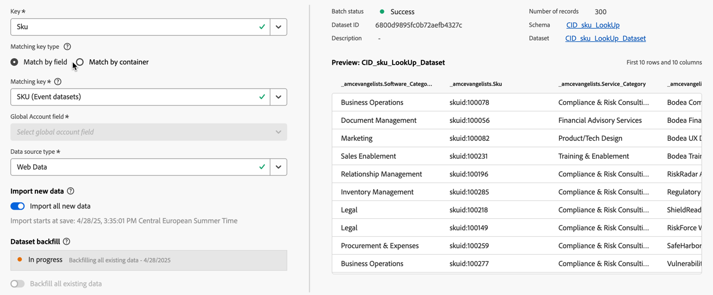<br/>Seleziona un campo dal menu a discesa **[!UICONTROL Chiave corrispondente]** per eseguire un&#39;unione con uno dei set di dati evento. Se questo elenco è vuoto, probabilmente non hai aggiunto o configurato un set di dati evento.</li><li>**[!UICONTROL Corrispondenza per contenitore]**: 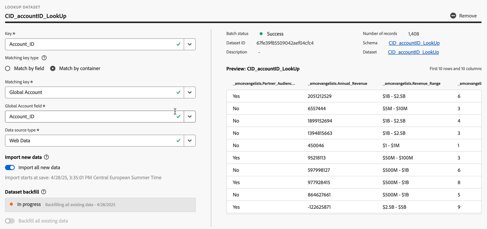<br/>Seleziona un contenitore dal menu a discesa **[!UICONTROL Chiave corrispondente]** per eseguire un&#39;unione con uno dei set di dati evento. I contenitori inclusi nella configurazione della connessione determinano quelli disponibili per la selezione.</li></ul> |
| **[!UICONTROL Campo account globale]** | ID account globale da utilizzare per la generazione di rapporti basati su account. |


#### Set di dati di riepilogo

Le impostazioni specifiche per un set di dati di riepilogo sono:

| Impostazione | Descrizione |
|---|---|
| **[!UICONTROL Marca temporale]** | Questa impostazione viene impostata automaticamente sul campo marca temporale predefinito dagli schemi basati su eventi in Experience Platform. |
| **[!UICONTROL Fuso orario]** | Seleziona il fuso orario appropriato per i dati di riepilogo delle serie temporali. |
| **[!UICONTROL Granularità]** | Rappresenta l’arco temporale utilizzato per aggregare i dati di riepilogo, attualmente in base all’ora o al giorno. Derivato dai dati presenti nel set di dati. |


#### Set di dati ad hoc

>[!NOTE]
>
>Sebbene la configurazione e la selezione siano consentite, è preferibile evitare l&#39;uso di set di dati ad hoc per i dati delle serie temporali (eventi, riepilogo) così da garantire prestazioni ottimali. I set di dati relazionali o generici basati su XDM sono molto più adatti per i dati di serie temporali rispetto ai set di dati ad hoc.

Le impostazioni specifiche per un set di dati ad hoc sono:

| Impostazione | Tipo di set di dati selezionato | Descrizione |
|---|---|---|
| **[!UICONTROL Tipo di set di dati]** | N/D | Il tipo di dati presenti nel set di dati ad hoc. I valori possibili sono: **[!UICONTROL Evento]**, **[!UICONTROL Profilo]**, **[!UICONTROL Ricerca]** e **[!UICONTROL Riepilogo]**. |
| **[!UICONTROL ID persona]** | Evento, Profilo | Seleziona un campo dallo schema ad hoc o relazionale che rappresenta l’ID persona. Questo campo può corrispondere a qualsiasi valore presente nel set di dati. Effettua la selezione da **[!UICONTROL Campi dello spazio dei nomi identità]** o da **[!UICONTROL Campi non identitari]**. <br/>Puoi selezionare un identificatore da **[!UICONTROL Spazio dei nomi identità]** solo se uno o più campi nello schema ad hoc sono etichettati come identità e dispongono di uno spazio dei nomi identità. |
| **[!UICONTROL Spazio dei nomi identità]** | Evento | Seleziona uno spazio dei nomi identità se hai selezionato un ID persona dai campi **[!UICONTROL non identitari]**. |
| **[!UICONTROL Marca temporale]** | Evento, Riepilogo | Seleziona un campo dallo schema ad hoc che rappresenta il campo Marca temporale. Questo campo può essere qualsiasi campo disponibile di tipo `DateTime`. |
| **[!UICONTROL Chiave]** | Ricerca | Chiave da utilizzare per un set di dati di ricerca.<br/>Se un record non contiene un valore per la chiave selezionata per il set di dati di ricerca, il record viene ignorato. |
| **[!UICONTROL Chiave corrispondente]** | Ricerca | Chiave corrispondente da unire a uno dei set di dati evento o ricerca. Se questo elenco è vuoto, probabilmente non hai aggiunto o configurato un set di dati evento o ricerca. |


#### Set di dati relazionale

>[!NOTE]
>
>I set di dati relazionali vengono utilizzati principalmente per supportare le prossime funzionalità di Experience Platform Data Mirror for Customer Journey Analytics.
>

Le impostazioni specifiche per un set di dati relazionale sono:

| Impostazione | Tipo di set di dati selezionato | Descrizione |
|---|---|---|
| **[!UICONTROL Tipo di set di dati]** | N/D | Il tipo di dati presenti nel set di dati relazionale.<br/>Se il set di dati contiene dati di serie temporali, i valori possibili sono: **[!UICONTROL Evento]** e **[!UICONTROL Riepilogo]**. <br/>Se il set di dati contiene dati record, i valori possibili sono: **[!UICONTROL Profilo]** e **[!UICONTROL Ricerca]**. |
| **[!UICONTROL ID persona]** | Evento, Profilo | Seleziona un campo dallo schema relazionale che rappresenta l’ID persona. La selezione è limitata all’elenco dei campi presenti nello schema relazionale contrassegnati come Identità e che hanno uno spazio dei nomi identità. |
| **[!UICONTROL Marca temporale]** | Evento, Riepilogo | Campo definito come descrittore della marca temporale nello schema. Questo campo viene compilato automaticamente. |
| **[!UICONTROL Chiave]** | Ricerca | Chiave da utilizzare per un set di dati di ricerca.<br/>Se un record non contiene un valore per la chiave selezionata per il set di dati di ricerca, il record viene ignorato. |
| **[!UICONTROL Chiave corrispondente]** | Ricerca | Chiave corrispondente da unire a uno dei set di dati evento. Se questo elenco è vuoto, probabilmente non hai aggiunto o configurato un set di dati evento o ricerca. |


#### Impostazioni e dettagli del set di dati generali

Ogni tipo di set di dati condivide le seguenti impostazioni comuni:

{{common-dataset-settings}}


### Riacquisizione dati

A volte è necessario riacquisire i dati da uno o più set di dati in una connessione. Per un set di dati ad hoc o relazionale devi [eliminare e quindi aggiungere nuovamente il set di dati](#edit-a-dataset). Per altri set di dati, puoi aggiornare le impostazioni. A tale scopo, effettua le seguenti operazioni:

1. Per il set di dati per il quale vuoi riacquisire i dati:

   1. Apporta una delle modifiche seguenti:

      * Identificatore (ID persona, ID account o altro ID) di un set di dati evento già acquisito.
      * Chiave, chiave corrispondente o tipo di chiave corrispondente (campo o contenitore) per un profilo o un set di dati di ricerca già acquisito.

      In alternativa, puoi attivare/disattivare **[!UICONTROL Retrocompila tutti i dati esistenti]** nel set di dati.

   1. **[!UICONTROL Applica]** le modifiche per il set di dati.


1. **[!UICONTROL Salva]** la connessione. I dati vengono riacquisiti per i set di dati specifici.


### Eliminare un set di dati

Quando procedi all&#39;eliminazione di un set di dati, riceverai un avviso che ne descrive le implicazioni. L’eliminazione di un set di dati può influenzare tutte le connessioni, le visualizzazioni dati e i progetti associati. Inoltre, se rimuovi un singolo set di dati evento o riepilogo da una connessione, ti verrà richiesto di aggiungerne uno nuovo. Puoi salvare solo una connessione che contiene almeno un evento o un set di dati di riepilogo.


### Retrocompilazioni precedenti

Quando selezioni  **[!UICONTROL Retrocompilazioni precedenti]** nell&#39;interfaccia, in una finestra di dialogo **[!UICONTROL Retrocompilazioni precedenti: _Nome del set di dati_]**vengono visualizzate le retrocompilazioni più recenti del set di dati.


## Anteprima della connessione {#preview}

Per un’anteprima della connessione creata, seleziona  **[!UICONTROL Anteprima della connessione]** nella finestra di dialogo delle impostazioni della connessione.

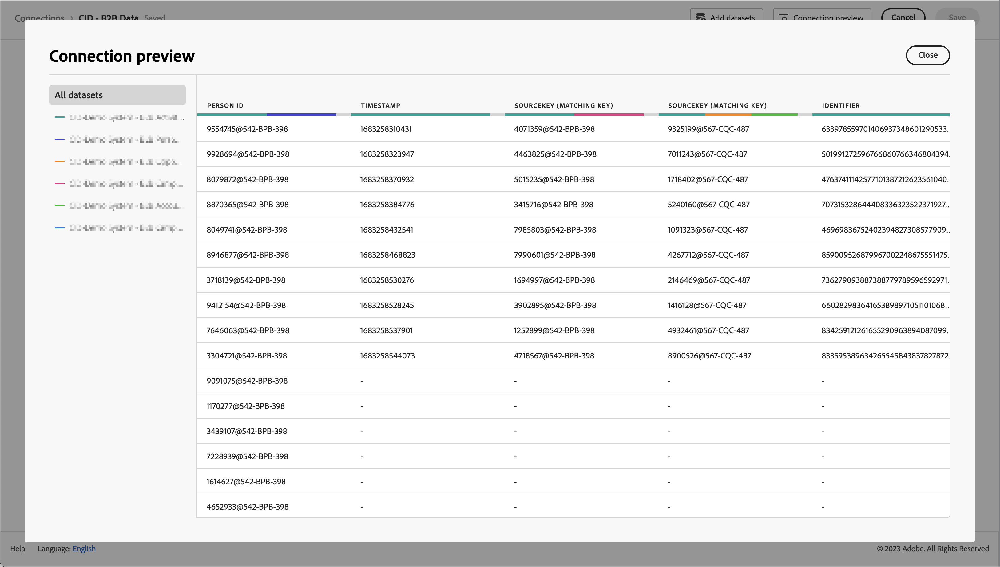

Questa anteprima contiene alcune colonne contenenti la configurazione della connessione. I tipi di colonna visualizzati dipendono dai singoli set di dati.


## Mappa della connessione

Per visualizzare una mappa delle relazioni tra i set di dati inclusi nella connessione, seleziona  **[!UICONTROL Mappa della connessione]** nella finestra di dialogo delle impostazioni della connessione.

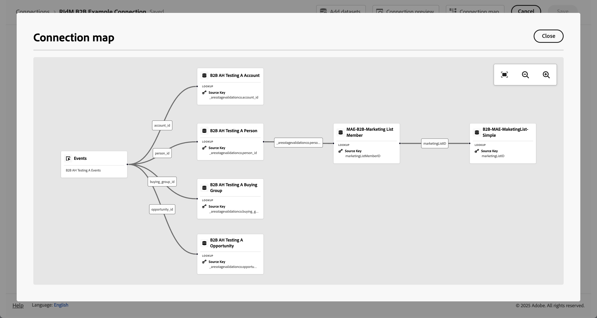

Con questa mappa puoi comprendere meglio come hai definito la connessione e configurato la relazione tra i set di dati evento, profilo, ricerca e riepilogo utilizzando i relativi identificatori e contenitori.


## Utilizzo di campi numerici come chiavi e valori di ricerca {#numeric}

Questa funzionalità è utile se desideri aggiungere un campo numerico come un costo o un margine a un campo chiave basato su stringhe. Consente ai valori numerici di far parte delle ricerche, sia come chiavi che come valori. Nello schema di ricerca, è possibile che i valori numerici siano associati, ad esempio, a nomi di prodotto, costi delle vendite, costi di marketing della campagna o margini. Ecco un esempio di schema di ricerca in Adobe Experience Platform:

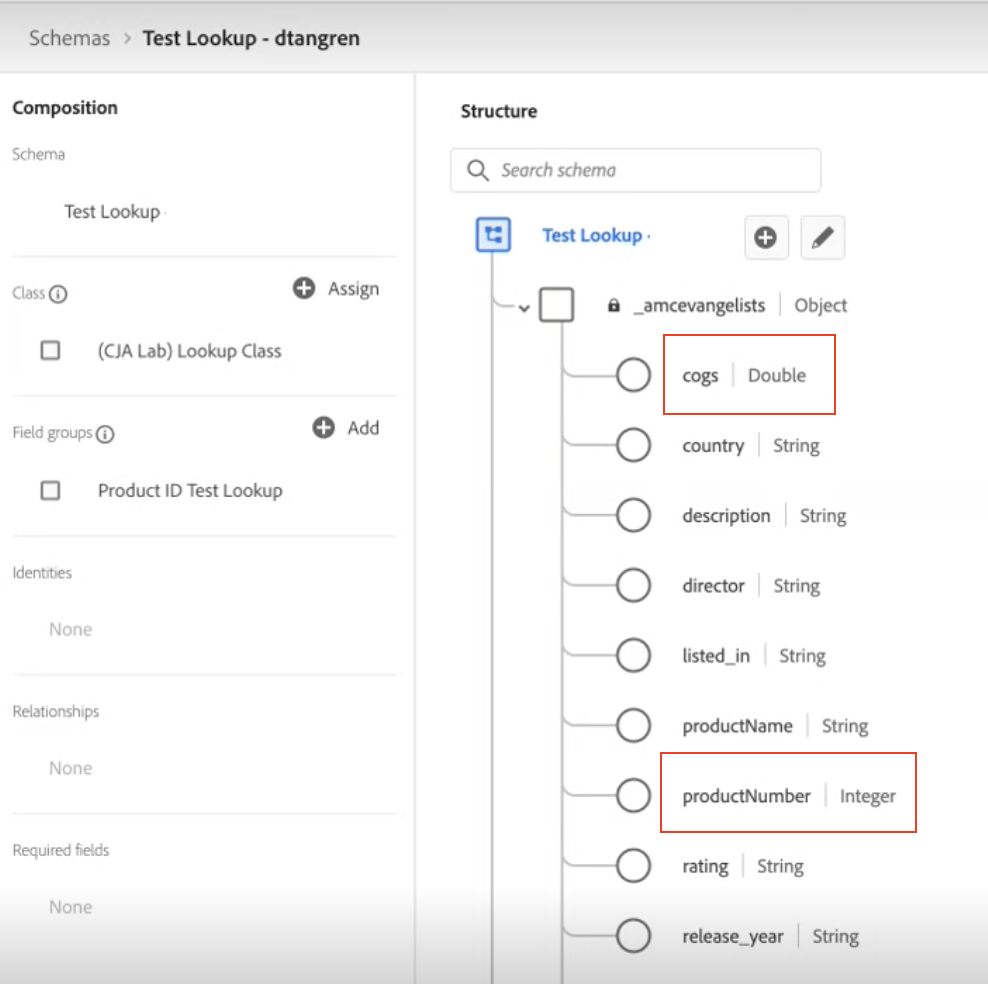

L’inserimento di questi valori come metriche o dimensioni nel reporting di Customer Journey Analytics è ora supportato. Quando configuri la connessione e richiami i set di dati di ricerca, puoi modificare i set di dati e selezionare [!UICONTROL Chiave] e [!UICONTROL Chiave corrispondente]:

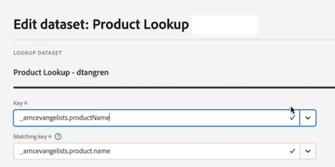

Quando configuri una visualizzazione dati basata su questa connessione, i valori numerici vengono aggiunti come componenti alla visualizzazione dati. Qualsiasi progetto basato su questa visualizzazione dati può quindi generare rapporti su questi valori numerici.

## Utilizzare Identity Map come ID persona {#id-map}

Customer Journey Analytics supporta la possibilità di utilizzare Identity Map per il proprio ID persona. Identity Map è una struttura di dati a mappa che ti consente di caricare coppie di valore chiave. Le chiavi sono spazi dei nomi delle identità e il valore è una struttura che contiene il valore dell’identità. Identity Map esiste su ogni riga/evento caricato e viene compilato di conseguenza per ogni riga.

Identity Map è disponibile per qualsiasi set di dati che utilizza uno schema basato sulla classe [ExperienceEvent XDM](https://experienceleague.adobe.com/it/docs/experience-platform/xdm/home). Quando selezioni un set di dati da includere in una connessione Customer Journey Analytics, puoi scegliere se avere un campo come ID principale o Identity Map:

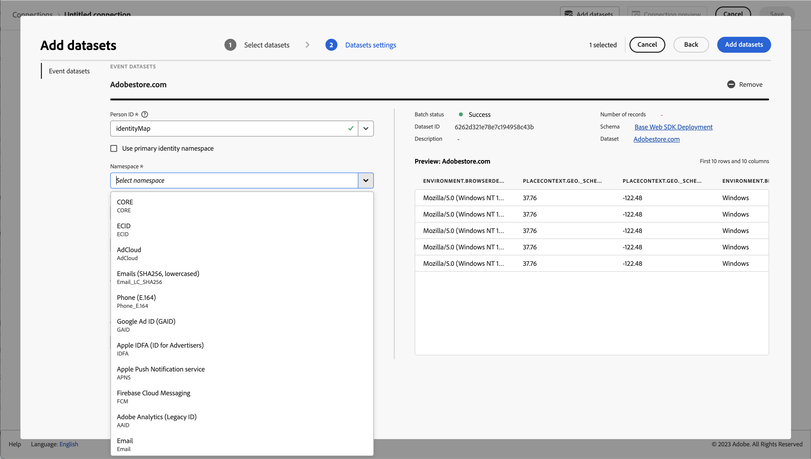

Se selezioni Identity Map, ottieni due opzioni di configurazione aggiuntive:

| Opzione | Descrizione |
|---|---|
| **[!UICONTROL Usa spazio dei nomi identità primaria]** | Questa opzione indica a Customer Journey Analytics come trovare l’identità nella Identity Map contrassegnata con un attributo `primary=true` e utilizzarla come ID persona per quella riga. L’identità è la chiave primaria utilizzata in Experience Platform per il partizionamento. E questa identità è anche il candidato principale per l’utilizzo come ID persona di Customer Journey Analytics (a seconda di come il set di dati è configurato in una connessione Customer Journey Analytics). |
| **[!UICONTROL Spazio dei nomi]** | Questa opzione è disponibile solo se non utilizzi lo spazio dei nomi identità primario. Gli spazi dei nomi delle identità sono un componente del [servizio Identity di Experience Platform](https://experienceleague.adobe.com/it/docs/experience-platform/identity/features/namespaces). Gli spazi dei nomi fungono da indicatori del contesto a cui si riferisce un’identità. Se specifichi uno spazio dei nomi, Customer Journey Analytics cercherà l’Identity Map di ogni riga per questa chiave dello spazio dei nomi e utilizzerà l’identità in tale spazio dei nomi come ID persona per tale riga. Poiché Customer Journey Analytics non è in grado di eseguire una scansione completa del set di dati di tutte le righe per determinare quali spazi dei nomi sono effettivamente presenti, nel menu a discesa vengono elencati tutti gli spazi dei nomi possibili. È necessario sapere quali spazi dei nomi sono specificati nei dati; questi spazi dei nomi non vengono rilevati automaticamente. |

{style="table-layout:auto"}

### Casi edge di Identity Map {#id-map-edge}

Questa tabella mostra le due opzioni di configurazione quando i casi edge sono presenti e come vengono gestiti:

| Opzione | Non ci sono ID presenti in Identity Map | Più ID, nessuno contrassegnato come primario | Più ID contrassegnati come primari | Singolo ID, contrassegnato come primario o meno | Spazio dei nomi non valido con un ID contrassegnato come primario |
|---|---|---|---|---|---|
| **[!UICONTROL Usa spazio dei nomi dell&#39;identità primaria] selezionato**<br/>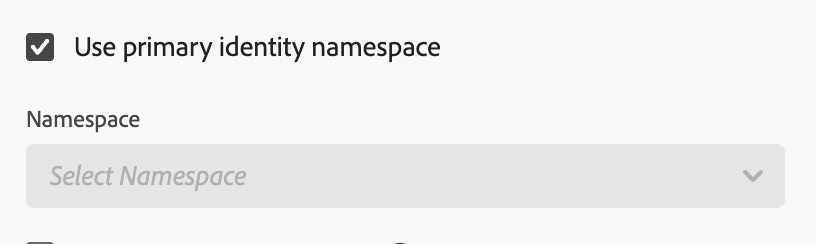 | Customer Journey Analytics rilascia la riga. | Customer Journey Analytics rilascia la riga, poiché non è specificato alcun ID primario. | Tutti gli ID contrassegnati come primari, sotto tutti gli spazi dei nomi, vengono estratti in un elenco. Sono quindi ordinati alfabeticamente. Con il nuovo ordinamento, il primo spazio dei nomi con il primo ID viene utilizzato come ID persona. | Il singolo ID viene utilizzato come ID persona. | Anche se lo spazio dei nomi può non essere valido (non presente in Adobe Experience Platform), Customer Journey Analytics utilizza l’ID primario nello spazio dei nomi come ID persona. |
| **[!UICONTROL Spazio dei nomi specifico di Identity Map] selezionato**<br/>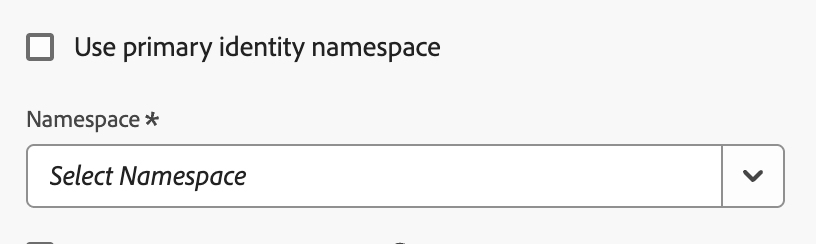 | Customer Journey Analytics rilascia la riga. | Tutti gli ID nello spazio dei nomi selezionato vengono estratti in un elenco e il primo viene utilizzato come ID persona. | Tutti gli ID nello spazio dei nomi selezionato vengono estratti in un elenco e il primo viene utilizzato come ID persona. | Tutti gli ID nello spazio dei nomi selezionato vengono estratti in un elenco e il primo viene utilizzato come ID persona. | Tutti gli ID nello spazio dei nomi selezionato vengono estratti in un elenco e il primo viene utilizzato come ID persona. (Al momento della creazione della connessione è possibile selezionare solo uno spazio dei nomi valido, pertanto non è possibile utilizzare uno spazio dei nomi/un ID non valido come ID persona). |

{style="table-layout:auto"}

## Calcolare il numero medio di eventi giornalieri {#average-number}

Questo calcolo viene eseguito per ogni set di dati della connessione.

1. Passa a [Query Service di Adobe Experience Platform](https://experienceleague.adobe.com/it/docs/experience-platform/query/home) e crea una query.

   La query si presenta così:

   ```
   Select AVG(A.total_events) from (Select DISTINCT COUNT (*) as total_events, date(TIMESTAMP) from analytics_demo_data GROUP BY 2 Having total_events>0) A;
   ```

   In questo esempio, “analytics_demo_data” è il nome del set di dati.

2. Per mostrare tutti i set di dati esistenti in Adobe Experience Platform, esegui la query `Show Tables`.


>[!MORELIKETHIS]
>
>* [Panoramica sull’acquisizione di dati](/help/data-ingestion/data-ingestion.md)
>* Blog: [Come sfruttare i set di dati di evento, ricerca e profilo in Adobe Customer Journey Analytics](https://experienceleaguecommunities.adobe.com/t5/adobe-analytics-blogs/how-to-leverage-event-lookup-and-profile-datasets-in-adobe/ba-p/681478)

