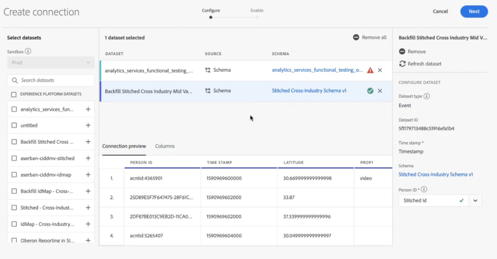

# Creare una connessione

Una connessione consente di integrare i set di dati da [!DNL Adobe Experience Platform] a [!UICONTROL Workspace]. Per creare rapporti sui set di dati [!DNL Experience Platform] bisogna prima stabilire una connessione tra i set di dati in [!DNL Experience Platform] e [!UICONTROL Workspace].

Fai clic [qui](https://experienceleague.adobe.com/docs/customer-journey-analytics-learn/tutorials/connecting-customer-journey-analytics-to-data-sources-in-platform.html?lang=en) per una panoramica video.

## Autorizzazioni necessarie

Per creare una connessione CJA, è necessario disporre delle seguenti autorizzazioni in [Adobe Admin Console](https://helpx.adobe.com/enterprise/admin-guide.html/enterprise/using/manage-permissions-and-roles.ug.html):

Adobe Experience Platform:
* Modellazione dati: Visualizza schemi, Gestisci schemi
* Gestione dati: Visualizzare i set di dati, gestire i set di dati
* Acquisizione dei dati: Gestisci origini

Customer Journey Analytics
* Accesso amministratore prodotto

>[!IMPORTANT]
>
>È possibile combinare più set di dati [!DNL Experience Platform] in una singola connessione.

## Seleziona sandbox e set di dati

1. Vai a [https://analytics.adobe.com](https://analytics.adobe.com) e accedi con il tuo Adobe ID.

1. Fai clic sull&#39;icona [!DNL Customer Journey Analytics] .

1. Fai clic sulla scheda **[!UICONTROL Connections]**.

1. Fai clic su **[!UICONTROL Create new connection]** in alto a destra.

   

1. Scegli una sandbox in Experience Platform che contiene i set di dati a cui desideri creare una connessione.

   Adobe Experience Platform fornisce [sandbox](https://experienceleague.adobe.com/docs/experience-platform/sandbox/home.html?lang=it) che suddivide una singola istanza di Platform in ambienti virtuali separati per aiutare a sviluppare e sviluppare applicazioni di esperienza digitale. Potete considerare le sandbox come &quot;silos di dati&quot; che contengono set di dati. Le sandbox vengono utilizzate per controllare l’accesso ai set di dati.  Dopo aver selezionato la sandbox, la barra a sinistra mostra tutti i set di dati nella sandbox da cui puoi eseguire il pull.

   >[!IMPORTANT]
   >
   >Non è possibile accedere ai dati tra sandbox diverse, ovvero è possibile combinare solo set di dati che si trovano all’interno della stessa sandbox.

1. Seleziona uno o più set di dati da richiamare in [!UICONTROL Customer Journey Analytics] e fai clic su **[!UICONTROL Add]**.

   Se hai molti set di dati tra cui scegliere, puoi cercare quelli giusti utilizzando la barra di ricerca **[!UICONTROL Search datasets]** sopra l’elenco dei set di dati.

## 2. Configurare il set di dati

Sul lato destro è ora possibile configurare i set di dati aggiunti.

1. **[!UICONTROL Dataset type]**: Per ogni set di dati aggiunto alla connessione, imposta  [!UICONTROL Customer Journey Analytics] automaticamente il tipo di set di dati in base ai dati in arrivo.

   Esistono 3 tipi diversi di set di dati: dati [!UICONTROL Event], dati [!UICONTROL Profile] e dati [!UICONTROL Lookup].

   | Tipo di set di dati | Descrizione | Timestamp | Schema | ID persona |
   |---|---|---|---|---|
   | [!UICONTROL Event] | Dati che rappresentano eventi nel tempo (ad esempio visite web, interazioni, transazioni, dati POS, dati dei sondaggi, dati ad impression, ecc.). Questi possono essere ad esempio tipici dati di click-stream, con un ID cliente o un ID cookie e un timestamp. Con i dati evento hai la flessibilità di scegliere quale ID usare come ID persona. | È impostato automaticamente sul campo timestamp predefinito dagli schemi basati sull&#39;evento in [!UICONTROL Experience Platform]. | Qualsiasi schema predefinito o personalizzato basato su una classe XDM con il comportamento “Serie temporali”. Alcuni esempi includono “XDM Experience Event” o “XDM Decision Event”. | Puoi scegliere l’ID persona da includere. Ogni schema di set di dati definito in Experience Platform può avere un proprio set di una o più identità definite e associate a uno spazio dei nomi identità. Ognuno di questi può essere utilizzato come ID persona. Alcuni esempi includono Cookie ID (ID cookie), Stitched ID (ID di unione), User ID (ID utente), Tracking Code (Codice di tracciamento), ecc. |
   | [!UICONTROL Lookup] | Questi dati vengono utilizzati per cercare i valori o le chiavi presenti nei dati evento o profilo. Ad esempio, puoi caricare dati ricerca che mappano ID numerici nei dati evento ai nomi dei prodotti. Per un esempio, consulta [questo caso d’uso](/help/use-cases/b2b.md) . | N/D | Qualsiasi schema predefinito o personalizzato basato su una classe XDM con comportamento “Record”, ad eccezione della classe “Profilo individuale XDM”. | N/D |
   | [!UICONTROL Profile] | Dati applicati a visitatori, utenti o clienti nei dati [!UICONTROL Event]. Ad esempio, consente di caricare dati di gestione delle relazioni con i clienti riguardanti i tuoi clienti. | N/D | Qualsiasi schema predefinito o personalizzato basato sulla classe “Profilo individuale XDM”. | Puoi scegliere l’ID persona da includere. Ogni set di dati definito in [!DNL Experience Platform] presenta un proprio set di uno o più ID persona definiti, ad esempio Cookie ID (ID cookie), Stitched ID (ID di unione), User ID (ID utente), Tracking Code (Codice di tracciamento) e così via. **Nota:** se crei una connessione che include set di dati con ID diversi, il reporting lo rifletterà. Per unire in modo efficace i set di dati è necessario utilizzare lo stesso ID persona. |

1. **[!UICONTROL Dataset ID]**: Questo ID viene generato automaticamente.

1. **[!UICONTROL Time stamp]**: Solo per i set di dati evento, questa impostazione viene impostata automaticamente sul campo timestamp predefinito dagli schemi basati su eventi in  [!UICONTROL Experience Platform].

1. **[!UICONTROL Schema]**: Si tratta dello   schema in cui è stato creato il set di dati in Adobe Experience Platform.

1. **[!UICONTROL Person ID]**: Seleziona un ID persona dall’elenco a discesa delle identità disponibili. Queste identità sono state definite nello schema del set di dati nell’Experience Platform. Vedi di seguito per informazioni su come utilizzare Identity Map come ID persona.

   >[!IMPORTANT]
   >
   >Se non è presente alcun ID persona tra cui scegliere, significa che uno o più ID persona non sono stati definiti nello schema. Guarda [questo video](https://youtu.be/G_ttmGl_LRU) su come definire un&#39;identità in Experience Platform.

1. Fare clic su **[!UICONTROL Next]** per passare alla finestra di dialogo [!UICONTROL Enable Connection].

### Utilizzare Identity Map come ID persona

Il Customer Journey Analytics ora supporta la possibilità di utilizzare la mappa identità per il proprio ID persona. Identity Map è una struttura di dati a mappa che consente a un utente di caricare coppie chiave -> valore. Le chiavi sono spazi dei nomi dell’identità e il valore è una struttura che contiene il valore dell’identità. La Identity Map esiste su ogni riga/evento caricato e viene compilata di conseguenza per ogni riga.

La Identity Map è disponibile per qualsiasi set di dati che utilizza uno schema basato sulla classe [ExperienceEvent XDM](https://experienceleague.adobe.com/docs/experience-platform/xdm/home.html?lang=it) . Quando selezioni un set di dati da includere in una connessione CJA, puoi selezionare un campo come ID principale o Identity Map:

Se selezioni Identity Map, ottieni due opzioni di configurazione aggiuntive:

| Opzione | Descrizione |
|---|---|
| [!UICONTROL Use Primary ID Namespace] | Questo indica a CJA, per riga, di trovare l’identità nella mappa identità contrassegnata con un attributo primary=true e utilizzarla come ID persona per quella riga. Questo significa che si tratta della chiave primaria che verrà utilizzata in Experience Platform per il partizionamento. È anche il candidato principale per l’utilizzo come ID visitatore di CJA (a seconda di come il set di dati è configurato in una connessione CJA). |
| [!UICONTROL Namespace] | (Questa opzione è disponibile solo se non si utilizza lo spazio dei nomi ID primario). Gli spazi dei nomi di identità sono un componente di [Adobe Experience Platform Identity Service](https://experienceleague.adobe.com/docs/experience-platform/identity/namespaces.html) che funge da indicatori del contesto a cui si riferisce un’identità. Se specifichi uno spazio dei nomi, CJA cercherà la mappa identità di ogni riga per questa chiave del namespace e utilizzerà l’identità in tale spazio dei nomi come ID persona per tale riga. Poiché CJA non è in grado di eseguire una scansione completa del set di dati di tutte le righe per determinare quali namespace sono effettivamente presenti, nel menu a discesa vengono elencati tutti i namespace possibili. È necessario sapere quali namespace sono specificati nei dati; non è possibile rilevare automaticamente questo valore. |

### Casi edge di Identity Map

Questa tabella mostra le due opzioni di configurazione quando i casi edge sono presenti e come vengono gestiti:

| Opzione | Nessun ID presente in Identity Map | Nessun ID contrassegnato come primario | Gli ID multipli sono contrassegnati come principali | L&#39;ID singolo è contrassegnato come primario | Spazio dei nomi non valido con un ID contrassegnato come primario |
|---|---|---|---|---|---|
| **Opzione &quot;Use Primary ID Namespace&quot; (Usa namespace ID primario) selezionata** | La riga viene rilasciata da CJA. | La riga viene rilasciata da CJA, in quanto non è specificato alcun ID primario. | Tutti gli ID contrassegnati come principali, sotto tutti i namespace, vengono estratti in un elenco. Sono quindi ordinati alfabeticamente; con questo nuovo ordinamento, il primo namespace con il primo ID viene utilizzato come ID persona. | Il singolo ID contrassegnato come primario viene utilizzato come ID persona. | Anche se lo spazio dei nomi può non essere valido (non presente in AEP), CJA utilizza l’ID principale nello spazio dei nomi come ID persona. |
| **Spazio dei nomi specifico della mappa identità selezionato** | La riga viene rilasciata da CJA. | Tutti gli ID nello spazio dei nomi selezionato vengono estratti in un elenco e il primo viene utilizzato come ID persona. | Tutti gli ID nello spazio dei nomi selezionato vengono estratti in un elenco e il primo viene utilizzato come ID persona. | Tutti gli ID nello spazio dei nomi selezionato vengono estratti in un elenco e il primo viene utilizzato come ID persona. | Tutti gli ID nello spazio dei nomi selezionato vengono estratti in un elenco e il primo viene utilizzato come ID persona. Al momento della creazione della connessione è possibile selezionare solo uno spazio dei nomi valido, pertanto non è possibile utilizzare uno spazio dei nomi/un ID non valido come ID persona. |

## Abilita connessione

1. Per abilitare una connessione, definisci queste impostazioni per l’intera connessione, ovvero tutti i set di dati della connessione:

   | Opzione | Descrizione |
   | --- | --- |
   | [!UICONTROL Name Connection] | Assegna alla connessione un nome descrittivo. Impossibile salvare la connessione senza un nome. |
   | [!UICONTROL Description] | Aggiungi ulteriori dettagli per distinguere questa connessione dalle altre. |
   | [!UICONTROL Datasets] | Set di dati inclusi in questa connessione. |
   | [!UICONTROL Automatically import all new datasets in this connection, beginning today.] | Seleziona questa opzione se desideri stabilire una connessione continua in modo che tutti i nuovi batch di dati aggiunti ai set di dati in questa connessione passino automaticamente in [!UICONTROL Workspace]. |
   | [!UICONTROL Import all existing data] | Quando selezioni questa opzione e salvi la connessione, tutti i dati esistenti (storici) da [!DNL Experience Platform] per tutti i set di dati in questa connessione verranno importati o precompilati. In futuro verranno importati automaticamente anche tutti i dati storici esistenti per eventuali nuovi set di dati aggiunti a questa connessione salvata. Vedi anche [Dati storici di backfill](https://experienceleague.adobe.com/docs/analytics-platform/using/cja-connections/create-connection.html#backfill-historical-data) di seguito. **Ricorda che una volta salvata la connessione questa impostazione non può essere modificata.** |
   | [!UICONTROL Average number of daily events] | È necessario specificare il numero medio di eventi giornalieri da importare (nuovi dati **e** backfill dati) per tutti i set di dati della connessione. Seleziona un’opzione dal menu a discesa. In questo modo l&#39;Adobe può allocare spazio sufficiente per questi dati. Se non si conosce il numero medio di eventi giornalieri che la società sta per importare, è possibile eseguire una semplice query SQL in  [Adobe Experience Platform Query ](https://experienceleague.adobe.com/docs/experience-platform/query/home.html?lang=it) Service per scoprire. Vedi &quot;Calcola il numero medio di eventi giornalieri&quot; di seguito. |

1. Fai clic su **[!UICONTROL Save and create data view]**. Per la documentazione, consulta [creare una visualizzazione dati](/help/data-views/create-dataview.md).

### Recupero dati storici

**[!UICONTROL Import all existing data]** consente di retrocompilare i dati della cronologia. Nota bene:

* È stata rimossa la limitazione della retrocompilazione (importazione di dati storici). In precedenza era possibile retrocompilare in autonomia un massimo di 2,5 miliardi di righe, e richiedere l’intervento degli ingegneri per superare questo limite. Ora è possibile retrocompilare i dati da solo, senza limitazioni.
* Diamo priorità ai nuovi dati aggiunti a un set di dati nella connessione, in modo che questi nuovi dati abbiano la latenza più bassa.
* Eventuali dati di backfill (storici) vengono importati a una velocità più bassa. La latenza dipende dalla quantità di dati storici disponibili, insieme all’impostazione **[!UICONTROL Average number of daily events]** selezionata. Ad esempio, se disponi di più di un miliardo di righe di dati al giorno, più 3 anni di dati storici, l’importazione potrebbe richiedere più settimane. D&#39;altra parte, se ci sono meno di un milione di righe al giorno e una settimana di dati storici, ci vorrebbe meno di un&#39;ora.
* Il backfill si applica all’intera connessione, non a ogni singolo set di dati.
* Il [Connettore sorgente Adobe Analytics](https://experienceleague.adobe.com/docs/platform-learn/tutorials/data-ingestion/ingest-data-from-adobe-analytics.html?lang=it) importa fino a 13 mesi di dati, indipendentemente dalle dimensioni.

### Calcolare il numero medio di eventi giornalieri

Questo calcolo deve essere fatto per ogni set di dati della connessione.

1. Vai a [Adobe Experience Platform Query Services](https://experienceleague.adobe.com/docs/experience-platform/query/home.html) e crea una nuova query.

1. La query avrà un aspetto simile al seguente: `Select AVG(A.total_events) from (Select DISTINCT COUNT (*) as total_events, date(TIMESTAMP) from analytics_demo_data GROUP BY 2 Having total_events>0) A;`

* In questo esempio, &quot;analytics_demo_data&quot; è il nome del set di dati.
* Esegui la query `Show Tables` per mostrare tutti i set di dati esistenti in AEP.
