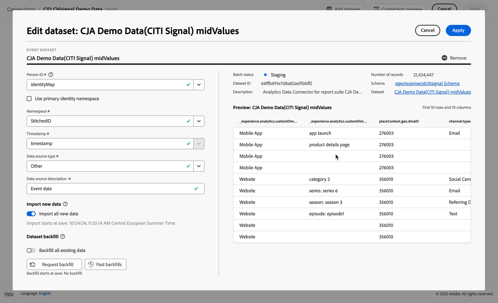
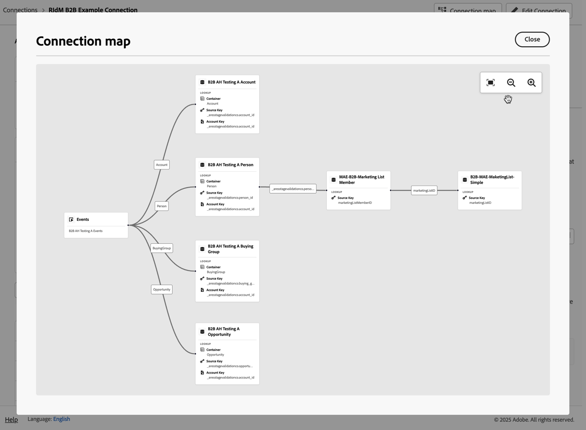

# Creare o modificare una connessione {#create-or-edit-a-connection}

<!-- markdownlint-disable MD034 -->

>[!CONTEXTUALHELP]
>id="cja_connections_recordsadded"
>title="Record aggiunti"
>abstract="Il numero di record (righe) aggiunti a una connessione durante l’intervallo di tempo selezionato per i set di dati selezionati."

<!-- markdownlint-enable MD034 -->

<!-- markdownlint-disable MD034 -->

>[!CONTEXTUALHELP]
>id="cja_connections_recordsskipped"
>title="Record ignorati"
>abstract="Il numero di record (righe) ignorati durante il trasferimento di dati per una connessione durante l’intervallo di tempo selezionato per i set di dati selezionati."

<!-- markdownlint-enable MD034 -->

<!-- markdownlint-disable MD034 -->

>[!CONTEXTUALHELP]
>id="cja_connections_recordsdeleted"
>title="Record eliminati"
>abstract="Il numero di record (righe) rimossi da una connessione durante l’intervallo di tempo selezionato per i set di dati selezionati."

<!-- markdownlint-enable MD034 -->

<!-- markdownlint-disable MD034 -->

>[!CONTEXTUALHELP]
>id="cja_connection_lastadded"
>title="Ultima aggiunta"
>abstract="La marca temporale dell’ultimo batch da qualsiasi set di dati trasferito a una connessione."

<!-- markdownlint-enable MD034 -->

<!-- markdownlint-disable MD034 -->

>[!CONTEXTUALHELP]
>id="cja_connection_enablerollingdatawindow"
>title="Abilita finestra di dati continua"
>abstract="Definisci la conservazione dei dati come finestra continua in mesi a livello di connessione."

<!-- markdownlint-enable MD034 -->

<!-- markdownlint-disable MD034 -->

>[!CONTEXTUALHELP]
>id="cja_connection_averagenumberofdailyuses"
>title="Numero medio di utilizzi giornalieri"
>abstract="Seleziona un intervallo per il numero di eventi giornalieri previsti per l’intera connessione."

<!-- markdownlint-enable MD034 -->

<!-- markdownlint-disable MD034 -->

>[!CONTEXTUALHELP]
>id="connections_recordsadded"
>title="Record aggiunti"
>abstract="Il numero di record (righe) aggiunti a una connessione durante l’intervallo di tempo selezionato per i set di dati selezionati."

<!-- markdownlint-enable MD034 -->

<!-- markdownlint-disable MD034 -->

>[!CONTEXTUALHELP]
>id="connections_recordsskipped"
>title="Record ignorati"
>abstract="Il numero di record (righe) ignorati durante il trasferimento di dati per una connessione durante l’intervallo di tempo selezionato per i set di dati selezionati."

<!-- markdownlint-enable MD034 -->

<!-- markdownlint-disable MD034 -->

>[!CONTEXTUALHELP]
>id="connections_recordsdeleted"
>title="Record eliminati"
>abstract="Il numero di record (righe) rimossi da una connessione durante l’intervallo di tempo selezionato per i set di dati selezionati."

<!-- markdownlint-enable MD034 -->

<!-- markdownlint-disable MD034 -->

>[!CONTEXTUALHELP]
>id="connection_lastadded"
>title="Ultima aggiunta"
>abstract="La marca temporale dell’ultimo batch da qualsiasi set di dati trasferito a una connessione."

<!-- markdownlint-enable MD034 -->

<!-- markdownlint-disable MD034 -->

>[!CONTEXTUALHELP]
>id="connection_enablerollingdatawindow"
>title="Abilita finestra di dati continua"
>abstract="Definisci la conservazione dei dati come finestra continua in mesi a livello di connessione."

<!-- markdownlint-enable MD034 -->

<!-- markdownlint-disable MD034 -->

>[!CONTEXTUALHELP]
>id="connection_averagenumberofdailyuses"
>title="Numero medio di utilizzi giornalieri"
>abstract="Seleziona un intervallo per il numero di eventi giornalieri previsti per l’intera connessione."


L’esperienza del flusso di lavoro di creazione e modifica delle connessioni porta tutte le impostazioni di configurazione del set di dati e della connessione al centro della schermata con un flusso di lavoro facilitato. Fornisce un’esperienza dettagliata di selezione, configurazione e revisione del set di dati. Consente inoltre di specificare informazioni critiche come tipo di set di dati [1&rbrace;, dimensioni, schema, ID set di dati, stato batch, stato backfill, identità e molto altro, per ridurre il rischio di configurazione errata della connessione. ](#dataset-types) Di seguito una panoramica delle nuove funzionalità:

* Quando si crea la connessione è possibile abilitare una finestra continua di conservazione dei dati.
* È possibile aggiungere e rimuovere i set di dati da una connessione. Quando si rimuove un set di dati, questo viene rimosso dalla connessione e influisce su tutte le visualizzazioni dati associate e sui progetti Analysis Workspace sottostanti.
* Puoi abilitare e richiedere dati di retrocompilazione per set di dati.
* Puoi modificare i set di dati, ad esempio per richiedere un’altra retrocompilazione.
* Puoi importare dati esistenti per set di dati.


>[!BEGINSHADEBOX]

Per un video demo, guarda  [Creare e modificare una connessione](https://video.tv.adobe.com/v/343044/?quality=12&learn=on){target="_blank"}.

>[!ENDSHADEBOX]


## Prerequisiti

Il numero massimo di set di dati che puoi aggiungere a una connessione è limitato a 100. Il mix dipende dal pacchetto di Customer Journey Analytics acquistato dalla tua azienda.

In caso di dubbi sul pacchetto di Customer Journey Analytics di cui disponi, contatta l’amministratore.

| Pacchetto **Select** | Pacchetto **Foundation** |
| --- | --- |
| Qualsiasi combinazione di set di dati evento, profilo, ricerca o riepilogo, fino a 100 | Un set di dati evento per connessione |
|  | Fino a 99 set di dati di profilo, di ricerca o di riepilogo per connessione |

{style="table-layout:auto"}

## Creare una connessione {#create-connection}

Per creare una connessione:

1. In Customer Journey Analytics, seleziona **[!UICONTROL Connections]**, facoltativamente da **[!UICONTROL Data management]**, nel menu principale.
1. Seleziona **[!UICONTROL Create new connection]**.

Ora puoi [modificare i dettagli della connessione](#edit-a-connection).

## Modificare una connessione {#edit-connection}

La modalità di modifica della connessione dipende dal pacchetto Customer Journey Analytics per il quale hai concesso la licenza:

* [Customer Journey Analytics](#customer-journey-analytics)
* [Customer Journey Analytics B2B edition](#customer-journey-analytics-b2b-edition)

### Customer Journey Analytics

Nella schermata **[!UICONTROL Connections]** > **[!UICONTROL *Nome della connessione *]**:


1. Configura le impostazioni della connessione.

   | Impostazione | Descrizione |
   | --- | --- |
   | **[!UICONTROL Connection name]** | Assegna un nome univoco alla connessione. |
   | **[!UICONTROL Connection description]** | Descrivi lo scopo della connessione. |
   | **[!UICONTROL Tags]** | Specifica i tag da aggiungere alla connessione in modo da poterli utilizzare per cercare la connessione in una fase successiva. |
   | **[!UICONTROL Enable rolling data window]** | La casella di controllo, se selezionata, consente di definire un’impostazione di conservazione dei dati di Customer Journey Analytics come finestra continua in mesi (1 mese, 3 mesi, 6 mesi, ecc.), a livello di connessione.<p>La conservazione dei dati si basa sulle marche temporali dei set di dati dell’evento e si applica solo ai set di dati dell’evento. Non esiste alcuna impostazione di finestra continua per i set di dati di profilo o di ricerca, in quanto non sono disponibili marche temporali applicabili. Tuttavia, se la connessione include un profilo o set di dati di ricerca (oltre a uno o più set di dati evento), tali dati verranno conservati per lo stesso periodo di tempo.<p> Il vantaggio principale consiste nell’archiviare o generare rapporti solo sui dati applicabili e utili, nonché nell’eliminare i dati meno recenti che non sono più utili. Ti aiuta a rispettare i limiti del tuo contratto e riduce il rischio di sovraccosti.<p><ul><li>Se lasci l’impostazione predefinita (non selezionata), il periodo di conservazione viene sostituito dall’impostazione di conservazione dei dati di Adobe Experience Platform. Se disponi di un valore di 25 mesi di dati in Experience Platform, Customer Journey Analytics può ottenere 25 mesi di dati tramite retrocompilazione. Se elimini 10 di questi mesi in Experience Platform, Customer Journey Analytics manterrà i restanti 15 mesi.</li><li>Se si abilita una finestra continua dei dati, specificare in **[!UICONTROL Select number of months]** il numero di mesi per i quali si abilita la finestra continua dei dati. |
   | **[!UICONTROL Sandbox]** | Scegli una sandbox in Experience Platform che contiene i set di dati per i quali desideri creare una connessione.<p>Adobe Experience Platform fornisce [sandbox](https://experienceleague.adobe.com/it/docs/experience-platform/sandbox/home) che permettono di suddividere una singola istanza Platform in ambienti virtuali separati, utili per le attività di sviluppo e aggiornamento delle applicazioni di esperienza digitale. Puoi considerare le sandbox come “silos di dati” che contengono set di dati. Le sandbox vengono utilizzate per controllare l’accesso ai set di dati.<p>Dopo aver selezionato la sandbox, la barra a sinistra mostra tutti i set di dati nella sandbox da cui puoi richiamarli. |
   | **[!UICONTROL Add datasets]** | Seleziona  **[!UICONTROL Add datasets]** per aggiungere set di dati. Se la connessione non ha ancora set di dati, è possibile selezionare **[!UICONTROL Add datasets]** nella tabella dei set di dati. |


   Per i set di dati configurati, la tabella dei set di dati mostra le colonne seguenti:

   | Colonna | Descrizione |
   |---|---|
   | **[!UICONTROL Dataset name]** | Seleziona uno o più set di dati da richiamare in Customer Journey Analytics e seleziona **[!UICONTROL Add]**.<p>Se sono presenti molti set di dati tra cui scegliere, puoi cercare quelli giusti utilizzando la barra di ricerca apposita sopra l’elenco dei set di dati. |
   |  | Seleziona  per aprire un menu di scelta rapida per il set di dati selezionato. In base al set di dati (tipo di), puoi selezionare:<ul><li>  **[!UICONTROL Delete dataset]** per [eliminare un set di dati](#delete-a-dataset).</li><li> **[!UICONTROL Edit dataset]** per [modificare un set di dati](#edit-a-dataset).</li><li> **[!UICONTROL Past backfills]** per visualizzare [backfill precedenti per il set di dati](#past-backfills). |
   | **[!UICONTROL Last updated]** | Solo per i set di dati evento, questa impostazione viene impostata automaticamente sul campo marca temporale predefinito dagli schemi basati su eventi in Experience Platform. “N/A” significa che il set di dati non contiene dati. |
   | **[!UICONTROL Number of records]** | Totale dei record del mese precedente per il set di dati in Experience Platform. |
   | **[!UICONTROL Schema]** | [Schema](https://experienceleague.adobe.com/it/docs/experience-platform/xdm/schema/composition) in base al quale è stato creato il set di dati in Adobe Experience Platform. |
   | **[!UICONTROL Dataset type]** | Per ogni set di dati aggiunto alla connessione, Customer Journey Analytics imposta automaticamente il tipo [di set di dati](#dataset-types) in base ai dati in arrivo. Esistono 3 tipi diversi di set di dati: dati evento, dati profilo e dati di ricerca. Nella tabella seguente puoi trovare una spiegazione dei tipi di set di dati. |
   | **[!UICONTROL Granularity]** | La granularità dei dati nel set di dati; applicabile solo per i set di dati di riepilogo. |
   | **[!UICONTROL Data source type]** | Il tipo di origine dati del set di dati. Non applicabile per i set di dati di riepilogo. |
   | **[!UICONTROL Person ID]** | L’ID persona utilizzato per supportare la generazione di rapporti basati su persone per il set di dati. |
   | **[!UICONTROL Key]** | Chiave utilizzata per un set di dati di ricerca. |
   | **[!UICONTROL Matching Key]** | Chiave corrispondente utilizzata per un set di dati di ricerca. |
   | **[!UICONTROL Import new data]** | Stato dell’importazione di nuovi dati per il set di dati: <p>   **[!UICONTROL _x _Attivo]**&#x200B;se il set di dati è configurato per l’importazione di nuovi dati e<p>   **[!UICONTROL _x Disattivato_]** se il set di dati è configurato per non importare nuovi dati. |
   | **[!UICONTROL Backfill data]** | Stato dei dati di retrocompilazione per il set di dati.<p>   **[!UICONTROL _x _retrocompilazioni non riuscite]**&#x200B;per il numero di retrocompilazioni non riuscite,<p>   **[!UICONTROL _x _retrocompilazioni in elaborazione]**&#x200B;per il numero di retrocompilazioni in elaborazione,<p>   **[!UICONTROL _x _retrocompilazioni completate]**&#x200B;per il numero di retrocompilazioni completate e<p>   **[!UICONTROL _Disattivato_]** se non è configurata alcuna retrocompilazione. |

   Puoi cercare un set di dati specifico utilizzando il campo .

### Customer Journey Analytics B2B edition

[!BADGE B2B edition]{type=Informative url="https://experienceleague.adobe.com/en/docs/analytics-platform/using/cja-overview/cja-b2b/cja-b2b-edition" newtab=true tooltip="Customer Journey Analytics B2B edition"}

Nella schermata **[!UICONTROL Connections]** > **[!UICONTROL *Nome della connessione *]**:


1. Configura le impostazioni della connessione.

   | Impostazione | Descrizione |
   | --- | --- |
   | **[!UICONTROL Connection name]** | Assegna un nome univoco alla connessione. |
   | **[!UICONTROL Connection description]** | Descrivi lo scopo della connessione. |
   | **[!UICONTROL Tags]** | Specifica i tag da aggiungere alla connessione in modo da poterli utilizzare per cercare la connessione in una fase successiva. |
   | **[!UICONTROL Primary ID]** | Seleziona l’ID primario corretto per la connessione: <ul><li> **[!UICONTROL Person]** per una connessione basata su persona in genere utilizzata in uno scenario B2C.</li><li>  di **[!UICONTROL Account]** per una connessione basata su account in genere utilizzata in uno scenario B2B.</li></ul>Non appena aggiungi uno o più set di dati alla connessione, non potrai più modificare l’ID primario. <br/>La selezione dell&#39;ID primario definisce se la connessione è basata su persona o su account. La base di connessione determina le [impostazioni](#dataset-settings) disponibili per alcuni tipi di set di dati. |
   | **[!UICONTROL Optional containers]** | Se hai selezionato  **[!UICONTROL Account]** come **[!UICONTROL Primary ID]**, seleziona altri contenitori.<ul><li>**[!UICONTROL Global account]**: abilita la configurazione degli account globali in una connessione.</li><li>**[!UICONTROL Opportunity]**: abilita la configurazione delle opportunità in una connessione.</li><li>**[!UICONTROL Buying group]**: abilita la configurazione dei gruppi di acquisto in una connessione.</li><ul> |
   | **[!UICONTROL Sandbox]** | Scegli una sandbox in Experience Platform che contiene i set di dati per i quali desideri creare una connessione.<p>Adobe Experience Platform fornisce [sandbox](https://experienceleague.adobe.com/it/docs/experience-platform/sandbox/home) che permettono di suddividere una singola istanza Platform in ambienti virtuali separati, utili per le attività di sviluppo e aggiornamento delle applicazioni di esperienza digitale. Puoi considerare le sandbox come “silos di dati” che contengono set di dati. Le sandbox vengono utilizzate per controllare l’accesso ai set di dati.<p>Dopo aver selezionato la sandbox, la barra a sinistra mostra tutti i set di dati nella sandbox da cui puoi richiamarli. |
   | **[!UICONTROL Enable rolling data window]** | La casella di controllo, se selezionata, consente di definire un’impostazione di conservazione dei dati di Customer Journey Analytics come finestra continua in mesi (1 mese, 3 mesi, 6 mesi, ecc.), a livello di connessione.<p>La conservazione dei dati si basa sulle marche temporali dei set di dati dell’evento e si applica solo ai set di dati dell’evento. Non esiste alcuna impostazione di finestra continua per i set di dati di profilo o di ricerca, in quanto non sono disponibili marche temporali applicabili. Tuttavia, se la connessione include un profilo o set di dati di ricerca (oltre a uno o più set di dati evento), tali dati verranno conservati per lo stesso periodo di tempo.<p> Il vantaggio principale consiste nell’archiviare o generare rapporti solo sui dati applicabili e utili, nonché nell’eliminare i dati meno recenti che non sono più utili. Ti aiuta a rispettare i limiti del tuo contratto e riduce il rischio di sovraccosti.<p><ul><li>Se lasci l’impostazione predefinita (non selezionata), il periodo di conservazione viene sostituito dall’impostazione di conservazione dei dati di Adobe Experience Platform. Se disponi di un valore di 25 mesi di dati in Experience Platform, Customer Journey Analytics può ottenere 25 mesi di dati tramite retrocompilazione. Eliminando10 di questi mesi in Platform, Customer Journey Analytics mantiene i restanti 15 mesi.</li><li>Se si abilita una finestra continua dei dati, specificare in **[!UICONTROL Select number of months]** il numero di mesi per i quali si abilita la finestra continua dei dati. |
   | **[!UICONTROL Add datasets]** | Selezionare  **[!UICONTROL Add datasets]** per [aggiungere set di dati](#add-datasets). Se la connessione non ha ancora set di dati, è possibile selezionare **[!UICONTROL Add datasets]** nella tabella dei set di dati. |


   Per i set di dati configurati, la tabella dei set di dati mostra le colonne seguenti:

   | Colonna | Descrizione |
   |---|---|
   | **[!UICONTROL Dataset name]** | Seleziona uno o più set di dati da richiamare in Customer Journey Analytics e seleziona **[!UICONTROL Add]**.<p>Se sono presenti molti set di dati tra cui scegliere, puoi cercare quelli giusti utilizzando la barra di ricerca apposita sopra l’elenco dei set di dati. |
   |  | Seleziona  per aprire un menu di scelta rapida per il set di dati selezionato. In base al set di dati (tipo di), puoi selezionare:<ul><li>  **[!UICONTROL Delete dataset]** per [eliminare un set di dati](#delete-a-dataset).</li><li> **[!UICONTROL Edit dataset]** per [modificare un set di dati](#edit-a-dataset).</li><li> **[!UICONTROL Past backfills]** per visualizzare [backfill precedenti per il set di dati](#past-backfills). |
   | **[!UICONTROL Last updated]** | Solo per i set di dati evento, questa impostazione viene impostata automaticamente sul campo marca temporale predefinito dagli schemi basati su eventi in Experience Platform. “N/A” significa che il set di dati non contiene dati. |
   | **[!UICONTROL Number of records]** | Totale dei record del mese precedente per il set di dati in Experience Platform. |
   | **[!UICONTROL Schema]** | [Schema](https://experienceleague.adobe.com/it/docs/experience-platform/xdm/schema/composition) in base al quale è stato creato il set di dati in Adobe Experience Platform. |
   | **[!UICONTROL Dataset type]** | Per ogni set di dati aggiunto alla connessione, Customer Journey Analytics imposta automaticamente il tipo [di set di dati](#dataset-types) in base ai dati in arrivo. Esistono 3 tipi diversi di set di dati: dati evento, dati profilo e dati di ricerca. Nella tabella seguente puoi trovare una spiegazione dei tipi di set di dati. |
   | **[!UICONTROL Granularity]** | La granularità dei dati nel set di dati; applicabile solo per i set di dati di riepilogo. |
   | **[!UICONTROL Data source type]** | Il tipo di origine dati del set di dati. Non applicabile per i set di dati di riepilogo. |
   | **[!UICONTROL Account ID]** | (visualizzato solo per le connessioni basate sull’account) L’ID account utilizzato per supportare la generazione di rapporti basati sull’account per il set di dati. |
   | **[!UICONTROL Global Account ID]** | (visualizzato solo per le connessioni basate sull’account) L’ID account globale utilizzato per supportare la generazione di rapporti basati sull’account per il set di dati. |
   | **[!UICONTROL Buying Group ID]** | (visualizzato solo per le connessioni basate su account) ID del gruppo di acquisto utilizzato per cercare i dati del gruppo di acquisto. |
   | **[!UICONTROL Opportunity ID]** | (visualizzato solo per le connessioni basate su account) L’ID opportunità utilizzato per cercare i dati dell’opportunità. |
   | **[!UICONTROL Person ID]** | L’ID persona utilizzato per supportare la generazione di rapporti basati su persone per il set di dati. |
   | **[!UICONTROL Key]** | Chiave utilizzata per un set di dati di ricerca. |
   | **[!UICONTROL Matching Key]** | Chiave corrispondente utilizzata per un set di dati di ricerca. |
   | **[!UICONTROL Import new data]** | Stato dell’importazione di nuovi dati per il set di dati: <p>   **[!UICONTROL _x _Attivo]**&#x200B;se il set di dati è configurato per l’importazione di nuovi dati e<p>   **[!UICONTROL _x Disattivato_]** se il set di dati è configurato per non importare nuovi dati. |
   | **[!UICONTROL Backfill data]** | Stato dei dati di retrocompilazione per il set di dati.<p>   **[!UICONTROL _x _retrocompilazioni non riuscite]**&#x200B;per il numero di retrocompilazioni non riuscite,<p>   **[!UICONTROL _x _retrocompilazioni in elaborazione]**&#x200B;per il numero di retrocompilazioni in elaborazione,<p>   **[!UICONTROL _x _retrocompilazioni completate]**&#x200B;per il numero di retrocompilazioni completate e<p>   **[!UICONTROL _Disattivato_]** se non è configurata alcuna retrocompilazione. |

   Puoi cercare un set di dati specifico utilizzando il campo .

## Set di dati {#datasets}

[aggiungere uno o più set di dati](#add-datasets) o [modificare i set di dati esistenti](#edit-a-dataset) come parte del flusso di lavoro della connessione.

<!-- markdownlint-disable MD034 -->

>[!CONTEXTUALHELP]
>id="cja_connection_primaryid"
>title="ID primario"
>abstract="Seleziona l’ID primario corretto per la connessione: Persona per uno scenario B2C. Account per uno scenario B2B."

<!-- markdownlint-enable MD034 -->

<!-- markdownlint-disable MD034 -->

>[!CONTEXTUALHELP]
>id="cja_connection_optionalcontainers"
>title="Contenitori opzionali"
>abstract="Seleziona contenitori aggiuntivi.<br/><br/>**[!UICONTROL Global account]**: abilita la configurazione degli account globali in una connessione.<br/>**[!UICONTROL Opportunity]**: abilita la configurazione delle opportunità in una connessione.<br/>**[!UICONTROL Buying group]**: abilita la configurazione dei gruppi di acquisto in una connessione."

<!-- markdownlint-enable MD034 -->

<!-- markdownlint-disable MD034 -->

>[!CONTEXTUALHELP]
>id="cja_connection_personid"
>title="ID persona"
>abstract="Seleziona un ID persona tra le identità disponibili definite negli schemi di set di dati in Experience Platform."

<!-- markdownlint-enable MD034 -->

<!-- markdownlint-disable MD034 -->

>[!CONTEXTUALHELP]
>id="cja_connection_accountid"
>title="ID account"
>abstract="Seleziona un ID account (identificatore univoco di un account) dalle identità disponibili definite nello schema del set di dati in Experience Platform."

<!-- markdownlint-enable MD034 -->

<!-- markdownlint-disable MD034 -->

>[!CONTEXTUALHELP]
>id="cja_connection_accountfield"
>title="Campo account"
>abstract="Seleziona un campo che rappresenta l’ID account (l’identificatore univoco di un account)."

<!-- markdownlint-enable MD034 -->


<!-- markdownlint-disable MD034 -->

>[!CONTEXTUALHELP]
>id="cja_connection_globalaccountid"
>title="ID account globale"
>abstract="Seleziona un ID account globale (l’identificatore univoco di un account globale) tra le identità disponibili definite nello schema del set di dati in Experience Platform."

<!-- markdownlint-enable MD034 -->

<!-- markdownlint-disable MD034 -->

>[!CONTEXTUALHELP]
>id="cja_connection_opportunityid"
>title="ID opportunità"
>abstract="Seleziona un ID opportunità (l’identificatore univoco di un’opportunità) tra le identità disponibili definite nello schema del set di dati in Experience Platform."

<!-- markdownlint-enable MD034 -->

<!-- markdownlint-disable MD034 -->

>[!CONTEXTUALHELP]
>id="cja_connection_buyinggroupid"
>title="ID gruppo di acquisto"
>abstract="Seleziona un ID gruppo di acquisto (l’identificatore univoco per un gruppo di acquisto) tra le identità disponibili definite nello schema del set di dati in Experience Platform."

<!-- markdownlint-enable MD034 -->

<!-- markdownlint-disable MD034 -->

>[!CONTEXTUALHELP]
>id="cja_connection_matchingkey"
>title="Tipo di chiave corrispondente"
>abstract="Seleziona la modalità di unione: in base a una corrispondenza per campo o a una corrispondenza per contenitore.<br/><br/>**[!UICONTROL Match by field]**: seleziona un campo da unire in uno dei set di dati dell’evento. Se questo elenco è vuoto, probabilmente non hai aggiunto o configurato un set di dati evento.<br/>**[!UICONTROL Match by container]**: selezionare un contenitore da utilizzare per l&#39;unione con uno dei set di dati evento."

<!-- markdownlint-enable MD034 -->

<!-- markdownlint-disable MD034 -->

>[!CONTEXTUALHELP]
>id="cja_connection_importnewdata"
>title="Importa nuovi dati"
>abstract="Eventuali nuovi batch aggiunti al set di dati di Experience Platform vengono aggiunti automaticamente a questa connessione e resi disponibili per l’analisi."

<!-- markdownlint-enable MD034 -->

<!-- markdownlint-disable MD034 -->

>[!CONTEXTUALHELP]
>id="cja_connection_datasetbackfill"
>title="Retrocompilazione dei set di dati"
>abstract="Questa opzione esegue il backfill dei dati esistenti (storici) da Experience Platform per questo set di dati nella connessione."

<!-- markdownlint-enable MD034 -->

<!-- markdownlint-disable MD034 -->

>[!CONTEXTUALHELP]
>id="cja_connection_transformdataset"
>title="Trasforma set di dati"
>abstract="Questa opzione trasforma il set di dati in modo che possa essere utilizzato per ricerche basate su persone in scenari B2B. Una volta attivata questa opzione, la trasformazione del set di dati è irreversibile."

<!-- markdownlint-enable MD034 -->

<!-- markdownlint-disable MD034 -->

>[!CONTEXTUALHELP]
>id="cja_connection_connectionmap"
>title="Mappa di connessione"
>abstract="La Mappa di connessione visualizza le relazioni tra evento, persona, account e set di dati di ricerca rilevanti (come opportunità, membri della campagna e altro)."

<!-- markdownlint-enable MD034 -->

<!-- markdownlint-disable MD034 -->

>[!CONTEXTUALHELP]
>id="connection_primaryid"
>title="ID primario"
>abstract="Seleziona l’ID primario corretto per la connessione: Persona per uno scenario B2C. Account per uno scenario B2B."

<!-- markdownlint-enable MD034 -->

<!-- markdownlint-disable MD034 -->

>[!CONTEXTUALHELP]
>id="connection_optionalcontainers"
>title="Contenitori opzionali"
>abstract="Seleziona contenitori aggiuntivi.<br/><br/>**[!UICONTROL Global account]**: abilita la configurazione degli account globali in una connessione.<br/>**[!UICONTROL Opportunity]**: abilita la configurazione delle opportunità in una connessione.<br/>**[!UICONTROL Buying group]**: abilita la configurazione dei gruppi di acquisto in una connessione."

<!-- markdownlint-enable MD034 -->

<!-- markdownlint-disable MD034 -->

>[!CONTEXTUALHELP]
>id="connection_personid"
>title="ID persona"
>abstract="Seleziona un ID persona tra le identità disponibili definite negli schemi di set di dati in Experience Platform."

<!-- markdownlint-enable MD034 -->

<!-- markdownlint-disable MD034 -->

>[!CONTEXTUALHELP]
>id="connection_accountid"
>title="ID account"
>abstract="Seleziona un ID account (identificatore univoco di un account) dalle identità disponibili definite nello schema del set di dati in Experience Platform."

<!-- markdownlint-enable MD034 -->

>[!CONTEXTUALHELP]
>id="connection_accountfield"
>title="Campo account"
>abstract="Seleziona un campo che rappresenta l’ID account (l’identificatore univoco di un account)."

<!-- markdownlint-enable MD034 -->

<!-- markdownlint-disable MD034 -->

>[!CONTEXTUALHELP]
>id="connection_globalaccountid"
>title="ID account globale"
>abstract="Seleziona un ID account globale (l’identificatore univoco di un account globale) tra le identità disponibili definite nello schema del set di dati in Experience Platform."

<!-- markdownlint-enable MD034 -->

<!-- markdownlint-disable MD034 -->

>[!CONTEXTUALHELP]
>id="connection_opportunityid"
>title="ID opportunità"
>abstract="Seleziona un ID opportunità (l’identificatore univoco di un’opportunità) tra le identità disponibili definite nello schema del set di dati in Experience Platform."

<!-- markdownlint-enable MD034 -->

<!-- markdownlint-disable MD034 -->

>[!CONTEXTUALHELP]
>id="connection_buyinggroupid"
>title="ID gruppo di acquisto"
>abstract="Seleziona un ID gruppo di acquisto (l’identificatore univoco per un gruppo di acquisto) tra le identità disponibili definite nello schema del set di dati in Experience Platform."

<!-- markdownlint-enable MD034 -->

<!-- markdownlint-disable MD034 -->

>[!CONTEXTUALHELP]
>id="connection_matchingkey"
>title="Tipo di chiave corrispondente"
>abstract="Seleziona la modalità di unione: in base a una corrispondenza per campo o a una corrispondenza per contenitore.<br/><br/>**[!UICONTROL Match by field]**: seleziona un campo da unire in uno dei set di dati dell’evento. Se questo elenco è vuoto, probabilmente non hai aggiunto o configurato un set di dati evento.<br/>**[!UICONTROL Match by container]**: selezionare un contenitore da utilizzare per l&#39;unione con uno dei set di dati evento."

<!-- markdownlint-enable MD034 -->

<!-- markdownlint-disable MD034 -->

>[!CONTEXTUALHELP]
>id="connection_importnewdata"
>title="Importa nuovi dati"
>abstract="Eventuali nuovi batch aggiunti al set di dati di Experience Platform vengono aggiunti automaticamente a questa connessione e resi disponibili per l’analisi."

<!-- markdownlint-enable MD034 -->

<!-- markdownlint-disable MD034 -->

>[!CONTEXTUALHELP]
>id="connection_datasetbackfill"
>title="Retrocompilazione dei set di dati"
>abstract="Questa opzione esegue il backfill dei dati esistenti (storici) da Experience Platform per questo set di dati nella connessione."

<!-- markdownlint-enable MD034 -->

<!-- markdownlint-disable MD034 -->

>[!CONTEXTUALHELP]
>id="connection_transformdataset"
>title="Trasforma set di dati"
>abstract="Questa opzione trasforma il set di dati in modo che possa essere utilizzato per ricerche basate su persone in scenari B2B. Una volta attivata questa opzione, la trasformazione del set di dati è irreversibile."

<!-- markdownlint-enable MD034 -->

<!-- markdownlint-disable MD034 -->

>[!CONTEXTUALHELP]
>id="connection_connectionmap"
>title="Mappa di connessione"
>abstract="La Mappa di connessione visualizza le relazioni tra evento, persona, account e set di dati di ricerca rilevanti (come opportunità, membri della campagna e altro)."

### Aggiungere set di dati

Puoi aggiungere uno o più set di dati di Experience Platform quando crei o modifichi una connessione.


1. In **[!UICONTROL Connection]** > **[!UICONTROL _Nome dell&#39;interfaccia di connessione_]**, selezionare  **[!UICONTROL Add datasets]**.

1. Nel passaggio **[!UICONTROL Select datasets]** viene visualizzato un elenco dei set di dati di Experience Platform.

   

   Per ogni set di dati, l’elenco mostra:

   | Colonna | Descrizione |
   |---|---|
   | **[!UICONTROL Dataset]** | Nome del se di dati. Seleziona il nome per indirizzarti al set di dati in Experience Platform. Seleziona  per visualizzare un pop-up con ulteriori dettagli per il set di dati. Puoi selezionare **[!UICONTROL Edit in Platform]** per modificare il set di dati direttamente in Experience Platform. |
   | **[!UICONTROL Dataset type]** | Tipo di set di dati: evento, profilo, ricerca e riepilogo. |
   | **[!UICONTROL Number of records]** | Totale dei record del mese precedente per il set di dati in Experience Platform. |
   | **[!UICONTROL Schema]** | Lo schema per il set di dati. Seleziona il nome per indirizzarti allo schema in Experience Platform. |
   | **[!UICONTROL Last batch]** | Stato dell’ultimo batch acquisito in Experience Platform. Per ulteriori informazioni, consulta [Stati batch](https://experienceleague.adobe.com/it/docs/experience-platform/ingestion/batch/troubleshooting#batch-states). |
   | **[!UICONTROL Dataset ID]** | ID del set di dati. |
   | **[!UICONTROL Last updated]** | Marca temporale dell’ultimo aggiornamento del set di dati. |

   * Per modificare le colonne visualizzate per l’elenco dei set di dati, seleziona  e seleziona le colonne da visualizzare nella finestra di dialogo [!UICONTROL Customize table].
   * Per cercare un set di dati specifico, utilizza il campo di ricerca .
   * Per scegliere tra visualizzare o nascondere i set di dati selezionati, utilizza  **[!UICONTROL Hide selected]** o **[!UICONTROL Show selected]**.
   * Per rimuovere un set di dati dall’elenco dei set di dati selezionati, utilizza . Per rimuovere tutti i set di dati selezionati, seleziona **[!UICONTROL Clear all]**.
   * Per visualizzare i dettagli di un set di dati, selezionare .


1. Seleziona uno o più set di dati e seleziona **[!UICONTROL Next]**. Almeno un evento o un set di dati di riepilogo deve far parte della connessione.

1. Configura le impostazioni [ per ciascuno dei set di dati selezionati](#dataset-settings), uno alla volta, nel passaggio **[!UICONTROL Datasets settings]** di tipo della finestra di dialogo **[!UICONTROL Add datasets]**.

   

1. Selezionare **[!UICONTROL Add datasets]** per aggiungere i set di dati configurati alla connessione. Viene inviata una notifica quando non sono state fornite tutte le impostazioni richieste per ciascuno dei set di dati che si desidera aggiungere.

   In alternativa, è possibile selezionare **[!UICONTROL Cancel]** per annullare l&#39;aggiunta di set di dati alla connessione. Oppure seleziona **[!UICONTROL Back]** per tornare al passaggio **[!UICONTROL Select datasets]**.


### Modificare un set di dati

Per modificare un set di dati già configurato per una connessione, nell&#39;interfaccia **[!UICONTROL Connections]** > **[!UICONTROL _Nome della connessione_]**:

1. Seleziona  per il set di dati elencato nella tabella del set di dati da modificare
1. Selezionare  **[!UICONTROL Edit dataset]**.

1. Configura le impostazioni del [set di dati](#dataset-settings) nella finestra di dialogo **[!UICONTROL Edit dataset: _Nome set di dati_]**.

   

1. Selezionare **[!UICONTROL Apply]** per applicare le impostazioni del set di dati. Seleziona **[!UICONTROL Cancel]** per annullare.


### Impostazioni del set di dati

Quando aggiungi set di dati o ne modifichi uno esistente, configura le impostazioni per ogni set di dati. Le impostazioni disponibili dipendono dal [tipo di set di dati](#dataset-types) e, per alcuni tipi di set di dati, dal tipo di connessione (basata su persona o [!BADGE basata su account B2B edition]{type=Informative url="https://experienceleague.adobe.com/en/docs/analytics-platform/using/cja-overview/cja-b2b/cja-b2b-edition" newtab=true tooltip="Customer Journey Analytics B2B edition"}.).

Tutti i set di dati e i tipi di set di dati hanno [impostazioni generali e dettagli](#general-dataset-settings-and-details), ad esempio se importare nuovi dati e richiedere i backfill.

#### Set di dati evento

Le impostazioni specifiche per un set di dati evento dipendono dal tipo di connessione.

##### Connessione basata su persona


Per un set di dati evento in una connessione basata su persona, puoi specificare:

| Impostazione | Descrizione |
| --- | --- |
| **[!UICONTROL Person ID]** | Seleziona un ID persona dal menu a discesa delle identità disponibili. Queste identità sono state definite nello schema del set di dati in Experience Platform. Consulta [Utilizzare Identity Map come ID persona](#id-map) per informazioni su come utilizzare Identity Map come ID persona.<p>Se non è presente alcun ID persona tra cui scegliere, significa che nello schema non sono definiti ID persona. Consulta [Definire i campi di identità nell’interfaccia utente](https://experienceleague.adobe.com/it/docs/experience-platform/xdm/ui/fields/identity) per ulteriori informazioni. <p>Il valore per l’ID persona selezionato è considerato sensibile a maiuscole e minuscole. Ad esempio: `abc123` e `ABC123` sono due valori diversi. |
| **[!UICONTROL Timestamp]** | Questa impostazione viene impostata automaticamente sul campo marca temporale predefinito dagli schemi basati sull’evento in Experience Platform. |
| **[!UICONTROL Data source type]** | Seleziona un tipo di origine dati. I tipi di origini dati includono: <ul><li>[!UICONTROL Web data]</li><li>[!UICONTROL Mobile App data]</li><li>[!UICONTROL POS data]</li><li>[!UICONTROL CRM data]</li><li>[!UICONTROL Survey data]</li><li>[!UICONTROL Call Center data]</li><li>[!UICONTROL Product data]</li><li> [!UICONTROL Accounts data]</li><li> [!UICONTROL Transaction data]</li><li>[!UICONTROL Customer Feedback data]</li><li> [!UICONTROL Other]</li></ul>Questo campo viene utilizzato per esaminare i tipi di origini dati in uso. |
| **[!UICONTROL Data source description]** | Descrizione dell&#39;origine dati dopo aver selezionato Altro come tipo di origine dati. |


##### Connessione basata su account

[!BADGE B2B edition]{type=Informative url="https://experienceleague.adobe.com/en/docs/analytics-platform/using/cja-overview/cja-b2b/cja-b2b-edition" newtab=true tooltip="Customer Journey Analytics B2B edition"}

Per un set di dati evento in una connessione basata su account, puoi specificare:


| Impostazione | Descrizione |
| --- | --- |
| **[!UICONTROL Account ID]** | Seleziona un ID account globale (l’identificatore univoco di un account) dalle identità disponibili definite nello schema del set di dati in Experience Platform. Applicabile quando hai aggiunto l’account globale come contenitore alla connessione. |
| **[!UICONTROL Global Account ID]** | Seleziona un ID account (l’identificatore univoco di un account) dalle identità disponibili definite nello schema del set di dati in Experience Platform. Applicabile quando non hai aggiunto l’account globale come contenitore alla connessione. |
| **[!UICONTROL Opportunity ID]** | Seleziona un ID opportunità (l’identificatore univoco di un’opportunità) tra le identità disponibili definite nello schema del set di dati in Experience Platform. |
| **[!UICONTROL Buying Group ID]** | Seleziona un ID gruppo di acquisto (l’identificatore univoco per un gruppo di acquisto) tra le identità disponibili definite nello schema del set di dati in Experience Platform. |
| **[!UICONTROL Person ID]** | Seleziona un ID persona dal menu a discesa delle identità disponibili. Queste identità sono state definite nello schema del set di dati in Experience Platform. Consulta [Utilizzare Identity Map come ID persona](#id-map) per informazioni su come utilizzare Identity Map come ID persona.<p>Se non è presente alcun ID persona tra cui scegliere, significa che uno o più ID persona non sono stati definiti nello schema. Consulta [Definire i campi di identità nell’interfaccia utente](https://experienceleague.adobe.com/it/docs/experience-platform/xdm/ui/fields/identity) per ulteriori informazioni. <p>Il valore per l’ID persona selezionato è considerato sensibile a maiuscole e minuscole. Ad esempio: `abc123` e `ABC123` sono due valori diversi. |
| **[!UICONTROL Timestamp]** | Questa impostazione viene impostata automaticamente sul campo marca temporale predefinito dagli schemi basati sull’evento in Experience Platform. |
| **[!UICONTROL Data source type]** | Seleziona un tipo di origine dati. I tipi di origini dati includono: <ul><li>[!UICONTROL Web data]</li><li>[!UICONTROL Mobile App data]</li><li>[!UICONTROL POS data]</li><li>[!UICONTROL CRM data]</li><li>[!UICONTROL Survey data]</li><li>[!UICONTROL Call Center data]</li><li>[!UICONTROL Product data]</li><li> [!UICONTROL Accounts data]</li><li> [!UICONTROL Transaction data]</li><li>[!UICONTROL Customer Feedback data]</li><li> [!UICONTROL Other]</li></ul>Questo campo viene utilizzato per esaminare i tipi di origini dati in uso. |
| **[!UICONTROL Data source description]** | Descrizione dell&#39;origine dati dopo aver selezionato Altro come tipo di origine dati. |

#### Set di dati di profilo

Le impostazioni specifiche per un set di dati di profilo dipendono dal tipo di connessione.

##### Connessione basata su persona


Per un set di dati profilo in una connessione basata su persona, specifica:

| Impostazione | Descrizione |
| --- | --- |
| **[!UICONTROL Person ID]** | Seleziona un ID persona dal menu a discesa delle identità disponibili. Queste identità sono state definite nello schema del set di dati in Experience Platform. Consulta [Utilizzare Identity Map come ID persona](#id-map) per informazioni su come utilizzare Identity Map come ID persona.<p>Se non è presente alcun ID persona tra cui scegliere, nello schema non viene definito alcun ID persona. Consulta [Definire i campi di identità nell’interfaccia utente](https://experienceleague.adobe.com/it/docs/experience-platform/xdm/ui/fields/identity) per ulteriori informazioni. <p>Il valore per l’ID persona selezionato è considerato sensibile a maiuscole e minuscole. Ad esempio: `abc123` e `ABC123` sono due valori diversi. |
| **[!UICONTROL Data source type]** | Seleziona un tipo di origine dati. I tipi di origini dati includono: <ul><li>[!UICONTROL Web data]</li><li>[!UICONTROL Mobile App data]</li><li>[!UICONTROL POS data]</li><li>[!UICONTROL CRM data]</li><li>[!UICONTROL Survey data]</li><li>[!UICONTROL Call Center data]</li><li>[!UICONTROL Product data]</li><li> [!UICONTROL Accounts data]</li><li> [!UICONTROL Transaction data]</li><li>[!UICONTROL Customer Feedback data]</li><li> [!UICONTROL Other]</li></ul>Questo campo viene utilizzato per esaminare i tipi di origini dati in uso. |
| **[!UICONTROL Data source description]** | Descrizione dell&#39;origine dati dopo aver selezionato Altro come tipo di origine dati. |

#### Connessione basata su account


Per un set di dati profilo in una connessione basata su account, specifica:

| Impostazione | Descrizione |
| --- | --- |
| **[!UICONTROL Person ID]** | Seleziona un ID persona dal menu a discesa delle identità disponibili. Queste identità sono state definite nello schema del set di dati in Experience Platform. Consulta [Utilizzare Identity Map come ID persona](#id-map) per informazioni su come utilizzare Identity Map come ID persona.<p>Se non è presente alcun ID persona tra cui scegliere, nello schema non viene definito alcun ID persona. Consulta [Definire i campi di identità nell’interfaccia utente](https://experienceleague.adobe.com/it/docs/experience-platform/xdm/ui/fields/identity) per ulteriori informazioni. <p>Il valore per l’ID persona selezionato è considerato sensibile a maiuscole e minuscole. Ad esempio: `abc123` e `ABC123` sono due valori diversi. |
| **[!UICONTROL Global Account field]** | Seleziona un campo account globale per supportare la generazione di rapporti basati sull’account per il set di dati dal menu a discesa delle identità disponibili. Applicabile quando hai aggiunto l’account globale come contenitore alla connessione. |
| **[!UICONTROL Account field]** | Seleziona un campo account per supportare la generazione di rapporti basati sull’account per il set di dati dal menu a discesa delle identità disponibili. Applicabile quando non hai aggiunto l’account globale come contenitore alla connessione. |
| **[!UICONTROL Data source type]** | Seleziona un tipo di origine dati. I tipi di origini dati includono: <ul><li>[!UICONTROL Web data]</li><li>[!UICONTROL Mobile App data]</li><li>[!UICONTROL POS data]</li><li>[!UICONTROL CRM data]</li><li>[!UICONTROL Survey data]</li><li>[!UICONTROL Call Center data]</li><li>[!UICONTROL Product data]</li><li> [!UICONTROL Accounts data]</li><li> [!UICONTROL Transaction data]</li><li>[!UICONTROL Customer Feedback data]</li><li> [!UICONTROL Other]</li></ul>Questo campo viene utilizzato per esaminare i tipi di origini dati in uso. |
| **[!UICONTROL Data source description]** | Descrizione dell&#39;origine dati dopo aver selezionato Altro come tipo di origine dati. |

#### Set di dati di ricerca

Le impostazioni specifiche per un set di dati di ricerca dipendono dal tipo di connessione.

##### Connessione basata su persona


Per un set di dati di ricerca in una connessione basata su persona, specifica:

| Impostazioni | Descrizione |
|---|---|
| **[!UICONTROL Key]** | Chiave da utilizzare per un set di dati di ricerca. |
| **[!UICONTROL Matching key]** | Chiave corrispondente per partecipare a uno dei set di dati dell’evento. Se questo elenco è vuoto, probabilmente non hai aggiunto o configurato un set di dati evento. |
| **[!UICONTROL Data source type]** | Seleziona un tipo di origine dati. I tipi di origini dati includono: <ul><li>[!UICONTROL Web data]</li><li>[!UICONTROL Mobile App data]</li><li>[!UICONTROL POS data]</li><li>[!UICONTROL CRM data]</li><li>[!UICONTROL Survey data]</li><li>[!UICONTROL Call Center data]</li><li>[!UICONTROL Product data]</li><li> [!UICONTROL Accounts data]</li><li> [!UICONTROL Transaction data]</li><li>[!UICONTROL Customer Feedback data]</li><li> [!UICONTROL Other]</li></ul>Questo campo viene utilizzato per esaminare i tipi di origini dati in uso. |
| **[!UICONTROL Data source description]** | Descrizione dell&#39;origine dati dopo aver selezionato Altro come tipo di origine dati. |
| **[!UICONTROL Transform dataset]** | Per set di dati di ricerca B2B specifici puoi abilitare la trasformazione di un set di dati per scenari di reporting B2B appropriati basati su persone. Per ulteriori informazioni, consulta [Trasformare i set di dati per le ricerche B2B](transform-datasets-b2b-lookups.md). |


##### Connessione basata su account

[!BADGE B2B edition]{type=Informative url="https://experienceleague.adobe.com/en/docs/analytics-platform/using/cja-overview/cja-b2b/cja-b2b-edition" newtab=true tooltip="Customer Journey Analytics B2B edition"}


Per un set di dati di ricerca in una connessione basata su account, puoi specificare:

| Impostazioni | Descrizione |
|---|---|
| **[!UICONTROL Key]** | Chiave da utilizzare per un set di dati di ricerca. |
| **[!UICONTROL Matching key type]** | Seleziona la modalità di unione dei set di dati: in base a **[!UICONTROL Match by field]** o **[!UICONTROL Match by container]**. Per ulteriori informazioni, vedere [Corrispondenza per contenitore del campo](/help/getting-started/cja-b2b-concepts-features.md#match-by-container-or-field). |
| **[!UICONTROL Matching key]** | Chiave corrispondente per partecipare a uno dei set di dati dell’evento. Se questo elenco è vuoto, probabilmente non hai aggiunto o configurato un set di dati evento. <br/><br/>In base a **[!UICONTROL Matching key type]** selezionato, selezionare il valore appropriato:<ul><li>**[!UICONTROL Match by field]**: <br/>Selezionare un campo dal menu a discesa **[!UICONTROL Matching key]** per unirsi a uno dei set di dati evento. Se questo elenco è vuoto, probabilmente non hai aggiunto o configurato un set di dati evento.</li><li>**[!UICONTROL Match by container]**: <br/>Selezionare un contenitore dal menu a discesa **[!UICONTROL Matching key]** da utilizzare per l&#39;unione con uno dei set di dati evento. I contenitori inclusi nell’impostazione della connessione determinano quelli disponibili da selezionare.</li></ul> |
| **[!UICONTROL Global Account field]** | L’ID account globale da utilizzare per la generazione di rapporti basati sull’account. |


#### Set di dati di riepilogo

Le impostazioni specifiche per un set di dati di riepilogo sono:

| Impostazione | Descrizione |
|---|---|
| **[!UICONTROL Timestamp]** | Questa impostazione viene impostata automaticamente sul campo marca temporale predefinito dagli schemi basati sull’evento in Experience Platform. |
| **[!UICONTROL Timezone]** | Seleziona il fuso orario appropriato per i dati di riepilogo delle serie temporali. |
| **[!UICONTROL Granularity]** | Rappresenta l’intervallo di tempo utilizzato per aggregare i dati di riepilogo per, attualmente orario o giorno. Derivato dai dati nel set di dati. |


#### Impostazioni e dettagli del set di dati generali

Ciascun (tipo di set di dati) presenta le seguenti impostazioni comuni:

{{common-dataset-settings}}


### Riacquisire i dati

A volte è necessario riacquisire i dati da uno o più set di dati in una connessione. A tale scopo, effettua le seguenti operazioni:

1. Per ogni set di dati per cui desideri riacquisire i dati:

   1. Modificare uno dei seguenti elementi:

      * Identificatore (ID persona, ID account o altro ID) di un set di dati evento già acquisito.
      * Chiave, chiave corrispondente o tipo di chiave corrispondente (campo o contenitore) per un profilo o un set di dati di ricerca già acquisito.

      In alternativa, è possibile attivare/disattivare **[!UICONTROL Backfill all existing data backfill]** sul set di dati.

   1. **[!UICONTROL Apply]** le modifiche per il set di dati.

1. **[!UICONTROL Save]** connessione. I dati vengono riacquisiti per i set di dati specifici.


### Eliminare un set di dati

Quando elimini un set di dati, ricevi notifiche sulle implicazioni dell’eliminazione. L’eliminazione di un set di dati può influire su tutte le connessioni, le visualizzazioni dati e i progetti associati. Inoltre, se nella connessione si elimina un solo evento o set di dati di riepilogo, viene richiesto di aggiungere un altro evento o set di dati di riepilogo. È possibile salvare solo una connessione che contiene almeno un evento o un set di dati di riepilogo.


### Retrocompilazioni precedenti

Quando si seleziona  **[!UICONTROL Past backfills]** nell&#39;interfaccia, in una finestra di dialogo **[!UICONTROL Past backfills: _Nome set di dati_]** vengono visualizzati i backfill più recenti del set di dati.

## Tipi di set di dati {#dataset-types}

Per ogni set di dati aggiunto alla connessione, [!UICONTROL Customer Journey Analytics] imposta automaticamente il tipo in base ai dati in arrivo.

>[!IMPORTANT]
>
>In una connessione è necessario aggiungere almeno un set di dati di evento o riepilogo.

Esistono tipi diversi di set di dati: dati [!UICONTROL Event], dati [!UICONTROL Profile], dati [!UICONTROL Lookup] e dati [!UICONTROL Summary].

| Tipo di set di dati | Descrizione | Marca temporale | Schema | ID persona <br/> ID account [!BADGE B2B edition]{type=Informative url="https://experienceleague.adobe.com/en/docs/analytics-platform/using/cja-overview/cja-b2b/cja-b2b-edition" newtab=true tooltip="Customer Journey Analytics B2B edition"} |
|---|---|---|---|---|
| **[!UICONTROL Event]** | Dati che rappresentano eventi nel tempo. Ad esempio visite web, interazioni, transazioni, dati POS, dati dei sondaggi, dati ad impression, ecc. Questi dati possono essere ad esempio tipici dati di click-stream, con un ID cliente o un ID cookie e una marca temporale. Con i dati evento hai la flessibilità di scegliere quale ID usare come ID persona. | Impostare il campo timestamp predefinito dagli schemi basati sull&#39;evento in [!UICONTROL Experience Platform]. | Qualsiasi schema predefinito o personalizzato basato su una classe XDM con il comportamento *Serie temporali*. Alcuni esempi includono *XDM Experience Event* o *XDM Decision Event*. | Puoi scegliere l&#39;ID persona o l&#39;ID account [!BADGE B2B edition]{type=Informative url="https://experienceleague.adobe.com/en/docs/analytics-platform/using/cja-overview/cja-b2b/cja-b2b-edition" newtab=true tooltip="Customer Journey Analytics B2B edition"} da includere. Ogni schema di set di dati definito in Experience Platform può avere un proprio set di una o più identità definite e associate a uno spazio dei nomi identità. Una di queste identità può essere utilizzata come ID persona o ID account [!BADGE B2B edition]{type=Informative url="https://experienceleague.adobe.com/en/docs/analytics-platform/using/cja-overview/cja-b2b/cja-b2b-edition" newtab=true tooltip="Customer Journey Analytics B2B edition"}. Alcuni esempi includono Cookie ID (ID cookie), Stitched ID (ID di unione), User ID (ID utente), Tracking Code (Codice di tracciamento), Account ID [!BADGE B2B edition]{type=Informative url="https://experienceleague.adobe.com/en/docs/analytics-platform/using/cja-overview/cja-b2b/cja-b2b-edition" newtab=true tooltip="Customer Journey Analytics B2B edition"} e così via. |
| **[!UICONTROL Lookup]** | Ora puoi aggiungere set di dati come ricerche di campi all’interno di tutti i tipi di set di dati: Profilo, Ricerca ed Evento (l’ultimo è sempre stato supportato). Questa funzionalità aggiuntiva estende la capacità di Customer Journey Analytics di supportare modelli di dati complessi, tra cui B2B. Questi dati vengono utilizzati per cercare i valori o le chiavi presenti nei dati Evento, Profilo o Ricerca. È possibile aggiungere fino a due livelli di ricerca. I [Campi derivati](/help/data-views/derived-fields/derived-fields.md) non possono essere utilizzati come chiavi corrispondenti per le ricerche all’interno di Connessioni. Ad esempio, puoi caricare dati di ricerca che mappano gli ID numerici nei dati evento ai nomi dei prodotti. Per un esempio, consulta l’[esempio B2B](/help/use-cases/b2b/example.md). | N/D | Qualsiasi schema predefinito o personalizzato basato su una classe XDM con il comportamento *Record*, ad eccezione della classe *Profilo individuale XDM*. | N/D |
| **[!UICONTROL Profile]** | Dati applicati all&#39;account, alle persone, agli utenti o ai clienti nei dati [!UICONTROL Event]. Ad esempio, consente di caricare dati di gestione delle relazioni con i clienti riguardanti i tuoi clienti. | N/D | Qualsiasi schema predefinito o personalizzato basato sulla classe *XDM Individual Profile*. | Puoi scegliere l&#39;ID persona/ID account [!BADGE B2B edition]{type=Informative url="https://experienceleague.adobe.com/en/docs/analytics-platform/using/cja-overview/cja-b2b/cja-b2b-edition" newtab=true tooltip="Customer Journey Analytics B2B edition"} da includere. Ogni set di dati (ad eccezione dei set di dati di riepilogo) definito in [!DNL Experience Platform] dispone di un proprio set di uno o più ID persona o ID account [!BADGE B2B edition]{type=Informative url="https://experienceleague.adobe.com/en/docs/analytics-platform/using/cja-overview/cja-b2b/cja-b2b-edition" newtab=true tooltip="Customer Journey Analytics B2B edition"} definiti. Ad esempio, ID cookie, ID di unione, ID utente, codice di tracciamento, ID account e così via.Nota su <br>**&#x200B;**: se crei una connessione che include set di dati con ID diversi, comparirà anche nel reporting. Per unire i set di dati, devi utilizzare lo stesso ID persona o ID account [!BADGE B2B edition]{type=Informative url="https://experienceleague.adobe.com/en/docs/analytics-platform/using/cja-overview/cja-b2b/cja-b2b-edition" newtab=true tooltip="Customer Journey Analytics B2B edition"}. |
| **Riepilogo** | Dati di serie temporali che non sono associati a un singolo ID persona. I dati di riepilogo rappresentano i dati aggregati a un diverso livello di aggregazione, ad esempio le campagne. Puoi utilizzare questi dati in Customer Journey Analytics per supportare vari casi d’uso. Per ulteriori informazioni, consulta [Dati di riepilogo](/help/data-views/summary-data.md). | Imposta automaticamente sul campo marca temporale predefinito dagli schemi Metriche di riepilogo basati sull’evento in Experience Platform. È supportata solo la granularità oraria o giornaliera. | Qualsiasi schema predefinito o personalizzato basato sulla classe *Metriche di riepilogo XDM*. | N/D |

## Anteprima della connessione {#preview}

Per visualizzare in anteprima la connessione creata, selezionare  **[!UICONTROL Connection preview]** nella finestra di dialogo Impostazioni connessione.


Questa anteprima contiene alcune colonne contenenti la configurazione della connessione. I tipi di colonna visualizzati dipendono dai singoli set di dati.


## Mappa di connessione

[!BADGE B2B edition]{type=Informative url="https://experienceleague.adobe.com/en/docs/analytics-platform/using/cja-overview/cja-b2b/cja-b2b-edition" newtab=true tooltip="Customer Journey Analytics B2B edition"}

Per visualizzare una mappa delle relazioni tra i set di dati che fanno parte della connessione, seleziona  **[!UICONTROL Connection map]** nella finestra di dialogo Impostazioni connessione.



Questa mappa consente di comprendere meglio come hai definito la connessione e impostare la relazione tra evento, profilo, ricerca e set di dati di riepilogo utilizzando gli identificatori.


## Utilizzo di campi numerici come chiavi e valori di ricerca {#numeric}

Questa funzionalità è utile se desideri aggiungere un campo numerico come un costo o un margine a un campo chiave basato su stringhe. Consente ai valori numerici di far parte delle ricerche, sia come chiavi che come valori. Nello schema di ricerca, è possibile che i valori numerici siano associati, ad esempio, a nomi di prodotto, costi delle vendite, costi di marketing della campagna o margini. Ecco un esempio di schema di ricerca in Adobe Experience Platform:


L’inserimento di questi valori come metriche o dimensioni nel reporting di Customer Journey Analytics è ora supportato. Quando configuri la connessione e richiami i set di dati di ricerca, puoi modificare i set di dati e selezionare [!UICONTROL Key] e [!UICONTROL Matching Key]:


Quando configuri una visualizzazione dati basata su questa connessione, i valori numerici vengono aggiunti come componenti alla visualizzazione dati. Qualsiasi progetto basato su questa visualizzazione dati può quindi generare rapporti su questi valori numerici.

## Utilizzare Identity Map come ID persona {#id-map}

Customer Journey Analytics supporta la possibilità di utilizzare Identity Map per il proprio ID persona. Identity Map è una struttura di dati a mappa che consente di caricare coppie di valori chiave. Le chiavi sono spazi dei nomi dell’identità e il valore è una struttura che contiene il valore dell’identità. Identity Map esiste su ogni riga/evento caricato e viene compilato di conseguenza per ogni riga.

Identity Map è disponibile per qualsiasi set di dati che utilizza uno schema basato sulla classe [ExperienceEvent XDM](https://experienceleague.adobe.com/it/docs/experience-platform/xdm/home). Quando selezioni un set di dati da includere in una connessione Customer Journey Analytics, puoi scegliere se avere un campo come ID principale o Identity Map:


Se selezioni Identity Map, ottieni due opzioni di configurazione aggiuntive:

| Opzione | Descrizione |
|---|---|
| **[!UICONTROL Use Primary ID Namespace]** | Questa opzione indica a Customer Journey Analytics come trovare l’identità nella Identity Map contrassegnata con un attributo `primary=true` e utilizzarla come ID persona per quella riga. L’identità è la chiave primaria utilizzata in Experience Platform per il partizionamento. E questa identità è anche il candidato principale per l’utilizzo come ID persona Customer Journey Analytics (a seconda di come il set di dati è configurato in una connessione Customer Journey Analytics). |
| **[!UICONTROL Namespace]** | Questa opzione è disponibile solo se non utilizzi lo spazio dei nomi dell’ID primario. Gli spazi dei nomi delle identità sono un componente del [servizio Identity di Experience Platform](https://experienceleague.adobe.com/it/docs/experience-platform/identity/features/namespaces). Gli spazi dei nomi fungono da indicatori del contesto a cui si riferisce un’identità. Se specifichi uno spazio dei nomi, Customer Journey Analytics cercherà l’Identity Map di ogni riga per questa chiave dello spazio dei nomi e utilizzerà l’identità in tale spazio dei nomi come ID persona per tale riga. Poiché Customer Journey Analytics non è in grado di eseguire una scansione completa del set di dati di tutte le righe per determinare quali spazi di nomi sono presenti, nel menu a discesa vengono visualizzati tutti i possibili spazi di nomi. È necessario sapere quali spazi dei nomi sono specificati nei dati; questi spazi dei nomi non vengono rilevati automaticamente. |

{style="table-layout:auto"}

### Casi edge di Identity Map {#id-map-edge}

Questa tabella mostra le due opzioni di configurazione quando i casi edge sono presenti e come vengono gestiti:

| Opzione | Non ci sono ID presenti in Identity Map | Più ID, nessuno contrassegnato come primario | Più ID contrassegnati come primari | Singolo ID, contrassegnato come primario o meno | Spazio dei nomi non valido con un ID contrassegnato come primario |
|---|---|---|---|---|---|
| **[!UICONTROL Use Primary ID Namespace] selezionato** | Customer Journey Analytics rilascia la riga. | Customer Journey Analytics rilascia la riga, poiché non è specificato alcun ID primario. | Tutti gli ID contrassegnati come primari, sotto tutti gli spazi dei nomi, vengono estratti in un elenco. Sono quindi ordinati alfabeticamente. Con il nuovo ordinamento, il primo spazio dei nomi con il primo ID viene utilizzato come ID persona. | Il singolo ID viene utilizzato come ID persona. | Anche se lo spazio dei nomi può non essere valido (non presente in Adobe Experience Platform), Customer Journey Analytics utilizza l’ID primario nello spazio dei nomi come ID persona. |
| **[!UICONTROL Specific Identity Map namespace] selezionato** | Customer Journey Analytics rilascia la riga. | Tutti gli ID nello spazio dei nomi selezionato vengono estratti in un elenco e il primo viene utilizzato come ID persona. | Tutti gli ID nello spazio dei nomi selezionato vengono estratti in un elenco e il primo viene utilizzato come ID persona. | Tutti gli ID nello spazio dei nomi selezionato vengono estratti in un elenco e il primo viene utilizzato come ID persona. | Tutti gli ID nello spazio dei nomi selezionato vengono estratti in un elenco e il primo viene utilizzato come ID persona. (Al momento della creazione della connessione è possibile selezionare solo uno spazio dei nomi valido, pertanto non è possibile utilizzare uno spazio dei nomi/un ID non valido come ID persona). |

{style="table-layout:auto"}

## Calcolare il numero medio di eventi giornalieri {#average-number}

Questo calcolo viene eseguito per ogni set di dati della connessione.

1. Passa a [Servizi query di Adobe Experience Platform](https://experienceleague.adobe.com/it/docs/experience-platform/query/home) e crea una query.

   La query si presenta così:

   ```
   Select AVG(A.total_events) from (Select DISTINCT COUNT (*) as total_events, date(TIMESTAMP) from analytics_demo_data GROUP BY 2 Having total_events>0) A;
   ```

   In questo esempio, “analytics_demo_data” è il nome del set di dati.

2. Per mostrare tutti i set di dati esistenti in Adobe Experience Platform, esegui la query `Show Tables`.


## Algoritmo di potatura di set di dati di ricerca di grandi dimensioni

Quando crei una connessione, puoi aggiungere set di dati di grandi dimensioni a scopi di ricerca. Ad esempio, un set di dati che rappresenta un catalogo di prodotti che permette di cercare informazioni descrittive sui prodotti durante la creazione di rapporti e visualizzazioni. Un set di dati di ricerca di grandi dimensioni può superare il massimo di 10 milioni di ricerche univoche attualmente implementate come guardrail, con il risultato di saltare dati aggiuntivi.

Puoi richiedere l’algoritmo di potatura di un set di dati di ricerca di grandi dimensioni. Questa potatura algoritmica mantiene solo i dati nel set di dati di ricerca che corrispondono alle chiavi nel set di dati dell’evento. In questo modo, non è necessario caricare l’intero set di dati di ricerca non potato. Gli elementi utilizzati meno di frequente o meno recenti vengono rimossi, il che potrebbe influenzare leggermente i rapporti, ma offre vantaggi significativi. L’algoritmo torna indietro di 90 giorni e si aggiorna settimanalmente.

Contatta il team di supporto Adobe per ulteriori informazioni e per abilitare questa funzionalità.


>[!MORELIKETHIS]
>
>Blog: [Come sfruttare i set di dati di eventi, ricerche e profili in Adobe Customer Journey Analytics](https://experienceleaguecommunities.adobe.com/t5/adobe-analytics-blogs/how-to-leverage-event-lookup-and-profile-datasets-in-adobe/ba-p/681478)


