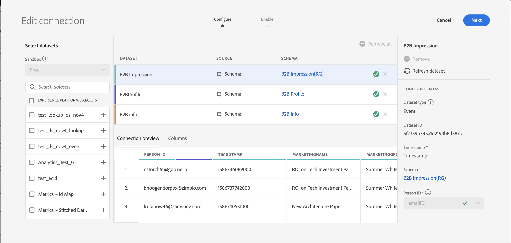
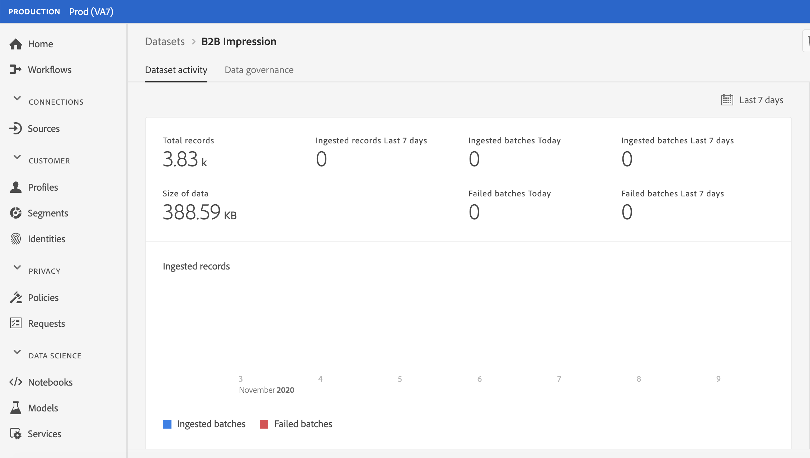

# Stimare la dimensione della connessione

Potrebbe essere necessario sapere quante righe di dati si hanno attualmente in [!UICONTROL Customer Journey Analytics]. Lo scopo di questo argomento è quello di mostrare come creare rapporti sull’utilizzo corrente di [!UICONTROL Customer Journey Analytics].

1. In [!UICONTROL Customer Journey Analytics], fai clic sulla scheda **[!UICONTROL Connections]**.
1. Sulla schermata [!UICONTROL Edit connection], seleziona una connessione per la quale si desidera determinare la dimensione di utilizzo/connessione.

   

1. Seleziona un set di dati che fa parte della connessione dalla barra a sinistra. In questo caso, è il set di dati “Impressione B2B”.

   

1. Fai clic sull’icona blu (i) (info) accanto al nome. Noterai che il set di dati ha righe/eventi 3.8k. Inoltre, per il numero esatto di righe, fai clic su **[!UICONTROL Edit in Experience Platform]** sotto la tabella di anteprima. Questo ti reindirizzerà ai set di dati in [!UICONTROL Adobe Experience Platform].

   

1. Osserva che **[!UICONTROL Total records]** per questo set di dati equivale a 3.83k record, con la dimensione dei dati pari a 388.59 KB.

1. Ripeti i passaggi da 1 a 5 per altri set di dati nella connessione e aggiungi il numero di record/righe. Il numero aggregato finale sarà la metrica di utilizzo della connessione. Questo è il numero di righe dei set di dati della connessione da cui intendi acquisire [!UICONTROL Adobe Experience Platform].

## Determinare il numero di righe acquisite

Il numero di eventi effettivamente acquisiti in [!UICONTROL Customer Journey Analytics] dipende dalle impostazioni di configurazione della connessione. Inoltre, se hai selezionato l’ID persona sbagliato o se questo ID non è disponibile per alcune righe nei set di dati, allora [!UICONTROL Customer Journey Analytics] ignorerà quelle righe. Per determinare le righe effettive degli eventi acquisiti, procedi come segue:

1. Una volta salvata la connessione, crea una visualizzazione dati della stessa connessione senza alcun filtro.
1. Crea un progetto Workspace e seleziona la visualizzazione dati corretta. Crea una tabella a forma libera e trascina e rilascia la metrica **[!UICONTROL Events]** con una dimensione **[!UICONTROL Year]**. Scegli un intervallo di date sufficientemente ampio dal calendario di selezione della data per incapsulare tutti i dati presenti nella connessione. Questo consente di visualizzare il numero di eventi in cui vengono acquisiti [!UICONTROL Customer Journey Analytics].

   

   >[!NOTE]
   >
   >Questo consente di visualizzare il numero di eventi da acquisire dal set di dati degli eventi. Non include i set di dati di profilo e tipo di ricerca. Segui i passaggi da 1 a 3 in “Stimare la dimensione della connessione” per i set di dati di profilo e di ricerca e aggiungi i numeri per ottenere il numero totale di righe per questa connessione.

## Diagnosticare le discrepanze

In alcuni casi, puoi notare che il numero totale di eventi acquisiti dalla connessione è diverso dal numero di righe nel set di dati in [!UICONTROL Adobe Experience Platform]. In questo esempio, il set di dati “Impressione B2B” ha 7650 righe, ma il set di dati contiene 3830 righe in [!UICONTROL Adobe Experience Platform]. Ci sono diversi motivi per cui possono verificarsi discrepanze e possono essere adottate le seguenti misure per diagnosticare:

1. Suddividi questa dimensione per **[!UICONTROL Platform Dataset ID]** e noterai due set di dati con le stesse dimensioni ma diversi **[!UICONTROL Platform Dataset IDs]**. Ogni set di dati ha 3825 record. Ciò significa che [!UICONTROL Customer Journey Analytics] ha ignorato 5 record a causa di ID persona mancanti o marche temporali mancanti:

   

1. Inoltre, se controlliamo in [!UICONTROL Adobe Experience Platform], non esiste un set di dati con ID “5f21c12b732044194bffc1d0”, quindi qualcuno ha cancellato questo particolare set di dati da [!UICONTROL Adobe Experience Platform] quando è stata creata la connessione iniziale. Successivamente, è stato aggiunto a [!UICONTROL Customer Journey Analytics] di nuovo, ma è stato generato un diverso [!UICONTROL Platform Dataset ID] da [!UICONTROL Adobe Experience Platform].

Ulteriori informazioni sulle [implicazioni del set di dati e dell’eliminazione della connessione](https://experienceleague.adobe.com/docs/analytics-platform/using/cja-overview/cja-faq.html?lang=it#implications-of-deleting-data-components) in [!UICONTROL Customer Journey Analytics] e [!UICONTROL Adobe Experience Platform].
