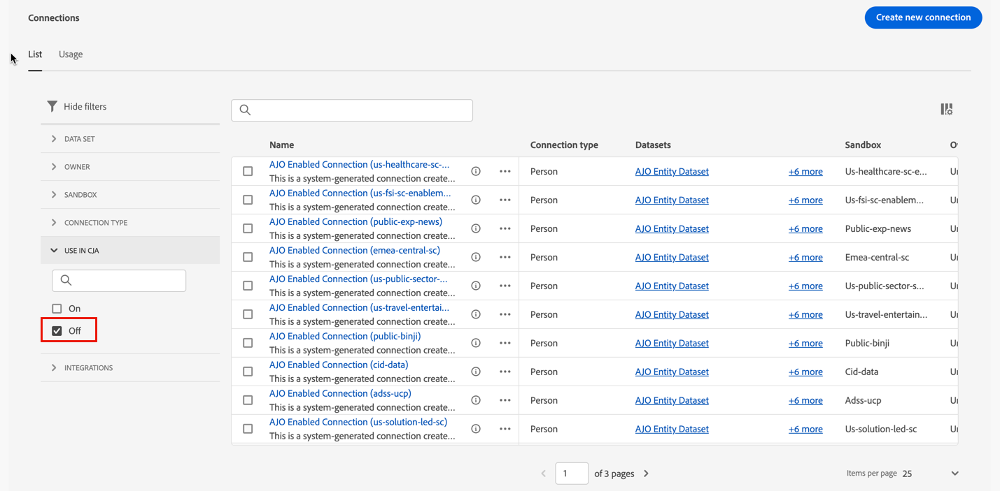

# Gestire le connessioni {#manage-connections}

>[!CONTEXTUALHELP]
>id="connections_use_ajo"
>title="Utilizzare la connessione di Journey Optimizer"
>abstract="Sfrutta le funzionalità avanzate di reporting di Customer Journey Analytics con Journey Optimizer."

>[!CONTEXTUALHELP]
>id="connections_cancel_ajo"
>title="Annullare la connessione di Journey Optimizer"
>abstract="Annulla le funzionalità avanzate di reporting di Customer Journey Analytics con Journey Optimizer."

Dopo aver [creato o modificato una o più connessioni](/help/connections/create-connection.md), puoi gestirle in **[!UICONTROL Connessioni]**. L&#39;interfaccia [!UICONTROL Connections] consente di:

* Visualizzare immediatamente tutte le tue connessioni, inclusi il proprietario, la sandbox e quando sono state create e modificate.
* Modificare una connessione.
* Eliminare una connessione.
* Creare una visualizzazione dati a partire da una connessione.
* Visualizza tutti i set di dati in una connessione.
* Controllare lo stato dei set di dati della tua connessione e del processo di acquisizione. Ad esempio, la disponibilità dei dati in modo da poter iniziare con il reporting e l’analisi in Analysis Workspace.
* Identifica eventuali discrepanze di dati dovute a configurazione errata. Vi mancano delle righe? In caso affermativo, quali righe mancano e perché? Hai configurato in modo errato le connessioni e causato la mancanza di dati in Customer Journey Analytics?
* Ottieni informazioni sull’utilizzo delle righe acquisite e segnalabili in tutte le connessioni.

[!UICONTROL Le connessioni] hanno due interfacce: [[!UICONTROL Elenco]](#list) e [[!UICONTROL Utilizzo]](#usage).

## Elenco

L&#39;interfaccia **[!UICONTROL List]** è l&#39;interfaccia predefinita per Connessioni. Se non è selezionata, selezionare la scheda **[!UICONTROL Elenco]** per accedere all&#39;interfaccia.

L&#39;interfaccia [!UICONTROL List] mostra una tabella di tutte le connessioni disponibili.

### Cercare una connessione

Puoi cercare rapidamente una connessione utilizzando la casella  della ricerca.

### Applicare un filtro all&#39;elenco delle connessioni

Per applicare un filtro all’elenco delle connessioni, seleziona l’icona del filtro, quindi scegli tra le seguenti opzioni di filtro:

| Opzione filtro | Descrizione |
|---------|----------|
| **[!UICONTROL Set di dati]** | Vengono visualizzate solo le connessioni associate ai set di dati selezionati. |
| **[!UICONTROL Proprietario]** | Vengono visualizzate solo le connessioni di proprietà delle persone selezionate. |
| **[!UICONTROL Sandbox]** | Vengono visualizzate solo le connessioni disponibili nelle sandbox selezionate. |
| **[!UICONTROL Utilizzo in CJA]** | Selezionare **[!UICONTROL Il]** per visualizzare solo le connessioni abilitate per l&#39;utilizzo con Customer Journey Analytics. Seleziona **[!UICONTROL Disattivato]** per visualizzare solo le connessioni non ancora abilitate per l&#39;utilizzo con Customer Journey Analytics. |

### Colonne disponibili

Nella tabella sono disponibili le colonne o le icone seguenti.

| Colonna o icona | Descrizione |
| --- | --- |
| **[!UICONTROL _Nome_]** | Il nome descrittivo della connessione. Selezionare il nome del collegamento ipertestuale per visualizzare i [dettagli della connessione](#connection-details). |
|  | Per visualizzare le informazioni sui [!UICONTROL Set di dati inclusi], [!UICONTROL Sandbox], [!UICONTROL Proprietario] e altro ancora, seleziona  accanto al nome della connessione.
Una finestra a comparsa visualizza i dettagli sul set di dati. 
 |
|  | Per [creare una visualizzazione dati](#create-a-data-view) per la connessione, seleziona . Questa icona viene visualizzata solo se alla connessione non è già associata alcuna visualizzazione dati. |
|  | Seleziona  per aprire un menu di scelta rapida. È possibile selezionare: 
 **[!UICONTROL Modifica]** per [modificare](#edit-a-connection) una connessione.
 **[!UICONTROL Elimina]** per [eliminare](#delete-a-connection) una connessione.
 **[!UICONTROL Crea nuova visualizzazione dati]** per [creare una nuova visualizzazione dati](#create-a-data-view) per la connessione.
 **[!UICONTROL Mappa di connessione]** per visualizzare una [Mappa di connessione](#map-a-connection) per la connessione. |
| [!BADGE B2B edition]{type=Informative url="https://experienceleague.adobe.com/it/docs/analytics-platform/using/cja-overview/cja-b2b/cja-b2b-edition" newtab=true tooltip="Customer Journey Analytics B2B Edition"} **[!UICONTROL Tipo di connessione &#x200B;]** | Tipo di connessione: **[!UICONTROL Connessione basata su Persona]** o **[!UICONTROL Connessione basata su Account]**. |
| **[!UICONTROL Set di dati]** | Uno o più collegamenti ai set di dati che fanno parte della connessione. Puoi selezionare il collegamento ipertestuale del set di dati per visualizzare il set di dati nella connessione. Se la connessione selezionata include altri set di dati, selezionare **[!UICONTROL +*x* ulteriori]** per visualizzare un pannello **[!UICONTROL Set di dati inclusi]**. Questo pannello mostra i collegamenti a tutti i set di dati e un&#39;opzione per  set di dati specifici che fanno parte della connessione.

Seleziona un nome per il set di dati per aprirlo nell’interfaccia di Experience Platform in una nuova scheda. |
| **[!UICONTROL Sandbox]** | La [sandbox di Adobe Experience Platform](https://experienceleague.adobe.com/it/docs/experience-platform/sandbox/home) da cui questa connessione attinge i relativi set di dati. Seleziona questa sandbox al momento della creazione della connessione. Una volta salvata una connessione, non è possibile modificare la sandbox. |
| **[!UICONTROL Proprietario]** | Persona che ha creato la connessione. |
| **[!UICONTROL Importa nuovi dati]** | Stato dell’importazione di nuovi dati per i set di dati: 
   **[!UICONTROL _x _Il]**&#x200B;per i set di dati configurati per l&#39;importazione di nuovi dati e
   **[!UICONTROL _x Disattivato_]** per i set di dati non configurati per l’importazione di nuovi dati. |
| **[!UICONTROL Data di creazione]** | Marca temporale della prima creazione della connessione. |
| **[!UICONTROL Ultima modifica]** | Marca temporale dell’ultimo aggiornamento della connessione. |
| **[!UICONTROL Dati backfill]** | Stato dei dati di retrocompilazione tra set di dati.
   **[!UICONTROL _x _retrocompilazioni non riuscite]**&#x200B;per il numero di retrocompilazioni non riuscite tra set di dati,
   **[!UICONTROL _x _retrocompilazioni in elaborazione]**&#x200B;per il numero di retrocompilazioni in elaborazione tra set di dati,
   **[!UICONTROL _x _retrocompilazioni completate]**&#x200B;per il numero di retrocompilazioni completate per i set di dati e
   **[!UICONTROL _Disattivato_]** nel caso in cui non siano definite retrocompilazioni per i set di dati nella connessione. |
| **[!UICONTROL Integrazioni]** | Mostra tutte le applicazioni Experience Platform abilitate con la connessione. |
| **[!UICONTROL Utilizzo in CJA]** | Indica se la connessione è stata abilitata per l&#39;utilizzo con Customer Journey Analytics. |

Per configurare le colonne da visualizzare nella tabella, selezionare . Nella finestra di dialogo Personalizza tabella, seleziona le colonne da visualizzare.

### Modificare una connessione

Per modificare una connessione:

1. Seleziona  accanto al nome della connessione
1. Seleziona  **[!UICONTROL Modifica]** dal menu di scelta rapida.

In alternativa, puoi:

1. Controllare l’URL della connessione.

1. Seleziona  **[!UICONTROL Modifica]** dalla barra delle azioni blu.

Per ulteriori informazioni, consulta [Creare o modificare una connessione](create-connection.md).

### Eliminare una connessione {#connections-delete}

Per eliminare una connessione:

1. Seleziona  accanto al nome della connessione.
1. Selezionare  **[!UICONTROL Elimina]**.

In alternativa, puoi:

1. Controllare l’URL della connessione.

1. Seleziona  **[!UICONTROL Elimina]** dalla barra delle azioni blu.

Quando si elimina una connessione, il pannello **[!UICONTROL Elimina connessione]** indica le visualizzazioni dati eliminate e i progetti dell&#39;area di lavoro interessati.

* In ➊ **[!UICONTROL Info]** sono visualizzate le implicazioni dell&#39;eliminazione della connessione.

  

  Seleziona **[!UICONTROL Continua]** per confermare l&#39;eliminazione.

* In ➋ **[!UICONTROL Conferma]**, immettere il nome della connessione in **[!UICONTROL Digitare il nome della connessione]** e selezionare **[!UICONTROL Elimina]** per eliminare la connessione. Selezionare **[!UICONTROL Annulla]** per annullare.

Per ulteriori informazioni sull’eliminazione di una connessione, consulta [Implicazioni dell’eliminazione](/help/technotes/deletion.md).

### Creare una visualizzazione dati per una connessione

Per creare una visualizzazione dati per una connessione:

1. Seleziona  accanto al nome della connessione.
1. Seleziona  **[!UICONTROL Crea nuova visualizzazione dati]**.

In alternativa, puoi:

1. Controllare l’URL della connessione.

1. Seleziona  **[!UICONTROL Crea visualizzazione dati]** dalla barra delle azioni blu.

Per ulteriori informazioni, consulta [Creare o modificare una visualizzazione dati](/help/data-views/create-dataview.md).

### Connessioni Journey Optimizer

È possibile utilizzare una connessione Journey Optimizer in Customer Journey Analytics per apportare il seguente valore aggiuntivo alla connessione:

* Eseguire analisi approfondite dei dati Journey Optimizer in Customer Journey Analytics (utilizzando il pulsante **[!UICONTROL Analizza in CJA]** in Journey Optimizer).

  Per ulteriori informazioni, vedere [Analizzare in Customer Journey Analytics](https://experienceleague.adobe.com/it/docs/journey-optimizer/using/reporting/channel-report/report-cja-manage#cja-template) nella documentazione di Journey Optimizer.

* Modifica la connessione Journey Optimizer e le visualizzazioni dati associate.

  Per ulteriori informazioni sulle opzioni di modifica, vedere [Modificare una connessione](#edit-a-connection).

>[!IMPORTANT]
>
>Quando abiliti una connessione Journey Optimizer per l’utilizzo con Customer Journey Analytics come descritto in questa sezione, ogni riga di dati all’interno della connessione conta verso le righe di dati concesse in licenza ogni mese per Customer Journey Analytics e viene visualizzata nell’interfaccia utente di utilizzo delle connessioni. Selezionare l&#39;opzione **[!UICONTROL Usa in CJA]** sulla connessione solo se si è certi dell&#39;ulteriore utilizzo di Rows of Data in Customer Journey Analytics.
>
>**Se hai diritto sia a Customer Journey Analytics che a Journey Optimizer tra ottobre 2024 e ottobre 2025, consulta il seguente documento sulle [connessioni abilitate per AJO](https://view.adobe.com/viewer/1ed94fc35c7860b260766c620889e7a0#1)**.

Per abilitare questa funzionalità, la tua organizzazione deve accedere a Customer Journey Analytics. Se non hai accesso a, contatta il tuo rappresentante commerciale Adobe.

#### Utilizzare una connessione Journey Optimizer {#use-connection-in-cja}

Per utilizzare una connessione Journey Optimizer in Customer Journey Analytics:

1. Individuare la connessione Journey Optimizer che si desidera utilizzare con Customer Journey Analytics.

   1. Selezionare  **[!UICONTROL Filtro]** nella scheda **[!UICONTROL Connessioni]**.

   1. Nella sezione **[!UICONTROL Utilizza in CJA]**, seleziona **[!UICONTROL Disattiva]**.

      Vengono visualizzate tutte le connessioni Journey Optimizer attualmente non configurate per l&#39;utilizzo in Customer Journey Analytics.

      

1. Seleziona il nome della connessione Journey Optimizer.

1. Seleziona  **[!UICONTROL Utilizza in CJA]**.

   

   Viene visualizzata la finestra di dialogo **[!UICONTROL Usa questa connessione in Customer Journey Analytics]**.

1. Attiva l&#39;interruttore, **[!UICONTROL Usa la connessione in CJA]**.

1. Seleziona **[!UICONTROL Usa connessione]**. <!-- double-check these dialog button names -->

#### Rimuovere una connessione Journey Optimizer {#remove-connection-in-cja}

È possibile rimuovere una connessione Journey Optimizer da Customer Journey Analytics in qualsiasi momento. Tuttavia, la rimozione della connessione da Customer Journey Analytics dopo il suo utilizzo determina quanto segue:

* La connessione Journey Optimizer ed eventuali visualizzazioni dati associate vengono ripristinate allo stato predefinito e non possono più essere modificate

* Tutti i campi derivati personalizzati associati alla connessione vengono eliminati.

* Non è più possibile eseguire analisi approfondite dei dati Journey Optimizer in Customer Journey Analytics.

  Ciò significa che il pulsante **[!UICONTROL Analizza in CJA]** in Journey Optimizer è disabilitato.

>[!IMPORTANT]
>
>La fatturazione per la connessione in Customer Journey Analytics include l’intero mese durante il quale la connessione viene rimossa.

Per rimuovere la connessione da Customer Journey Analytics:

1. Individuare la connessione Journey Optimizer da rimuovere da Customer Journey Analytics.

   1. Selezionare  **[!UICONTROL Filtro]** nella scheda **[!UICONTROL Connessioni]**.

   1. Nella sezione **[!UICONTROL Utilizza in CJA]**, seleziona **[!UICONTROL Il]**.

      Vengono visualizzate tutte le connessioni Journey Optimizer attualmente configurate per l&#39;utilizzo in Customer Journey Analytics.

      

1. Per visualizzare la connessione, selezionare il nome della connessione Journey Optimizer da rimuovere da Customer Journey Analytics.

1. Quando si visualizza la connessione Journey Optimizer, selezionare **[!UICONTROL Rimuovi da CJA]**.

   Viene visualizzata la finestra di dialogo **[!UICONTROL Rimuovi la connessione da Customer Journey Analytics]**:

   

1. Disabilita l&#39;opzione **[!UICONTROL Rimuovi connessione da CJA]**.

1. Selezionare **[!UICONTROL Rimuovi connessione]**.

### Mappare una connessione

Per visualizzare una [mappa di connessione](/help/connections/create-connection.md#connection-map) che descrive le relazioni tra i set di dati che fanno parte di una connessione:

1. Seleziona  accanto al nome della connessione.
1. Seleziona  **[!UICONTROL Mappa di connessione]**.

### Dettagli della connessione {#connection-detail}

Per visualizzare i dettagli di una connessione, selezionare un nome di connessione ipertestuale nella tabella connessioni.

L’interfaccia Dettagli connessioni fornisce una visualizzazione molto dettagliata dello stato di una connessione. Puoi:

* Controllare lo stato dei set di dati della connessione e del processo di acquisizione.
* Identificare i problemi di configurazione che portano a record saltati o eliminati.
* Vedere quando i dati sono disponibili per il reporting.

| Interfaccia utente | Descrizione |
| --- | --- |
|  **[!UICONTROL Modifica connessione]** | Per modificare i dettagli di una connessione, selezionare  **[!UICONTROL Modifica connessione]**. Per ulteriori informazioni, consulta [Creare o modificare una connessione](create-connection.md). |
| **[!UICONTROL *Selettore di set di dati *]** | Seleziona uno o tutti i set di dati per i quali visualizzare i dettagli nella connessione. Non è possibile selezionare più set di dati. Impostazione predefinita: **[!UICONTROL Tutti i set di dati]**. |
| **[!UICONTROL *Selettore di intervalli di date *]** | Seleziona un intervallo di dati per cui visualizzare i dettagli nella connessione. Modifica la data di inizio e di fine oppure seleziona  per aprire il selettore dell’intervallo di date. Nel selettore dell&#39;intervallo di date, seleziona un intervallo di date utilizzando uno dei periodi predefiniti (ad esempio **[!UICONTROL Ultimi 6 mesi]**) oppure utilizza il calendario per selezionare la data di inizio e la data di fine. Seleziona **[!UICONTROL Applica]** per applicare il nuovo intervallo di date ai dettagli della connessione. |
| **[!UICONTROL Record di dati evento disponibili]** | Numero totale di righe del set di dati evento disponibili per il reporting, **per l’intera connessione**. Questo conteggio è indipendente da qualsiasi intervallo di date o selezione di set di dati. |
| [!UICONTROL **[!UICONTROL Metriche]**] | Riepiloga i record evento, ricerca, profilo e set di dati di riepilogo aggiunti, saltati ed eliminati e il numero di batch aggiunti. Queste metriche si basano sul **set di dati e intervallo di date selezionati**.
Selezionare **[!UICONTROL Controlla dettagli]** per visualizzare la finestra a comparsa **[!UICONTROL Controlla dettagli ignorati]**. Il pop-up elenca il numero di record saltati e il motivo per tutti i set di dati evento o per i set di dati selezionati.

Seleziona il pop-up  con ulteriori informazioni. Per alcuni motivi ignorati, come [!UICONTROL ID visitatore vuoto], nel popup viene visualizzato **[!UICONTROL PSQL di esempio per EQS]** (Experience Platform for Query Service) che è possibile utilizzare in [Query Service](https://experienceleague.adobe.com/it/docs/experience-platform/query/home) per eseguire query per i record ignorati nel set di dati. Seleziona  **[!UICONTROL Copia PSQL di esempio per EQS]** per copiare SQL. |
| **[!UICONTROL Record aggiunti]** | Visualizzazione per indicare quante righe sono state aggiunte nel periodo di tempo selezionato, **per il set di dati e l&#39;intervallo di date selezionati**. Viene aggiornato ogni 10 minuti. |
| **[!UICONTROL Record ignorati]** | Visualizzazione per indicare quante righe sono state ignorate nel periodo di tempo selezionato, **per il set di dati e l&#39;intervallo di date selezionati**. I motivi per cui i record vengono ignorati includono: marche temporali mancanti, ID persona o ID account [!BADGE B2B edition]{type=Informative url="https://experienceleague.adobe.com/it/docs/analytics-platform/using/cja-overview/cja-b2b/cja-b2b-edition" newtab=true tooltip="Customer Journey Analytics B2B Edition"} mancante o non valido e così via. Viene aggiornato ogni 10 minuti. 
Gli ID non validi (ad esempio `undefined` o `00000000` o qualsiasi combinazione di numeri e lettere in un [!UICONTROL ID persona] che compaiono in un evento più di 1 milione di volte in un dato mese) sono ID che non possono essere attribuiti a un utente o persona specifica. Queste righe di dati non possono essere acquisite nel sistema e causano acquisizioni e generazione di rapporti soggetti a errori. Per correggere gli ID persona o gli ID account [!BADGE B2B edition]{type=Informative url="https://experienceleague.adobe.com/it/docs/analytics-platform/using/cja-overview/cja-b2b/cja-b2b-edition" newtab=true tooltip="Customer Journey Analytics B2B Edition"} non validi, sono disponibili 3 opzioni:<ul><li>Utilizzare [Unione](/help/stitching/overview.md) per popolare gli ID utente non definiti o composti solo da zeri con ID utente validi.</li><li>Rimuovi gli ID utente, che vengono quindi ignorati durante l’acquisizione (da preferire agli ID utente non validi o agli ID composti solo da zeri).</li><li>Correggere eventuali ID utente non validi nel sistema prima di acquisire i dati.</li></ul> |
| **[!UICONTROL Record eliminati]** | Visualizzazione per indicare quante righe sono state eliminate nel periodo di tempo selezionato, **per il set di dati e l&#39;intervallo di date selezionati**. Per esempio, qualcuno potrebbe aver eliminato un set di dati in [!DNL Experience Platform]. Viene aggiornato ogni 10 minuti.
In alcuni scenari, questo valore può includere anche i record sostituiti, ad esempio con l’unione, o alcuni aggiornamenti dei set di dati di ricerca. Studia questo esempio:
<ul><li>Carichi un record in un set di dati Profilo individuale XDM, che in Customer Journey Analytics è configurato per essere acquisito come dati di ricerca profilo. Nei dettagli della connessione, questo set di dati visualizzerebbe 1 record aggiunto.</li><li>Carichi un duplicato del record originale nello stesso set di dati di AEP, che ora contiene due record. Customer Journey Analytics acquisisce il record aggiuntivo dal set di dati di ricerca del profilo o dell’account [!BADGE B2B Edition]{type=Informative url="https://experienceleague.adobe.com/it/docs/analytics-platform/using/cja-overview/cja-b2b/cja-b2b-edition" newtab=true tooltip="Customer Journey Analytics B2B Edition"}. Visto che un profilo o un record account è già stato acquisito nella connessione per l&#39;ID persona o l&#39;ID account [!BADGE B2B edition]{type=Informative url="https://experienceleague.adobe.com/it/docs/analytics-platform/using/cja-overview/cja-b2b/cja-b2b-edition" newtab=true tooltip="Customer Journey Analytics B2B Edition"}, Customer Journey Analytics elimina la versione precedente e aggiunge i nuovi dati del profilo. Nei dettagli della connessione, questa azione rappresenterebbe 1 record aggiunto e 1 record eliminato, perché Customer Journey Analytics mantiene solo i dati di ricerca profilo più recenti per qualsiasi ID persona o ID account acquisito [!BADGE B2B edition]{type=Informative url="https://experienceleague.adobe.com/it/docs/analytics-platform/using/cja-overview/cja-b2b/cja-b2b-edition" newtab=true tooltip="Customer Journey Analytics B2B Edition"}.</li><li>In totale, il set di dati di AEP contiene due record che risultano identici. A parte, i dettagli della connessione a Customer Journey Analytics mostrano lo stato dei dati acquisiti: 2 record aggiunti e 1 record eliminato per questo set di dati profilo. </li></ul> |
|  | Campo di ricerca di set di dati. Puoi cercare la tabella dei set di dati per nome o ID del set di dati. |
| [!UICONTROL Tabella set di dati] | Set di dati che fanno parte della connessione. Per ulteriori spiegazioni, consulta la tabella seguente. Selezionare  un singolo set di dati per visualizzare solo i dettagli di connessione per il set di dati selezionato. Equivale alla selezione di un set di dati dal selettore **[!UICONTROL _Set di dati_]**. |

La tabella dei set di dati visualizza le colonne seguenti per ogni set di dati:

| Colonna | Descrizione |
| --- | --- |
| **[!UICONTROL Set di dati]** | Nome del set di dati. Puoi selezionare il collegamento ipertestuale per aprire il set di dati nell’interfaccia utente di Experience Platform in una nuova scheda. Puoi selezionare la riga o la casella di controllo per visualizzare i dettagli solo per il set di dati selezionato. |
| **[!UICONTROL ID set di dati]** | ID del set di dati generato da Experience Platform. |
| **[!UICONTROL Record aggiunti]** | Il numero di record di set di dati (righe) aggiunti a una connessione durante l’intervallo di date selezionato. |
| **[!UICONTROL Record ignorati]** | Il numero di record di set di dati (righe) ignorati durante il trasferimento di dati per una connessione durante l’intervallo di date selezionato. |
| **[!UICONTROL Record eliminati]** | Il numero di record di set di dati (righe) rimossi da una connessione durante l’intervallo di date selezionato. |
| **[!UICONTROL Batch aggiunti]** | Il numero di batch aggiunti a una connessione durante l’intervallo di date selezionato. |
| **[!UICONTROL Ultima aggiunta]** | La marca temporale dell’ultimo batch aggiunto a una connessione. |
| **[!UICONTROL Tipo di origine dati]** | Tipo di origine. Puoi definire il tipo di origine quando aggiungi un set di dati a una connessione. |
| **[!UICONTROL Tipo set di dati]** | Il tipo di [set di dati](create-connection.md#dataset-types). Il tipo può essere **[!UICONTROL Event]**, **[!UICONTROL Profile]**, **[!UICONTROL Lookup]**, **[!UICONTROL Summary]**. Un set di dati adhoc o relazionale è identificato da **[!UICONTROL (Adhoc)]** o **[!UICONTROL (Relazionale)]**. Ad esempio, **[!UICONTROL Evento (Adhoc)]** o **[!UICONTROL Ricerca (Relazionale)]**. |
| **[!UICONTROL Schema]** | Schema Adobe Experience Platform su cui si basa il set di dati. |
| **[!UICONTROL Importa nuovi dati]** | Stato dell’importazione di nuovi dati per il set di dati: 
   **[!UICONTROL _x _Attivo]**&#x200B;se il set di dati è configurato per l’importazione di nuovi dati e
   **[!UICONTROL _x Disattivato_]** se il set di dati non è configurato per l’importazione di nuovi dati. |
| **[!UICONTROL Trasforma dati]** | Stato di trasformazione dei set di dati di ricerca B2B applicabili. Per ulteriori informazioni, consulta [Trasformare i set di dati per le ricerche B2B](transform-datasets-b2b-lookups.md).
   **[!UICONTROL _x _Attivo]**&#x200B;per i set di dati applicabili abilitati per la trasformazione, 
   **[!UICONTROL _x Disattivato_]** per i set di dati applicabili non abilitati per la trasformazione e
**[!UICONTROL N/A]** per tutti gli altri set di dati, non applicabile per la trasformazione. |
| **[!UICONTROL Dati backfill]** | Stato dei dati di retrocompilazione per il set di dati.
   **[!UICONTROL _x _retrocompilazioni non riuscite]**&#x200B;per il numero di retrocompilazioni non riuscite,
   **[!UICONTROL _x _retrocompilazioni in elaborazione]**&#x200B;per il numero di retrocompilazioni in elaborazione,
   **[!UICONTROL _x _retrocompilazioni completate]**&#x200B;per il numero di retrocompilazioni completate e
   **[!UICONTROL _Disattivato_]** nel caso in cui le retrocompilazioni non siano configurate. |

>[!IMPORTANT]
>
>Eventuali dati acquisiti prima del 13 agosto 2021 non vengono riflessi nell&#39;interfaccia [!UICONTROL Connections].
>

#### Pannello Connessione

Quando nella tabella dei set di dati non è selezionato alcun singolo set di dati, il pannello di destra mostra le opzioni e i dettagli di connessione.

| Opzioni | Descrizione |
| --- | --- |
|  **[!UICONTROL Aggiorna]** | Per aggiornare la connessione e consentire la visualizzazione dei record aggiunti di recente, selezionare  **[!UICONTROL Aggiorna]**. |
|  **[!UICONTROL Elimina]** | [Elimina](#delete-a-connection) questa connessione. |
|  **[!UICONTROL Crea visualizzazione dati]** | [Crea una visualizzazione dati](#create-a-data-view) in base a questa connessione. Per ulteriori informazioni, consulta [Visualizzazione dati](https://experienceleague.adobe.com/it/docs/analytics-platform/using/cja-dataviews/data-views). |
| **[!UICONTROL Utilizzo in CJA]** | Utilizza una connessione Journey Optimizer in Customer Journey Analytics per aggiungere valore alla connessione Journey Optimizer. Per ulteriori informazioni, vedere [Utilizzare una connessione Journey Optimizer in Customer Journey Analytics](#use-a-journey-optimizer-connection-in-customer-journey-analytics). |
| **[!UICONTROL Nome connessione]** | Nome descrittivo della connessione. |
| **[!UICONTROL Descrizione connessione]** | Una descrizione più dettagliata che riporta lo scopo di questa connessione. |
| **[!UICONTROL Sandbox]** | La [sandbox di Adobe Experience Platform](https://experienceleague.adobe.com/it/docs/experience-platform/sandbox/home) da cui questa connessione attinge i relativi set di dati. Seleziona questa sandbox al momento della creazione della connessione. Una volta salvata una connessione, non è possibile modificare la sandbox. |
| **[!UICONTROL ID connessione]** | Identificatore generato per la connessione. Puoi utilizzare  per copiare il valore. |
| [!BADGE B2B edition]{type=Informative url="https://experienceleague.adobe.com/it/docs/analytics-platform/using/cja-overview/cja-b2b/cja-b2b-edition" newtab=true tooltip="Customer Journey Analytics B2B Edition"} **[!UICONTROL Tipo ID primario &#x200B;]** | Tipo di ID primario per la connessione: **[!UICONTROL Persona]** per una connessione basata su persona, **[!UICONTROL Account]** per una connessione basata su account. |
| [!BADGE B2B edition]{type=Informative url="https://experienceleague.adobe.com/it/docs/analytics-platform/using/cja-overview/cja-b2b/cja-b2b-edition" newtab=true tooltip="Customer Journey Analytics B2B Edition"} **[!UICONTROL Contenitori &#x200B;]** | I contenitori configurati per la connessione. |
| **[!UICONTROL Visualizzazioni dati tramite connessione]** | Visualizzazioni dati che utilizzano questa connessione. |
| **[!UICONTROL Importa nuovi dati]** | Stato dell’importazione di nuovi dati per i set di dati: 
   **[!UICONTROL _x _Attivo]**&#x200B;per il numero di set di dati configurati per l’importazione di nuovi dati e
   **[!UICONTROL _x Disattivato_]** per il numero di set di dati per il quale viene disattivata l’importazione di nuovi dati. |
| **[!UICONTROL Dati backfill]** | Stato dei dati di retrocompilazione per i set di dati.
   **[!UICONTROL _x _retrocompilazioni non riuscite]**&#x200B;per il numero di retrocompilazioni non riuscite tra set di dati,
   **[!UICONTROL _x _retrocompilazioni in elaborazione]**&#x200B;per il numero di retrocompilazioni in elaborazione tra set di dati,
   **[!UICONTROL _x _retrocompilazioni completate]**&#x200B;per il numero di retrocompilazioni completate per i set di dati e
   **[!UICONTROL _Disattivato_]** nel caso in cui non siano definite retrocompilazioni per i set di dati nella connessione. |
| **[!UICONTROL Trasforma dati]** | Stato di trasformazione dei set di dati di ricerca B2B applicabili. Per ulteriori informazioni, consulta [Trasformare i set di dati per le ricerche B2B](transform-datasets-b2b-lookups.md).
   **[!UICONTROL _x _Attivo]**&#x200B;per il numero di set di dati abilitati per la trasformazione. |
| **[!UICONTROL Creato da]** | Nome della persona che ha creato la connessione. |
| **[!UICONTROL Ultima modifica]** | Marca temporale dell’ultima modifica apportata alla connessione. |
| **[!UICONTROL Ultima modifica eseguita da]** | Nome dell&#39;ultima persona che ha modificato la connessione. |

#### Pannello Set di dati

Quando una riga di set di dati viene selezionata nella tabella dei set di dati, in un pannello sul lato destro dell’interfaccia Connessioni vengono visualizzati i dettagli del set di dati selezionato.

| Dettagli | Descrizione |
| --- | --- |
| [!BADGE B2B edition]{type=Informative url="https://experienceleague.adobe.com/it/docs/analytics-platform/using/cja-overview/cja-b2b/cja-b2b-edition" newtab=true tooltip="Customer Journey Analytics B2B Edition"} **[!UICONTROL ID account globale &#x200B;]** | L’identità specificata come ID account globale per la connessione. Applicabile solo per una connessione basata su account per la quale è configurato un contenitore Account globale. |
| [!BADGE B2B edition]{type=Informative url="https://experienceleague.adobe.com/it/docs/analytics-platform/using/cja-overview/cja-b2b/cja-b2b-edition" newtab=true tooltip="Customer Journey Analytics B2B Edition"} **[!UICONTROL ID account &#x200B;]** | L’identità specificata come ID account per la connessione. Applicabile solo per una connessione basata su account per la quale non è configurato alcun contenitore account globale. |
| **[!UICONTROL ID persona]** | L’identità specificata come ID persona per la connessione. |
| **[!UICONTROL Chiave]** | Chiave specificata per un set di dati di ricerca. |
| **[!UICONTROL Chiave corrispondente]** | Chiave corrispondente specificata per un set di dati di ricerca. |
| **[!UICONTROL Marca temporale]** | Marca temporale definita per un set di dati evento. |
| **[!UICONTROL Record disponibili]** | Numero totale di righe acquisite per questo set di dati, per il particolare periodo di tempo selezionato nel calendario. Non esiste alcuna latenza in termini di visualizzazione dei dati nel reporting, una volta aggiunti. Tuttavia, quando crei una nuova connessione, si verifica una [latenza](https://experienceleague.adobe.com/it/docs/analytics-platform/using/cja-overview/cja-b2c-overview/cja-faq). |
| **[!UICONTROL Record aggiunti]** | Il numero di record di set di dati (righe) aggiunti a una connessione durante l’intervallo di date selezionato. |
| **[!UICONTROL Record ignorati]** | Il numero di record di set di dati (righe) ignorati durante il trasferimento di dati per una connessione durante l’intervallo di date selezionato. |
| **[!UICONTROL Batch aggiunti]** | Il numero di batch aggiunti a una connessione. |
| **[!UICONTROL Record eliminati]** | Il numero di record di set di dati (righe) rimossi da una connessione durante l’intervallo di date selezionato. |
| **[!UICONTROL Ultima aggiunta]** | La marca temporale dell’ultimo batch aggiunto a una connessione. |
| **[!UICONTROL Importa nuovi dati]** | Stato dell’importazione di nuovi dati per il set di dati: 
   **[!UICONTROL _x _Attivo]**&#x200B;se il set di dati è configurato per l’importazione di nuovi dati e
   **[!UICONTROL _x Disattivato_]** se il set di dati è configurato per non importare nuovi dati. |
| **[!UICONTROL Dati backfill]** | Stato dei dati di retrocompilazione per il set di dati.
   **[!UICONTROL _x _retrocompilazioni non riuscite]**&#x200B;per il numero di retrocompilazioni non riuscite,
   **[!UICONTROL _x _retrocompilazioni in elaborazione]**&#x200B;per il numero di retrocompilazioni in elaborazione,
   **[!UICONTROL _x _retrocompilazioni completate]**&#x200B;per il numero di retrocompilazioni completate e
   **[!UICONTROL _Disattivato_]** se non è configurata alcuna retrocompilazione.
Per visualizzare una finestra di dialogo con una panoramica delle precedenti retrocompilazioni relative al set di dati, selezionare  **[!UICONTROL Backfill passati]**. |
| **[!UICONTROL Tipo di origine dati]** | Tipo di origine dati definito al momento dell’aggiunta del set di dati alla connessione. |
| **[!UICONTROL Tipo set di dati]** | Il tipo di [set di dati](create-connection.md#dataset-types). Il tipo può essere **[!UICONTROL Event]**, **[!UICONTROL Profile]**, **[!UICONTROL Lookup]**, **[!UICONTROL Summary]**. Un set di dati adhoc o relazionale è identificato da **[!UICONTROL (Adhoc)]** o **[!UICONTROL (Relazionale)]**. Ad esempio, **[!UICONTROL Evento (Adhoc)]** o **[!UICONTROL Ricerca (Relazionale)]**. |
| **[!UICONTROL Schema]** | Schema Adobe Experience Platform su cui si basa questo set di dati. |
| **[!UICONTROL ID set di dati]** | ID del set di dati generato in Experience Platform. |

## Utilizzo {#connections-usage}

>[!CONTEXTUALHELP]
>id="connections_usage_keyusagemetrics"
>title="Metriche di utilizzo chiave"
>abstract="Fornisce dati mensili e totali per le righe principali e storiche da riportare."

>[!CONTEXTUALHELP]
>id="connections_usage_monthlyingestedrows"
>title="Righe acquisite mensilmente"
>abstract="Misura il numero totale di record aggiunti al sistema ogni mese per fornire informazioni approfondite sulla crescita dei dati e sui tassi di acquisizione."

>[!CONTEXTUALHELP]
>id="connections_usage_monthlyreportablerows"
>title="Righe mensili da riportare"
>abstract="Traccia il numero di righe disponibili per il reporting. Le righe da riportare sono le righe acquisite meno quelle ignorate ed eliminate durante l’acquisizione. Le righe da riportare fungono da metrica chiave per la fatturazione e l’utilizzo dei dati."

>[!CONTEXTUALHELP]
>id="connections_usage_detailbreakdown"
>title="Raggruppamento in dettaglio."
>abstract="Puoi visualizzare metriche dettagliate per connessione, set di dati, sandbox e tag, con l’opzione di scaricare un file CSV dei dati."

>[!CONTEXTUALHELP]
>id="connections_usage_otherdatasets"
>title="Altri set di dati"
>abstract="Per i mesi precedenti a settembre 2024, i dati sono stati raccolti a livello di set di dati e vengono visualizzati come *Altri set di dati* per maggiore chiarezza. A partire da settembre 2024, i dati vengono raccolti a livello di set di dati granulari e *Altri set di dati* non verranno più visualizzati."

>[!CONTEXTUALHELP]
>id="connections_usage_unknowndatasetsorconnections"
>title="Connessioni o set di dati sconosciuti"
>abstract="Le connessioni o i set di dati sconosciuti vengono visualizzati utilizzando i relativi ID."

>[!CONTEXTUALHELP]
>id="connections_usage_datanotavailable"
>title="Dati non disponibili"
>abstract="I dati storici precedenti a settembre 2024 non sono disponibili a causa di limitazioni del sistema. Le metriche vengono raccolte e visualizzate a partire da settembre 2024. Il grafico mostra gli ultimi 18 mesi sulla timeline. I dati futuri verranno visualizzati non appena saranno disponibili."

>[!CONTEXTUALHELP]
>id="connections_corereportablerows"
>title="Righe di base per reporting"
>abstract="Il numero totale di righe disponibili negli ultimi 13 mesi per il mese corrente, con una variazione percentuale rispetto al mese precedente.  Ad esempio, il 1° febbraio 2024 viene mostrato il totale delle righe disponibili per eventi con marca temporale compresa tra gennaio 2023 e gennaio 2024."

>[!CONTEXTUALHELP]
>id="connections_historicalreportablerows"
>title="Righe storiche per reporting"
>abstract="Il numero totale di righe disponibili in un periodo antecedente ai 13 mesi per il mese corrente, con una variazione percentuale rispetto al mese precedente. Ad esempio, il 1° febbraio 2024 viene mostrato il totale delle righe disponibili per eventi con marca temporale precedente a gennaio 2023."

>[!CONTEXTUALHELP]
>id="connections_averagerowsize"
>title="Dimensione riga media"
>abstract="Quantità media di archiviazione utilizzata da ogni riga di dati acquisiti e archiviati per il mese corrente (in KB), con una variazione percentuale rispetto al mese precedente."

>[!CONTEXTUALHELP]
>id="connections_coredatavolume"
>title="Volume dati di base"
>abstract="La quantità totale di dati memorizzati su disco con marca temporale per il mese corrente (in TB), con una variazione percentuale rispetto al mese precedente."

>[!CONTEXTUALHELP]
>id="connections_breakdown_corereportablerows"
>title="Righe di base per reporting"
>abstract="Le righe di base per reporting sono istantanee di valori, non totali aggregati. Questi valori vengono aggiornati in modo dinamico in base all’ultimo mese nell’intervallo di date selezionato. Se si seleziona gennaio - marzo, i valori faranno riferimento all’istantanea dal mese di marzo."

>[!CONTEXTUALHELP]
>id="connections_breakdown_historicalreportablerows"
>title="Righe storiche per reporting"
>abstract="Le righe storiche per reporting sono istantanee di valori, non totali aggregati. Questi valori vengono aggiornati in modo dinamico in base all’ultimo mese nell’intervallo di date selezionato. Se si seleziona gennaio - marzo, i valori faranno riferimento all’istantanea dal mese di marzo."

>[!CONTEXTUALHELP]
>id="connections_breakdown_cumulativereportablerows"
>title="Righe cumulative per reporting"
>abstract="Le righe cumulative per reporting sono istantanee di valori, non totali aggregati. Questi valori vengono aggiornati in modo dinamico in base all’ultimo mese nell’intervallo di date selezionato. Se si seleziona gennaio - marzo, i valori faranno riferimento all’istantanea dal mese di marzo."

L&#39;interfaccia [!UICONTROL Usage] mostra l&#39;utilizzo delle righe acquisite e segnalabili su tutte le connessioni. Se non è selezionata, selezionare la scheda **[!UICONTROL Utilizzo]** per accedere all&#39;interfaccia.

Questa interfaccia consente di determinare se l’utilizzo di Customer Journey Analytics è conforme a quanto stabilito contrattualmente. Oltre a scopi di monitoraggio, è possibile utilizzare l’interfaccia Utilizzo per pianificare il rinnovo della licenza di Customer Journey Analytics.

L’interfaccia di utilizzo utilizza le metriche seguenti:

| Nome della metrica | Descrizione |
|---|---|
| **Righe cronologiche segnalabili** | Numero di righe per il periodo antecedente a 13 mesi. |
| **Righe principali da segnalare** | Numero di righe posteriori a 13 mesi. |
| **Volume dati core** | Quantità totale di dati archiviati su disco. |
| **Dimensione media righe** | Quantità media di spazio di archiviazione utilizzato per ogni riga di dati acquisiti e memorizzati. |
| **Righe acquisite** | Quante righe vengono acquisite per il periodo specifico. |
| **Righe segnalabili** | Quante righe di dati vengono presentate come parte della connessione per il periodo specifico. |
| **Righe cumulative** | Quante righe vengono acquisite fino al mese specifico. |

>[!NOTE]
>
>I dati vengono raccolti a partire da luglio 2024 per i record principali, storici e totali. Per informazioni sui dati storici precedenti, contatta il tuo account manager.
>

L’interfaccia Utilizzo è costituita da due pannelli:

* Il pannello **[!UICONTROL Metriche di utilizzo chiave]** che visualizza:

   * Quattro visualizzazioni di riepilogo che visualizzano le modifiche totali e percentuali rispetto al mese precedente per:

      * **[!UICONTROL Righe dei dati di base da segnalare]**. Il numero totale di righe disponibili negli ultimi 13 mesi per il mese corrente, con una variazione percentuale rispetto al mese precedente. Ad esempio, il 1° febbraio 2024 viene mostrato il totale delle righe disponibili per eventi con marca temporale compresa tra gennaio 2023 e gennaio 2024.
      * **[!UICONTROL Righe cronologiche dei dati segnalabili]**. Il numero totale di righe disponibili in un periodo antecedente ai 13 mesi per il mese corrente, con una variazione percentuale rispetto al mese precedente. Ad esempio, il 1° febbraio 2024 viene mostrato il totale delle righe disponibili per eventi con marca temporale precedente a gennaio 2023.
      * **[!UICONTROL Volume dati core]**. La quantità totale di dati memorizzati su disco con marca temporale per il mese corrente (in TB), con una variazione percentuale rispetto al mese precedente.
      * **[!UICONTROL Dimensione media righe]**. Quantità media di archiviazione utilizzata da ogni riga di dati acquisiti e archiviati per il mese corrente (in KB), con una variazione percentuale rispetto al mese precedente.

   * Visualizzazione a barre verticali sovrapposte che visualizza le **[!UICONTROL righe di dati principali e cronologici segnalabili]** per gli ultimi 13 mesi.

     Quando passi il cursore su una barra sovrapposta nella visualizzazione, viene visualizzato il numero di righe per quella parte specifica della barra. Nell’esempio seguente, vengono visualizzate le righe dei dati principali da segnalare per il mese corrente (agosto 2025: 936 M (936.347.325)).

     

* Un pannello combinato che mostra tre pannelli secondari per:

  +++ Righe acquisite

  Il pannello secondario **[!UICONTROL Righe acquisite]** misura il numero totale di record aggiunti al sistema ogni mese, fornendo ad insight la crescita dei dati e le percentuali di acquisizione. Il pannello secondario fornisce un riepilogo del totale delle righe acquisite di questo mese e della modifica rispetto al mese precedente.

  

  Puoi passare il puntatore sui punti dati nella visualizzazione per visualizzare una finestra a comparsa con ulteriori dettagli.

  +++

  +++ Righe segnalabili

  La visualizzazione **[!UICONTROL Righe segnalabili]** tiene traccia del numero di righe disponibili per il reporting sottraendo le righe ignorate ed eliminate dalle righe acquisite, fungendo da metrica chiave per la fatturazione e l&#39;utilizzo dei dati. Il pannello secondario fornisce due riepiloghi:

   * **[!UICONTROL Totale ultimo mese]**: riepilogo delle righe segnalabili totali fino al mese corrente.
   * **[!UICONTROL Questo mese]**: riepilogo del totale delle righe di questo mese e della modifica rispetto al mese precedente.

  

  Puoi passare il puntatore sui punti dati nelle visualizzazioni per visualizzare un pop-up con ulteriori dettagli.

  +++

  +++ Raggruppamento in dettaglio.

  È possibile utilizzare la tabella **[!UICONTROL Dettaglio]** per visualizzare metriche dettagliate per connessione, set di dati, sandbox e tag. I set di dati vengono indicati utilizzando ID anziché nomi, in quanto i nomi dei set di dati possono essere modificati nel corso di un periodo di reporting. Le connessioni o i set di dati sconosciuti vengono indicati utilizzando i relativi ID.

  Per i mesi precedenti a settembre 2024, i dati sono stati raccolti a livello di set di dati e vengono visualizzati come [!UICONTROL Altri set di dati] per maggiore chiarezza. A partire da settembre 2024, i dati vengono raccolti a livello di set di dati granulari e [!UICONTROL Altri set di dati] non vengono più visualizzati.

   * Per modificare il raggruppamento, selezionare una combinazione per **[!UICONTROL Visualizza per]** e **[!UICONTROL Raggruppamento per]**.

     | Opzioni **[!UICONTROL Visualizza per]** | **[!UICONTROL Raggruppamento per]** opzioni |
     |---|---|
     | **[!UICONTROL Connessione]** | **[!UICONTROL -]** e **[!UICONTROL Set di dati]** |
     | **[!UICONTROL Set di dati]** | **[!UICONTROL -]** |
     | **[!UICONTROL Sandbox]** | **[!UICONTROL Connessione]** |
     | **[!UICONTROL Tag]** | **[!UICONTROL Connessione]** |

  

  +++

  Puoi definire un **[!UICONTROL intervallo di tempo]** in mesi per il quale generare il rapporto. Utilizza  per selezionare l’intervallo di tempo.

>[!MORELIKETHIS]
>
>Tutorial: [Visualizzare, risolvere i problemi e modificare le impostazioni di connessione](https://experienceleague.adobe.com/it/docs/customer-journey-analytics-learn/tutorials/connections/connections-details-experience-in-cja).
>[Gestire l’utilizzo di Customer Journey Analytics](/help/technotes/estimate-usage.md)
>
