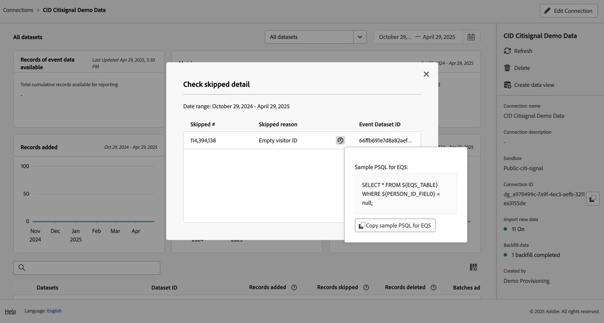

# Gestire le connessioni

Una volta che [ha creato o modificato una o più connessioni](/help/connections/create-connection.md), puoi gestirli in **[!UICONTROL Connections]**. Le connessioni consentono di:

* Visualizza subito tutte le connessioni, inclusi il proprietario, la sandbox e quando sono state create e modificate.
* Modificare una connessione.
* Eliminare una connessione.
* Creare una visualizzazione dati a partire da una connessione.
* Visualizza tutti i set di dati in una connessione.
* Controlla lo stato dei set di dati della connessione e lo stato del processo di acquisizione. Ad esempio, quando sono disponibili i dati in modo da poter iniziare con il reporting e l’analisi in Analysis Workspace.
* Identifica eventuali discrepanze di dati dovute a configurazione errata. Vi mancano delle righe? In caso affermativo, quali righe mancano e perché? Hai configurato in modo errato le connessioni e causato la mancanza di dati nel Customer Journey Analytics?
* Ottieni informazioni sull’utilizzo delle righe acquisite e segnalabili in tutte le connessioni.

[!UICONTROL Connections] dispone di due interfacce: [[!UICONTROL List]](#list) e [[!UICONTROL Usage]](#usage).

## Elenco

Il [!UICONTROL List] è l&#39;interfaccia predefinita per Connessioni. Se non è selezionata, selezionare **[!UICONTROL List]** per accedere all’interfaccia.

Il [!UICONTROL List] interfaccia mostra una tabella di tutte le connessioni disponibili. È possibile cercare rapidamente una connessione utilizzando il comando Cerca  casella.

Nella tabella sono disponibili le colonne o le icone seguenti.

| Colonna o icona | Descrizione |
| --- | --- |
| [!UICONTROL Name] | Il nome descrittivo della connessione. Per visualizzare i dettagli della connessione, selezionare il nome del collegamento ipertestuale. Consulta [Dettagli di connessione](#connection-details). |
|  | Per visualizzare informazioni su [!UICONTROL Datasets included], [!UICONTROL Sandbox], [!UICONTROL Owner]e altro ancora, seleziona  accanto al nome della connessione.
Una finestra pop-up visualizza i dettagli. 
 |
|  | A [creare una visualizzazione dati](#create-a-data-view) per la connessione, seleziona . Questa icona viene visualizzata solo se alla connessione non è già associata alcuna visualizzazione dati. |
|  | Seleziona  a: 
 [Modifica](#edit-a-connection) una connessione.
 [Elimina](#delete-a-connection) una connessione.
 [Creare una nuova visualizzazione dati](#create-a-data-view). Per creare visualizzazioni dati aggiuntive per la connessione. |
| [!UICONTROL Datasets] | Mostra uno o più collegamenti ai set di dati che fanno parte della connessione. Puoi selezionare il collegamento ipertestuale del set di dati per visualizzare il set di dati nella connessione. Se la connessione selezionata contiene più set di dati, seleziona **[!UICONTROL +*x *altro]**per visualizzare un **[!UICONTROL Datasets included]**pannello. Questo pannello mostra i collegamenti a tutti i set di dati e un’opzione per cercare un set di dati specifico che fa parte della connessione.

Selezionando un nome per un set di dati si apre il set di dati nell’interfaccia utente di Experience Platform in una nuova scheda. |
| [!UICONTROL Sandbox] | Mostra il [Sandbox di Experience Platform](https://experienceleague.adobe.com/docs/experience-platform/sandbox/home.html?lang=it) da cui questa connessione attinge i relativi set di dati. Questa sandbox è stata selezionata al momento della creazione della connessione. Non può essere modificato. |
| [!UICONTROL Owner] | Persona che ha creato la connessione. |
| [!UICONTROL Import new data] | Mostra lo stato dell’importazione di nuovi dati per i set di dati: 
)    **[!UICONTROL _x _On]**per i set di dati configurati per l’importazione di nuovi dati e
   **[!UICONTROL _x disattivato_]** per i set di dati non configurati per l’importazione di nuovi dati. |
| [!UICONTROL Date created] | Il timestamp in cui è stata creata la connessione. |
| [!UICONTROL Last modified] | Il timestamp dell’ultimo aggiornamento della connessione. |
| [!UICONTROL Backfill data] | Mostra lo stato dei dati di backfill tra set di dati.
   **[!UICONTROL _x _backfill non riuscito]**per il numero di backfill non riusciti tra set di dati,
   **[!UICONTROL _x _elaborazione backfill]**per il numero di backfill di elaborazione tra set di dati,
   **[!UICONTROL _x _backfill completati]**per il numero di backfill completati per i set di dati, e
   **[!UICONTROL _Disattivato_]** nel caso in cui non siano definiti backfill per i set di dati nella connessione. |

Per configurare le colonne da visualizzare, seleziona , che mostra **Personalizza tabella** consente di attivare o disattivare le colonne nella tabella.

### Modificare una connessione

1. Seleziona  accanto al nome della connessione
1. Seleziona  **[!UICONTROL Edit]** dal menu di scelta rapida.

In alternativa, è possibile:

1. Selezionare la riga di connessione.

1. Seleziona  **[!UICONTROL Edit]** dalla barra blu.

Durante la modifica di una connessione è possibile:

* Avviare e interrompere l&#39;importazione di nuovi dati.
* Rinominare una connessione.
* Aggiornare i set di dati.
* Rimuovere i set di dati dalle connessioni.

Consulta [Creare o modificare una connessione](create-connection.md) per ulteriori informazioni.

### Eliminare una connessione {#connections-delete}

1. Seleziona  accanto al nome della connessione.
1. Seleziona  **[!UICONTROL Delete]**.

In alternativa, è possibile:

1. Selezionare la riga di connessione.

1. Seleziona  **[!UICONTROL Delete]** dalla barra blu.

Quando si elimina una connessione, **[!UICONTROL Delete connection]** indica quali visualizzazioni dati vengono eliminate e quali progetti workspace sono interessati.

Seleziona **[!UICONTROL Continue]** per eliminare la connessione.

Consulta [Implicazioni dell’eliminazione](/help/technotes/deletion.md) per ulteriori informazioni sull&#39;eliminazione di una connessione.

### Creare una visualizzazione dati per una connessione

* Se alla connessione non è associata alcuna visualizzazione dati:

   1. Seleziona  accanto al nome della connessione.

* Se per la connessione sono già state create una o più visualizzazioni dati:

   1. Seleziona  accanto al nome della connessione.
   1. Seleziona  **[!UICONTROL Create new data view]**.

In alternativa, è possibile:

1. Selezionare la riga di connessione.

1. Seleziona  **[!UICONTROL Create data view]** dalla barra dei pulsanti blu.

Per ulteriori informazioni, consulta [Creare o modificare una visualizzazione dati](/help/data-views/create-dataview.md).

### Dettagli di connessione {#connection-detail}

Per visualizzare i dettagli di una connessione, selezionare un nome di connessione nella tabella connessioni.

L&#39;interfaccia dei dettagli Connessioni fornisce una visualizzazione dettagliata dello stato di una connessione. È possibile:

* Controllare lo stato dei set di dati della connessione e del processo di acquisizione.
* Identificare i problemi di configurazione che possono causare record ignorati o eliminati.
* Vedere quando i dati sono disponibili per il reporting.

| Interfaccia utente | Descrizione |
| --- | --- |
|  [!UICONTROL Edit Connection] | Per modificare i dettagli di una connessione, seleziona  **[!UICONTROL Edit Connection]**. Consulta [Creare o modificare una connessione](create-connection.md) per ulteriori informazioni. |
| Selettore set di dati | Consente di scegliere uno o tutti i set di dati della connessione. Non è possibile selezionare più set di dati. Predefinito su [!UICONTROL All datasets]. |
| Selettore intervallo di date | Modifica la data di inizio, la data di fine o seleziona  per aprire il selettore intervallo di dati. Nel selettore intervallo di date, seleziona un intervallo di date utilizzando uno dei periodi predefiniti (ad esempio **[!UICONTROL Last 6 months]**) o utilizza il calendario per selezionare la data di inizio e la data di fine. Seleziona **[!UICONTROL Apply]** per applicare il nuovo intervallo di dati. |
| [!UICONTROL Records of event data available] | Il numero totale di righe del set di dati evento disponibili per il reporting, **per l’intera connessione**. Questo conteggio è indipendente da qualsiasi impostazione del calendario. Il conteggio cambia se selezioni un set di dati dal selettore o selezionando un set di dati nella tabella. Una volta aggiunti i dati, vi è una latenza di 1-2 ore per far sì che vengano visualizzati nel reporting. |
| [!UICONTROL Metrics] | Riepiloga i record di eventi, ricerche e set di dati di profilo che vengono aggiunti, saltati ed eliminati e il numero di batch aggiunti, **per il set di dati e l’intervallo di date selezionati**.
Seleziona **[!UICONTROL Check detail]** per visualizzare **[!UICONTROL Check skipped detail]** popup. Il pop-up elenca il numero di record saltati e il motivo di tutti i set di dati evento o di tutti i set di dati selezionati.

Seleziona  pop-up con ulteriori informazioni. Per alcuni motivi saltati, come [!UICONTROL Empty visitor ID], nel pop-up viene visualizzato il file PSQL di esempio per gli SQA (Experience Platform per Query Service) che puoi utilizzare in [Servizio query](https://experienceleague.adobe.com/docs/experience-platform/query/home.html?lang=it) per eseguire una query per i record ignorati nel set di dati. Seleziona  **[!UICONTROL Copy sample PSQL for EQS]** per copiare l&#39;istruzione SQL. |
| [!UICONTROL Records added] | Indica quante righe sono state aggiunte nel periodo di tempo selezionato, **per il set di dati e l’intervallo di date selezionati**. Aggiornato ogni 10 minuti. |
| [!UICONTROL Records skipped] | Indica quante righe sono state saltate nel periodo di tempo selezionato, **per il set di dati e l’intervallo di date selezionati**. I motivi per cui i record vengono ignorati includono: marche temporali mancanti, ID persona mancante o non valido e così via. Aggiornato ogni 10 minuti. 
ID persona non validi (ad esempio `undefined`, o `00000000`o una combinazione di numeri e lettere in un [!UICONTROL Person ID] che appare in un evento più di 1 milione di volte in un dato mese) sono ID che non possono essere attribuiti a un utente o persona specifica. Queste righe non possono essere acquisite nel sistema e generano acquisizione e reporting soggetti a errori. Per correggere gli ID persona non validi, hai 3 possibilità:<ul><li>Utilizzare [Stitching](/help/stitching/overview.md) per popolare gli ID utente non definiti o composti solo da zeri con ID utente validi.</li><li>Rimuovi l’ID utente, che viene quindi ignorato durante l’acquisizione (da preferire agli ID utente non validi o agli ID composti solo da zeri).</li><li>Correggi eventuali ID utente non validi nel sistema prima di acquisire i dati.</li></ul> |
| [!UICONTROL Records] eliminato | Indica quante righe sono state eliminate nel periodo di tempo selezionato, **per il set di dati e l’intervallo di date selezionati**. Qualcuno potrebbe aver eliminato un set di dati in [!DNL Experience Platform], ad esempio. Aggiornato ogni 10 minuti.
In alcuni scenari, questo valore può includere anche i record sostituiti, ad esempio con l’unione o alcuni aggiornamenti dei set di dati di ricerca. Prendi in considerazione questo esempio:
<ul><li>Carichi un record in un set di dati Profilo individuale XDM, che CJA è configurato per acquisire come dati di ricerca del profilo. Nei dettagli della connessione, questo set di dati visualizzerebbe 1 record aggiunto.</li><li>Carichi un duplicato del record originale nello stesso set di dati AEP, che ora contiene due record. CJA acquisisce il record aggiuntivo dal set di dati di ricerca del profilo. Poiché nella connessione è già stato acquisito un record di profilo per tale ID persona, CJA elimina la versione precedente e aggiunge i nuovi dati del profilo. Nei dettagli della connessione, questa azione rappresenterebbe 1 record aggiunto e 1 record eliminato, perché CJA mantiene solo i dati di ricerca del profilo più recenti per qualsiasi ID persona acquisito.</li><li>In totale, il set di dati AEP contiene due record che risultano identici. Separatamente, i dettagli della connessione CJA visualizzano lo stato dei relativi dati acquisiti: 2 record aggiunti e 1 record eliminato per questo set di dati profilo. </li></ul> |
|  _Cerca nome o ID set di dati_ | Campo di ricerca del set di dati. Puoi cercare la tabella dei set di dati per nome o [!UICONTROL Dataset ID]. |
| [!UICONTROL Datasets table] | Mostra i set di dati che fanno parte della connessione. |
| [!UICONTROL Datasets] | Mostra il nome del set di dati che fa parte della connessione. Puoi selezionare il collegamento ipertestuale per aprire il set di dati nell’interfaccia utente di Experience Platform in una nuova scheda. Puoi selezionare la riga o la casella di controllo per visualizzare i dettagli solo per il set di dati selezionato. |
| [!UICONTROL Dataset ID] | Generato automaticamente da Experience Platform. |
| [!UICONTROL Records added] | Il numero di record del set di dati (righe) aggiunti a una connessione durante l’intervallo di tempo selezionato. |
| [!UICONTROL Records skipped] | Il numero di record del set di dati (righe) ignorati durante il trasferimento di dati per una connessione durante l’intervallo di tempo selezionato. |
| [!UICONTROL Records deleted] | Numero di record di set di dati (righe) rimossi da una connessione durante l’intervallo di tempo selezionato. |
| [!UICONTROL Batches added] | Il numero di batch di set di dati è stato aggiunto a una connessione. |
| [!UICONTROL Last added] | La marca temporale dell’ultimo batch del set di dati aggiunto a una connessione. |
| [!UICONTROL Data source type] | Tipo di origine del set di dati. Quando si crea una connessione, è possibile definire il tipo di origine. |
| [!UICONTROL Dataset type] | Tipo di set di dati per questo set di dati. Il tipo può essere [!UICONTROL Event], [!UICONTROL Lookup], o [!UICONTROL Profile]. [Ulteriori informazioni](https://experienceleague.adobe.com/docs/analytics-platform/using/cja-connections/create-connection.html?lang=it#configure-dataset) |
| Schema | Schema di Experience Platform su cui si basa il set di dati. |
| [!UICONTROL Import new data] | Mostra lo stato dell’importazione di nuovi dati per il set di dati: 
   **[!UICONTROL _x _On]**se il set di dati è configurato per l’importazione di nuovi dati e
   **[!UICONTROL _x disattivato_]** se il set di dati è configurato per non importare nuove importazioni di dati. |
| [!UICONTROL Transform data] | Mostra lo stato di trasformazione dei set di dati di ricerca B2B applicabili. Per ulteriori informazioni, consulta [Trasformare i set di dati per le ricerche B2B](transform-datasets-b2b-lookups.md).
   **[!UICONTROL _x _On]**per i set di dati applicabili abilitati per la trasformazione, 
   **[!UICONTROL _x disattivato_]** per i set di dati applicabili non abilitati per la trasformazione, e
**[!UICONTROL N/A]** per tutti gli altri set di dati, non applicabile per la trasformazione. |
| [!UICONTROL Backfill data] | Mostra lo stato dei dati di backfill per il set di dati.
   **[!UICONTROL _x _backfill non riuscito]**per il numero di backfill non riusciti,
   **[!UICONTROL _x _elaborazione backfill]**per il numero di backfill processing,
   **[!UICONTROL _x _backfill completati]**per il numero di backfill completati e
   **[!UICONTROL _Disattivato_]** nel caso in cui non sia configurato alcun backfill. |
| [!UICONTROL Import new data] | Mostra lo stato dell’importazione di nuovi dati per il set di dati: 
   **[!UICONTROL _x _On]**se il set di dati è configurato per l’importazione di nuovi dati e
   **[!UICONTROL _x disattivato_]** se il set di dati è configurato per non importare nuovi dati. |
| [!UICONTROL Backfill data] | Mostra lo stato dei dati di backfill per il set di dati.
   **[!UICONTROL _x _backfill non riuscito]**per il numero di backfill non riusciti,
   **[!UICONTROL _x _elaborazione backfill]**per il numero di backfill processing,
   **[!UICONTROL _x _backfill completati]**per il numero di backfill completati e
   **[!UICONTROL _Disattivato_]** nel caso in cui non sia configurato alcun backfill. |

>[!IMPORTANT]
>
>Eventuali dati acquisiti prima del 13 agosto 2021 non vengono riflessi nel [!UICONTROL Connections] di rete.

#### Pannello Connessione

Quando nella tabella dei set di dati non è selezionato alcun set di dati, un pannello sul lato destro dell’interfaccia Connessioni mostra le opzioni e i dettagli di connessione.

| Opzioni / Dettagli | Descrizione |
| --- | --- |
|  [!UICONTROL Refresh] | Per aggiornare la connessione e consentire la visualizzazione dei record aggiunti di recente, selezionare  **[!UICONTROL Refresh]**. |
|  **[!UICONTROL Delete]** | [Elimina](#delete-a-connection) questa connessione. |
|  **[!UICONTROL Create data view]** | [Creare una visualizzazione dati](#create-a-data-view) in base a questa connessione. Consulta [Visualizzazioni dati](https://experienceleague.adobe.com/docs/analytics-platform/using/cja-dataviews/data-views.html?lang=it) per ulteriori informazioni. |
| [!UICONTROL Connection name] | Mostra il nome descrittivo della connessione. |
| [!UICONTROL Connection description] | Mostra una descrizione più dettagliata che descrive lo scopo della connessione. |
| [!UICONTROL Sandbox] | Il [Sandbox di Experience Platform](https://experienceleague.adobe.com/docs/experience-platform/sandbox/home.html?lang=it) da cui questa connessione attinge i relativi set di dati. Questa sandbox è stata selezionata al momento della creazione della connessione. Non può essere modificato. |
| [!UICONTROL Connection ID] | Questo ID viene generato in Experience Platform. È possibile utilizzare  per copiare l&#39;ID. |
| [!UICONTROL Data views using connection] | Elenca tutte le visualizzazioni dati che utilizzano questa connessione. |
| [!UICONTROL Import new data] | Mostra lo stato dell’importazione di nuovi dati per i set di dati: 
   **[!UICONTROL _x _On]**per quanti set di dati sono configurati per l’importazione di nuovi dati e
   **[!UICONTROL _x disattivato_]** per quanti set di dati viene disattivata l’importazione di nuovi dati. |
| [!UICONTROL Backfill data] | Mostra lo stato dei dati di retrocompilazione per i set di dati.
   **[!UICONTROL _x _backfill non riuscito]**per il numero di backfill non riusciti tra set di dati,
   **[!UICONTROL _x _elaborazione backfill]**per il numero di backfill di elaborazione tra set di dati,
   **[!UICONTROL _x _backfill completati]**per il numero di backfill completati per i set di dati, e
   **[!UICONTROL _Disattivato_]** nel caso in cui non siano definiti backfill per i set di dati nella connessione. |
| Trasformare i dati | Mostra lo stato di trasformazione dei set di dati di ricerca B2B applicabili. Per ulteriori informazioni, consulta [Trasformare i set di dati per le ricerche B2B](transform-datasets-b2b-lookups.md).
   **[!UICONTROL _x _On]**per il numero di set di dati abilitati per la trasformazione. |
| [!UICONTROL Created by] | Mostra il nome della persona che ha creato la connessione. |
| [!UICONTROL Last modified] | Mostra la marca temporale dell’ultima modifica apportata alla connessione. |
| [!UICONTROL Last modified by] | Mostra l’ultimo utente che ha modificato la connessione. |

#### Pannello Set di dati

Quando un set di dati viene selezionato nella tabella dei set di dati, in un pannello sul lato destro dell’interfaccia Connessioni vengono visualizzati i dettagli del set di dati selezionato.

| Dettagli | Descrizione |
| --- | --- |
| [!UICONTROL Person ID] | Mostra un’identità definita nello schema del set di dati in Experience Platform. Questa identità è l’ID persona selezionato durante la creazione della connessione. Se crei una connessione che include set di dati con ID diversi, il reporting lo riflette. Per unire i set di dati, devi utilizzare lo stesso ID persona in tutti i set di dati. |
| [!UICONTROL Key] | Mostra la chiave specificata per un set di dati di ricerca. |
| [!UICONTROL Matching Key] | Mostra la chiave corrispondente specificata per un set di dati di ricerca. |
| [!UICONTROL Timestamp] | Mostra la marca temporale definita per un set di dati evento. |
| [!UICONTROL Records available] | Mostra il numero totale di righe acquisite per questo set di dati, per il particolare periodo di tempo selezionato nel calendario. Non esiste alcuna latenza in termini di visualizzazione dei dati nel reporting, una volta aggiunti. Tuttavia, quando crei una connessione nuova, esiste [latenza](https://experienceleague.adobe.com/docs/analytics-platform/using/cja-overview/cja-faq.html?lang=it#3.-getting-data-into-customer-journey-analytics). |
| [!UICONTROL Records added] | Mostra quante righe sono state aggiunte nel periodo di tempo selezionato. |
| [!UICONTROL Records deleted] | Mostra quanti record sono stati eliminati durante il periodo di tempo selezionato. |
| [!UICONTROL Batches added] | Mostra quanti batch di dati sono stati aggiunti a questo set di dati. |
| [!UICONTROL Records skipped] | Mostra quante righe sono state saltate durante l’acquisizione nel periodo di tempo selezionato.
I motivi per cui i record vengono ignorati includono: marche temporali mancanti, ID persona mancante o non valido e così via. Aggiornato ogni 10 minuti.
ID persona non validi (ad esempio `undefined`, o `00000000`o una combinazione di numeri e lettere in un [!UICONTROL Person ID] che appare in un evento più di 1 milione di volte in un dato mese) sono ID che non possono essere attribuiti a un utente o persona specifica. Queste righe non possono essere acquisite nel sistema e generano acquisizione e reporting soggetti a errori. Per correggere gli ID persona non validi, hai 3 possibilità:<ul><li>Utilizzare [Stitching](/help/stitching/overview.md) per popolare gli ID utente non definiti o composti solo da zeri con ID utente validi.</li><li>Rimuovi l’ID utente, che viene quindi ignorato durante l’acquisizione (da preferire agli ID utente non validi o agli ID composti solo da zeri).</li><li>Correggi eventuali ID utente non validi nel sistema prima di acquisire i dati.</li></ul> |
| [!UICONTROL Last added] | Mostra quando è stato aggiunto l’ultimo batch. |
| [!UICONTROL Import new data] | Mostra lo stato dell’importazione di nuovi dati per il set di dati: 
   **[!UICONTROL _x _On]**se il set di dati è configurato per l’importazione di nuovi dati e
   **[!UICONTROL _x disattivato_]** se il set di dati è configurato per non importare nuovi dati. |
| [!UICONTROL Backfill data] | Mostra lo stato dei dati di backfill per il set di dati.
   **[!UICONTROL _x _backfill non riuscito]**per il numero di backfill non riusciti,
   **[!UICONTROL _x _elaborazione backfill]**per il numero di backfill processing,
   **[!UICONTROL _x _backfill completati]**per il numero di backfill completati e
   **[!UICONTROL _Disattivato_]** nel caso in cui non sia configurato alcun backfill.
Per visualizzare una finestra di dialogo con una panoramica dei precedenti backfill per il set di dati, seleziona  **[!UICONTROL Past backfills]**. |
| [!UICONTROL Data source type] | Tipo di origine dati definito durante l’aggiunta del set di dati alla connessione. |
| [!UICONTROL Dataset type] | [!UICONTROL Event], [!UICONTROL Lookup]oppure [!UICONTROL Profile]. [Ulteriori informazioni](https://experienceleague.adobe.com/docs/analytics-platform/using/cja-connections/create-connection.html?lang=it#configure-dataset) |
| [!UICONTROL Schema] | Mostra lo schema di Experience Platform su cui si basa questo set di dati. |
| [!UICONTROL Dataset ID] | Questo ID del set di dati viene generato in Experience Platform. |

## Utilizzo

Il [!UICONTROL Usage] L’interfaccia di mostra l’utilizzo delle righe acquisite e segnalabili in tutte le connessioni. Questa interfaccia consente di determinare se l&#39;utilizzo del Customer Journey Analytics è conforme ai termini contrattuali.

Seleziona la **[!UICONTROL Usage]** per accedere all’interfaccia.

### Report sull’utilizzo

1. Seleziona un **[!UICONTROL Time range]**. Puoi scegliere tra **[!UICONTROL Last 6 months]**, **[!UICONTROL Year to date]**, o **[!UICONTROL Last 2 Years]**.
1. Seleziona un **[!UICONTROL Interval]**. Puoi scegliere tra **[!UICONTROL Monthly]** o **[!UICONTROL Quarterly]**.

Per [!UICONTROL Ingested rows]:

* Un pannello visualizza il totale delle righe acquisite che includono tutti i dati degli eventi in tutte le connessioni aggiornate ogni secondo giorno del mese. All’interno del pannello:
   * in una casella vengono visualizzati il numero di righe acquisite nell’ultimo mese e la modifica in % (indicata da ▲ o ▼) rispetto al mese precedente.
   * un grafico a linee mostra la ◼︎ [!UICONTROL Monthly ingested rows]. Per visualizzare una finestra a comparsa che mostra il numero di righe acquisite mensilmente per un mese, passa il cursore del mouse su un punto dati nel grafico a linee.

Per [!UICONTROL Reportable rows]:

* Un pannello visualizza il totale delle righe segnalabili che includono tutti i dati degli eventi in tutte le connessioni aggiornate ogni due giorni del mese. All’interno del pannello:
   * in una casella viene visualizzato il numero totale cumulativo di righe da segnalare.
   * in una casella viene visualizzato il numero totale di righe da segnalare per l&#39;ultimo mese e la variazione in % (indicata da ▲ o ▼) rispetto al mese precedente.
   * un grafico a linee mostra la ◼︎ [!UICONTROL Monthly reportable rows]. Per visualizzare un popup che visualizza il numero di righe segnalabili cumulative per un mese specifico, passa il cursore del mouse su un punto dati nel grafico a linee.
   * un grafico a linee mostra la ◼︎ [!UICONTROL Cumulative reportable rows]. Per visualizzare una finestra a comparsa che mostra il numero di righe mensili da segnalare per un mese, passa il cursore del mouse su un punto dati nel grafico a linee.

>[!MORELIKETHIS]
>
>[Visualizzare, risolvere i problemi e modificare le impostazioni di connessione](https://experienceleague.adobe.com/docs/customer-journey-analytics-learn/tutorials/connections/connections-details-experience-in-cja.html) esercitazione.
