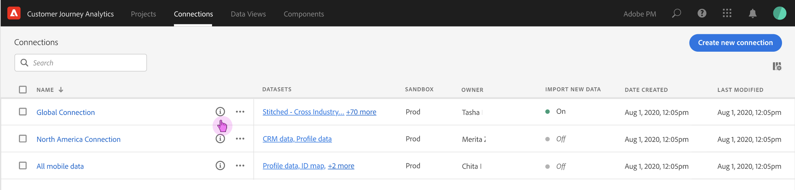

# Gestire le connessioni

Una volta che gli utenti Amministratore hanno [creato una o più connessioni](/help/connections/create-connection.md), puoi gestirle all’interno di [!UICONTROL Connections] Manager. L’ultimo aggiornamento dell’esperienza di connessione aggiunge due funzionalità importanti nella pagina Dettagli connessione, descritta più in basso in questa pagina:

* Ti consente di controllare lo **stato dei set di dati della connessione e del processo di acquisizione**. Questo controllo di stato ti consente di sapere quando i dati sono disponibili in modo da poter accedere ad Analysis Workspace e avviare l’analisi.

* Ti permette di **identificare eventuali discrepanze di dati** a causa di configurazione errata. Vi mancano delle righe? In caso affermativo, quali righe mancano e perché? Hai configurato in modo errato le connessioni e causato la mancanza di dati in CJA?

Ecco un video sulla nuova funzione Gestione connessioni:

>[!VIDEO](https://video.tv.adobe.com/v/342097/?quality=12&learn=on)

## Gestione connessioni {#connections-manager}

Gestione connessioni consente di:

* Visualizza immediatamente tutte le tue connessioni, inclusi il proprietario, la sandbox e quando sono state create e modificate.
* Visualizza tutti i set di dati in una connessione.
* Controlla lo stato di una connessione.
* Eliminare una connessione.
* Rinominare una connessione.
* Creare una visualizzazione dati a partire da una connessione.

### Impostazioni del Gestore di connessione

| Impostazione | Descrizione |
| --- | --- |
| [!UICONTROL Name] | Il nome descrittivo della connessione. Quando fai clic sul nome del collegamento ipertestuale, accedi alla pagina dei dettagli della connessione descritta di seguito. |
| Informazioni di connessione | Fai clic sull’icona info accanto al nome della connessione per visualizzare le seguenti informazioni: |
| Modificare una connessione | Fai clic sui puntini di sospensione (…) accanto al nome della connessione, quindi fai clic su [!UICONTROL Edit]. Per ulteriori informazioni, consulta “Modifica connessione” di seguito. |
| Eliminare una connessione | Fai clic sui puntini di sospensione (…) accanto al nome della connessione, quindi fai clic su [!UICONTROL Delete]. Ulteriori informazioni sono disponibili nell&#39;intestazione “Elimina connessioni” di seguito. |
| Creare una visualizzazione dati | Fai clic sui puntini di sospensione (…) accanto al nome della connessione, quindi fai clic su [!UICONTROL Create data view]. Questa azione crea una nuova visualizzazione dati basata su questa connessione. [Ulteriori informazioni](https://experienceleague.adobe.com/docs/analytics-platform/using/cja-dataviews/data-views.html?lang=it) |
| [!UICONTROL Datasets] | Set di dati che fanno parte della connessione. È possibile fare clic sul collegamento ipertestuale per visualizzare tutti i set di dati presenti nella connessione. Facendo clic su un set di dati si apre tale set di dati in Adobe Experience Platform, in una nuova scheda. |
| [!UICONTROL Sandbox] | La [Sandbox Adobe Experience Platform](https://experienceleague.adobe.com/docs/experience-platform/sandbox/home.html?lang=it) da cui questa connessione attinge i relativi set di dati. Questa sandbox è stata selezionata al momento della creazione della connessione. Non può essere modificato. |
| [!UICONTROL Owner] | Persona che ha creato la connessione. |
| [!UICONTROL Import Data Sets] | Consente di abilitare o disabilitare ciò che veniva chiamato “streaming dati”. |
| [!UICONTROL Date Created] | Data della prima creazione della connessione. |
| [!UICONTROL Last Modified] | Data dell’ultimo aggiornamento della connessione. |

### Eliminare le connessioni {#connections-delete}

Solo gli amministratori dispongono delle autorizzazioni per eliminare una connessione. Questa azione non viene visualizzata per i non amministratori.

1. Fai clic sui puntini di sospensione (…) accanto al nome della connessione.
1. Fai clic su [!UICONTROL Delete].

Quando si elimina una connessione in [!UICONTROL Customer Journey Analytics], un messaggio di errore indica che:

* Tutte le visualizzazioni dati create in base alla connessione eliminata non funzionano più.
* Analogamente, tutti i progetti Workspace che dipendono dalle visualizzazioni dati nella connessione eliminata cesseranno di funzionare.

[Ulteriori informazioni](/help/getting-started/cja-deletion.md) sulle implicazioni relative all’eliminazione.

### Cercare una connessione o un set di dati

Puoi cercare le connessioni utilizzando la barra di ricerca nella parte superiore, sotto il titolo della [!UICONTROL Connections].

### Ordinare le connessioni

Puoi ordinare le connessioni facendo clic sull’intestazione di ogni colonna e ordinandole in alto o in basso.

## Pagina Dettagli connessione {#connection-detail}

La nuova pagina Dettagli connessioni fornisce una visualizzazione molto dettagliata dello stato di una connessione.

Consente di:

* Controllare lo stato dei set di dati della connessione e del processo di acquisizione.
* Identificare i problemi di configurazione che portano a record saltati o eliminati.
* Vedere quando i dati sono disponibili per il reporting.

>[!IMPORTANT]
>Eventuali dati acquisiti prima del 13 agosto 2021 non vengono riflessi in questa finestra di dialogo [!UICONTROL Connections].

Ecco i widget e le impostazioni spiegate:

### Impostazioni dei dettagli di connessione

| Widget/Impostazione | Descrizione |
| --- | --- |
| Selettore set di dati | Consente di scegliere uno o tutti i set di dati della connessione. Non è possibile selezionare più set di dati. Predefinito su [!UICONTROL All datasets]. |
| Calendario/Intervalli di date | L’intervallo di date indica quando hai aggiunto dati alla connessione. Sono inclusi tutti i predefiniti calendario standard. Puoi personalizzare l’intervallo di date, ma nel menu a discesa non viene visualizzato alcun intervallo di date personalizzato. |
| [!UICONTROL Records of event data available] widget | Rappresenta il numero totale di righe del set di dati evento disponibili per il reporting, **per l’intera connessione**. Questo conteggio è indipendente da qualsiasi impostazione del calendario. Cambia se selezioni un set di dati dal selettore o selezionando un set di dati nella tabella. (Tieni presente che, una volta aggiunto, i dati vengono visualizzati nel reporting con una latenza di 1-2 ore.) |
| [!UICONTROL Metrics] widget | Riepiloga i record evento aggiunti/saltati/eliminati e il numero di batch aggiunti, **per il set di dati e l’intervallo di date selezionati**. |
| [!UICONTROL Records added] widget | Indica quante righe sono state aggiunte nel periodo di tempo selezionato, **per il set di dati e l’intervallo di date selezionati**. Aggiornato ogni 10 minuti. **Nota**: dati per **[!UICONTROL Records added]** include solo i dati evento al momento, non i dati di profilo o di ricerca. |
| [!UICONTROL Records skipped] widget | Indica quante righe sono state saltate nel periodo di tempo selezionato, **per il set di dati e l’intervallo di date selezionati**. I motivi per cui i record vengono ignorati sono i seguenti: marche temporali mancanti, ID persona mancante o non valido, ecc. Aggiornato ogni 10 minuti.
ID persona non validi (ad esempio “non definito” o “00000000”, o qualsiasi combinazione di numeri e lettere in un [!UICONTROL Person ID] che appare in un evento più di 1 milione di volte in un dato mese) non possono essere attribuiti a un utente o persona specifica. Non possono essere acquisiti nel sistema e generano acquisizione e reporting soggetti a errori. Per correggere gli ID persona non validi, hai 3 possibilità:<ul><li>Utilizza [Cross-Channel Analytics](/help/cca/overview.md) per popolare gli ID utente non definiti o composti solo da zeri con ID utente validi.</li><li>Rimuovi l’ID utente, che verrà ignorato anche durante l’acquisizione (da preferire agli ID utente non validi o agli ID composti solo di zeri).</li><li>Correggi eventuali ID utente non validi nel sistema prima di acquisire i dati.</li></ul>
**Nota**: dati di **[!UICONTROL Records skipped]** include solo i dati evento al momento, non i dati di profilo o di ricerca. |
| [!UICONTROL Records deleted] widget | Indica quante righe sono state eliminate nel periodo di tempo selezionato, **per il set di dati e l’intervallo di date selezionati**. Per esempio, qualcuno potrebbe aver eliminato un set di dati in Experience Platform. Aggiornato ogni 10 minuti. **Nota**: dati di **[!UICONTROL Records deleted]** include solo i dati evento del momento, non i dati di profilo o di ricerca. |
| Casella di ricerca di set di dati | Puoi eseguire ricerche per nome o [!UICONTROL Dataset ID] del set di dati. |
| [!UICONTROL Datasets] | Mostra i set di dati che fanno parte della connessione. È possibile fare clic sul collegamento ipertestuale per visualizzare tutti i set di dati presenti nella connessione. |
| [!UICONTROL Dataset ID] | Questo ID viene generato automaticamente da Adobe Experience Platform. |
| [!UICONTROL Batches] | Indica quanti batch di dati sono stati aggiunti a questo set di dati. |
| [!UICONTROL Last added] | Mostra la marca temporale dell’ultimo batch aggiunto a questo set di dati. |
| [!UICONTROL Dataset type] | Il tipo di questo set di dati può essere [!UICONTROL Event], [!UICONTROL Lookup] oppure [!UICONTROL Profile]. [Ulteriori informazioni](https://experienceleague.adobe.com/docs/analytics-platform/using/cja-connections/create-connection.html?lang=it#configure-dataset) |
| Schema | Lo schema Adobe Experience Platform su cui si basano i set di dati in questa connessione. |

### Impostazioni della barra a destra a livello di connessione

| Impostazione | Descrizione |
| --- | --- |
| [!UICONTROL Refresh] | Aggiorna la connessione per consentire la visualizzazione dei record aggiunti di recente. |
| [!UICONTROL Delete] | Elimina la connessione. |
| [!UICONTROL Create data view] | Crea una nuova visualizzazione dati basata su questa connessione. [Ulteriori informazioni](https://experienceleague.adobe.com/docs/analytics-platform/using/cja-dataviews/data-views.html?lang=it) |
| [!UICONTROL Connection name] | Mostra il nome descrittivo della connessione. |
| [!UICONTROL Connection description] | Mostra una descrizione più dettagliata che descrive idealmente lo scopo di questa connessione. |
| [!UICONTROL Sandbox] | La [sandbox Adobe Experience Platform](https://experienceleague.adobe.com/docs/experience-platform/sandbox/home.html?lang=it) da cui questa connessione attinge i relativi set di dati. Questa sandbox è stata selezionata al momento della creazione della connessione. Non può essere modificato. |
| [!UICONTROL Connection ID] | Questo ID è generato dal sistema in Adobe Experience Platform. |
| [!UICONTROL Data views using connection] | Elenca tutte le visualizzazioni dati che utilizzano questa connessione. |
| [!UICONTROL Import new data] | (On/Off) indica se è necessario aggiungere o meno nuovi batch di dati ai dati storici (backfill). |
| [!UICONTROL Backfill data] | I dati di backfill (storici) vengono tracciati in 3 stati: [!UICONTROL In queue], [!UICONTROL In progress] (con percentuale di avanzamento indicata) e [!UICONTROL Complete]. |
| [!UICONTROL Created by] | Mostra il nome della persona che ha creato la connessione. |
| [!UICONTROL Last modified] | Mostra la data e l’ora dell’ultima modifica apportata alla connessione. |
| [!UICONTROL Last modified by] | Mostra l’ultimo utente che ha modificato la connessione. |

### Impostazioni della barra a destra a livello di set di dati

| Impostazione | Descrizione |
| --- | --- |
| [!UICONTROL Person ID] | Mostra un’identità definita nello schema del set di dati in Experience Platform. Questo è l’ID persona scelto durante la creazione della connessione. Se crei una connessione che include set di dati con ID diversi, compare anche nel reporting. Per unire in modo efficace i set di dati è necessario utilizzare lo stesso ID persona in tutti. |
| [!UICONTROL Records available] | Rappresenta il numero totale di righe acquisite per questo set di dati, per il particolare periodo di tempo selezionato nel calendario. Non esiste alcuna latenza in termini di visualizzazione dei dati nel reporting, una volta aggiunti. (L’eccezione è che quando crei una connessione nuova, ci sarà [latenza](https://experienceleague.adobe.com/docs/analytics-platform/using/cja-overview/cja-faq.html?lang=it#3.-getting-data-into-customer-journey-analytics). |
| [!UICONTROL Records added] | Indica quante righe sono state aggiunte nel periodo di tempo selezionato. **Nota**: dati per **[!UICONTROL Records added]** include solo i dati evento al momento, non i dati di profilo o di ricerca. |
| [!UICONTROL Records deleted] | Indica quanti record sono stati eliminati durante il periodo di tempo selezionato. **Nota**: dati per **[!UICONTROL Records deleted]** include solo i dati evento al momento, non i dati di profilo o di ricerca. |
| [!UICONTROL Batches added] | Indica quanti batch di dati sono stati aggiunti al set di dati. |
| [!UICONTROL Records skipped] | Indica quante righe sono state saltate durante l’acquisizione nel periodo di tempo selezionato.
I motivi per cui i record vengono ignorati sono i seguenti: marche temporali mancanti, ID persona mancante o non valido, ecc. Aggiornato ogni 10 minuti.
ID persona non validi (ad esempio “non definito” o “00000000”, o qualsiasi combinazione di numeri e lettere in un [!UICONTROL Person ID] che appare in un evento più di 1 milione di volte in un dato mese) non possono essere attribuiti a un utente o persona specifica. Non possono essere acquisiti nel sistema e generano acquisizione e reporting soggetti a errori. Per correggere gli ID persona non validi, hai 3 possibilità:<ul><li>Utilizza [Cross-Channel Analytics](/help/cca/overview.md) per popolare gli ID utente non definiti o composti solo da zeri con ID utente validi.</li><li>Rimuovi l’ID utente, che verrà ignorato anche durante l’acquisizione (da preferire agli ID utente non validi o agli ID composti solo di zeri).</li><li>Correggi eventuali ID utente non validi nel sistema prima di acquisire i dati.</li></ul>
**Nota**: dati per **[!UICONTROL Records skipped]** include solo i dati evento al momento, non i dati di profilo o di ricerca. |
| [!UICONTROL Last added] | Indica quando è stato aggiunto l’ultimo batch. |
| [!UICONTROL Dataset type] | [!UICONTROL Event], [!UICONTROL Lookup]oppure [!UICONTROL Profile]. [Ulteriori informazioni](https://experienceleague.adobe.com/docs/analytics-platform/using/cja-connections/create-connection.html?lang=it#configure-dataset) |
| [!UICONTROL Schema] | Mostra lo schema Adobe Experience Platform su cui si basa il set di dati. |
| [!UICONTROL Dataset ID] | Questo ID è generato dal sistema in Adobe Experience Platform. |

## Modifica connessione

Consente agli amministratori di modificare la connessione. Seleziona una connessione, quindi fai clic su [!UICONTROL Edit Connection] per accedere a questa finestra di dialogo. Qui puoi effettuare le seguenti operazioni:

* Avviare e interrompere l’importazione di nuovi dati. Questo processo era precedentemente noto come “streaming di dati”.
* Rinominare una connessione.
* Aggiornare i set di dati.
* Rimuovere i set di dati dalle connessioni.

