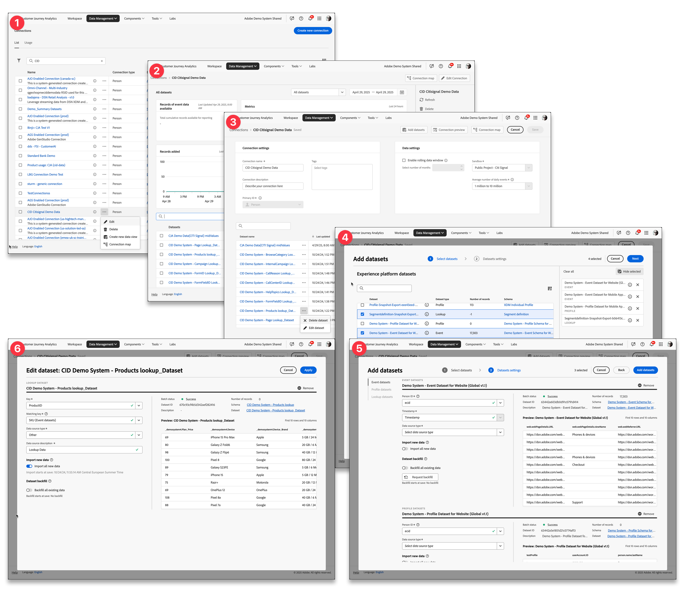

# Panoramica sulle connessioni

Le connessioni consentono agli amministratori di prodotto Customer Journey Analytics di stabilire connessioni con diverse origini dati [!DNL  Experience Platform], ad esempio set di dati evento, ricerca, profilo e riepilogo. Queste connessioni consentono l’integrazione di dati da una connessione a una visualizzazione dati derivata. Le connessioni sono le basi di Customer Journey Analytics e vengono create da [!DNL Experience Platform] set di dati di origine.

>[!IMPORTANT]
>
>È possibile combinare più set di dati [!DNL Experience Platform] in una singola connessione.

## Flusso di lavoro connessioni

<!-- Outdated interface 

>[!BEGINSHADEBOX]

See  [Configuring connections](https://video.tv.adobe.com/v/35111/?quality=12&learn=on){target="_blank"} for a demo video.

>[!ENDSHADEBOX]

-->

Ad alto livello, il flusso di lavoro Connessioni consente di:

| Interfaccia | Descrizione |
|:---:|---|
| ➊  | [Gestisci le tue connessioni e l&#39;utilizzo complessivo](manage-connections.md) di Customer Journey Analytics da Gestione connessioni. |
| ➋  | [Controllare i dettagli di una connessione](manage-connections.md#connection-details), ad esempio i record di set di dati acquisiti, saltati o eliminati. |
| ➌  | [Crea o modifica la configurazione di una connessione](create-connection.md#create-or-edit-a-connection), come una finestra continua di dati, la sandbox da utilizzare, quali set di dati fanno parte della connessione e altro ancora. |
| ➍  | [Aggiungere set di dati a una connessione](create-connection.md#add-datasets). La connessione deve avere almeno un set di dati evento o di riepilogo, ma può contenere diversi set di dati evento, profilo, ricerca e riepilogo. |
| ➎  | [Configurare le impostazioni](create-connection.md#dataset-settings) per i set di dati aggiunti. Puoi determinare come collegare diversi set di dati in base a un comune identificatore basato su persona o su account [!BADGE B2B edition]{type=Informative url="https://experienceleague.adobe.com/en/docs/analytics-platform/using/cja-overview/cja-b2b/cja-b2b-edition" newtab=true tooltip="Customer Journey Analytics B2B edition"}. |
| ➏  | [Modifica le impostazioni per un set di dati esistente](create-connection.md#edit-a-dataset). Puoi sempre rivedere le impostazioni del set di dati in una fase successiva. |

## Controllo degli accessi

L&#39;accesso alla gestione delle connessioni deve essere limitato a un gruppo di gestione di base. Le configurazioni di connessione hanno implicazioni contrattuali per quanto riguarda l’allocazione di volumi per i dati introdotti in Customer Journey Analytics.

>[!MORELIKETHIS]
>
>[Controllo dell&#39;accesso](/help/technotes/access-control.md).

