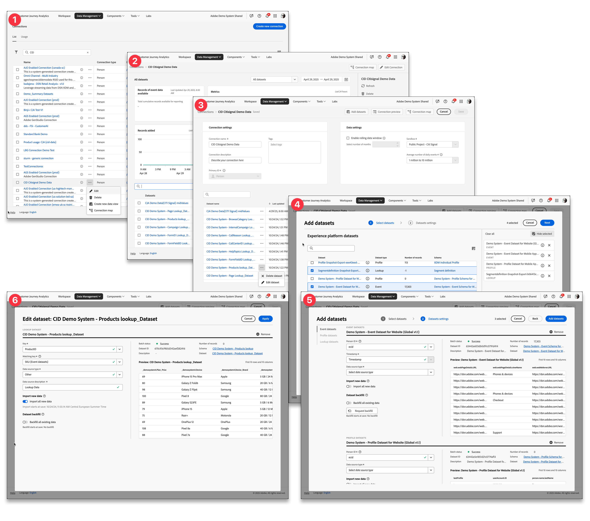

# Panoramica sulle connessioni

Le connessioni consentono agli amministratori di prodotto di Customer Journey Analytics di definire quali origini dati [!DNL  Experience Platform] acquisire, come set di dati di eventi, ricerca, profili e riepilogo. Le connessioni sono alla base di Customer Journey Analytics e determinano la disponibilità dei dati (campi) che è possibile definire in una [visualizzazione dati](/help/data-views/data-views.md) come dimensione o metriche.

>[!IMPORTANT]
>
>È possibile combinare più set di dati [!DNL Experience Platform] in una singola connessione.

## Flusso di lavoro Connessioni

>[!BEGINSHADEBOX]

Vedi  [Connetti a origini dati](https://experienceleague.adobe.com/en/docs/customer-journey-analytics-learn/tutorials/connections/connecting-customer-journey-analytics-to-data-sources-in-platform){target="_blank"} per un video dimostrativo.

>[!ENDSHADEBOX]

A un livello elevato, il flusso di lavoro Connessioni consente di:

| Interfaccia | Descrizione |
|:---:|---|
| ➊ | [Gestire le connessioni e l’utilizzo complessivo](manage-connections.md) di Customer Journey Analytics da Gestione connessioni. |
| ➋ | [Verificare i dettagli di una connessione](manage-connections.md#connection-details), ad esempio i record di set di dati acquisiti, ignorati o eliminati. |
| ➌ | [Creare o modificare la configurazione di una connessione](create-connection.md#create-or-edit-a-connection), come una finestra di dati continua, la sandbox da utilizzare, quali set di dati fanno parte della connessione e altro ancora. |
| ➍ | [Aggiungere set di dati a una connessione](create-connection.md#add-datasets). La connessione deve avere almeno un set di dati di eventi o di riepilogo, ma può contenere diversi set di dati di eventi, profili, ricerca e riepilogo. |
| ➎ | [Configurare le impostazioni](create-connection.md#dataset-settings) per i set di dati aggiunti. Puoi determinare come collegare diversi set di dati in base a un comune identificatore basato su persona o su account [!BADGE B2B Edition]{type=Informative url="https://experienceleague.adobe.com/it/docs/analytics-platform/using/cja-overview/cja-b2b/cja-b2b-edition" newtab=true tooltip="Customer Journey Analytics B2B Edition"}. |
| ➏ | [Modificare le impostazioni per un set di dati esistente](create-connection.md#edit-a-dataset). Puoi sempre rivedere le impostazioni del set di dati in un secondo momento. |

## Controllo degli accessi

L’accesso alla gestione delle connessioni deve essere limitato a un gruppo di gestione di base. Le configurazioni delle connessioni hanno implicazioni contrattuali per quanto riguarda l’assegnazione di volumi per i dati inseriti in Customer Journey Analytics.

>[!MORELIKETHIS]
>
>[Controllo degli accessi](/help/technotes/access-control.md).

