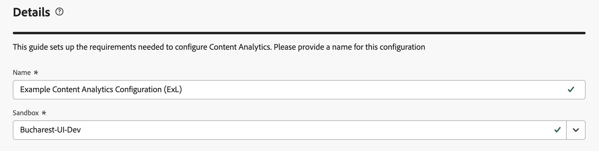
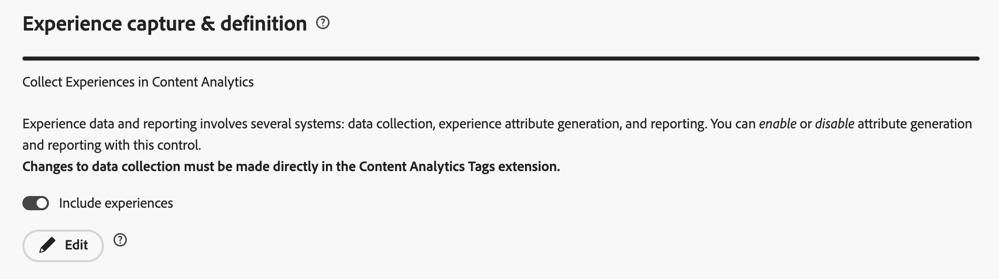

# Configurazione guidata di Content Analytics

La configurazione guidata ti aiuta a configurare Content Analytics in modo rapido e semplice. La configurazione guidata utilizza una procedura guidata per impostare i requisiti necessari per configurare automaticamente Content Analytics per la tua organizzazione. Nella schermata **[!UICONTROL Configurazione]** è possibile creare una nuova configurazione o modificare una configurazione esistente.

>[!IMPORTANT]
>
>Nella tua organizzazione puoi avere una sola configurazione di Content Analytics per sandbox.

>[!NOTE]
>
>La procedura guidata di configurazione supporta più visualizzazioni dati e canali ed è diversa dalla versione precedente, che supportava una sola visualizzazione dati e solo il canale web. È necessario selezionare una sandbox e una connessione prima di poter selezionare una o più visualizzazioni dati nella sezione [Visualizzazioni dati](#data-views). Le configurazioni per **[!UICONTROL Experience Capture]**, **[!UICONTROL Data Collection]** e **[!UICONTROL Header override]** dipendono dal canale e fanno parte di ciascuno dei canali configurati nella sezione [Channels](#channels).

Per accedere alla configurazione di Content Analytics

* Selezionare **[!UICONTROL Gestione dati]** > **[!UICONTROL Configurazione Content Analytics]** dal menu principale di Customer Journey Analytics.

Nella schermata **[!UICONTROL Configurazioni Content Analytics]** è disponibile una tabella delle configurazioni di Content Analytics esistenti.

Per ogni configurazione, sono disponibili i seguenti dettagli:

| Colonna | Descrizione |
|---|---|
| **[!UICONTROL Nome]** | Il nome della configurazione. |
| **[!UICONTROL Creato da]** | L’account tecnico che ha creato la configurazione. |
| **[!UICONTROL Creato il]** | La marca temporale in cui è stata creata la configurazione. |
| **[!UICONTROL Modificato il]** | La marca temporale dell’ultima modifica apportata alla configurazione. |
| **[!UICONTROL Sandbox]** | La sandbox all’interno dell’organizzazione in cui Content Analytics è (dovrà essere) configurato e implementato. |
| **[!UICONTROL Stato]** | Lo stato della configurazione. Lo stato indica per quanti canali abilitati viene completata la configurazione. Utilizza  per aprire un popup con ulteriori dettagli. |

Puoi utilizzare  per personalizzare la tabella. Selezionare le colonne da visualizzare nella finestra di dialogo **[!UICONTROL Personalizza tabella]** e selezionare **[!UICONTROL Applica]** per applicare le modifiche.

Dalla schermata **[!UICONTROL Configurazione]** di Content Analytics, puoi creare una nuova configurazione o modificare una configurazione esistente.

Per creare una nuova configurazione:

* Selezionare **[!UICONTROL Crea configurazione]**. Viene aperta la [configurazione guidata](#guided-configuration-wizard).

Per modificare una configurazione esistente:

* Seleziona  e quindi  **[!UICONTROL Modifica]** per una configurazione di Content Analytics esistente. Viene aperta la [configurazione guidata](#guided-configuration-wizard).

## Configurazione guidata

La procedura guidata di configurazione è costituita da quattro sezioni ([Dettagli](#details), [Connessione](#connection), [Visualizzazione dati](#data-view) e [Canali](#channels)), ognuna delle quali richiede i dettagli necessari per configurare e configurare correttamente Content Analytics. Completa ogni sezione prima di passare a quella successiva, in quanto alcune impostazioni in una sezione potrebbero dipendere dai valori di configurazione delle sezioni precedenti.

### Dettagli {#onboarding-details}

>[!CONTEXTUALHELP]
>id="aca_onboarding_details_button"
>title="Dettagli"
>abstract="Fornisci un nome per la connessione. Nelle sezioni **[!UICONTROL Visualizzazione dati]**, **[!UICONTROL Definizione e acquisizione dell’esperienza]** e **[!UICONTROL Raccolta dati]** fornisci ulteriori dettagli per garantire che Content Analytics possa essere configurato correttamente."

>[!CONTEXTUALHELP]
>id="aca_onboarding_details_name_header"
>title="Dettagli"
>abstract="Questa guida definisce i requisiti necessari per configurare Content Analytics. Specifica un nome per questa configurazione"

>[!CONTEXTUALHELP]
>id="aca_onboarding_connection_boldheader"
>title="Connessione"
>abstract="**Connessione**"

>[!CONTEXTUALHELP]
>id="aca_onboarding_connection_header"
>title="Connessione"
>abstract="Seleziona una connessione esistente di Customer Journey Analytics con cui desideri unire i dati di Content Analytics."

Ogni configurazione richiede un nome univoco. Ad esempio, `Example Content Analytics configuration`. Il nome è necessario per salvare o implementare una configurazione.

Per ogni configurazione è inoltre necessario selezionare la sandbox per la quale si desidera configurare Content Analytics.

* **[!UICONTROL Nome]**: ogni configurazione richiede un nome univoco. Ad esempio, `Example Content Analytics configuration`. Il nome è necessario per salvare o implementare una configurazione.

* **[!UICONTROL Sandbox]**: la configurazione richiede una sandbox. Seleziona una sandbox dall’elenco delle sandbox a cui hai accesso e su cui raccogliere i dati che desideri utilizzare per Content Analytics.

  Se modifichi una sandbox configurata per la quale hai definito una connessione e, facoltativamente, le visualizzazioni dati, viene notificato che la connessione e le visualizzazioni dati devono essere riconfigurate.

### Connessione

Devi selezionare una connessione alla quale aggiungere la raccolta dati di Content Analytics.

Se non è stata selezionata una connessione per la configurazione:

1. Utilizza  **[!UICONTROL Seleziona una connessione]** per aprire la finestra di dialogo **[!UICONTROL Seleziona una connessione]** in cui sono elencate tutte le connessioni disponibili nella sandbox.
1. Nella finestra di dialogo **[!UICONTROL Seleziona una connessione]**, selezionare  una connessione che si desidera utilizzare. È possibile selezionare una sola connessione.
1. Selezionare **[!UICONTROL Usa connessione]**.

Se è già stata selezionata una connessione, ma si desidera modificarla:

1. Seleziona  **[!UICONTROL Modifica]**.
1. Nella finestra di dialogo **[!UICONTROL Seleziona una connessione]**, modifica la connessione che desideri utilizzare.
1. Selezionare **[!UICONTROL Usa connessione]**.

### Visualizzazioni dati {#onboarding-data-view}

>[!CONTEXTUALHELP]
>id="ac_onboarding_dataview_button"
>title="Visualizzazione dati"
>abstract="Per la configurazione di Content Analytics è necessario selezionare una visualizzazione dati esistente. In questo modo, puoi unire i dati di Content Analytics con altri dati."

>[!CONTEXTUALHELP]
>id="aca_onboarding_dataview_header"
>title="Visualizzazione dati"
>abstract="Seleziona una visualizzazione dati esistente di Customer Journey Analytics con cui desideri unire i dati di Content Analytics."

>[!CONTEXTUALHELP]
>id="aca_onboarding_dataview_header_alt"
>title="Visualizzazione dati"
>abstract="Seleziona una visualizzazione dati esistente da Customer Journey Analytics con cui vuoi unire i dati di Content Analytics. "

>[!CONTEXTUALHELP]
>id="aca_onboarding_dataview_change_dialog"
>title="Nuova visualizzazione dati"
>abstract="Hai selezionato una nuova visualizzazione dati per questa configurazione. La nuova visualizzazione dati verrà aggiornata per includere le metriche e le dimensioni di Content Analytics. Queste metriche e dimensioni verranno rimosse dalla visualizzazione dati selezionata originariamente.  Se alla nuova visualizzazione dati è associata una connessione diversa, la connessione verrà aggiornata per includere i set di dati di Content Analytics. I set di dati di Content Analytics non vengono rimossi dalla connessione selezionata originariamente."

>[!CONTEXTUALHELP]
>id="aca_onboarding_dataview_current_cleanup_labels_dialog"
>title="Pulizia della visualizzazione dati selezionata"
>abstract="Hai selezionato una visualizzazione dati per la quale è già stato eseguito il provisioning per Content Analytics. La configurazione di Content Analytics esistente viene rimossa e il provisioning della visualizzazione dati viene eseguito con la nuova configurazione."

>[!CONTEXTUALHELP]
>id="aca_onboarding_dataview_prev_cleanup_labels_dialog"
>title="Pulizia della visualizzazione dati precedente"
>abstract="Hai selezionato una nuova visualizzazione dati. La configurazione Content Analytics per la visualizzazione dati selezionata in precedenza viene rimossa."

>[!CONTEXTUALHELP]
>id="aca_onboarding_dataview_new_dialog"
>title="Nuova visualizzazione dati"
>abstract="Hai selezionato una nuova visualizzazione dati per questa configurazione. La nuova visualizzazione dati verrà aggiornata per includere le metriche e le dimensioni di Content Analytics. Metriche e dimensioni simili verranno rimosse dalla visualizzazione dati esistente. Se alla nuova visualizzazione dati è associata una connessione diversa, la connessione verrà aggiornata per includere i set di dati di Content Analytics. I set di dati di Content Analytics non vengono rimossi dalla configurazione esistente."

>[!CONTEXTUALHELP]
>id="ac_onboarding_dataviews_button"
>title="Visualizzazione dati"
>abstract="Per la configurazione di Content Analytics è necessario selezionare almeno una vista dati esistente. In questo modo, puoi unire i dati di Content Analytics con altri dati."

>[!CONTEXTUALHELP]
>id="aca_onboarding_dataviews_header"
>title="Visualizzazioni dati"
>abstract="Seleziona almeno una visualizzazione dati esistente di Customer Journey Analytics con cui desideri unire i dati di Content Analytics."

>[!CONTEXTUALHELP]
>id="aca_onboarding_dataviews_header_alt"
>title="Visualizzazioni dati"
>abstract="Seleziona almeno una visualizzazione dati esistente di Customer Journey Analytics con cui desideri unire i dati di Content Analytics. "

>[!CONTEXTUALHELP]
>id="aca_onboarding_dataviews_new_dialog"
>title="Visualizzazioni dati selezionate"
>abstract="Hai modificato le visualizzazioni dati selezionate per questa configurazione. Le visualizzazioni dati selezionate verranno aggiornate per includere le metriche e le dimensioni di Content Analytics. Queste metriche e dimensioni verranno rimosse dalle visualizzazioni dati selezionate originariamente che sono deselezionate.  Se alle visualizzazioni dati selezionate è associata una connessione diversa, la connessione verrà aggiornata per includere i set di dati di Content Analytics. I set di dati di Content Analytics non vengono rimossi dalla connessione selezionata originariamente.  Tutte le visualizzazioni dati selezionate ereditano i canali che fanno parte di questa configurazione."

>[!CONTEXTUALHELP]
>id="aca_onboarding_dataviews_change_dialog"
>title="Visualizzazioni dati selezionate"
>abstract="Hai modificato le visualizzazioni dati selezionate per questa configurazione. Le visualizzazioni dati selezionate verranno aggiornate per includere le metriche e le dimensioni di Content Analytics. Queste metriche e dimensioni verranno rimosse dalle visualizzazioni dati selezionate originariamente che sono deselezionate.  Se alla visualizzazione selezionata dati è associata una connessione diversa, la connessione verrà aggiornata per includere i set di dati di Content Analytics. I set di dati di Content Analytics non vengono rimossi dalla connessione selezionata originariamente.  Tutte le visualizzazioni dati selezionate ereditano i canali che fanno parte di questa configurazione."

>[!CONTEXTUALHELP]
>id="aca_onboarding_dataviews_current_cleanup_labels_dialog"
>title="Visualizzazioni dati selezionate"
>abstract="Hai modificato le visualizzazioni dati selezionate per questa configurazione. Le visualizzazioni dati selezionate verranno aggiornate per includere le metriche e le dimensioni di Content Analytics. Queste metriche e dimensioni verranno rimosse dalle visualizzazioni dati selezionate originariamente che sono deselezionate.  Se alla visualizzazione selezionata dati è associata una connessione diversa, la connessione verrà aggiornata per includere i set di dati di Content Analytics. I set di dati di Content Analytics non vengono rimossi dalla connessione selezionata originariamente.  Tutte le visualizzazioni dati selezionate ereditano i canali che fanno parte di questa configurazione."

>[!CONTEXTUALHELP]
>id="aca_onboarding_dataviews_prev_cleanup_labels_dialog"
>title="Visualizzazioni dati selezionate"
>abstract="Hai modificato le visualizzazioni dati selezionate per questa configurazione. Le visualizzazioni dati selezionate verranno aggiornate per includere le metriche e le dimensioni di Content Analytics. Queste metriche e dimensioni verranno rimosse dalle visualizzazioni dati selezionate originariamente che sono deselezionate.  Se alla visualizzazione selezionata dati è associata una connessione diversa, la connessione verrà aggiornata per includere i set di dati di Content Analytics. I set di dati di Content Analytics non vengono rimossi dalla connessione selezionata originariamente.  Tutte le visualizzazioni dati selezionate ereditano i canali che fanno parte di questa configurazione."

>[!CONTEXTUALHELP]
>id="aca_onboarding_channels_button"
>title="Canali"
>abstract="Abilita e configura uno o più canali per la configurazione."

>[!CONTEXTUALHELP]
>id="aca_onboarding_channels_header"
>title="Canali"
>abstract="Abilita e configura uno o più canali per la configurazione. Tutte le visualizzazioni dati che fanno parte della configurazione ereditano i canali abilitati."

La configurazione richiede la selezione di una o più [visualizzazioni dati](/help/data-views/data-views.md).

Se non hai selezionato le visualizzazioni dati per la configurazione:

1. Utilizza  **[!UICONTROL Seleziona visualizzazione dati]** per aprire la finestra di dialogo **[!UICONTROL Visualizzazione dati]** in cui sono elencate tutte le visualizzazioni dati disponibili per la connessione configurata per Content Analytics.
1. Nella finestra di dialogo **[!UICONTROL Visualizzazione dati]**, selezionare  una o più visualizzazioni dati che si desidera utilizzare.
1. Seleziona **[!UICONTROL Salva]**.

Se hai già selezionato una o più visualizzazioni dati, ma desideri modificare la selezione:

1. Selezionare  **[!UICONTROL Modifica selezione visualizzazione dati]**.
1. Nella finestra di dialogo **[!UICONTROL Visualizzazione dati]**, modificare la selezione  delle visualizzazioni dati che si desidera utilizzare.
1. Seleziona **[!UICONTROL Salva]**.

Dopo aver selezionato **[!UICONTROL Salva]**, viene visualizzata una finestra di dialogo **[!UICONTROL Visualizzazioni dati selezionate]** in cui vengono fornite informazioni sulle implicazioni dell&#39;inclusione di Content Analytics per le visualizzazioni dati selezionate. Seleziona **[!UICONTROL Continua]** per continuare o **[!UICONTROL Annulla]** per annullare.

Nella finestra di dialogo **[!UICONTROL Visualizzazione dati]** sono disponibili le azioni seguenti:

* Per cercare una visualizzazione dati specifica, utilizza il campo .
* Per filtrare l’elenco delle visualizzazioni dati disponibili, seleziona . Puoi filtrare l&#39;elenco in base a [!UICONTROL Proprietario]. Utilizza  **[!UICONTROL Nascondi filtri]** per nascondere il riquadro dei segmenti.
* Per definire le colonne da visualizzare nella tabella, seleziona . Selezionare le colonne da visualizzare nella finestra di dialogo **[!UICONTROL Personalizza tabella]** e selezionare **[!UICONTROL Applica]** per applicare le modifiche.

### Canali

Nella sezione **[!UICONTROL Canali]**, seleziona i canali da abilitare per Content Analytics. Puoi scegliere tra **[!UICONTROL Mobile]** e **[!UICONTROL Web]**.

* Per selezionare un canale non ancora configurato, selezionare **[!UICONTROL Abilita]**.
* Per selezionare un canale già configurato ma per il quale si desidera modificare la configurazione, selezionare **[!UICONTROL Modifica configurazione]**.

Puoi quindi configurare il canale in modo più dettagliato. La configurazione varia a seconda che si attivi e si configuri o si modifichi una configurazione per il canale [mobile](#mobile) o [web](#web).

#### Mobile {#mobile}

<!-- For updated ACA -->

>[!CONTEXTUALHELP]
>id="aca_onboarding_datacollection_mobile_experience_locations_boldheader"
>title="Raccolta dati sulle posizioni nell’esperienza per dispositivi mobili"
>abstract="**Posizioni dell’esperienza da escludere**"

>[!CONTEXTUALHELP]
>id="aca_onboarding_datacollection_mobile_experience_locations_header"
>title="Raccolta dati sulle posizioni nell’esperienza per dispositivi mobili"
>abstract="Indica quali posizioni delle risorse devono essere **escluse** durante la raccolta dei dati per Content Analytics. Assicurati di escludere le posizioni di esperienza che consentono l’identificazione personale."

>[!CONTEXTUALHELP]
>id="aca_onboarding_datacollection_mobile_asset_locations_boldheader"
>title="Raccolta dati sulle posizioni delle risorse per dispositivi mobili"
>abstract="**Posizioni dell’esperienza da escludere**"

>[!CONTEXTUALHELP]
>id="aca_onboarding_datacollection_mobile_asset_locations_header"
>title="Raccolta dati sulle posizioni delle risorse per dispositivi mobili"
>abstract="Indica quali posizioni delle risorse devono essere **escluse** durante la raccolta dei dati per Content Analytics. Assicurati di escludere le posizioni delle risorse personali."

>[!CONTEXTUALHELP]
>id="aca_onboarding_datacollection_mobile_asset_urls_boldheader"
>title="Raccolta dati degli URL delle risorse per dispositivi mobili"
>abstract="**URL delle risorse da escludere**"

>[!CONTEXTUALHELP]
>id="aca_onboarding_datacollection_mobile_asset_urls_header"
>title="Raccolta dati degli URL delle risorse per dispositivi mobili"
>abstract="Indica quali URL delle risorse devono essere **escluse** durante la raccolta dei dati per Content Analytics. Assicurati di escludere gli URL delle risorse personali."

Per il canale mobile, puoi configurare [acquisizione e definizione esperienza](#experience-capture-and-definition), [raccolta dati](#data-collection) e [sostituzioni intestazione](#header-overrides).

##### Acquisizione e definizione dell’esperienza {#mobile-experience-capture-and-definition}

In questa sezione, puoi scegliere di includere le esperienze nei dati mobili che raccogli con Content Analytics.  Per il canale mobile, un’esperienza è quella che hai registrato come esperienza utilizzando Adobe Experience Platform SDK per Content Analytics.

Per impostazione predefinita, **[!UICONTROL Includi esperienze]** è disabilitato.

Considera l’inclusione delle esperienze solo quando hai instrumentato la tua app mobile per registrare le esperienze e tenere traccia delle visualizzazioni delle esperienze e dei clic sulle esperienze.

##### Raccolta dati {#mobile-data-collection}

Le impostazioni di raccolta dei dati ti consentono di definire quali dati (posizioni esperienza, posizioni risorsa, URL risorsa) desideri raccogliere per Content Analytics. Assicurati di non raccogliere informazioni personali nell’ambito di tale raccolta di dati.

Per configurare la raccolta dati:

* Utilizza una proprietà mobile Tags esistente o creane una nuova.

   * Per utilizzare una proprietà mobile Tags esistente:

      1. Seleziona **[!UICONTROL Scegli esistente]**.
      2. Selezionare una proprietà esistente dal menu a discesa **[!UICONTROL Proprietà tag]**. Puoi iniziare a digitare per cercare e limitare le opzioni disponibili. Non puoi selezionare una proprietà Tags già utilizzata da un’altra configurazione di Content Analytics implementata.

   * Per creare una nuova proprietà Tag per dispositivi mobili:

      1. Seleziona **[!UICONTROL Crea nuovo]**.
      1. Specifica un **[!UICONTROL nome tag]**, ad esempio `ACA Test for Documentation`.
      1. Specificare **[!UICONTROL Domini]**, ad esempio `example.com`.

* Indica le posizioni di esperienza da escludere durante la raccolta dei dati per Content Analytics. Assicurati di escludere le posizioni di esperienza che consentono l’identificazione personale.

  Specifica una **[!UICONTROL stringa di espressione regolare]** per **[!UICONTROL percorsi esperienza da escludere]**.  Ad esempio: `^(?!.*documentation).*` per escludere da Content Analytics tutte le posizioni di esperienza di documentazione.

* Indica le posizioni delle risorse da escludere durante la raccolta dei dati per Content Analytics. Assicurati di escludere le posizioni delle risorse personali.

  Specifica una **[!UICONTROL stringa di espressione regolare]** per **[!UICONTROL posizioni risorse da escludere]**.  Ad esempio: `^(?!.*(logo\.jpg)).*$` per escludere da Content Analytics tutte le posizioni delle risorse con il logo JPEG.

* Indica gli URL della risorsa da escludere durante la raccolta di dati per Content Analytics. Assicurati di escludere gli URL delle risorse personali.

  Specifica una **[!UICONTROL stringa di espressione regolare]** per **[!UICONTROL URL risorse da escludere]**.  Ad esempio: `^(?!.*(logo\.jpg)).*$` per escludere da Content Analytics tutti gli URL delle risorse che fanno riferimento alle immagini JPEG del logo.

##### Sostituzioni intestazione {#mobile-header-overrides}

<!-- needs modification for mobile channel -->

Facoltativamente, puoi specificare nella sezione **[!UICONTROL Overrides di intestazione]** un nome di intestazione e un valore di intestazione segreto.  Questa intestazione sostituisce la configurazione per garantire che Content Analytics invii un’intestazione HTTP personalizzata per recuperare le risorse dell’app mobile, ignorando le tecnologie di rilevamento dei bot o di controllo del traffico.

1. Abilita **[!UICONTROL Configurare le sostituzioni di intestazione]**.
1. Immetti il **[!UICONTROL nome intestazione]**. Ad esempio: `x-asset-service`.
1. Immetti il **[!UICONTROL valore intestazione]**. Qualsiasi valore specificato è segreto e non visibile nell&#39;interfaccia utente (a meno che non si selezioni esplicitamente di divulgare  il valore durante l&#39;input).

##### Salva {#mobile-save}

Dopo aver configurato il canale mobile, seleziona **[!UICONTROL Salva]** per salvare la configurazione. Seleziona **[!UICONTROL Annulla]** per annullare la configurazione.

#### Web {#web}

Per il canale web, puoi configurare [acquisizione e definizione esperienza](#experience-capture-and-definition-1), [raccolta dati](#data-collection-1) e [sostituzioni intestazione](#header-overrides-1).

>[!CONTEXTUALHELP]
>id="aca_onboarding_experiences_button"
>title="Acquisizione e definizione dell’esperienza"
>abstract="Puoi selezionare e includere esperienze nei dati raccolti con Content Analytics. Quando questa opzione è selezionata, devi definire una o più combinazioni di un regex e parametri di query per definire gli URL per i quali desideri includere le esperienze."

>[!CONTEXTUALHELP]
>id="aca_onboarding_experiences_header"
>title="Acquisizione e definizione dell’esperienza"
>abstract="Raccogli esperienze in Content Analytics"

>[!CONTEXTUALHELP]
>id="aca_onboarding_experiences_parameters_header"
>title="Acquisizione e definizione dell’esperienza"
>abstract="Specifica i parametri che determinano come il contenuto viene riprodotto sul tuo sito web."

>[!CONTEXTUALHELP]
>id="aca_onboarding_experiencecapture_new_include_experiences"
>title="Acquisizione e definizione dell’esperienza"
>abstract="Quando questa opzione è abilitata, vengono raccolti i dati sull’esperienza, vengono generati gli attributi dell’esperienza e sono disponibili i rapporti sull’esperienza."

>[!CONTEXTUALHELP]
>id="aca_onboarding_experiencecapture_edit_include_experiences"
>title="Acquisizione e definizione dell’esperienza"
>abstract="Quando questa opzione è abilitata, vengono raccolti i dati sull’esperienza, vengono generati gli attributi dell’esperienza e sono disponibili i rapporti sull’esperienza.   Utilizza  **[!UICONTROL Modifica]** per modificare la configurazione della raccolta dati per le esperienze nella proprietà Tag associata alla configurazione corrente."

>[!CONTEXTUALHELP]
>id="aca_onboarding_experiencecapture_edit_button"
>title="Acquisizione e definizione dell’esperienza"
>abstract="È necessario modificare le impostazioni per la raccolta dati sull’esperienza nell’estensione Adobe Content Analytics."

>[!CONTEXTUALHELP]
>id="aca_onboarding_datacollection_button"
>title="Raccolta dati"
>abstract="Definisci la proprietà dei tag da utilizzare o creane una nuova. Definisci inoltre le pagine e le risorse da includere o escludere utilizzando espressioni regolari. Per un&#39;implementazione indipendente dai tag, selezionare **[!UICONTROL Crea nuovo]**.  Viene creata una proprietà Tags, ma non è necessario utilizzarla."
>additional-url="https://experienceleague.adobe.com/en/docs/analytics-platform/using/content-analytics/configuration/tags-agnostic" text="Libreria JavaScript di Content Analytics"

>[!CONTEXTUALHELP]
>id="aca_onboarding_datacollection_tag_header"
>title="Raccolta dati"
>abstract="**Specifica una proprietà dei tag**"

>[!CONTEXTUALHELP]
>id="aca_onboarding_datacollection_pages_excluded_boldheader"
>title="Raccolta dati"
>abstract="**Pagine da includere/escludere**"

>[!CONTEXTUALHELP]
>id="aca_onboarding_datacollection_pages_excluded_header"
>title="Raccolta dati"
>abstract="Indica quali pagine devono essere **incluse** o **escluse** durante la raccolta dei dati per Content Analytics. Assicurati di escludere le pagine personali."

>[!CONTEXTUALHELP]
>id="aca_onboarding_datacollection_assets_excluded_boldheader"
>title="Raccolta dati"
>abstract="**Risorse da includere/escludere**"

>[!CONTEXTUALHELP]
>id="aca_onboarding_datacollection_assets_excluded_header"
>title="Raccolta dati"
>abstract="Indica quali risorse devono essere **incluse** o **escluse** durante la raccolta dati per Content Analytics. Assicurati di escludere le risorse personali."

>[!CONTEXTUALHELP]
>id="aca_onboarding_datacollection_experiences_edit_button"
>title="Raccolta dati"
>abstract="Puoi modificare le impostazioni per le pagine nell’estensione Adobe Content Analytics nella proprietà dei tag che è associata alla configurazione corrente."

>[!CONTEXTUALHELP]
>id="aca_onboarding_datacollection_assets_edit_button"
>title="Raccolta dati"
>abstract="Puoi modificare le impostazioni per le risorse nell’estensione Adobe Content Analytics nella proprietà dei tag che è associata alla configurazione corrente."

>[!CONTEXTUALHELP]
>id="aca_onboarding_datacollection_tags_disabled_description "
>title="Proprietà dei tag disabilitata"
>abstract="L’estensione Content Analytics è già attiva."

<!-- For updated ACA -->

>[!CONTEXTUALHELP]
>id="aca_onboarding_datacollection_web_pages_boldheader"
>title="Raccolta dati delle pagine Web"
>abstract="**Pagine da includere/escludere**"

>[!CONTEXTUALHELP]
>id="aca_onboarding_datacollection_web_pages_header"
>title="Raccolta dati delle pagine Web"
>abstract="Indica quali pagine devono essere **incluse** o **escluse** durante la raccolta dei dati per Content Analytics."

>[!CONTEXTUALHELP]
>id="aca_onboarding_datacollection_web_assets_boldheader"
>title="Raccolta dati delle risorse web"
>abstract="**Risorse da includere/escludere**"

>[!CONTEXTUALHELP]
>id="aca_onboarding_datacollection_web_assets_header"
>title="Raccolta dati delle risorse web"
>abstract="Indica quali risorse devono essere **incluse** o **escluse** durante la raccolta dati per Content Analytics. Assicurati di escludere le risorse personali."

##### Acquisizione e definizione dell’esperienza {#web-experience-capture-and-definition}

In questa sezione, puoi scegliere di includere le esperienze nei dati web raccolti con Content Analytics.  Un’esperienza è costituita da tutto il testo su una pagina web riproducibile utilizzando l’URL della visita utente iniziale.

Per impostazione predefinita, **[!UICONTROL Includi esperienze]** è disattivato. Se questa opzione è selezionata, definisci gli URL per i quali includere le esperienze.

È consigliabile includere le esperienze solo quando è possibile applicare quanto segue:

* Le pagine del sito devono essere riproducibili utilizzando l’URL della pagina.
* Il contenuto di testo visualizzato da un determinato utente può essere riprodotto utilizzando l’URL della pagina e non dipende da cookie o altri meccanismi di personalizzazione.

>[!IMPORTANT]
>
>Implementa il [controllo delle versioni di Content Analytics](manual.md#versioning) per raccogliere le modifiche apportate alle esperienze (pagine) soggette a Content Analytics.

###### Nuova configurazione {#new-experiences-configuration}

Per includere le esperienze in una configurazione nuova o non implementata:

1. Abilita **[!UICONTROL Includi esperienze]**. Il pulsante di attivazione per abilitare le esperienze influisce su quanto segue:

   * Raccolta di dati nell’estensione Content Analytics
   * Processo che genera attributi esperienza dai dati evento di Content Analytics
   * Modello di reporting in Customer Journey Analytics.

1. Selezionare **[!UICONTROL Aggiungi Regex]** per aggiungere una combinazione di un&#39;espressione regolare di dominio e parametri di query.
1. Specifica il rendering del contenuto nel sito Web definendo combinazioni di **[!UICONTROL Espressione regolare di dominio]** e **[!UICONTROL Parametri query]** che influiscono sul contenuto della pagina.
   1. Immettere un&#39;espressione regolare **[!UICONTROL Dominio]**, ad esempio `/^(?!.*\b(store|help|admin)\b)/`. Assicurati di eseguire l’escape delle espressioni regolari, utilizzando `/`. L’espressione regolare del dominio indica a quali URL vengono applicati questi parametri. Ad esempio, se hai più siti, per ogni sito il contenuto può essere determinato da parametri diversi. Se i parametri di query vengono applicati a tutte le pagine, puoi utilizzare `.*` per indicare tutte le pagine.
   1. Specificare un elenco separato da virgole di **[!UICONTROL Parametri query]**, ad esempio `outdoors, patio, kitchen`.
1. Selezionare **[!UICONTROL Rimuovi]** se si desidera rimuovere una combinazione di espressioni regolari di dominio e parametri di query.
1. Selezionare **[!UICONTROL Aggiungi Regex]** se si desidera aggiungere un&#39;altra combinazione di un&#39;espressione regolare e parametri di query.

###### Configurazione implementata {#implemented-experiences-configuration}

Per modificare esperienze esistenti o includerne di nuove in una configurazione implementata:

* Attiva o disattiva **[!UICONTROL Includi esperienze]**:

   * Processo che genera attributi esperienza dai dati evento di Content Analytics
   * Modello di reporting in Customer Journey Analytics.

* Seleziona  **[!UICONTROL Modifica]** per modificare ulteriormente la configurazione della raccolta dati per le esperienze in Content Analytics. Viene effettuato il reindirizzamento all’[estensione Adobe Content Analytics](https://experienceleague.adobe.com/it/docs/experience-platform/tags/extensions/client/content-analytics/overview#configure-event-segmenting) nella proprietà Tag associata alla configurazione corrente.

##### Raccolta dati {#web-data-collection}

Le impostazioni di raccolta dei dati ti consentono di definire quali dati (pagine, risorse) desideri raccogliere per Content Analytics. Non raccogliere informazioni personali nell’ambito di tale raccolta di dati.

Per configurare la raccolta dati:

* Utilizza una proprietà tag web esistente o creane una nuova.

   * Per utilizzare una proprietà Web Tags esistente:

      1. Seleziona **[!UICONTROL Scegli esistente]**.
      2. Selezionare una proprietà esistente dal menu a discesa **[!UICONTROL Proprietà tag]**. Puoi iniziare a digitare per cercare e limitare le opzioni disponibili. Non puoi selezionare una proprietà Tags già utilizzata da un’altra configurazione di Content Analytics implementata.

   * Per creare una nuova proprietà Tag Web:

      1. Seleziona **[!UICONTROL Crea nuovo]**.
      1. Specifica un **[!UICONTROL nome tag]**, ad esempio `ACA Test for Documentation`.
      1. Specificare **[!UICONTROL Domini]**, ad esempio `example.com`.

     Utilizzare una nuova proprietà Tags se si desidera creare un&#39;implementazione indipendente dai tag per il canale Web, utilizzando la [libreria JavaScript di Content Analytics](/help/content-analytics/config/tags-agnostic.md). La proprietà Tags viene creata, ma non la utilizzerai nell’implementazione agnostica. Tuttavia, l’implementazione agnostica richiede di aver eseguito la configurazione guidata almeno una volta.

* Indica quali pagine devono essere incluse o escluse durante la raccolta dei dati per Content Analytics. Assicurati di escludere le pagine personali.

  Specifica una **[!UICONTROL stringa di espressione regolare]** per **[!UICONTROL pagine da includere/escludere]**.  Ad esempio: `^(?!.*documentation).*` per escludere tutte le pagine della documentazione da Content Analytics.

* Indica quali risorse devono essere incluse o escluse durante la raccolta dati per Content Analytics. Assicurati di escludere le risorse personali.

  Specifica una **[!UICONTROL stringa di espressione regolare]** per **[!UICONTROL risorsa da includere/escludere]**.  Ad esempio: `^(?!.*(logo\.jpg)).*$` per escludere tutte le immagini JPEG con logo da Content Analytics.

##### Sostituzioni intestazione {#web-header-overrides}

>[!CONTEXTUALHELP]
>id="aca_onboarding_datacollection_header_overrides_boldheader"
>title="Sostituzioni intestazione"
>abstract="**Sostituzioni delle intestazioni**"

>[!CONTEXTUALHELP]
>id="aca_onboarding_datacollection_header_overrides_header"
>title="Sostituzioni intestazione"
>abstract="Funzione avanzata per ignorare il rilevamento di bot o gestire il traffico. Content Analytics include le intestazioni HTTP personalizzate durante la chiamata agli endpoint."

<!-- needs modification for mobile channel -->

Facoltativamente, puoi specificare nella sezione **[!UICONTROL Overrides di intestazione]** un nome di intestazione e un valore di intestazione segreto.  Questa configurazione di esclusione dell’intestazione assicura che Content Analytics invii intestazioni HTTP personalizzate per ignorare eventuali tecnologie di rilevamento bot o di controllo del traffico implementate.

1. Abilita **[!UICONTROL Configurare le sostituzioni di intestazione]**.
1. Immetti il **[!UICONTROL nome intestazione]**. Ad esempio: `x-asset-service`.
1. Immetti il **[!UICONTROL valore intestazione]**. Qualsiasi valore specificato è segreto e non visibile nell&#39;interfaccia utente (a meno che non si selezioni esplicitamente di divulgare  il valore durante l&#39;input).

#### Salva {#web-save}

Dopo aver specificato i dettagli per il canale Web, seleziona **[!UICONTROL Salva]** per salvare la configurazione. Seleziona **[!UICONTROL Annulla]** per annullare la configurazione.

### Riepilogo {#summary}

Dopo aver fornito tutti i dettagli necessari, un riepilogo raccoglie i dettagli sugli artefatti creati o modificati.

* **[!UICONTROL Sei quasi pronto a implementare _nome configurazione_ per il riepilogo di Content Analytics]** quando implementi una nuova configurazione.

* Per le configurazioni implementate esistenti, viene visualizzato un **[!UICONTROL È stato implementato _nome configurazione_ per il riepilogo di Content Analytics]**.

### Azioni {#actions}

>[!CONTEXTUALHELP]
>id="aca_onboarding_implementation_warning_dialog"
>title="Conferma dell’implementazione"
>abstract="Se selezioni **[!UICONTROL Implementa]**, l’analisi dei contenuti verrà configurata in base all’input fornito in questo flusso di lavoro. Per impostazione predefinita, vengono scelte diverse impostazioni in base a ciò che è generalmente utile per Content Analytics, ma (in qualità di titolare del trattamento dei dati) devi rivedere le impostazioni di ciascun artefatto per confermare che le impostazioni siano implementate in conformità all’informativa sulla privacy, ai diritti e agli obblighi contrattuali e ai requisiti di consenso secondo la legge applicabile.  Nessun dato verrà raccolto finché la libreria Tag associata a questa configurazione non verrà pubblicata manualmente.  Per derivare gli attributi di immagini e testo, Adobe recupera gli attributi utilizzando:<ol><li>l’URL della pagina acquisito al momento della visita del sito da parte degli utenti, in base alle impostazioni di raccolta dati configurate, e</li><li>l’URL in cui è ospitata l’immagine.</li></ol>Non devi assegnare tag alle immagini ospitate su siti di terze parti."

Quando crei o modifichi una configurazione, disponi delle seguenti opzioni:

* **[!UICONTROL Elimina]**: tutte le modifiche apportate durante la configurazione vengono ignorate.
* **[!UICONTROL Salva per dopo]**: le modifiche apportate a una configurazione vengono salvate. Puoi rivedere la configurazione in un secondo momento per apportare ulteriori modifiche o implementarla. Per salvare una configurazione è necessario solo un valore per [!UICONTROL Name].
* **[!UICONTROL Implementa]**: le impostazioni o le modifiche apportate a una configurazione vengono salvate e implementate. Tutti i campi contrassegnati come  devono avere valori corretti. L’implementazione consiste in:

   * Configurazione di **[!UICONTROL Customer Journey Analytics]**:
      * La visualizzazione dati selezionata viene aggiornata per includere dimensioni e metriche di Content Analytics.
      * La connessione associata alla visualizzazione dati selezionata viene modificata per includere i set di dati attributi ed eventi di Content Analytics.
      * Un modello di reporting di Content Analytics viene aggiunto a Workspace.

   * Configurazione di **[!UICONTROL Adobe Experience Platform]**:
      * Creazione di schemi per modellare eventi, attributi di risorse e (se configurati) attributi di esperienza di Content Analytics.
      * Creazione di set di dati per raccogliere eventi, attributi delle risorse e (se configurati) attributi di esperienza di Content Analytics.
      * Creazione di un flusso di dati che utilizza il servizio di funzionalità per generare e aggiornare gli attributi di contenuto dagli eventi di Content Analytics.

   * **[!UICONTROL Configurazione raccolta dati]**:
      * La proprietà dei tag nuova o esistente è configurata per supportare la raccolta dati di Content Analytics. Questa configurazione implica l’inclusione dell’estensione Adobe Content Analytics per i tag.
      * Viene creato uno stream di dati per gli eventi di Content Analytics.
      * L’estensione Adobe Content Analytics è configurata per garantire che gli eventi di analisi dei contenuti vengano inviati allo stream di dati per analisi dei contenuti.
      * Se il Web SDK o il Mobile SDK non è configurato per la proprietà Tags, viene creata una nuova configurazione di Web SDK o Mobile SDK per inviare solo eventi Content Analytics.
      * Se per la proprietà Tags è configurato il Web SDK o il Mobile SDK, non viene apportata alcuna modifica alla configurazione esistente di Web SDK o Mobile SDK.

* **[!UICONTROL Salva]**: le modifiche apportate a una configurazione implementata vengono salvate e l&#39;implementazione viene aggiornata.
* **[!UICONTROL Uscita]**. Chiude la configurazione guidata. Tutte le modifiche apportate a una configurazione implementata vengono eliminate.

## Publish {#publish}

Per iniziare a raccogliere i dati per la configurazione di Content Analytics, devi [pubblicare manualmente](manual.md) le proprietà dei tag creati per i canali abilitati.

>[!MORELIKETHIS]
>
>[Configurazione manuale](manual.md)
>

