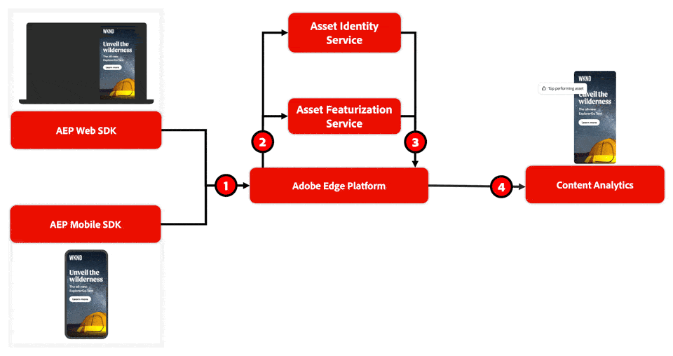

# Panoramica di Content Analytics

Content Analytics aiuta i marketer a comprendere in che modo i contenuti influiscono sugli indicatori di prestazioni chiave definiti da un’azienda. Oltre ai dati comportamentali, Content Analytics raccoglie dati sul modo in cui i contenuti vengono utilizzati e sul modo in cui i driver di contenuto influiscono. Ad esempio, la clientela reagisce meglio a un tono di voce specifico, a una paletta di colori specifica o a temi specifici? Queste informazioni, insieme a flussi di lavoro e modelli di reporting appositamente progettati, possono aiutarti a eseguire analisi ancora migliori e ottenere informazioni più approfondite sui dati del percorso della clientela in Customer Journey Analytics.

Content Analytics utilizza un **servizio di funzionalità** basato sull’IA e sul Machine learning per suddividere il contenuto in componenti e attributi. Creando un profilo di metadati strutturato su tutti i contenuti, puoi analizzare quali contenuti e quali attributi di tali contenuti determinano i risultati di business.

Oltre alla creazione di questo profilo di metadati strutturati, Content Analytics fornisce un **servizio Identity** che identifica risorse ed esperienze utilizzando un singolo identificatore. Il servizio Identity è in grado di riconoscere quando esattamente la stessa risorsa viene visualizzata in più posizioni. In questo caso, le due istanze di questa risorsa vengono trattate come se fossero la stessa risorsa, consentendo una visualizzazione più olistica dell’utilizzo e del consumo dei contenuti.

## Valore

Content Analytics fornisce valore a un livello crescente:

1. **Utilizzo** del contenuto: con Content Analytics puoi ottenere informazioni sulle risorse che ricevono impression e sulle aree in cui le risorse ricevono impression. Queste informazioni consentono di verificare se le risorse sono sottoutilizzate o sovrautilizzate nelle proprietà web e mobili.
1. **Coinvolgimento** del contenuto: Content Analytics può fornire informazioni sul coinvolgimento come il tasso medio di click-through per le risorse con determinati attributi. Queste informazioni ti aiutano a determinare se tipi specifici di esperienze sono ancora efficaci.
1. Percorsi di contenuti: inoltre, se combinato con tutti gli altri dati disponibili in Experience Platform, puoi ottenere informazioni aggiuntive sui percorsi di contenuti; ad esempio, se contenuti specifici portano a conversioni, oltre al coinvolgimento. Ad esempio, se un contenuto specifico porta a conversioni, oltre al coinvolgimento. E con questa conoscenza puoi determinare il ROI sui tipi di contenuto.
1. **Personalizzazione** del contenuto: in ultima analisi, Content Analytics ti consente di agire in base alle informazioni e di utilizzarle per determinare come spendere denaro per i contenuti. Ad esempio, devo inviare tipi specifici di contenuto a tipi di pubblico specifici? Quali contenuti mi offrono opportunità di personalizzazione elevate?

## Terminologia

Content Analytics utilizza i seguenti termini chiave:

* **Esperienza**: un&#39;esperienza è tutto il testo in una pagina Web riproducibile utilizzando l&#39;URL utilizzato dall&#39;utente iniziale per visitare la pagina Web. Oppure la combinazione di testo, risorse e azioni di clic in un’app mobile. A ogni esperienza viene assegnato un identificatore univoco.
* **Risorsa**: una risorsa è un contenuto singolo e univoco, come ad esempio un’immagine. A ogni risorsa viene inoltre assegnato un identificatore univoco e un ID percettivo. Un ID percettivo è un identificatore condiviso con risorse visivamente identiche. Gli ID percettivi aiutano a deduplicare le risorse che possono avere un URL risorsa diverso e quindi un ID risorsa diverso, ma che sono percepitamente identici.
* **Attributo**: un attributo è un elemento di metadati descrittivo associato a un’esperienza o a una risorsa. Gli esempi di un attributo sono: stile della fotografia, leggibilità, strategia di persuasione, colore dell’oggetto, colore di sfondo.

## Come funziona

Content Analytics utilizza i dati di visualizzazione delle immagini web e mobili dai set di dati dell&#39;evento Experience Platform per [raccogliere i dati dell&#39;evento contenuto](config/datacollection.md). Questi eventi di esperienza dei contenuti richiedono la raccolta dei dati con Experience Platform Edge Network (Web SDK, Mobile SDK, API server). I dati comportamentali possono essere raccolti con Web SDK, Mobile SDK o il connettore Source di Analytics.

1. Quando un utente visita un sito o un&#39;app, [configurata per Content Analytics](config/configuration.md), il SDK Web o mobile di Experience Platform registra le impression e le interazioni con i contenuti.
1. Il servizio Identity and Feature elabora queste interazioni. Tale processo consiste in un servizio di recupero che rivede le versioni pubbliche degli URL configurati che definiscono le interazioni. Per tutti questi URL recuperati, il servizio di identità identifica in modo univoco le esperienze e le risorse. Inoltre, il servizio di funzionalità applica i servizi AI/ML per scoprire l’esperienza e i metadati e gli attributi delle risorse.
1. I risultati di questi servizi ([componenti, attributi e identità](/help/content-analytics/report/components.md)) vengono utilizzati per aggiornare i set di dati di Content Analytics specifici e pertinenti in Experience Platform.
1. È possibile utilizzare i dati di Content Analytics insieme ai dati comportamentali e ad altri dati di ricerca in una configurazione di Customer Journey Analytics ([Connessione](/help/connections/overview.md), [Visualizzazione dati](/help/data-views/data-views.md) e [Workspace](/help/analysis-workspace/home.md)). Tale configurazione fornisce le basi per ottenere informazioni univoche a livello macro sul contenuto.  È possibile avviare rapidamente i report e l&#39;analisi di Content Analytics utilizzando il [modello Content Analytics](/help/content-analytics/report/report.md#template).

>[!NOTE]
>
>Content Analytics sfrutta i servizi IA/ML che possono produrre risultati imprecisi o fuorvianti. Di conseguenza, utilizza il tuo giudizio per rivedere e convalidare gli output generati da IA/ML.
>
>Puoi utilizzare la scheda **[!UICONTROL Feedback]**, disponibile in  nell&#39;interfaccia principale, per fornire feedback sugli output generati da IA/ML.
>

>[!NOTE]
>
>Se hai concesso la licenza per il componente aggiuntivo Privacy and Security Shield, tieni presente che l’etichettatura DULE o le chiavi gestite dal cliente non coprono esperienze e risorse soggette a Content Analytics. Inoltre, Content Analytics non è un servizio compatibile con HIPAA.
>

>[!IMPORTANT]
>
>Content Analytics supporta la funzionalità solo in inglese.
>

>[!MORELIKETHIS]
>
>[Generazione rapporti Content Analytics](report/report.md)
>[Configurare Content Analytics](config/configuration.md)
>[Calcolo dei mancati recapiti e del tasso di mancato recapito in Customer Journey Analytics](https://experienceleaguecommunities.adobe.com/adobe-analytics-3/calculating-bounces-bounce-rate-in-adobe-customer-journey-analytics-options-and-implications-12722)
>

