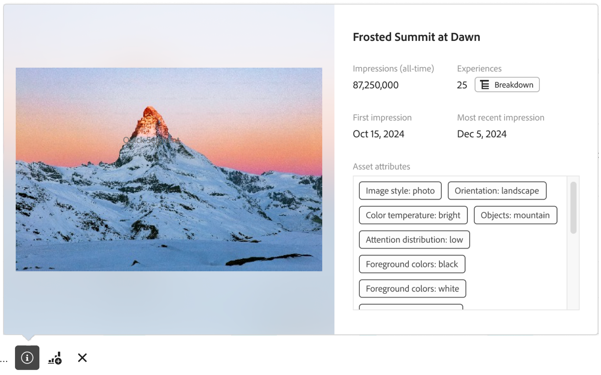

# Panoramica sulla generazione rapporti di Content Analytics

Puoi creare rapporti, eseguire analisi e ottenere informazioni su Content Analytics in [Analysis Workspace](/help/analysis-workspace/home.md). È disponibile un [modello](#template) Workspace specifico, che consente di accedere immediatamente a un progetto Workspace precompilato con informazioni rilevanti sul contenuto.

Per iniziare a generare rapporti su Content Analytics da zero:

1. [Crea un nuovo](/help/analysis-workspace/build-workspace-project/create-projects.md) o [apri un progetto](/help/analysis-workspace/build-workspace-project/open-projects.md) esistente in Workspace.
1. Assicurati di [selezionare una visualizzazione dati](/help/analysis-workspace/c-panels/panels.md#data-view) per la generazione di rapporti di Content Analytics. Il reporting di Content Analytics è disponibile solo per le visualizzazioni dati [configurate](/help/content-analytics/config/configuration.md) per Content Analytics.
1. Trascina una visualizzazione  [Tabella a forma libera](/help/analysis-workspace/visualizations/freeform-table/freeform-table.md) nell&#39;area di lavoro.
1. Utilizza [componenti specifici di Content Analytics](components.md) e altri [componenti](/help/components/overview.md) generici (come segmenti, intervalli di date, annotazioni) per creare informazioni approfondite sull&#39;analisi dei contenuti.

## Miniature

In base alle dimensioni specifiche di Content Analytics utilizzate nel progetto, vengono visualizzate le miniature per le risorse e le dimensioni.

Per impostazione predefinita, le miniature vengono visualizzate per le dimensioni Content Analytics pertinenti. Per configurare la visualizzazione delle miniature per una dimensione Content Analytics:

* Passa il puntatore del mouse su una riga di intestazione per una dimensione Content Analytics. Ad esempio, **[!UICONTROL Asset Name]** o **[!UICONTROL Experience IDs]**.
* Seleziona .
* Nel popup **[!UICONTROL Row setting]**, sotto **[!UICONTROL Settings]**, selezionare o deselezionare **[!UICONTROL Show Thumbnails]**.

## Anteprime

Per le righe di una dimensione Content Analytics che mostrano miniature, puoi aprire una finestra a comparsa di anteprima.

Per aprire l&#39;anteprima con i dettagli seguenti:

* Selezionare . Vengono visualizzati i dettagli seguenti.

  | Anteprima esperienza | Anteprima risorsa |
  |---|---|
  |  |  |
  | Nome della dimensione (ad esempio, **[!UICONTROL Experience ID])** | Nome della dimensione della risorsa (ad esempio, **[!UICONTROL Asset ID])** |
  | **[!UICONTROL Impressions (all time)]**: numero di impression per l&#39;esperienza. | **[!UICONTROL Impressions (all times)]**: numero di impression per la risorsa. |
  | **[!UICONTROL Assets]**: numero di risorse contenute in questa esperienza.  Seleziona  **[!UICONTROL Breakdown]** per controllare le risorse. | **[!UICONTROL Experiences]**: numero di esperienze in cui questa risorsa viene visualizzata.  Seleziona  **[!UICONTROL Breakdown]** per controllare le risorse. |
  | **[!UICONTROL First impression]**: data della prima impressione dell&#39;esperienza. | **[!UICONTROL First impression]**: data della prima impression della risorsa. |
  | **[!UICONTROL &#x200B; Most recent impression]**: data dell&#39;impression più recente dell&#39;esperienza. | **[!UICONTROL Most recent impression]**: data dell&#39;impression più recente della risorsa. |
  | **[!UICONTROL Experience attributes]**: [attributi](/help/content-analytics/report/components.md#experience-attributes) dell&#39;esperienza. | **[!UICONTROL Asset attributes]**: [attributi](/help/content-analytics/report/components.md#asset-attributes) della risorsa. |

## Modello

È disponibile un [modello](/help/analysis-workspace/templates/use-templates.md) di analisi dei contenuti che consente di individuare gli attributi di contenuto e contenuto con prestazioni migliori. Il modello fa parte del caso d&#39;uso [Canale web e Coinvolgimento](/help/analysis-workspace/templates/use-templates.md#web-engagement) e descrive le prestazioni del contenuto a livello granulare. Puoi esaminare le prestazioni di singole risorse o attributi specifici.

In base a ciò che si impara, si potrebbero fare un certo numero di cose. Come promuovere le risorse ad alte prestazioni nella pagina principale, personalizzare il contenuto per segmenti specifici in modo da includere attributi ad alte prestazioni o ruotare il contenuto che ha iniziato a non essere più aggiornato.

Per utilizzare il modello:

1. Selezionare **[!UICONTROL Workspace]** dal menu principale.
1. Accertati di aver selezionato una visualizzazione dati configurata per Content Analytics.
1. Cercare o utilizzare i segmenti (**[!UICONTROL Web]** per **[!UICONTROL Channel]** e **[!UICONTROL Engagement]** per **[!UICONTROL Use Case]**&#x200B;s) per trovare e selezionare il modello **[!UICONTROL Content analytics]**.
1. Seleziona **[!UICONTROL Use template]**.
1. Nella finestra di dialogo **[!UICONTROL Set up your template]**, seleziona una metrica dalla finestra di dialogo **[!UICONTROL Select a conversion metric]**. Ad esempio: **[!UICONTROL Asset CTR]**.
1. Seleziona **[!UICONTROL Continue]**.

Un progetto **[!UICONTROL Content Analytics Overview]** viene aperto in [Analysis Workspace](/help/analysis-workspace/home.md). Il progetto è costituito da quattro [pannelli](/help/analysis-workspace/c-panels/panels.md), in cui ogni pannello fornisce [tabelle a forma libera](/help/analysis-workspace/visualizations/freeform-table/freeform-table.md) e [visualizzazioni](/help/analysis-workspace/visualizations/freeform-analysis-visualizations.md) per rispondere a una domanda specifica:

* **Quali sono le prestazioni migliori?**
Questo pannello ti aiuta a capire quali esperienze e quali risorse in esse sono alla base del coinvolgimento e della conversione. Le esperienze sono una pagina web completa, acquisita in un momento specifico. Un’esperienza può contenere sia testo che più singole risorse di immagine. Una risorsa è una singola immagine.

  Il pannello è costituito dalle seguenti visualizzazioni:

   * **Esperienze**

     >[!NOTE]
     >
     >Queste visualizzazioni vengono visualizzate solo quando [hai incluso esperienze](/help/content-analytics/config/guided.md#experience-capture-and-definition) nella configurazione di Content Analytics.
     > 

      * **Experience CTR**: una visualizzazione [summary change](/help/analysis-workspace/visualizations/summary-number-change.md) che mostra Experience CTR.
      * **Prime esperienze di conversione**: una visualizzazione con [barra orizzontale](/help/analysis-workspace/visualizations/horizontal-bar.md) che mostra le prime esperienze di conversione in base alla metrica di conversione selezionata.
      * **Esperienze dalle prestazioni migliori**: una [tabella a forma libera](/help/analysis-workspace/visualizations/freeform-table/freeform-table.md)(incluse [miniature](#thumbnails) e [anteprime](#previews)) per le esperienze dalle prestazioni migliori.

   * **Assets**

      * **CTR risorsa**
Una visualizzazione [summary change](/help/analysis-workspace/visualizations/summary-number-change.md) che mostra Asset CTR.
      * **Migliori risorse da convertire**
Una visualizzazione con [barra orizzontale](/help/analysis-workspace/visualizations/horizontal-bar.md) che mostra le risorse di conversione principali in base alla metrica di conversione selezionata.
      * **Risorse dalle prestazioni migliori**
Una [tabella a forma libera](/help/analysis-workspace/visualizations/freeform-table/freeform-table.md) (incluse [miniature](#thumbnails) e [anteprime](#previews)) per le risorse con prestazioni migliori.
      * **Assets - visualizzazioni e conversione.**
Visualizzazione [grafico a dispersione](/help/analysis-workspace/visualizations/scatterplot.md) che mostra un grafico a dispersione delle visualizzazioni delle risorse rispetto alle conversioni delle risorse.

* **Quali attributi di risorsa contribuiscono alle conversioni?**
Content Analytics utilizza l’intelligenza artificiale e GenAI per assegnare automaticamente ogni metadati di risorse, come soggetti, scene, colori in primo piano e così via. Un attributo è un tag di metadati assegnato dall’intelligenza artificiale che descrive cosa c’è in una risorsa o in un’esperienza. Ad esempio: <code>colore di primo piano: rosso</code> è un attributo assegnato automaticamente. Le visualizzazioni consentono di identificare gli attributi delle risorse che contribuiscono maggiormente alla conversione.

  Il pannello è costituito dalle seguenti visualizzazioni:

   * **Primi attributi di conversione risorse**
[barra orizzontale](/help/analysis-workspace/visualizations/horizontal-bar.md) che mostra i principali attributi di conversione delle risorse in base alla metrica di conversione selezionata.
   * **Primi attributi di conversione risorse rispetto ai 30 giorni precedenti**
Visualizzazione [horizontal bar](/help/analysis-workspace/visualizations/horizontal-bar.md) che mostra i principali attributi di conversione delle risorse rispetto ai 30 giorni precedenti, in base alla metrica di conversione selezionata.
   * **Migliore conversione dei dati degli attributi delle risorse**
Una [tabella a forma libera](/help/analysis-workspace/visualizations/freeform-table/freeform-table.md) che mostra i principali attributi di conversione in base alla metrica di conversione selezionata. Seleziona una riga nella tabella per aggiornare la visualizzazione della tendenza degli attributi.
   * **Tendenza attributo**
Una visualizzazione [riga](/help/analysis-workspace/visualizations/line.md) che mostra la tendenza dell&#39;attributo per l&#39;attributo di conversione superiore selezionato delle risorse.
   * **Colore di primo piano risorsa**
Esempio di [tabella a forma libera](/help/analysis-workspace/visualizations/freeform-table/freeform-table.md) che confronta le prestazioni degli elementi di una singola categoria di attributi di risorsa: Colori di primo piano. Puoi sostituire questo attributo di risorsa con altre dimensioni di categoria dell’attributo di risorsa.

* **Quali attributi esperienza contribuiscono alle conversioni?**

  >[!NOTE]
  >
  >Questo pannello viene visualizzato solo se nella configurazione di Content Analytics hai [incluso esperienze](/help/content-analytics/config/guided.md#experience-capture-and-definition).
  > 

  Mentre gli attributi della risorsa si concentrano sulle qualità visive delle immagini, gli attributi dell’esperienza si concentrano sul testo della pagina. Le visualizzazioni seguenti consentono di esplorare quali attributi di esperienza contribuiscono alla conversione. Questi attributi vengono inoltre assegnati automaticamente utilizzando i modelli AI e GenAI.

  Il pannello è costituito dalle seguenti visualizzazioni:

   * **Attributi esperienza di conversione principali**
Visualizzazione [horizontal bar](/help/analysis-workspace/visualizations/horizontal-bar.md) che mostra i principali attributi dell&#39;esperienza di conversione in base alla metrica di conversione selezionata.
   * **Attributi esperienza di conversione principali rispetto ai 30 giorni precedenti**
Visualizzazione [horizontal bar](/help/analysis-workspace/visualizations/horizontal-bar.md) che mostra i principali attributi dell&#39;esperienza di conversione rispetto ai 30 giorni precedenti, in base alla metrica di conversione selezionata.
   * **Primi dati attributo esperienza di conversione**
Una [tabella a forma libera](/help/analysis-workspace/visualizations/freeform-table/freeform-table.md) che mostra le prime esperienze di conversione in base alla metrica di conversione selezionata. Seleziona una riga nella tabella per aggiornare la visualizzazione Linee.
   * **Riga**
Una visualizzazione [line](/help/analysis-workspace/visualizations/line.md) che mostra la tendenza per l&#39;attributo esperienza di conversione superiore selezionato.
   * **Parole chiave esperienza**
Una [tabella a forma libera](/help/analysis-workspace/visualizations/freeform-table/freeform-table.md) che mostra le parole chiave dell&#39;esperienza principale in base alla metrica di conversione selezionata.

* **Dove vengono visualizzate le risorse nel sito?**
Un pannello costituito da una tabella a forma libera che specifica dove vengono visualizzate sul sito le risorse più visualizzate.

  Il pannello è costituito da una visualizzazione:

   * **Dove vengono visualizzate le risorse più visualizzate?**
Puoi suddividere qualsiasi risorsa per dimensioni per capire meglio dove viene visualizzata l’immagine.

     Nell&#39;esempio [tabella a forma libera](/help/analysis-workspace/visualizations/freeform-table/freeform-table.md) (incluse [miniature](#thumbnails) e [anteprime](#previews)), viene utilizzato **[!UICONTROL Asset Perception ID]** anziché [!UICONTROL Asset Id]. A volte, la stessa immagine può essere duplicata sul sito con un URL immagine diverso. L&#39;attributo [!UICONTROL Asset Perception ID] consente di raggruppare questi duplicati in un singolo ID.

     Poiché le risorse possono cambiare in una pagina, ogni risorsa viene suddivisa per **[!UICONTROL Experience Id]**, in modo da identificare la versione della pagina in cui è apparsa la risorsa. È possibile sostituire [!UICONTROL Experience Id] con altre dimensioni che consentono di comprendere la posizione di una risorsa sul sito. Ad esempio, [!UICONTROL Page name], [!UICONTROL Page URL] o [!UICONTROL Site section].

     È inoltre possibile scambiare [!UICONTROL Asset Perception ID] con [!UICONTROL Asset Id] per ottenere un record in cui viene fatto riferimento a URL di immagini specifici.

>[!MORELIKETHIS]
>
>[Componenti Content Analytics](components.md)
>[Usa modelli](/help/analysis-workspace/templates/use-templates.md#web-engagement)
>
