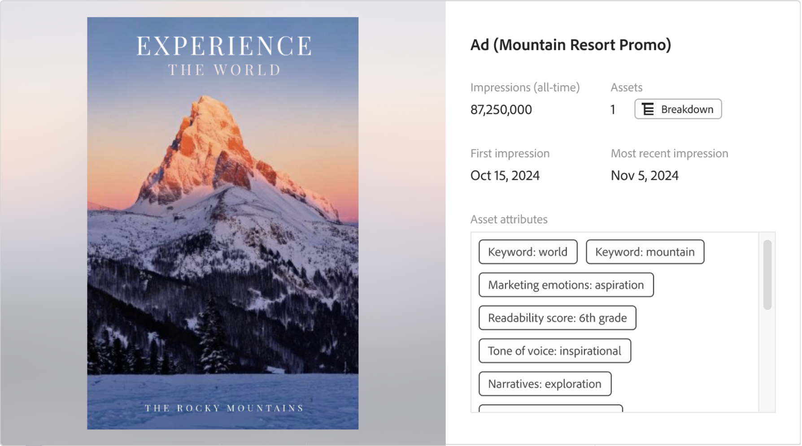

# Panoramica del reporting di Content Analytics

Puoi creare rapporti, eseguire analisi e ottenere informazioni approfondite su [!DNL Content Analytics] in [Analysis Workspace](/help/analysis-workspace/home.md). È disponibile un [modello](#template) Workspace specifico, che consente di accedere subito a un progetto Workspace precompilato con insight rilevanti sul contenuto.

Per creare un rapporto Content Analytics personalizzato da zero, effettua le seguenti operazioni:

1. Crea un [nuovo progetto](/help/analysis-workspace/build-workspace-project/create-projects.md) o apri un [progetto esistente](/help/analysis-workspace/build-workspace-project/open-projects.md) in Workspace.
1. Assicurati di [selezionare una visualizzazione dati](/help/analysis-workspace/c-panels/panels.md#data-view) per la generazione di rapporti con Content Analytics. La funzione di reporting di Content Analytics è disponibile solo per le visualizzazioni dati [configurate](/help/content-analytics/config/configuration.md) per Content Analytics.
1. Trascina una visualizzazione  [Tabella a forma libera](/help/analysis-workspace/visualizations/freeform-table/freeform-table.md) nell&#39;area di lavoro.
1. Utilizza [componenti specifici di Content Analytics](components.md) e altri [componenti](/help/components/overview.md) generici (come segmenti, intervalli di date, annotazioni) per generare insight da Content Analytics.
1. Usa altre [visualizzazioni](/help/analysis-workspace/visualizations/freeform-analysis-visualizations.md) per migliorare il progetto.

## Miniature

In base alle dimensioni specifiche di Content Analytics utilizzate nel progetto, le miniature vengono visualizzate nelle seguenti visualizzazioni:

### Tabella a forma libera

Per impostazione predefinita, le miniature sono visualizzate in una [tabella a forma libera](/help/analysis-workspace/visualizations/freeform-table/freeform-table.md). Per configurare la visualizzazione delle miniature per una dimensione Content Analytics:

* Passa il puntatore su una riga di intestazione per una dimensione Content Analytics. Ad esempio, **[!UICONTROL ID risorsa]** o **[!UICONTROL ID esperienza]**.
* Seleziona .
* Nella finestra a comparsa **[!UICONTROL Impostazione riga]**, sotto **[!UICONTROL Impostazioni]**, selezionare o deselezionare **[!UICONTROL Mostra miniature]**.

### Barre (sovrapposte) e Barre orizzontali (sovrapposte)

{{release-limited-testing-section}}

Le miniature vengono visualizzate come parte della legenda sull&#39;asse verticale o orizzontale. Le miniature vengono visualizzate anche quando passi il cursore su una barra in una [barra (sovrapposta)](/help/analysis-workspace/visualizations/bar.md) e una [barra orizzontale (sovrapposta)](/help/analysis-workspace/visualizations/horizontal-bar.md).

### A dispersione

{{release-limited-testing-section}}

Le miniature vengono visualizzate quando passi il cursore su un punto dati in una [dispersione](/help/analysis-workspace/visualizations/scatterplot.md).

## Anteprime

>[!AVAILABILITY]
>
>Le visualizzazioni a barre e a dispersione descritte in questa sezione sono in Test limitati e potrebbero non essere disponibili nel tuo ambiente. Questa nota viene rimossa quando la funzionalità è generalmente disponibile. Per informazioni sul processo di rilascio di Customer Journey Analytics, consulta [Rilascio delle funzioni di Customer Journey Analytics](/help/release-notes/releases.md).
>

È possibile aprire una finestra a comparsa di anteprima. A tale scopo, effettua le seguenti operazioni:

* Seleziona  in una [tabella a forma libera](#freeform-table).
* Seleziona una barra specifica in una visualizzazione [barra](#bar-and-horizontal-bar) o [barra orizzontale](#bar-and-horizontal-bar) o un punto dati in una visualizzazione [dispersione](#scatter).

Vengono visualizzati i dettagli seguenti.

| Anteprima esperienza | Anteprima risorsa |
|---|---|
|  |  |
| Nome della dimensione (ad esempio, **[!UICONTROL ID esperienza])** | Nome della dimensione della risorsa (ad esempio, **[!UICONTROL ID risorsa])** |
| **[!UICONTROL Impression (in qualsiasi momento)]**: numero di impression per l&#39;esperienza. | **[!UICONTROL Impression (tutte le volte)]**: numero di impression per la risorsa. |
| **[!UICONTROL Assets]**: numero di risorse contenute in questa esperienza.  Seleziona  **[!UICONTROL Raggruppamento]** per esaminare le risorse. | **[!UICONTROL Esperienze]**: numero di esperienze in cui questa risorsa viene visualizzata.  Seleziona  **[!UICONTROL Raggruppamento]** per esaminare le risorse. |
| **[!UICONTROL Prima impressione]**: data della prima impressione dell&#39;esperienza. | **[!UICONTROL Prima impression]**: data della prima impression della risorsa. |
| **[!UICONTROL Impression più recente]**: data dell&#39;impression più recente dell&#39;esperienza. | **[!UICONTROL Impression più recente]**: data dell&#39;impression più recente della risorsa. |
| **[!UICONTROL Attributi esperienza]**: gli [attributi](/help/content-analytics/report/components.md#experience-attributes) dell&#39;esperienza. | **[!UICONTROL Attributi risorsa]**: gli [attributi](/help/content-analytics/report/components.md#asset-attributes) della risorsa. |

## Modello

È disponibile un [modello](/help/analysis-workspace/templates/use-templates.md) di Content Analytics per aiutarti a capire quali sono i contenuti e gli attributi di contenuto con prestazioni migliori. Il modello fa parte del [caso d’uso Canale web e coinvolgimento](/help/analysis-workspace/templates/use-templates.md#web-engagement) e descrive le prestazioni dei contenuti a livello granulare. Puoi esaminare le prestazioni di singole risorse o attributi specifici.

In base ai risultati, potresti fare diverse cose. Ad esempio, promuovere le risorse ad alte prestazioni nella pagina Home; personalizzare i contenuti per segmenti specifici in modo da includere attributi ad alte prestazioni; o sostituire i contenuti che iniziano a perdere la loro attrattiva.

Per utilizzare il modello:

1. Selezionare **[!UICONTROL Workspace]** dal menu principale.
1. Assicurati di selezionare una visualizzazione dati configurata per Content Analytics.
1. Cerca o utilizza segmenti (**[!UICONTROL Web]** per **[!UICONTROL Canale]** e **[!UICONTROL Coinvolgimento]** per **[!UICONTROL Caso d&#39;uso]**s) per trovare e selezionare il modello **[!UICONTROL Content Analytics]**.
1. Seleziona **[!UICONTROL Usa modello]**.
1. Nella finestra di dialogo **[!UICONTROL Configura il modello]**, seleziona una metrica dalla finestra di dialogo **[!UICONTROL Seleziona una metrica di conversione]**. Ad esempio, **[!UICONTROL CTR risorsa]**.
1. Seleziona **[!UICONTROL Continua]**.

Un progetto **[!UICONTROL Panoramica di Content Analytics]** viene aperto in [Analysis Workspace](/help/analysis-workspace/home.md). Il progetto è costituito da quattro [pannelli](/help/analysis-workspace/c-panels/panels.md), in cui ogni pannello fornisce [tabelle a forma libera](/help/analysis-workspace/visualizations/freeform-table/freeform-table.md) e [visualizzazioni](/help/analysis-workspace/visualizations/freeform-analysis-visualizations.md) per rispondere a una domanda specifica. È possibile utilizzare il raggruppamento **[!UICONTROL Canale contenuto]** per [raggruppare](/help/analysis-workspace/c-panels/panels.md#break-down-a-panel) il pannello per il canale contenuto a cui si è interessati: **[!UICONTROL web]** o **[!UICONTROL mobile]**.

I quattro pannelli sono:

* **Quale contenuto offre le prestazioni migliori?**
Questo pannello identifica le esperienze e le risorse che determinano il coinvolgimento e la conversione. Le esperienze sono pagine web complete acquisite in un momento specifico, oppure una combinazione di testo, risorse e chiamate all’azione definite in un’app mobile.

   * **Esperienze**.

     >[!NOTE]
     >
     >Queste visualizzazioni vengono visualizzate nel modello solo quando il sistema è stato configurato per [includere esperienze](/help/content-analytics/config/guided.md#experience-capture-and-definition) nella configurazione di Content Analytics.
     > 

      * **Experience CTR**: una visualizzazione [summary change](/help/analysis-workspace/visualizations/summary-number-change.md) che mostra Experience CTR.
      * **Esperienze con più conversioni**: una visualizzazione a [barre orizzontali](/help/analysis-workspace/visualizations/horizontal-bar.md) che mostra le esperienze con il maggior numero di conversioni in base alla metrica di conversione selezionata.
      * **Esperienze dalle prestazioni migliori**: una [tabella a forma libera](/help/analysis-workspace/visualizations/freeform-table/freeform-table.md) (incluse [miniature](#thumbnails) e [anteprime](#previews)) per le esperienze dalle prestazioni migliori.

   * **Risorse**

      * **CTR risorsa**
Una visualizzazione [summary change](/help/analysis-workspace/visualizations/summary-number-change.md) che mostra Asset CTR.
      * **Conversione in alto delle risorse**
Visualizzazione [a barre orizzontali](/help/analysis-workspace/visualizations/horizontal-bar.md) che mostra le principali risorse in conversione in base alla metrica di conversione selezionata.
      * **Risorse con prestazioni migliori**
Una [tabella a forma libera](/help/analysis-workspace/visualizations/freeform-table/freeform-table.md) (incluse [miniature](#thumbnails) e [anteprime](#previews)) per le risorse con prestazioni migliori.
Assets: visualizzazioni rispetto alla conversione.
Visualizzazione [grafico a dispersione](/help/analysis-workspace/visualizations/scatterplot.md) che mostra un grafico a dispersione delle visualizzazioni delle risorse rispetto alle conversioni delle risorse.

* **Quali attributi delle risorse contribuiscono alle conversioni?**
Content Analytics utilizza AI e GenAI per assegnare automaticamente metadati e attributi, come soggetti, scene e colori di primo piano, a ogni risorsa.

   * **Primi attributi di conversione risorse**
[barra orizzontale](/help/analysis-workspace/visualizations/horizontal-bar.md) che mostra i principali attributi di conversione delle risorse in base alla metrica di conversione selezionata.
   * **Migliore conversione attributi risorsa rispetto ai 30 giorni precedenti**
Visualizzazione [horizontal bar](/help/analysis-workspace/visualizations/horizontal-bar.md) che mostra i principali attributi di conversione delle risorse rispetto ai 30 giorni precedenti, in base alla metrica di conversione selezionata.
   * **Prima conversione dei dati degli attributi delle risorse**
Una [tabella a forma libera](/help/analysis-workspace/visualizations/freeform-table/freeform-table.md) che mostra i principali attributi di conversione in base alla metrica di conversione selezionata. Seleziona una riga nella tabella per aggiornare la visualizzazione della tendenza degli attributi.
   * **Tendenza attributo**
Una visualizzazione [riga](/help/analysis-workspace/visualizations/line.md) che mostra la tendenza dell&#39;attributo per l&#39;attributo della risorsa di conversione superiore selezionato.
   * **Colore di primo piano risorsa**
Esempio di [tabella a forma libera](/help/analysis-workspace/visualizations/freeform-table/freeform-table.md) che confronta le prestazioni degli elementi di una singola categoria di attributi di risorsa: Colori di primo piano. Puoi sostituire questo attributo di risorsa con altre dimensioni di categoria di attributi di risorsa.

* **Quali attributi dell’esperienza contribuiscono alle conversioni?**

  >[!NOTE]
  >
  >Questo pannello viene visualizzato solo se nella configurazione di Content Analytics hai [incluso delle esperienze](/help/content-analytics/config/guided.md#experience-capture-and-definition).
  > 

  Mentre gli attributi delle risorse si concentrano sulle qualità visive delle immagini, gli attributi delle esperienze si concentrano sul testo presente nella pagina. Le visualizzazioni seguenti consentono di esplorare gli attributi di esperienza che contribuiscono alla conversione. Anche questi attributi vengono assegnati automaticamente utilizzando modelli di intelligenza artificiale e IA generativa.

  Il pannello è costituito dalle visualizzazioni seguenti:

   * **Attributi esperienza di conversione principali**
Visualizzazione [horizontal bar](/help/analysis-workspace/visualizations/horizontal-bar.md) che mostra i principali attributi dell&#39;esperienza di conversione in base alla metrica di conversione selezionata.
Migliori attributi di conversione dell’esperienza rispetto ai 30 giorni precedenti
Visualizzazione [horizontal bar](/help/analysis-workspace/visualizations/horizontal-bar.md) che mostra i principali attributi dell&#39;esperienza di conversione rispetto ai 30 giorni precedenti, in base alla metrica di conversione selezionata.
   * **Migliore conversione dei dati attributo esperienza**
Una [tabella a forma libera](/help/analysis-workspace/visualizations/freeform-table/freeform-table.md) che mostra le prime esperienze di conversione in base alla metrica di conversione selezionata. Seleziona una riga nella tabella per aggiornare la visualizzazione a linee.
   * **Riga**
Una visualizzazione [riga](/help/analysis-workspace/visualizations/line.md) che mostra la tendenza per l&#39;attributo esperienza di conversione superiore selezionato.
   * **Parole chiave esperienza**
Una [tabella a forma libera](/help/analysis-workspace/visualizations/freeform-table/freeform-table.md) che mostra le parole chiave dell&#39;esperienza principale in base alla metrica di conversione selezionata.

* **Dove vengono visualizzate le risorse sul sito?**
Questa tabella a forma libera specifica dove vengono visualizzate le risorse più visualizzate. Utilizza questa analisi per identificare le pagine con prestazioni elevate e ottimizzare il posizionamento delle risorse.

   * **Dove si trovano le risorse più visualizzate?**
Puoi suddividere qualsiasi risorsa per dimensioni per capire meglio dove viene visualizzata l’immagine.

     Nell&#39;esempio [tabella a forma libera](/help/analysis-workspace/visualizations/freeform-table/freeform-table.md) (incluse [miniature](#thumbnails) e [anteprime](#previews)) viene utilizzato **[!UICONTROL ID percezione risorsa]** anziché [!UICONTROL ID risorsa]. A volte, la stessa esatta immagine può essere duplicata sul sito con un URL immagine diverso. L&#39;attributo [!UICONTROL ID percezione risorsa] consente di raggruppare questi duplicati in un singolo ID.

     Poiché le risorse possono cambiare in una pagina, il sistema suddivide ogni risorsa per **[!UICONTROL ID esperienza]** per identificare la versione della pagina in cui è apparsa la risorsa. Puoi sostituire [!UICONTROL Experience Id] con altre dimensioni che ti aiutano a capire la posizione di una risorsa sul tuo sito. [!UICONTROL Nome pagina], [!UICONTROL URL pagina] o [!UICONTROL Sezione sito].

     È inoltre possibile scambiare [!UICONTROL ID percezione risorsa] con [!UICONTROL ID risorsa] per ottenere un record in cui viene fatto riferimento a URL immagine specifici.

>[!MORELIKETHIS]
>
>[Componenti Content Analytics](components.md)
>[Utilizzare i modelli](/help/analysis-workspace/templates/use-templates.md#web-engagement)
>
