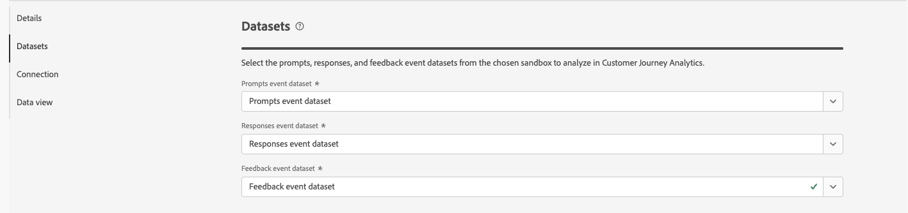
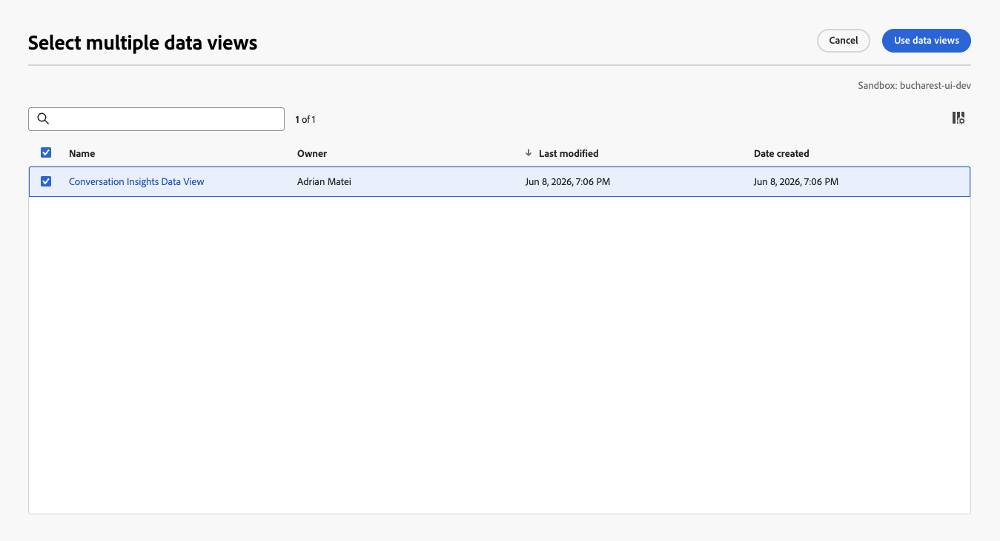

# Configurare le configurazioni di Informazioni sulla conversazione

Conversation Insights consente di analizzare le conversazioni (da modelli di linguaggio di grandi dimensioni (LLM, Large Language Model) o umani) su larga scala e di contestualizzarle all’interno dell’intero percorso di clienti. Tramite Informazioni sulla conversazione sei in grado di comprendere l’impatto dei rappresentanti sui risultati effettivi degli utenti.

## Creare o modificare la configurazione

Quando crei o modifichi una configurazione di Informazioni sulla conversazione, specifichi la sandbox e i set di dati dell’evento che contengono prompt, risposte e dati di feedback. Seleziona anche la connessione Customer Journey Analytics alla quale desideri aggiungere questi set di dati. E la visualizzazione dati a cui desideri aggiungere le metriche e le dimensioni di Informazioni sulla conversazione.

Solo gli amministratori di sistema possono creare o modificare le configurazioni di Informazioni sulla conversazione.

Puoi creare o modificare le configurazioni dall&#39;interfaccia [Configurazioni approfondimenti conversazione](./conversation-insights-manage.md).

### Ripristina set di dati combinato mancante

Se si modifica una configurazione e il set di dati di blend generato per la configurazione non esiste più, selezionare **[!UICONTROL Ripristina]** per rigenerare il set di dati di blend.

### Passaggi di configurazione

Per ogni configurazione:

1. Nella sezione **[!UICONTROL Dettagli]**, specifica le seguenti informazioni:

   

   | Campo | Descrizione |
   |---------|----------|
   | **[!UICONTROL Nome]** | Specifica un nome per la configurazione. |
   | **[!UICONTROL Sandbox]** | Seleziona la sandbox di Experience Platform che contiene i set di dati di prompt, risposte ed eventi di feedback che desideri aggiungere alla connessione. |

1. Nella sezione **[!UICONTROL Set di dati]**, specifica le seguenti informazioni:

   

   | Campo | Descrizione |
   |---------|----------|
   | **[!UICONTROL Richiede il set di dati evento]** | Seleziona il set di dati che contiene i dati dell’evento prompt. |
   | **[!UICONTROL Set di dati evento risposte]** | Seleziona il set di dati che contiene i dati dell’evento risposte. |
   | **[!UICONTROL Set di dati evento feedback]** | Seleziona il set di dati che contiene i dati dell’evento di feedback. |

1. Nella sezione **[!UICONTROL Connessione]**, se non è già configurata alcuna connessione, utilizzare **[!UICONTROL Seleziona una connessione]** per selezionare una connessione.

   

   Se una connessione è già configurata, selezionare  **[!UICONTROL Modifica]** per selezionare un&#39;altra connessione.

   

   Nella finestra di dialogo **[!UICONTROL Seleziona una connessione]**:

   

   1. Seleziona la casella di controllo accanto alla connessione alla quale desideri aggiungere i set di dati dei prompt, delle risposte e degli eventi di feedback.
   1. Selezionare **[!UICONTROL Usa connessione]**.

   * Per eseguire una ricerca nell&#39;elenco delle connessioni tra cui selezionare, utilizzare il campo .
   * Per configurare le colonne da visualizzare nella tabella, seleziona . Nella finestra di dialogo **[!UICONTROL Personalizza tabella]**, seleziona le colonne da visualizzare. Quindi selezionare **[!UICONTROL Applica]**.

1. Nella sezione **[!UICONTROL Visualizzazioni dati]**, se non è già configurata alcuna visualizzazione dati, selezionare **[!UICONTROL Seleziona visualizzazioni dati]** per selezionare le visualizzazioni dati.

   Se le visualizzazioni dati sono già configurate, selezionare  **[!UICONTROL Modifica selezione visualizzazione dati]** per riconfigurare la selezione delle visualizzazioni dati.

   Nella finestra di dialogo **[!UICONTROL Seleziona più visualizzazioni dati]**:

   

   1. Seleziona una o più visualizzazioni dati da utilizzare per la configurazione di Informazioni sulla conversazione.

   1. Selezionare **[!UICONTROL Utilizza visualizzazioni dati]** per utilizzare le visualizzazioni dati. Seleziona Annulla per annullare.

   * Per eseguire ricerche nell&#39;elenco delle visualizzazioni dati da cui selezionare, utilizzare il campo .
   * Per configurare le colonne da visualizzare nella tabella, seleziona . Nella finestra di dialogo **[!UICONTROL Personalizza tabella]**, seleziona le colonne da visualizzare. Quindi selezionare **[!UICONTROL Applica]**.

1. Per completare la configurazione:

   * Seleziona **[!UICONTROL Elimina]** per una nuova configurazione non creata.

   * Seleziona **[!UICONTROL Salva per dopo]** per una nuova configurazione da salvare, ma non desideri creare l&#39;artefatto per (ad esempio, aggiornamenti alle visualizzazioni dati). In questo modo, puoi rivedere la configurazione in un secondo momento e terminare la creazione effettiva della configurazione.

   * Seleziona **[!UICONTROL Crea]** per creare la nuova configurazione.

   * Seleziona **[!UICONTROL Salva]** per salvare la configurazione modificata.

   * Seleziona **[!UICONTROL Ripristina]** per ripristinare la configurazione e rigenerare un nuovo set di dati di blend per la configurazione.

   * Seleziona **[!UICONTROL Esci]** per ignorare eventuali modifiche alla configurazione.

## Verifica della visualizzazione dati

(Spiega le metriche e le dimensioni visualizzate dai set di dati pertinenti)

<!--

1. In the Data views dialog, select the checkbox next to one or more data views that you want to use when analyzing Experience Platform audience data within Analysis Workspace. These data views are automatically configured with Experience Platform audience data for reporting.

1. Select **[!UICONTROL Use data views]**.

1. Select **[!UICONTROL Create]** to create the configuration.

   >[!IMPORTANT]
   >
   >Because the profile dataset is updated once per day, audiences are available in Customer Journey Analytics data views on the day after you create the audience analysis configuration.

1. After 24 hours, [view audience dimensions in the data view](#view-audience-dimensions-in-the-data-view) to verify that the audience dimensions are available in the data views that you selected. 

 
## View audience dimensions in the data view

After you [create an audience analysis configuration](#create-an-audience-analysis-configuration), you can verify that audience dimensions were added to the data views that you selected during the configuration.

To view audience dimensions in the data view, you must be a product profile administrator for the product profile that the data view is assigned to. For more information, see [Access control](/help/technotes/access-control.md).

To view the audience analysis dimensions in the data view:

1. In Customer Journey Analytics, select **[!UICONTROL Data Management]** > **[!UICONTROL Data views]**.

1. In the **[!UICONTROL Dimensions]** section, the following dimensions should now be available:

   * **[!UICONTROL Audience Name]**

   * **[!UICONTROL Audience Origin]**

   * **[!UICONTROL Exited Audience Origin]**

   * **[!UICONTROL Exited Audience Name]**

   Note that each of these dimensions was added to the profile dataset that is associated with the merge policy that you selected during the audience analysis configuration, and each was added to the new lookup dataset that was created.

   

1. Use the audience analysis dimensions in Analysis Workspace. 

   Users who have access to use the data view in Analysis Workspace can now see the new dimensions and use them in their analyses. For information about how to use the audience analysis dimensions in Analysis Workspace, see [Analyze Experience Platform audiences in Customer Journey Analytics](/help/connections/audience-analysis/analyze-audiences.md).

-->