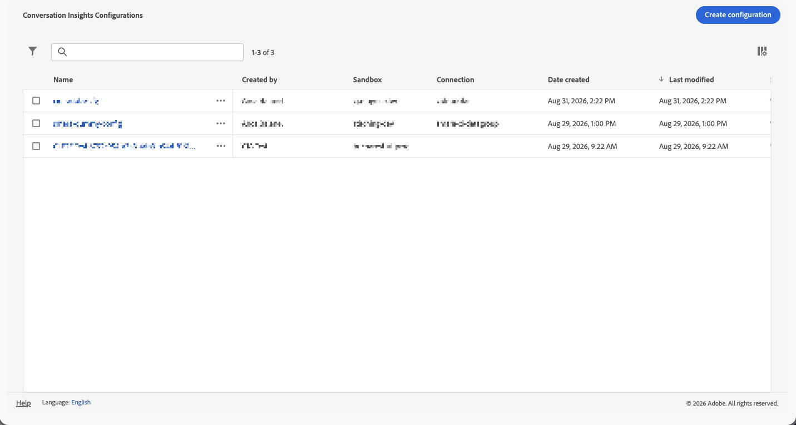

# Gestione configurazioni

Dopo aver [creato le configurazioni di Informazioni sulla conversazione](/help/conversation-insights/configure.md), puoi visualizzare, modificare o eliminare queste configurazioni.

Solo gli amministratori di sistema possono gestire le configurazioni di Informazioni sulla conversazione.

Per informazioni su Informazioni sulla conversazione, vedere [Panoramica su Informazioni sulla conversazione](/help/conversation-insights/overview.md).

## Visualizzare e filtrare le configurazioni esistenti

Per visualizzare le configurazioni esistenti di Informazioni sulla conversazione:

1. In Customer Journey Analytics, seleziona **[!UICONTROL Gestione dati]** > **[!UICONTROL Configurazione approfondimenti conversazione]**.

   

   Per ogni configurazione sono disponibili le seguenti colonne di informazioni:

   * **[!UICONTROL Nome]**: nome della configurazione di Informazioni sulla conversazione.
   * **[!UICONTROL Creato da]**: utente che ha creato la configurazione.

   * **[!UICONTROL Sandbox]**: la sandbox di Experience Platform che contiene il set di dati del profilo aggiunto alla connessione.

   * **[!UICONTROL Connessione]**: la connessione aggiunta alla configurazione.

   * **[!UICONTROL Data di creazione]**: la data e l&#39;ora di creazione della configurazione.

   * **[!UICONTROL Ultima modifica]**: data dell&#39;ultima modifica della configurazione.

   * **[!UICONTROL Stato]**: lo stato della configurazione. I valori possibili sono:
      **[!UICONTROL Complete]**,  **[!UICONTROL Pending]** o  **[!UICONTROL Non riuscito]**.

   Per configurare le colonne da visualizzare nella tabella, selezionare . Nella finestra di dialogo **[!UICONTROL Personalizza tabella]**, seleziona le colonne da visualizzare. Quindi selezionare **[!UICONTROL Applica]**.

1. (Facoltativo) Per filtrare l&#39;elenco delle configurazioni, selezionare , quindi filtrare in base a uno dei seguenti criteri:

   * **[!UICONTROL Connessione]**

   * **[!UICONTROL Creato da]**

   * **[!UICONTROL Sandbox]**

   * **[!UICONTROL Stato]**

## Creare una configurazione

Per creare una nuova configurazione di Informazioni sulla conversazione:

1. Selezionare **[!UICONTROL Crea configurazione]**.
1. Utilizza la finestra di dialogo [**[!UICONTROL Crea configurazione]**](./configure.md) per configurare gli approfondimenti sulla conversazione.

## Modificare una configurazione

Per modificare una configurazione esistente di Informazioni sulla conversazione:

1. Esegui una delle operazioni seguenti:

   * Seleziona il nome della configurazione da modificare.
   * Seleziona la casella di controllo accanto alla configurazione da modificare, quindi seleziona  **[!UICONTROL Modifica]** dalla barra delle azioni blu.
   * Seleziona  per la configurazione da modificare. Dal menu di scelta rapida selezionare  **[!UICONTROL Modifica]**.

1. Utilizza la finestra di dialogo [**[!UICONTROL Configurazione / _nome della configurazione_]**](./configure.md) per gestire gli approfondimenti sulla conversazione.

## Eliminare una configurazione

Per eliminare una configurazione esistente di Informazioni sulla conversazione:

1. Esegui una delle operazioni seguenti:

   * Seleziona la casella di controllo accanto alla configurazione da eliminare, quindi seleziona  **[!UICONTROL Elimina]** dalla barra blu delle azioni.
   * Seleziona  per la configurazione da modificare. Dal menu di scelta rapida selezionare  **[!UICONTROL Elimina]**.

1. Nella finestra di dialogo **[!UICONTROL Elimina configurazione]**, seleziona **[!UICONTROL Elimina]** per eliminare la configurazione. Seleziona **[!UICONTROL Annulla]** per annullare.
