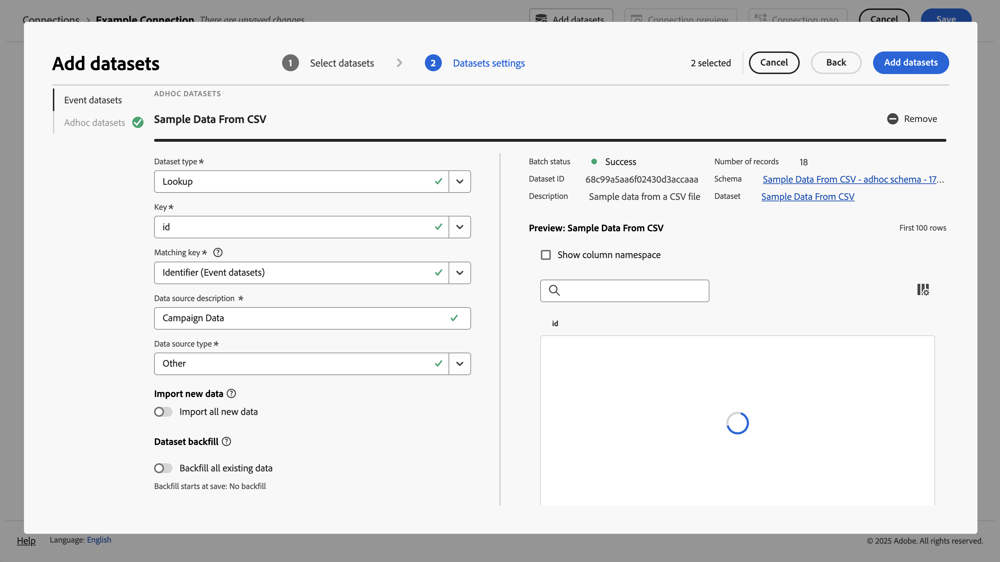

# Acquisire e utilizzare dati ad hoc

Questa guida rapida spiega come acquisire dati ad hoc in Experience Platform e quindi utilizzarli in Customer Journey Analytics.

A questo scopo, è necessario:

- **Crea un set di dati con un file CSV** in Experience Platform. Questo flusso di lavoro definisce il modello (schema) dei dati che desideri raccogliere e dove raccogliere i dati (set di dati).

- **Impostare una connessione** in Customer Journey Analytics. Questa connessione deve (almeno) includere il set di dati ad hoc di Experience Platform.

- **Configura una visualizzazione dati** in Customer Journey Analytics per definire metriche e dimensioni dai campi dei dati ad hoc che desideri utilizzare in Analysis Workspace.

- **Configurare un progetto** in Customer Journey Analytics per generare rapporti e visualizzazioni.

>[!NOTE]
>
>Questa guida rapida è una guida semplificata su come acquisire dati ad hoc in Experience Platform e utilizzarli in Customer Journey Analytics. Ti consigliamo vivamente di esaminare le informazioni aggiuntive quando vi fai riferimento.

## Creare un set di dati con un file CSV

Per questo avvio rapido, desideri utilizzare un file CSV che rappresenti i dati di ricerca e contenga informazioni simili a quelle mostrate di seguito.

| _id | tracking_code | ad_group | nome_campagna |
| ---: | :---          | :---        | :---          |
| 1 | abc123 | abc-adgroup | Campagna 123 |
| 2 | def123 | def-adgroup | Campagna 123 |
| 3 | ghi123 | ghi-adgroup | Campagna 123 |
| 4 | abc456 | abc-adgroup | Campagna 456 |
| 5 | def456 | def-adgroup | Campagna 456 |

>[!NOTE]
>
>Utilizza set di dati e schemi ad hoc per dati basati su record (ricerca, profilo). I set di dati e gli schemi ad hoc sono meno adatti e non devono essere considerati per i dati di serie temporali (evento, riepilogo).

Non è necessario creare uno schema XDM per dati ad hoc. Experience Platform supporta un flusso di lavoro che, in base ai dati contenuti nel file CSV:

1. Crea automaticamente uno schema ad hoc. Tale schema è conforme alle colonne del file CSV.
1. Crea un set di dati contenente i dati del file CSV.

Per avviare il flusso di lavoro:

1. Nell&#39;interfaccia di Experience Platform, nella barra a sinistra, seleziona **[!UICONTROL Workflows]**.
1. Selezionare  **[!UICONTROL Create dataset from CSV file]**.
1. Selezionare **[!UICONTROL Launch]** dal riquadro di destra.
1. Nella procedura guidata **[!UICONTROL Workflows]** > **[!UICONTROL Create dataset from CSV file]**:
   1. Nel passaggio **[!UICONTROL Configure dataset]** (Configura):
      1. Immetti **[!UICONTROL Name]** per il set di dati. Ad esempio: `Sample Data From CSV`.
      1. Aggiungi un elemento **[!UICONTROL Description]** facoltativo. Ad esempio: `Sample data from a CSV file`.
      1. Aggiungere uno o più **[!UICONTROL Tags]** facoltativi o selezionare uno o più **[!UICONTROL Tags]** esistenti.

         

      1. Seleziona **[!UICONTROL Next]** (Crea nuova visualizzazione dati).
   1. Nel passaggio **[!UICONTROL Add data]** (Configura):
      1. Seleziona **[!UICONTROL Choose Files]** per selezionare il file CSV dal computer o dalla rete. In alternativa, trascinare e rilasciare il file dal percorso del computer o della rete in **[!UICONTROL Drag and drop files]**. Il file è stato caricato e **[!UICONTROL Sample data]** è visualizzato.
      1. Attiva o disattiva **[!UICONTROL Error diagnostics]** e **[!UICONTROL Enable partial ingestion]** in base alle tue preferenze. Quando **[!UICONTROL Enable Partial ingestion]**, puoi definire un **[!UICONTROL Error threshold %]**.

         

      1. Seleziona **[!UICONTROL Finish]**.

Una volta preparati e caricati correttamente i dati, sei reindirizzato a **[!UICONTROL Datasets]** nell&#39;interfaccia di Experience Platform.  **[!UICONTROL Dataset activity]** per il set di dati **[!UICONTROL Sample Data from CSV]** con stato  **[!UICONTROL Processing]**.

Per esaminare i dati ad hoc:

1. Nell&#39;interfaccia di Experience Platform, nella barra a sinistra, seleziona **[!UICONTROL Datasets]**.
1. Selezionare la scheda **[!UICONTROL Browse]** in **[!UICONTROL Datasets]**. Dovresti visualizzare il set di dati elencato.
1. Selezionare il nome dello schema dalla colonna **[!UICONTROL Schema]**. Ad esempio: **[!UICONTROL Sample Data From CSV…]**

   

1. Nel popup, selezionare **[!UICONTROL Schema name]**. Ad esempio: **[!UICONTROL Sample Data From CSV - adhoc schema - XXXXXXXXXXX]**. Sei stato reindirizzato all&#39;interfaccia **[!UICONTROL Schemas]** > **[!UICONTROL Sample Data From CSV - adhoc schema - XXXXXXXXXXX]**.

Nell&#39;interfaccia **[!UICONTROL Schemas]** > **[!UICONTROL Sample Data From CSV - adhoc schema - XXXXXXXXXXX]**:

- Selezionare l&#39;oggetto nome tenant superiore sotto **[!UICONTROL Schemas]** > **[!UICONTROL Sample Data From CSV - adhoc schema - XXXXXXXXXXX]** per visualizzare i campi all&#39;interno dell&#39;oggetto. I campi all’interno dell’oggetto rappresentano la struttura del file CSV. Lo schema viene creato automaticamente in base al caricamento dei dati ad hoc.

  

  >[!NOTE]
  >
  >Il flusso di lavoro definisce tutti i campi dello schema come di tipo String. Non è possibile modificare questo tipo in una fase successiva. Se hai bisogno di maggiore flessibilità nella definizione di uno schema ad hoc, prendi in considerazione [l&#39;utilizzo dell&#39;API per creare uno schema ad hoc](https://experienceleague.adobe.com/it/docs/experience-platform/xdm/tutorials/ad-hoc) e quindi utilizza il [Crea set di dati dallo schema](https://experienceleague.adobe.com/en/docs/experience-platform/catalog/datasets/user-guide#schema) flusso di lavoro.
  > 

## Configurare una connessione

Per utilizzare il set di dati di Experience Platform in Customer Journey Analytics, crea una connessione che include il set di dati ad hoc risultante dal [flusso di lavoro](#create-a-dataset-with-a-csv-file)

Una connessione consente di integrare i set di dati da Experience Platform a Workspace. Per creare rapporti su questi set di dati, devi prima stabilire una connessione tra i set di dati in Experience Platform e Workspace.

Per creare la connessione:

1. Nell&#39;interfaccia utente di Customer Journey Analytics, selezionare **[!UICONTROL Connections]**, facoltativamente da **[!UICONTROL Data management]**, nel menu principale.

1. Seleziona **[!UICONTROL Create new connection]** (Crea uova connessione).

1. Nella schermata **[!UICONTROL Untitled connection]** (Connessione senza titolo):

   1. Assegna un nome e una descrizione alla connessione in **[!UICONTROL Connection Settings]** (Impostazioni della connessione).

   1. Seleziona la sandbox corretta dall’elenco **[!UICONTROL Sandbox]** in **[!UICONTROL Data settings]** (Impostazioni dati) e seleziona il numero di eventi giornalieri dall’elenco **[!UICONTROL Average number of daily events]** (Numero medio di eventi giornalieri).

      

   1. Seleziona **[!UICONTROL Add datasets]** (Aggiungi set di dati).

1. Nel passaggio **[!UICONTROL Select datasets]** (Seleziona set di dati) in **[!UICONTROL Add datasets]** (Aggiungi set di dati):

   1. Selezionare il set di dati creato in precedenza, ad esempio **[!UICONTROL Sample Data From CSV]**, e qualsiasi altro set di dati da includere nella connessione. I set di dati ad hoc hanno **[!UICONTROL Adhoc]** [!UICONTROL Dataset type].

      

   1. Seleziona **[!UICONTROL Next]** (Avanti).

1. Nel passaggio **[!UICONTROL Datasets settings]** (Seleziona set di dati) in **[!UICONTROL Add datasets]** (Aggiungi set di dati):

   Per il set di dati ad hoc:

   1. Seleziona il tipo di set di dati ad hoc. Ad esempio: **[!UICONTROL Lookup]**.
   1. Selezionare **[!UICONTROL Key]** dalle chiavi disponibili definite nello schema ad hoc.
   1. Selezionare un **[!UICONTROL Matching key]** da un set di dati evento aggiunto come parte della connessione.
   1. Seleziona l’origine dati corretta dall’elenco **[!UICONTROL Data source type]** (Tipo di origine dati). Se specifichi **[!UICONTROL Other]** (Altro), aggiungi una descrizione per l’origine dati.

   1. Imposta **[!UICONTROL Import all new data]** (Importa tutti i nuovi dati) e **[!UICONTROL Dataset backfill existing data]** (Dati esistenti di backfill del set di dati) secondo le tue preferenze.

      

   1. Seleziona **[!UICONTROL Add datasets]** (Aggiungi set di dati).

   1. Seleziona **[!UICONTROL Save]** (Salva).

Consulta [Impostazioni set di dati ad hoc](/help/connections/create-connection.md#adhoc-dataset) per ulteriori dettagli sulle impostazioni disponibili per i set di dati ad hoc.

>[!IMPORTANT]
>
>Oltre al consiglio generale di non utilizzare set di dati e schemi ad hoc per i dati delle serie temporali, non è possibile utilizzare il flusso di lavoro **[!UICONTROL Create dataset from CSV]** per i dati delle serie temporali. Questo flusso di lavoro definisce tutti i campi come di tipo String che non è possibile modificare successivamente. Quando si aggiunge un set di dati basato su serie temporali (evento o riepilogo) a una connessione, questo tipo di set di dati richiede la definizione di almeno un campo di tipo DateTime. Se è necessario utilizzare dati di serie temporali ad hoc, valutare l&#39;opportunità di [utilizzare l&#39;API per creare uno schema ad hoc](https://experienceleague.adobe.com/en/docs/experience-platform/xdm/tutorials/ad-hoc#token_type=bearer&expires_in=43197438) e quindi utilizzare il [Crea set di dati dal flusso di lavoro dello schema](https://experienceleague.adobe.com/en/docs/experience-platform/catalog/datasets/user-guide#schema).

Dopo aver creato una [connessione](/help/connections/overview.md), è possibile eseguire varie attività di gestione, ad esempio [selezionare e combinare i set di dati](/help/connections/combined-dataset.md), [controllare lo stato dei set di dati di una connessione e lo stato dell&#39;acquisizione dei dati](/help/connections/manage-connections.md) e altro ancora.

## Configurare una visualizzazione dati

Una visualizzazione dati è un contenitore specifico di Customer Journey Analytics che consente di determinare come interpretare i dati da una connessione. Specifica tutte le dimensioni e le metriche disponibili in Analysis Workspace, e da quali colonne tali dimensioni e metriche ottengono i loro dati. Le visualizzazioni dati sono definite in preparazione alle attività di reporting in Analysis Workspace.

Per creare la visualizzazione dati:

1. Nell&#39;interfaccia utente di Customer Journey Analytics, selezionare **[!UICONTROL Data views]**, facoltativamente da **[!UICONTROL Data management]**, nel menu principale.

1. Seleziona **[!UICONTROL Create new data view]** (Crea nuova visualizzazione dati).

1. Nel passaggio **[!UICONTROL Configure]** (Configura):

   1. Seleziona la [connessione](#set-up-a-connection) dall&#39;elenco **[!UICONTROL Connection]**.

   1. Assegna un nome e (facoltativamente) una descrizione alla connessione.

      

   1. Seleziona **[!UICONTROL Save and continue]** (Salva e continua).

1. Nel passaggio **[!UICONTROL Components]** (Configura):

   1. Aggiungere qualsiasi campo schema e/o componente standard che si desidera includere nelle caselle del componente **[!UICONTROL METRICS]** o **[!UICONTROL DIMENSIONS]**. Assicurati di aggiungere campi rilevanti dal set di dati che contiene i dati ad hoc. Per accedere a questi campi:

      1. Seleziona **[!UICONTROL Event datasets]** (Aggiungi set di dati).
      1. Seleziona **[!UICONTROL Adhoc & Model-based fields]** (Salva).

         

      1. Trascinare i campi dagli schemi ad hoc su **[!UICONTROL METRICS]** o **[!UICONTROL DIMENSIONS]**.

   1. Facoltativamente, utilizzare [campi derivati](/help/data-views/derived-fields/derived-fields.md) per modificare qualsiasi campo ad hoc dal tipo e formato di stringa predefiniti a un altro tipo o formato.

   1. Seleziona **[!UICONTROL Save and continue]** (Crea nuova visualizzazione dati).

1. Nel passaggio **[!UICONTROL Settings]** (Configura):

   Lascia le impostazioni così come sono e seleziona **[!UICONTROL Save and finish]** (Salva e fine).

Per ulteriori informazioni su come creare e modificare una visualizzazione dati, vedere [Panoramica delle visualizzazioni dati](../data-views/data-views.md). Quali componenti sono disponibili per l’utilizzo nella visualizzazione dati e come utilizzare le impostazioni di segmenti e sessioni.

## Configurare un progetto

Analysis Workspace è uno strumento di browser flessibile che consente di creare analisi rapidamente e condividere informazioni basate sui dati. Usa i progetti Workspace per combinare componenti dati, tabelle e visualizzazioni per sviluppare analisi da condividere con altri nella tua organizzazione.

Per creare il progetto:

1. Nell&#39;interfaccia utente di Customer Journey Analytics, seleziona **[!UICONTROL Projects]** nel menu principale.

1. Seleziona **[!UICONTROL Projects]** (Progetti) nel pannello di navigazione a sinistra.

1. Seleziona **[!UICONTROL Create project]** (Aggiungi set di dati).

1. Seleziona **[!UICONTROL Blank project]** (Salva).

1. Seleziona la [visualizzazione dati](#set-up-a-data-view) dall&#39;elenco.

1. Per creare il primo rapporto, inizia a trascinare dimensioni e metriche su [!UICONTROL Freeform table] in [!UICONTROL Panel]. Inclusione di metriche o dimensioni basate su dati ad hoc.

Per ulteriori informazioni su come creare progetti e generare analisi utilizzando componenti, visualizzazioni e pannelli, consulta la sezione [Panoramica di Analysis Workspace](../analysis-workspace/home.md).

>[!SUCCESS]
>
>Hai completato tutti i passaggi. Per iniziare, definisci quali dati ad hoc desideri raccogliere (file CSV). Hai utilizzato il flusso di lavoro per creare un set di dati e uno schema ad hoc da quel file CSV. Hai definito una connessione in Customer Journey Analytics per utilizzare i dati ad hoc acquisiti e altri dati. La definizione della visualizzazione dati ti consente di specificare la dimensione e le metriche da utilizzare e infine hai creato il tuo primo progetto per la visualizzazione e l’analisi dei dati.
