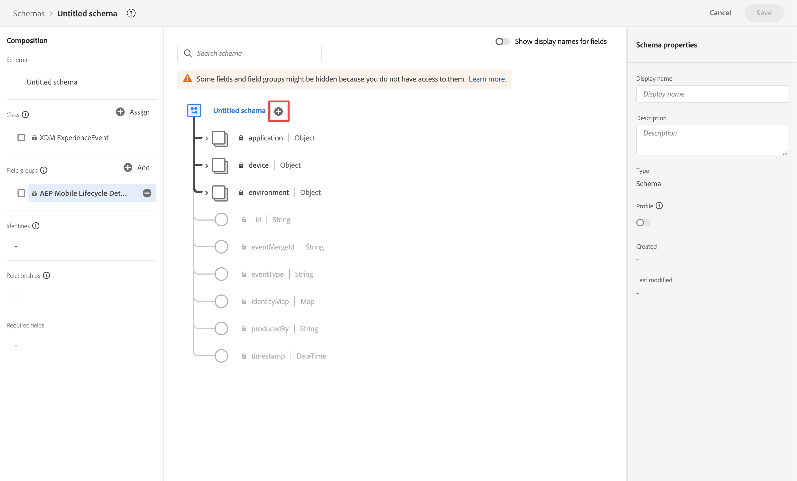
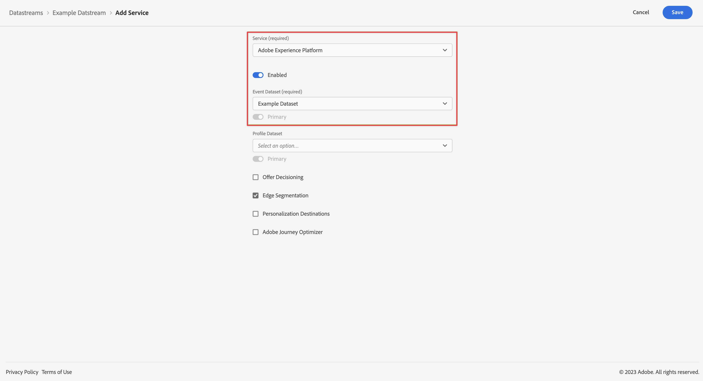

# Acquisire dati tramite Adobe Experience Platform Mobile SDK

Questa guida rapida spiega come acquisire i dati di tracciamento delle app mobili direttamente in Adobe Experience Platform utilizzando Adobe Experience Platform Mobile SDK e Edge Network. Quindi usa quei dati nel Customer Journey Analytics.

A questo scopo, è necessario:

- **Configurare uno schema e un set di dati** in Adobe Experience Platform per definire il modello (schema) dei dati da raccogliere e dove raccogliere effettivamente i dati (set di dati).

- **Configurare un flusso di dati** per configurare la rete Edge di Adobe Experience Platform in modo che i dati raccolti vengano indirizzati al set di dati configurato in Adobe Experience Platform.

- **Usa tag** per configurare facilmente regole ed elementi dati in base ai dati presenti nell’app mobile. Quindi assicurati che i dati siano inviati al flusso di dati configurato sulla rete Edge di Adobe Experience Platform.

- **Distribuire e convalidare**. Disporre di un ambiente in cui puoi eseguire iterazioni sullo sviluppo dei tag e, una volta convalidato tutto, pubblicarlo in diretta nell’ambiente di produzione.

- **Impostare una connessione** in Customer Journey Analytics. Questa connessione deve includere almeno il set di dati di Adobe Experience Platform.

- **Configurare una visualizzazione dati** in Customer Journey Analytics per definire le metriche e le dimensioni da utilizzare in Analysis Workspace.

- **Configurare un progetto** in Customer Journey Analytics per generare rapporti e visualizzazioni.

>[!NOTE]
>
>Questa guida rapida è una guida semplificata su come acquisire in Adobe Experience Platform i dati raccolti dall’applicazione e utilizzarli nel Customer Journey Analytics. Ti consigliamo vivamente di esaminare le informazioni aggiuntive quando vi fai riferimento.

## Configurare uno schema e un set di dati

Per inserire i dati in Adobe Experience Platform, innanzitutto devi definire quali dati desideri raccogliere. Tutti i dati inseriti in Adobe Experience Platform devono essere conformi a una struttura standard e denormalizzata affinché vengano riconosciuti e utilizzati dalle capacità e funzionalità a valle. Experience Data Model (XDM) è il framework standard che fornisce una struttura sotto forma di schemi.

Una volta definito uno schema, utilizza uno o più set di dati per memorizzare e gestire la raccolta di dati. Un set di dati è un costrutto di archiviazione e gestione per una raccolta di dati (in genere una tabella) che contiene uno schema (colonne) e dei campi (righe).

Tutti i dati inseriti in Adobe Experience Platform devono essere conformi a uno schema predefinito prima di poter essere memorizzati come set di dati.

### Configurare uno schema

Desideri tenere traccia di alcuni dati minimi dai profili che utilizzano la tua app mobile, ad esempio il nome della scena e l’identificazione.
Devi innanzitutto definire uno schema che modella questi dati.

Per configurare lo schema:

1. Nell’interfaccia utente di Adobe Experience Platform, nella barra a sinistra, seleziona **[!UICONTROL Schemas]** (Schemi) all’interno di [!UICONTROL DATA MANAGEMENT] (GESTIONE DATI).

1. Seleziona **[!UICONTROL Create schema]**. .
1. Nel passaggio Selezionare una classe della procedura guidata Crea schema:

   1. Seleziona **[!UICONTROL Experience Event]**.

      

      >[!INFO]
      >
      >    Per modellare l’evento viene utilizzato uno schema Experience Event _comportamento_ di un profilo (come nome della scena, pulsante per aggiungerlo al carrello). Per modellare gli _attributi_ del profilo (come nome, e-mail, genere) viene utilizzato uno schema Individual Profile.

   1. Seleziona **[!UICONTROL Next]**.

1. In [!UICONTROL Name and review step] del [!UICONTROL Create schema] procedura guidata:

   1. Immetti un **[!UICONTROL Schema display name]** per lo schema e (facoltativo) un **[!UICONTROL Description]**.

      

   1. Seleziona **[!UICONTROL Finish]**.

1. Nella scheda Struttura dello schema di esempio:

   1. Seleziona **[!UICONTROL + Add]** (Aggiungi) in [!UICONTROL Field groups] (Gruppi di campi).

      

      I gruppi di campi sono raccolte riutilizzabili di oggetti e attributi che consentono di estendere facilmente lo schema.

   1. Nella finestra di dialogo [!UICONTROL Add fields groups] (Aggiungi gruppi di campi) seleziona il gruppo di campi **[!UICONTROL AEP Mobile SDK ExperienceEvent]** dall’elenco.

      

      Puoi selezionare il pulsante di anteprima per visualizzare un’anteprima dei campi che fanno parte del gruppo di campi, ad esempio `application > name`.

      

      Seleziona **[!UICONTROL Back]** (Indietro) per chiudere l’anteprima.

   1. Seleziona **[!UICONTROL Add field groups]** (Aggiungi gruppi di campi).

1. Seleziona **[!UICONTROL +]** accanto al nome dello schema nel pannello [!UICONTROL Structure] (Struttura).

   

1. In [!UICONTROL Field Properties] pannello, invio `identification` come [!UICONTROL Field name], **[!UICONTROL Identification]** come [!UICONTROL Display name], seleziona **[!UICONTROL Object]** come [!UICONTROL Type] e seleziona **[!UICONTROL ExperienceEvent Core v2.1]** come [!UICONTROL Field Group].

   >[!NOTE]
   >
   >Se tale gruppo di campi non è disponibile, cercare un altro gruppo di campi contenente campi di identità. Oppure [crea un nuovo gruppo di campi](https://experienceleague.adobe.com/docs/experience-platform/xdm/ui/resources/field-groups.html?lang=en) e [aggiungi nuovi campi di identità](https://experienceleague.adobe.com/docs/experience-platform/xdm/ui/fields/identity.html?lang=en#define-a-identity-field) (like `ecid`, `crmId`e altri elementi necessari) al gruppo di campi e selezionarlo.

   

   L’oggetto di identificazione aggiunge funzionalità di identificazione allo schema. Nel tuo caso, vuoi identificare i profili utilizzando la tua app mobile utilizzando l’ID Experience Cloud e l’indirizzo e-mail. Sono disponibili molti altri attributi per tenere traccia dell’identificazione della persona (ad esempio ID cliente, ID fedeltà).

   Seleziona **[!UICONTROL Apply]** (Applica) per aggiungere questo oggetto allo schema.

1. Seleziona il campo **[!UICONTROL ecid]** nell’oggetto di identificazione appena aggiunto e seleziona **[!UICONTROL Identity]** (Identità) e **[!UICONTROL Primary Identity]** (Identità principale) e **[!UICONTROL ECID]** dall’elenco [!UICONTROL Identity namespace] (Spazio dei nomi dell’identità) nel pannello di destra.

   

   Stai specificando l’Experience Cloud Identity come identità principale che il servizio Adobe Experience Platform Identity può utilizzare per combinare (unire) il comportamento dei profili con lo stesso ECID.

   Seleziona **[!UICONTROL Apply]** (Applica). Nell’attributo ecid viene visualizzata l’icona di un’impronta digitale.

1. Seleziona il campo **[!UICONTROL email]** nell’oggetto di identificazione appena aggiunto e seleziona **[!UICONTROL Identity]** (identità) e **[!UICONTROL Email]** dall’elenco [!UICONTROL Identity namespace] (Spazio dei nomi dell’identità) nel pannello [!UICONTROL Field Properties] (Proprietà campo).

   

   Stai specificando l’indirizzo e-mail come un’altra identità che il servizio Adobe Experience Platform Identity può utilizzare per combinare (unire) il comportamento dei profili.

   Seleziona **[!UICONTROL Apply]** (Applica). Nell’attributo e-mail viene visualizzata l’icona di un’impronta digitale.

   Seleziona **[!UICONTROL Save]** (Salva).

1. Seleziona l’elemento principale dello schema che visualizza il nome dello schema, quindi seleziona il pulsante **[!UICONTROL Profile]** (Profilo).

   Viene richiesto di abilitare lo schema per il profilo. Una volta abilitato, quando i dati vengono inseriti in set di dati basati su questo schema, tali dati vengono uniti su Real-Time Customer Profile.

   Per ulteriori informazioni, consulta la sezione [Abilitare lo schema per l’utilizzo in Real-Time Customer Profile](https://experienceleague.adobe.com/docs/experience-platform/xdm/tutorials/create-schema-ui.html?lang=it#profile).

   >[!IMPORTANT]
   >
   >    Una volta salvato uno schema abilitato per il profilo, non è più possibile disattivarlo per il profilo.

   

1. Seleziona **[!UICONTROL Save]** (Salva) per salvare lo schema.

Hai creato uno schema minimo che modella i dati che puoi acquisire dall’app mobile. Lo schema consente di identificare i profili utilizzando Experience Cloud Identity e l’indirizzo e-mail. Attivando lo schema per il profilo, puoi garantire che i dati acquisiti dall’app mobile vengano aggiunti al Profilo cliente in tempo reale.

Oltre ai dati sul comportamento, puoi anche acquisire i dati degli attributi del profilo dalla tua app mobile (ad esempio i dettagli dei profili che si abbonano a una newsletter).

Per acquisire i dati del profilo:

- Crea uno schema basato sulla classe di profilo individuale XDM.

- Aggiungi il gruppo di campi Profile Core v2 allo schema.

- Aggiungi un oggetto di identificazione basato sul gruppo di campi Profile Core v2.

- Definisci l’ID Experience Cloud come identificatore principale e invia un’e-mail come identificatore.

- Abilitare lo schema per il profilo

Per ulteriori informazioni sull’aggiunta e la rimozione di gruppi di campi e singoli campi a uno schema, consulta la sezione [Creare e modificare schemi nell’interfaccia utente](https://experienceleague.adobe.com/docs/experience-platform/xdm/ui/resources/schemas.html?lang=it).

### Configurare un set di dati

Con lo schema, hai definito il modello dati. Ora devi definire il costrutto per memorizzare e gestire tali dati utilizzando i set di dati.

Per configurare il set di dati:

1. Nell’interfaccia utente di Adobe Experience Platform, nella barra a sinistra, seleziona **[!UICONTROL Datasets]** (Set di dati) all’interno di [!UICONTROL DATA MANAGEMENT] (GESTIONE DATI).

2. Seleziona **[!UICONTROL Create dataset]** (Crea set di dati).

   

3. Seleziona **[!UICONTROL Create dataset from schema]** (Crea set di dati da schema).

   

4. Seleziona lo schema creato in precedenza e seleziona **[!UICONTROL Next]** (Avanti).

5. Assegna un nome al set di dati e (facoltativamente) fornisci una descrizione.

   

6. Seleziona **[!UICONTROL Finish]** (Fine).

7. Seleziona il pulsante **[!UICONTROL Profile]** (Profilo).

   Viene richiesto di abilitare il set di dati per il profilo. Una volta attivato, il set di dati arricchisce i profili dei clienti in tempo reale con i relativi dati inseriti.

   >[!IMPORTANT]
   >
   >    Puoi abilitare un set di dati per il profilo solo quando lo schema a cui aderisce il set di dati è abilitato anche per il profilo.

   

Per ulteriori informazioni su come visualizzare, visualizzare in anteprima, creare, eliminare un set di dati, consulta la sezione [Guida all’interfaccia utente dei set di dati](https://experienceleague.adobe.com/docs/experience-platform/catalog/datasets/user-guide.html?lang=it). E come abilitare un set di dati per Real-Time Customer Profile.

## Configurare un flusso di dati

Un flusso di dati rappresenta la configurazione lato server quando si implementano gli SDK per Web e dispositivi mobili di Adobe Experience Platform. Durante la raccolta di dati con gli SDK di Adobe Experience Platform, i dati vengono inviati alla rete Edge di Adobe Experience Platform. È lo stream di dati che determina a quali servizi vengono inoltrati i dati.

Nella configurazione, desideri che i dati raccolti dall’app mobile vengano inviati al set di dati in Adobe Experience Platform.

Per impostare il flusso di dati:

1. Nell’interfaccia utente di Adobe Experience Platform, seleziona **[!UICONTROL Datastreams]** (Flussi di dati) da [!UICONTROL DATA COLLECTION] (RACCOLTE DATI) nella barra a sinistra.

2. Seleziona **[!UICONTROL New Datastream]** (Nuovo flusso di dati).

3. Assegna un nome e una descrizione al tuo flusso di dati. Seleziona lo schema dall’elenco [!UICONTROL Event Schema] (Schema eventi).

   

4. Seleziona **[!UICONTROL Save]** (Salva).

5. Seleziona **[!UICONTROL Add Service]** (Aggiungi servizio).

6. Nella schermata [!UICONTROL Add Service screen] (Aggiungi servizio):

   1. Seleziona **[!UICONTROL Adobe Experience Platform]** dall’elenco [!UICONTROL Service] (Servizio).

   2. Assicurati di aver selezionato **[!UICONTROL Enabled]** (Abilitato).

   3. Seleziona il set di dati dall’elenco [!UICONTROL Event Dataset] (Set di dati evento).

      

   4. Abbandona le altre impostazioni e seleziona **[!UICONTROL Save]** per salvare il flusso di dati.

Lo stream di dati è ora configurato per inoltrare i dati raccolti dall’app mobile al set di dati in Adobe Experience Platform.

Per ulteriori informazioni su come configurare un flusso di dati e come gestire i dati sensibili consulta la sezione [Panoramica dei flussi di dati](https://experienceleague.adobe.com/docs/experience-platform/edge/datastreams/overview.html?lang=it).

## Usare i tag

Per implementare il codice sul sito per raccogliere effettivamente i dati, utilizza la funzione Tag in Adobe Experience Platform. Questa soluzione per la gestione dei tag consente di implementare il codice e altri requisiti di assegnazione dei tag. I tag offrono un’integrazione perfetta con Adobe Experience Platform tramite l’estensione Adobe Experience Platform Mobile SDK.

### Creare il tag

1. Nell’interfaccia utente di Adobe Experience Platform, nella barra a sinistra, seleziona **[!UICONTROL Tags]** (Tag) all’interno di [!UICONTROL DATA COLLECTION] (GESTIONE DATI).

2. Seleziona **[!UICONTROL New Property]** (Crea set di dati).

   Denomina il tag e seleziona **[!UICONTROL Mobile]**. Seleziona **[!UICONTROL Save]** (Salva) per continuare.

   

### Configurare il tag

Dopo aver creato il tag, devi configurarlo con le estensioni corrette e configurare elementi dati e regole in base a come desideri tenere traccia del sito e inviare dati ad Adobe Experience Platform.

Per configurare, seleziona il tag appena creato dall’elenco di [!UICONTROL Tag Properties].

#### **Estensioni**

Aggiungi l’estensione Adobe Platform Edge Network al tag per garantire che tu possa inviare dati a Adobe Experience Platform (tramite lo stream di dati).

Per creare e configurare l&#39;estensione Adobe Experience Platform Mobile SDK:

1. Seleziona **[!UICONTROL Extensions]** nella barra a sinistra. Puoi vedere che le estensioni Mobile Core e Profile sono già disponibili.

1. Seleziona **[!UICONTROL Catalog]** (Catalogo) nella barra superiore.

1. Cerca o scorri fino a **[!UICONTROL Adobe Experience Platform Edge Network]** e seleziona **[!UICONTROL Install]** nel riquadro di destra per installarlo.

1. Seleziona la sandbox e il flusso di dati creato in precedenza per il tuo [!UICONTROL Production Environment] (Ambiente di produzione) e (facoltativamente) [!UICONTROL Staging Environment] (Ambiente di gestione temporanea) e [!UICONTROL Development Environment] (Ambiente di sviluppo).

   

1. Immetti il **[!UICONTROL Edge Network domain]** sotto [!UICONTROL Domain configuration]. In genere utilizza `<organizationName>.data.adobedc.net`.

1. Seleziona **[!UICONTROL Save]**.

Consulta [Configurare l’estensione Adobe Experience Platform Edge Network](https://developer.adobe.com/client-sdks/documentation/edge-network) per ulteriori informazioni.

Desideri anche impostare le seguenti estensioni aggiuntive dal catalogo:

- Identità.
- Garanzia AEP.
- Consenso.

Consulta [Configurare una proprietà tag](https://experienceleague.adobe.com/docs/platform-learn/implement-mobile-sdk/initial-configuration/configure-tags.html?lang=en) nell’esercitazione sulle app mobili per Experience Platform, per ulteriori informazioni sulle estensioni e sulla relativa configurazione.

#### **Elementi dati**

Gli elementi dati sono i blocchi costitutivi per il dizionario dati (o mappa dati). Utilizza elementi dati per raccogliere, organizzare e distribuire dati in tutta la tecnologia marketing e pubblicitaria. Puoi impostare nel tag elementi di dati che leggono da dati o eventi dell’app mobile e che possono essere utilizzati per inviare dati a Adobe Experience Platform.

Ad esempio, desideri raccogliere il nome dell’operatore dall’app mobile.

Per definire un elemento dati del nome di un vettore:

1. Seleziona **[!UICONTROL Data Elements]** (Elementi dati) nella barra a sinistra.

2. Seleziona **[!UICONTROL Add Data Element]** (Aggiungi elemento dati).

3. Nella finestra di dialogo [!UICONTROL Create Data Element] (Crea elemento dati):

   - Assegna un nome all’elemento dati, ad esempio `Carrier Name` (Nome pagina).

   - Seleziona **[!UICONTROL Mobile Core]** dall’elenco [!UICONTROL Extension] (Estensioni).

   - Seleziona **[!UICONTROL Carrier Name]** (Titolo) dall’elenco [!UICONTROL Data Element Type] (Attributo).

     

   - Seleziona **[!UICONTROL Save]**.

Puoi creare tutti gli elementi dati desiderati e utilizzarli nelle regole.

#### **Regole**

I tag in Adobe Experience Platform seguono un sistema basato su regole. Cercano le interazione degli utenti e i relativi dati. Quando i criteri descritti nelle tue regole vengono soddisfatti, la regola attiva l’estensione, lo script o il codice lato client identificato. È possibile utilizzare le regole per inviare dati (come un oggetto XDM) in Adobe Experience Platform utilizzando l’estensione Adobe Experience Platform Edge Network.

Ad esempio, desideri inviare i dati dell’evento quando l’app mobile viene utilizzata (in primo piano) e quando l’app mobile non viene utilizzata (viene rimandata in background).

Per definire una regola:

1. Seleziona **[!UICONTROL Rules]** (Regole) nella barra a sinistra.

2. Seleziona **[!UICONTROL Create New Rule]** (Aggiungi elemento dati).

3. Nella finestra di dialogo [!UICONTROL Create Rule] (Crea regola):

   - Assegna un nome alla regola, ad esempio `Application Status`.

   - Seleziona **[!UICONTROL + Add]** (Aggiungi) sotto [!UICONTROL Events] (Eventi).

   - Nella finestra di dialogo [!UICONTROL Event Configuration] (Configurazione evento):

      - Seleziona **[!UICONTROL Mobile Core]** dall’elenco [!UICONTROL Extension] (Estensioni)

      - Seleziona **[!UICONTROL Foreground]** (Info pagina) dall’elenco [!UICONTROL Event Type] (Tipo di elemento dati).

      - Seleziona **[!UICONTROL Keep Changes]** (Crea set di dati).

   - Clic  accanto a [!UICONTROL Mobile Core - Foreground].

      - Seleziona **[!UICONTROL Mobile Core]** dall’elenco [!UICONTROL Extension] (Estensioni).

      - Seleziona **[!UICONTROL Background]** (Info pagina) dall’elenco [!UICONTROL Event Type] (Tipo di elemento dati).

      - Seleziona **[!UICONTROL Keep Changes]** (Crea set di dati).

   - Clic  Aggiungi sotto [!UICONTROL ACTIONS]. Nella finestra di dialogo [!UICONTROL Action Configuration] (Configurazione evento):

      - Seleziona **[!UICONTROL Adobe Experience Platform Edge Network]** dall’elenco [!UICONTROL Extension] (Estensioni)

      - Seleziona **[!UICONTROL Forward event to Edge Network]** (Info pagina) dall’elenco [!UICONTROL Action Type] (Tipo di elemento dati).

      - Seleziona **[!UICONTROL Keep Changes]** (Mantieni modifiche).

   - L’aspetto della regola dovrebbe essere il seguente:

     

   - Seleziona **[!UICONTROL Save]** (Salva).

Quanto sopra è solo un esempio di definizione di una regola che invia dati XDM, contenenti lo stato dell’applicazione, alla rete Adobe Edge e a Adobe Experience Platform.

Puoi utilizzare le regole in vari modi nel tag per manipolare le variabili (utilizzando gli elementi dati).

Per ulteriori informazioni, consulta la sezione [Regole](https://developer.adobe.com/client-sdks/documentation/lifecycle-for-edge-network/#configure-a-rule-to-forward-lifecycle-metrics-to-platform) per ulteriori informazioni.

### Creare e pubblicare il tag

Dopo aver definito elementi dati e regole, devi generare e pubblicare il tag. Quando crei una build della libreria, devi assegnarla a un ambiente. Le estensioni, le regole e gli elementi dati della build vengono quindi compilati e inseriti nell’ambiente assegnato. Ogni ambiente fornisce un codice di incorporamento univoco che consente di integrare la build assegnata nel sito.

Per generare e pubblicare il tag:

1. Seleziona **[!UICONTROL Publishing Flow]** (Flusso di pubblicazione) nella barra a sinistra.

2. Seleziona **[!UICONTROL Select a working library]** (Seleziona una libreria di lavoro) e poi **[!UICONTROL Add Library…]** (Aggiungi libreria...).

3. Nella finestra di dialogo [!UICONTROL Create Library] (Crea libreria):

   - Assegna un nome alla libreria.

   - Seleziona **[!UICONTROL Development (development)]** dall’elenco.[!UICONTROL Environment]

   - Seleziona **[!UICONTROL + Add All Changed Resources]** (Crea set di dati).

     

   - Seleziona **[!UICONTROL Save & Build to Development]** (Salva e crea per lo sviluppo).

   Il tag viene salvato e generato per l’ambiente di sviluppo. Un punto verde indica la corretta compilazione del tag nell’ambiente di sviluppo.

4. È possibile selezionare **[!UICONTROL ...]** per ricreare la libreria o spostarla in un ambiente di gestione temporanea o produzione.

I tag Adobe Experience Platform supportano flussi di lavoro di pubblicazione semplici o complessi che dovrebbero adattarsi alla distribuzione della rete Edge di Adobe Experience Platform.

Per ulteriori informazioni, consulta la sezione [Panoramica di pubblicazione](https://developer.adobe.com/client-sdks/documentation/getting-started/create-a-mobile-property/#publish-the-configuration).

### Recuperare il codice del tag

Infine, devi utilizzare il tag all’interno dell’app mobile di cui desideri tenere traccia.

Per ottenere istruzioni sul codice che spiegano come configurare l’app mobile e utilizzare il tag nell’app:

1. Seleziona **[!UICONTROL Environments]** (Elementi dati) nella barra a sinistra.

2. Dall’elenco degli ambienti, seleziona l’installazione corretta  pulsante.

   In [!UICONTROL Mobile Install Instructions] , seleziona la piattaforma appropriata ([!UICONTROL iOS], [!UICONTROL Android]). Quindi utilizza la copia  accanto a ciascuno dei frammenti di codice pertinenti che si desidera utilizzare per configurare e inizializzare l’app mobile:

   

3. Seleziona **[!UICONTROL Close]** (Chiudi).

Invece del codice per l’ambiente di sviluppo, potresti aver selezionato un altro ambiente (staging, produzione) in base alla posizione in cui stai distribuendo l’SDK di Adobe Experience Platform Mobile.

Per ulteriori informazioni, consulta la sezione [Ambienti](https://experienceleague.adobe.com/docs/experience-platform/tags/publish/environments/environments.html?lang=it).

## Distribuire e convalidare

Ora puoi distribuire il codice all’interno dell’app mobile. Una volta implementata, l’app mobile inizia a raccogliere dati in Adobe Experience Platform.

Convalida l’implementazione, correggila laddove necessario e una volta corretta, distribuiscila nel tuo ambiente di gestione temporanea e produzione utilizzando la funzione di flusso di lavoro di pubblicazione dei tag.

Consulta [Tutorial sull’implementazione di Adobe Experience Cloud nelle app per dispositivi mobili](https://experienceleague.adobe.com/docs/platform-learn/implement-mobile-sdk/overview.html?lang=it) per informazioni molto più dettagliate.

## Configurare una connessione

Per utilizzare i dati di Adobe Experience Platform in Customer Journey Analytics, crea una connessione che include i dati risultanti dalla configurazione dello schema, del set di dati e del flusso di lavoro.

Una connessione consente di integrare set di dati da Adobe Experience Platform in Workspace. Per creare rapporti su questi set di dati, devi prima stabilire una connessione tra i set di dati in Adobe Experience Platform e Workspace.

Per creare la connessione:

1. Nell’interfaccia utente di Customer Journey Analytics, seleziona **[!UICONTROL Connections]** (Connessioni) nel pannello di navigazione superiore.

2. Seleziona **[!UICONTROL Create new connection]** (Crea uova connessione).

3. Nella schermata [!UICONTROL Untitled connection] (Connessione senza titolo):

   Assegna un nome e una descrizione alla connessione in [!UICONTROL Connection Settings] (Impostazioni della connessione).

   Seleziona la sandbox corretta dall’elenco [!UICONTROL Sandbox] in [!UICONTROL Data settings] (Impostazioni dati) e seleziona il numero di eventi giornalieri dall’elenco [!UICONTROL Average number of daily events] (Numero medio di eventi giornalieri).

   

   Seleziona **[!UICONTROL Add datasets]** (Aggiungi set di dati).

   Nel passaggio [!UICONTROL Select datasets] (Seleziona set di dati) in [!UICONTROL Add datasets] (Aggiungi set di dati):

   - Seleziona i set di dati creati in precedenza e/o altri set di dati rilevanti che desideri includere nella connessione (ad esempio i dati degli eventi di esperienza di tracciamento push e i dati del profilo push di Adobe Journey Optimizer)

     

   - Seleziona **[!UICONTROL Next]** (Avanti).

   Nel passaggio [!UICONTROL Datasets settings] (Impostazioni set di dati) in [!UICONTROL Add datasets] (Aggiungi set di dati):

   - Per ogni set di dati:

      - Seleziona un [!UICONTROL Person ID] (ID persona) tra le identità disponibili definite negli schemi di set di dati in Adobe Experience Platform.

      - Seleziona l’origine dati corretta dall’elenco [!UICONTROL Data source type] (Tipo di origine dati). Se specifichi **[!UICONTROL Other]** (Altro), aggiungi una descrizione per l’origine dati.

      - Imposta **[!UICONTROL Import all new data]** (Importa tutti i nuovi dati) e **[!UICONTROL Dataset backfill existing data]** (Dati esistenti di backfill del set di dati) secondo le tue preferenze.

     

   - Seleziona **[!UICONTROL Add datasets]** (Aggiungi set di dati).

   Seleziona **[!UICONTROL Save]** (Salva).

Per ulteriori informazioni su come creare e gestire una connessione e come selezionare e combinare i set di dati, consulta la sezione [Panoramica delle connessioni](../connections/overview.md).

## Configurare una visualizzazione dati

Una visualizzazione dati è un contenitore specifico di Customer Journey Analytics che consente di determinare come interpretare i dati da una connessione. Specifica tutte le dimensioni e le metriche disponibili in Analysis Workspace, e da quali colonne tali dimensioni e metriche ottengono i loro dati. Le visualizzazioni dati sono definite in preparazione alle attività di reporting in Analysis Workspace.

Per creare la visualizzazione dati:

1. Nell’interfaccia utente di Customer Journey Analytics, seleziona **[!UICONTROL Data views]** (Visualizzazioni dati) nel pannello di navigazione superiore.

2. Seleziona **[!UICONTROL Create new data view]** (Crea nuova visualizzazione dati).

3. Nel passaggio [!UICONTROL Configure] (Configura):

   Seleziona la connessione dall’elenco [!UICONTROL Connection] (Connessioni).

   Assegna un nome e (facoltativamente) una descrizione alla connessione.

   

   Seleziona **[!UICONTROL Save and continue]** (Salva e continua).

4. Nel passaggio [!UICONTROL Components] (Componenti):

   Aggiungi qualsiasi campo dello schema e/o componente standard che desideri includere nelle caselle dei componenti [!UICONTROL METRICS] (METRICHE) o [!UICONTROL DIMENSIONS] (DIMENSIONI).

   

   Seleziona **[!UICONTROL Save and continue]** (Salva e continua).

5. Nel passaggio [!UICONTROL Settings] (Impostazioni):

   

   Lascia le impostazioni così come sono e seleziona **[!UICONTROL Save and finish]** (Salva e fine).

Per ulteriori informazioni su come creare e modificare una visualizzazione dati, quali componenti sono disponibili per la visualizzazione dati e come utilizzare le impostazioni di filtro e sessioni, consulta la sezione [Panoramica delle visualizzazioni dati](../data-views/data-views.md).

## Configurare un progetto

Analysis Workspace è uno strumento basato su browser flessibile che consente di creare rapidamente le analisi e condividere i dati rilevati sulla base dei tuoi dati. Usa i progetti Workspace per combinare componenti dati, tabelle e visualizzazioni per sviluppare analisi da condividere con altri nella tua organizzazione.

Per creare il progetto:

1. Nell’interfaccia utente di Customer Journey Analytics, seleziona **[!UICONTROL Projects]** (Progetti) nel pannello di navigazione superiore.

2. Seleziona **[!UICONTROL Projects]** (Progetti) nel pannello di navigazione a sinistra.

3. Seleziona **[!UICONTROL Create project]** (Crea progetto).

   

   Seleziona **[!UICONTROL Blank project]** (Progetto vuoto).

   

4. Seleziona la visualizzazione dati dall’elenco.

   .

5. Per creare il primo rapporto, inizia a trascinare dimensioni e metriche sulla [!UICONTROL Freeform table] nel [!UICONTROL Panel] . Ad esempio, trascina `Events` come metriche e `Push Title` come dimensione, suddivisa per `Event Type` per ottenere una panoramica delle notifiche push per l’app mobile e di ciò che è successo.

   

Per ulteriori informazioni su come creare progetti e generare analisi utilizzando componenti, visualizzazioni e pannelli, consulta la sezione [Panoramica di Analysis Workspace](../analysis-workspace/home.md).

>[!SUCCESS]
>
>Hai completato tutti i passaggi. Partendo dalla definizione dei dati da raccogliere (schema) e di dove memorizzarli (set di dati) in Adobe Experience Platform, hai configurato un flusso di dati sulla rete Edge per garantire che i dati possano essere inoltrati a tale set di dati. Quindi hai definito e implementato il tag contenente le estensioni (Adobe Experience Platform Edge Network e altre), gli elementi dati e le regole per acquisire dati dall’app mobile e inviarli allo stream di dati. Hai definito una connessione in Customer Journey Analytics per utilizzare i dati di tracciamento delle notifiche push nell’app mobile e altri dati. La definizione della visualizzazione dati ti consente di specificare la dimensione e le metriche da utilizzare; infine, hai creato il tuo primo progetto per visualizzare e analizzare i dati delle app mobili.
