# Acquisire dati tramite Web SDK

Questa guida introduttiva spiega come inserire i dati di tracciamento dei siti Web direttamente in Adobe Experience Platform utilizzando l’SDK per Web di Adobe Experience Platform e la rete Edge e quindi utilizzarli in Customer Journey Analytics.

A questo scopo, è necessario:

- **Configurare uno schema e un set di dati** in Adobe Experience Platform per definire il modello (schema) dei dati da raccogliere e dove raccogliere effettivamente i dati (set di dati).

- **Configurare un flusso di dati** per configurare la rete Edge di Adobe Experience Platform in modo che i dati raccolti vengano indirizzati al set di dati configurato in Adobe Experience Platform.

- **Usare i tag** per configurare facilmente regole ed elementi dati rispetto ai dati presenti nel livello dati sul sito Web. Quindi assicurati che i dati siano inviati al flusso di dati configurato sulla rete Edge di Adobe Experience Platform.

- **Distribuire e convalidare**. Disporre di un ambiente in cui puoi eseguire iterazioni sullo sviluppo dei tag e, una volta convalidato tutto, pubblicarlo in diretta nell’ambiente di produzione.

- **Impostare una connessione** in Customer Journey Analytics. Questa connessione deve includere almeno il set di dati di Adobe Experience Platform.

- **Configurare una visualizzazione dati** in Customer Journey Analytics per definire le metriche e le dimensioni da utilizzare in Analysis Workspace.

- **Configurare un progetto** in Customer Journey Analytics per generare rapporti e visualizzazioni.

>[!NOTE]
>
> Questa guida rapida è una guida semplificata su come acquisire in Adobe Experience Platform i dati raccolti dal sito e utilizzarli in Customer Journey Analytics. Ti consigliamo vivamente di esaminare le informazioni aggiuntive quando vi fai riferimento.


## Configurare uno schema e un set di dati

Per acquisire i dati in Adobe Experience Platform, devi innanzitutto definire quali dati desideri raccogliere. Tutti i dati inseriti in Adobe Experience Platform devono essere conformi a una struttura standard e denormalizzata affinché vengano riconosciuti e utilizzati dalle capacità e funzionalità a valle. Experience Data Model (XDM) è il framework standard che fornisce questa struttura sotto forma di schemi.

Una volta definito uno schema, utilizza uno o più set di dati per memorizzare e gestire la raccolta di dati. Un set di dati è un costrutto di archiviazione e gestione per una raccolta di dati (in genere una tabella) che contiene uno schema (colonne) e dei campi (righe).

Tutti i dati inseriti in Adobe Experience Platform devono essere conformi a uno schema predefinito prima di poter essere memorizzati come set di dati.

### Configurare uno schema

Immagina di voler tenere traccia di alcuni dati minimi provenienti dai profili che visitano il tuo sito Web, ad esempio il nome della pagina o l’identificazione.
Devi innanzitutto definire uno schema che modella questi dati.

Per configurare lo schema:

1. Nell&#39;interfaccia utente di Adobe Experience Platform, nella barra a sinistra, seleziona **[!UICONTROL Schemi]** in [!UICONTROL GESTIONE DATI].

1. Seleziona **[!UICONTROL Crea schema]**.
.
1. Nel passaggio Selezionare una classe della procedura guidata Crea schema:

   1. Seleziona **[!UICONTROL Evento esperienza]**.

      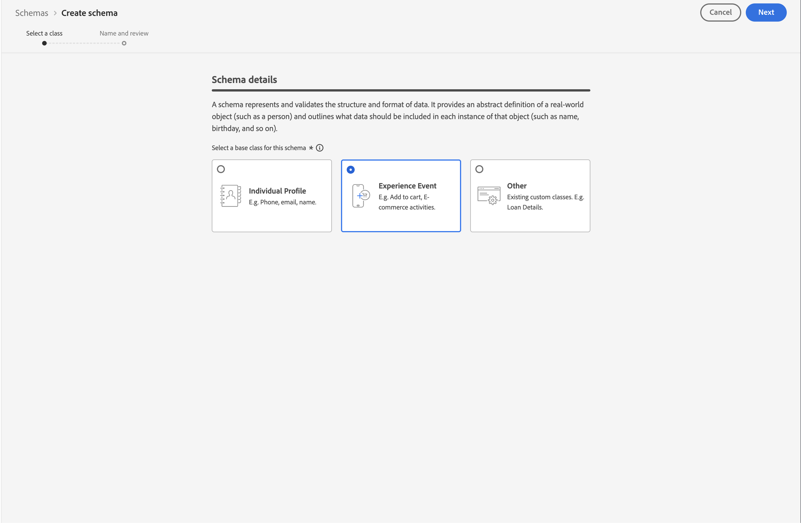

      >[!INFO]
      >
      >    Per modellare il _comportamento_ di un profilo (come nome di scena, premere il pulsante per aggiungere al carrello) viene utilizzato uno schema evento esperienza. Per modellare gli _attributi_ del profilo (come nome, e-mail, genere) viene utilizzato uno schema Individual Profile.

   1. Seleziona **[!UICONTROL Avanti]**.


1. Nel [!UICONTROL passaggio Nome e revisione] della procedura guidata [!UICONTROL Crea schema]:

   1. Immetti un **[!UICONTROL nome visualizzato dello schema]** per lo schema e (facoltativo) una **[!UICONTROL Descrizione]**.

      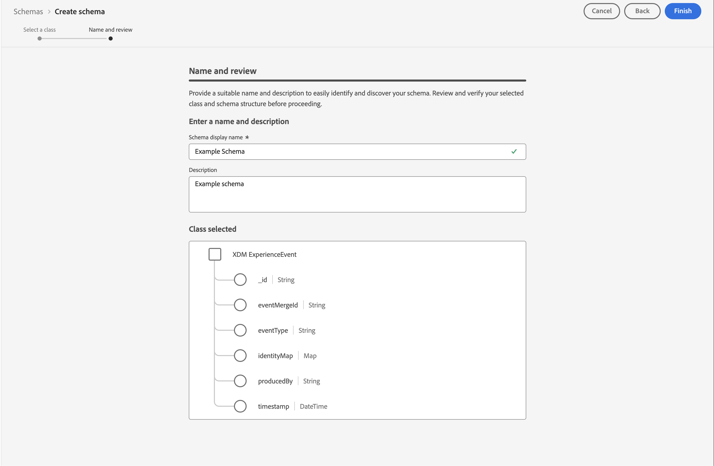

   1. Seleziona **[!UICONTROL Fine]**.

1. Nella scheda Struttura dello schema di esempio:

   1. Selezionare **[!UICONTROL + Aggiungi]** in [!UICONTROL Gruppi di campi].

      

      I gruppi di campi sono raccolte riutilizzabili di oggetti e attributi che consentono di estendere facilmente lo schema.

   1. Nella finestra di dialogo [!UICONTROL Aggiungi gruppi di campi], seleziona il gruppo di campi **[!UICONTROL AEP Web SDK ExperienceEvent]** dall&#39;elenco.

      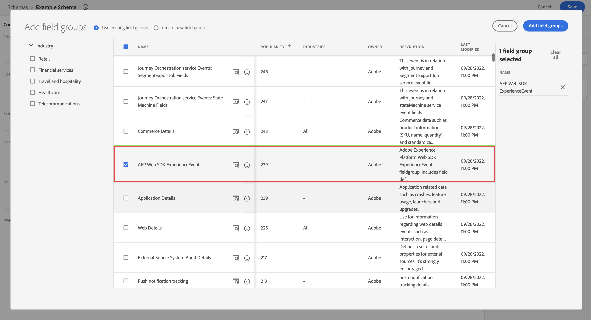

      Puoi selezionare il pulsante di anteprima per visualizzare un’anteprima dei campi che fanno parte del gruppo di campi, ad esempio `web > webPageDetails > name`.

      

      Seleziona **[!UICONTROL Indietro]** per chiudere l&#39;anteprima.

   1. Seleziona **[!UICONTROL Aggiungi gruppi di campi]**.

1. Seleziona **[!UICONTROL +]** accanto al nome dello schema nel pannello [!UICONTROL Struttura].

   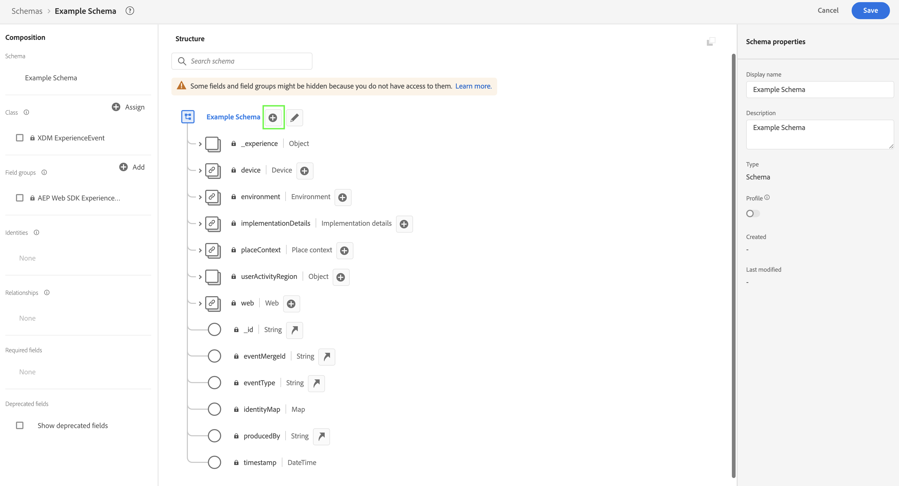

1. Nel pannello [!UICONTROL Proprietà campo], immetti `Identification` come nome, **[!UICONTROL Identificazione]** come [!UICONTROL Nome visualizzato], seleziona **[!UICONTROL Oggetto]** come [!UICONTROL Tipo] e seleziona **[!UICONTROL Core ExperienceEvent v2.1]** come [!UICONTROL Gruppo campi].

   >[!NOTE]
   >
   >Se tale gruppo di campi non è disponibile, cercane un altro contenente campi di identità. Oppure [crea un nuovo gruppo di campi](https://experienceleague.adobe.com/docs/experience-platform/xdm/ui/resources/field-groups.html?lang=it) e [aggiungi nuovi campi di identità](https://experienceleague.adobe.com/docs/experience-platform/xdm/ui/fields/identity.html?lang=it#define-a-identity-field) (come `ecid`, `crmId` e altri di cui hai bisogno) al gruppo di campi e seleziona il nuovo gruppo di campi.

   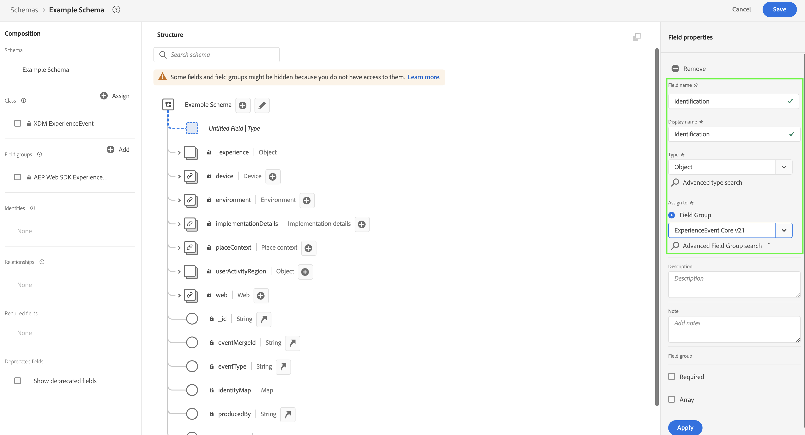

   L’oggetto di identificazione aggiunge funzionalità di individuazione dello schema. Nel tuo caso, immagina di voler identificare i profili che visitano il tuo sito utilizzando l’ID Experience Cloud e l’indirizzo e-mail. Sono disponibili molti altri attributi per monitorare l’identificazione del visitatore (ad esempio, ID cliente, ID di fidelizzazione).

   Seleziona **[!UICONTROL Applica]** per aggiungere questo oggetto allo schema.

1. Seleziona il campo **[!UICONTROL ecid]** nell&#39;oggetto di identificazione appena aggiunto, quindi seleziona **[!UICONTROL Identità]** e **[!UICONTROL Identità primaria]** e **[!UICONTROL ECID]** dall&#39;elenco [!UICONTROL Spazio dei nomi identità] nel pannello di destra.

   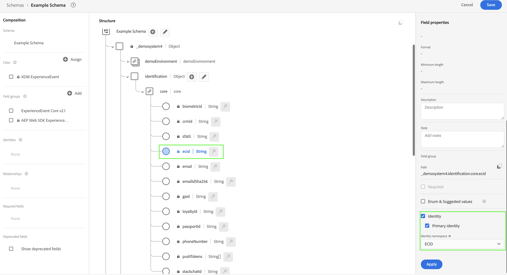

   Stai specificando l’Experience Cloud Identity come identità principale che il servizio Adobe Experience Platform Identity può utilizzare per combinare (unire) il comportamento dei profili con lo stesso ECID.

   Seleziona **[!UICONTROL Applica]**. Nell’attributo ecid viene visualizzata l’icona di un’impronta digitale.

1. Seleziona il campo **[!UICONTROL email]** nell&#39;oggetto di identificazione appena aggiunto, quindi seleziona **[!UICONTROL Identity]** e **[!UICONTROL Email]** dall&#39;elenco [!UICONTROL Identity namespace] nel pannello [!UICONTROL Field Properties].

   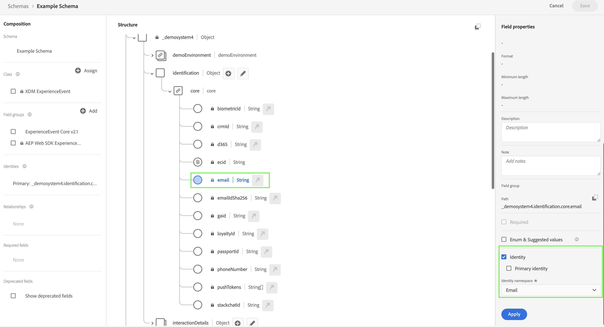

   Stai specificando l’indirizzo e-mail come un’altra identità che il servizio Adobe Experience Platform Identity può utilizzare per combinare (unire) il comportamento dei profili.

   Seleziona **[!UICONTROL Applica]**. Nell’attributo e-mail viene visualizzata l’icona di un’impronta digitale.

   Seleziona **[!UICONTROL Salva]**.

1. Seleziona l&#39;elemento principale dello schema con il nome dello schema, quindi seleziona l&#39;opzione **[!UICONTROL Profilo]**.

   Viene richiesto di abilitare lo schema per il profilo. Una volta abilitato, quando i dati vengono inseriti in set di dati basati su questo schema, tali dati vengono uniti su Real-Time Customer Profile.

   Per ulteriori informazioni, consulta la sezione [Abilitare lo schema per l’utilizzo in Real-Time Customer Profile](https://experienceleague.adobe.com/docs/experience-platform/xdm/tutorials/create-schema-ui.html?lang=it#profile).

   >[!IMPORTANT]
   >
   >    Una volta salvato uno schema abilitato per il profilo, non è più possibile disattivarlo per il profilo.

   

1. Seleziona **[!UICONTROL Salva]** per salvare lo schema.

Hai creato uno schema minimo che modella i dati che puoi acquisire dal tuo sito Web. Lo schema consente di identificare i profili utilizzando Experience Cloud Identity e l’indirizzo e-mail. Abilitando lo schema per il profilo, garantisci che i dati acquisiti dal tuo sito web vengano aggiunti a Real-Time Customer Profile.

Accanto ai dati sul comportamento, puoi anche acquisire i dati degli attributi del profilo dal sito (ad esempio i dettagli dei profili che si abbonano a una newsletter).

Per acquisire questi dati del profilo:

- Crea uno schema basato sulla classe di profilo individuale XDM.

- Aggiungi il gruppo di campi Profile Core v2 allo schema.

- Aggiungi un oggetto di identificazione basato sul gruppo di campi Profile Core v2.

- Definisci l’ID Experience Cloud come identificatore principale e l’e-mail come identificatore.

- Abilitare lo schema per il profilo

Per ulteriori informazioni sull’aggiunta e la rimozione di gruppi di campi e singoli campi a uno schema, consulta la sezione [Creare e modificare schemi nell’interfaccia utente](https://experienceleague.adobe.com/docs/experience-platform/xdm/ui/resources/schemas.html?lang=it).

### Configurare un set di dati

Con lo schema, hai definito il modello dati. Ora devi definire il costrutto per memorizzare e gestire tali dati, che viene eseguito tramite set di dati.

Per configurare il set di dati:

1. Nell&#39;interfaccia utente di Adobe Experience Platform, nella barra a sinistra, seleziona **[!UICONTROL Set di dati]** in [!UICONTROL GESTIONE DATI].

2. Seleziona **[!UICONTROL Crea set di dati]**.

   

3. Seleziona **[!UICONTROL Crea set di dati dallo schema]**.

   

4. Seleziona lo schema creato in precedenza e seleziona **[!UICONTROL Successivo]**.

5. Assegna un nome al set di dati e (facoltativamente) fornisci una descrizione.

   

6. Seleziona **[!UICONTROL Fine]**.

7. Selezionare l&#39;opzione **[!UICONTROL Profilo]**.

   Viene richiesto di abilitare il set di dati per il profilo. Una volta abilitato, il set di dati arricchisce i profili dei clienti in tempo reale con i relativi dati inseriti.

   >[!IMPORTANT]
   >
   >    Puoi abilitare un set di dati per il profilo solo quando lo schema a cui aderisce il set di dati è abilitato anche per il profilo.

   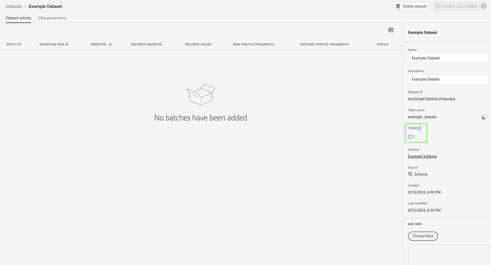

Per ulteriori informazioni su come visualizzare, visualizzare in anteprima, creare, eliminare un set di dati, consulta la sezione [Guida all’interfaccia utente dei set di dati](https://experienceleague.adobe.com/docs/experience-platform/catalog/datasets/user-guide.html?lang=it). E come abilitare un set di dati per Real-Time Customer Profile.

## Configurare un flusso di dati

Un flusso di dati rappresenta la configurazione lato server quando si implementano gli SDK per Web e dispositivi mobili di Adobe Experience Platform. Durante la raccolta di dati con gli SDK di Adobe Experience Platform, i dati vengono inviati alla rete Edge di Adobe Experience Platform. È il flusso di dati che determina a quali servizi vengono inoltrati i dati.

Nella configurazione, desideri che i dati raccolti dal sito Web vengano inviati al set di dati in Adobe Experience Platform.

Per impostare il flusso di dati:

1. Nell&#39;interfaccia utente di Adobe Experience Platform, seleziona **[!UICONTROL Datastreams]** da [!UICONTROL DATA COLLECTION] nella barra a sinistra.

2. Seleziona **[!UICONTROL Nuovo flusso di dati]**.

3. Assegna un nome e una descrizione al tuo flusso di dati. Seleziona lo schema dall&#39;elenco [!UICONTROL Schema evento].

   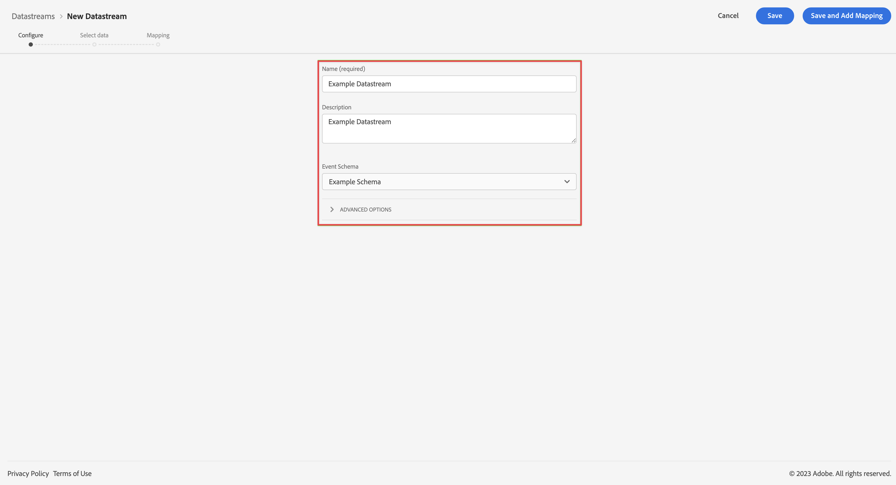

4. Seleziona **[!UICONTROL Salva]**.

5. Selezionare **[!UICONTROL Aggiungi servizio]**.

6. Nella schermata [!UICONTROL Aggiungi servizio]:

   1. Selezionare **[!UICONTROL Adobe Experience Platform]** dall&#39;elenco [!UICONTROL Service].

   2. Assicurarsi che **[!UICONTROL Enabled]** sia selezionato.

   3. Seleziona il set di dati dall&#39;elenco [!UICONTROL Set di dati evento].

      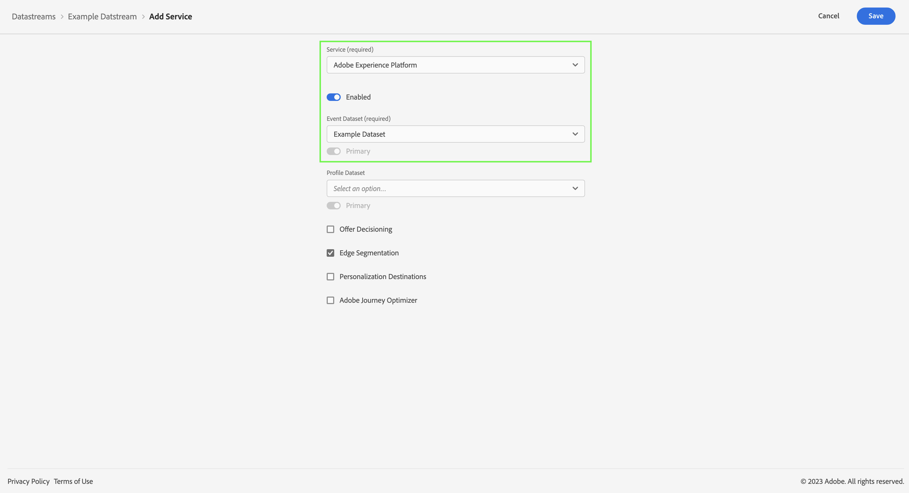

   4. Lascia le altre impostazioni e seleziona **[!UICONTROL Salva]** per salvare lo stream di dati.

Il flusso di dati è ora configurato per inoltrare i dati raccolti dal sito Web al set di dati in Adobe Experience Platform.

Per ulteriori informazioni su come configurare un flusso di dati e come gestire i dati sensibili consulta la sezione [Panoramica dei flussi di dati](https://experienceleague.adobe.com/docs/experience-platform/datastreams/overview.html?lang=it).


## Usare i tag

Per implementare il codice sul sito per raccogliere effettivamente i dati, utilizza la funzione Tag in Adobe Experience Platform. Questa soluzione per la gestione dei tag consente di implementare il codice e altri requisiti di assegnazione dei tag. I tag offrono un’integrazione diretta con Adobe Experience Platform tramite l’estensione dell’SDK per Web di Adobe Experience Platform.

### Creare il tag

1. Nell&#39;interfaccia utente di Adobe Experience Platform, nella barra a sinistra, seleziona **[!UICONTROL Tag]** in [!UICONTROL RACCOLTA DATI].

2. Seleziona **[!UICONTROL Nuova proprietà]**.

   Assegna un nome al tag, seleziona **[!UICONTROL Web]** e immetti un nome di dominio. Seleziona **[!UICONTROL Salva]** per continuare.

   

### Configurare il tag

Dopo aver creato il tag, devi configurarlo con le estensioni corrette e configurare elementi dati e regole in base a come desideri tenere traccia del sito e inviare dati a Adobe Experience Platform.

Seleziona il tag appena creato dall&#39;elenco di [!UICONTROL Proprietà tag] per aprirlo.


#### **Estensioni**

Per garantire che sia possibile inviare dati a Adobe Experience Platform (tramite lo stream di dati), aggiungi l’estensione Adobe Platform Web SDK al tag.

Per creare e configurare l’estensione Adobe Experience Platform Web SDK:

1. Seleziona **[!UICONTROL Estensioni]** nella barra a sinistra.

2. Seleziona **[!UICONTROL Catalogo]** nella barra superiore.

3. Cerca o scorri fino all&#39;estensione Adobe Experience Platform Web SDK e seleziona **[!UICONTROL Installa]** per installarla.

   

4. Seleziona la sandbox e lo stream di dati creato in precedenza per il tuo [!UICONTROL ambiente di produzione] e (facoltativo) [!UICONTROL ambiente di staging] e [!UICONTROL ambiente di sviluppo].

   

   Seleziona **[!UICONTROL Salva]**.

Per ulteriori informazioni, consulta la sezione [Configurare l’estensione Adobe Experience Platform Web SDK](https://experienceleague.adobe.com/docs/experience-platform/tags/extensions/client/web-sdk/web-sdk-extension-configuration.html).

Il Web SDK include il [!UICONTROL servizio Adobe Experience Cloud ID] in modo nativo, pertanto non è necessario aggiungere l&#39;estensione del servizio ID al tag.

#### **Elementi dati**

Gli elementi dati sono i blocchi costitutivi per il dizionario dati (o mappa dati). Utilizza elementi dati per raccogliere, organizzare e distribuire dati in tutta la tecnologia marketing e pubblicitaria. Puoi impostare elementi dati nel tag che leggono dal livello dati e possono essere utilizzati per inviare dati ad Adobe Experience Platform.

Esistono diversi tipi di elementi dati. Devi innanzitutto impostare un elemento dati per acquisire il nome della pagina che le persone visualizzano sul tuo sito.

Per definire un elemento dati nome pagina:

1. Seleziona **[!UICONTROL Elementi dati]** nella barra a sinistra.

2. Selezionare **[!UICONTROL Aggiungi elemento dati]**.

3. Nella finestra di dialogo [!UICONTROL Crea elemento dati]:

   - Assegna un nome all’elemento dati, ad esempio `Page Name` (Nome pagina).

   - Seleziona **[!UICONTROL Core]** dall&#39;elenco [!UICONTROL Estensione].

   - Selezionare **[!UICONTROL Informazioni pagina]** dall&#39;elenco [!UICONTROL Tipo elemento dati].

   - Selezionare **[!UICONTROL Titolo]** dall&#39;elenco [!UICONTROL Attributo].

     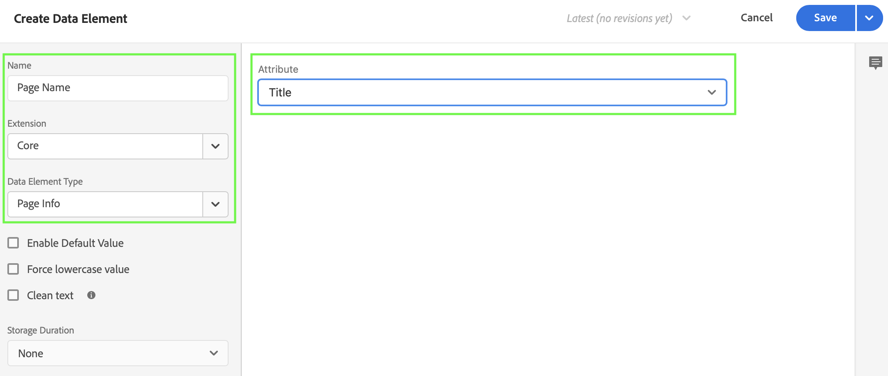

     In alternativa, è possibile utilizzare il valore di una variabile del livello dati, ad esempio `pageName` e il tipo di elemento dati [!UICONTROL Variabile JavaScript] per definire l&#39;elemento dati.

     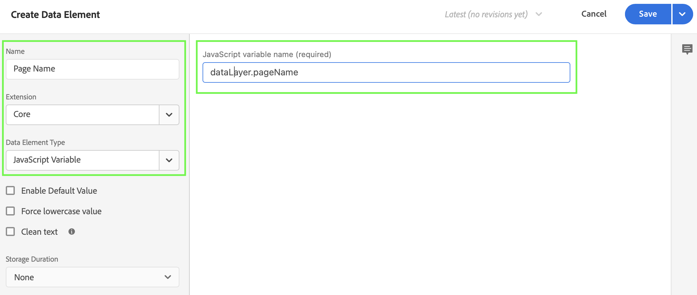

   - Seleziona **[!UICONTROL Salva]**.

Ora immagina di voler impostare un elemento dati che faccia riferimento all’ID Experience Cloud fornito automaticamente dall’SDK per Web Adobe Experience Platform e disponibile tramite l’estensione Experience Cloud ID Service.

Per definire un elemento dati ECID:

1. Seleziona **[!UICONTROL Elementi dati]** nella barra a sinistra.

2. Selezionare **[!UICONTROL Aggiungi elemento dati]**.

3. Nella finestra di dialogo [!UICONTROL Crea elemento dati]:

   - Assegna un nome all’elemento dati, ad esempio `ECID` (Nome pagina).

   - Seleziona **[!UICONTROL Servizio Experience Cloud ID]** dall&#39;elenco [!UICONTROL Estensione].

   - Selezionare **[!UICONTROL ECID]** dall&#39;elenco [!UICONTROL Data Element Type].

     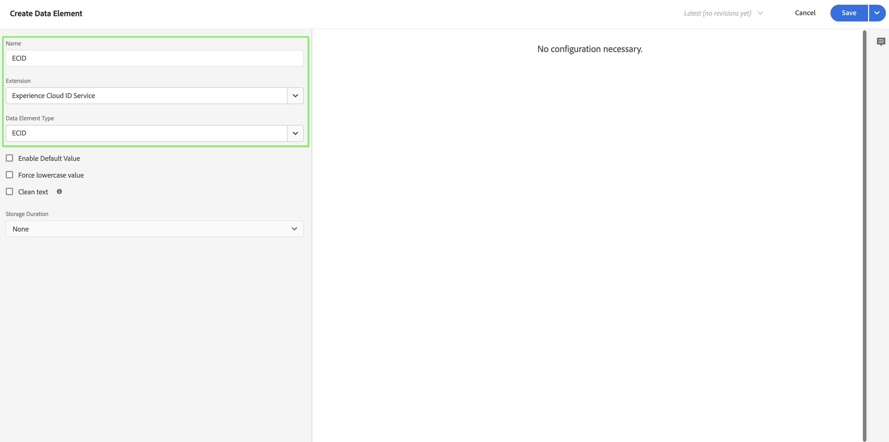

   - Seleziona **[!UICONTROL Salva]**.

Infine, ora immagina di voler mappare uno qualsiasi degli elementi dati specifici allo schema definito in precedenza. Puoi definire un altro elemento dati che fornisce una rappresentazione dello schema XDM.

Per definire un elemento dati oggetto XDM:

1. Seleziona **[!UICONTROL Elementi dati]** nella barra a sinistra.

2. Selezionare **[!UICONTROL Aggiungi elemento dati]**.

3. Nella finestra di dialogo [!UICONTROL Crea elemento dati]:

   - Assegna un nome all’elemento dati, ad esempio `XDM - Page View` (Nome pagina).

   - Selezionare **[!UICONTROL Adobe Experience Platform Web SDK]** dall&#39;elenco [!UICONTROL Estensione].

   - Selezionare **[!UICONTROL Oggetto XDM]** dall&#39;elenco [!UICONTROL Tipo elemento dati].

   - Seleziona la sandbox dall&#39;elenco [!UICONTROL Sandbox].

   - Seleziona lo schema dall&#39;elenco [!UICONTROL Schema].

   - Mappa l’attributo `identification > core > ecid` all’elemento dati ECID, definito nello schema. Seleziona l’icona del cilindro per scegliere facilmente l’elemento dati ECID dall’elenco degli elementi dati.

     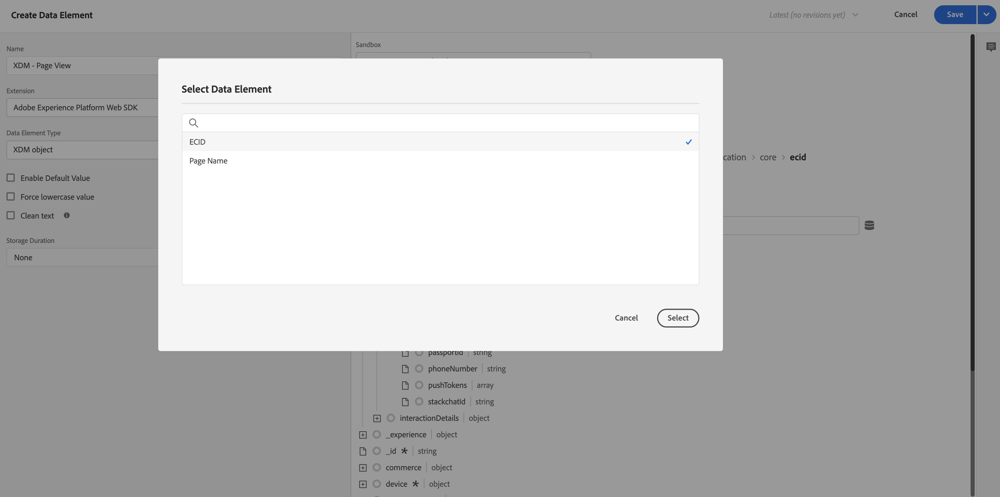

     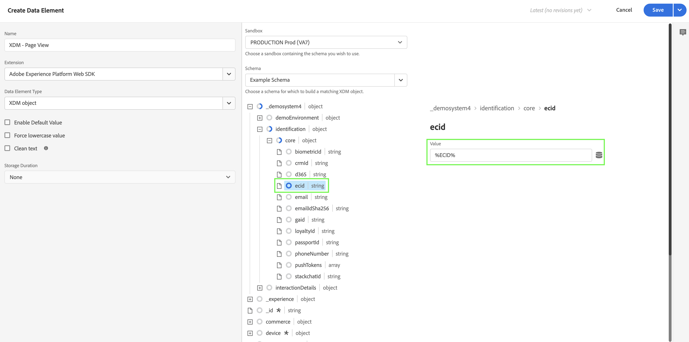


   - Mappa l’attributo `web > webPageDetails > name` all’elemento dati Page Name (Nome pagina), definito nello schema.

     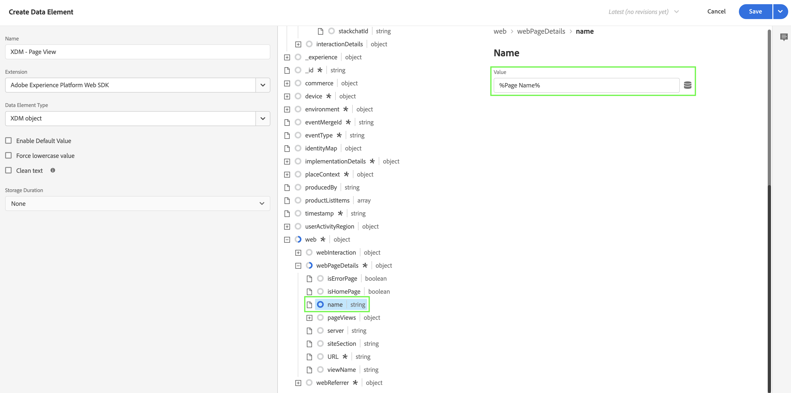

   - Seleziona **[!UICONTROL Salva]**.


#### **Regole**

I tag in Adobe Experience Platform seguono un sistema basato su regole. Cercano le interazione degli utenti e i relativi dati. Quando i criteri descritti nelle tue regole vengono soddisfatti, la regola attiva l’estensione, lo script o il codice lato client identificato. Puoi utilizzare le regole per inviare dati (come un oggetto XDM) in Adobe Experience Platform utilizzando l’estensione Adobe Experience Platform Web SDK.

Per definire una regola:

1. Seleziona **[!UICONTROL Regole]** nella barra a sinistra.

2. Seleziona **[!UICONTROL Crea nuova regola]**.

3. Nella finestra di dialogo [!UICONTROL Crea regola]:

   - Assegna un nome alla regola, ad esempio `Page View`.

   - Seleziona **[!UICONTROL + Aggiungi]** sotto [!UICONTROL Eventi].

   - Nella finestra di dialogo [!UICONTROL Configurazione evento]:

      - Seleziona **[!UICONTROL Core]** dall&#39;elenco [!UICONTROL Estensione].

      - Selezionare **[!UICONTROL Window Loaded]** dall&#39;elenco [!UICONTROL Event Type].

        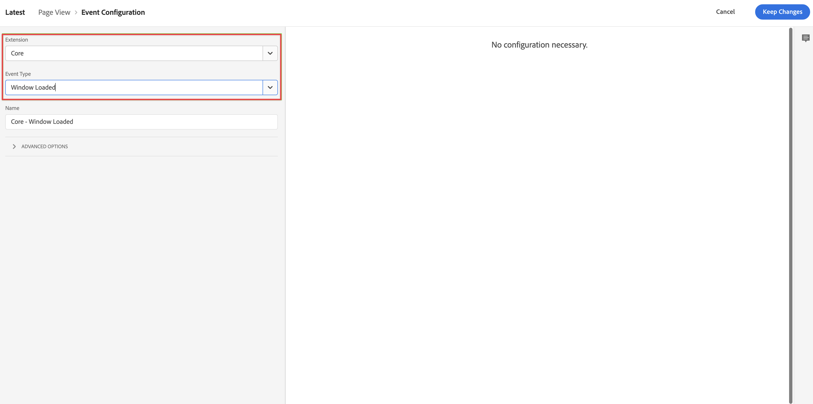

      - Seleziona **[!UICONTROL Mantieni modifiche]**.


   - Seleziona **[!UICONTROL + Aggiungi]** sotto [!UICONTROL Azioni].

   - Nella finestra di dialogo [!UICONTROL Configurazione azione]:

      - Selezionare **[!UICONTROL Adobe Experience Platform Web SDK]** dall&#39;elenco [!UICONTROL Estensione].

      - Selezionare **[!UICONTROL Invia evento]** dall&#39;elenco [!UICONTROL Tipo azione].

      - Selezionare **[!UICONTROL web.webpagedetails.pageViews]** dall&#39;elenco [!UICONTROL Type].

      - Seleziona l&#39;icona del cilindro accanto a [!UICONTROL dati XDM] e seleziona **[!UICONTROL XDM - Visualizzazione pagina]** dall&#39;elenco degli elementi dati.

     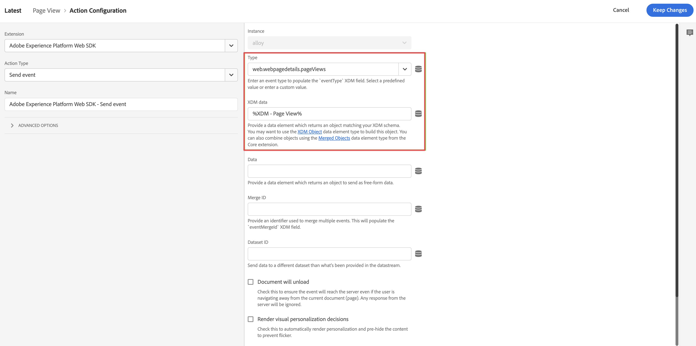

      - Seleziona **[!UICONTROL Mantieni modifiche]**.

   - L’aspetto della regola dovrebbe essere il seguente:

     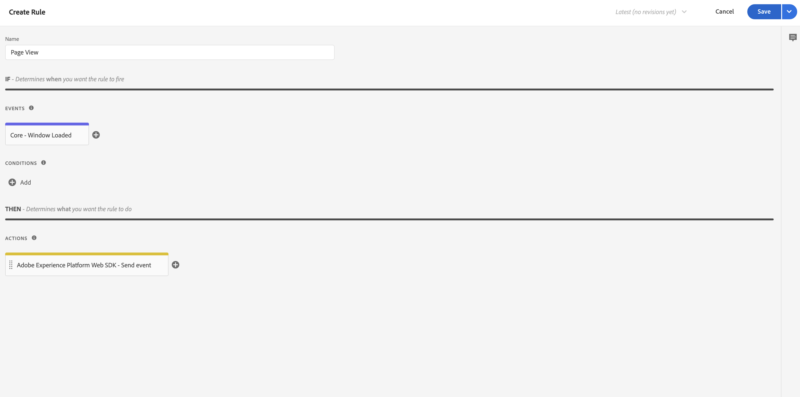

   - Seleziona **[!UICONTROL Salva]**.

Quanto sopra è solo un esempio di definizione di una regola che invia a Adobe Experience Platform dati XDM, contenenti valori da altri elementi di dati.

Puoi utilizzare le regole in vari modi nel tag per manipolare le variabili (utilizzando gli elementi dati).

Per ulteriori informazioni, consulta la sezione [Regole](https://experienceleague.adobe.com/docs/experience-platform/tags/ui/rules.html?lang=it) per ulteriori informazioni.

### Creare e pubblicare il tag

Dopo aver definito elementi dati e regole, devi generare e pubblicare il tag. Quando crei una build della libreria, devi assegnarla a un ambiente. Le estensioni, le regole e gli elementi dati della build vengono quindi compilati e inseriti nell’ambiente assegnato. Ogni ambiente fornisce un codice da incorporare univoco che consente di integrare la build assegnata nel sito.

Per generare e pubblicare il tag:

1. Seleziona **[!UICONTROL Flusso di pubblicazione]** dalla barra a sinistra.

2. Seleziona **[!UICONTROL Seleziona una libreria di lavoro]**, seguita da **[!UICONTROL Aggiungi libreria...]**.

3. Nella finestra di dialogo [!UICONTROL Crea libreria]:

   - Assegna un nome alla libreria.

   - Selezionare **[!UICONTROL Sviluppo (sviluppo)]** dall&#39;elenco [!UICONTROL Ambiente].

   - Selezionare **[!UICONTROL + Aggiungi tutte le risorse modificate]**.

     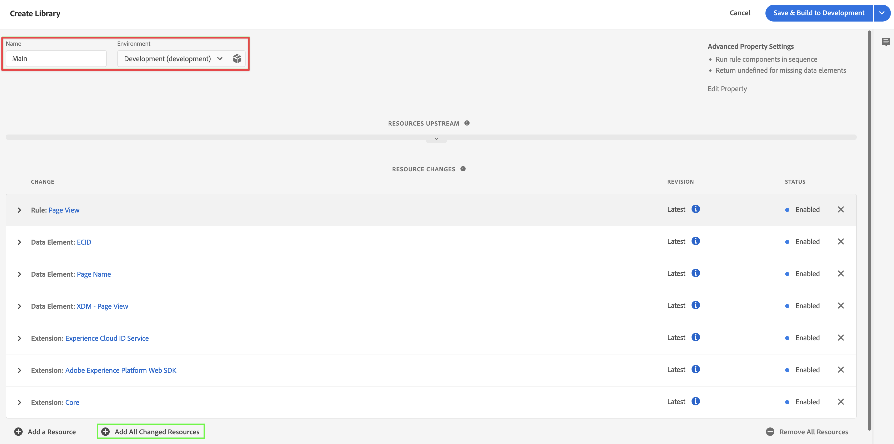

   - Seleziona **[!UICONTROL Salva e genera in sviluppo]**.

   Il tag viene salvato e quindi creato per il tuo ambiente di sviluppo. Un punto verde indica la corretta compilazione del tag nell’ambiente di sviluppo.

4. È possibile selezionare **[!UICONTROL ...]** per ricompilare la libreria o spostarla in un ambiente di staging o produzione.

   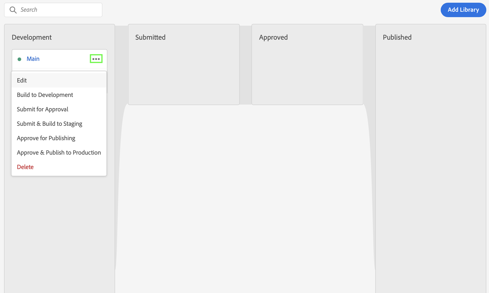

I tag Adobe Experience Platform supportano flussi di lavoro di pubblicazione semplici o complessi che devono adattarsi alla distribuzione dell’SDK Web di Adobe Experience Platform.

Per ulteriori informazioni, consulta la sezione [Panoramica di pubblicazione](https://experienceleague.adobe.com/docs/experience-platform/tags/publish/overview.html?lang=it).


### Recuperare il codice del tag

Infine, devi installare il tag sul sito web di cui desideri tenere traccia, il che implica il posizionamento di codice nel tag di intestazione del modello del sito web.

Per ottenere il codice che fa riferimento al tag:

1. Seleziona **[!UICONTROL Ambienti]** nella barra a sinistra.

2. Dall’elenco degli ambienti, seleziona il pulsante di installazione (casella) corretto.

   Nella finestra di dialogo [!UICONTROL Istruzioni di installazione Web], seleziona il pulsante Copia accanto al codice di script che dovrebbe essere simile al seguente:

   ```
   <script src="https://assets.adobedtm.com/2a518741ab24/.../launch-...-development.min.js" async></script>>
   ```

   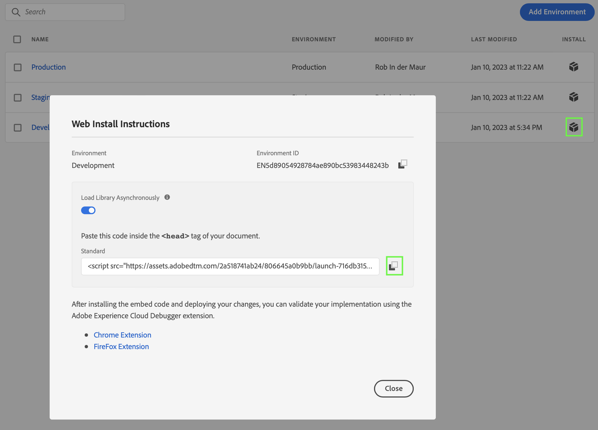

3. Seleziona **[!UICONTROL Chiudi]**.

Invece del codice per l’ambiente di sviluppo, potresti aver selezionato un altro ambiente (gestione temporanea, produzione) in base al punto in cui stai distribuendo l’SDK Web di Adobe Experience Platform.

Per ulteriori informazioni, consulta la sezione [Ambienti](https://experienceleague.adobe.com/docs/experience-platform/tags/publish/environments/environments.html?lang=it).

## Distribuire e convalidare

Ora puoi distribuire il codice nella versione di sviluppo del tuo sito Web all’interno del tag `<head>`. Una volta implementato, il sito Web inizia a raccogliere dati in Adobe Experience Platform.

Convalida l’implementazione, correggila laddove necessario e una volta corretta, implementala nell’ambiente di staging e di produzione utilizzando la funzione di flusso di lavoro di pubblicazione dei tag.

## Configurare una connessione

Per utilizzare i dati di Adobe Experience Platform in Customer Journey Analytics, crea una connessione che include i dati risultanti dalla configurazione dello schema, del set di dati e del flusso di lavoro.

Una connessione consente di integrare set di dati da Adobe Experience Platform in Workspace. Per creare rapporti su questi set di dati, devi prima stabilire una connessione tra i set di dati in Adobe Experience Platform e Workspace.

Per creare la connessione:

1. Nell&#39;interfaccia utente di Customer Journey Analytics, seleziona **[!UICONTROL Connessioni]**, facoltativamente da **[!UICONTROL Gestione dati]**, nel menu principale.

2. Seleziona **[!UICONTROL Crea nuova connessione]**.

3. Nella schermata [!UICONTROL Connessione senza titolo]:

   Denomina e descrivi la connessione in [!UICONTROL Impostazioni connessione].

   Selezionare la sandbox corretta dall&#39;elenco [!UICONTROL Sandbox] in [!UICONTROL Impostazioni dati] e selezionare il numero di eventi giornalieri dall&#39;elenco [!UICONTROL Numero medio di eventi giornalieri].

   

   Seleziona **[!UICONTROL Aggiungi set di dati]**.

   Nel passaggio [!UICONTROL Seleziona set di dati] in [!UICONTROL Aggiungi set di dati]:

   - Seleziona il set di dati creato in precedenza (`Example dataset` (Set di dati di fidelizzazione di esempio)) e qualsiasi altro set di dati da includere nella connessione.

     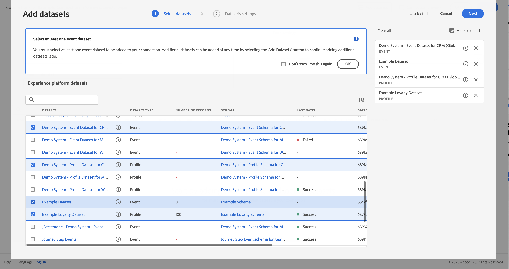

   - Seleziona **[!UICONTROL Avanti]**.

   Nel passaggio [!UICONTROL Impostazioni set di dati] in [!UICONTROL Aggiungi set di dati]:

   - Per ogni set di dati:

      - Seleziona un [!UICONTROL ID persona] dalle identità disponibili definite negli schemi di set di dati in Adobe Experience Platform.

      - Selezionare l&#39;origine dati corretta dall&#39;elenco [!UICONTROL Tipo origine dati]. Se si specifica **[!UICONTROL Altro]**, aggiungere una descrizione per l&#39;origine dati.

      - Imposta **[!UICONTROL Importa tutti i nuovi dati]** e **[!UICONTROL Recupera i dati esistenti del set di dati]** in base alle tue preferenze.

     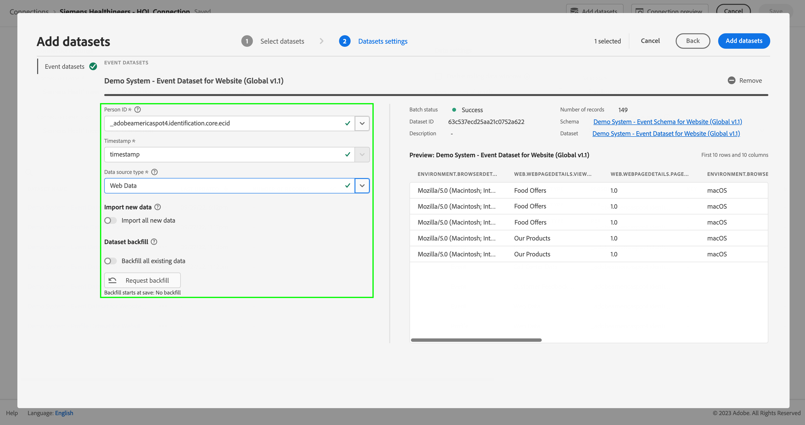

   - Seleziona **[!UICONTROL Aggiungi set di dati]**.

   Seleziona **[!UICONTROL Salva]**.

Per ulteriori informazioni su come creare e gestire una connessione e come selezionare e combinare i set di dati, consulta la sezione [Panoramica delle connessioni](../connections/overview.md).

## Configurare una visualizzazione dati

Una visualizzazione dati è un contenitore specifico di Customer Journey Analytics che consente di determinare come interpretare i dati da una connessione. Specifica tutte le dimensioni e le metriche disponibili in Analysis Workspace, e da quali colonne tali dimensioni e metriche ottengono i loro dati. Le visualizzazioni dati sono definite in preparazione alle attività di reporting in Analysis Workspace.

Per creare la visualizzazione dati:

1. Nell&#39;interfaccia utente di Customer Journey Analytics, seleziona **[!UICONTROL Visualizzazioni dati]**, facoltativamente da **[!UICONTROL Gestione dati]**, nel menu principale.

2. Selezionare **[!UICONTROL Crea nuova visualizzazione dati]**.

3. Nel passaggio [!UICONTROL Configura]:

   Selezionare la connessione dall&#39;elenco [!UICONTROL Connessione].

   Assegna un nome e (facoltativamente) una descrizione alla connessione.

   

   Seleziona **[!UICONTROL Salva e continua]**.

4. Nel passaggio [!UICONTROL Componenti]:

   Aggiungi qualsiasi campo schema e/o componente standard da includere nelle caselle dei componenti [!UICONTROL METRICS] o [!UICONTROL DIMENSIONS].

   

   Seleziona **[!UICONTROL Salva e continua]**.

5. Nel passaggio [!UICONTROL Impostazioni]:

   

   Lasciare le impostazioni immutate e selezionare **[!UICONTROL Salva e termina]**.

Consulta [Panoramica delle visualizzazioni dati](../data-views/data-views.md) per ulteriori informazioni su come creare e modificare una visualizzazione dati, quali componenti sono disponibili per l&#39;utilizzo nella visualizzazione dati e come utilizzare le impostazioni di segmenti e sessioni.


## Configurare un progetto

Analysis Workspace è uno strumento basato su browser flessibile che consente di creare rapidamente le analisi e condividere i dati rilevati sulla base dei tuoi dati. Usa i progetti Workspace per combinare componenti dati, tabelle e visualizzazioni per sviluppare analisi da condividere con altri nella tua organizzazione.

Per creare il progetto:

1. Nell&#39;interfaccia utente di Customer Journey Analytics, seleziona **[!UICONTROL Progetti]** nel menu principale.

2. Seleziona **[!UICONTROL Progetti]** nel menu di navigazione a sinistra.

3. Seleziona **[!UICONTROL Crea progetto]**.

   

   Seleziona **[!UICONTROL Progetto vuoto]**.

   

4. Seleziona la visualizzazione dati dall’elenco.

   .

5. Per creare il primo rapporto, inizia a trascinare dimensioni e metriche sulla [!UICONTROL tabella a forma libera] nel [!UICONTROL pannello]. Ad esempio, trascina `Program Points Balance` e `Page View` come metriche e `email` come dimensione per ottenere una panoramica rapida dei profili che hanno visitato il tuo sito Web e che fanno parte del programma di fidelizzazione per la raccolta di punti di fidelizzazione.

   

Per ulteriori informazioni su come creare progetti e generare analisi utilizzando componenti, visualizzazioni e pannelli, consulta la sezione [Panoramica di Analysis Workspace](../analysis-workspace/home.md).

>[!SUCCESS]
>
>Hai completato tutti i passaggi. A partire dalla definizione dei dati da raccogliere (schema) e della posizione in cui memorizzarli (set di dati) in Adobe Experience Platform. Hai quindi configurato un flusso di dati in Edge Network per garantire che i dati possano essere inoltrati a tale set di dati. Quindi hai definito e implementato il tag contenente le estensioni (Adobe Experience Platform Web SDK, Experience Cloud ID Service), gli elementi dati e le regole per acquisire i dati dal tuo sito Web e inviarli al tuo flusso di dati. Hai definito una connessione in Customer Journey Analytics per utilizzare i dati di tracciamento del tuo sito Web e altri dati. La definizione della visualizzazione dati ti consente di specificare la dimensione e le metriche da utilizzare e infine hai creato il tuo primo progetto per la visualizzazione e l’analisi dei dati.
