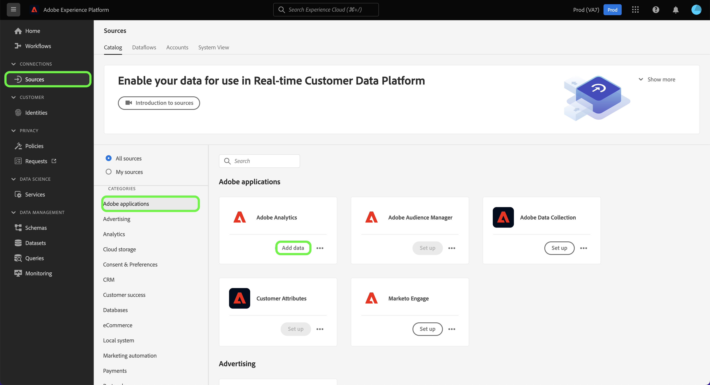

# Inserire e usare i dati dalla versione tradizionale di Adobe Analytics

Questa guida introduttiva spiega come utilizzare in Customer Journey Analytics i dati raccolti da Adobe Analytics.

>[!PREREQUISITES]
>
>Adobe Analytics è concesso in licenza e implementato su uno o più siti Web, utilizzando uno dei metodi di implementazione documentati:
>
>- [Implementare Analytics tramite Experience Platform Edge](https://experienceleague.adobe.com/docs/analytics/implementation/aep-edge/overview.html?lang=it)
>
>- [Implementare Analytics tramite l’estensione Adobe Analytics](https://experienceleague.adobe.com/docs/analytics/implementation/launch/overview.html?lang=it)
>
>- [Implementare Analytics tramite JavaScript](https://experienceleague.adobe.com/docs/analytics/implementation/js/overview.html?lang=it)

A questo scopo, è necessario:

- **Configurare un connettore di origine di Adobe Analytics** in Adobe Experience Platform. In questo modo puoi inserire i dati Adobe Analytics correnti in un set di dati in Adobe Experience Platform.

- **Impostare una connessione** in Customer Journey Analytics. Questa connessione deve includere almeno il set di dati di Adobe Experience Platform.

- **Configurare una visualizzazione dati** in Customer Journey Analytics per definire le metriche e le dimensioni da utilizzare in Analysis Workspace.

- **Configurare un progetto** in Customer Journey Analytics per generare rapporti e visualizzazioni.

>[!NOTE]
>
>Questa è una guida semplificata su come inserire i dati, utilizzando il connettore di origine di Adobe Analytics, e utilizzarli in Customer Journey Analytics. Ti consigliamo vivamente di esaminare le informazioni aggiuntive quando vi fai riferimento.

## Configurare un connettore di origine di Adobe Analytics

Il connettore di origine di Adobe Analytics consente di inserire i dati della suite di rapporti di Adobe Analytics in Adobe Experience Platform.

Per creare un connettore di origine di Adobe Analytics:

1. Nell’interfaccia utente di Platform, seleziona **[!UICONTROL Sources]** (Origini), dalla barra a sinistra.

2. Seleziona **[!UICONTROL Adobe applications]** (Applicazioni Adobe) dall’elenco [!UICONTROL CATEGORIES] (CATEGORIE).

3. Seleziona **[!UICONTROL Set up]** (Configura) o **[!UICONTROL Add data]** (Aggiungi dati) nel riquadro Adobe Analytics.

   

4. Seleziona **[!UICONTROL Report suite]** (Suite di rapporti). Dall’elenco delle suite di rapporti, seleziona quella da utilizzare.

   

   Seleziona **[!UICONTROL Next]** (Avanti).

5. Seleziona **[!UICONTROL Default schema]** (Schema predefinito) come [!UICONTROL Target schema] (Schema di destinazione). Adobe Experience Platform crea automaticamente lo schema e il set di dati corrispondenti per mappare tutti i campi standard dalla suite di rapporti Adobe Analytics selezionata.

   

   Seleziona **[!UICONTROL Next]** (Avanti).

6. Assegna un nome al flusso di dati e (facoltativamente) fornisci una descrizione.

   

   Seleziona **[!UICONTROL Next]** (Avanti).

7. Controlla la connessione e seleziona **[!UICONTROL Finish]** (Fine).

   

Una volta creata la connessione, il flusso di dati viene creato automaticamente per popolare un set di dati con i dati di Adobe Analytics dalla suite di rapporti, compreso l’inserimento di dati storici di fino a 13 mesi.

Al termine dell’inserimento iniziale, i dati della suite di rapporti Adobe Analytics sono pronti per essere utilizzati da Customer Journey Analytics.

Consulta la sezione [Creare una connessione sorgente di Adobe Analytics nell’interfaccia utente](https://experienceleague.adobe.com/docs/experience-platform/sources/ui-tutorials/create/adobe-applications/analytics.html?lang=it) per un tutorial molto più completo.

## Configurare una connessione

Per utilizzare i dati di Adobe Experience Platform in Customer Journey Analytics, crea una connessione che include i dati risultanti dalla configurazione dello schema, del set di dati e del flusso di lavoro.

Una connessione consente di integrare set di dati da Adobe Experience Platform in Workspace. Per creare rapporti su questi set di dati, devi prima stabilire una connessione tra i set di dati in Adobe Experience Platform e Workspace.

Per creare la connessione:

1. Nell’interfaccia utente di Customer Journey Analytics, seleziona **[!UICONTROL Connections]** (Connessioni) nel pannello di navigazione superiore.

2. Seleziona **[!UICONTROL Create new connection]** (Crea nuova connessione).

3. Nella schermata [!UICONTROL Untitled connection] (Connessione senza titolo):

   Assegna un nome e una descrizione alla connessione in [!UICONTROL Connection Settings] (Impostazioni della connessione).

   Seleziona la sandbox corretta dall’elenco [!UICONTROL Sandbox] in [!UICONTROL Data settings] (Impostazioni dati) e seleziona il numero di eventi giornalieri dall’elenco [!UICONTROL Average number of daily events] (Numero medio di eventi giornalieri).

   

   Seleziona **[!UICONTROL Add datasets]** (Aggiungi set di dati).

   Nel passaggio [!UICONTROL Select datasets] (Seleziona set di dati) in [!UICONTROL Add datasets] (Aggiungi set di dati):

   - Seleziona il set di dati creato automaticamente dal connettore di origine di Adobe Analytics e qualsiasi altro set di dati da includere nella connessione.

      

   - Seleziona **[!UICONTROL Next]** (Avanti).
   Nel passaggio [!UICONTROL Datasets settings] (Impostazioni set di dati) in [!UICONTROL Add datasets] (Aggiungi set di dati):

   - Per ogni set di dati:

      - Seleziona un [!UICONTROL Person ID] (ID persona) tra le identità disponibili definite negli schemi di set di dati in Adobe Experience Platform.

      - Seleziona l’origine dati corretta dall’elenco [!UICONTROL Data source type] (Tipo di origine dati). Se specifichi **[!UICONTROL Other]** (Altro), aggiungi una descrizione per l’origine dati.

      - Imposta **[!UICONTROL Import all new data]** (Importa tutti i nuovi dati) e **[!UICONTROL Dataset backfill existing data]** (Dati esistenti di backfill del set di dati) secondo le tue preferenze.

      

   - Seleziona **[!UICONTROL Add datasets]** (Aggiungi set di dati).
   Seleziona **[!UICONTROL Save]** (Salva).

Per ulteriori informazioni su come creare e gestire una connessione e come selezionare e combinare i set di dati, consulta la sezione [Panoramica delle connessioni](../connections/overview.md).

## Configurare una visualizzazione dati

Una visualizzazione dati è un contenitore specifico di Customer Journey Analytics che consente di determinare come interpretare i dati da una connessione. Specifica tutte le dimensioni e le metriche disponibili in Analysis Workspace, e da quali colonne tali dimensioni e metriche ottengono i loro dati. Le visualizzazioni dati sono definite in preparazione alle attività di reporting in Analysis Workspace.

Per creare la visualizzazione dati:

1. Nell’interfaccia utente di Customer Journey Analytics, seleziona **[!UICONTROL Data views]** (Visualizzazioni dati) nel pannello di navigazione superiore.

2. Seleziona **[!UICONTROL Create new data view]** (Crea nuova visualizzazione dati).

3. Nel passaggio [!UICONTROL Configure] (Configura):

   Seleziona la connessione dall’elenco [!UICONTROL Connection] (Connessioni).

   Assegna un nome e (facoltativamente) una descrizione alla connessione.

   

   Seleziona **[!UICONTROL Save and continue]** (Salva e continua).

4. Nel passaggio [!UICONTROL Components] (Componenti):

   Aggiungi qualsiasi campo dello schema e/o componente standard che desideri includere nelle caselle dei componenti [!UICONTROL METRICS] (METRICHE) o [!UICONTROL DIMENSIONS] (DIMENSIONI).

   

   Seleziona **[!UICONTROL Save and continue]** (Crea set di dati).

5. Nel passaggio [!UICONTROL Settings] (Impostazioni):

   

   Lascia le impostazioni così come sono e seleziona **[!UICONTROL Save and finish]** (Salva e fine).

Per ulteriori informazioni su come creare e modificare una visualizzazione dati, quali componenti sono disponibili per la visualizzazione dati e come utilizzare le impostazioni di filtro e sessioni, consulta la sezione [Panoramica delle visualizzazioni dati](../data-views/data-views.md).

## Configurare un progetto

Analysis Workspace è uno strumento basato su browser flessibile che consente di creare rapidamente le analisi e condividere i dati rilevati sulla base dei tuoi dati. Usa i progetti Workspace per combinare componenti dati, tabelle e visualizzazioni per sviluppare analisi da condividere con altri nella tua organizzazione.

Per creare il progetto:

1. Nell’interfaccia utente di Customer Journey Analytics, seleziona **[!UICONTROL Projects]** (Progetti) nel pannello di navigazione superiore.

2. Seleziona **[!UICONTROL Projects]** (Progetti) nel pannello di navigazione a sinistra.

3. Seleziona **[!UICONTROL Create project]** (Crea progetto).

   

   Seleziona **[!UICONTROL Blank project]** (Progetto vuoto).

   

4. Seleziona la visualizzazione dati dall’elenco.

   .

5. Inizia a trascinare dimensioni e metriche su [!UICONTROL Freeform table] (Tabella a forma libera) in [!UICONTROL Panel] (Pannello) per creare il primo rapporto. Ad esempio, trascina `Program Points Balance` e `Page View` come metriche e `email` come dimensione per ottenere una panoramica rapida dei profili che hanno visitato il tuo sito Web e che fanno parte del programma di fidelizzazione per la raccolta di punti di fidelizzazione.

   

Per ulteriori informazioni su come creare progetti e generare analisi utilizzando componenti, visualizzazioni e pannelli, consulta la sezione [Panoramica di Analysis Workspace](../analysis-workspace/home.md).

>[!SUCCESS]
>
>Hai completato tutti i passaggi. Partendo dalla configurazione del connettore dell’origine dati di Adobe Analytics e del connettore per la suite di rapporti, i dati di Adobe Analytics vengono caricati automaticamente in Adobe Experience Platform. Hai definito una connessione in Customer Journey Analytics per utilizzare i dati Adobe Analytics inseriti e altri dati. La definizione della visualizzazione dati ti consente di specificare la dimensione e le metriche da utilizzare e infine hai creato il tuo primo progetto per la visualizzazione e l’analisi dei dati.

