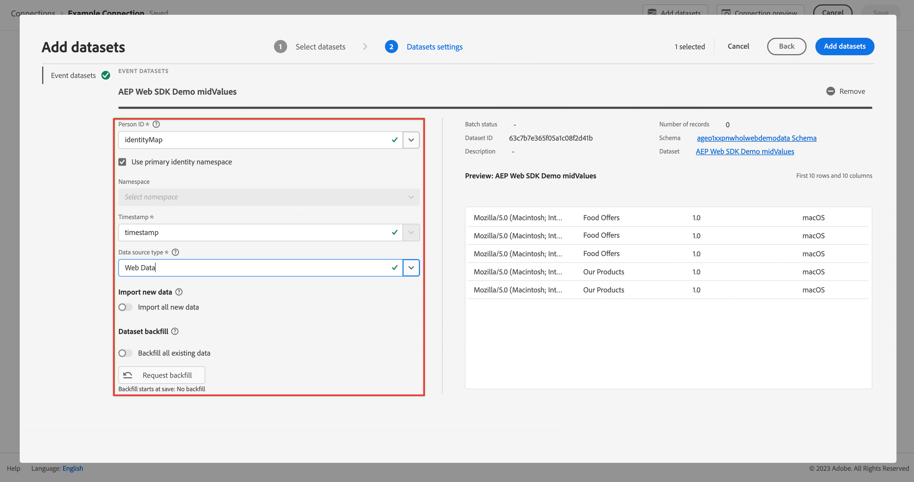

# Acquisire e utilizzare dati da Adobe Analytics

Questa guida introduttiva spiega come utilizzare in Customer Journey Analytics i dati raccolti da Adobe Analytics.

>[!PREREQUISITES]
>
>Adobe Analytics è concesso in licenza e implementato su uno o più siti Web, utilizzando uno dei metodi di implementazione documentati:
>
>- [Implementare Analytics tramite Experience Platform Edge](https://experienceleague.adobe.com/docs/analytics/implementation/aep-edge/overview.html)
>
>- [Implementare Analytics tramite l’estensione Adobe Analytics](https://experienceleague.adobe.com/docs/analytics/implementation/launch/overview.html?lang=it)
>
>- [Implementare Analytics tramite JavaScript](https://experienceleague.adobe.com/docs/analytics/implementation/js/overview.html?lang=it)

A questo scopo, è necessario:

- **Configurare un connettore di origine di Adobe Analytics** in Adobe Experience Platform. Il connettore di origine si occupa di acquisire i dati Adobe Analytics correnti in un set di dati in Adobe Experience Platform.

- **Impostare una connessione** in Customer Journey Analytics. La connessione deve (almeno) includere il set di dati di Adobe Experience Platform.

- **Configurare una visualizzazione dati** in Customer Journey Analytics per definire le metriche e le dimensioni da utilizzare in Analysis Workspace.

- **Configurare un progetto** in Customer Journey Analytics per generare rapporti e visualizzazioni.

>[!NOTE]
>
>Questa guida rapida è una guida semplificata su come acquisire i dati utilizzando il connettore di origine di Adobe Analytics e utilizzarli in Customer Journey Analytics. Ti consigliamo vivamente di esaminare le informazioni aggiuntive quando vi fai riferimento.

## Configurare un connettore di origine di Adobe Analytics

Il connettore di origine di Adobe Analytics consente di inserire i dati della suite di rapporti di Adobe Analytics in Adobe Experience Platform.

Per creare un connettore di origine di Adobe Analytics:

1. Nell&#39;interfaccia utente di Platform, seleziona **[!UICONTROL Origini]**, dalla barra a sinistra.

2. Seleziona **[!UICONTROL applicazioni Adobe]** dall&#39;elenco di [!UICONTROL CATEGORIE].

3. Seleziona **[!UICONTROL Configura]** o **[!UICONTROL Aggiungi dati]** nel riquadro di Adobe Analytics.

   

4. Seleziona **[!UICONTROL Suite di rapporti]**. Dall’elenco delle suite di rapporti, seleziona quella da utilizzare.  In alternativa, è possibile utilizzare  **[!UICONTROL _Cerca_]** per cercare una suite di rapporti.

   

   Seleziona **[!UICONTROL Avanti]**.

5. Seleziona **[!UICONTROL Schema predefinito]** come [!UICONTROL Schema di destinazione]. Adobe Experience Platform crea automaticamente lo schema e il set di dati corrispondenti per mappare tutti i campi standard dalla suite di rapporti Adobe Analytics selezionata.

   

   Seleziona **[!UICONTROL Avanti]**.

6. Assegna un nome al flusso di dati e (facoltativamente) fornisci una descrizione.

   

   Seleziona **[!UICONTROL Avanti]**.

7. Rivedi la connessione e seleziona **[!UICONTROL Fine]**.

   

Una volta creata la connessione, il flusso di dati viene creato automaticamente per popolare un set di dati con i dati di Adobe Analytics dalla suite di rapporti. Il flusso di dati acquisisce fino a 13 mesi di dati storici per le sandbox di produzione. La retrocompilazione nelle sandbox non di produzione è limitata a 3 mesi.

Al termine dell’acquisizione iniziale, i dati della suite di rapporti Adobe Analytics sono pronti per essere utilizzati da Customer Journey Analytics.

Consulta la sezione [Creare una connessione sorgente di Adobe Analytics nell’interfaccia utente](https://experienceleague.adobe.com/docs/experience-platform/sources/ui-tutorials/create/adobe-applications/analytics.html?lang=it) per un tutorial molto più completo.

## Configurare una connessione

Per utilizzare i dati di Adobe Experience Platform in Customer Journey Analytics, crea una connessione che include i dati risultanti dalla configurazione dello schema, del set di dati e del flusso di lavoro.

Una connessione consente di integrare set di dati da Adobe Experience Platform in Workspace. Per creare rapporti su questi set di dati, devi prima stabilire una connessione tra i set di dati in Adobe Experience Platform e Workspace.

Per creare la connessione:

1. Nell&#39;interfaccia utente di Customer Journey Analytics, seleziona **[!UICONTROL Connessioni]**, facoltativamente da **[!UICONTROL Gestione dati]**, nel menu principale.

2. Selezionare **[!UICONTROL Crea nuova connessione]**.

3. Nella schermata [!UICONTROL Connessione senza titolo]:

   Denomina e descrivi la connessione in [!UICONTROL Impostazioni connessione].

   Selezionare la sandbox corretta dall&#39;elenco [!UICONTROL Sandbox] in [!UICONTROL Impostazioni dati] e selezionare il numero di eventi giornalieri dall&#39;elenco [!UICONTROL Numero medio di eventi giornalieri].

   

   Seleziona **[!UICONTROL Aggiungi set di dati]**.

   Nel passaggio [!UICONTROL Seleziona set di dati] in [!UICONTROL Aggiungi set di dati]:

   - Seleziona il set di dati creato automaticamente dal connettore di origine di Adobe Analytics e qualsiasi altro set di dati da includere nella connessione.

     

   - Seleziona **[!UICONTROL Avanti]**.

   Nel passaggio [!UICONTROL Impostazioni set di dati] in [!UICONTROL Aggiungi set di dati]:

   - Per ogni set di dati:

      - Seleziona un [!UICONTROL ID persona] dalle identità disponibili definite negli schemi di set di dati in Adobe Experience Platform.

      - Selezionare l&#39;origine dati corretta dall&#39;elenco [!UICONTROL Tipo origine dati]. Se si specifica **[!UICONTROL Altro]**, aggiungere una descrizione per l&#39;origine dati.

      - Imposta **[!UICONTROL Importa tutti i nuovi dati]** e **[!UICONTROL Recupera i dati esistenti del set di dati]** in base alle tue preferenze.

     

   - Seleziona **[!UICONTROL Aggiungi set di dati]**.

   Seleziona **[!UICONTROL Salva]**.

Per ulteriori informazioni su come creare e gestire una connessione e come selezionare e combinare i set di dati, consulta la sezione [Panoramica delle connessioni](../connections/overview.md).

## Configurare una visualizzazione dati

Una visualizzazione dati è un contenitore specifico di Customer Journey Analytics che consente di determinare come interpretare i dati da una connessione. Specifica tutte le dimensioni e le metriche disponibili in Analysis Workspace, e da quali colonne tali dimensioni e metriche ottengono i loro dati. Le visualizzazioni dati sono definite in preparazione alle attività di reporting in Analysis Workspace.

Per creare la visualizzazione dati:

1. Nell&#39;interfaccia utente di Customer Journey Analytics, seleziona **[!UICONTROL Visualizzazioni dati]**, facoltativamente da **[!UICONTROL Gestione dati]**, nel menu principale.

2. Selezionare **[!UICONTROL Crea nuova visualizzazione dati]**.

3. Nel passaggio [!UICONTROL Configura]:

   Selezionare la connessione dall&#39;elenco [!UICONTROL Connessione].

   Assegna un nome e (facoltativamente) una descrizione alla connessione.

   

   Seleziona **[!UICONTROL Salva e continua]**.

4. Nel passaggio [!UICONTROL Componenti]:

   Aggiungi qualsiasi campo schema e/o componente standard da includere nelle caselle dei componenti [!UICONTROL METRICS] o [!UICONTROL DIMENSIONS].

   

   Seleziona **[!UICONTROL Salva e continua]**.

5. Nel passaggio [!UICONTROL Impostazioni]:

   

   Lasciare le impostazioni immutate e selezionare **[!UICONTROL Salva e termina]**.

Consulta [Panoramica delle visualizzazioni dati](../data-views/data-views.md) per ulteriori informazioni su come creare e modificare una visualizzazione dati, quali componenti sono disponibili per l&#39;utilizzo nella visualizzazione dati e come utilizzare le impostazioni di segmenti e sessioni.

## Configurare un progetto

Analysis Workspace è uno strumento basato su browser flessibile che consente di creare rapidamente le analisi e condividere i dati rilevati sulla base dei tuoi dati. Usa i progetti Workspace per combinare componenti dati, tabelle e visualizzazioni per sviluppare analisi da condividere con altri nella tua organizzazione.

Per creare il progetto:

1. Nell&#39;interfaccia utente di Customer Journey Analytics, seleziona **[!UICONTROL Progetti]** nel menu principale.

2. Seleziona **[!UICONTROL Progetti]** nel menu di navigazione a sinistra.

3. Seleziona **[!UICONTROL Crea progetto]**.

   

   Seleziona **[!UICONTROL Progetto vuoto]**.

   

4. Seleziona la visualizzazione dati dall’elenco.

   .

5. Per creare il primo rapporto, inizia a trascinare dimensioni e metriche sulla [!UICONTROL tabella a forma libera] nel [!UICONTROL pannello]. Ad esempio, trascina `Program Points Balance` e `Page View` come metriche e `email` come dimensione per ottenere una panoramica rapida dei profili che hanno visitato il tuo sito Web e che fanno parte del programma di fidelizzazione per la raccolta di punti di fidelizzazione.

   

Per ulteriori informazioni su come creare progetti e generare analisi utilizzando componenti, visualizzazioni e pannelli, consulta la sezione [Panoramica di Analysis Workspace](../analysis-workspace/home.md).

>[!SUCCESS]
>
>Hai completato tutti i passaggi. Partendo dalla configurazione del connettore dell’origine dati di Adobe Analytics e del connettore per la suite di rapporti, i dati di Adobe Analytics vengono caricati automaticamente in Adobe Experience Platform. Hai definito una connessione in Customer Journey Analytics per utilizzare i dati di Adobe Analytics acquisiti e altri dati. La definizione della visualizzazione dati ti consente di specificare la dimensione e le metriche da utilizzare e infine hai creato il tuo primo progetto per la visualizzazione e l’analisi dei dati.

