# Inserire e utilizzare dati batch

Questa guida introduttiva spiega come inserire dati batch in Adobe Experience Platform e utilizzarli in Customer Journey Analytics.

A questo scopo, è necessario:

- **Configurare uno schema e un set di dati** in Adobe Experience Platform per definire il modello (schema) dei dati da raccogliere e dove raccogliere effettivamente i dati (set di dati).

- **Utilizzare i flussi di lavoro** per caricare facilmente i dati batch nel set di dati configurato in Adobe Experience Platform.

- **Impostare una connessione** in Customer Journey Analytics. Questa connessione deve includere almeno il set di dati di Adobe Experience Platform.

- **Configurare una visualizzazione dati** in Customer Journey Analytics per definire le metriche e le dimensioni da utilizzare in Analysis Workspace.

- **Configurare un progetto** in Customer Journey Analytics per generare rapporti e visualizzazioni.

>[!NOTE]
>
>Questa guida rapida è una guida semplificata su come acquisire dati batch in Adobe Experience Platform e utilizzarli in Customer Journey Analytics. Ti consigliamo vivamente di esaminare le informazioni aggiuntive quando vi fai riferimento.

## Configurare uno schema e un set di dati

Per inserire i dati in Adobe Experience Platform, innanzitutto devi definire quali dati desideri raccogliere. Tutti i dati inseriti in Adobe Experience Platform devono essere conformi a una struttura standard e denormalizzata affinché vengano riconosciuti e utilizzati dalle capacità e funzionalità a valle. Experience Data Model (XDM) è il framework standard che fornisce questa struttura sotto forma di schemi.

Una volta definito uno schema, utilizza uno o più set di dati per memorizzare e gestire la raccolta di dati. Un set di dati è un costrutto di archiviazione e gestione per una raccolta di dati (in genere una tabella) che contiene uno schema (colonne) e dei campi (righe).

Tutti i dati inseriti in Adobe Experience Platform devono essere conformi a uno schema predefinito prima di poter essere memorizzati come set di dati.

### Configurare uno schema

Per questa introduzione, immagina di voler raccogliere alcuni dati relativi alla fidelizzazione, ad esempio ID di fidelizzazione, punti di fidelizzazione e stato di fidelizzazione.
Devi innanzitutto definire uno schema che modella questi dati.

Per configurare lo schema:

1. Nell&#39;interfaccia utente di Adobe Experience Platform, nella barra a sinistra, seleziona **[!UICONTROL Schemi]** in [!UICONTROL GESTIONE DATI].

1. Seleziona **[!UICONTROL Crea schema]**.
.
1. Nel passaggio Selezionare una classe della procedura guidata Crea schema:

   1. Selezionare **[!UICONTROL Profilo individuale]**.

      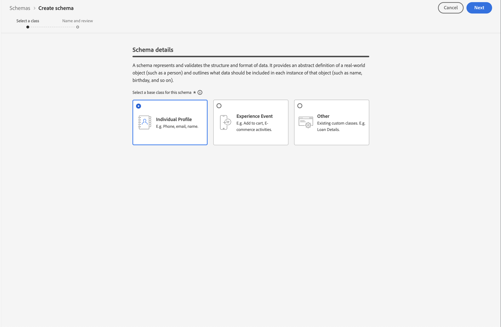

      >[!INFO]
      >
      >    Per modellare il _comportamento_ di un profilo (come nome di scena, premere il pulsante per aggiungere al carrello) viene utilizzato uno schema evento esperienza. Per modellare gli _attributi_ del profilo (come nome, e-mail, genere) viene utilizzato uno schema Individual Profile.

   1. Seleziona **[!UICONTROL Avanti]**.


1. Nel [!UICONTROL passaggio Nome e revisione] della procedura guidata [!UICONTROL Crea schema]:

   1. Immetti un **[!UICONTROL nome visualizzato dello schema]** per lo schema e (facoltativo) una **[!UICONTROL Descrizione]**.

      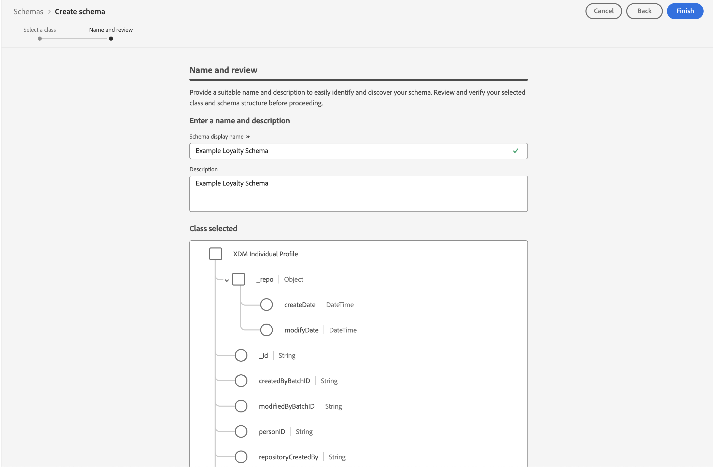

   1. Seleziona **[!UICONTROL Fine]**.

1. Nella scheda Struttura dello schema di esempio:

   1. Selezionare **[!UICONTROL + Aggiungi]** in [!UICONTROL Gruppi di campi].

      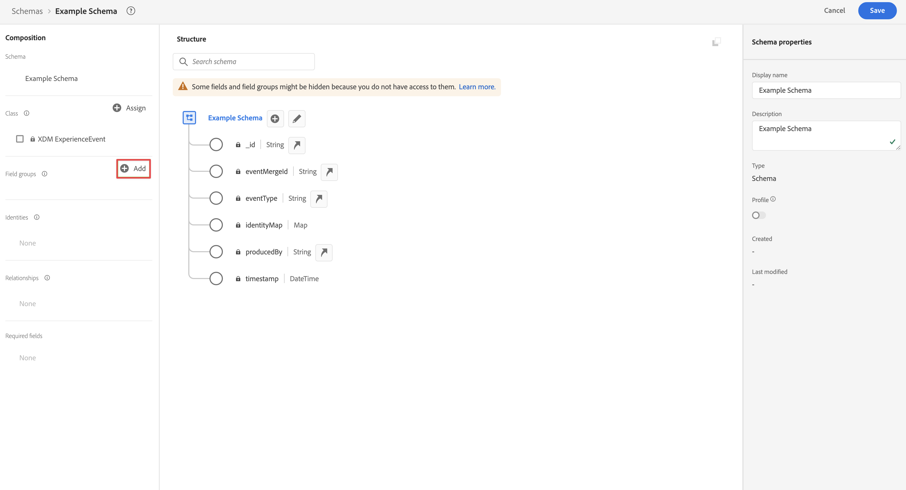

      I gruppi di campi sono raccolte riutilizzabili di oggetti e attributi che consentono di estendere facilmente lo schema.

   1. Nella finestra di dialogo [!UICONTROL Aggiungi gruppi di campi], seleziona il gruppo di campi **[!UICONTROL Dettagli fedeltà]** dall&#39;elenco.

      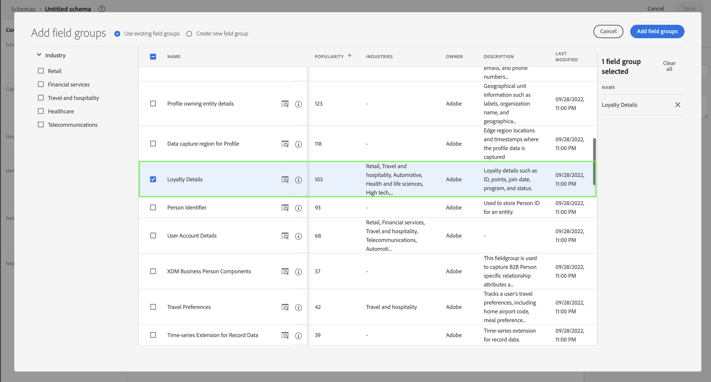

      Puoi selezionare il pulsante di anteprima per visualizzare un’anteprima dei campi che fanno parte del gruppo di campi.

      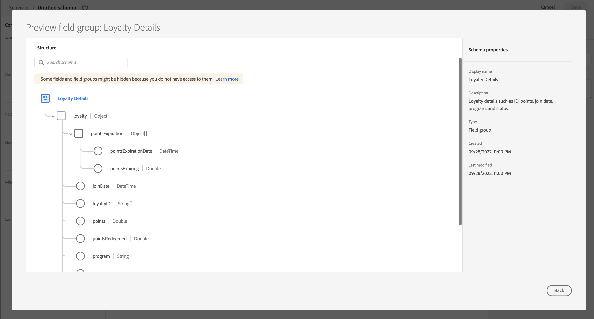

      Seleziona **[!UICONTROL Indietro]** per chiudere l&#39;anteprima.

   1. Seleziona **[!UICONTROL Aggiungi gruppi di campi]**.

1. Seleziona **[!UICONTROL +]** accanto al nome dello schema nel pannello [!UICONTROL Struttura].

   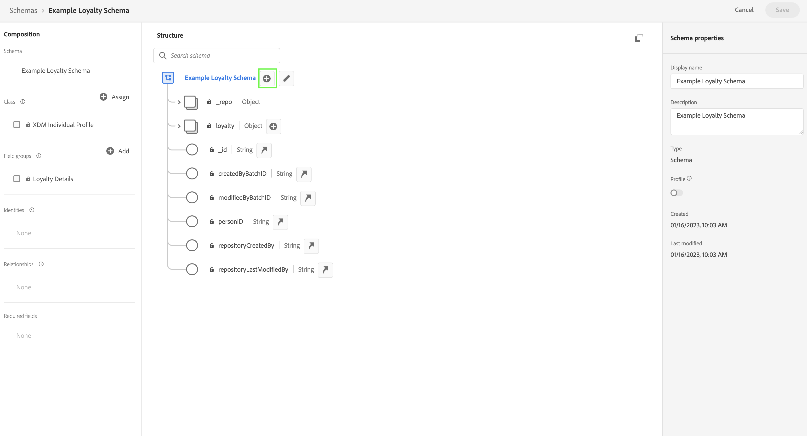

1. Nel pannello [!UICONTROL Proprietà campo], immetti `Identification` come nome, **[!UICONTROL Identificazione]** come [!UICONTROL Nome visualizzato], seleziona **[!UICONTROL Oggetto]** come [!UICONTROL Tipo] e seleziona **[!UICONTROL Core profilo v2]** come [!UICONTROL Gruppo campi].

   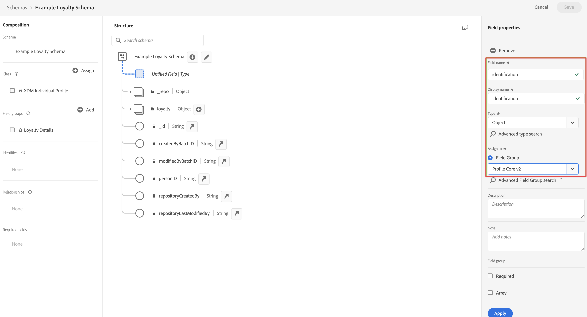

   L’oggetto di identificazione aggiunge funzionalità di individuazione dello schema. Nel tuo caso, immagina di voler identificare le informazioni sulla fidelizzazione utilizzando l’indirizzo e-mail dei tuoi dati batch.

   Seleziona **[!UICONTROL Applica]** per aggiungere questo oggetto allo schema.

1. Seleziona il campo **[!UICONTROL email]** nell&#39;oggetto di identificazione appena aggiunto, quindi seleziona **[!UICONTROL Identity]** e **[!UICONTROL Email]** dallo spazio dei nomi [!UICONTROL Identity] nel pannello [!UICONTROL Field Properties].

   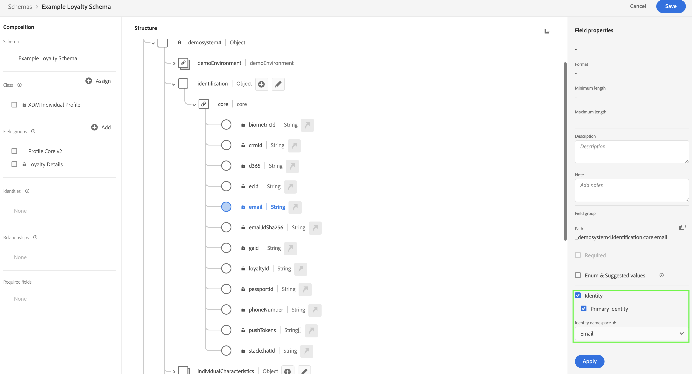

   Stai specificando l’indirizzo e-mail come identità che il servizio Adobe Experience Platform Identity può utilizzare per combinare (unire) i profili.

   Seleziona **[!UICONTROL Applica]**. Nell’attributo e-mail viene visualizzata l’icona di un’impronta digitale.

   Seleziona **[!UICONTROL Salva]**.

1. Seleziona il livello principale dello schema (con il nome dello schema), quindi seleziona l&#39;opzione **[!UICONTROL Profilo]**.

   Viene richiesto di abilitare lo schema per il profilo. Una volta abilitato, quando i dati vengono inseriti in set di dati basati su questo schema, tali dati vengono uniti su Real-Time Customer Profile.

   Per ulteriori informazioni, consulta la sezione [Abilitare lo schema per l’utilizzo in Real-Time Customer Profile](https://experienceleague.adobe.com/docs/experience-platform/xdm/tutorials/create-schema-ui.html?lang=it#profile).

   >[!IMPORTANT]
   >
   >    Una volta salvato uno schema abilitato per il profilo, non è più possibile disattivarlo per il profilo.

   

1. Seleziona **[!UICONTROL Salva]** per salvare lo schema.

Hai creato uno schema minimo che modella i dati di fidelizzazione che puoi inserire in Adobe Experience Platform. Lo schema consente l’identificazione dei profili tramite l’indirizzo e-mail. Abilitando lo schema per il profilo, garantisci che i dati del tuo file batch vengano aggiunti a Real-Time Customer Profile.

Per ulteriori informazioni sull’aggiunta e la rimozione di gruppi di campi e singoli campi a uno schema, consulta la sezione [Creare e modificare schemi nell’interfaccia utente](https://experienceleague.adobe.com/docs/experience-platform/xdm/ui/resources/schemas.html?lang=it).

### Configurare un set di dati

Con lo schema, hai definito il modello dati. Ora devi definire il costrutto per memorizzare e gestire tali dati, che viene eseguito tramite set di dati.

Per configurare il set di dati:

1. Nell&#39;interfaccia utente di Adobe Experience Platform, nella barra a sinistra, seleziona **[!UICONTROL Set di dati]** in [!UICONTROL GESTIONE DATI].

2. Seleziona **[!UICONTROL Crea set di dati]**.

   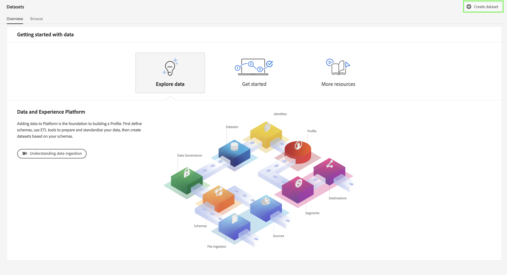

3. Seleziona **[!UICONTROL Crea set di dati dallo schema]**.

   

4. Seleziona lo schema creato in precedenza e seleziona **[!UICONTROL Successivo]**.

5. Assegna un nome al set di dati e (facoltativamente) fornisci una descrizione.

   

6. Seleziona **[!UICONTROL Fine]**.

7. Selezionare l&#39;opzione **[!UICONTROL Profilo]**.

   Viene richiesto di abilitare il set di dati per il profilo. Una volta abilitato, il set di dati arricchisce i profili dei clienti in tempo reale con i relativi dati inseriti.

   >[!IMPORTANT]
   >
   >Puoi abilitare un set di dati per il profilo solo quando lo schema a cui aderisce il set di dati è abilitato anche per il profilo.

   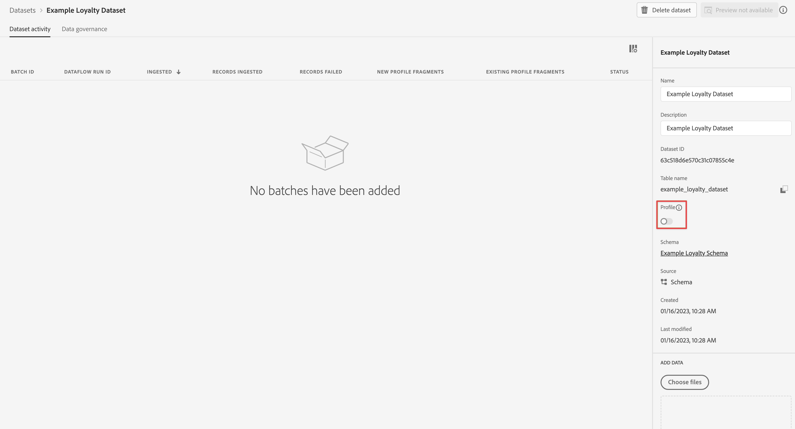

Per ulteriori informazioni su come visualizzare, visualizzare in anteprima, creare, eliminare un set di dati, consulta la sezione [Guida all’interfaccia utente dei set di dati](https://experienceleague.adobe.com/docs/experience-platform/catalog/datasets/user-guide.html?lang=it). E come abilitare un set di dati per Real-Time Customer Profile.


## Utilizzare i flussi di lavoro

Utilizza la funzionalità del flusso di lavoro per caricare i dati batch in Adobe Experience Platform. Il file batch di esempio in uso è un file CSV con il seguente contenuto:

```
email,loyaltyID,points,status
abrocking0@blog.com,793406,82.16,Silver
wnichol1@ycombinator.com,988654,40.39,Gold
paisbett2@slideshare.net,444897,91.25,Bronze
bdiamant3@xinhuanet.com,239658,57.87,Gold
ppales4@nsw.gov.au,365384,82.71,Silver
...
```

Per utilizzare i flussi di lavoro:

1. Nell&#39;interfaccia utente di Platform, seleziona **[!UICONTROL Flussi di lavoro]** nella barra a sinistra.

2. Seleziona **[!UICONTROL Mappa CSV su schema XDM]**. Seleziona **[!UICONTROL Lancio]**.

   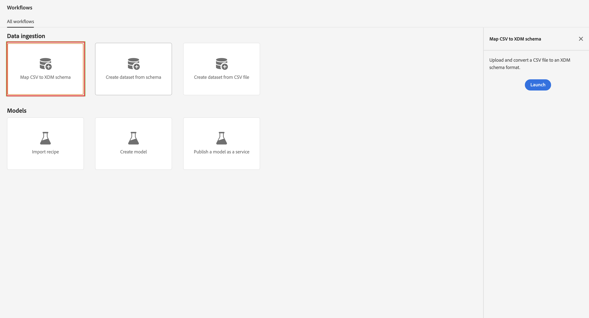

3. Nella schermata [!UICONTROL Mappa da CSV a schema XDM], nel passaggio [!UICONTROL Dettagli flusso di dati]:

   Seleziona **[!UICONTROL Set di dati esistente]**, seleziona il set di dati dall&#39;elenco e assegna un nome al [!UICONTROL nome flusso di dati].

   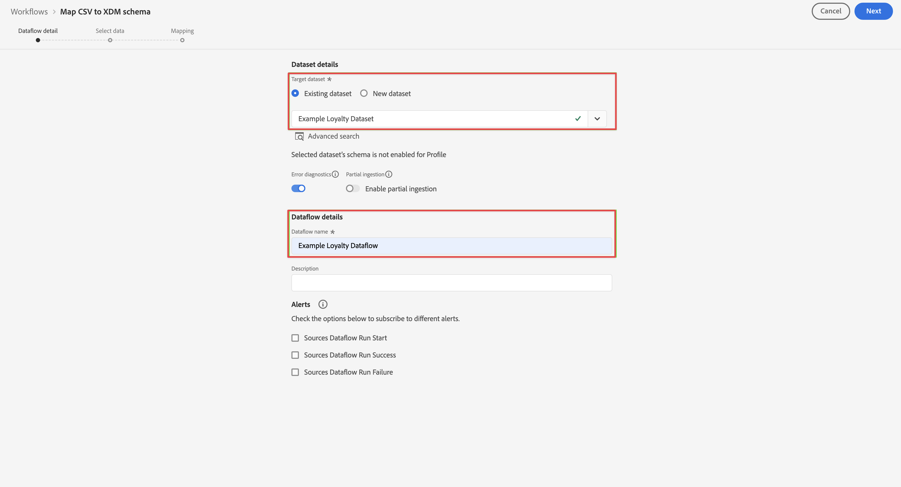

   Seleziona **[!UICONTROL Avanti]**.

4. Nel passaggio [!UICONTROL Seleziona dati]:

   Trascina e rilascia o seleziona **[!UICONTROL Scegli i file]** per selezionare il file CSV con i dati fedeltà. Viene visualizzata un’anteprima dei dati di fidelizzazione.

   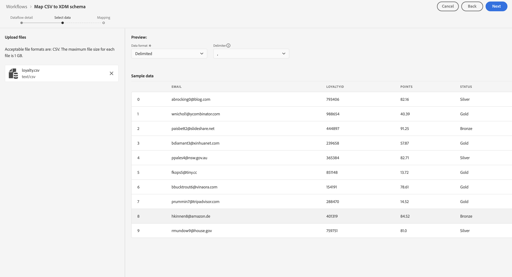

   Seleziona **[!UICONTROL Avanti]**.

5. Nel passaggio [!UICONTROL Mappatura]:

   Mappa i dati dal file CSV ai dati nello schema. Utilizzando l’intelligenza artificiale, la funzionalità del flusso di lavoro tenta di mappare automaticamente i campi dei dati batch ai campi dello schema.

   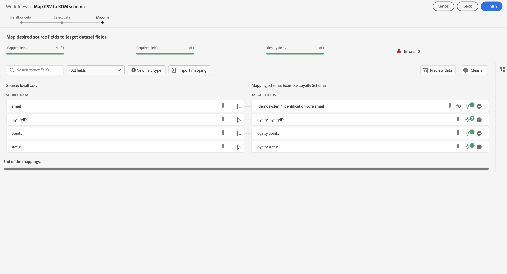

   Puoi utilizzare **[!UICONTROL Anteprima dati]** per visualizzare un&#39;anteprima dei dati mappati.

   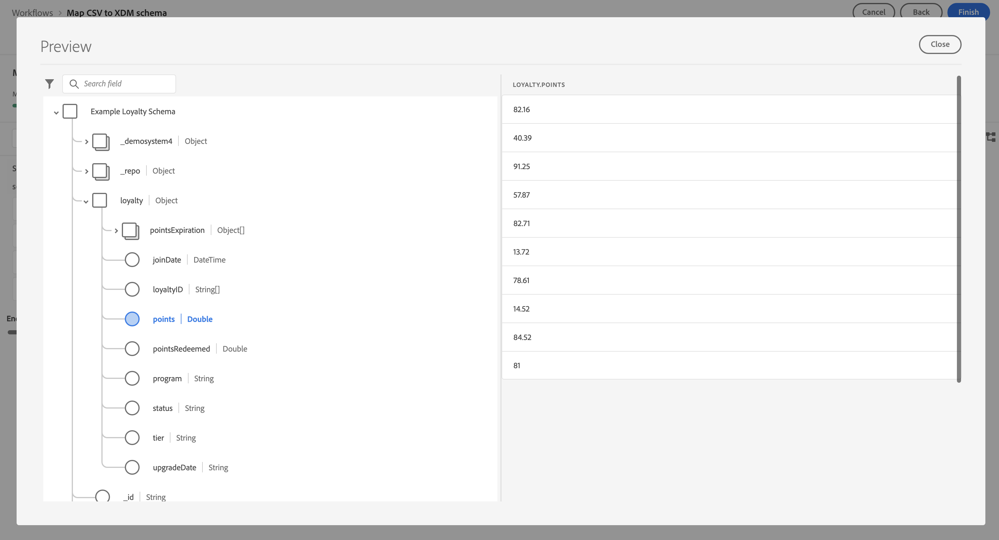

6. Seleziona **[!UICONTROL Fine]** per iniziare ad acquisire i dati batch in Adobe Experience Platform.

Consulta [Mappare un file CSV in cima a uno schema XDM esistente](https://experienceleague.adobe.com/docs/experience-platform/ingestion/tutorials/map-csv/existing-schema.html?lang=it) per ulteriori informazioni su:

- come mappare i dati quando i dati in arrivo non sono compatibili con lo schema XDM.
- utilizzare modelli di mappatura,
- utilizzare i campi calcolati per garantire che i dati batch siano conformi a quanto previsto dallo schema,
- e altro ancora.


## Configurare una connessione

Per utilizzare i dati di Adobe Experience Platform in Customer Journey Analytics, crea una connessione che include i dati risultanti dalla configurazione dello schema, del set di dati e del flusso di lavoro.

Una connessione consente di integrare set di dati da Adobe Experience Platform in Workspace. Per creare rapporti su questi set di dati, devi prima stabilire una connessione tra i set di dati in Adobe Experience Platform e Workspace.

Per creare la connessione:

1. Nell&#39;interfaccia utente di Customer Journey Analytics, seleziona **[!UICONTROL Connessioni]**, facoltativamente da **[!UICONTROL Gestione dati]**, nel menu principale.

2. Seleziona **[!UICONTROL Crea nuova connessione]**.

3. Nella schermata [!UICONTROL Connessione senza titolo]:

   Denomina e descrivi la connessione in [!UICONTROL Impostazioni connessione].

   Selezionare la sandbox corretta dall&#39;elenco [!UICONTROL Sandbox] in [!UICONTROL Impostazioni dati] e selezionare il numero di eventi giornalieri dall&#39;elenco [!UICONTROL Numero medio di eventi giornalieri].

   

   Seleziona **[!UICONTROL Aggiungi set di dati]**.

   Nel passaggio [!UICONTROL Seleziona set di dati] in [!UICONTROL Aggiungi set di dati]:

   - Seleziona il set di dati creato in precedenza (`Example Loyalty Dataset` (Set di dati di fidelizzazione di esempio)) e qualsiasi altro set di dati da includere nella connessione.

     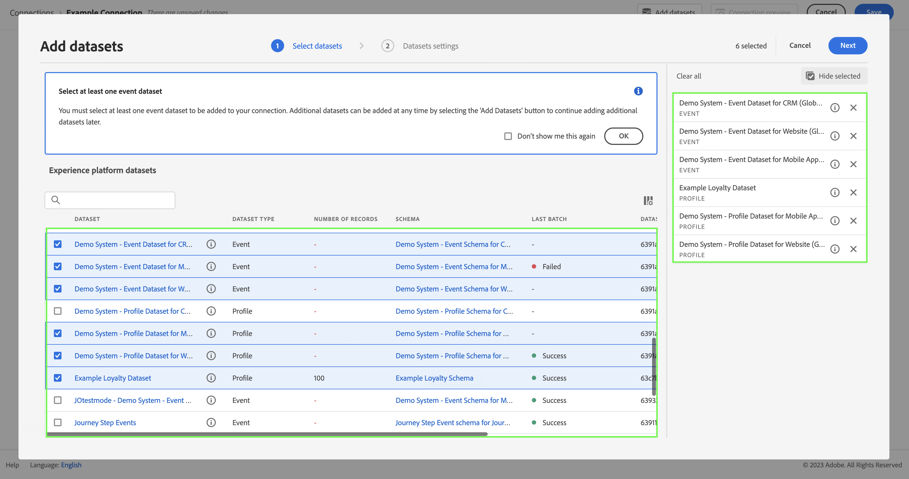

   - Seleziona **[!UICONTROL Avanti]**.

   Nel passaggio [!UICONTROL Impostazioni set di dati] in [!UICONTROL Aggiungi set di dati]:

   - Per ogni set di dati:

      - Seleziona un [!UICONTROL ID persona] dalle identità disponibili definite negli schemi di set di dati in Adobe Experience Platform.

      - Selezionare l&#39;origine dati corretta dall&#39;elenco [!UICONTROL Tipo origine dati]. Se si specifica **[!UICONTROL Altro]**, aggiungere una descrizione per l&#39;origine dati.

      - Imposta **[!UICONTROL Importa tutti i nuovi dati]** e **[!UICONTROL Recupera i dati esistenti del set di dati]** in base alle tue preferenze.

     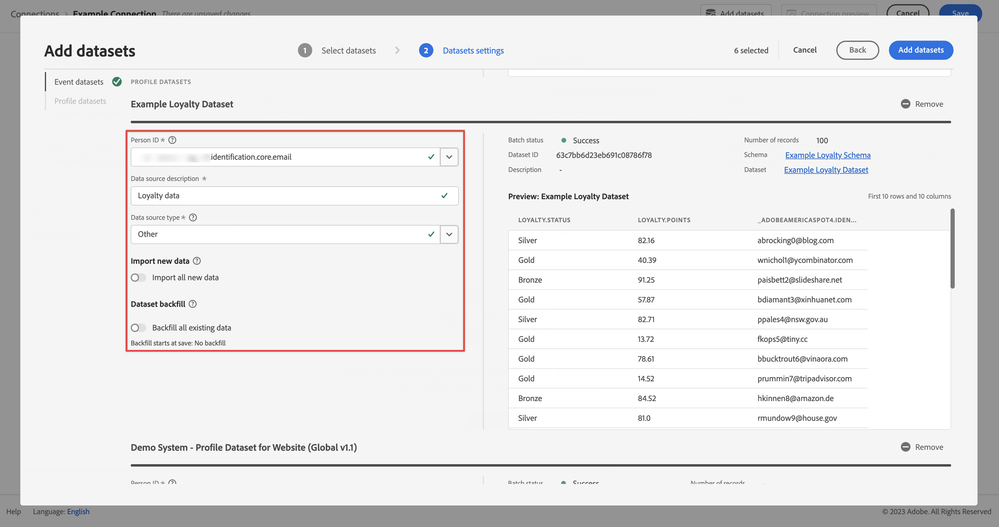

   - Seleziona **[!UICONTROL Aggiungi set di dati]**.

   Seleziona **[!UICONTROL Salva]**.

Per ulteriori informazioni su come creare e gestire una connessione e come selezionare e combinare i set di dati, consulta la sezione [Panoramica delle connessioni](../connections/overview.md).

## Configurare una visualizzazione dati

Una visualizzazione dati è un contenitore specifico di Customer Journey Analytics che consente di determinare come interpretare i dati da una connessione. Specifica tutte le dimensioni e le metriche disponibili in Analysis Workspace, e da quali colonne tali dimensioni e metriche ottengono i loro dati. Le visualizzazioni dati sono definite in preparazione alle attività di reporting in Analysis Workspace.

Per creare la visualizzazione dati:

1. Nell&#39;interfaccia utente di Customer Journey Analytics, seleziona **[!UICONTROL Visualizzazioni dati]**, facoltativamente da **[!UICONTROL Gestione dati]**, nel menu principale.

2. Selezionare **[!UICONTROL Crea nuova visualizzazione dati]**.

3. Nel passaggio [!UICONTROL Configura]:

   Selezionare la connessione dall&#39;elenco [!UICONTROL Connessione].

   Assegna un nome e (facoltativamente) una descrizione alla connessione.

   

   Seleziona **[!UICONTROL Salva e continua]**.

4. Nel passaggio [!UICONTROL Componenti]:

   Aggiungi qualsiasi campo schema e/o componente standard da includere nelle caselle dei componenti [!UICONTROL METRICS] o [!UICONTROL DIMENSIONS].

   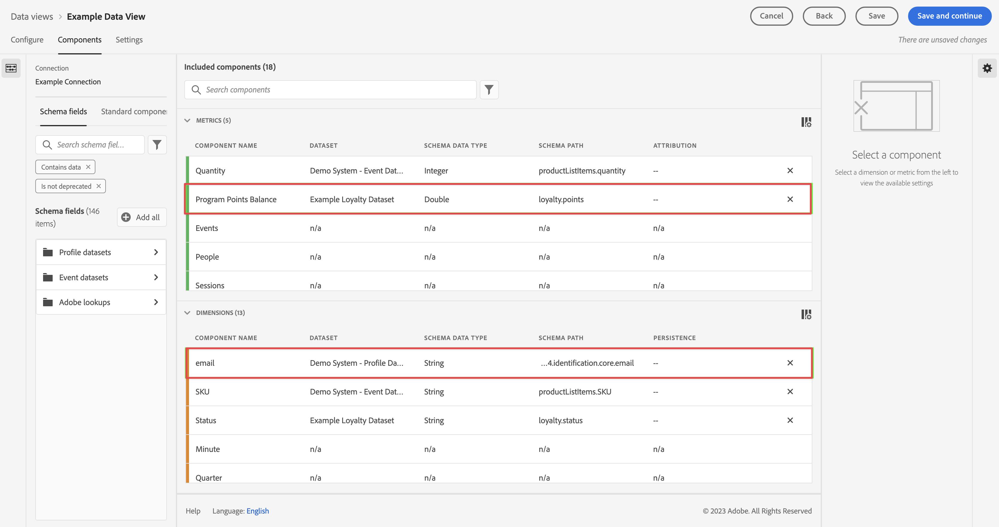

   Seleziona **[!UICONTROL Salva e continua]**.

5. Nel passaggio [!UICONTROL Impostazioni]:

   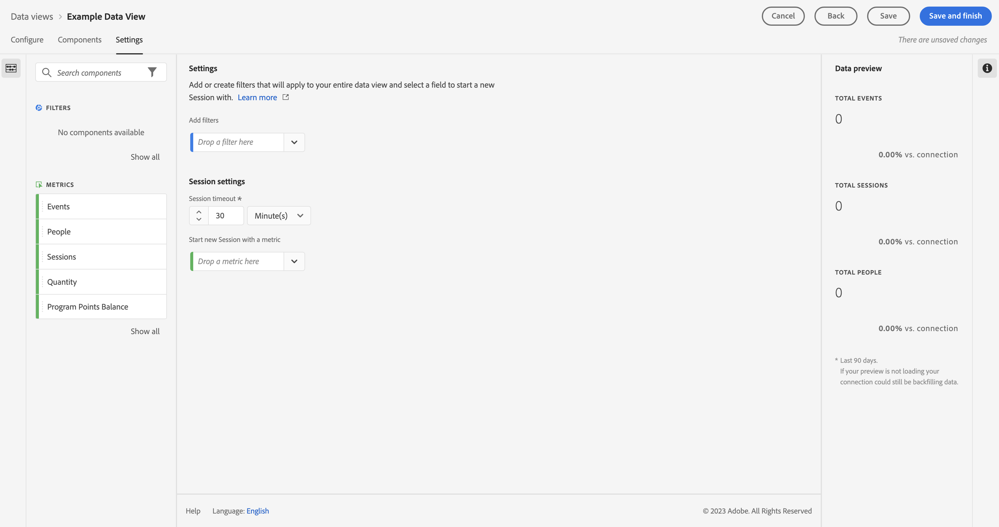

   Lasciare le impostazioni immutate e selezionare **[!UICONTROL Salva e termina]**.

Consulta [Panoramica delle visualizzazioni dati](../data-views/data-views.md) per ulteriori informazioni su come creare e modificare una visualizzazione dati, quali componenti sono disponibili per l&#39;utilizzo nella visualizzazione dati e come utilizzare le impostazioni di segmenti e sessioni.


## Configurare un progetto

Analysis Workspace è uno strumento basato su browser flessibile che consente di creare rapidamente le analisi e condividere i dati rilevati sulla base dei tuoi dati. Usa i progetti Workspace per combinare componenti dati, tabelle e visualizzazioni per sviluppare analisi da condividere con altri nella tua organizzazione.

Per creare il progetto:

1. Nell&#39;interfaccia utente di Customer Journey Analytics, seleziona **[!UICONTROL Progetti]** nel menu principale.

2. Seleziona **[!UICONTROL Progetti]** nel menu di navigazione a sinistra.

3. Seleziona **[!UICONTROL Crea progetto]**.

   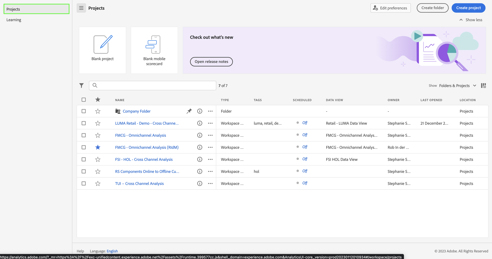

   Seleziona **[!UICONTROL Progetto vuoto]**.

   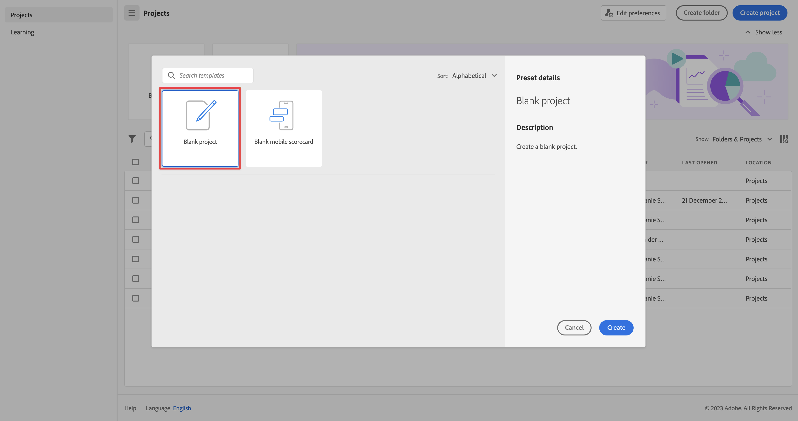

4. Seleziona la visualizzazione dati dall’elenco.

   .

5. Per creare il primo rapporto, inizia a trascinare dimensioni e metriche sulla [!UICONTROL tabella a forma libera] nel [!UICONTROL pannello]. Ad esempio, trascina `Program Points Balance` e `Page View` come metriche e `email` come dimensione per ottenere una panoramica rapida dei profili che hanno visitato il tuo sito Web e che fanno parte del programma di fidelizzazione per la raccolta di punti di fidelizzazione.

   

Per ulteriori informazioni su come creare progetti e generare analisi utilizzando componenti, visualizzazioni e pannelli, consulta la sezione [Panoramica di Analysis Workspace](../analysis-workspace/home.md).

>[!SUCCESS]
>
>Hai completato tutti i passaggi. Partendo dalla definizione dei dati di fidelizzazione da raccogliere (schema) e di dove memorizzarli (set di dati) in Adobe Experience Platform, hai configurato un flusso di lavoro per caricare in batch i dati di fidelizzazione in un set di dati. Hai definito una connessione in Customer Journey Analytics per utilizzare i dati di fidelizzazione inseriti e altri dati. La definizione della visualizzazione dati ti consente di specificare la dimensione e le metriche da utilizzare e infine hai creato il tuo primo progetto per la visualizzazione e l’analisi dei dati.
