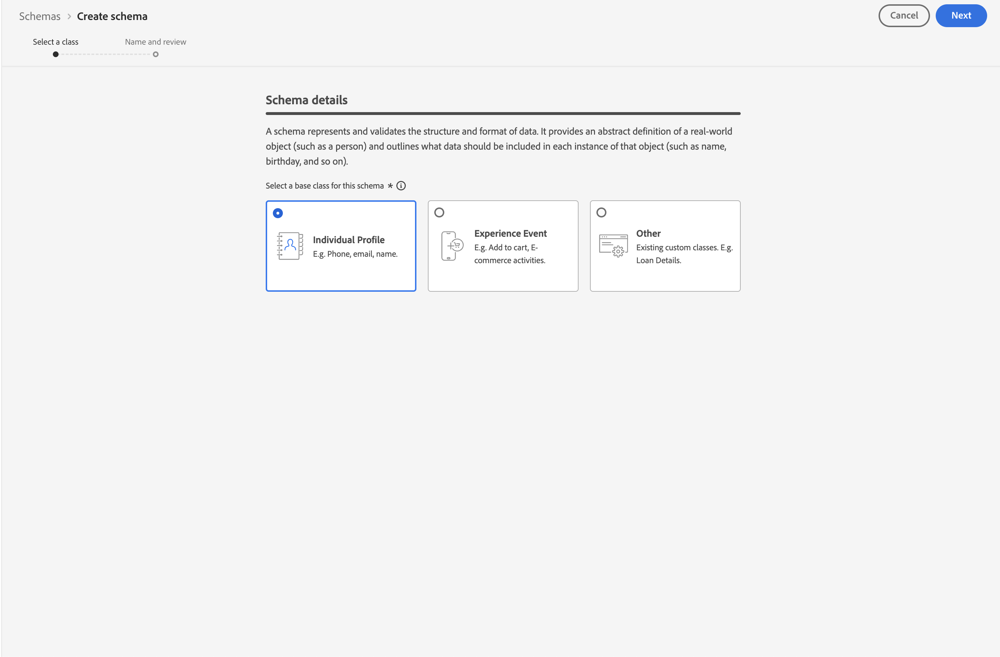
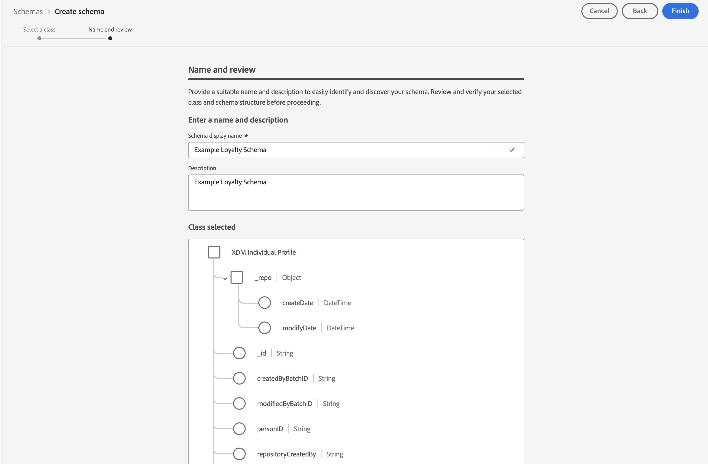

# Inserire e utilizzare dati batch

Questa guida introduttiva spiega come inserire dati batch in Adobe Experience Platform e utilizzarli in Customer Journey Analytics.

A questo scopo, è necessario:

- **Configurare uno schema e un set di dati** in Adobe Experience Platform per definire il modello (schema) dei dati da raccogliere e dove raccogliere effettivamente i dati (set di dati).

- **Utilizzare i flussi di lavoro** per caricare facilmente i dati batch nel set di dati configurato in Adobe Experience Platform.

- **Impostare una connessione** in Customer Journey Analytics. Questa connessione deve includere almeno il set di dati di Adobe Experience Platform.

- **Configurare una visualizzazione dati** in Customer Journey Analytics per definire le metriche e le dimensioni da utilizzare in Analysis Workspace.

- **Configurare un progetto** in Customer Journey Analytics per generare rapporti e visualizzazioni.

>[!NOTE]
>
>Questa guida rapida è una guida semplificata su come acquisire dati batch in Adobe Experience Platform e utilizzarli in Customer Journey Analytics. Ti consigliamo vivamente di esaminare le informazioni aggiuntive quando vi fai riferimento.

## Configurare uno schema e un set di dati

Per inserire i dati in Adobe Experience Platform, innanzitutto devi definire quali dati desideri raccogliere. Tutti i dati inseriti in Adobe Experience Platform devono essere conformi a una struttura standard e denormalizzata affinché vengano riconosciuti e utilizzati dalle capacità e funzionalità a valle. Experience Data Model (XDM) è il framework standard che fornisce questa struttura sotto forma di schemi.

Una volta definito uno schema, utilizza uno o più set di dati per memorizzare e gestire la raccolta di dati. Un set di dati è un costrutto di archiviazione e gestione per una raccolta di dati (in genere una tabella) che contiene uno schema (colonne) e dei campi (righe).

Tutti i dati inseriti in Adobe Experience Platform devono essere conformi a uno schema predefinito prima di poter essere memorizzati come set di dati.

### Configurare uno schema

Per questa introduzione, immagina di voler raccogliere alcuni dati relativi alla fidelizzazione, ad esempio ID di fidelizzazione, punti di fidelizzazione e stato di fidelizzazione.
Devi innanzitutto definire uno schema che modella questi dati.

Per configurare lo schema:

1. Nell’interfaccia utente di Adobe Experience Platform, nella barra a sinistra, seleziona **[!UICONTROL Schemas]** (Schemi) all’interno di [!UICONTROL DATA MANAGEMENT] (GESTIONE DATI).

1. Seleziona **[!UICONTROL Create schema]**.
.
1. Nel passaggio Selezionare una classe della procedura guidata Crea schema:

   1. Seleziona **[!UICONTROL Individual Profile]**.

      

      >[!INFO]
      >
      >    Per modellare l’evento viene utilizzato uno schema Experience Event _comportamento_ di un profilo (come nome della scena, pulsante per aggiungerlo al carrello). Per modellare gli _attributi_ del profilo (come nome, e-mail, genere) viene utilizzato uno schema Individual Profile.

   1. Seleziona **[!UICONTROL Next]**.


1. In [!UICONTROL Name and review step] del [!UICONTROL Create schema] procedura guidata:

   1. Immetti un **[!UICONTROL Schema display name]** per lo schema e (facoltativo) un **[!UICONTROL Description]**.

      

   1. Seleziona **[!UICONTROL Finish]**.

1. Nella scheda Struttura dello schema di esempio:

   1. Seleziona **[!UICONTROL + Add]** (Aggiungi) in [!UICONTROL Field groups] (Gruppi di campi).

      

      I gruppi di campi sono raccolte riutilizzabili di oggetti e attributi che consentono di estendere facilmente lo schema.

   1. Nella finestra di dialogo [!UICONTROL Add fields groups] (Aggiungi gruppi di campi) seleziona il gruppo di campi **[!UICONTROL Loyalty Details]** dall’elenco.

      

      Puoi selezionare il pulsante di anteprima per visualizzare un’anteprima dei campi che fanno parte del gruppo di campi.

      

      Seleziona **[!UICONTROL Back]** (Indietro) per chiudere l’anteprima.

   1. Seleziona **[!UICONTROL Add field groups]** (Aggiungi gruppi di campi).

1. Seleziona **[!UICONTROL +]** accanto al nome dello schema nel pannello [!UICONTROL Structure] (Struttura).

   

1. Nel pannello [!UICONTROL Field Properties] (Proprietà campo), inserisci `Identification` come nome, **[!UICONTROL Identification]** (Identificazione) come [!UICONTROL Display name] (Nome di visualizzazione), seleziona **[!UICONTROL Object]** (Oggetto) come [!UICONTROL Type] (Tipo) e seleziona **[!UICONTROL Profile Core v2]** come [!UICONTROL Field Group] (Gruppo di campo).

   

   L’oggetto di identificazione aggiunge funzionalità di identificazione allo schema. Nel tuo caso, immagina di voler identificare le informazioni sulla fidelizzazione utilizzando l’indirizzo e-mail dei tuoi dati batch.

   Seleziona **[!UICONTROL Apply]** (Applica) per aggiungere questo oggetto allo schema.

1. Seleziona il campo **[!UICONTROL email]** nell’oggetto di identificazione appena aggiunto e seleziona **[!UICONTROL Identity]** (identità) e **[!UICONTROL Email]** dall’elenco [!UICONTROL Identity namespace] (Spazio dei nomi dell’identità) nel pannello [!UICONTROL Field Properties] (Proprietà campo).

   

   Stai specificando l’indirizzo e-mail come identità che il servizio Adobe Experience Platform Identity può utilizzare per combinare (unire) i profili.

   Seleziona **[!UICONTROL Apply]** (Applica). Nell’attributo e-mail viene visualizzata l’icona di un’impronta digitale.

   Seleziona **[!UICONTROL Save]** (Salva).

1. Seleziona il livello principale dello schema (con il nome dello schema), quindi seleziona il pulsante **[!UICONTROL Profile]** (Profilo).

   Viene richiesto di abilitare lo schema per il profilo. Una volta abilitato, quando i dati vengono inseriti in set di dati basati su questo schema, tali dati vengono uniti su Real-Time Customer Profile.

   Per ulteriori informazioni, consulta la sezione [Abilitare lo schema per l’utilizzo in Real-Time Customer Profile](https://experienceleague.adobe.com/docs/experience-platform/xdm/tutorials/create-schema-ui.html?lang=it#profile).

   >[!IMPORTANT]
   >
   >    Una volta salvato uno schema abilitato per il profilo, non è più possibile disattivarlo per il profilo.

   

1. Seleziona **[!UICONTROL Save]** (Salva) per salvare lo schema.

Hai creato uno schema minimo che modella i dati di fidelizzazione che puoi inserire in Adobe Experience Platform. Lo schema consente l’identificazione dei profili tramite l’indirizzo e-mail. Attivando lo schema per il profilo, garantisci che i dati del tuo file batch vengano aggiunti a Real-Time Customer Profile.

Per ulteriori informazioni sull’aggiunta e la rimozione di gruppi di campi e singoli campi a uno schema, consulta la sezione [Creare e modificare schemi nell’interfaccia utente](https://experienceleague.adobe.com/docs/experience-platform/xdm/ui/resources/schemas.html?lang=it).

### Configurare un set di dati

Con lo schema, hai definito il modello dati. Ora devi definire il costrutto per memorizzare e gestire tali dati, che viene eseguito tramite set di dati.

Per configurare il set di dati:

1. Nell’interfaccia utente di Adobe Experience Platform, nella barra a sinistra, seleziona **[!UICONTROL Datasets]** (Set di dati) all’interno di [!UICONTROL DATA MANAGEMENT] (GESTIONE DATI).

2. Seleziona **[!UICONTROL Create dataset]** (Crea set di dati).

   

3. Seleziona **[!UICONTROL Create dataset from schema]** (Crea set di dati da schema).

   

4. Seleziona lo schema creato in precedenza e seleziona **[!UICONTROL Next]** (Avanti).

5. Assegna un nome al set di dati e (facoltativamente) fornisci una descrizione.

   

6. Seleziona **[!UICONTROL Finish]** (Fine).

7. Seleziona il pulsante **[!UICONTROL Profile]** (Profilo).

   Viene richiesto di abilitare il set di dati per il profilo. Una volta attivato, il set di dati arricchisce i profili dei clienti in tempo reale con i relativi dati inseriti.

   >[!IMPORTANT]
   >
   >Puoi abilitare un set di dati per il profilo solo quando lo schema a cui aderisce il set di dati è abilitato anche per il profilo.

   

Per ulteriori informazioni su come visualizzare, visualizzare in anteprima, creare, eliminare un set di dati, consulta la sezione [Guida all’interfaccia utente dei set di dati](https://experienceleague.adobe.com/docs/experience-platform/catalog/datasets/user-guide.html?lang=it). E come abilitare un set di dati per Real-Time Customer Profile.


## Utilizzare i flussi di lavoro

Utilizza la funzionalità del flusso di lavoro per caricare i dati batch in Adobe Experience Platform. Il file batch di esempio in uso è un file CSV con il seguente contenuto:

```
email,loyaltyID,points,status
abrocking0@blog.com,793406,82.16,Silver
wnichol1@ycombinator.com,988654,40.39,Gold
paisbett2@slideshare.net,444897,91.25,Bronze
bdiamant3@xinhuanet.com,239658,57.87,Gold
ppales4@nsw.gov.au,365384,82.71,Silver
...
```

Per utilizzare i flussi di lavoro:

1. Nell’interfaccia utente di Platform, seleziona **[!UICONTROL Workflows]** (Flussi di lavoro) nella barra a sinistra.

2. Seleziona **[!UICONTROL Map CSV to XDM schema]** (Mappa CSV a schema XDM). Seleziona **[!UICONTROL Launch]** (Avvia).

   

3. In [!UICONTROL Map CSV to XDM schema] (Mappa CSV a schema XDM) nel passaggio [!UICONTROL Dataflow detail] (Dettagli flusso di dati):

   Seleziona **[!UICONTROL Existing dataset]** (Set di dati esistente), seleziona il set di dati dall’elenco dei set di dati e assegna un nome a [!UICONTROL Dataflow name] (Nome del flusso di dati).

   

   Seleziona **[!UICONTROL Next]** (Avvia).

4. Nel passaggio [!UICONTROL Select data] (Seleziona dati):

   Trascina e rilascia o seleziona **[!UICONTROL Choose files]** (Scegli file) per selezionare il file CSV con i dati di fidelizzazione. Viene visualizzata un’anteprima dei dati di fidelizzazione.

   

   Seleziona **[!UICONTROL Next]** (Avanti).

5. Nel passaggio [!UICONTROL Mapping] (Mappatura):

   Mappa i dati dal file CSV ai dati nello schema. Utilizzando l’intelligenza artificiale, la funzionalità del flusso di lavoro tenta di mappare automaticamente i campi dei dati batch ai campi dello schema.

   

   Puoi utilizzare **[!UICONTROL Preview data]** (Anteprima dati) per visualizzare un’anteprima dei dati mappati.

   

6. Seleziona **[!UICONTROL Finish]** (Fine) per iniziare a inserire i dati batch in Adobe Experience Platform.

Consulta [Mappare un file CSV sopra uno schema XDM esistente](https://experienceleague.adobe.com/docs/experience-platform/ingestion/tutorials/map-csv/existing-schema.html?lang=it) per ulteriori informazioni su:

- come mappare i dati quando i dati in arrivo non sono compatibili con lo schema XDM.
- utilizzare modelli di mappatura,
- utilizzare i campi calcolati per garantire che i dati batch siano conformi a quanto previsto dallo schema,
- E altro ancora.


## Configurare una connessione

Per utilizzare i dati di Adobe Experience Platform in Customer Journey Analytics, crea una connessione che include i dati risultanti dalla configurazione dello schema, del set di dati e del flusso di lavoro.

Una connessione consente di integrare set di dati da Adobe Experience Platform in Workspace. Per creare rapporti su questi set di dati, devi prima stabilire una connessione tra i set di dati in Adobe Experience Platform e Workspace.

Per creare la connessione:

1. Nell’interfaccia utente di Customer Journey Analytics, seleziona **[!UICONTROL Connections]** (Connessioni) nel pannello di navigazione superiore.

2. Seleziona **[!UICONTROL Create new connection]** (Crea uova connessione).

3. Nella schermata [!UICONTROL Untitled connection] (Connessione senza titolo):

   Assegna un nome e una descrizione alla connessione in [!UICONTROL Connection Settings] (Impostazioni della connessione).

   Seleziona la sandbox corretta dall’elenco [!UICONTROL Sandbox] in [!UICONTROL Data settings] (Impostazioni dati) e seleziona il numero di eventi giornalieri dall’elenco [!UICONTROL Average number of daily events] (Numero medio di eventi giornalieri).

   

   Seleziona **[!UICONTROL Add datasets]** (Aggiungi set di dati).

   Nel passaggio [!UICONTROL Select datasets] (Seleziona set di dati) in [!UICONTROL Add datasets] (Aggiungi set di dati):

   - Seleziona il set di dati creato in precedenza (`Example Loyalty Dataset` (Set di dati di fidelizzazione di esempio)) e qualsiasi altro set di dati da includere nella connessione.

     

   - Seleziona **[!UICONTROL Next]** (Avanti).

   Nel passaggio [!UICONTROL Datasets settings] (Impostazioni set di dati) in [!UICONTROL Add datasets] (Aggiungi set di dati):

   - Per ogni set di dati:

      - Seleziona un [!UICONTROL Person ID] (ID persona) tra le identità disponibili definite negli schemi di set di dati in Adobe Experience Platform.

      - Seleziona l’origine dati corretta dall’elenco [!UICONTROL Data source type] (Tipo di origine dati). Se specifichi **[!UICONTROL Other]** (Altro), aggiungi una descrizione per l’origine dati.

      - Imposta **[!UICONTROL Import all new data]** (Importa tutti i nuovi dati) e **[!UICONTROL Dataset backfill existing data]** (Dati esistenti di backfill del set di dati) secondo le tue preferenze.

     

   - Seleziona **[!UICONTROL Add datasets]** (Aggiungi set di dati).

   Seleziona **[!UICONTROL Save]** (Salva).

Per ulteriori informazioni su come creare e gestire una connessione e come selezionare e combinare i set di dati, consulta la sezione [Panoramica delle connessioni](../connections/overview.md).

## Configurare una visualizzazione dati

Una visualizzazione dati è un contenitore specifico di Customer Journey Analytics che consente di determinare come interpretare i dati da una connessione. Specifica tutte le dimensioni e le metriche disponibili in Analysis Workspace, e da quali colonne tali dimensioni e metriche ottengono i loro dati. Le visualizzazioni dati sono definite in preparazione alle attività di reporting in Analysis Workspace.

Per creare la visualizzazione dati:

1. Nell’interfaccia utente di Customer Journey Analytics, seleziona **[!UICONTROL Data views]** (Visualizzazioni dati) nel pannello di navigazione superiore.

2. Seleziona **[!UICONTROL Create new data view]** (Crea nuova visualizzazione dati).

3. Nel passaggio [!UICONTROL Configure] (Configura):

   Seleziona la connessione dall’elenco [!UICONTROL Connection] (Connessioni).

   Assegna un nome e (facoltativamente) una descrizione alla connessione.

   

   Seleziona **[!UICONTROL Save and continue]** (Salva e continua).

4. Nel passaggio [!UICONTROL Components] (Componenti):

   Aggiungi qualsiasi campo dello schema e/o componente standard che desideri includere nelle caselle dei componenti [!UICONTROL METRICS] (METRICHE) o [!UICONTROL DIMENSIONS] (DIMENSIONI).

   

   Seleziona **[!UICONTROL Save and continue]** (Salva e continua).

5. Nel passaggio [!UICONTROL Settings] (Impostazioni):

   

   Lascia le impostazioni così come sono e seleziona **[!UICONTROL Save and finish]** (Salva e fine).

Per ulteriori informazioni su come creare e modificare una visualizzazione dati, quali componenti sono disponibili per la visualizzazione dati e come utilizzare le impostazioni di filtro e sessioni, consulta la sezione [Panoramica delle visualizzazioni dati](../data-views/data-views.md).


## Configurare un progetto

Analysis Workspace è uno strumento basato su browser flessibile che consente di creare rapidamente le analisi e condividere i dati rilevati sulla base dei tuoi dati. Usa i progetti Workspace per combinare componenti dati, tabelle e visualizzazioni per sviluppare analisi da condividere con altri nella tua organizzazione.

Per creare il progetto:

1. Nell’interfaccia utente di Customer Journey Analytics, seleziona **[!UICONTROL Projects]** (Progetti) nel pannello di navigazione superiore.

2. Seleziona **[!UICONTROL Projects]** (Progetti) nel pannello di navigazione a sinistra.

3. Seleziona **[!UICONTROL Create project]** (Crea progetto).

   

   Seleziona **[!UICONTROL Blank project]** (Progetto vuoto).

   

4. Seleziona la visualizzazione dati dall’elenco.

   .

5. Per creare il primo rapporto, inizia a trascinare dimensioni e metriche sulla [!UICONTROL Freeform table] nel [!UICONTROL Panel]. Ad esempio, trascina `Program Points Balance` e `Page View` come metriche e `email` come dimensione per ottenere una panoramica rapida dei profili che hanno visitato il tuo sito Web e che fanno parte del programma di fidelizzazione per la raccolta di punti di fidelizzazione.

   

Per ulteriori informazioni su come creare progetti e generare analisi utilizzando componenti, visualizzazioni e pannelli, consulta la sezione [Panoramica di Analysis Workspace](../analysis-workspace/home.md).

>[!SUCCESS]
>
>Hai completato tutti i passaggi. Partendo dalla definizione dei dati di fidelizzazione da raccogliere (schema) e di dove memorizzarli (set di dati) in Adobe Experience Platform, hai configurato un flusso di lavoro per caricare in batch i dati di fidelizzazione in un set di dati. Hai definito una connessione in Customer Journey Analytics per utilizzare i dati di fidelizzazione inseriti e altri dati. La definizione della visualizzazione dati ti consente di specificare la dimensione e le metriche da utilizzare e infine hai creato il tuo primo progetto per la visualizzazione e l’analisi dei dati.
